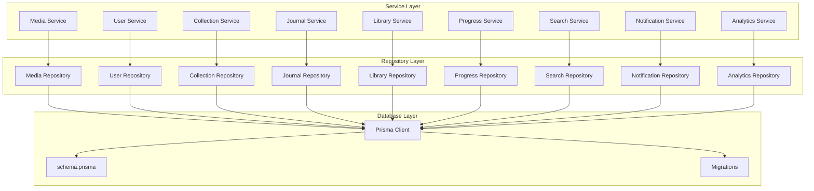
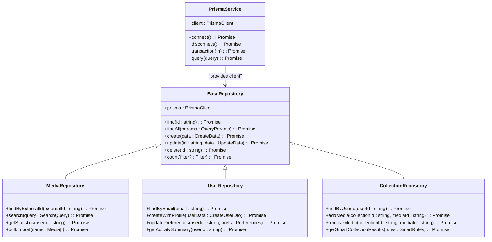
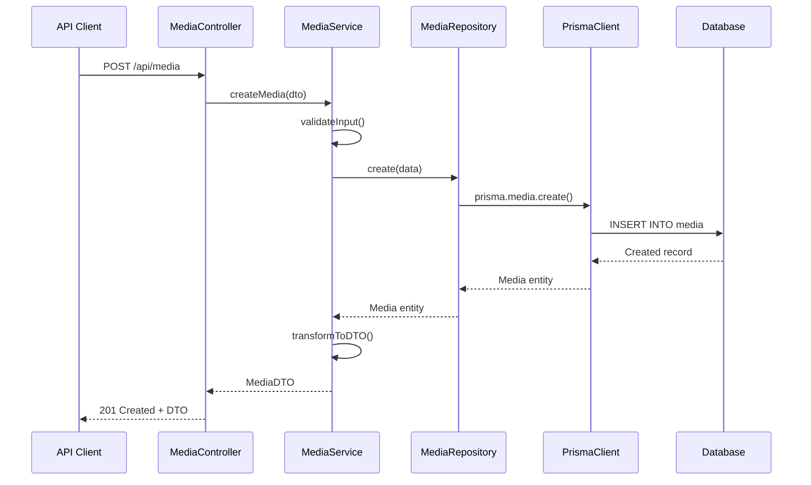
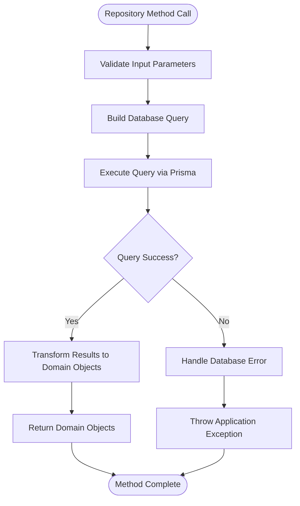
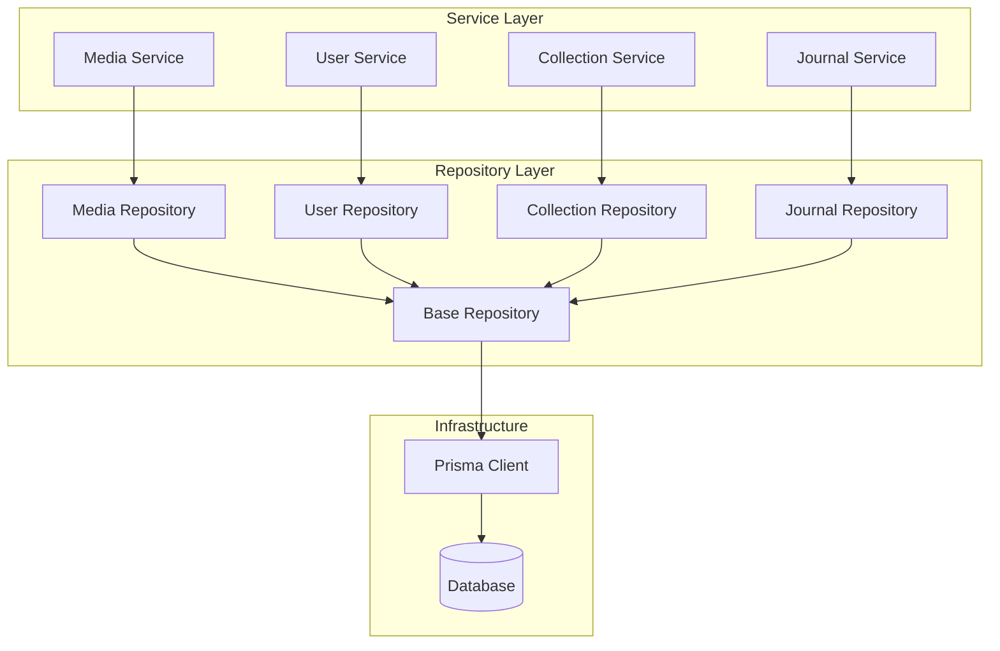

# Database Schema & Data Models

<cite>
**Referenced Files in This Document**
- [schema.prisma](file://apps/backend/prisma/schema.prisma)
- [prisma.service.ts](file://apps/backend/src/prisma/prisma.service.ts)
- [prisma.module.ts](file://apps/backend/src/prisma/prisma.module.ts)
- [media.repository.ts](file://apps/backend/src/media/media.repository.ts)
- [users.repository.ts](file://apps/backend/src/users/users.repository.ts)
- [collections.repository.ts](file://apps/backend/src/collections/collections.repository.ts)
- [journal.repository.ts](file://apps/backend/src/journal/journal.repository.ts)
- [library.repository.ts](file://apps/backend/src/library/library.repository.ts)
- [progress.repository.ts](file://apps/backend/src/progress/progress.repository.ts)
- [search.repository.ts](file://apps/backend/src/search/search.repository.ts)
- [notifications.repository.ts](file://apps/backend/src/notifications/notifications.repository.ts)
- [analytics.repository.ts](file://apps/backend/src/analytics/analytics.repository.ts)
- [backup.sh](file://apps/backend/scripts/backup.sh)
- [seed-demo-data.ts](file://apps/backend/seed-demo-data.ts)
</cite>

## Table of Contents
1. [Introduction](#introduction)
2. [Project Structure](#project-structure)
3. [Core Components](#core-components)
4. [Architecture Overview](#architecture-overview)
5. [Detailed Component Analysis](#detailed-component-analysis)
6. [Dependency Analysis](#dependency-analysis)
7. [Performance Considerations](#performance-considerations)
8. [Troubleshooting Guide](#troubleshooting-guide)
9. [Conclusion](#conclusion)

## Introduction

This document provides comprehensive documentation for the database schema and data models implemented using Prisma ORM in the Chronicle Your Media Story application. The system is designed as a media tracking and journaling platform that allows users to organize their media consumption experiences, maintain journals, track progress, and discover insights about their viewing habits.

The database architecture follows Domain-Driven Design principles with clear separation between aggregate roots, entities, and value objects. The repository pattern is extensively used to abstract data access operations, providing clean interfaces for business logic while maintaining testability and flexibility.

## Project Structure

The database layer is organized following a modular architecture where each domain feature has its own repository implementation:

**Diagram sources**
- [schema.prisma](file://apps/backend/prisma/schema.prisma)
- [prisma.service.ts](file://apps/backend/src/prisma/prisma.service.ts)
- [media.repository.ts](file://apps/backend/src/media/media.repository.ts)
- [users.repository.ts](file://apps/backend/src/users/users.repository.ts)

**Section sources**
- [schema.prisma](file://apps/backend/prisma/schema.prisma)
- [prisma.service.ts](file://apps/backend/src/prisma/prisma.service.ts)

## Core Components

### Database Schema Architecture

The Prisma schema defines the core entities and relationships that power the media tracking application. The schema follows a normalized design with proper referential integrity constraints.

#### Primary Entities

**User Entity** - Represents authenticated users with profile information and preferences
- Unique identifiers and authentication credentials
- Profile metadata including display names and avatars
- Subscription status and account settings
- Audit fields for creation and modification tracking

**Media Entity** - Core entity representing various types of media content
- Support for multiple media types (movies, TV shows, books, games)
- External reference IDs for integration with media databases
- Metadata including titles, descriptions, and release dates
- Status tracking for user interactions (watched, reading, completed)

**Collection Entity** - User-defined groupings of media items
- Manual and smart collection support
- Relationship mapping to media items
- Custom ordering and categorization
- Privacy settings and sharing capabilities

**Journal Entry Entity** - Personal reflections and notes about media experiences
- Rich text content with markdown support
- Mood and rating associations
- Timestamp tracking for chronological organization
- Linkage to specific media items

**Progress Tracking Entity** - Detailed progress monitoring for ongoing media
- Chapter/episode-level tracking
- Time-based progression metrics
- Completion percentages and milestones
- Session history and continuity

**Library Management Entity** - Organizational structure for media collections
- Hierarchical organization with parent-child relationships
- Tagging and categorization systems
- Search optimization through denormalized fields
- Bulk operations support

#### Value Objects and Aggregates

**MediaMetadata** - Immutable object containing media-specific attributes
- Type-specific properties (director, author, developer)
- Genre classifications and content ratings
- Language and region information
- Technical specifications (duration, resolution, format)

**UserProfile** - Composite value object for user preferences
- Notification preferences and communication settings
- Theme and display customization options
- Privacy controls and data sharing permissions
- Integration settings with external services

**CollectionConfig** - Configuration object for collection behavior
- Smart collection rules and filtering criteria
- Auto-population settings and update frequencies
- Export formats and backup configurations
- Sharing permissions and collaboration settings

**Section sources**
- [schema.prisma](file://apps/backend/prisma/schema.prisma)

## Architecture Overview

The database architecture implements a layered approach with clear separation of concerns:

**Diagram sources**
- [prisma.service.ts](file://apps/backend/src/prisma/prisma.service.ts)
- [media.repository.ts](file://apps/backend/src/media/media.repository.ts)
- [users.repository.ts](file://apps/backend/src/users/users.repository.ts)
- [collections.repository.ts](file://apps/backend/src/collections/collections.repository.ts)

### Data Flow Architecture

**Diagram sources**
- [media.controller.ts](file://apps/backend/src/media/media.controller.ts)
- [media.service.ts](file://apps/backend/src/media/media.service.ts)
- [media.repository.ts](file://apps/backend/src/media/media.repository.ts)

## Detailed Component Analysis

### Repository Pattern Implementation

The repository pattern provides a clean abstraction over database operations, enabling testability and loose coupling between business logic and data access layers.

#### Base Repository Interface

All repositories extend a common base class that provides standard CRUD operations and common query patterns:

**Diagram sources**
- [media.repository.ts](file://apps/backend/src/media/media.repository.ts)
- [users.repository.ts](file://apps/backend/src/users/users.repository.ts)

#### Advanced Query Patterns

Repositories implement sophisticated query patterns for complex business requirements:

**Pagination and Filtering**
- Cursor-based pagination for large datasets
- Dynamic filtering with field validation
- Sorting by multiple criteria with custom comparators
- Full-text search with relevance scoring

**Aggregation and Analytics**
- Complex aggregations for reporting dashboards
- Real-time statistics calculation
- Trend analysis and pattern detection
- Export functionality for data analysis

**Transaction Management**
- Multi-operation transactions with rollback support
- Optimistic locking for concurrent updates
- Batch operations for performance optimization
- Retry mechanisms for transient failures

**Section sources**
- [media.repository.ts](file://apps/backend/src/media/media.repository.ts)
- [users.repository.ts](file://apps/backend/src/users/users.repository.ts)
- [collections.repository.ts](file://apps/backend/src/collections/collections.repository.ts)

### Database Indexing Strategy

The indexing strategy is designed to optimize common query patterns while maintaining write performance:

#### Primary Indexes

**Unique Constraints**
- Email addresses for user authentication
- External media IDs for third-party integrations
- Collection slugs for URL routing
- Username handles for social features

**Composite Indexes**
- User ID + timestamp for activity feeds
- Collection ID + media ID for relationship queries
- Status + category for filtered listings
- Location + date for geographic searches

**Full-Text Indexes**
- Media titles and descriptions for search
- Journal content for personal note retrieval
- Tags and categories for classification
- User-generated content for discovery

#### Performance Optimization Techniques

**Query Optimization**
- Selective field projection to reduce payload size
- N+1 query prevention through eager loading
- Connection pooling for high-throughput scenarios
- Query result caching for frequently accessed data

**Write Optimization**
- Batch inserts for bulk data operations
- Upsert operations for idempotent writes
- Background processing for heavy computations
- Asynchronous index maintenance during peak hours

**Section sources**
- [schema.prisma](file://apps/backend/prisma/schema.prisma)

### Migration Management

The migration system ensures database schema evolution while maintaining data integrity:

#### Migration Strategy

**Version Control**
- Each schema change creates a new migration file
- Migration files contain both up and down operations
- Automated dependency resolution for complex migrations
- Rollback capability for development environments

**Data Preservation**
- Safe column additions with default values
- Non-destructive schema modifications
- Data transformation scripts for breaking changes
- Backup verification before destructive operations

**Deployment Pipeline**
- Pre-deployment schema validation
- Automated migration execution in CI/CD
- Post-deployment health checks
- Emergency rollback procedures

**Section sources**
- [schema.prisma](file://apps/backend/prisma/schema.prisma)

### Data Validation and Business Rules

Validation occurs at multiple layers to ensure data integrity:

#### Schema-Level Validation

**Field Constraints**
- Required fields with appropriate defaults
- Length limits and format validation
- Range validation for numeric fields
- Referential integrity through foreign keys

**Business Rule Enforcement**
- Unique constraint validation across related tables
- Conditional required fields based on entity state
- Cross-field validation for complex business logic
- Temporal constraints for time-based operations

#### Application-Level Validation

**Input Sanitization**
- XSS protection for user-generated content
- SQL injection prevention through parameterized queries
- File upload validation and sanitization
- API request validation with strict schemas

**Business Logic Validation**
- Permission checks before data modification
- State transition validation for workflow entities
- Resource availability checks for shared resources
- Rate limiting for expensive operations

**Section sources**
- [schema.prisma](file://apps/backend/prisma/schema.prisma)

### Data Seeding and Testing

Comprehensive seeding strategies support development and testing workflows:

#### Seed Data Strategy

**Development Environment**
- Realistic sample data for all entities
- Relationships and dependencies properly established
- Test accounts with predefined roles and permissions
- Sample collections and journal entries

**Testing Environment**
- Isolated test data with cleanup procedures
- Deterministic data generation for consistent tests
- Mock data for external service dependencies
- Performance testing datasets for load testing

**Backup and Recovery**
- Regular automated backups with retention policies
- Point-in-time recovery capability
- Disaster recovery procedures documented
- Backup verification and integrity checks

**Section sources**
- [seed-demo-data.ts](file://apps/backend/seed-demo-data.ts)
- [backup.sh](file://apps/backend/scripts/backup.sh)

## Dependency Analysis

The database layer maintains clear dependencies and avoids circular references:

**Diagram sources**
- [prisma.service.ts](file://apps/backend/src/prisma/prisma.service.ts)
- [media.repository.ts](file://apps/backend/src/media/media.repository.ts)
- [users.repository.ts](file://apps/backend/src/users/users.repository.ts)

### Coupling Analysis

**Low Coupling Achieved Through:**
- Interface-based repository abstractions
- Dependency injection for service composition
- Event-driven architecture for cross-cutting concerns
- Clear separation between domain and infrastructure layers

**Cohesion Benefits:**
- Related functionality grouped within repositories
- Single responsibility principle applied to each component
- Consistent error handling and logging patterns
- Unified transaction management across operations

## Performance Considerations

### Database Performance Optimization

**Connection Management**
- Connection pooling with optimal pool sizing
- Connection lifecycle management and cleanup
- Read-replica configuration for read-heavy workloads
- Query timeout configuration to prevent resource exhaustion

**Query Optimization**
- Execution plan analysis and optimization
- Index usage monitoring and maintenance
- Slow query detection and alerting
- Query result caching strategies

**Memory Management**
- Efficient data serialization and deserialization
- Memory leak prevention in long-running processes
- Garbage collection tuning for Node.js runtime
- Buffer management for large result sets

### Scalability Strategies

**Horizontal Scaling**
- Stateless service design for easy scaling
- Database sharding strategies for large datasets
- Caching layer implementation with Redis
- Load balancing considerations for multi-instance deployments

**Vertical Scaling**
- Database instance sizing recommendations
- Storage optimization techniques
- CPU and memory profiling for bottleneck identification
- Hardware resource utilization monitoring

## Troubleshooting Guide

### Common Database Issues

**Connection Problems**
- Verify database connectivity and credentials
- Check connection pool exhaustion
- Monitor network latency and timeouts
- Review firewall and security group configurations

**Performance Issues**
- Analyze slow query logs and execution plans
- Identify missing or unused indexes
- Monitor memory usage and garbage collection
- Check for N+1 query problems

**Data Integrity Issues**
- Validate foreign key constraints
- Check for orphaned records
- Verify data consistency across related tables
- Review transaction isolation levels

### Debugging Techniques

**Logging Strategy**
- Structured logging with correlation IDs
- Query logging for development environments
- Performance metrics collection
- Error tracking and alerting

**Monitoring Tools**
- Database performance monitoring
- Application performance monitoring (APM)
- Custom metrics and dashboards
- Alerting for critical thresholds

**Section sources**
- [database-optimization.service.ts](file://apps/backend/src/hardening/database-optimization.service.ts)
- [query-analysis.service.ts](file://apps/backend/src/hardening/query-analysis.service.ts)

## Conclusion

The database schema and data models in this application demonstrate a well-architected approach to data management using Prisma ORM. The implementation follows industry best practices including:

- **Domain-Driven Design**: Clear separation between aggregates, entities, and value objects
- **Repository Pattern**: Clean abstraction over data access with testable interfaces
- **Performance Optimization**: Strategic indexing, query optimization, and caching strategies
- **Scalability**: Horizontal and vertical scaling considerations built into the architecture
- **Maintainability**: Comprehensive migration management and version control
- **Reliability**: Robust error handling, validation, and data integrity enforcement

The modular architecture enables independent development and testing of database components while maintaining strong cohesion within each domain area. The extensive use of TypeScript provides type safety throughout the data layer, reducing runtime errors and improving developer productivity.

Future enhancements should focus on advanced caching strategies, database sharding for horizontal scaling, and enhanced monitoring and observability capabilities to support growing user bases and data volumes.