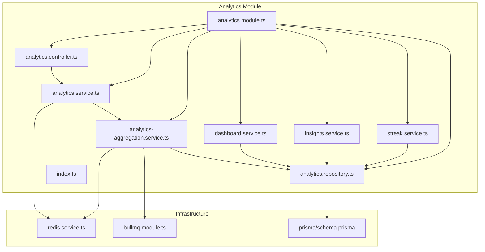
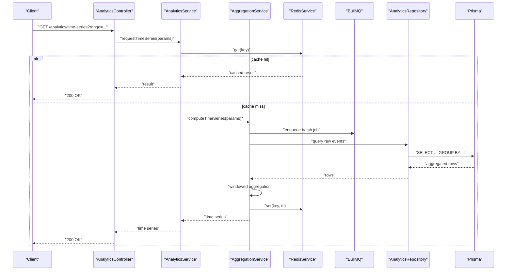
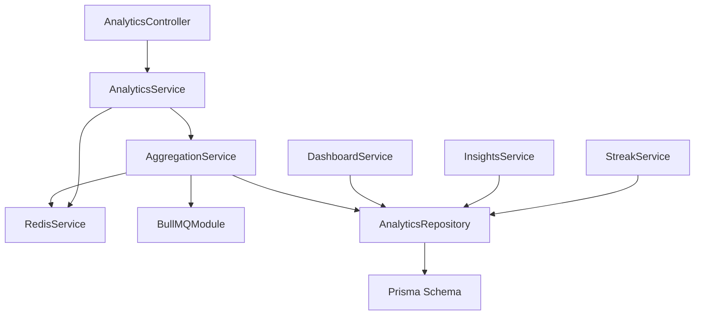

# Analytics Aggregation Service

<cite>
**Referenced Files in This Document**
- [analytics-aggregation.service.ts](file://apps/backend/src/analytics/analytics-aggregation.service.ts)
- [analytics.controller.ts](file://apps/backend/src/analytics/analytics.controller.ts)
- [analytics.module.ts](file://apps/backend/src/analytics/analytics.module.ts)
- [analytics.repository.ts](file://apps/backend/src/analytics/analytics.repository.ts)
- [analytics.service.ts](file://apps/backend/src/analytics/analytics.service.ts)
- [dashboard.service.ts](file://apps/backend/src/analytics/dashboard.service.ts)
- [insights.service.ts](file://apps/backend/src/analytics/insights.service.ts)
- [streak.service.ts](file://apps/backend/src/analytics/streak.service.ts)
- [index.ts](file://apps/backend/src/analytics/index.ts)
- [dto files](file://apps/backend/src/analytics/dto)
- [prisma/schema.prisma](file://apps/backend/prisma/schema.prisma)
- [redis.service.ts](file://apps/backend/src/redis/redis.service.ts)
- [bullmq.module.ts](file://apps/backend/src/bullmq/bullmq.module.ts)
- [hardening/cache.service.ts](file://apps/backend/src/hardening/cache.service.ts)
- [hardening/database-optimization.service.ts](file://apps/backend/src/hardening/database-optimization.service.ts)
- [hardening/query-analysis.service.ts](file://apps/backend/src/hardening/query-analysis.service.ts)
</cite>

## Table of Contents
1. [Introduction](#introduction)
2. [Project Structure](#project-structure)
3. [Core Components](#core-components)
4. [Architecture Overview](#architecture-overview)
5. [Detailed Component Analysis](#detailed-component-analysis)
6. [Dependency Analysis](#dependency-analysis)
7. [Performance Considerations](#performance-considerations)
8. [Troubleshooting Guide](#troubleshooting-guide)
9. [Conclusion](#conclusion)
10. [Appendices](#appendices)

## Introduction
This document provides comprehensive documentation for the Analytics Aggregation Service responsible for consumption pattern analysis and metrics aggregation. It explains how media consumption events are processed, engagement metrics are calculated, and time-series analytics data is generated. The service employs batch processing, caching strategies, and query optimization to handle large datasets efficiently. Integration with the analytics repository ensures reliable data persistence, while Redis and BullMQ support high-throughput event ingestion and background job execution.

## Project Structure
The Analytics Aggregation Service resides under apps/backend/src/analytics and includes controllers, services, repositories, DTOs, and module configuration. Supporting infrastructure such as Redis and BullMQ modules provide caching and background job capabilities. Database schema definitions are maintained under prisma/schema.prisma.

**Diagram sources**
- [analytics.controller.ts](file://apps/backend/src/analytics/analytics.controller.ts)
- [analytics.service.ts](file://apps/backend/src/analytics/analytics.service.ts)
- [analytics-aggregation.service.ts](file://apps/backend/src/analytics/analytics-aggregation.service.ts)
- [analytics.repository.ts](file://apps/backend/src/analytics/analytics.repository.ts)
- [dashboard.service.ts](file://apps/backend/src/analytics/dashboard.service.ts)
- [insights.service.ts](file://apps/backend/src/analytics/insights.service.ts)
- [streak.service.ts](file://apps/backend/src/analytics/streak.service.ts)
- [analytics.module.ts](file://apps/backend/src/analytics/analytics.module.ts)
- [index.ts](file://apps/backend/src/analytics/index.ts)
- [redis.service.ts](file://apps/backend/src/redis/redis.service.ts)
- [bullmq.module.ts](file://apps/backend/src/bullmq/bullmq.module.ts)
- [prisma/schema.prisma](file://apps/backend/prisma/schema.prisma)

**Section sources**
- [analytics.controller.ts](file://apps/backend/src/analytics/analytics.controller.ts)
- [analytics.service.ts](file://apps/backend/src/analytics/analytics.service.ts)
- [analytics-aggregation.service.ts](file://apps/backend/src/analytics/analytics-aggregation.service.ts)
- [analytics.repository.ts](file://apps/backend/src/analytics/analytics.repository.ts)
- [analytics.module.ts](file://apps/backend/src/analytics/analytics.module.ts)
- [index.ts](file://apps/backend/src/analytics/index.ts)
- [redis.service.ts](file://apps/backend/src/redis/redis.service.ts)
- [bullmq.module.ts](file://apps/backend/src/bullmq/bullmq.module.ts)
- [prisma/schema.prisma](file://apps/backend/prisma/schema.prisma)

## Core Components
- Controller: Exposes HTTP endpoints for analytics queries and triggers aggregation jobs.
- Service Layer: Orchestrates business logic for metrics calculation, time-series generation, and dashboard insights.
- Aggregation Service: Implements batch processing, windowed aggregations, and caching strategies for performance.
- Repository: Encapsulates database interactions using Prisma for efficient querying and persistence.
- Dashboard/Insights/Streak Services: Provide specialized analytics for dashboards, user insights, and streak calculations.

Key responsibilities:
- Ingesting and normalizing media consumption events.
- Computing engagement metrics (e.g., watch time, completion rates).
- Generating time-series data for trends and patterns.
- Caching frequently accessed aggregates and hot keys.
- Scheduling and executing batch jobs for periodic rollups.

**Section sources**
- [analytics.controller.ts](file://apps/backend/src/analytics/analytics.controller.ts)
- [analytics.service.ts](file://apps/backend/src/analytics/analytics.service.ts)
- [analytics-aggregation.service.ts](file://apps/backend/src/analytics/analytics-aggregation.service.ts)
- [analytics.repository.ts](file://apps/backend/src/analytics/analytics.repository.ts)
- [dashboard.service.ts](file://apps/backend/src/analytics/dashboard.service.ts)
- [insights.service.ts](file://apps/backend/src/analytics/insights.service.ts)
- [streak.service.ts](file://apps/backend/src/analytics/streak.service.ts)

## Architecture Overview
The Analytics Aggregation Service follows a layered architecture with clear separation between HTTP endpoints, business logic, aggregation algorithms, and data persistence. Redis is used for caching and rate limiting, while BullMQ handles background job scheduling for batch processing. Prisma manages relational data access and migrations.

**Diagram sources**
- [analytics.controller.ts](file://apps/backend/src/analytics/analytics.controller.ts)
- [analytics.service.ts](file://apps/backend/src/analytics/analytics.service.ts)
- [analytics-aggregation.service.ts](file://apps/backend/src/analytics/analytics-aggregation.service.ts)
- [analytics.repository.ts](file://apps/backend/src/analytics/analytics.repository.ts)
- [redis.service.ts](file://apps/backend/src/redis/redis.service.ts)
- [bullmq.module.ts](file://apps/backend/src/bullmq/bullmq.module.ts)
- [prisma/schema.prisma](file://apps/backend/prisma/schema.prisma)

## Detailed Component Analysis

### Analytics Controller
Responsibilities:
- Define REST endpoints for time-series queries, dashboard summaries, and insight requests.
- Validate request parameters and delegate to service layer.
- Return standardized responses with pagination and error handling.

Integration points:
- Depends on AnalyticsService for orchestration.
- Uses common response formatting and exception filters.

**Section sources**
- [analytics.controller.ts](file://apps/backend/src/analytics/analytics.controller.ts)

### Analytics Service
Responsibilities:
- Orchestrate analytics workflows across aggregation, insights, and streak services.
- Manage caching policies and fallback strategies.
- Coordinate background jobs via BullMQ for heavy computations.

Key methods:
- Time-series computation with range filtering and grouping.
- Dashboard summary generation combining multiple metrics.
- Insight derivation from aggregated data.

**Section sources**
- [analytics.service.ts](file://apps/backend/src/analytics/analytics.service.ts)

### Aggregation Service
Responsibilities:
- Implement batch processing for large event sets.
- Apply windowed aggregation algorithms (hourly, daily, weekly).
- Compute engagement metrics like total watch time, completion rate, and average session duration.
- Persist aggregated results and update caches.

Optimization techniques:
- Chunked processing to avoid memory spikes.
- Parallel processing where safe.
- Incremental updates for rolling windows.

**Section sources**
- [analytics-aggregation.service.ts](file://apps/backend/src/analytics/analytics-aggregation.service.ts)

### Analytics Repository
Responsibilities:
- Encapsulate Prisma queries for raw events and aggregated tables.
- Provide optimized read paths for time-series and dashboard queries.
- Handle transactions for consistency during batch writes.

Query patterns:
- Group by time buckets with filters (user, media type, date range).
- Aggregations using SUM, COUNT, AVG over event streams.

**Section sources**
- [analytics.repository.ts](file://apps/backend/src/analytics/analytics.repository.ts)
- [prisma/schema.prisma](file://apps/backend/prisma/schema.prisma)

### Dashboard Service
Responsibilities:
- Generate high-level metrics for dashboard UI.
- Combine multiple aggregation results into cohesive summaries.
- Support quick filters and drill-down queries.

**Section sources**
- [dashboard.service.ts](file://apps/backend/src/analytics/dashboard.service.ts)

### Insights Service
Responsibilities:
- Derive actionable insights from aggregated data.
- Identify trends, anomalies, and user behavior patterns.
- Provide recommendations based on consumption history.

**Section sources**
- [insights.service.ts](file://apps/backend/src/analytics/insights.service.ts)

### Streak Service
Responsibilities:
- Calculate consecutive activity streaks for users.
- Update streak state on new events and reset on gaps.
- Expose streak metrics for gamification features.

**Section sources**
- [streak.service.ts](file://apps/backend/src/analytics/streak.service.ts)

### Module and Index
Responsibilities:
- Configure dependency injection and export public APIs.
- Register controllers, services, and providers.
- Centralize module imports for Redis and BullMQ.

**Section sources**
- [analytics.module.ts](file://apps/backend/src/analytics/analytics.module.ts)
- [index.ts](file://apps/backend/src/analytics/index.ts)

## Dependency Analysis
The Analytics Aggregation Service depends on several core modules:
- Redis for caching and rate limiting.
- BullMQ for background job scheduling.
- Prisma for database access and migrations.
- Common utilities for logging, exceptions, and pagination.

**Diagram sources**
- [analytics-aggregation.service.ts](file://apps/backend/src/analytics/analytics-aggregation.service.ts)
- [redis.service.ts](file://apps/backend/src/redis/redis.service.ts)
- [bullmq.module.ts](file://apps/backend/src/bullmq/bullmq.module.ts)
- [analytics.repository.ts](file://apps/backend/src/analytics/analytics.repository.ts)
- [prisma/schema.prisma](file://apps/backend/prisma/schema.prisma)
- [analytics.service.ts](file://apps/backend/src/analytics/analytics.service.ts)
- [analytics.controller.ts](file://apps/backend/src/analytics/analytics.controller.ts)
- [dashboard.service.ts](file://apps/backend/src/analytics/dashboard.service.ts)
- [insights.service.ts](file://apps/backend/src/analytics/insights.service.ts)
- [streak.service.ts](file://apps/backend/src/analytics/streak.service.ts)

**Section sources**
- [analytics-aggregation.service.ts](file://apps/backend/src/analytics/analytics-aggregation.service.ts)
- [redis.service.ts](file://apps/backend/src/redis/redis.service.ts)
- [bullmq.module.ts](file://apps/backend/src/bullmq/bullmq.module.ts)
- [analytics.repository.ts](file://apps/backend/src/analytics/analytics.repository.ts)
- [prisma/schema.prisma](file://apps/backend/prisma/schema.prisma)
- [analytics.service.ts](file://apps/backend/src/analytics/analytics.service.ts)
- [analytics.controller.ts](file://apps/backend/src/analytics/analytics.controller.ts)
- [dashboard.service.ts](file://apps/backend/src/analytics/dashboard.service.ts)
- [insights.service.ts](file://apps/backend/src/analytics/insights.service.ts)
- [streak.service.ts](file://apps/backend/src/analytics/streak.service.ts)

## Performance Considerations
Batch Processing:
- Events are processed in chunks to prevent memory exhaustion.
- Background jobs use BullMQ queues for asynchronous processing.
- Windowed aggregations minimize recomputation by leveraging incremental updates.

Caching Strategies:
- Hot keys cached in Redis with TTL-based expiration.
- Cache invalidation triggered on significant data changes.
- Fallback to database queries when cache misses occur.

Query Optimization:
- Prisma queries leverage indexes on time buckets and user IDs.
- Aggregations performed at the database level where possible.
- Pagination applied to large result sets.

Monitoring and Hardening:
- Query analysis service identifies slow queries and suggests optimizations.
- Database optimization service monitors connection pools and lock contention.
- Rate limiting prevents abuse and protects backend resources.

**Section sources**
- [analytics-aggregation.service.ts](file://apps/backend/src/analytics/analytics-aggregation.service.ts)
- [redis.service.ts](file://apps/backend/src/redis/redis.service.ts)
- [bullmq.module.ts](file://apps/backend/src/bullmq/bullmq.module.ts)
- [analytics.repository.ts](file://apps/backend/src/analytics/analytics.repository.ts)
- [hardening/query-analysis.service.ts](file://apps/backend/src/hardening/query-analysis.service.ts)
- [hardening/database-optimization.service.ts](file://apps/backend/src/hardening/database-optimization.service.ts)
- [hardening/cache.service.ts](file://apps/backend/src/hardening/cache.service.ts)

## Troubleshooting Guide
Common issues and resolutions:
- Cache misses causing latency: Verify Redis connectivity and TTL settings.
- Slow queries: Use query analysis service to identify bottlenecks and add indexes.
- Job failures: Check BullMQ logs and retry failed tasks with exponential backoff.
- Data inconsistency: Ensure transactions are used for batch writes and validate checksums.

Debugging steps:
- Enable detailed logging for aggregation pipelines.
- Monitor Redis hit/miss ratios and memory usage.
- Inspect Prisma query plans for optimization opportunities.

**Section sources**
- [hardening/query-analysis.service.ts](file://apps/backend/src/hardening/query-analysis.service.ts)
- [hardening/database-optimization.service.ts](file://apps/backend/src/hardening/database-optimization.service.ts)
- [hardening/cache.service.ts](file://apps/backend/src/hardening/cache.service.ts)

## Conclusion
The Analytics Aggregation Service provides robust consumption pattern analysis and metrics aggregation through a well-architected system. By leveraging batch processing, caching, and query optimization, it efficiently handles large datasets and delivers timely insights. Integration with Redis and BullMQ ensures scalability and reliability, while Prisma maintains data integrity and performance.

## Appendices

### Example Aggregation Queries
- Time-series by hour: Group events by user and media type within hourly buckets, summing watch time and counting completions.
- Daily engagement: Aggregate daily totals for sessions, average duration, and completion rates per user.
- Weekly trends: Compute week-over-week growth in active users and total consumption hours.

Performance characteristics:
- Hourly queries typically complete in milliseconds with proper indexing.
- Daily aggregations may take seconds depending on dataset size.
- Weekly trends benefit from precomputed rollups stored in aggregate tables.

**Section sources**
- [analytics.repository.ts](file://apps/backend/src/analytics/analytics.repository.ts)
- [prisma/schema.prisma](file://apps/backend/prisma/schema.prisma)