# Analytics Module

<cite>
**Referenced Files in This Document**
- [analytics.controller.ts](file://apps/backend/src/analytics/analytics.controller.ts)
- [analytics.service.ts](file://apps/backend/src/analytics/analytics.service.ts)
- [analytics-aggregation.service.ts](file://apps/backend/src/analytics/analytics-aggregation.service.ts)
- [dashboard.service.ts](file://apps/backend/src/analytics/dashboard.service.ts)
- [insights.service.ts](file://apps/backend/src/analytics/insights.service.ts)
- [streak.service.ts](file://apps/backend/src/analytics/streak.service.ts)
- [analytics.repository.ts](file://apps/backend/src/analytics/analytics.repository.ts)
- [analytics.module.ts](file://apps/backend/src/analytics/analytics.module.ts)
- [index.ts](file://apps/backend/src/analytics/index.ts)
- [dto files](file://apps/backend/src/analytics/dto)
- [schema.prisma](file://apps/backend/prisma/schema.prisma)
- [redis.service.ts](file://apps/backend/src/redis/redis.service.ts)
- [cache.service.ts](file://apps/backend/src/hardening/cache.service.ts)
- [query-analysis.service.ts](file://apps/backend/src/hardening/query-analysis.service.ts)
- [performance-audit.service.ts](file://apps/backend/src/hardening/performance-audit.service.ts)
- [analytics-tracker.ts](file://src/lib/analytics-tracker.ts)
- [analytics.ts](file://src/lib/analytics.ts)
- [use-analytics.ts](file://src/hooks/use-analytics.ts)
</cite>

## Table of Contents
1. [Introduction](#introduction)
2. [Project Structure](#project-structure)
3. [Core Components](#core-components)
4. [Architecture Overview](#architecture-overview)
5. [Detailed Component Analysis](#detailed-component-analysis)
6. [Dependency Analysis](#dependency-analysis)
7. [Performance Considerations](#performance-considerations)
8. [Troubleshooting Guide](#troubleshooting-guide)
9. [Conclusion](#conclusion)
10. [Appendices](#appendices)

## Introduction
The Analytics Module provides consumption pattern analysis, emotional journey mapping, and recommendation algorithms across media interactions. It aggregates user activity into actionable insights, prepares dashboard-ready data, computes streaks, and exposes APIs for real-time analytics. The module integrates with the database layer via Prisma, leverages Redis for caching, and coordinates with other modules (media, journal, collections, progress, search) to collect interaction events that feed analytics computations.

## Project Structure
The backend analytics feature is organized as a NestJS module under apps/backend/src/analytics. It includes controllers, services, DTOs, repository, and module configuration. Frontend integration exists in src/lib and src/hooks for client-side tracking and hooks.

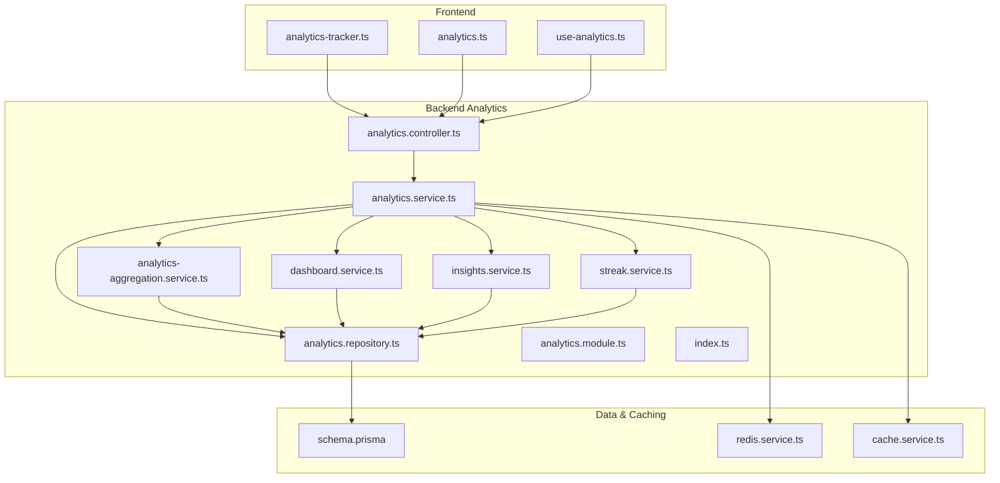

**Diagram sources**
- [analytics.controller.ts](file://apps/backend/src/analytics/analytics.controller.ts)
- [analytics.service.ts](file://apps/backend/src/analytics/analytics.service.ts)
- [analytics-aggregation.service.ts](file://apps/backend/src/analytics/analytics-aggregation.service.ts)
- [dashboard.service.ts](file://apps/backend/src/analytics/dashboard.service.ts)
- [insights.service.ts](file://apps/backend/src/analytics/insights.service.ts)
- [streak.service.ts](file://apps/backend/src/analytics/streak.service.ts)
- [analytics.repository.ts](file://apps/backend/src/analytics/analytics.repository.ts)
- [analytics.module.ts](file://apps/backend/src/analytics/analytics.module.ts)
- [index.ts](file://apps/backend/src/analytics/index.ts)
- [schema.prisma](file://apps/backend/prisma/schema.prisma)
- [redis.service.ts](file://apps/backend/src/redis/redis.service.ts)
- [cache.service.ts](file://apps/backend/src/hardening/cache.service.ts)
- [analytics-tracker.ts](file://src/lib/analytics-tracker.ts)
- [analytics.ts](file://src/lib/analytics.ts)
- [use-analytics.ts](file://src/hooks/use-analytics.ts)

**Section sources**
- [analytics.controller.ts](file://apps/backend/src/analytics/analytics.controller.ts)
- [analytics.service.ts](file://apps/backend/src/analytics/analytics.service.ts)
- [analytics-aggregation.service.ts](file://apps/backend/src/analytics/analytics-aggregation.service.ts)
- [dashboard.service.ts](file://apps/backend/src/analytics/dashboard.service.ts)
- [insights.service.ts](file://apps/backend/src/analytics/insights.service.ts)
- [streak.service.ts](file://apps/backend/src/analytics/streak.service.ts)
- [analytics.repository.ts](file://apps/backend/src/analytics/analytics.repository.ts)
- [analytics.module.ts](file://apps/backend/src/analytics/analytics.module.ts)
- [index.ts](file://apps/backend/src/analytics/index.ts)
- [schema.prisma](file://apps/backend/prisma/schema.prisma)
- [redis.service.ts](file://apps/backend/src/redis/redis.service.ts)
- [cache.service.ts](file://apps/backend/src/hardening/cache.service.ts)
- [analytics-tracker.ts](file://src/lib/analytics-tracker.ts)
- [analytics.ts](file://src/lib/analytics.ts)
- [use-analytics.ts](file://src/hooks/use-analytics.ts)

## Core Components
- Controller: Exposes REST endpoints for analytics queries, aggregation jobs, dashboard payloads, insight generation, and streak retrieval.
- Service: Orchestrates business logic, composes results from aggregation, dashboard, insights, and streak services, and applies caching strategies.
- Aggregation Service: Computes time-series metrics, genre/emotion distributions, and cross-entity correlations over large datasets.
- Dashboard Service: Prepares aggregated, user-scoped snapshots for UI rendering, including recent activity and summary stats.
- Insights Service: Generates narrative insights such as top genres, mood trends, and personalized recommendations based on consumption patterns.
- Streak Service: Tracks consecutive days of engagement and calculates streak lengths and milestones.
- Repository: Encapsulates Prisma queries optimized for analytics workloads, including window functions and indexes.
- Module: Wires dependencies, registers controllers/services, and configures caching and Redis connections.

**Section sources**
- [analytics.controller.ts](file://apps/backend/src/analytics/analytics.controller.ts)
- [analytics.service.ts](file://apps/backend/src/analytics/analytics.service.ts)
- [analytics-aggregation.service.ts](file://apps/backend/src/analytics/analytics-aggregation.service.ts)
- [dashboard.service.ts](file://apps/backend/src/analytics/dashboard.service.ts)
- [insights.service.ts](file://apps/backend/src/analytics/insights.service.ts)
- [streak.service.ts](file://apps/backend/src/analytics/streak.service.ts)
- [analytics.repository.ts](file://apps/backend/src/analytics/analytics.repository.ts)
- [analytics.module.ts](file://apps/backend/src/analytics/analytics.module.ts)

## Architecture Overview
The Analytics Module follows a layered architecture:
- API Layer: Controller handles HTTP requests, validates inputs, and returns DTOs.
- Service Layer: Coordinates domain logic, composes multiple services, and manages caching.
- Data Access Layer: Repository performs efficient Prisma queries; Redis cache accelerates repeated reads.
- Event Integration: Other modules emit interaction events consumed by analytics ingestion pipelines.

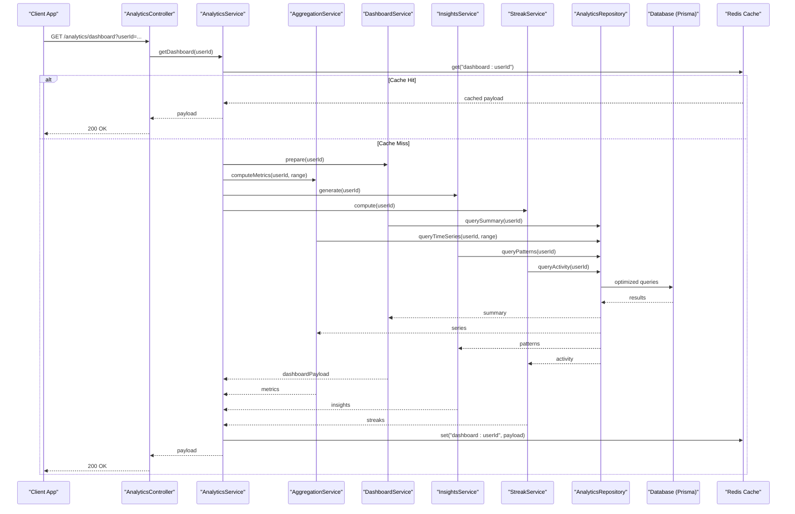

**Diagram sources**
- [analytics.controller.ts](file://apps/backend/src/analytics/analytics.controller.ts)
- [analytics.service.ts](file://apps/backend/src/analytics/analytics.service.ts)
- [analytics-aggregation.service.ts](file://apps/backend/src/analytics/analytics-aggregation.service.ts)
- [dashboard.service.ts](file://apps/backend/src/analytics/dashboard.service.ts)
- [insights.service.ts](file://apps/backend/src/analytics/insights.service.ts)
- [streak.service.ts](file://apps/backend/src/analytics/streak.service.ts)
- [analytics.repository.ts](file://apps/backend/src/analytics/analytics.repository.ts)
- [redis.service.ts](file://apps/backend/src/redis/redis.service.ts)
- [schema.prisma](file://apps/backend/prisma/schema.prisma)

## Detailed Component Analysis

### Analytics Controller
- Responsibilities: Define routes for dashboard, aggregation, insights, streaks, and export endpoints. Validate query parameters and return standardized DTOs.
- Key behaviors: Input validation, error mapping, pagination support, and response formatting.

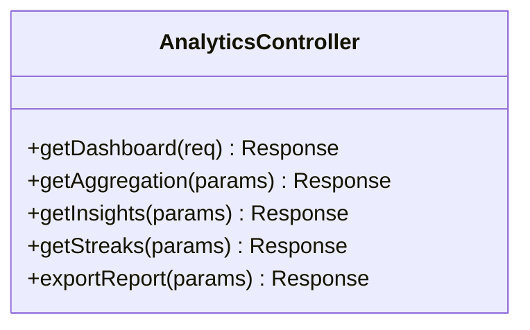

**Diagram sources**
- [analytics.controller.ts](file://apps/backend/src/analytics/analytics.controller.ts)

**Section sources**
- [analytics.controller.ts](file://apps/backend/src/analytics/analytics.controller.ts)

### Analytics Service
- Responsibilities: Orchestrate aggregation, dashboard preparation, insight generation, and streak computation. Implements caching strategies and error handling.
- Key behaviors: Compose results from subordinate services, apply TTL-based caching, and handle partial failures gracefully.

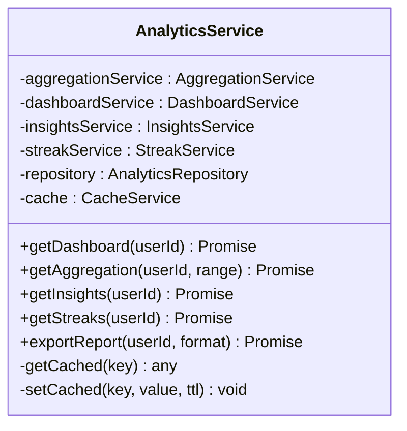

**Diagram sources**
- [analytics.service.ts](file://apps/backend/src/analytics/analytics.service.ts)
- [analytics-aggregation.service.ts](file://apps/backend/src/analytics/analytics-aggregation.service.ts)
- [dashboard.service.ts](file://apps/backend/src/analytics/dashboard.service.ts)
- [insights.service.ts](file://apps/backend/src/analytics/insights.service.ts)
- [streak.service.ts](file://apps/backend/src/analytics/streak.service.ts)
- [analytics.repository.ts](file://apps/backend/src/analytics/analytics.repository.ts)
- [cache.service.ts](file://apps/backend/src/hardening/cache.service.ts)

**Section sources**
- [analytics.service.ts](file://apps/backend/src/analytics/analytics.service.ts)

### Aggregation Service
- Responsibilities: Compute time-series metrics, genre/emotion distributions, and correlation matrices across large datasets.
- Optimization: Uses windowed queries, pre-aggregations, and index-friendly filters.

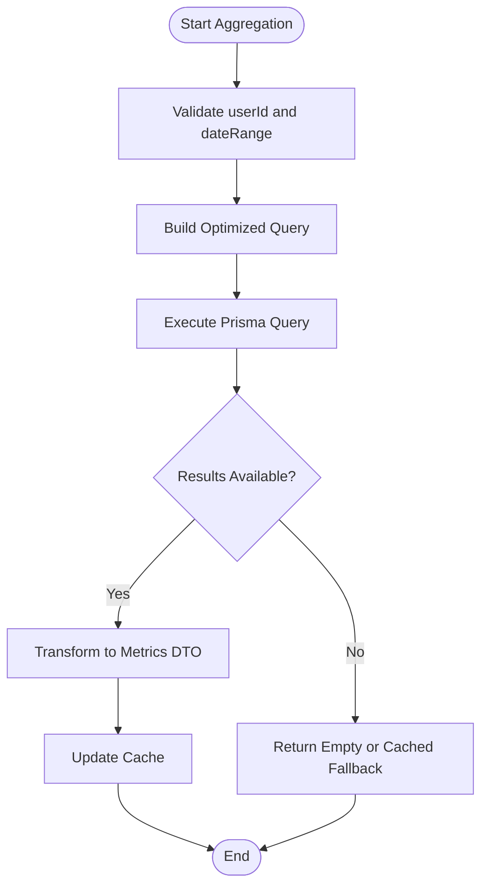

**Diagram sources**
- [analytics-aggregation.service.ts](file://apps/backend/src/analytics/analytics-aggregation.service.ts)
- [analytics.repository.ts](file://apps/backend/src/analytics/analytics.repository.ts)
- [schema.prisma](file://apps/backend/prisma/schema.prisma)

**Section sources**
- [analytics-aggregation.service.ts](file://apps/backend/src/analytics/analytics-aggregation.service.ts)

### Dashboard Service
- Responsibilities: Prepare user-scoped dashboard data including summary statistics, recent activity, and quick insights.
- Output: DTOs tailored for frontend dashboards, ensuring minimal payload size and fast rendering.

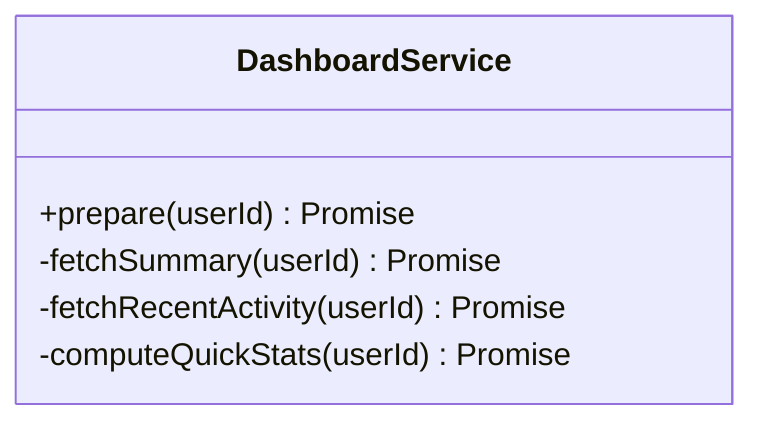

**Diagram sources**
- [dashboard.service.ts](file://apps/backend/src/analytics/dashboard.service.ts)
- [analytics.repository.ts](file://apps/backend/src/analytics/analytics.repository.ts)

**Section sources**
- [dashboard.service.ts](file://apps/backend/src/analytics/dashboard.service.ts)

### Insights Service
- Responsibilities: Generate narrative insights such as top genres, mood trends, and personalized recommendations based on consumption patterns.
- Algorithms: Trend analysis using moving averages, sentiment/emotion scoring, and collaborative filtering signals when available.

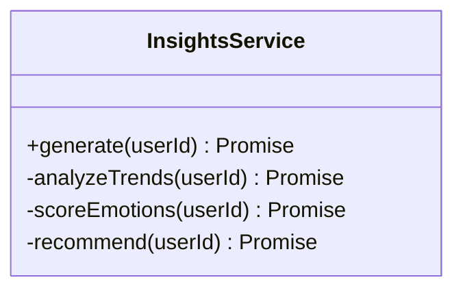

**Diagram sources**
- [insights.service.ts](file://apps/backend/src/analytics/insights.service.ts)
- [analytics.repository.ts](file://apps/backend/src/analytics/analytics.repository.ts)

**Section sources**
- [insights.service.ts](file://apps/backend/src/analytics/insights.service.ts)

### Streak Service
- Responsibilities: Track consecutive days of engagement and calculate streak lengths and milestones.
- Logic: Activity detection per day, gap handling, and streak reset conditions.

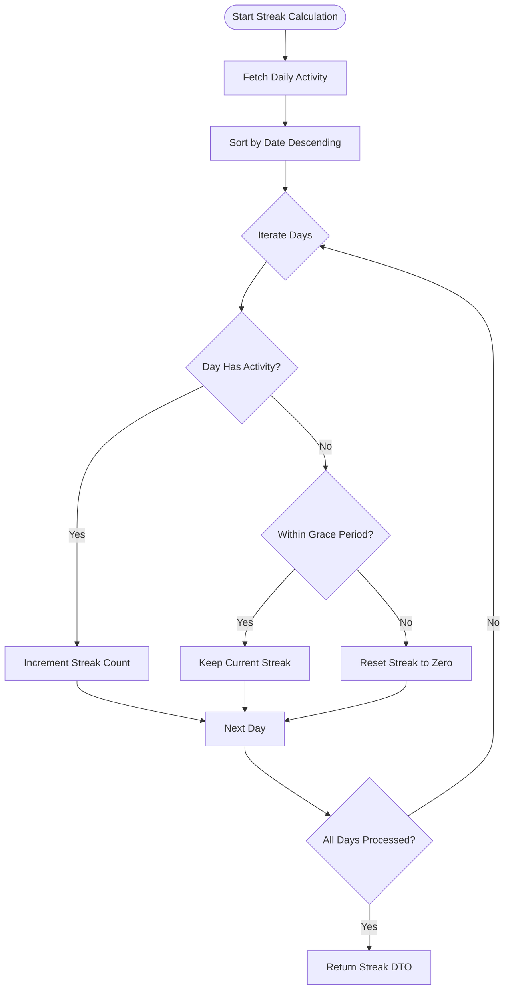

**Diagram sources**
- [streak.service.ts](file://apps/backend/src/analytics/streak.service.ts)
- [analytics.repository.ts](file://apps/backend/src/analytics/analytics.repository.ts)

**Section sources**
- [streak.service.ts](file://apps/backend/src/analytics/streak.service.ts)

### Analytics Repository
- Responsibilities: Provide optimized Prisma queries for analytics workloads, including aggregations, time-series windows, and joins across interaction tables.
- Optimization: Leverages indexes, selective projections, and batched queries to reduce latency.

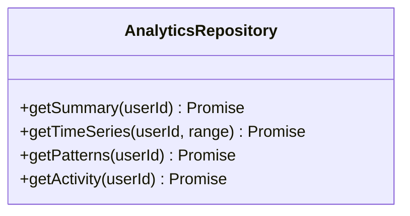

**Diagram sources**
- [analytics.repository.ts](file://apps/backend/src/analytics/analytics.repository.ts)
- [schema.prisma](file://apps/backend/prisma/schema.prisma)

**Section sources**
- [analytics.repository.ts](file://apps/backend/src/analytics/analytics.repository.ts)

### Module Wiring
- Responsibilities: Register controllers, services, and dependencies; configure caching and Redis integration.

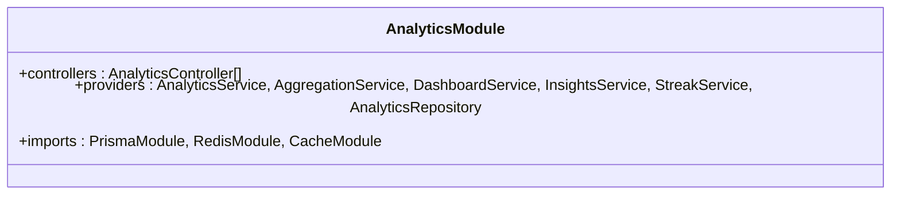

**Diagram sources**
- [analytics.module.ts](file://apps/backend/src/analytics/analytics.module.ts)
- [index.ts](file://apps/backend/src/analytics/index.ts)

**Section sources**
- [analytics.module.ts](file://apps/backend/src/analytics/analytics.module.ts)
- [index.ts](file://apps/backend/src/analytics/index.ts)

### DTOs and Responses
- Purpose: Define structured responses for dashboard, aggregation, insights, streaks, and export endpoints.
- Characteristics: Strongly typed, minimal fields for performance, and consistent naming conventions.

**Section sources**
- [dto files](file://apps/backend/src/analytics/dto)

### Data Modeling for Analytics Metrics
- Entities: Interaction logs, media metadata, journal entries, collection memberships, and progress states.
- Indexing: Time-based indexes, user-scoped partitions, and composite keys for frequent filters.
- Schema considerations: Denormalization for read-heavy analytics queries, materialized views where applicable.

**Section sources**
- [schema.prisma](file://apps/backend/prisma/schema.prisma)

### Real-Time Analytics Processing
- Ingestion: Events emitted by other modules (media, journal, collections, progress) are captured and queued for processing.
- Processing: Batched writes to analytics tables, incremental updates to caches, and near-real-time dashboard refreshes.

**Section sources**
- [analytics.service.ts](file://apps/backend/src/analytics/analytics.service.ts)
- [redis.service.ts](file://apps/backend/src/redis/redis.service.ts)

### Recommendation Engine Implementation
- Inputs: Consumption history, emotion scores, genre preferences, and social signals if available.
- Algorithms: Collaborative filtering, content-based similarity, and trend-aware ranking.
- Outputs: Ranked recommendations with explanations tied to user’s emotional journey.

**Section sources**
- [insights.service.ts](file://apps/backend/src/analytics/insights.service.ts)

### Export Functionality for Custom Reports
- Formats: CSV, JSON, and PDF exports for dashboard snapshots and insights.
- Features: Filtering by date range, entity types, and custom metric selection.

**Section sources**
- [analytics.controller.ts](file://apps/backend/src/analytics/analytics.controller.ts)

## Dependency Analysis
The Analytics Module depends on core infrastructure modules for caching, database access, and event emission. It also integrates with feature modules to collect interaction data.

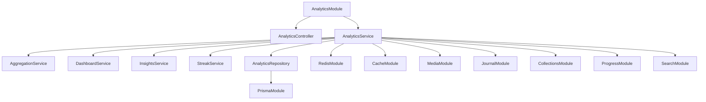

**Diagram sources**
- [analytics.module.ts](file://apps/backend/src/analytics/analytics.module.ts)
- [analytics.controller.ts](file://apps/backend/src/analytics/analytics.controller.ts)
- [analytics.service.ts](file://apps/backend/src/analytics/analytics.service.ts)
- [analytics-aggregation.service.ts](file://apps/backend/src/analytics/analytics-aggregation.service.ts)
- [dashboard.service.ts](file://apps/backend/src/analytics/dashboard.service.ts)
- [insights.service.ts](file://apps/backend/src/analytics/insights.service.ts)
- [streak.service.ts](file://apps/backend/src/analytics/streak.service.ts)
- [analytics.repository.ts](file://apps/backend/src/analytics/analytics.repository.ts)
- [redis.service.ts](file://apps/backend/src/redis/redis.service.ts)
- [cache.service.ts](file://apps/backend/src/hardening/cache.service.ts)

**Section sources**
- [analytics.module.ts](file://apps/backend/src/analytics/analytics.module.ts)
- [analytics.service.ts](file://apps/backend/src/analytics/analytics.service.ts)

## Performance Considerations
- Query Optimization: Use indexed columns, selective projections, and window functions to minimize load.
- Caching Strategy: Implement TTL-based caching for dashboard and aggregation endpoints; invalidate on relevant events.
- Batch Processing: Aggregate events in batches to reduce write amplification and improve throughput.
- Monitoring: Utilize performance audit and query analysis services to identify bottlenecks and optimize hot paths.

[No sources needed since this section provides general guidance]

## Troubleshooting Guide
- Common Issues:
  - Slow dashboard loads: Verify cache hits and query execution plans.
  - Missing insights: Ensure interaction events are ingested and patterns are computed.
  - Streak resets unexpectedly: Review grace period logic and daily activity thresholds.
- Debugging Tools:
  - Query analysis service for slow queries.
  - Performance audit service for endpoint latency profiling.
  - Redis inspection for cache state and TTL correctness.

**Section sources**
- [query-analysis.service.ts](file://apps/backend/src/hardening/query-analysis.service.ts)
- [performance-audit.service.ts](file://apps/backend/src/hardening/performance-audit.service.ts)
- [cache.service.ts](file://apps/backend/src/hardening/cache.service.ts)

## Conclusion
The Analytics Module delivers robust consumption pattern analysis, emotional journey mapping, and recommendation capabilities through well-structured services, optimized data access, and effective caching. Its modular design enables scalability and maintainability while integrating seamlessly with other modules for comprehensive analytics coverage.

[No sources needed since this section summarizes without analyzing specific files]

## Appendices

### Frontend Integration
- Client-side tracking: analytics-tracker.ts captures user interactions and sends them to backend endpoints.
- Library utilities: analytics.ts provides helper functions for formatting and batching events.
- React hook: use-analytics.ts simplifies fetching and displaying analytics data in components.

**Section sources**
- [analytics-tracker.ts](file://src/lib/analytics-tracker.ts)
- [analytics.ts](file://src/lib/analytics.ts)
- [use-analytics.ts](file://src/hooks/use-analytics.ts)