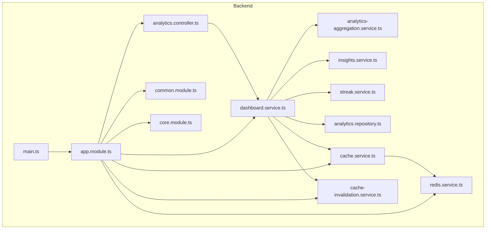
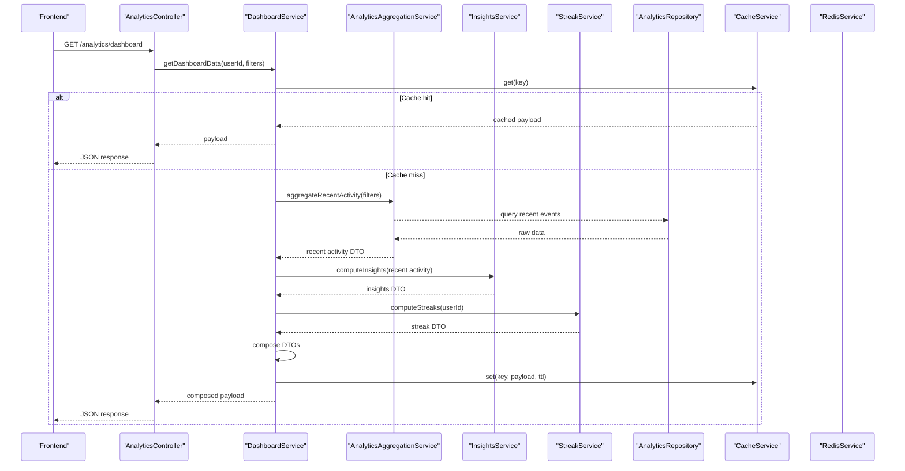
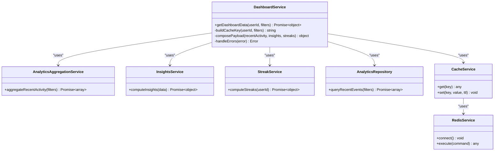
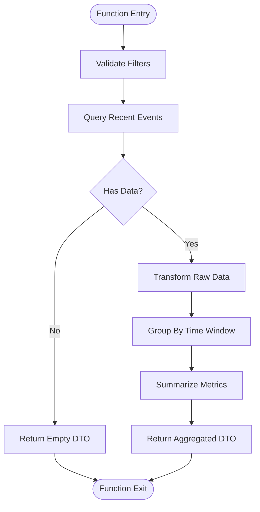
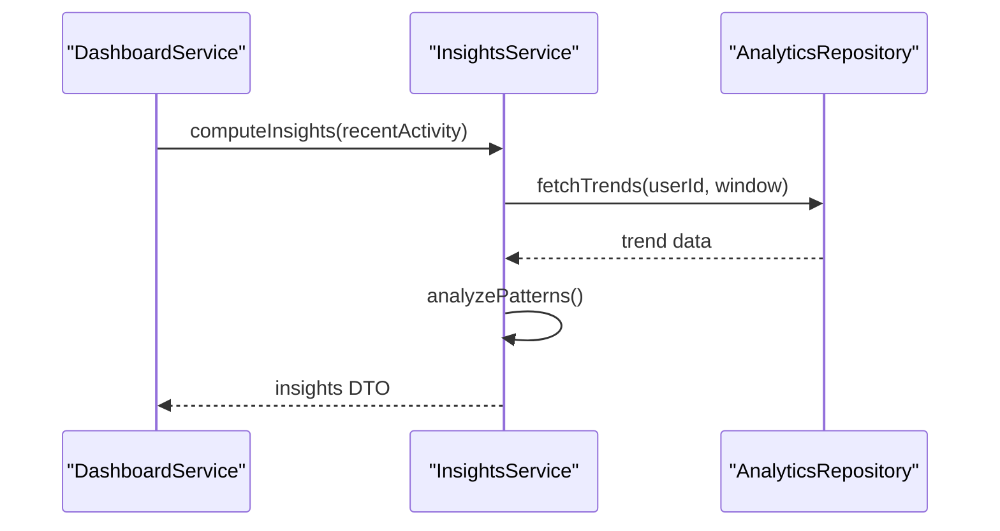
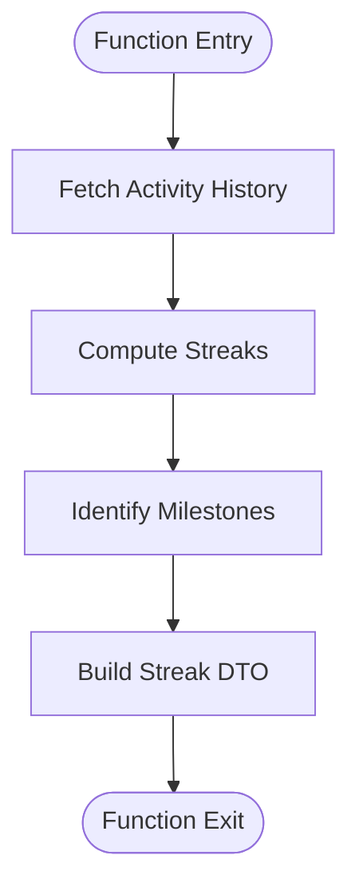
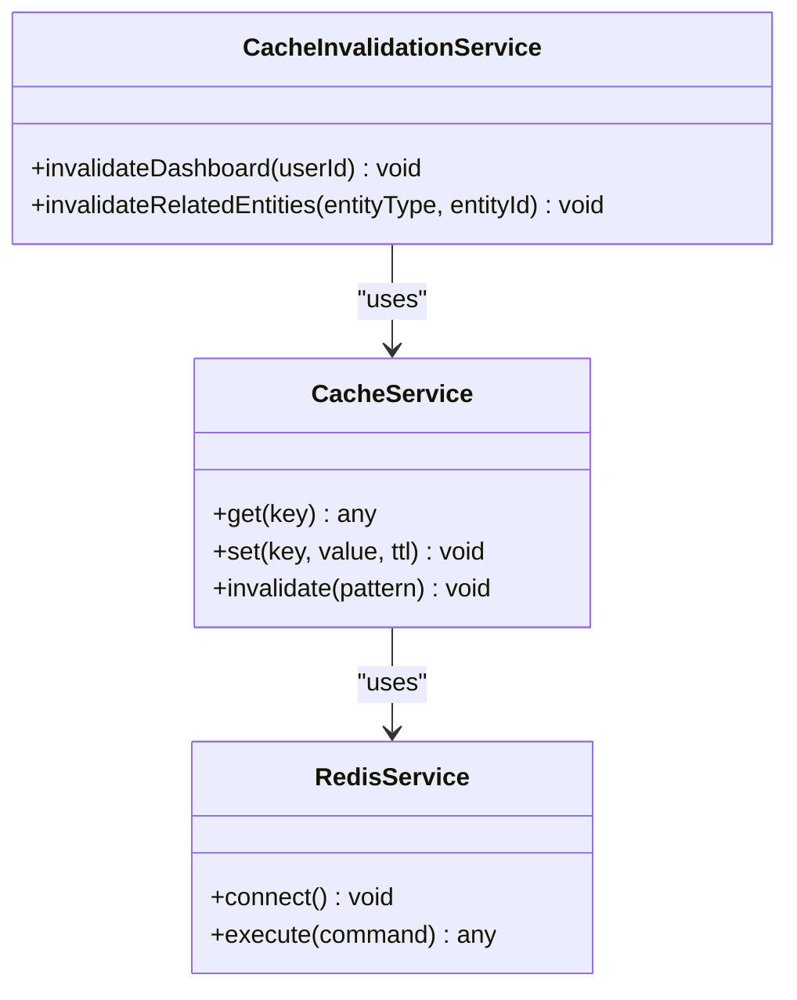
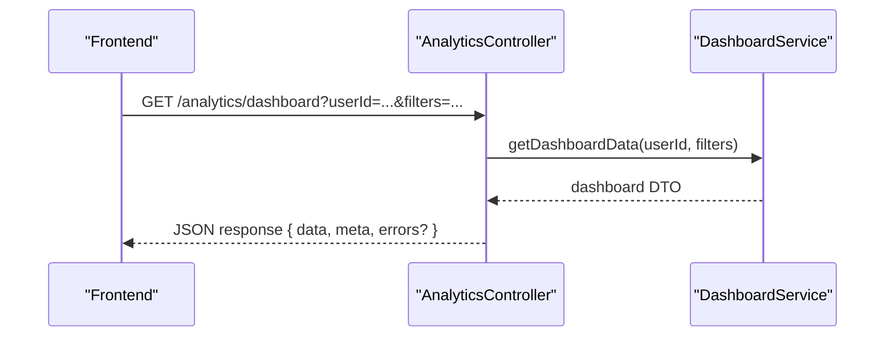
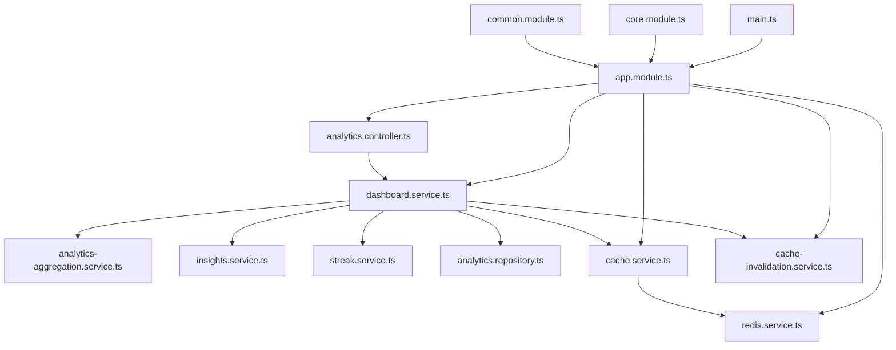

# Dashboard Data Service

<cite>
**Referenced Files in This Document**
- [dashboard.service.ts](file://apps/backend/src/analytics/dashboard.service.ts)
- [analytics-aggregation.service.ts](file://apps/backend/src/analytics/analytics-aggregation.service.ts)
- [insights.service.ts](file://apps/backend/src/analytics/insights.service.ts)
- [streak.service.ts](file://apps/backend/src/analytics/streak.service.ts)
- [analytics.controller.ts](file://apps/backend/src/analytics/analytics.controller.ts)
- [analytics.module.ts](file://apps/backend/src/analytics/analytics.module.ts)
- [analytics.repository.ts](file://apps/backend/src/analytics/analytics.repository.ts)
- [cache.service.ts](file://apps/backend/src/hardening/cache.service.ts)
- [cache-invalidation.service.ts](file://apps/backend/src/hardening/cache-invalidation.service.ts)
- [redis.service.ts](file://apps/backend/src/redis/redis.service.ts)
- [common.module.ts](file://apps/backend/src/common/common.module.ts)
- [core.module.ts](file://apps/backend/src/core/core.module.ts)
- [app.module.ts](file://apps/backend/src/app.module.ts)
- [main.ts](file://apps/backend/src/main.ts)
- [use-analytics.ts](file://src/hooks/use-analytics.ts)
- [AnalyticsKit.tsx](file://src/components/analytics/AnalyticsKit.tsx)
</cite>

## Table of Contents
1. [Introduction](#introduction)
2. [Project Structure](#project-structure)
3. [Core Components](#core-components)
4. [Architecture Overview](#architecture-overview)
5. [Detailed Component Analysis](#detailed-component-analysis)
6. [Dependency Analysis](#dependency-analysis)
7. [Performance Considerations](#performance-considerations)
8. [Troubleshooting Guide](#troubleshooting-guide)
9. [Conclusion](#conclusion)
10. [Appendices](#appendices)

## Introduction
This document explains the Dashboard Data Service that prepares and serves analytics data for the user dashboard. It covers how multiple data sources are aggregated into cohesive dashboard views, including recent activity summaries, progress indicators, and quick insights. It also documents DTO structures used for dashboard responses, caching mechanisms for performance, error handling strategies, response formatting standards, and examples of usage patterns in frontend components.

## Project Structure
The Dashboard Data Service is implemented within the backend analytics module and integrates with shared modules for caching, Redis, core utilities, and common response handling. The service exposes endpoints via a controller and coordinates aggregation across repositories and domain services.

**Diagram sources**
- [analytics.controller.ts](file://apps/backend/src/analytics/analytics.controller.ts)
- [dashboard.service.ts](file://apps/backend/src/analytics/dashboard.service.ts)
- [analytics-aggregation.service.ts](file://apps/backend/src/analytics/analytics-aggregation.service.ts)
- [insights.service.ts](file://apps/backend/src/analytics/insights.service.ts)
- [streak.service.ts](file://apps/backend/src/analytics/streak.service.ts)
- [analytics.repository.ts](file://apps/backend/src/analytics/analytics.repository.ts)
- [cache.service.ts](file://apps/backend/src/hardening/cache.service.ts)
- [cache-invalidation.service.ts](file://apps/backend/src/hardening/cache-invalidation.service.ts)
- [redis.service.ts](file://apps/backend/src/redis/redis.service.ts)
- [common.module.ts](file://apps/backend/src/common/common.module.ts)
- [core.module.ts](file://apps/backend/src/core/core.module.ts)
- [app.module.ts](file://apps/backend/src/app.module.ts)
- [main.ts](file://apps/backend/src/main.ts)

**Section sources**
- [app.module.ts](file://apps/backend/src/app.module.ts)
- [main.ts](file://apps/backend/src/main.ts)
- [analytics.module.ts](file://apps/backend/src/analytics/analytics.module.ts)

## Core Components
- Dashboard Service: Orchestrates aggregation of recent activity, progress metrics, streaks, and insights; composes final DTOs for dashboard responses.
- Analytics Aggregation Service: Performs cross-entity aggregations (e.g., counts, time windows).
- Insights Service: Generates quick insights based on current and historical data.
- Streak Service: Computes streaks and related progress indicators.
- Analytics Repository: Provides data access to underlying storage for analytics-related entities.
- Cache Service and Invalidation: Implements caching and cache invalidation strategies to improve performance and consistency.
- Redis Service: Manages Redis connectivity and operations used by caching.

Key responsibilities:
- Aggregate data from multiple sources into unified dashboard DTOs.
- Apply caching to reduce latency and database load.
- Handle errors consistently and return standardized responses.
- Expose endpoints through the analytics controller.

**Section sources**
- [dashboard.service.ts](file://apps/backend/src/analytics/dashboard.service.ts)
- [analytics-aggregation.service.ts](file://apps/backend/src/analytics/analytics-aggregation.service.ts)
- [insights.service.ts](file://apps/backend/src/analytics/insights.service.ts)
- [streak.service.ts](file://apps/backend/src/analytics/streak.service.ts)
- [analytics.repository.ts](file://apps/backend/src/analytics/analytics.repository.ts)
- [cache.service.ts](file://apps/backend/src/hardening/cache.service.ts)
- [cache-invalidation.service.ts](file://apps/backend/src/hardening/cache-invalidation.service.ts)
- [redis.service.ts](file://apps/backend/src/redis/redis.service.ts)

## Architecture Overview
The Dashboard Data Service follows a layered architecture:
- Controller layer handles HTTP requests and maps them to service methods.
- Service layer orchestrates business logic, aggregates data, and applies caching.
- Repository layer abstracts data access.
- Shared modules provide caching, Redis, and common utilities.

**Diagram sources**
- [analytics.controller.ts](file://apps/backend/src/analytics/analytics.controller.ts)
- [dashboard.service.ts](file://apps/backend/src/analytics/dashboard.service.ts)
- [analytics-aggregation.service.ts](file://apps/backend/src/analytics/analytics-aggregation.service.ts)
- [insights.service.ts](file://apps/backend/src/analytics/insights.service.ts)
- [streak.service.ts](file://apps/backend/src/analytics/streak.service.ts)
- [analytics.repository.ts](file://apps/backend/src/analytics/analytics.repository.ts)
- [cache.service.ts](file://apps/backend/src/hardening/cache.service.ts)
- [redis.service.ts](file://apps/backend/src/redis/redis.service.ts)

## Detailed Component Analysis

### Dashboard Service
Responsibilities:
- Compose dashboard DTOs by aggregating recent activity, progress indicators, streaks, and insights.
- Manage cache keys and TTLs for dashboard payloads.
- Coordinate calls to aggregation, insights, and streak services.
- Handle errors and fallbacks to ensure consistent responses.

**Diagram sources**
- [dashboard.service.ts](file://apps/backend/src/analytics/dashboard.service.ts)
- [analytics-aggregation.service.ts](file://apps/backend/src/analytics/analytics-aggregation.service.ts)
- [insights.service.ts](file://apps/backend/src/analytics/insights.service.ts)
- [streak.service.ts](file://apps/backend/src/analytics/streak.service.ts)
- [analytics.repository.ts](file://apps/backend/src/analytics/analytics.repository.ts)
- [cache.service.ts](file://apps/backend/src/hardening/cache.service.ts)
- [redis.service.ts](file://apps/backend/src/redis/redis.service.ts)

**Section sources**
- [dashboard.service.ts](file://apps/backend/src/analytics/dashboard.service.ts)

### Analytics Aggregation Service
Responsibilities:
- Aggregate recent activity across entities (e.g., media interactions, journal entries, collections).
- Compute time-windowed metrics (daily, weekly, monthly).
- Normalize raw data into structured DTOs for dashboard consumption.

**Diagram sources**
- [analytics-aggregation.service.ts](file://apps/backend/src/analytics/analytics-aggregation.service.ts)
- [analytics.repository.ts](file://apps/backend/src/analytics/analytics.repository.ts)

**Section sources**
- [analytics-aggregation.service.ts](file://apps/backend/src/analytics/analytics-aggregation.service.ts)

### Insights Service
Responsibilities:
- Generate quick insights based on recent activity and historical trends.
- Provide recommendations or highlights for the dashboard.
- Format insights into a consistent DTO structure.

**Diagram sources**
- [insights.service.ts](file://apps/backend/src/analytics/insights.service.ts)
- [analytics.repository.ts](file://apps/backend/src/analytics/analytics.repository.ts)

**Section sources**
- [insights.service.ts](file://apps/backend/src/analytics/insights.service.ts)

### Streak Service
Responsibilities:
- Compute streaks for user activities (e.g., daily journaling, media sessions).
- Calculate streak length, current streak, and milestones.
- Return streak DTOs for dashboard display.

**Diagram sources**
- [streak.service.ts](file://apps/backend/src/analytics/streak.service.ts)
- [analytics.repository.ts](file://apps/backend/src/analytics/analytics.repository.ts)

**Section sources**
- [streak.service.ts](file://apps/backend/src/analytics/streak.service.ts)

### Caching Mechanisms
Responsibilities:
- Implement in-memory or Redis-backed caching for dashboard payloads.
- Define cache keys based on userId and filters.
- Set appropriate TTLs to balance freshness and performance.
- Invalidate caches when underlying data changes.

**Diagram sources**
- [cache.service.ts](file://apps/backend/src/hardening/cache.service.ts)
- [cache-invalidation.service.ts](file://apps/backend/src/hardening/cache-invalidation.service.ts)
- [redis.service.ts](file://apps/backend/src/redis/redis.service.ts)

**Section sources**
- [cache.service.ts](file://apps/backend/src/hardening/cache.service.ts)
- [cache-invalidation.service.ts](file://apps/backend/src/hardening/cache-invalidation.service.ts)
- [redis.service.ts](file://apps/backend/src/redis/redis.service.ts)

### API Endpoints and Response Formatting
Responsibilities:
- Expose endpoints for dashboard data retrieval.
- Format responses using standardized DTOs.
- Handle errors consistently with meaningful messages and status codes.

**Diagram sources**
- [analytics.controller.ts](file://apps/backend/src/analytics/analytics.controller.ts)
- [dashboard.service.ts](file://apps/backend/src/analytics/dashboard.service.ts)

**Section sources**
- [analytics.controller.ts](file://apps/backend/src/analytics/analytics.controller.ts)

## Dependency Analysis
The Dashboard Data Service depends on several modules and services:
- Analytics module provides controllers and services.
- Hardening module provides caching and invalidation.
- Redis module provides caching backend.
- Common and core modules provide shared utilities and infrastructure.

**Diagram sources**
- [analytics.controller.ts](file://apps/backend/src/analytics/analytics.controller.ts)
- [dashboard.service.ts](file://apps/backend/src/analytics/dashboard.service.ts)
- [analytics-aggregation.service.ts](file://apps/backend/src/analytics/analytics-aggregation.service.ts)
- [insights.service.ts](file://apps/backend/src/analytics/insights.service.ts)
- [streak.service.ts](file://apps/backend/src/analytics/streak.service.ts)
- [analytics.repository.ts](file://apps/backend/src/analytics/analytics.repository.ts)
- [cache.service.ts](file://apps/backend/src/hardening/cache.service.ts)
- [cache-invalidation.service.ts](file://apps/backend/src/hardening/cache-invalidation.service.ts)
- [redis.service.ts](file://apps/backend/src/redis/redis.service.ts)
- [app.module.ts](file://apps/backend/src/app.module.ts)
- [common.module.ts](file://apps/backend/src/common/common.module.ts)
- [core.module.ts](file://apps/backend/src/core/core.module.ts)
- [main.ts](file://apps/backend/src/main.ts)

**Section sources**
- [app.module.ts](file://apps/backend/src/app.module.ts)
- [analytics.module.ts](file://apps/backend/src/analytics/analytics.module.ts)

## Performance Considerations
- Caching: Use Redis-backed caching for dashboard payloads with appropriate TTLs to reduce database load and improve response times.
- Aggregation: Optimize queries in the analytics repository to minimize latency during aggregation.
- Error Handling: Implement graceful degradation when external services fail to maintain responsiveness.
- Response Size: Keep DTOs lean to reduce payload size and improve frontend rendering performance.
- Real-time Updates: Consider WebSocket or server-sent events for live updates if required by the frontend.

[No sources needed since this section provides general guidance]

## Troubleshooting Guide
Common issues and resolutions:
- Cache Misses: Verify cache key generation and TTL settings. Check Redis connectivity.
- Slow Aggregations: Review database queries and indexes in the analytics repository.
- Missing Insights: Ensure insights service has sufficient data and handles edge cases.
- Streak Calculation Errors: Validate activity history and streak computation logic.
- API Errors: Check error handling in the controller and service layers for consistent responses.

**Section sources**
- [cache.service.ts](file://apps/backend/src/hardening/cache.service.ts)
- [cache-invalidation.service.ts](file://apps/backend/src/hardening/cache-invalidation.service.ts)
- [analytics.repository.ts](file://apps/backend/src/analytics/analytics.repository.ts)
- [insights.service.ts](file://apps/backend/src/analytics/insights.service.ts)
- [streak.service.ts](file://apps/backend/src/analytics/streak.service.ts)
- [analytics.controller.ts](file://apps/backend/src/analytics/analytics.controller.ts)

## Conclusion
The Dashboard Data Service provides a robust foundation for delivering analytics data to the user dashboard. By aggregating multiple data sources, applying caching, and standardizing responses, it ensures performance and reliability. Frontend components can consume these DTOs to render recent activity summaries, progress indicators, and quick insights effectively.

[No sources needed since this section summarizes without analyzing specific files]

## Appendices

### DTO Structures for Dashboard Responses
Typical DTO fields include:
- recentActivity: Array of recent events with timestamps and types.
- progressIndicators: Metrics such as completion percentages and streaks.
- insights: Quick insights derived from activity and trends.
- meta: Metadata like timestamps and cache status.

Usage patterns in frontend components:
- Consume DTOs via hooks or API clients.
- Render components based on DTO fields.
- Handle loading and error states gracefully.

**Section sources**
- [use-analytics.ts](file://src/hooks/use-analytics.ts)
- [AnalyticsKit.tsx](file://src/components/analytics/AnalyticsKit.tsx)