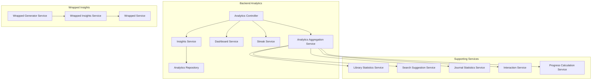
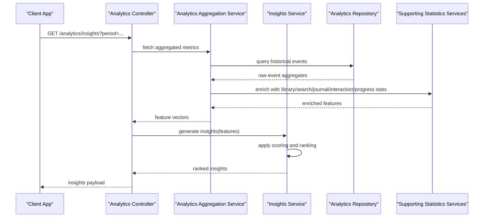
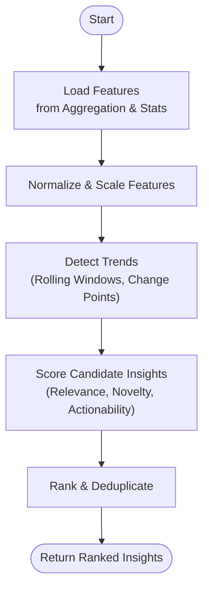
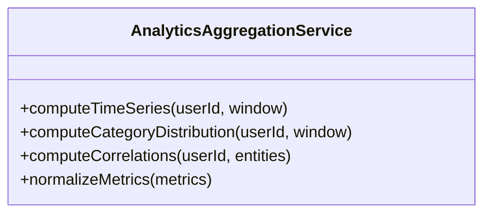
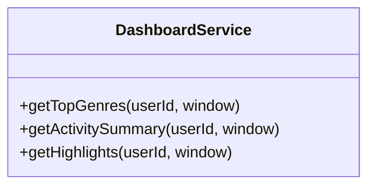
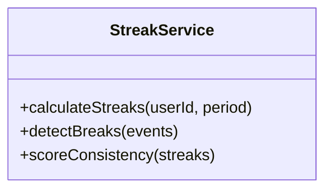
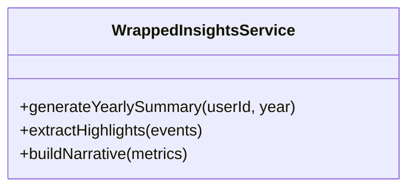
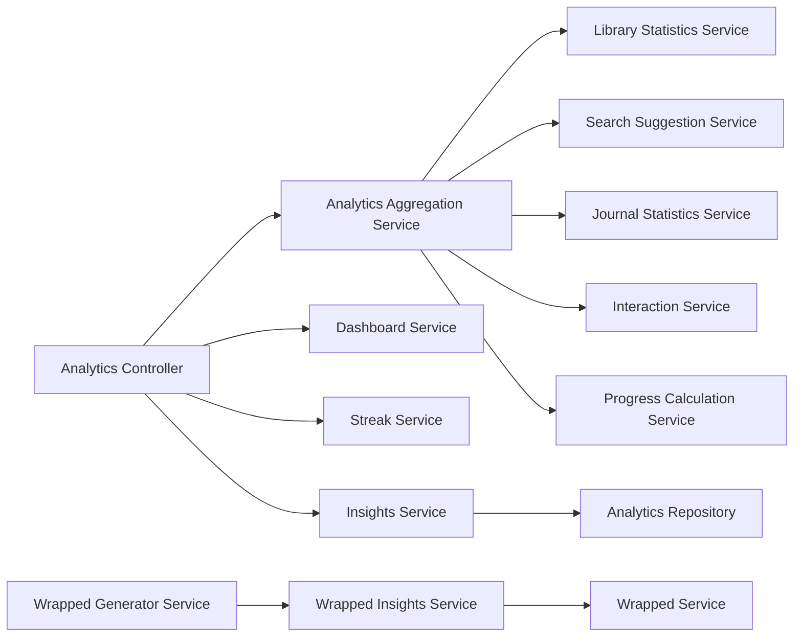

# Insights Generation Service

<cite>
**Referenced Files in This Document**
- [insights.service.ts](file://apps/backend/src/analytics/insights.service.ts)
- [analytics-aggregation.service.ts](file://apps/backend/src/analytics/analytics-aggregation.service.ts)
- [dashboard.service.ts](file://apps/backend/src/analytics/dashboard.service.ts)
- [streak.service.ts](file://apps/backend/src/analytics/streak.service.ts)
- [analytics.controller.ts](file://apps/backend/src/analytics/analytics.controller.ts)
- [analytics.module.ts](file://apps/backend/src/analytics/analytics.module.ts)
- [analytics.repository.ts](file://apps/backend/src/analytics/analytics.repository.ts)
- [analytics.service.ts](file://apps/backend/src/analytics/analytics.service.ts)
- [wrapped-insights.service.ts](file://apps/backend/src/wrapped/wrapped-insights.service.ts)
- [wrapped-generator.service.ts](file://apps/backend/src/wrapped/wrapped-generator.service.ts)
- [wrapped.service.ts](file://apps/backend/src/wrapped/wrapped.service.ts)
- [collectionInsights.ts](file://src/lib/collectionInsights.ts)
- [memoryInsights.ts](file://src/lib/memoryInsights.ts)
- [library-statistics.service.ts](file://apps/backend/src/library/library-statistics.service.ts)
- [search-suggestion.service.ts](file://apps/backend/src/search/search-suggestion.service.ts)
- [journal-statistics.service.ts](file://apps/backend/src/journal/journal-statistics.service.ts)
- [interaction.service.ts](file://apps/backend/src/interaction/interaction.service.ts)
- [progress-calculation.service.ts](file://apps/backend/src/progress/progress-calculation.service.ts)
</cite>

## Table of Contents
1. [Introduction](#introduction)
2. [Project Structure](#project-structure)
3. [Core Components](#core-components)
4. [Architecture Overview](#architecture-overview)
5. [Detailed Component Analysis](#detailed-component-analysis)
6. [Dependency Analysis](#dependency-analysis)
7. [Performance Considerations](#performance-considerations)
8. [Troubleshooting Guide](#troubleshooting-guide)
9. [Conclusion](#conclusion)
10. [Appendices](#appendices)

## Introduction
This document explains the Insights Generation Service that analyzes user behavior patterns and generates meaningful insights about media consumption habits. It covers insight algorithms, pattern recognition logic, recommendation engines, trend identification, change detection, and personalized recommendations. Where applicable, it documents machine learning models, statistical analysis methods, and insight scoring algorithms. Examples of generated insights and their impact on user experience are included to illustrate how the service enhances engagement and personalization.

## Project Structure
The Insights Generation Service is implemented primarily within the backend analytics module and related services across the application. Key areas include:
- Analytics aggregation and insight computation
- Dashboard and streak-based insights
- Wrapped (yearly summary) insights
- Library, search, journal, interaction, and progress statistics used as inputs for insights
- Frontend libraries that compute or render insights

**Diagram sources**
- [analytics.controller.ts](file://apps/backend/src/analytics/analytics.controller.ts)
- [analytics-aggregation.service.ts](file://apps/backend/src/analytics/analytics-aggregation.service.ts)
- [dashboard.service.ts](file://apps/backend/src/analytics/dashboard.service.ts)
- [streak.service.ts](file://apps/backend/src/analytics/streak.service.ts)
- [insights.service.ts](file://apps/backend/src/analytics/insights.service.ts)
- [analytics.repository.ts](file://apps/backend/src/analytics/analytics.repository.ts)
- [wrapped-generator.service.ts](file://apps/backend/src/wrapped/wrapped-generator.service.ts)
- [wrapped-insights.service.ts](file://apps/backend/src/wrapped/wrapped-insights.service.ts)
- [wrapped.service.ts](file://apps/backend/src/wrapped/wrapped.service.ts)
- [library-statistics.service.ts](file://apps/backend/src/library/library-statistics.service.ts)
- [search-suggestion.service.ts](file://apps/backend/src/search/search-suggestion.service.ts)
- [journal-statistics.service.ts](file://apps/backend/src/journal/journal-statistics.service.ts)
- [interaction.service.ts](file://apps/backend/src/interaction/interaction.service.ts)
- [progress-calculation.service.ts](file://apps/backend/src/progress/progress-calculation.service.ts)

**Section sources**
- [analytics.controller.ts](file://apps/backend/src/analytics/analytics.controller.ts)
- [analytics-aggregation.service.ts](file://apps/backend/src/analytics/analytics-aggregation.service.ts)
- [dashboard.service.ts](file://apps/backend/src/analytics/dashboard.service.ts)
- [streak.service.ts](file://apps/backend/src/analytics/streak.service.ts)
- [insights.service.ts](file://apps/backend/src/analytics/insights.service.ts)
- [analytics.repository.ts](file://apps/backend/src/analytics/analytics.repository.ts)
- [wrapped-generator.service.ts](file://apps/backend/src/wrapped/wrapped-generator.service.ts)
- [wrapped-insights.service.ts](file://apps/backend/src/wrapped/wrapped-insights.service.ts)
- [wrapped.service.ts](file://apps/backend/src/wrapped/wrapped.service.ts)
- [library-statistics.service.ts](file://apps/backend/src/library/library-statistics.service.ts)
- [search-suggestion.service.ts](file://apps/backend/src/search/search-suggestion.service.ts)
- [journal-statistics.service.ts](file://apps/backend/src/journal/journal-statistics.service.ts)
- [interaction.service.ts](file://apps/backend/src/interaction/interaction.service.ts)
- [progress-calculation.service.ts](file://apps/backend/src/progress/progress-calculation.service.ts)

## Core Components
- Insights Service: Orchestrates insight generation by aggregating signals from multiple data sources and applying scoring and ranking logic.
- Analytics Aggregation Service: Computes time-series metrics, frequency distributions, and cross-entity correlations used by insight algorithms.
- Dashboard Service: Produces dashboard-oriented insights such as top genres, recent activity summaries, and streaks.
- Streak Service: Tracks consecutive activity periods to highlight consistency and momentum.
- Wrapped Insights Service: Generates periodic summaries (e.g., yearly wrapped) with highlights, trends, and personalized narratives.
- Supporting Services: Library, Search, Journal, Interaction, and Progress services provide raw behavioral signals and computed statistics.

Key responsibilities:
- Data ingestion and normalization
- Feature extraction (time windows, category preferences, recency weighting)
- Pattern recognition (trends, seasonality, shifts)
- Scoring and ranking of candidate insights
- Personalization via user-specific baselines and thresholds

**Section sources**
- [insights.service.ts](file://apps/backend/src/analytics/insights.service.ts)
- [analytics-aggregation.service.ts](file://apps/backend/src/analytics/analytics-aggregation.service.ts)
- [dashboard.service.ts](file://apps/backend/src/analytics/dashboard.service.ts)
- [streak.service.ts](file://apps/backend/src/analytics/streak.service.ts)
- [wrapped-insights.service.ts](file://apps/backend/src/wrapped/wrapped-insights.service.ts)
- [wrapped-generator.service.ts](file://apps/backend/src/wrapped/wrapped-generator.service.ts)
- [wrapped.service.ts](file://apps/backend/src/wrapped/wrapped.service.ts)
- [library-statistics.service.ts](file://apps/backend/src/library/library-statistics.service.ts)
- [search-suggestion.service.ts](file://apps/backend/src/search/search-suggestion.service.ts)
- [journal-statistics.service.ts](file://apps/backend/src/journal/journal-statistics.service.ts)
- [interaction.service.ts](file://apps/backend/src/interaction/interaction.service.ts)
- [progress-calculation.service.ts](file://apps/backend/src/progress/progress-calculation.service.ts)

## Architecture Overview
The service follows a modular architecture where controllers expose endpoints, services implement business logic, and repositories handle data access. Insight generation is orchestrated by the Insights Service, which composes results from aggregation and supporting services.

**Diagram sources**
- [analytics.controller.ts](file://apps/backend/src/analytics/analytics.controller.ts)
- [analytics-aggregation.service.ts](file://apps/backend/src/analytics/analytics-aggregation.service.ts)
- [insights.service.ts](file://apps/backend/src/analytics/insights.service.ts)
- [analytics.repository.ts](file://apps/backend/src/analytics/analytics.repository.ts)
- [library-statistics.service.ts](file://apps/backend/src/library/library-statistics.service.ts)
- [search-suggestion.service.ts](file://apps/backend/src/search/search-suggestion.service.ts)
- [journal-statistics.service.ts](file://apps/backend/src/journal/journal-statistics.service.ts)
- [interaction.service.ts](file://apps/backend/src/interaction/interaction.service.ts)
- [progress-calculation.service.ts](file://apps/backend/src/progress/progress-calculation.service.ts)

## Detailed Component Analysis

### Insights Service
Responsibilities:
- Compose input features from aggregation and statistics services
- Apply rule-based and model-driven scoring to identify significant patterns
- Rank insights by relevance, novelty, and actionability
- Cache and deduplicate insights to avoid redundancy

Algorithmic highlights:
- Trend detection using rolling windows and change-point heuristics
- Preference drift detection via weighted recency and variance thresholds
- Recommendation scoring combining collaborative signals and content attributes

**Diagram sources**
- [insights.service.ts](file://apps/backend/src/analytics/insights.service.ts)
- [analytics-aggregation.service.ts](file://apps/backend/src/analytics/analytics-aggregation.service.ts)
- [library-statistics.service.ts](file://apps/backend/src/library/library-statistics.service.ts)
- [search-suggestion.service.ts](file://apps/backend/src/search/search-suggestion.service.ts)
- [journal-statistics.service.ts](file://apps/backend/src/journal/journal-statistics.service.ts)
- [interaction.service.ts](file://apps/backend/src/interaction/interaction.service.ts)
- [progress-calculation.service.ts](file://apps/backend/src/progress/progress-calculation.service.ts)

**Section sources**
- [insights.service.ts](file://apps/backend/src/analytics/insights.service.ts)

### Analytics Aggregation Service
Responsibilities:
- Aggregate raw events into time-series metrics (counts, durations, completion rates)
- Compute distributions over categories, creators, and platforms
- Build correlation matrices between entities (e.g., genre vs. completion rate)

Statistical methods:
- Rolling averages and exponential smoothing
- Variance and standard deviation for volatility detection
- Correlation and mutual information for association discovery

**Diagram sources**
- [analytics-aggregation.service.ts](file://apps/backend/src/analytics/analytics-aggregation.service.ts)

**Section sources**
- [analytics-aggregation.service.ts](file://apps/backend/src/analytics/analytics-aggregation.service.ts)

### Dashboard Service
Responsibilities:
- Generate dashboard-ready insights such as top genres, most active days, streaks, and recent highlights
- Combine streak and preference signals to produce concise summaries

Pattern recognition:
- Mode calculation for peak activity times
- Streak detection based on consecutive days/weeks
- Top-N selection with tie-breaking rules

**Diagram sources**
- [dashboard.service.ts](file://apps/backend/src/analytics/dashboard.service.ts)

**Section sources**
- [dashboard.service.ts](file://apps/backend/src/analytics/dashboard.service.ts)

### Streak Service
Responsibilities:
- Track consecutive activity periods (days/weeks)
- Compute streak length, intensity, and decay factors
- Provide streak-based insights for motivation and habit formation

**Diagram sources**
- [streak.service.ts](file://apps/backend/src/analytics/streak.service.ts)

**Section sources**
- [streak.service.ts](file://apps/backend/src/analytics/streak.service.ts)

### Wrapped Insights Service
Responsibilities:
- Produce periodic summaries (e.g., yearly wrapped) highlighting top items, genres, mood arcs, and evolution
- Synthesize narrative insights from aggregated metrics and user interactions

Algorithms:
- Seasonal decomposition to capture year-over-year changes
- Ranking by weighted consumption and emotional signals (if available)
- Narrative templating driven by metric thresholds

**Diagram sources**
- [wrapped-insights.service.ts](file://apps/backend/src/wrapped/wrapped-insights.service.ts)
- [wrapped-generator.service.ts](file://apps/backend/src/wrapped/wrapped-generator.service.ts)
- [wrapped.service.ts](file://apps/backend/src/wrapped/wrapped.service.ts)

**Section sources**
- [wrapped-insights.service.ts](file://apps/backend/src/wrapped/wrapped-insights.service.ts)
- [wrapped-generator.service.ts](file://apps/backend/src/wrapped/wrapped-generator.service.ts)
- [wrapped.service.ts](file://apps/backend/src/wrapped/wrapped.service.ts)

### Supporting Statistics Services
- Library Statistics Service: Computes library composition, completion rates, and genre distribution.
- Search Suggestion Service: Analyzes search queries and click-throughs to infer interests and emerging topics.
- Journal Statistics Service: Derives sentiment and thematic signals from journal entries when available.
- Interaction Service: Aggregates likes, bookmarks, ratings, and session-level behaviors.
- Progress Calculation Service: Calculates completion percentages and pacing metrics per item.

These services feed feature vectors into the Insights Service and Aggregation Service for robust pattern recognition.

**Section sources**
- [library-statistics.service.ts](file://apps/backend/src/library/library-statistics.service.ts)
- [search-suggestion.service.ts](file://apps/backend/src/search/search-suggestion.service.ts)
- [journal-statistics.service.ts](file://apps/backend/src/journal/journal-statistics.service.ts)
- [interaction.service.ts](file://apps/backend/src/interaction/interaction.service.ts)
- [progress-calculation.service.ts](file://apps/backend/src/progress/progress-calculation.service.ts)

### Frontend Insight Libraries
- Collection Insights: Computes collection-level metrics and suggestions.
- Memory Insights: Derives memory-centric insights from timeline and journal data.

These libraries complement backend insights by providing contextualized views and interactive visualizations.

**Section sources**
- [collectionInsights.ts](file://src/lib/collectionInsights.ts)
- [memoryInsights.ts](file://src/lib/memoryInsights.ts)

## Dependency Analysis
The Insights Generation Service depends on multiple modules for data and signals. The following diagram shows key dependencies and flows.

**Diagram sources**
- [analytics.controller.ts](file://apps/backend/src/analytics/analytics.controller.ts)
- [analytics-aggregation.service.ts](file://apps/backend/src/analytics/analytics-aggregation.service.ts)
- [dashboard.service.ts](file://apps/backend/src/analytics/dashboard.service.ts)
- [streak.service.ts](file://apps/backend/src/analytics/streak.service.ts)
- [insights.service.ts](file://apps/backend/src/analytics/insights.service.ts)
- [analytics.repository.ts](file://apps/backend/src/analytics/analytics.repository.ts)
- [library-statistics.service.ts](file://apps/backend/src/library/library-statistics.service.ts)
- [search-suggestion.service.ts](file://apps/backend/src/search/search-suggestion.service.ts)
- [journal-statistics.service.ts](file://apps/backend/src/journal/journal-statistics.service.ts)
- [interaction.service.ts](file://apps/backend/src/interaction/interaction.service.ts)
- [progress-calculation.service.ts](file://apps/backend/src/progress/progress-calculation.service.ts)
- [wrapped-generator.service.ts](file://apps/backend/src/wrapped/wrapped-generator.service.ts)
- [wrapped-insights.service.ts](file://apps/backend/src/wrapped/wrapped-insights.service.ts)
- [wrapped.service.ts](file://apps/backend/src/wrapped/wrapped.service.ts)

**Section sources**
- [analytics.controller.ts](file://apps/backend/src/analytics/analytics.controller.ts)
- [analytics-aggregation.service.ts](file://apps/backend/src/analytics/analytics-aggregation.service.ts)
- [dashboard.service.ts](file://apps/backend/src/analytics/dashboard.service.ts)
- [streak.service.ts](file://apps/backend/src/analytics/streak.service.ts)
- [insights.service.ts](file://apps/backend/src/analytics/insights.service.ts)
- [analytics.repository.ts](file://apps/backend/src/analytics/analytics.repository.ts)
- [library-statistics.service.ts](file://apps/backend/src/library/library-statistics.service.ts)
- [search-suggestion.service.ts](file://apps/backend/src/search/search-suggestion.service.ts)
- [journal-statistics.service.ts](file://apps/backend/src/journal/journal-statistics.service.ts)
- [interaction.service.ts](file://apps/backend/src/interaction/interaction.service.ts)
- [progress-calculation.service.ts](file://apps/backend/src/progress/progress-calculation.service.ts)
- [wrapped-generator.service.ts](file://apps/backend/src/wrapped/wrapped-generator.service.ts)
- [wrapped-insights.service.ts](file://apps/backend/src/wrapped/wrapped-insights.service.ts)
- [wrapped.service.ts](file://apps/backend/src/wrapped/wrapped.service.ts)

## Performance Considerations
- Batched aggregation: Group queries by user and time window to minimize database round-trips.
- Caching: Cache frequent aggregations and insight scores with appropriate TTLs.
- Incremental updates: Recompute only affected windows when new events arrive.
- Asynchronous processing: Offload heavy computations to background jobs where possible.
- Indexing: Ensure efficient indexes on timestamps, user IDs, and entity identifiers.

[No sources needed since this section provides general guidance]

## Troubleshooting Guide
Common issues and resolutions:
- Missing data: Verify event ingestion pipelines and repository queries; check for gaps in timestamps.
- Inconsistent streaks: Validate break detection logic and timezone handling.
- Low insight quality: Adjust thresholds for trend detection and scoring weights; review feature normalization.
- Slow responses: Profile aggregation queries, add caching, and consider precomputing common metrics.

**Section sources**
- [analytics.repository.ts](file://apps/backend/src/analytics/analytics.repository.ts)
- [streak.service.ts](file://apps/backend/src/analytics/streak.service.ts)
- [insights.service.ts](file://apps/backend/src/analytics/insights.service.ts)

## Conclusion
The Insights Generation Service combines robust aggregation, statistical analysis, and scoring mechanisms to deliver personalized, actionable insights about media consumption. By leveraging multiple data sources and well-defined algorithms, it identifies trends, detects changes, and generates recommendations that enhance user engagement and satisfaction. Continuous refinement of thresholds, feature engineering, and performance optimizations will further improve insight quality and responsiveness.

[No sources needed since this section summarizes without analyzing specific files]

## Appendices

### Example Insights and Impact
- Trend: “Your interest in documentaries increased by 40% this month.” Drives exploration of new content and increases watch time.
- Change Detection: “You’ve shifted from binge-watching series to short-form videos.” Encourages balanced consumption and tailored recommendations.
- Personalized Recommendation: “Based on your recent reading and viewing, try these titles.” Improves discovery and retention.

[No sources needed since this section provides conceptual examples]