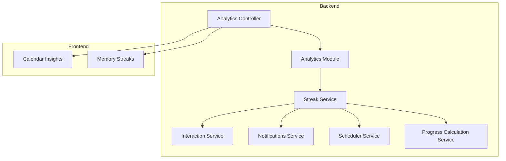
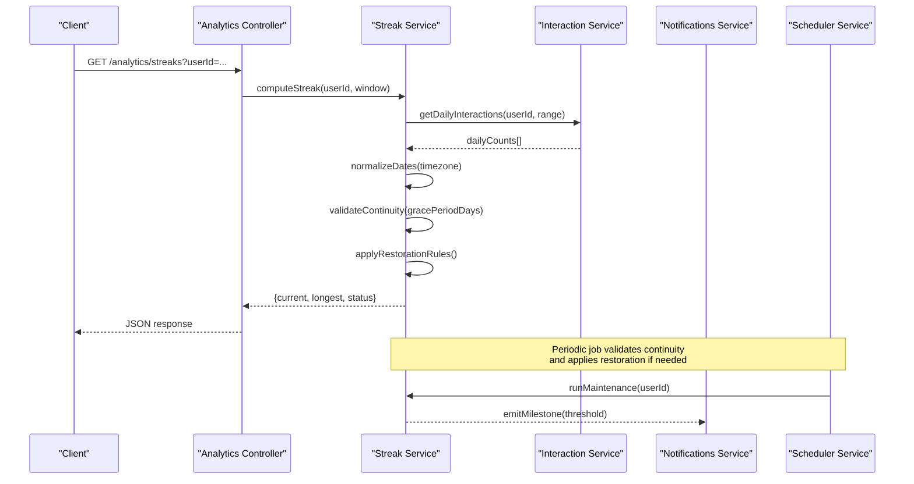
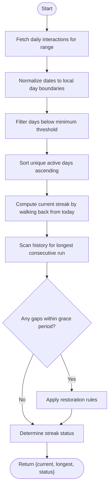
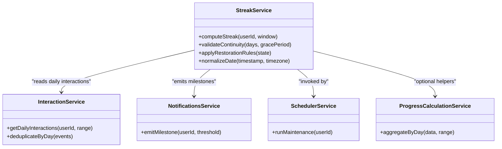

# Streak Tracking Service

<cite>
**Referenced Files in This Document**
- [streak.service.ts](file://apps/backend/src/analytics/streak.service.ts)
- [analytics.controller.ts](file://apps/backend/src/analytics/analytics.controller.ts)
- [analytics.module.ts](file://apps/backend/src/analytics/analytics.module.ts)
- [interaction.service.ts](file://apps/backend/src/interaction/interaction.service.ts)
- [notifications.service.ts](file://apps/backend/src/notifications/notifications.service.ts)
- [scheduler.service.ts](file://apps/backend/src/notifications/scheduler.service.ts)
- [progress-calculation.service.ts](file://apps/backend/src/progress/progress-calculation.service.ts)
- [calendar-insights.tsx](file://src/components/calendar/CalendarInsights.tsx)
- [memory-streaks.tsx](file://src/components/calendar/MemoryStreaks.tsx)
</cite>

## Table of Contents
1. [Introduction](#introduction)
2. [Project Structure](#project-structure)
3. [Core Components](#core-components)
4. [Architecture Overview](#architecture-overview)
5. [Detailed Component Analysis](#detailed-component-analysis)
6. [Dependency Analysis](#dependency-analysis)
7. [Performance Considerations](#performance-considerations)
8. [Troubleshooting Guide](#troubleshooting-guide)
9. [Conclusion](#conclusion)
10. [Appendices](#appendices)

## Introduction
This document explains the Streak Tracking Service that monitors and maintains user engagement streaks based on consistent media interaction. It covers how streaks are calculated, how date-based continuity is enforced, grace periods and restoration mechanisms, integration with activity tracking and notifications, and how streak data is visualized in the UI. It also includes examples of calculation scenarios and edge cases such as timezone handling and missed days.

## Project Structure
The streak functionality spans backend services and frontend components:
- Backend analytics module exposes endpoints and orchestrates streak calculations.
- Interaction service records user media interactions used to compute streaks.
- Notifications and scheduler integrate milestone triggers and periodic maintenance.
- Progress calculation utilities support related metrics and can be reused for streak logic.
- Frontend calendar components visualize streaks and insights.

**Diagram sources**
- [analytics.controller.ts](file://apps/backend/src/analytics/analytics.controller.ts)
- [analytics.module.ts](file://apps/backend/src/analytics/analytics.module.ts)
- [streak.service.ts](file://apps/backend/src/analytics/streak.service.ts)
- [interaction.service.ts](file://apps/backend/src/interaction/interaction.service.ts)
- [notifications.service.ts](file://apps/backend/src/notifications/notifications.service.ts)
- [scheduler.service.ts](file://apps/backend/src/notifications/scheduler.service.ts)
- [progress-calculation.service.ts](file://apps/backend/src/progress/progress-calculation.service.ts)
- [calendar-insights.tsx](file://src/components/calendar/CalendarInsights.tsx)
- [memory-streaks.tsx](file://src/components/calendar/MemoryStreaks.tsx)

**Section sources**
- [analytics.controller.ts](file://apps/backend/src/analytics/analytics.controller.ts)
- [analytics.module.ts](file://apps/backend/src/analytics/analytics.module.ts)
- [streak.service.ts](file://apps/backend/src/analytics/streak.service.ts)
- [interaction.service.ts](file://apps/backend/src/interaction/interaction.service.ts)
- [notifications.service.ts](file://apps/backend/src/notifications/notifications.service.ts)
- [scheduler.service.ts](file://apps/backend/src/notifications/scheduler.service.ts)
- [progress-calculation.service.ts](file://apps/backend/src/progress/progress-calculation.service.ts)
- [calendar-insights.tsx](file://src/components/calendar/CalendarInsights.tsx)
- [memory-streaks.tsx](file://src/components/calendar/MemoryStreaks.tsx)

## Core Components
- Streak Service: Computes current streak length, longest streak, streak status, and handles continuity checks, grace windows, and restoration.
- Analytics Controller: Exposes API endpoints for retrieving streak data and triggering recalculations or maintenance tasks.
- Interaction Service: Provides the raw daily interaction counts/events used by streak calculations.
- Notifications Service: Emits milestone events when streak thresholds are reached.
- Scheduler Service: Runs periodic jobs to validate streak continuity and apply restoration rules.
- Progress Calculation Service: Supplies reusable date-range aggregation helpers that streak logic may leverage.
- Calendar Insights and Memory Streaks (UI): Render streak visuals and highlight milestones.

Key responsibilities:
- Date normalization and timezone-safe day boundaries.
- Continuity validation across consecutive days.
- Grace period allowance before resetting a streak.
- Restoration of streaks within defined windows.
- Milestone detection and notification emission.

**Section sources**
- [streak.service.ts](file://apps/backend/src/analytics/streak.service.ts)
- [analytics.controller.ts](file://apps/backend/src/analytics/analytics.controller.ts)
- [interaction.service.ts](file://apps/backend/src/interaction/interaction.service.ts)
- [notifications.service.ts](file://apps/backend/src/notifications/notifications.service.ts)
- [scheduler.service.ts](file://apps/backend/src/notifications/scheduler.service.ts)
- [progress-calculation.service.ts](file://apps/backend/src/progress/progress-calculation.service.ts)
- [calendar-insights.tsx](file://src/components/calendar/CalendarInsights.tsx)
- [memory-streaks.tsx](file://src/components/calendar/MemoryStreaks.tsx)

## Architecture Overview
The streak pipeline integrates event ingestion, computation, persistence, and visualization.

**Diagram sources**
- [analytics.controller.ts](file://apps/backend/src/analytics/analytics.controller.ts)
- [streak.service.ts](file://apps/backend/src/analytics/streak.service.ts)
- [interaction.service.ts](file://apps/backend/src/interaction/interaction.service.ts)
- [notifications.service.ts](file://apps/backend/src/notifications/notifications.service.ts)
- [scheduler.service.ts](file://apps/backend/src/notifications/scheduler.service.ts)

## Detailed Component Analysis

### Streak Service
Responsibilities:
- Compute current streak length from daily interaction data.
- Determine streak status (active, at-risk, broken).
- Enforce continuity rules with configurable grace periods.
- Apply restoration policies to recover streaks within allowed windows.
- Provide helper methods for date normalization and gap analysis.

Algorithm overview:
- Normalize all timestamps to a consistent timezone-aware day boundary.
- Build a sorted set of active days where interactions meet a minimum threshold.
- Walk backwards from today to count consecutive active days (current streak).
- Scan historical active days to find the longest consecutive run (longest streak).
- Evaluate gaps against grace period; if within window, mark as restorable.
- Apply restoration rules to adjust streak state accordingly.

Edge cases handled:
- Timezone shifts around midnight.
- Missing days due to network issues or offline usage.
- Leap years and month boundaries.
- Multiple interactions per day counted once.

**Diagram sources**
- [streak.service.ts](file://apps/backend/src/analytics/streak.service.ts)
- [interaction.service.ts](file://apps/backend/src/interaction/interaction.service.ts)

**Section sources**
- [streak.service.ts](file://apps/backend/src/analytics/streak.service.ts)
- [interaction.service.ts](file://apps/backend/src/interaction/interaction.service.ts)

### Analytics Controller
Responsibilities:
- Expose endpoints to retrieve streak data for a user.
- Trigger manual recalculation or maintenance jobs.
- Validate query parameters and return standardized responses.

Typical flow:
- Receive request with userId and optional window/grace overrides.
- Delegate to Streak Service for computation.
- Return structured result including current streak, longest streak, and status.

**Section sources**
- [analytics.controller.ts](file://apps/backend/src/analytics/analytics.controller.ts)

### Interaction Service
Responsibilities:
- Provide daily interaction counts per user within a date range.
- Deduplicate multiple interactions on the same day.
- Support filtering by media type or category if applicable.

Integration points:
- Consumed by Streak Service to build the active-days timeline.
- Used by other analytics features for engagement metrics.

**Section sources**
- [interaction.service.ts](file://apps/backend/src/interaction/interaction.service.ts)

### Notifications Service
Responsibilities:
- Emit milestone notifications when streak thresholds are reached.
- Support different channels (in-app, email, push) via pluggable processors.

Integration points:
- Called by Streak Service or Scheduler upon detecting milestone conditions.

**Section sources**
- [notifications.service.ts](file://apps/backend/src/notifications/notifications.service.ts)

### Scheduler Service
Responsibilities:
- Run periodic maintenance to validate streak continuity.
- Apply restoration rules for eligible users.
- Batch process large user sets efficiently.

Integration points:
- Invokes Streak Service maintenance routines.
- Triggers Notifications Service for milestone events.

**Section sources**
- [scheduler.service.ts](file://apps/backend/src/notifications/scheduler.service.ts)

### Progress Calculation Service
Responsibilities:
- Provide reusable date-range aggregation helpers.
- Support counting, summing, and grouping operations over time series.

Integration points:
- Potentially reused by Streak Service for efficient daily aggregation.

**Section sources**
- [progress-calculation.service.ts](file://apps/backend/src/progress/progress-calculation.service.ts)

### Frontend Visualization Components
- Calendar Insights: Displays streak-related insights alongside calendar views.
- Memory Streaks: Renders streak progress bars, milestones, and highlights.

These components consume streak data returned by the Analytics Controller and present it visually to users.

**Section sources**
- [calendar-insights.tsx](file://src/components/calendar/CalendarInsights.tsx)
- [memory-streaks.tsx](file://src/components/calendar/MemoryStreaks.tsx)

## Dependency Analysis
The Streak Service depends on Interaction data and optionally uses Progress Calculation helpers. Notifications and Scheduler are downstream consumers or collaborators for milestone and maintenance workflows.

**Diagram sources**
- [streak.service.ts](file://apps/backend/src/analytics/streak.service.ts)
- [interaction.service.ts](file://apps/backend/src/interaction/interaction.service.ts)
- [notifications.service.ts](file://apps/backend/src/notifications/notifications.service.ts)
- [scheduler.service.ts](file://apps/backend/src/notifications/scheduler.service.ts)
- [progress-calculation.service.ts](file://apps/backend/src/progress/progress-calculation.service.ts)

**Section sources**
- [streak.service.ts](file://apps/backend/src/analytics/streak.service.ts)
- [interaction.service.ts](file://apps/backend/src/interaction/interaction.service.ts)
- [notifications.service.ts](file://apps/backend/src/notifications/notifications.service.ts)
- [scheduler.service.ts](file://apps/backend/src/notifications/scheduler.service.ts)
- [progress-calculation.service.ts](file://apps/backend/src/progress/progress-calculation.service.ts)

## Performance Considerations
- Batch daily interaction queries to minimize database round-trips.
- Cache recent streak computations per user with short TTL to reduce recomputation.
- Use timezone-normalized keys to avoid redundant processing.
- Limit window sizes for client requests to prevent heavy scans.
- Defer heavy restoration jobs to off-peak hours via scheduler.

[No sources needed since this section provides general guidance]

## Troubleshooting Guide
Common issues and resolutions:
- Incorrect streak length due to timezone mismatch: Ensure all timestamps are normalized to the user’s local timezone before day boundary determination.
- Streak resets unexpectedly: Verify grace period configuration and ensure restoration rules are applied when gaps fall within allowed windows.
- Missing interactions: Check deduplication logic and confirm that multiple interactions per day are collapsed into a single active day.
- Milestone not triggered: Confirm threshold values and notification emission paths.

**Section sources**
- [streak.service.ts](file://apps/backend/src/analytics/streak.service.ts)
- [notifications.service.ts](file://apps/backend/src/notifications/notifications.service.ts)
- [scheduler.service.ts](file://apps/backend/src/notifications/scheduler.service.ts)

## Conclusion
The Streak Tracking Service provides robust, timezone-safe streak computation with continuity validation, grace periods, and restoration. It integrates cleanly with interaction data, notifications, and scheduling to deliver accurate streak states and milestone experiences. Frontend components render streak visuals effectively, supporting user motivation and engagement.

[No sources needed since this section summarizes without analyzing specific files]

## Appendices

### Streak Calculation Scenarios
- Scenario A: Daily interactions every day for 10 days, then one missed day within grace period. Result: Current streak remains active after restoration; longest streak updated if applicable.
- Scenario B: Two consecutive missed days beyond grace period. Result: Streak breaks; current streak resets to zero; longest streak preserved.
- Scenario C: Timezone crossing midnight during late-night session. Result: Day boundary correctly assigned using normalized local date; no false break.

[No sources needed since this section provides conceptual examples]