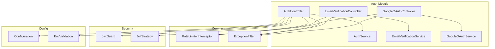
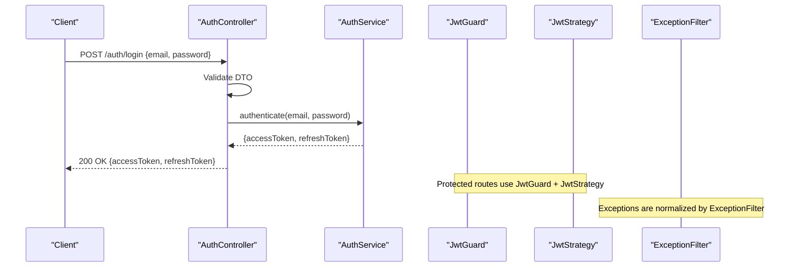
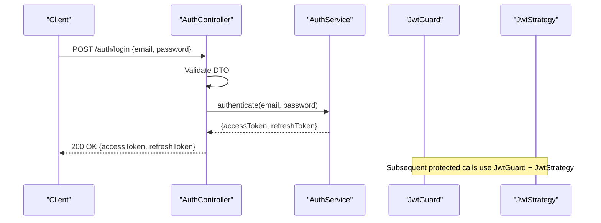
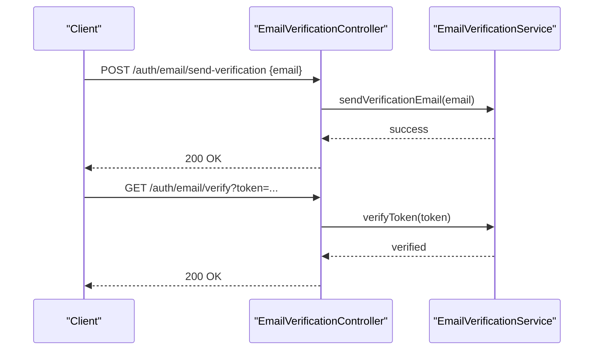
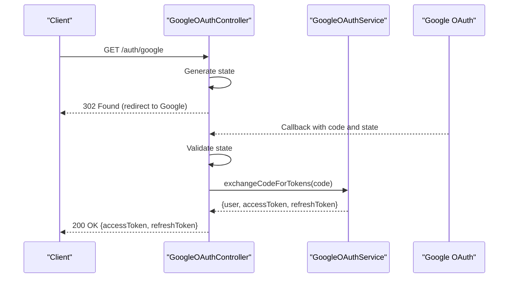
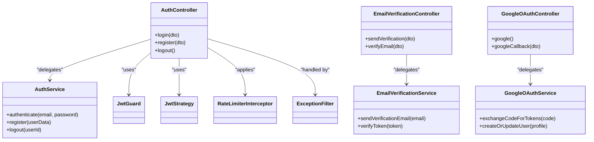

# Authentication Controllers

<cite>
**Referenced Files in This Document**
- [auth.controller.ts](file://apps/backend/src/auth/auth.controller.ts)
- [auth.module.ts](file://apps/backend/src/auth/auth.module.ts)
- [auth.service.ts](file://apps/backend/src/auth/auth.service.ts)
- [email-verification.controller.ts](file://apps/backend/src/auth/controllers/email-verification.controller.ts)
- [google-oauth.controller.ts](file://apps/backend/src/auth/controllers/google-oauth.controller.ts)
- [login.dto.ts](file://apps/backend/src/auth/dto/login.dto.ts)
- [register.dto.ts](file://apps/backend/src/auth/dto/register.dto.ts)
- [verify-email.dto.ts](file://apps/backend/src/auth/dto/verify-email.dto.ts)
- [google-auth.dto.ts](file://apps/backend/src/auth/dto/google-auth.dto.ts)
- [jwt.strategy.ts](file://apps/backend/src/auth/strategies/jwt.strategy.ts)
- [jwt.guard.ts](file://apps/backend/src/auth/guards/jwt.guard.ts)
- [rate-limiter.interceptor.ts](file://apps/backend/src/common/interceptors/rate-limiter.interceptor.ts)
- [exception.filter.ts](file://apps/backend/src/common/filters/exception.filter.ts)
- [configuration.ts](file://apps/backend/src/config/configuration.ts)
- [env.validation.ts](file://apps/backend/src/config/env.validation.ts)
</cite>

## Table of Contents
1. [Introduction](#introduction)
2. [Project Structure](#project-structure)
3. [Core Components](#core-components)
4. [Architecture Overview](#architecture-overview)
5. [Detailed Component Analysis](#detailed-component-analysis)
6. [Dependency Analysis](#dependency-analysis)
7. [Performance Considerations](#performance-considerations)
8. [Troubleshooting Guide](#troubleshooting-guide)
9. [Conclusion](#conclusion)

## Introduction
This document explains the Authentication Controllers that expose HTTP endpoints for user authentication, including login, register, logout, email verification, and Google OAuth integration. It covers request/response DTOs, validation patterns, error handling strategies, and how controllers delegate business logic to services. Typical flows, status codes, and response formats are included to help both new and experienced developers understand the system.

## Project Structure
The authentication feature is implemented as a NestJS module with:
- A main auth controller exposing core endpoints (login, register, logout).
- Specialized controllers for email verification and Google OAuth.
- DTOs for input validation and response shaping.
- Guards and strategies for JWT-based authorization.
- Services encapsulating business logic and external integrations.
- Global interceptors and filters for cross-cutting concerns like rate limiting and exception handling.

**Diagram sources**
- [auth.controller.ts](file://apps/backend/src/auth/auth.controller.ts)
- [email-verification.controller.ts](file://apps/backend/src/auth/controllers/email-verification.controller.ts)
- [google-oauth.controller.ts](file://apps/backend/src/auth/controllers/google-oauth.controller.ts)
- [auth.service.ts](file://apps/backend/src/auth/auth.service.ts)
- [jwt.guard.ts](file://apps/backend/src/auth/guards/jwt.guard.ts)
- [jwt.strategy.ts](file://apps/backend/src/auth/strategies/jwt.strategy.ts)
- [rate-limiter.interceptor.ts](file://apps/backend/src/common/interceptors/rate-limiter.interceptor.ts)
- [exception.filter.ts](file://apps/backend/src/common/feters/exception.filter.ts)
- [configuration.ts](file://apps/backend/src/config/configuration.ts)
- [env.validation.ts](file://apps/backend/src/config/env.validation.ts)

**Section sources**
- [auth.module.ts](file://apps/backend/src/auth/auth.module.ts)

## Core Components
- AuthController: Handles login, register, and logout endpoints. Validates requests via DTOs, delegates to AuthService, and returns standardized responses.
- EmailVerificationController: Manages sending verification emails and verifying tokens.
- GoogleOAuthController: Orchestrates Google OAuth flow, token exchange, and session creation.
- AuthService: Implements authentication business logic, including credential checks, token issuance, and password management.
- DTOs: Enforce input shape and constraints for all endpoints.
- Guards and Strategies: Provide JWT-based access control and strategy configuration.
- Interceptors and Filters: Apply rate limiting globally and normalize exceptions.

**Section sources**
- [auth.controller.ts](file://apps/backend/src/auth/auth.controller.ts)
- [auth.service.ts](file://apps/backend/src/auth/auth.service.ts)
- [email-verification.controller.ts](file://apps/backend/src/auth/controllers/email-verification.controller.ts)
- [google-oauth.controller.ts](file://apps/backend/src/auth/controllers/google-oauth.controller.ts)
- [login.dto.ts](file://apps/backend/src/auth/dto/login.dto.ts)
- [register.dto.ts](file://apps/backend/src/auth/dto/register.dto.ts)
- [verify-email.dto.ts](file://apps/backend/src/auth/dto/verify-email.dto.ts)
- [google-auth.dto.ts](file://apps/backend/src/auth/dto/google-auth.dto.ts)
- [jwt.guard.ts](file://apps/backend/src/auth/guards/jwt.guard.ts)
- [jwt.strategy.ts](file://apps/backend/src/auth/strategies/jwt.strategy.ts)
- [rate-limiter.interceptor.ts](file://apps/backend/src/common/interceptors/rate-limiter.interceptor.ts)
- [exception.filter.ts](file://apps/backend/src/common/filters/exception.filter.ts)

## Architecture Overview
The authentication architecture follows a layered approach:
- Controllers receive HTTP requests, validate inputs using DTOs, and call services.
- Services implement business logic, interact with repositories or external providers, and return domain results.
- Guards enforce authorization based on JWT tokens.
- Interceptors apply global behaviors such as rate limiting.
- Filters centralize error handling and response formatting.

**Diagram sources**
- [auth.controller.ts](file://apps/backend/src/auth/auth.controller.ts)
- [auth.service.ts](file://apps/backend/src/auth/auth.service.ts)
- [jwt.guard.ts](file://apps/backend/src/auth/guards/jwt.guard.ts)
- [jwt.strategy.ts](file://apps/backend/src/auth/strategies/jwt.strategy.ts)
- [exception.filter.ts](file://apps/backend/src/common/filters/exception.filter.ts)

## Detailed Component Analysis

### AuthController
Responsibilities:
- Exposes endpoints for login, register, and logout.
- Validates payloads using DTOs.
- Delegates authentication operations to AuthService.
- Returns standardized success/error responses.

Typical endpoints:
- POST /auth/login: Accepts credentials, issues tokens upon success.
- POST /auth/register: Creates a new user account, may require email verification.
- POST /auth/logout: Invalidates sessions/tokens.

Request/Response patterns:
- Login: Request body includes email and password; response includes access and refresh tokens.
- Register: Request body includes name, email, password; response indicates success and next steps (e.g., verify email).
- Logout: No body; response confirms session termination.

Status codes:
- 200 OK for successful operations.
- 400 Bad Request for validation errors.
- 401 Unauthorized for invalid credentials or expired tokens.
- 409 Conflict for duplicate registration attempts.
- 500 Internal Server Error for unexpected failures.

Error handling:
- Validation errors are caught early and returned with structured messages.
- Business exceptions are handled by global filters.

**Section sources**
- [auth.controller.ts](file://apps/backend/src/auth/auth.controller.ts)
- [login.dto.ts](file://apps/backend/src/auth/dto/login.dto.ts)
- [register.dto.ts](file://apps/backend/src/auth/dto/register.dto.ts)
- [auth.service.ts](file://apps/backend/src/auth/auth.service.ts)

#### Login Flow Sequence

**Diagram sources**
- [auth.controller.ts](file://apps/backend/src/auth/auth.controller.ts)
- [auth.service.ts](file://apps/backend/src/auth/auth.service.ts)
- [jwt.guard.ts](file://apps/backend/src/auth/guards/jwt.guard.ts)
- [jwt.strategy.ts](file://apps/backend/src/auth/strategies/jwt.strategy.ts)

### EmailVerificationController
Responsibilities:
- Sends verification emails to newly registered users.
- Verifies email tokens and marks accounts as verified.

Endpoints:
- POST /auth/email/send-verification: Initiates email verification.
- GET /auth/email/verify: Verifies token and updates user status.

DTOs:
- VerifyEmailDto: Contains token and optional email for verification.

Status codes:
- 200 OK for successful verification.
- 400 Bad Request for malformed requests.
- 401 Unauthorized for invalid/expired tokens.
- 404 Not Found if user not found.
- 409 Conflict if already verified.

Error handling:
- Token validation errors are mapped to clear messages.
- Email delivery failures are logged and surfaced appropriately.

**Section sources**
- [email-verification.controller.ts](file://apps/backend/src/auth/controllers/email-verification.controller.ts)
- [verify-email.dto.ts](file://apps/backend/src/auth/dto/verify-email.dto.ts)

#### Email Verification Flow Sequence

**Diagram sources**
- [email-verification.controller.ts](file://apps/backend/src/auth/controllers/email-verification.controller.ts)

### GoogleOAuthController
Responsibilities:
- Handles Google OAuth callback and token exchange.
- Creates or links user accounts based on Google profile data.
- Issues JWT tokens after successful OAuth flow.

Endpoints:
- GET /auth/google: Redirects to Google OAuth consent screen.
- GET /auth/google/callback: Processes Google callback, exchanges code for tokens, and creates session.

DTOs:
- GoogleAuthDto: May include state and code parameters for callback processing.

Status codes:
- 302 Found for redirect to Google.
- 200 OK for successful callback and session creation.
- 400 Bad Request for invalid parameters.
- 401 Unauthorized for failed token exchange.
- 500 Internal Server Error for provider errors.

Error handling:
- Provider errors are captured and translated into user-friendly messages.
- State validation prevents CSRF attacks.

**Section sources**
- [google-oauth.controller.ts](file://apps/backend/src/auth/controllers/google-oauth.controller.ts)
- [google-auth.dto.ts](file://apps/backend/src/auth/dto/google-auth.dto.ts)

#### Google OAuth Flow Sequence

**Diagram sources**
- [google-oauth.controller.ts](file://apps/backend/src/auth/controllers/google-oauth.controller.ts)
- [google-auth.dto.ts](file://apps/backend/src/auth/dto/google-auth.dto.ts)

### DTOs and Validation Patterns
- LoginDto: Validates email format and password presence.
- RegisterDto: Validates name, email uniqueness, and password strength.
- VerifyEmailDto: Validates token presence and optional email.
- GoogleAuthDto: Validates state and code parameters.

Validation patterns:
- Use decorators to enforce required fields, formats, and constraints.
- Centralized validation ensures consistent error responses.

**Section sources**
- [login.dto.ts](file://apps/backend/src/auth/dto/login.dto.ts)
- [register.dto.ts](file://apps/backend/src/auth/dto/register.dto.ts)
- [verify-email.dto.ts](file://apps/backend/src/auth/dto/verify-email.dto.ts)
- [google-auth.dto.ts](file://apps/backend/src/auth/dto/google-auth.dto.ts)

### Error Handling Strategies
- Global ExceptionFilter normalizes errors into consistent JSON structures.
- RateLimiterInterceptor prevents abuse by throttling requests.
- Controllers catch specific exceptions and map them to appropriate HTTP status codes.

**Section sources**
- [exception.filter.ts](file://apps/backend/src/common/filters/exception.filter.ts)
- [rate-limiter.interceptor.ts](file://apps/backend/src/common/interceptors/rate-limiter.interceptor.ts)

## Dependency Analysis
Controllers depend on services for business logic and on guards/strategies for security. Configuration and environment validation ensure secure defaults.

**Diagram sources**
- [auth.controller.ts](file://apps/backend/src/auth/auth.controller.ts)
- [email-verification.controller.ts](file://apps/backend/src/auth/controllers/email-verification.controller.ts)
- [google-oauth.controller.ts](file://apps/backend/src/auth/controllers/google-oauth.controller.ts)
- [auth.service.ts](file://apps/backend/src/auth/auth.service.ts)
- [jwt.guard.ts](file://apps/backend/src/auth/guards/jwt.guard.ts)
- [jwt.strategy.ts](file://apps/backend/src/auth/strategies/jwt.strategy.ts)
- [rate-limiter.interceptor.ts](file://apps/backend/src/common/interceptors/rate-limiter.interceptor.ts)
- [exception.filter.ts](file://apps/backend/src/common/filters/exception.filter.ts)

**Section sources**
- [auth.module.ts](file://apps/backend/src/auth/auth.module.ts)

## Performance Considerations
- Use DTO validation to fail fast on invalid inputs.
- Cache frequently accessed data where appropriate (e.g., user profiles).
- Implement rate limiting to protect against brute-force attacks.
- Optimize database queries in services to reduce latency.
- Avoid synchronous I/O in controllers; delegate to async services.

[No sources needed since this section provides general guidance]

## Troubleshooting Guide
Common issues and resolutions:
- Validation errors: Ensure DTOs match client payloads and constraints.
- Token expiration: Refresh tokens should be handled gracefully.
- Email delivery failures: Check SMTP configuration and retry policies.
- OAuth callback errors: Validate state and code parameters carefully.
- Rate limiting: Adjust thresholds based on traffic patterns.

**Section sources**
- [exception.filter.ts](file://apps/backend/src/common/filters/exception.filter.ts)
- [rate-limiter.interceptor.ts](file://apps/backend/src/common/interceptors/rate-limiter.interceptor.ts)

## Conclusion
The Authentication Controllers provide a robust foundation for user authentication, supporting standard login/register/logout flows, email verification, and Google OAuth integration. By leveraging DTOs for validation, services for business logic, and global mechanisms for security and error handling, the system ensures reliability, scalability, and maintainability.

[No sources needed since this section summarizes without analyzing specific files]