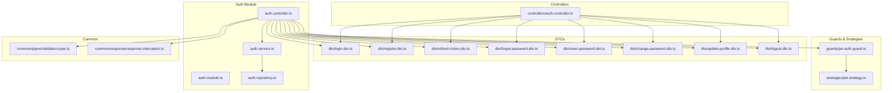
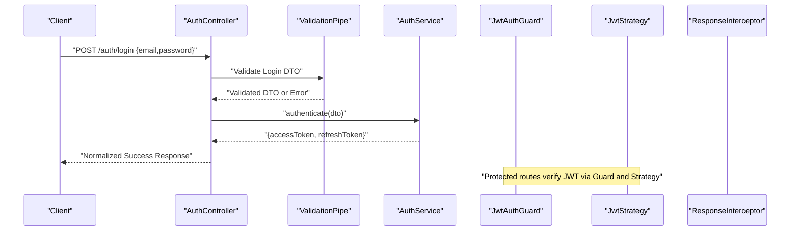
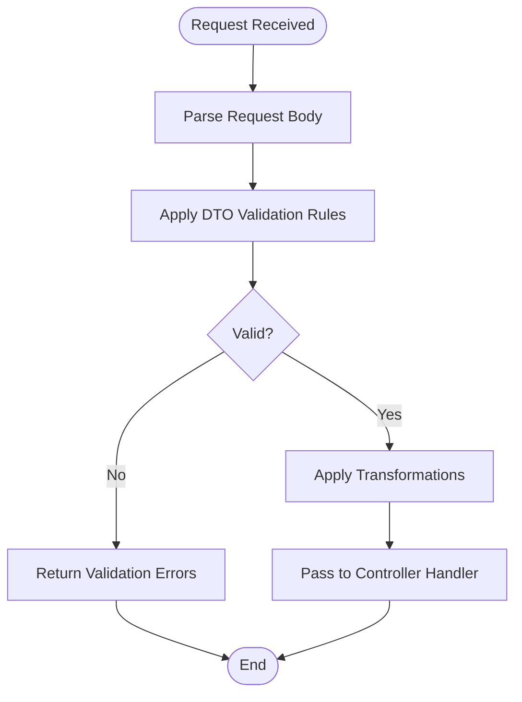
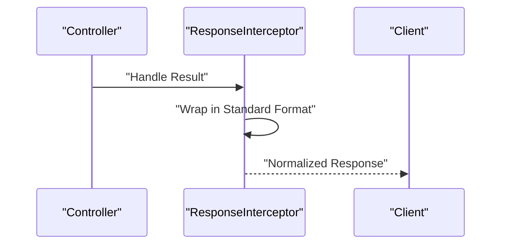
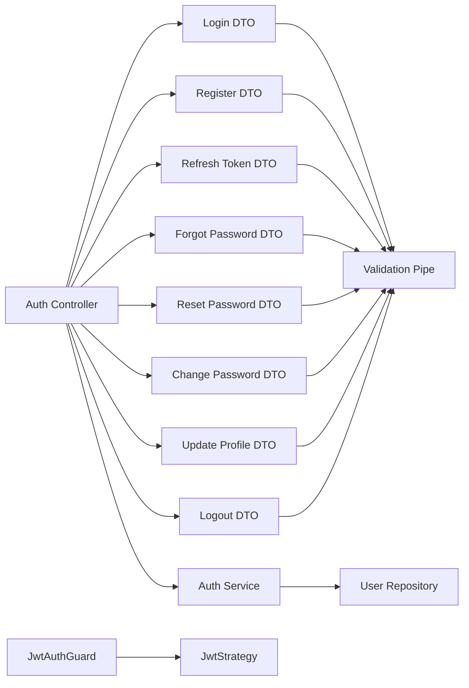

# Authentication DTOs

<cite>
**Referenced Files in This Document**
- [auth.controller.ts](file://apps/backend/src/auth/auth.controller.ts)
- [auth.service.ts](file://apps/backend/src/auth/auth.service.ts)
- [auth.module.ts](file://apps/backend/src/auth/auth.module.ts)
- [dto/login.dto.ts](file://apps/backend/src/auth/dto/login.dto.ts)
- [dto/register.dto.ts](file://apps/backend/src/auth/dto/register.dto.ts)
- [dto/refresh-token.dto.ts](file://apps/backend/src/auth/dto/refresh-token.dto.ts)
- [dto/forgot-password.dto.ts](file://apps/backend/src/auth/dto/forgot-password.dto.ts)
- [dto/reset-password.dto.ts](file://apps/backend/src/auth/dto/reset-password.dto.ts)
- [dto/change-password.dto.ts](file://apps/backend/src/auth/dto/change-password.dto.ts)
- [dto/update-profile.dto.ts](file://apps/backend/src/auth/dto/update-profile.dto.ts)
- [dto/logout.dto.ts](file://apps/backend/src/auth/dto/logout.dto.ts)
- [controllers/auth.controller.ts](file://apps/backend/src/auth/controllers/auth.controller.ts)
- [guards/jwt-auth.guard.ts](file://apps/backend/src/auth/guards/jwt-auth.guard.ts)
- [strategies/jwt.strategy.ts](file://apps/backend/src/auth/strategies/jwt.strategy.ts)
- [services/auth.service.ts](file://apps/backend/src/auth/services/auth.service.ts)
- [repositories/user.repository.ts](file://apps/backend/src/auth/repositories/user.repository.ts)
- [common/pipes/validation.pipe.ts](file://apps/backend/src/common/pipes/validation.pipe.ts)
- [common/response/response.interceptor.ts](file://apps/backend/src/common/response/response.interceptor.ts)
</cite>

## Table of Contents
1. [Introduction](#introduction)
2. [Project Structure](#project-structure)
3. [Core Components](#core-components)
4. [Architecture Overview](#architecture-overview)
5. [Detailed Component Analysis](#detailed-component-analysis)
6. [Dependency Analysis](#dependency-analysis)
7. [Performance Considerations](#performance-considerations)
8. [Troubleshooting Guide](#troubleshooting-guide)
9. [Conclusion](#conclusion)

## Introduction
This document explains the Data Transfer Objects (DTOs) used for request and response validation across authentication endpoints. It details field constraints, validation rules, transformation pipes, error messages, and typical request/response examples. It also provides best practices for designing robust DTOs in an authentication context.

## Project Structure
The authentication subsystem is organized under apps/backend/src/auth with a clear separation between controllers, services, repositories, guards, strategies, and DTOs. Validation is enforced at the controller layer using DTOs and shared validation utilities. Responses are normalized through a common response interceptor.

**Diagram sources**
- [auth.controller.ts](file://apps/backend/src/auth/auth.controller.ts)
- [auth.module.ts](file://apps/backend/src/auth/auth.module.ts)
- [auth.service.ts](file://apps/backend/src/auth/auth.service.ts)
- [auth.repository.ts](file://apps/backend/src/auth/auth.repository.ts)
- [controllers/auth.controller.ts](file://apps/backend/src/auth/controllers/auth.controller.ts)
- [dto/login.dto.ts](file://apps/backend/src/auth/dto/login.dto.ts)
- [dto/register.dto.ts](file://apps/backend/src/auth/dto/register.dto.ts)
- [dto/refresh-token.dto.ts](file://apps/backend/src/auth/dto/refresh-token.dto.ts)
- [dto/forgot-password.dto.ts](file://apps/backend/src/auth/dto/forgot-password.dto.ts)
- [dto/reset-password.dto.ts](file://apps/backend/src/auth/dto/reset-password.dto.ts)
- [dto/change-password.dto.ts](file://apps/backend/src/auth/dto/change-password.dto.ts)
- [dto/update-profile.dto.ts](file://apps/backend/src/auth/dto/update-profile.dto.ts)
- [dto/logout.dto.ts](file://apps/backend/src/auth/dto/logout.dto.ts)
- [guards/jwt-auth.guard.ts](file://apps/backend/src/auth/guards/jwt-auth.guard.ts)
- [strategies/jwt.strategy.ts](file://apps/backend/src/auth/strategies/jwt.strategy.ts)
- [common/pipes/validation.pipe.ts](file://apps/backend/src/common/pipes/validation.pipe.ts)
- [common/response/response.interceptor.ts](file://apps/backend/src/common/response/response.interceptor.ts)

**Section sources**
- [auth.controller.ts](file://apps/backend/src/auth/auth.controller.ts)
- [auth.module.ts](file://apps/backend/src/auth/auth.module.ts)
- [controllers/auth.controller.ts](file://apps/backend/src/auth/controllers/auth.controller.ts)

## Core Components
This section outlines the primary DTOs used to validate authentication requests and responses. Each DTO defines:
- Field names and types
- Validation rules (required, min/max length, patterns)
- Transformation behavior (e.g., trimming, lowercasing)
- Error messages returned on validation failure

Key DTOs:
- Login DTO: validates credentials for sign-in
- Register DTO: validates new account creation data
- Refresh Token DTO: validates token refresh payloads
- Forgot Password DTO: validates email-based password reset initiation
- Reset Password DTO: validates password reset execution
- Change Password DTO: validates authenticated password changes
- Update Profile DTO: validates profile updates
- Logout DTO: validates logout requests

Typical fields include email, password, tokens, and optional profile attributes. Validation ensures security and consistency before business logic executes.

**Section sources**
- [dto/login.dto.ts](file://apps/backend/src/auth/dto/login.dto.ts)
- [dto/register.dto.ts](file://apps/backend/src/auth/dto/register.dto.ts)
- [dto/refresh-token.dto.ts](file://apps/backend/src/auth/dto/refresh-token.dto.ts)
- [dto/forgot-password.dto.ts](file://apps/backend/src/auth/dto/forgot-password.dto.ts)
- [dto/reset-password.dto.ts](file://apps/backend/src/auth/dto/reset-password.dto.ts)
- [dto/change-password.dto.ts](file://apps/backend/src/auth/dto/change-password.dto.ts)
- [dto/update-profile.dto.ts](file://apps/backend/src/auth/dto/update-profile.dto.ts)
- [dto/logout.dto.ts](file://apps/backend/src/auth/dto/logout.dto.ts)

## Architecture Overview
Authentication flows use DTOs at the boundary to enforce input contracts. Controllers accept validated DTOs, delegate to services, and return standardized responses. Guards and strategies handle JWT verification, while pipes centralize validation and transformation.

**Diagram sources**
- [controllers/auth.controller.ts](file://apps/backend/src/auth/controllers/auth.controller.ts)
- [common/pipes/validation.pipe.ts](file://apps/backend/src/common/pipes/validation.pipe.ts)
- [auth.service.ts](file://apps/backend/src/auth/auth.service.ts)
- [guards/jwt-auth.guard.ts](file://apps/backend/src/auth/guards/jwt-auth.guard.ts)
- [strategies/jwt.strategy.ts](file://apps/backend/src/auth/strategies/jwt.strategy.ts)
- [common/response/response.interceptor.ts](file://apps/backend/src/common/response/response.interceptor.ts)

## Detailed Component Analysis

### Login DTO
Purpose: Validate user credentials for sign-in.
- Fields:
  - email: required, valid email format, trimmed
  - password: required, minimum length constraint
- Validation rules:
  - Required checks
  - Email pattern validation
  - Password strength constraints
- Transformations:
  - Trim whitespace
  - Normalize email casing if configured
- Error messages:
  - Missing email/password
  - Invalid email format
  - Password too short

Typical request example:
- POST /auth/login
- Body: { "email": "user@example.com", "password": "securePass123" }

Typical response example:
- 200 OK
- Body: { "accessToken": "...", "refreshToken": "..." }

**Section sources**
- [dto/login.dto.ts](file://apps/backend/src/auth/dto/login.dto.ts)
- [controllers/auth.controller.ts](file://apps/backend/src/auth/controllers/auth.controller.ts)

### Register DTO
Purpose: Validate new account registration data.
- Fields:
  - email: required, unique, valid email format
  - password: required, meets complexity requirements
  - name: optional, string, max length
- Validation rules:
  - Required email/password
  - Email uniqueness check (service-layer)
  - Password complexity (length, characters)
  - Name length limits
- Transformations:
  - Trim name
  - Lowercase email
- Error messages:
  - Duplicate email
  - Invalid email
  - Weak password
  - Excessive name length

Typical request example:
- POST /auth/register
- Body: { "email": "newuser@example.com", "password": "StrongPass!1", "name": "New User" }

Typical response example:
- 201 Created
- Body: { "id": "...", "email": "newuser@example.com", "name": "New User" }

**Section sources**
- [dto/register.dto.ts](file://apps/backend/src/auth/dto/register.dto.ts)
- [controllers/auth.controller.ts](file://apps/backend/src/auth/controllers/auth.controller.ts)

### Refresh Token DTO
Purpose: Validate token refresh requests.
- Fields:
  - refreshToken: required, valid token format
- Validation rules:
  - Required refresh token
  - Format validation (JWT structure)
- Transformations:
  - Trim whitespace
- Error messages:
  - Missing refresh token
  - Invalid token format

Typical request example:
- POST /auth/refresh
- Body: { "refreshToken": "eyJhbGciOiJIUzI1NiIsInR5cCI6IkpXVCJ9..." }

Typical response example:
- 200 OK
- Body: { "accessToken": "...", "refreshToken": "..." }

**Section sources**
- [dto/refresh-token.dto.ts](file://apps/backend/src/auth/dto/refresh-token.dto.ts)
- [controllers/auth.controller.ts](file://apps/backend/src/auth/controllers/auth.controller.ts)

### Forgot Password DTO
Purpose: Validate password reset initiation by email.
- Fields:
  - email: required, valid email format
- Validation rules:
  - Required email
  - Email format validation
- Transformations:
  - Trim whitespace
  - Lowercase email
- Error messages:
  - Missing email
  - Invalid email format

Typical request example:
- POST /auth/forgot-password
- Body: { "email": "user@example.com" }

Typical response example:
- 202 Accepted
- Body: { "message": "Reset instructions sent" }

**Section sources**
- [dto/forgot-password.dto.ts](file://apps/backend/src/auth/dto/forgot-password.dto.ts)
- [controllers/auth.controller.ts](file://apps/backend/src/auth/controllers/auth.controller.ts)

### Reset Password DTO
Purpose: Validate password reset execution with token.
- Fields:
  - token: required, valid reset token
  - newPassword: required, meets complexity requirements
- Validation rules:
  - Required token/newPassword
  - Token format validation
  - Password complexity
- Transformations:
  - Trim inputs
- Error messages:
  - Missing token/newPassword
  - Invalid token
  - Weak password

Typical request example:
- POST /auth/reset-password
- Body: { "token": "reset-token-value", "newPassword": "NewSecurePass!1" }

Typical response example:
- 200 OK
- Body: { "message": "Password reset successful" }

**Section sources**
- [dto/reset-password.dto.ts](file://apps/backend/src/auth/dto/reset-password.dto.ts)
- [controllers/auth.controller.ts](file://apps/backend/src/auth/controllers/auth.controller.ts)

### Change Password DTO
Purpose: Validate authenticated password change.
- Fields:
  - currentPassword: required
  - newPassword: required, meets complexity requirements
- Validation rules:
  - Required fields
  - Password complexity
- Transformations:
  - Trim inputs
- Error messages:
  - Missing fields
  - Weak new password
  - Incorrect current password (service-layer)

Typical request example:
- PUT /auth/change-password
- Body: { "currentPassword": "OldPass123", "newPassword": "NewSecurePass!1" }

Typical response example:
- 200 OK
- Body: { "message": "Password changed successfully" }

**Section sources**
- [dto/change-password.dto.ts](file://apps/backend/src/auth/dto/change-password.dto.ts)
- [controllers/auth.controller.ts](file://apps/backend/src/auth/controllers/auth.controller.ts)

### Update Profile DTO
Purpose: Validate profile updates for authenticated users.
- Fields:
  - name: optional, string, max length
  - email: optional, valid email format
- Validation rules:
  - Optional fields with type/format constraints
  - Email uniqueness (service-layer)
- Transformations:
  - Trim name/email
  - Lowercase email
- Error messages:
  - Invalid email format
  - Excessive name length
  - Duplicate email (service-layer)

Typical request example:
- PATCH /auth/profile
- Body: { "name": "Updated Name", "email": "updated@example.com" }

Typical response example:
- 200 OK
- Body: { "name": "Updated Name", "email": "updated@example.com" }

**Section sources**
- [dto/update-profile.dto.ts](file://apps/backend/src/auth/dto/update-profile.dto.ts)
- [controllers/auth.controller.ts](file://apps/backend/src/auth/controllers/auth.controller.ts)

### Logout DTO
Purpose: Validate logout requests.
- Fields:
  - refreshToken: optional, valid token format
- Validation rules:
  - Optional refresh token format validation
- Transformations:
  - Trim whitespace
- Error messages:
  - Invalid token format (if provided)

Typical request example:
- POST /auth/logout
- Body: { "refreshToken": "eyJhbGciOiJIUzI1NiIsInR5cCI6IkpXVCJ9..." }

Typical response example:
- 200 OK
- Body: { "message": "Logged out successfully" }

**Section sources**
- [dto/logout.dto.ts](file://apps/backend/src/auth/dto/logout.dto.ts)
- [controllers/auth.controller.ts](file://apps/backend/src/auth/controllers/auth.controller.ts)

### Validation Pipeline and Pipes
Validation is centralized using shared pipes that:
- Parse incoming request bodies
- Apply DTO-specific decorators/rules
- Transform values (trim, lowercase)
- Return structured error messages

**Diagram sources**
- [common/pipes/validation.pipe.ts](file://apps/backend/src/common/pipes/validation.pipe.ts)

**Section sources**
- [common/pipes/validation.pipe.ts](file://apps/backend/src/common/pipes/validation.pipe.ts)

### Response Normalization
All responses are normalized through a common interceptor to ensure consistent structure and status codes.

**Diagram sources**
- [common/response/response.interceptor.ts](file://apps/backend/src/common/response/response.interceptor.ts)

**Section sources**
- [common/response/response.interceptor.ts](file://apps/backend/src/common/response/response.interceptor.ts)

## Dependency Analysis
DTOs depend on validation libraries and shared pipes. Controllers depend on DTOs for input validation and services for business logic. Guards and strategies depend on JWT configuration and strategies.

**Diagram sources**
- [dto/login.dto.ts](file://apps/backend/src/auth/dto/login.dto.ts)
- [dto/register.dto.ts](file://apps/backend/src/auth/dto/register.dto.ts)
- [dto/refresh-token.dto.ts](file://apps/backend/src/auth/dto/refresh-token.dto.ts)
- [dto/forgot-password.dto.ts](file://apps/backend/src/auth/dto/forgot-password.dto.ts)
- [dto/reset-password.dto.ts](file://apps/backend/src/auth/dto/reset-password.dto.ts)
- [dto/change-password.dto.ts](file://apps/backend/src/auth/dto/change-password.dto.ts)
- [dto/update-profile.dto.ts](file://apps/backend/src/auth/dto/update-profile.dto.ts)
- [dto/logout.dto.ts](file://apps/backend/src/auth/dto/logout.dto.ts)
- [controllers/auth.controller.ts](file://apps/backend/src/auth/controllers/auth.controller.ts)
- [auth.service.ts](file://apps/backend/src/auth/auth.service.ts)
- [repositories/user.repository.ts](file://apps/backend/src/auth/repositories/user.repository.ts)
- [guards/jwt-auth.guard.ts](file://apps/backend/src/auth/guards/jwt-auth.guard.ts)
- [strategies/jwt.strategy.ts](file://apps/backend/src/auth/strategies/jwt.strategy.ts)
- [common/pipes/validation.pipe.ts](file://apps/backend/src/common/pipes/validation.pipe.ts)

**Section sources**
- [controllers/auth.controller.ts](file://apps/backend/src/auth/controllers/auth.controller.ts)
- [auth.service.ts](file://apps/backend/src/auth/auth.service.ts)
- [repositories/user.repository.ts](file://apps/backend/src/auth/repositories/user.repository.ts)
- [guards/jwt-auth.guard.ts](file://apps/backend/src/auth/guards/jwt-auth.guard.ts)
- [strategies/jwt.strategy.ts](file://apps/backend/src/auth/strategies/jwt.strategy.ts)
- [common/pipes/validation.pipe.ts](file://apps/backend/src/common/pipes/validation.pipe.ts)

## Performance Considerations
- Keep DTOs minimal to reduce payload size and validation overhead.
- Use efficient validation rules; avoid expensive operations in DTO validators.
- Leverage caching for repeated validations where appropriate.
- Ensure transformations are lightweight (trim/lowercase).
- Monitor validation error rates to identify problematic client inputs early.

[No sources needed since this section provides general guidance]

## Troubleshooting Guide
Common issues and resolutions:
- Validation errors: Check DTO field constraints and error messages. Ensure client sends correct types and formats.
- JWT failures: Verify token format and expiration. Confirm guard and strategy configuration.
- Duplicate email: Register flow may reject existing emails. Handle service-layer uniqueness checks.
- Password complexity: Enforce strong passwords and provide clear error messages.

**Section sources**
- [dto/login.dto.ts](file://apps/backend/src/auth/dto/login.dto.ts)
- [dto/register.dto.ts](file://apps/backend/src/auth/dto/register.dto.ts)
- [dto/reset-password.dto.ts](file://apps/backend/src/auth/dto/reset-password.dto.ts)
- [dto/change-password.dto.ts](file://apps/backend/src/auth/dto/change-password.dto.ts)
- [guards/jwt-auth.guard.ts](file://apps/backend/src/auth/guards/jwt-auth.guard.ts)
- [strategies/jwt.strategy.ts](file://apps/backend/src/auth/strategies/jwt.strategy.ts)

## Conclusion
Authentication DTOs provide a robust contract for validating requests and responses across auth endpoints. By enforcing strict field constraints, transformations, and error messages, they enhance security and reliability. Following best practices—minimal payloads, clear validation rules, and consistent error handling—ensures maintainable and secure authentication flows.

[No sources needed since this section summarizes without analyzing specific files]