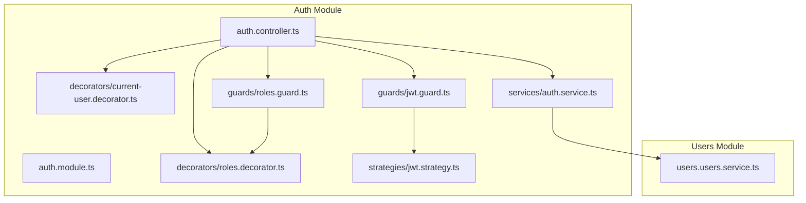
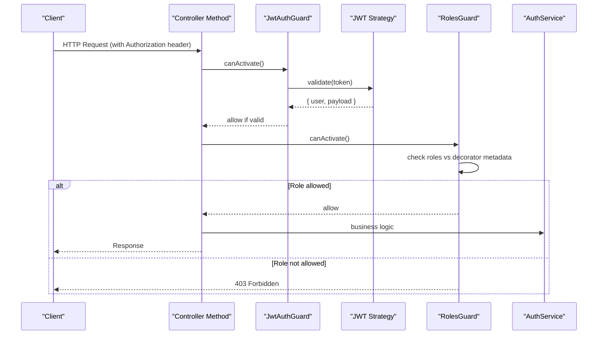
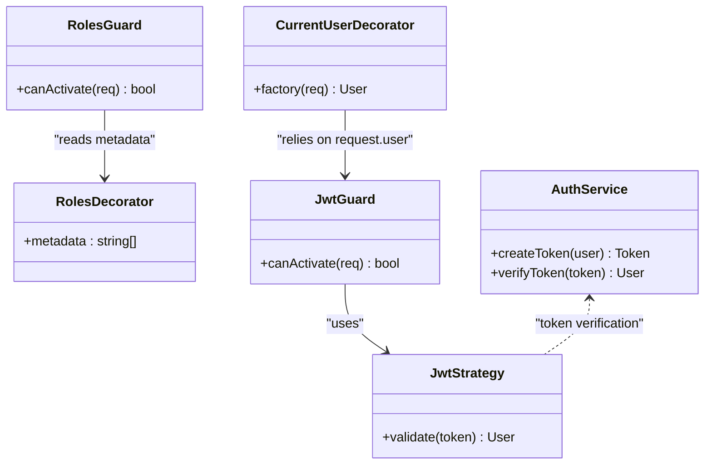

# Authentication Decorators

<cite>
**Referenced Files in This Document**
- [auth.module.ts](file://apps/backend/src/auth/auth.module.ts)
- [auth.controller.ts](file://apps/backend/src/auth/auth.controller.ts)
- [decorators/current-user.decorator.ts](file://apps/backend/src/auth/decorators/current-user.decorator.ts)
- [decorators/roles.decorator.ts](file://apps/backend/src/auth/decorators/roles.decorator.ts)
- [guards/jwt.guard.ts](file://apps/backend/src/auth/guards/jwt.guard.ts)
- [guards/roles.guard.ts](file://apps/backend/src/auth/guards/roles.guard.ts)
- [strategies/jwt.strategy.ts](file://apps/backend/src/auth/strategies/jwt.strategy.ts)
- [services/auth.service.ts](file://apps/backend/src/auth/services/auth.service.ts)
- [users/users.service.ts](file://apps/backend/src/users/users.service.ts)
</cite>

## Table of Contents
1. [Introduction](#introduction)
2. [Project Structure](#project-structure)
3. [Core Components](#core-components)
4. [Architecture Overview](#architecture-overview)
5. [Detailed Component Analysis](#detailed-component-analysis)
6. [Dependency Analysis](#dependency-analysis)
7. [Performance Considerations](#performance-considerations)
8. [Troubleshooting Guide](#troubleshooting-guide)
9. [Conclusion](#conclusion)

## Introduction
This document explains the custom authentication decorators used to enhance request handling with authenticated user context and role-based authorization. It focuses on:
- The current user decorator for extracting the authenticated user from requests
- The roles decorator for enforcing role-based access control
- How these decorators integrate with guards, strategies, and services
- Parameter binding patterns and usage examples across controllers

## Project Structure
The authentication decorators live under the auth module alongside related guards, strategies, and services. Controllers use these decorators to inject user context and enforce roles at the method level.

**Diagram sources**
- [auth.controller.ts](file://apps/backend/src/auth/auth.controller.ts)
- [auth.module.ts](file://apps/backend/src/auth/auth.module.ts)
- [decorators/current-user.decorator.ts](file://apps/backend/src/auth/decorators/current-user.decorator.ts)
- [decorators/roles.decorator.ts](file://apps/backend/src/auth/decorators/roles.decorator.ts)
- [guards/jwt.guard.ts](file://apps/backend/src/auth/guards/jwt.guard.ts)
- [guards/roles.guard.ts](file://apps/backend/src/auth/guards/roles.guard.ts)
- [strategies/jwt.strategy.ts](file://apps/backend/src/auth/strategies/jwt.strategy.ts)
- [services/auth.service.ts](file://apps/backend/src/auth/services/auth.service.ts)
- [users/users.service.ts](file://apps/backend/src/users/users.service.ts)

**Section sources**
- [auth.module.ts](file://apps/backend/src/auth/auth.module.ts)
- [auth.controller.ts](file://apps/backend/src/auth/auth.controller.ts)

## Core Components
- Current User Decorator: Injects the authenticated user object into controller methods by reading validated payload from the request context.
- Roles Decorator: Declares required roles for a route; combined with a roles guard, it enforces authorization before handler execution.
- JWT Guard: Validates tokens using the configured strategy and attaches the decoded payload to the request.
- Roles Guard: Checks the current user’s roles against the decorator’s requirements.
- JWT Strategy: Extracts and verifies tokens, populating request.user.
- Auth Service: Provides token issuance/validation and user-related operations used by controllers and guards.

Usage pattern overview:
- Protect endpoints with @UseGuards(JwtAuthGuard) or @RolesGuard(...)
- Declare required roles with @Roles('admin', 'editor')
- Access the authenticated user via @CurrentUser()

**Section sources**
- [decorators/current-user.decorator.ts](file://apps/backend/src/auth/decorators/current-user.decorator.ts)
- [decorators/roles.decorator.ts](file://apps/backend/src/auth/decorators/roles.decorator.ts)
- [guards/jwt.guard.ts](file://apps/backend/src/auth/guards/jwt.guard.ts)
- [guards/roles.guard.ts](file://apps/backend/src/auth/guards/roles.guard.ts)
- [strategies/jwt.strategy.ts](file://apps/backend/src/auth/strategies/jwt.strategy.ts)
- [services/auth.service.ts](file://apps/backend/src/auth/services/auth.service.ts)

## Architecture Overview
The decorators work together with NestJS guards and Passport strategies to provide a consistent authentication and authorization layer.

**Diagram sources**
- [guards/jwt.guard.ts](file://apps/backend/src/auth/guards/jwt.guard.ts)
- [strategies/jwt.strategy.ts](file://apps/backend/src/auth/strategies/jwt.strategy.ts)
- [guards/roles.guard.ts](file://apps/backend/src/auth/guards/roles.guard.ts)
- [decorators/roles.decorator.ts](file://apps/backend/src/auth/decorators/roles.decorator.ts)
- [services/auth.service.ts](file://apps/backend/src/auth/services/auth.service.ts)

## Detailed Component Analysis

### Current User Decorator
Purpose:
- Binds the authenticated user from the request to a controller method parameter.
- Reads the user object attached by the JWT guard after successful validation.

Implementation highlights:
- Uses NestJS Param decorator with a custom factory to extract the user from the request object.
- Returns null or throws an error when no authenticated user is present, depending on configuration.

Parameter binding:
- @CurrentUser(): string | UserObject | null
- Can be typed to a specific user interface for type safety.

Common usage:
- Place above controller method parameters where the user context is needed.
- Combine with @Req() for additional request data if necessary.

Error handling:
- If invoked without prior authentication, behavior depends on guard configuration and decorator options.

**Section sources**
- [decorators/current-user.decorator.ts](file://apps/backend/src/auth/decorators/current-user.decorator.ts)
- [guards/jwt.guard.ts](file://apps/backend/src/auth/guards/jwt.guard.ts)

### Roles Decorator
Purpose:
- Declares one or more roles required to access a controller method.
- Works with the roles guard to enforce authorization based on the current user’s roles.

Implementation highlights:
- Stores required roles as metadata on the method.
- Used by the roles guard to compare against the user’s roles.

Parameter binding:
- @Roles(...string[]): void
- Accepts one or more role strings.

Common usage:
- Apply at the controller method level to restrict access.
- Combine with @UseGuards(RolesGuard) or apply globally.

Authorization flow:
- Roles guard reads metadata set by the decorator and compares with user.roles.
- Allows access if any declared role matches the user’s roles.

**Section sources**
- [decorators/roles.decorator.ts](file://apps/backend/src/auth/decorators/roles.decorator.ts)
- [guards/roles.guard.ts](file://apps/backend/src/auth/guards/roles.guard.ts)

### JWT Guard and Strategy
JWT Guard:
- Intercepts requests and validates the Authorization header.
- Delegates token verification to the JWT strategy.
- Attaches the decoded payload to request.user.

JWT Strategy:
- Extracts the token from headers or cookies.
- Verifies signature and expiration.
- Populates request.user with the expected shape.

Integration:
- Use @UseGuards(JwtAuthGuard) to protect routes.
- After guard passes, @CurrentUser() can safely read request.user.

**Section sources**
- [guards/jwt.guard.ts](file://apps/backend/src/auth/guards/jwt.guard.ts)
- [strategies/jwt.strategy.ts](file://apps/backend/src/auth/strategies/jwt.strategy.ts)

### Roles Guard
Responsibilities:
- Reads role metadata from the roles decorator.
- Compares against the current user’s roles.
- Throws an unauthorized exception if access is denied.

Behavior:
- If no roles are specified, allows access.
- If user has no roles or insufficient roles, denies access.

**Section sources**
- [guards/roles.guard.ts](file://apps/backend/src/auth/guards/roles.guard.ts)
- [decorators/roles.decorator.ts](file://apps/backend/src/auth/decorators/roles.decorator.ts)

### Auth Service Integration
- Issues tokens upon successful login.
- Validates tokens and retrieves user details when needed.
- Exposes helper methods consumed by controllers and guards.

Typical interactions:
- Controllers call service methods to create/update tokens and fetch user profiles.
- Guards may rely on strategy-level validation rather than direct service calls.

**Section sources**
- [services/auth.service.ts](file://apps/backend/src/auth/services/auth.service.ts)
- [users/users.service.ts](file://apps/backend/src/users/users.service.ts)

### Usage Patterns Across Controllers
Recommended approach:
- Protect sensitive endpoints with @UseGuards(JwtAuthGuard).
- Enforce roles with @Roles('admin', 'editor') and @UseGuards(RolesGuard).
- Access the authenticated user via @CurrentUser().

Example scenarios:
- Profile update: Requires authentication and user’s own role.
- Admin actions: Require admin role.
- Public endpoints: No guards or decorators.

Best practices:
- Always validate input with DTOs and pipes.
- Centralize error responses using global filters.
- Keep role names consistent across the application.

**Section sources**
- [auth.controller.ts](file://apps/backend/src/auth/auth.controller.ts)
- [guards/jwt.guard.ts](file://apps/backend/src/auth/guards/jwt.guard.ts)
- [guards/roles.guard.ts](file://apps/backend/src/auth/guards/roles.guard.ts)
- [decorators/current-user.decorator.ts](file://apps/backend/src/auth/decorators/current-user.decorator.ts)
- [decorators/roles.decorator.ts](file://apps/backend/src/auth/decorators/roles.decorator.ts)

## Dependency Analysis
Decorators depend on NestJS core features and the request context populated by guards. Guards depend on strategies and metadata provided by decorators. Services encapsulate business logic and data access.

**Diagram sources**
- [decorators/current-user.decorator.ts](file://apps/backend/src/auth/decorators/current-user.decorator.ts)
- [decorators/roles.decorator.ts](file://apps/backend/src/auth/decorators/roles.decorator.ts)
- [guards/jwt.guard.ts](file://apps/backend/src/auth/guards/jwt.guard.ts)
- [guards/roles.guard.ts](file://apps/backend/src/auth/guards/roles.guard.ts)
- [strategies/jwt.strategy.ts](file://apps/backend/src/auth/strategies/jwt.strategy.ts)
- [services/auth.service.ts](file://apps/backend/src/auth/services/auth.service.ts)

**Section sources**
- [auth.module.ts](file://apps/backend/src/auth/auth.module.ts)

## Performance Considerations
- Minimize database calls within guards; prefer lightweight token validation.
- Cache frequently accessed user profile data when appropriate.
- Avoid heavy computations in decorators; keep them focused on context extraction.
- Use global guards where possible to reduce per-route overhead.

[No sources needed since this section provides general guidance]

## Troubleshooting Guide
Common issues:
- Missing Authorization header: Ensure clients send tokens correctly.
- Invalid or expired tokens: Verify signing keys and expiration settings.
- Insufficient roles: Confirm user roles match decorator requirements.
- Null user context: Ensure guards run before decorators and attach request.user.

Debugging steps:
- Log token payload in the strategy during development.
- Check guard execution order and global vs local application.
- Validate role names and case sensitivity.

**Section sources**
- [guards/jwt.guard.ts](file://apps/backend/src/auth/guards/jwt.guard.ts)
- [guards/roles.guard.ts](file://apps/backend/src/auth/guards/roles.guard.ts)
- [strategies/jwt.strategy.ts](file://apps/backend/src/auth/strategies/jwt.strategy.ts)

## Conclusion
The current user and roles decorators provide a clean, declarative way to handle authentication and authorization in NestJS applications. By combining them with JWT and roles guards, you achieve secure, maintainable endpoints with clear intent and minimal boilerplate. Follow the usage patterns and best practices outlined here to ensure consistent security across your application.

[No sources needed since this section summarizes without analyzing specific files]