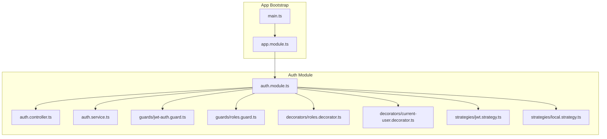
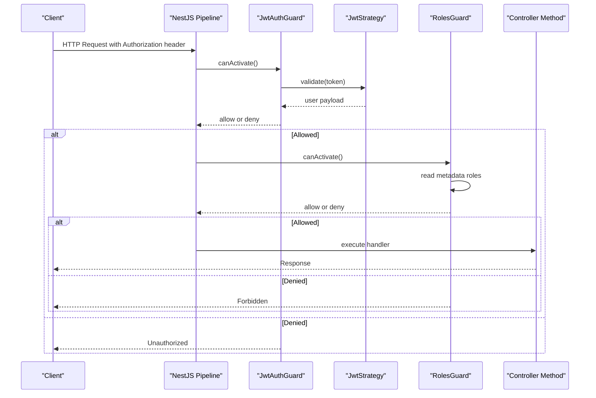
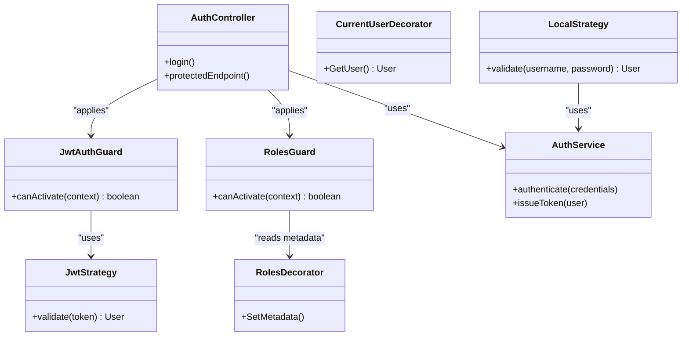

# Authentication Guards

<cite>
**Referenced Files in This Document**
- [auth.module.ts](file://apps/backend/src/auth/auth.module.ts)
- [auth.controller.ts](file://apps/backend/src/auth/auth.controller.ts)
- [auth.service.ts](file://apps/backend/src/auth/auth.service.ts)
- [jwt.strategy.ts](file://apps/backend/src/auth/strategies/jwt.strategy.ts)
- [local.strategy.ts](file://apps/backend/src/auth/strategies/local.strategy.ts)
- [jwt-auth.guard.ts](file://apps/backend/src/auth/guards/jwt-auth.guard.ts)
- [roles.guard.ts](file://apps/backend/src/auth/guards/roles.guard.ts)
- [roles.decorator.ts](file://apps/backend/src/auth/decorators/roles.decorator.ts)
- [current-user.decorator.ts](file://apps/backend/src/auth/decorators/current-user.decorator.ts)
- [app.module.ts](file://apps/backend/src/app.module.ts)
- [main.ts](file://apps/backend/src/main.ts)
</cite>

## Table of Contents
1. [Introduction](#introduction)
2. [Project Structure](#project-structure)
3. [Core Components](#core-components)
4. [Architecture Overview](#architecture-overview)
5. [Detailed Component Analysis](#detailed-component-analysis)
6. [Dependency Analysis](#dependency-analysis)
7. [Performance Considerations](#performance-considerations)
8. [Troubleshooting Guide](#troubleshooting-guide)
9. [Conclusion](#conclusion)

## Introduction
This document explains the authentication and authorization guards that protect routes in the NestJS backend. It covers:
- JWT authentication guard for validating access tokens
- Roles guard for role-based access control
- Guard lifecycle and how they integrate with the NestJS execution pipeline
- Metadata usage via decorators to configure guards at route level
- Examples of protecting routes and implementing custom guards

## Project Structure
The authentication subsystem is organized under apps/backend/src/auth with dedicated folders for controllers, services, strategies, guards, and decorators. The application bootstrap wires up global security settings (e.g., cookie/session or helmet) and imports the auth module where guards are registered.

**Diagram sources**
- [auth.module.ts](file://apps/backend/src/auth/auth.module.ts)
- [auth.controller.ts](file://apps/backend/src/auth/auth.controller.ts)
- [auth.service.ts](file://apps/backend/src/auth/auth.service.ts)
- [jwt.strategy.ts](file://apps/backend/src/auth/strategies/jwt.strategy.ts)
- [local.strategy.ts](file://apps/backend/src/auth/strategies/local.strategy.ts)
- [jwt-auth.guard.ts](file://apps/backend/src/auth/guards/jwt-auth.guard.ts)
- [roles.guard.ts](file://apps/backend/src/auth/guards/roles.guard.ts)
- [roles.decorator.ts](file://apps/backend/src/auth/decorators/roles.decorator.ts)
- [current-user.decorator.ts](file://apps/backend/src/auth/decorators/current-user.decorator.ts)
- [app.module.ts](file://apps/backend/src/app.module.ts)
- [main.ts](file://apps/backend/src/main.ts)

**Section sources**
- [auth.module.ts](file://apps/backend/src/auth/auth.module.ts)
- [app.module.ts](file://apps/backend/src/app.module.ts)
- [main.ts](file://apps/backend/src/main.ts)

## Core Components
- JWT Strategy: Extracts and validates the JWT from requests and attaches user payload to the request context.
- Local Strategy: Validates credentials (username/password) and returns a user object for login flows.
- JWT Auth Guard: Enforces presence and validity of an access token using the JWT strategy.
- Roles Guard: Enforces role-based access by comparing required roles against the authenticated user’s roles.
- Roles Decorator: Declares required roles as metadata on controller methods.
- Current User Decorator: Injects the authenticated user into handler parameters.
- Auth Controller: Exposes endpoints for login and token issuance; protected endpoints use guards.
- Auth Service: Business logic for issuing tokens, verifying credentials, and managing user sessions/tokens.

Key responsibilities:
- Strategies implement Passport strategies and return user payloads.
- Guards implement CanActivate and interact with the NestJS pipeline.
- Decorators attach metadata consumed by guards.

**Section sources**
- [jwt.strategy.ts](file://apps/backend/src/auth/strategies/jwt.strategy.ts)
- [local.strategy.ts](file://apps/backend/src/auth/strategies/local.strategy.ts)
- [jwt-auth.guard.ts](file://apps/backend/src/auth/guards/jwt-auth.guard.ts)
- [roles.guard.ts](file://apps/backend/src/auth/guards/roles.guard.ts)
- [roles.decorator.ts](file://apps/backend/src/auth/decorators/roles.decorator.ts)
- [current-user.decorator.ts](file://apps/backend/src/auth/decorators/current-user.decorator.ts)
- [auth.controller.ts](file://apps/backend/src/auth/auth.controller.ts)
- [auth.service.ts](file://apps/backend/src/auth/auth.service.ts)

## Architecture Overview
The authentication flow uses Passport strategies and NestJS guards. On each request:
1. The JWT strategy extracts and verifies the token, attaching the user to the request.
2. The JWT auth guard ensures the request is authenticated.
3. The roles guard checks if the user has the required roles declared via the roles decorator.
4. If all checks pass, the controller method executes.

**Diagram sources**
- [jwt.strategy.ts](file://apps/backend/src/auth/strategies/jwt.strategy.ts)
- [jwt-auth.guard.ts](file://apps/backend/src/auth/guards/jwt-auth.guard.ts)
- [roles.guard.ts](file://apps/backend/src/auth/guards/roles.guard.ts)
- [roles.decorator.ts](file://apps/backend/src/auth/decorators/roles.decorator.ts)

## Detailed Component Analysis

### JWT Strategy
Purpose:
- Parse the Authorization header or cookies for the JWT.
- Verify signature and expiration.
- Attach the decoded user payload to the request object.

Integration points:
- Used by the JWT auth guard through Passport.
- Consumes configuration from app settings (e.g., secret, issuer).

Complexity:
- Token verification is O(1) relative to payload size; overall constant-time per request.

Error handling:
- Invalid or expired tokens result in unauthorized responses.

**Section sources**
- [jwt.strategy.ts](file://apps/backend/src/auth/strategies/jwt.strategy.ts)

### Local Strategy
Purpose:
- Authenticate users with username/password.
- Return a user object upon successful validation.

Integration points:
- Used by login endpoints in the auth controller.
- Relies on auth service for credential verification.

Complexity:
- Depends on repository/service calls; typically O(1) database lookup plus hashing cost.

Error handling:
- Invalid credentials yield a specific error response.

**Section sources**
- [local.strategy.ts](file://apps/backend/src/auth/strategies/local.strategy.ts)
- [auth.service.ts](file://apps/backend/src/auth/auth.service.ts)

### JWT Auth Guard
Purpose:
- Ensure requests carry a valid access token.
- Use the JWT strategy to authenticate and populate the request context.

Lifecycle:
- Implements CanActivate.
- Runs before controller methods and other guards.

Metadata usage:
- Does not require metadata; always enforces authentication when applied.

Customization:
- Can be extended to support multiple schemes (e.g., bearer vs cookie).

**Section sources**
- [jwt-auth.guard.ts](file://apps/backend/src/auth/guards/jwt-auth.guard.ts)
- [jwt.strategy.ts](file://apps/backend/src/auth/strategies/jwt.strategy.ts)

### Roles Guard
Purpose:
- Enforce role-based access control by comparing required roles with the authenticated user’s roles.

Lifecycle:
- Implements CanActivate.
- Reads metadata set by the roles decorator.

Metadata usage:
- Uses Reflector to read roles metadata attached to controller methods.

Decision flow:
- If no roles are required, allow.
- If user lacks any required role, deny.

**Section sources**
- [roles.guard.ts](file://apps/backend/src/auth/guards/roles.guard.ts)
- [roles.decorator.ts](file://apps/backend/src/auth/decorators/roles.decorator.ts)

### Roles Decorator
Purpose:
- Declare required roles on controller methods.
- Provide metadata consumed by the roles guard.

Usage:
- Applied above controller methods to specify allowed roles.

**Section sources**
- [roles.decorator.ts](file://apps/backend/src/auth/decorators/roles.decorator.ts)

### Current User Decorator
Purpose:
- Inject the authenticated user object into controller method parameters.

Implementation:
- Uses NestJS Request object and the user property populated by strategies.

**Section sources**
- [current-user.decorator.ts](file://apps/backend/src/auth/decorators/current-user.decorator.ts)

### Auth Controller
Purpose:
- Expose endpoints for login and token management.
- Protected endpoints use JWT and roles guards.

Examples:
- Login endpoint uses local strategy.
- Protected endpoints apply jwt-auth guard and optionally roles guard.

**Section sources**
- [auth.controller.ts](file://apps/backend/src/auth/auth.controller.ts)
- [auth.service.ts](file://apps/backend/src/auth/auth.service.ts)

### Auth Module
Purpose:
- Register strategies, guards, and controllers.
- Configure Passport and global guards if needed.

**Section sources**
- [auth.module.ts](file://apps/backend/src/auth/auth.module.ts)

### Application Bootstrap
Purpose:
- Initialize Nest application, enable global security middleware, and import modules.

Global guards:
- Optionally register JWT guard globally to protect all routes unless explicitly exempted.

**Section sources**
- [app.module.ts](file://apps/backend/src/app.module.ts)
- [main.ts](file://apps/backend/src/main.ts)

## Dependency Analysis
Relationships between core components:
- Controllers depend on services for business logic.
- Guards depend on strategies and reflector for metadata.
- Decorators provide metadata consumed by guards.
- Module wires everything together.

**Diagram sources**
- [jwt.strategy.ts](file://apps/backend/src/auth/strategies/jwt.strategy.ts)
- [local.strategy.ts](file://apps/backend/src/auth/strategies/local.strategy.ts)
- [jwt-auth.guard.ts](file://apps/backend/src/auth/guards/jwt-auth.guard.ts)
- [roles.guard.ts](file://apps/backend/src/auth/guards/roles.guard.ts)
- [roles.decorator.ts](file://apps/backend/src/auth/decorators/roles.decorator.ts)
- [current-user.decorator.ts](file://apps/backend/src/auth/decorators/current-user.decorator.ts)
- [auth.controller.ts](file://apps/backend/src/auth/auth.controller.ts)
- [auth.service.ts](file://apps/backend/src/auth/auth.service.ts)

**Section sources**
- [auth.module.ts](file://apps/backend/src/auth/auth.module.ts)
- [auth.controller.ts](file://apps/backend/src/auth/auth.controller.ts)
- [auth.service.ts](file://apps/backend/src/auth/auth.service.ts)
- [jwt.strategy.ts](file://apps/backend/src/auth/strategies/jwt.strategy.ts)
- [local.strategy.ts](file://apps/backend/src/auth/strategies/local.strategy.ts)
- [jwt-auth.guard.ts](file://apps/backend/src/auth/guards/jwt-auth.guard.ts)
- [roles.guard.ts](file://apps/backend/src/auth/guards/roles.guard.ts)
- [roles.decorator.ts](file://apps/backend/src/auth/decorators/roles.decorator.ts)
- [current-user.decorator.ts](file://apps/backend/src/auth/decorators/current-user.decorator.ts)

## Performance Considerations
- Token verification is fast; avoid heavy operations inside strategies.
- Cache frequently accessed user data if necessary, but ensure cache invalidation on token revocation.
- Minimize synchronous work in guards to keep request latency low.
- Use global guards selectively to reduce overhead on public endpoints.

[No sources needed since this section provides general guidance]

## Troubleshooting Guide
Common issues and resolutions:
- 401 Unauthorized:
  - Missing or malformed Authorization header.
  - Expired or invalid token.
  - Strategy misconfiguration (secret, issuer, audience).
- 403 Forbidden:
  - Insufficient roles for the endpoint.
  - Roles metadata mismatch with user’s roles.
- Debugging tips:
  - Log strategy validation results.
  - Inspect metadata via Reflector in development.
  - Validate environment variables for secrets and issuers.

**Section sources**
- [jwt.strategy.ts](file://apps/backend/src/auth/strategies/jwt.strategy.ts)
- [jwt-auth.guard.ts](file://apps/backend/src/auth/guards/jwt-auth.guard.ts)
- [roles.guard.ts](file://apps/backend/src/auth/guards/roles.guard.ts)
- [roles.decorator.ts](file://apps/backend/src/auth/decorators/roles.decorator.ts)

## Conclusion
The authentication and authorization system leverages NestJS guards and Passport strategies to enforce secure access. The JWT guard validates tokens, while the roles guard enforces RBAC using metadata. Together with decorators, they provide a clean, composable mechanism to protect routes and manage user context throughout the application.

[No sources needed since this section summarizes without analyzing specific files]