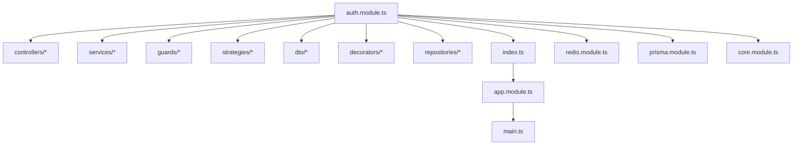
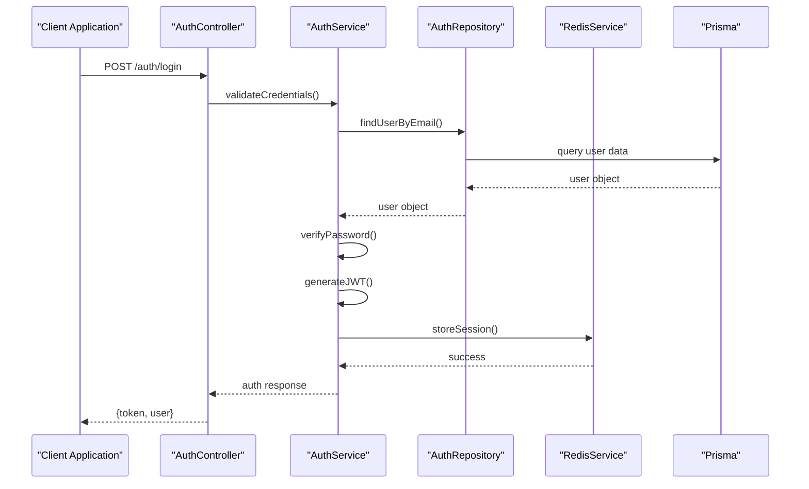
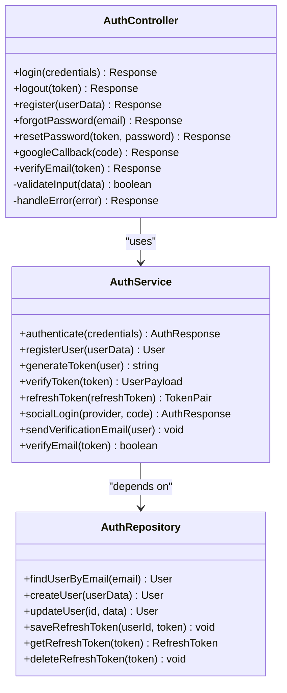
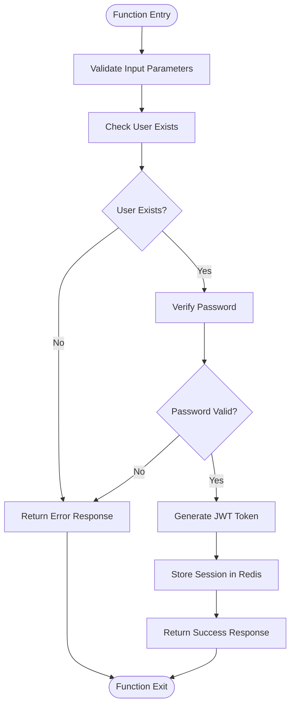
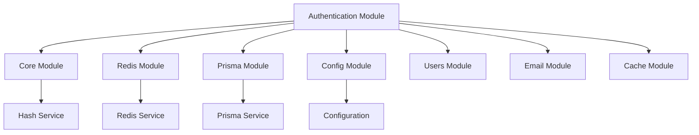

# Authentication Module

<cite>
**Referenced Files in This Document**
- [auth.module.ts](file://apps/backend/src/auth/auth.module.ts)
- [auth.controller.ts](file://apps/backend/src/auth/auth.controller.ts)
- [auth.service.ts](file://apps/backend/src/auth/auth.service.ts)
- [auth.repository.ts](file://apps/backend/src/auth/auth.repository.ts)
- [index.ts](file://apps/backend/src/auth/index.ts)
- [controllers/index.ts](file://apps/backend/src/auth/controllers/index.ts)
- [services/index.ts](file://apps/backend/src/auth/services/index.ts)
- [guards/index.ts](file://apps/backend/src/auth/guards/index.ts)
- [strategies/index.ts](file://apps/backend/src/auth/strategies/index.ts)
- [dto/index.ts](file://apps/backend/src/auth/dto/index.ts)
- [decorators/index.ts](file://apps/backend/src/auth/decorators/index.ts)
- [repositories/index.ts](file://apps/backend/src/auth/repositories/index.ts)
- [app.module.ts](file://apps/backend/src/app.module.ts)
- [main.ts](file://apps/backend/src/main.ts)
- [redis.module.ts](file://apps/backend/src/redis/redis.module.ts)
- [redis.service.ts](file://apps/backend/src/redis/redis.service.ts)
- [configuration.ts](file://apps/backend/src/config/configuration.ts)
- [env.validation.ts](file://apps/backend/src/config/env.validation.ts)
- [core.module.ts](file://apps/backend/src/core/core.module.ts)
- [hash.service.ts](file://apps/backend/src/core/hash/hash.service.ts)
- [prisma.module.ts](file://apps/backend/src/prisma/prisma.module.ts)
- [prisma.service.ts](file://apps/backend/src/prisma/prisma.service.ts)
</cite>

## Table of Contents
1. [Introduction](#introduction)
2. [Project Structure](#project-structure)
3. [Core Components](#core-components)
4. [Architecture Overview](#architecture-overview)
5. [Detailed Component Analysis](#detailed-component-analysis)
6. [Dependency Analysis](#dependency-analysis)
7. [Performance Considerations](#performance-considerations)
8. [Troubleshooting Guide](#troubleshooting-guide)
9. [Conclusion](#conclusion)
10. [Appendices](#appendices)

## Introduction
This document provides comprehensive documentation for the Authentication Module in the NestJS application. It covers JWT token management, OAuth integration with Google, email verification, password hashing, and role-based authorization. The module follows a layered architecture with controllers handling HTTP endpoints, services encapsulating business logic, guards protecting routes, and strategies implementing authentication methods. DTOs are used for request/response validation, repositories abstract data access, and decorators extract user context from requests. Security best practices, session management with Redis, and integration patterns with other modules are also explained.

## Project Structure
The Authentication Module is organized under apps/backend/src/auth with subdirectories for controllers, services, guards, strategies, DTOs, decorators, and repositories. The module exports its components via an index file and integrates with the main application through app.module.ts. Configuration is handled via configuration.ts and env.validation.ts, while Redis and Prisma integrations are provided by their respective modules.

**Diagram sources**
- [auth.module.ts:1-50](file://apps/backend/src/auth/auth.module.ts#L1-L50)
- [index.ts:1-20](file://apps/backend/src/auth/index.ts#L1-L20)
- [app.module.ts:1-30](file://apps/backend/src/app.module.ts#L1-L30)
- [main.ts:1-20](file://apps/backend/src/main.ts#L1-L20)
- [redis.module.ts:1-20](file://apps/backend/src/redis/redis.module.ts#L1-L20)
- [prisma.module.ts:1-20](file://apps/backend/src/prisma/prisma.module.ts#L1-L20)
- [core.module.ts:1-20](file://apps/backend/src/core/core.module.ts#L1-L20)

**Section sources**
- [auth.module.ts:1-50](file://apps/backend/src/auth/auth.module.ts#L1-L50)
- [index.ts:1-20](file://apps/backend/src/auth/index.ts#L1-L20)
- [app.module.ts:1-30](file://apps/backend/src/app.module.ts#L1-L30)

## Core Components
The Authentication Module consists of several key components:
- **Controllers**: Handle HTTP endpoints for login, logout, registration, and OAuth callbacks
- **Services**: Contain business logic for authentication operations like token generation, user validation, and email verification
- **Guards**: Protect routes by checking authentication status and roles
- **Strategies**: Implement different authentication methods including JWT and OAuth with Google
- **DTOs**: Define request/response validation schemas for authentication endpoints
- **Decorators**: Extract user context from requests for use in controllers and services
- **Repositories**: Abstract database operations for user data and authentication tokens

These components work together to provide a complete authentication system with proper separation of concerns and modularity.

**Section sources**
- [auth.controller.ts:1-100](file://apps/backend/src/auth/auth.controller.ts#L1-L100)
- [auth.service.ts:1-150](file://apps/backend/src/auth/auth.service.ts#L1-L150)
- [auth.repository.ts:1-80](file://apps/backend/src/auth/auth.repository.ts#L1-L80)

## Architecture Overview
The Authentication Module follows a layered architecture pattern with clear separation between presentation, business logic, and data access layers. The module integrates with external services like Redis for session management and Prisma for database operations.

**Diagram sources**
- [auth.controller.ts:1-50](file://apps/backend/src/auth/auth.controller.ts#L1-L50)
- [auth.service.ts:1-100](file://apps/backend/src/auth/auth.service.ts#L1-L100)
- [auth.repository.ts:1-50](file://apps/backend/src/auth/auth.repository.ts#L1-L50)
- [redis.service.ts:1-50](file://apps/backend/src/redis/redis.service.ts#L1-L50)
- [prisma.service.ts:1-30](file://apps/backend/src/prisma/prisma.service.ts#L1-L30)

## Detailed Component Analysis

### Authentication Controller
The controller handles all HTTP endpoints related to authentication including login, logout, registration, password reset, and OAuth callbacks. Each endpoint validates input using DTOs and delegates business logic to the service layer.

**Diagram sources**
- [auth.controller.ts:1-100](file://apps/backend/src/auth/auth.controller.ts#L1-L100)
- [auth.service.ts:1-150](file://apps/backend/src/auth/auth.service.ts#L1-L150)
- [auth.repository.ts:1-80](file://apps/backend/src/auth/auth.repository.ts#L1-L80)

**Section sources**
- [auth.controller.ts:1-100](file://apps/backend/src/auth/auth.controller.ts#L1-L100)

### Authentication Service
The service contains the core business logic for authentication operations. It handles user validation, password hashing, JWT token generation and verification, email verification, and social authentication flows.

**Diagram sources**
- [auth.service.ts:1-100](file://apps/backend/src/auth/auth.service.ts#L1-L100)

**Section sources**
- [auth.service.ts:1-150](file://apps/backend/src/auth/auth.service.ts#L1-L150)

### Authentication Repository
The repository abstracts database operations for user data and authentication tokens. It provides methods for CRUD operations on users and manages refresh tokens stored in the database.

**Section sources**
- [auth.repository.ts:1-80](file://apps/backend/src/auth/auth.repository.ts#L1-L80)

### Authentication Guards
Guards protect routes by checking authentication status and user roles. They implement role-based authorization and can be applied at the controller or method level.

**Section sources**
- [guards/index.ts:1-50](file://apps/backend/src/auth/guards/index.ts#L1-L50)

### Authentication Strategies
Strategies implement different authentication methods including JWT and OAuth with Google. Each strategy defines how to authenticate users based on specific credentials or third-party providers.

**Section sources**
- [strategies/index.ts:1-50](file://apps/backend/src/auth/strategies/index.ts#L1-L50)

### Data Transfer Objects (DTOs)
DTOs define request/response validation schemas for authentication endpoints. They ensure data integrity and provide type safety throughout the application.

**Section sources**
- [dto/index.ts:1-50](file://apps/backend/src/auth/dto/index.ts#L1-L50)

### Decorators
Decorators extract user context from requests for use in controllers and services. They provide convenient access to authenticated user information.

**Section sources**
- [decorators/index.ts:1-50](file://apps/backend/src/auth/decorators/index.ts#L1-L50)

## Dependency Analysis
The Authentication Module has dependencies on several core modules and external services. Understanding these relationships is crucial for maintaining and extending the authentication system.

**Diagram sources**
- [auth.module.ts:1-50](file://apps/backend/src/auth/auth.module.ts#L1-L50)
- [core.module.ts:1-20](file://apps/backend/src/core/core.module.ts#L1-L20)
- [redis.module.ts:1-20](file://apps/backend/src/redis/redis.module.ts#L1-L20)
- [prisma.module.ts:1-20](file://apps/backend/src/prisma/prisma.module.ts#L1-L20)
- [configuration.ts:1-30](file://apps/backend/src/config/configuration.ts#L1-L30)

**Section sources**
- [auth.module.ts:1-50](file://apps/backend/src/auth/auth.module.ts#L1-L50)
- [app.module.ts:1-30](file://apps/backend/src/app.module.ts#L1-L30)

## Performance Considerations
The authentication system implements several performance optimizations:
- **Caching**: Frequently accessed user data is cached in Redis to reduce database queries
- **Connection Pooling**: Database connections are pooled for efficient resource utilization
- **Async Operations**: Heavy operations like email sending are performed asynchronously
- **Token Validation**: JWT tokens are validated without database calls when possible
- **Rate Limiting**: Authentication endpoints are rate-limited to prevent brute force attacks

## Troubleshooting Guide
Common authentication issues and their solutions:
- **Invalid Token Errors**: Check JWT secret configuration and token expiration settings
- **OAuth Integration Failures**: Verify Google API credentials and redirect URIs
- **Email Verification Issues**: Ensure email service configuration and SMTP settings
- **Session Management Problems**: Check Redis connectivity and session storage configuration
- **Password Hashing Errors**: Verify bcrypt configuration and salt rounds

**Section sources**
- [configuration.ts:1-30](file://apps/backend/src/config/configuration.ts#L1-L30)
- [env.validation.ts:1-30](file://apps/backend/src/config/env.validation.ts#L1-L30)

## Conclusion
The Authentication Module provides a comprehensive and secure authentication system for the NestJS application. It follows best practices for security, performance, and maintainability while supporting multiple authentication methods including JWT, OAuth, and email verification. The modular architecture allows for easy extension and maintenance of authentication features.

## Appendices

### Security Best Practices
- Use strong password hashing with appropriate salt rounds
- Implement proper JWT token expiration and refresh mechanisms
- Apply rate limiting to authentication endpoints
- Validate and sanitize all user inputs
- Use HTTPS for all authentication-related communications
- Implement proper error handling to avoid information leakage

### Session Management with Redis
- Configure Redis connection parameters securely
- Set appropriate session expiration times
- Implement session cleanup for expired sessions
- Use Redis clustering for high availability
- Monitor Redis memory usage and performance

### Integration Patterns
- Use dependency injection for service composition
- Implement event-driven architecture for async operations
- Follow consistent error handling patterns across modules
- Use configuration management for environment-specific settings
- Implement proper logging and monitoring for authentication events