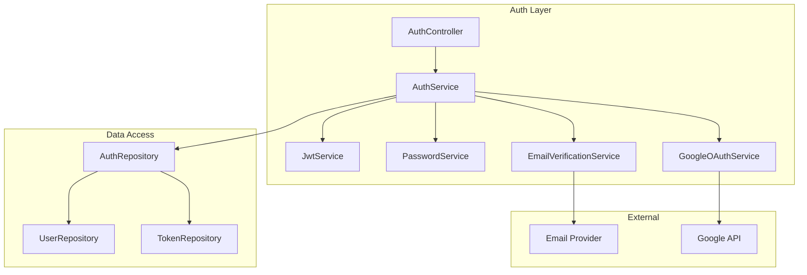
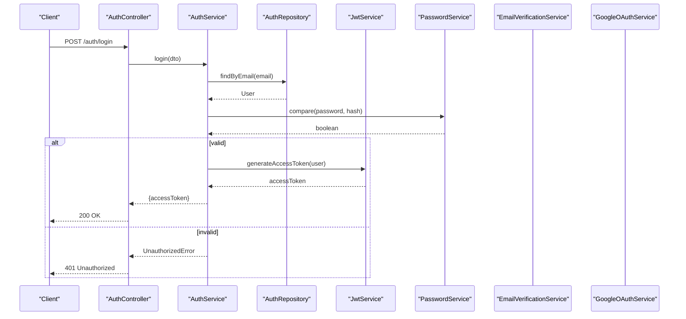
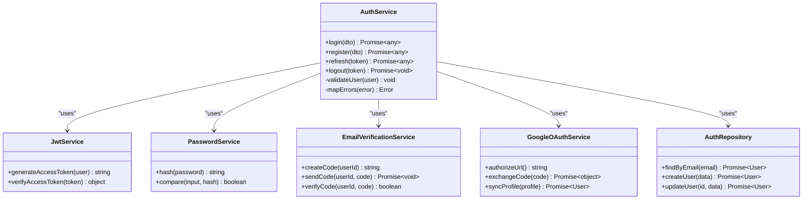
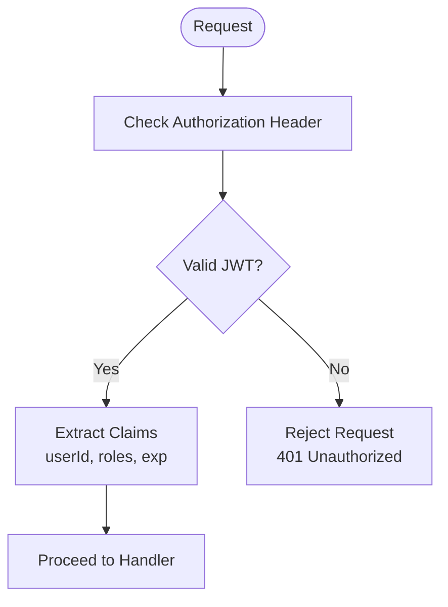
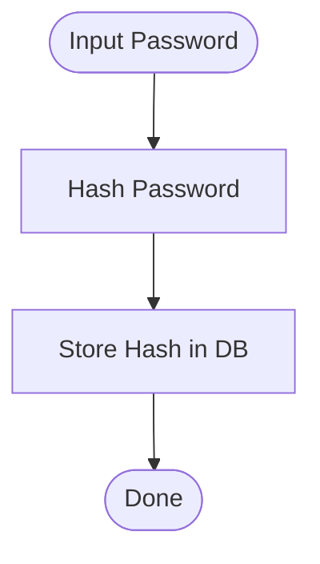
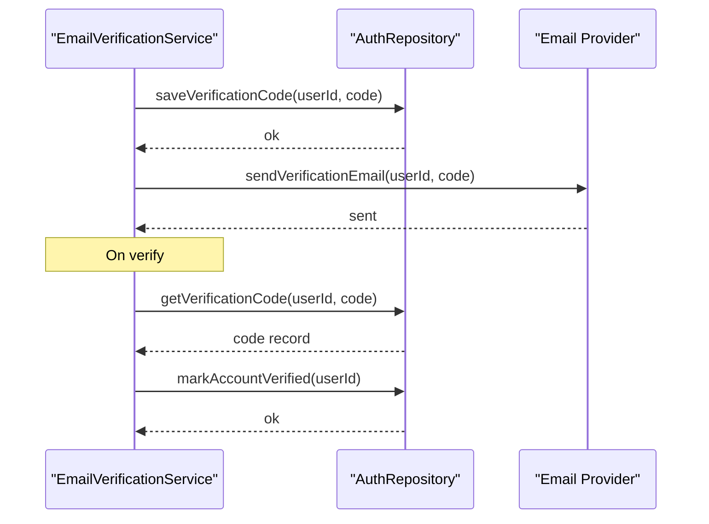
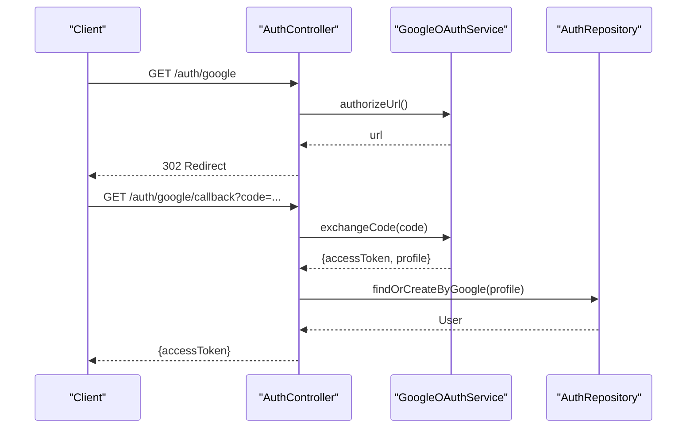
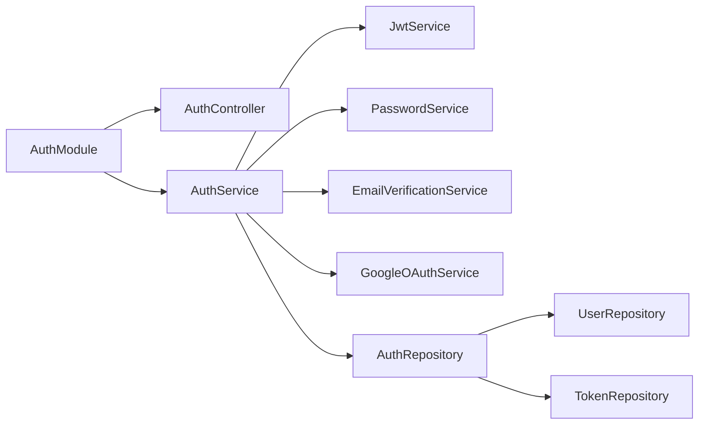

# Authentication Services

<cite>
**Referenced Files in This Document**
- [auth.module.ts](file://apps/backend/src/auth/auth.module.ts)
- [auth.service.ts](file://apps/backend/src/auth/auth.service.ts)
- [jwt.service.ts](file://apps/backend/src/auth/services/jwt.service.ts)
- [password.service.ts](file://apps/backend/src/auth/services/password.service.ts)
- [email-verification.service.ts](file://apps/backend/src/auth/services/email-verification.service.ts)
- [google-oauth.service.ts](file://apps/backend/src/auth/services/google-oauth.service.ts)
- [auth.controller.ts](file://apps/backend/src/auth/auth.controller.ts)
- [auth.repository.ts](file://apps/backend/src/auth/auth.repository.ts)
- [user.repository.ts](file://apps/backend/src/auth/repositories/user.repository.ts)
- [token.repository.ts](file://apps/backend/src/auth/repositories/token.repository.ts)
</cite>

## Table of Contents
1. [Introduction](#introduction)
2. [Project Structure](#project-structure)
3. [Core Components](#core-components)
4. [Architecture Overview](#architecture-overview)
5. [Detailed Component Analysis](#detailed-component-analysis)
6. [Dependency Analysis](#dependency-analysis)
7. [Performance Considerations](#performance-considerations)
8. [Troubleshooting Guide](#troubleshooting-guide)
9. [Conclusion](#conclusion)

## Introduction
This document describes the Authentication Services layer that implements core business logic for user authentication, token management, password handling, email verification, and third-party OAuth integration. It explains how services coordinate flows, use dependency injection, handle errors, and integrate with repositories and external APIs.

## Project Structure
The Authentication Services layer is organized under apps/backend/src/auth with clear separation of concerns:
- Controllers expose HTTP endpoints
- Services encapsulate business logic
- Repositories abstract data access
- DTOs define request/response contracts
- Guards and strategies enforce security policies
- Module wires dependencies via NestJS DI

**Diagram sources**
- [auth.controller.ts](file://apps/backend/src/auth/auth.controller.ts)
- [auth.service.ts](file://apps/backend/src/auth/auth.service.ts)
- [jwt.service.ts](file://apps/backend/src/auth/services/jwt.service.ts)
- [password.service.ts](file://apps/backend/src/auth/services/password.service.ts)
- [email-verification.service.ts](file://apps/backend/src/auth/services/email-verification.service.ts)
- [google-oauth.service.ts](file://apps/backend/src/auth/services/google-oauth.service.ts)
- [auth.repository.ts](file://apps/backend/src/auth/auth.repository.ts)
- [user.repository.ts](file://apps/backend/src/auth/repositories/user.repository.ts)
- [token.repository.ts](file://apps/backend/src/auth/repositories/token.repository.ts)

**Section sources**
- [auth.module.ts](file://apps/backend/src/auth/auth.module.ts)

## Core Components
- AuthService: Orchestrates authentication flows (login, register, refresh, logout), coordinates JWT issuance/validation, password hashing/comparison, email verification, and Google OAuth.
- JwtService: Generates and validates JWT tokens; manages signing keys, expiration, and claims.
- PasswordService: Hashes passwords securely and compares plaintext inputs against stored hashes.
- EmailVerificationService: Creates verification codes/tokens, sends emails, and verifies accounts.
- GoogleOAuthService: Handles Google OAuth authorization code flow, exchanges tokens, and syncs user profiles.

Key responsibilities and interactions:
- Controllers receive requests, validate DTOs, and delegate to AuthService.
- AuthService composes JwtService, PasswordService, EmailVerificationService, and GoogleOAuthService.
- Repositories abstract persistence for users, tokens, and related entities.
- External integrations are isolated behind service boundaries.

**Section sources**
- [auth.service.ts](file://apps/backend/src/auth/auth.service.ts)
- [jwt.service.ts](file://apps/backend/src/auth/services/jwt.service.ts)
- [password.service.ts](file://apps/backend/src/auth/services/password.service.ts)
- [email-verification.service.ts](file://apps/backend/src/auth/services/email-verification.service.ts)
- [google-oauth.service.ts](file://apps/backend/src/auth/services/google-oauth.service.ts)

## Architecture Overview
The Authentication Services follow a layered architecture:
- Presentation: Controllers and DTOs
- Application: Services implementing business workflows
- Domain/Data: Repositories and domain models
- Infrastructure: External APIs (email provider, Google)

**Diagram sources**
- [auth.controller.ts](file://apps/backend/src/auth/auth.controller.ts)
- [auth.service.ts](file://apps/backend/src/auth/auth.service.ts)
- [auth.repository.ts](file://apps/backend/src/auth/auth.repository.ts)
- [jwt.service.ts](file://apps/backend/src/auth/services/jwt.service.ts)
- [password.service.ts](file://apps/backend/src/auth/services/password.service.ts)

## Detailed Component Analysis

### AuthService
Responsibilities:
- Coordinates login, registration, password reset, email verification, and OAuth flows
- Validates input DTOs and enforces business rules
- Composes lower-level services and repositories
- Centralizes error mapping and response shaping

Typical flows:
- Login: lookup user by email, verify password, issue JWT
- Register: create user, send verification email, return pending status
- Refresh: validate refresh token, issue new access token
- Logout: invalidate tokens if needed

**Diagram sources**
- [auth.service.ts](file://apps/backend/src/auth/auth.service.ts)
- [jwt.service.ts](file://apps/backend/src/auth/services/jwt.service.ts)
- [password.service.ts](file://apps/backend/src/auth/services/password.service.ts)
- [email-verification.service.ts](file://apps/backend/src/auth/services/email-verification.service.ts)
- [google-oauth.service.ts](file://apps/backend/src/auth/services/google-oauth.service.ts)
- [auth.repository.ts](file://apps/backend/src/auth/auth.repository.ts)

**Section sources**
- [auth.service.ts](file://apps/backend/src/auth/auth.service.ts)

### JwtService
Responsibilities:
- Generate access and refresh tokens with appropriate claims
- Validate tokens and extract user identity
- Manage signing configuration and expiration

Key operations:
- generateAccessToken(user): returns signed JWT
- verifyAccessToken(token): decodes and validates signature/expiry
- Optional: generateRefreshToken(user) and verifyRefreshToken(token)

**Diagram sources**
- [jwt.service.ts](file://apps/backend/src/auth/services/jwt.service.ts)

**Section sources**
- [jwt.service.ts](file://apps/backend/src/auth/services/jwt.service.ts)

### PasswordService
Responsibilities:
- Securely hash passwords using a strong algorithm
- Compare plaintext passwords against stored hashes efficiently

Key operations:
- hash(password): returns salted hash
- compare(input, hash): returns boolean

Security considerations:
- Use constant-time comparison to prevent timing attacks
- Ensure adequate cost factor for hashing

**Diagram sources**
- [password.service.ts](file://apps/backend/src/auth/services/password.service.ts)

**Section sources**
- [password.service.ts](file://apps/backend/src/auth/services/password.service.ts)

### EmailVerificationService
Responsibilities:
- Generate secure verification codes or tokens
- Send verification emails via configured provider
- Verify codes and activate accounts

Key operations:
- createCode(userId): generates and persists code
- sendCode(userId, code): sends email
- verifyCode(userId, code): validates and marks account verified

**Diagram sources**
- [email-verification.service.ts](file://apps/backend/src/auth/services/email-verification.service.ts)
- [auth.repository.ts](file://apps/backend/src/auth/auth.repository.ts)

**Section sources**
- [email-verification.service.ts](file://apps/backend/src/auth/services/email-verification.service.ts)

### GoogleOAuthService
Responsibilities:
- Build Google OAuth authorization URL
- Exchange authorization code for tokens
- Fetch profile and synchronize with local user records

Key operations:
- authorizeUrl(): returns redirect URL
- exchangeCode(code): returns Google tokens and profile
- syncProfile(profile): upserts user and links OAuth identity

**Diagram sources**
- [google-oauth.service.ts](file://apps/backend/src/auth/services/google-oauth.service.ts)
- [auth.controller.ts](file://apps/backend/src/auth/auth.controller.ts)
- [auth.repository.ts](file://apps/backend/src/auth/auth.repository.ts)

**Section sources**
- [google-oauth.service.ts](file://apps/backend/src/auth/services/google-oauth.service.ts)

## Dependency Analysis
NestJS dependency injection wires services and repositories:
- Modules declare providers and exports
- Controllers inject services
- Services inject other services and repositories
- Repositories depend on Prisma or ORM clients

**Diagram sources**
- [auth.module.ts](file://apps/backend/src/auth/auth.module.ts)
- [auth.controller.ts](file://apps/backend/src/auth/auth.controller.ts)
- [auth.service.ts](file://apps/backend/src/auth/auth.service.ts)
- [auth.repository.ts](file://apps/backend/src/auth/auth.repository.ts)

**Section sources**
- [auth.module.ts](file://apps/backend/src/auth/auth.module.ts)

## Performance Considerations
- Token generation/validation should be cached where appropriate (e.g., public keys)
- Password hashing cost should balance security and latency
- Email sending should be asynchronous (queues) to avoid blocking auth flows
- Database queries should be optimized with proper indexes on email and token fields
- Rate limiting on sensitive endpoints (login, password reset) to mitigate brute force

[No sources needed since this section provides general guidance]

## Troubleshooting Guide
Common issues and resolutions:
- Invalid credentials: ensure correct password hashing and case-sensitive email matching
- Token expired: implement refresh flow and monitor clock skew
- Email not received: check provider quotas, templates, and delivery logs
- OAuth callback failures: verify client secrets, scopes, and redirect URI configuration
- Repository errors: inspect database constraints and transaction rollbacks

Error handling patterns:
- Throw domain-specific exceptions from services
- Catch and map to HTTP status codes in controllers
- Log contextual details without exposing sensitive data

**Section sources**
- [auth.controller.ts](file://apps/backend/src/auth/auth.controller.ts)
- [auth.service.ts](file://apps/backend/src/auth/auth.service.ts)

## Conclusion
The Authentication Services layer centralizes authentication logic through well-defined services coordinated by AuthService. It leverages dependency injection for testability and maintainability, isolates external integrations, and provides clear extension points for additional providers or flows. Adhering to these patterns ensures robust, secure, and scalable authentication behavior across the application.