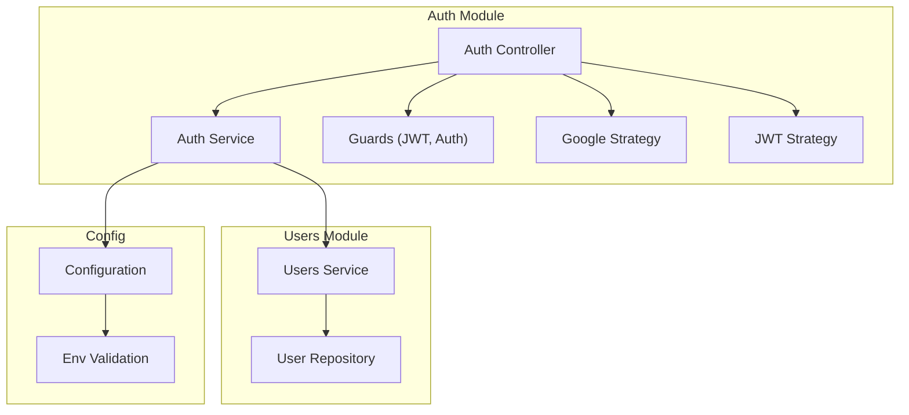
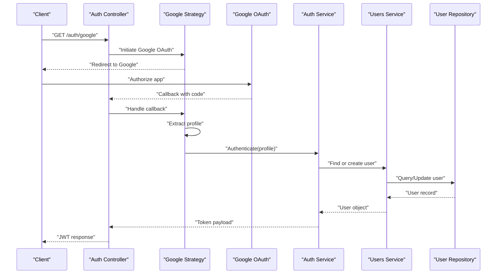
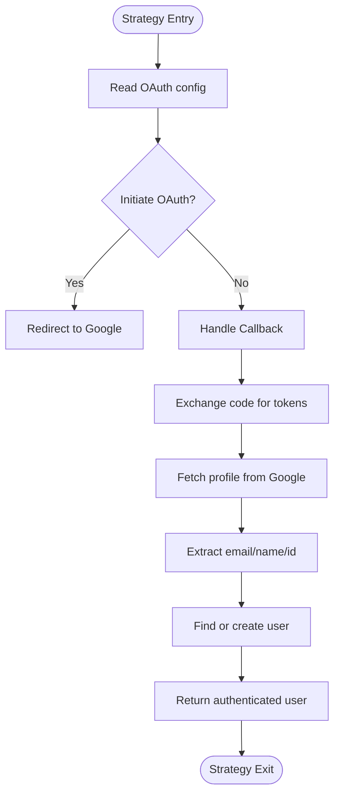
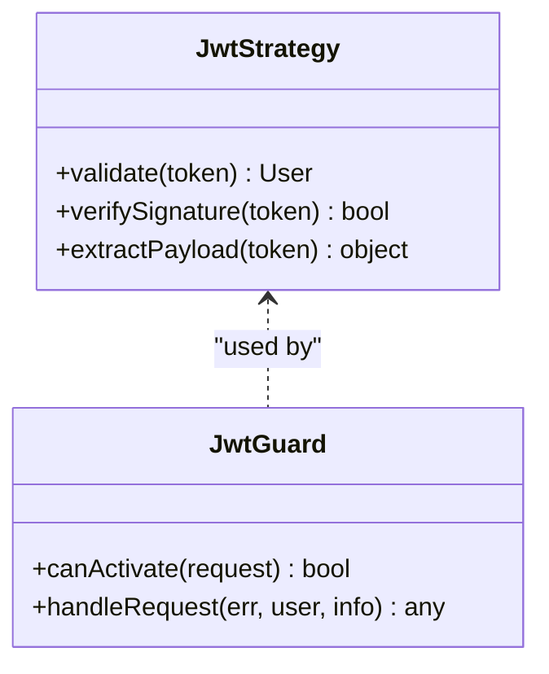
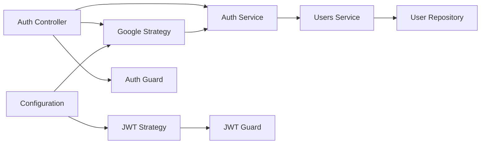

# Authentication Strategies

<cite>
**Referenced Files in This Document**
- [auth.module.ts](file://apps/backend/src/auth/auth.module.ts)
- [auth.controller.ts](file://apps/backend/src/auth/auth.controller.ts)
- [auth.service.ts](file://apps/backend/src/auth/auth.service.ts)
- [google.strategy.ts](file://apps/backend/src/auth/strategies/google.strategy.ts)
- [jwt.strategy.ts](file://apps/backend/src/auth/strategies/jwt.strategy.ts)
- [configuration.ts](file://apps/backend/src/config/configuration.ts)
- [env.validation.ts](file://apps/backend/src/config/env.validation.ts)
- [users.service.ts](file://apps/backend/src/users/services/users.service.ts)
- [user.repository.ts](file://apps/backend/src/users/users.repository.ts)
- [auth.guard.ts](file://apps/backend/src/auth/guards/auth.guard.ts)
- [jwt.guard.ts](file://apps/backend/src/auth/guards/jwt.guard.ts)
</cite>

## Table of Contents
1. [Introduction](#introduction)
2. [Project Structure](#project-structure)
3. [Core Components](#core-components)
4. [Architecture Overview](#architecture-overview)
5. [Detailed Component Analysis](#detailed-component-analysis)
6. [Dependency Analysis](#dependency-analysis)
7. [Performance Considerations](#performance-considerations)
8. [Troubleshooting Guide](#troubleshooting-guide)
9. [Conclusion](#conclusion)

## Introduction
This document explains the Passport.js authentication strategies used by the backend, with a focus on Google OAuth. It covers strategy registration, configuration options, callback handling, profile extraction, and user creation/update flows. It also describes how these strategies integrate with the broader NestJS authentication system, including guards and services.

## Project Structure
The authentication subsystem is organized under apps/backend/src/auth with supporting modules for configuration, users, and guards. Key files include:
- Strategy implementations for Google OAuth and JWT
- Controllers exposing endpoints for initiating and completing OAuth flows
- Services orchestrating user lookup/creation and session/token issuance
- Guards protecting routes based on authentication state
- Configuration and environment validation for OAuth credentials

**Diagram sources**
- [auth.controller.ts](file://apps/backend/src/auth/auth.controller.ts)
- [auth.service.ts](file://apps/backend/src/auth/auth.service.ts)
- [google.strategy.ts](file://apps/backend/src/auth/strategies/google.strategy.ts)
- [jwt.strategy.ts](file://apps/backend/src/auth/strategies/jwt.strategy.ts)
- [auth.guard.ts](file://apps/backend/src/auth/guards/auth.guard.ts)
- [jwt.guard.ts](file://apps/backend/src/auth/guards/jwt.guard.ts)
- [users.service.ts](file://apps/backend/src/users/services/users.service.ts)
- [user.repository.ts](file://apps/backend/src/users/users.repository.ts)
- [configuration.ts](file://apps/backend/src/config/configuration.ts)
- [env.validation.ts](file://apps/backend/src/config/env.validation.ts)

**Section sources**
- [auth.module.ts](file://apps/backend/src/auth/auth.module.ts)
- [auth.controller.ts](file://apps/backend/src/auth/auth.controller.ts)
- [auth.service.ts](file://apps/backend/src/auth/auth.service.ts)
- [google.strategy.ts](file://apps/backend/src/auth/strategies/google.strategy.ts)
- [jwt.strategy.ts](file://apps/backend/src/auth/strategies/jwt.strategy.ts)
- [configuration.ts](file://apps/backend/src/config/configuration.ts)
- [env.validation.ts](file://apps/backend/src/config/env.validation.ts)
- [users.service.ts](file://apps/backend/src/users/services/users.service.ts)
- [user.repository.ts](file://apps/backend/src/users/users.repository.ts)
- [auth.guard.ts](file://apps/backend/src/auth/guards/auth.guard.ts)
- [jwt.guard.ts](file://apps/backend/src/auth/guards/jwt.guard.ts)

## Core Components
- Google OAuth Strategy: Handles Google login initiation and callback, extracts profile data, and delegates user creation/update to the Users service.
- JWT Strategy: Validates access tokens issued after successful authentication and attaches user context to requests.
- Auth Controller: Exposes endpoints for starting Google OAuth and receiving the callback.
- Auth Service: Orchestrates authentication workflows, token generation, and integration with user management.
- Users Service and Repository: Provide user lookup, creation, and update operations.
- Guards: Enforce authentication on protected routes using JWT or custom logic.
- Configuration and Environment Validation: Ensure required OAuth settings are present and validated at startup.

**Section sources**
- [google.strategy.ts](file://apps/backend/src/auth/strategies/google.strategy.ts)
- [jwt.strategy.ts](file://apps/backend/src/auth/strategies/jwt.strategy.ts)
- [auth.controller.ts](file://apps/backend/src/auth/auth.controller.ts)
- [auth.service.ts](file://apps/backend/src/auth/auth.service.ts)
- [users.service.ts](file://apps/backend/src/users/services/users.service.ts)
- [user.repository.ts](file://apps/backend/src/users/users.repository.ts)
- [auth.guard.ts](file://apps/backend/src/auth/guards/auth.guard.ts)
- [jwt.guard.ts](file://apps/backend/src/auth/guards/jwt.guard.ts)
- [configuration.ts](file://apps/backend/src/config/configuration.ts)
- [env.validation.ts](file://apps/backend/src/config/env.validation.ts)

## Architecture Overview
The authentication flow integrates Passport.js strategies with NestJS controllers and services. The Google OAuth strategy initiates an external authorization request and handles the callback by extracting the profile and ensuring a corresponding user exists. After successful authentication, a JWT is issued and validated via the JWT strategy for subsequent requests.

**Diagram sources**
- [auth.controller.ts](file://apps/backend/src/auth/auth.controller.ts)
- [google.strategy.ts](file://apps/backend/src/auth/strategies/google.strategy.ts)
- [auth.service.ts](file://apps/backend/src/auth/auth.service.ts)
- [users.service.ts](file://apps/backend/src/users/services/users.service.ts)
- [user.repository.ts](file://apps/backend/src/users/users.repository.ts)

## Detailed Component Analysis

### Google OAuth Strategy
Responsibilities:
- Configure Google OAuth client ID, secret, scopes, and callback URL from configuration.
- Initiate the OAuth flow when requested by the controller.
- On callback, exchange the authorization code for tokens, fetch profile information, and pass it to the authentication service.
- Extract essential profile fields such as email, name, and provider identifiers.

Integration points:
- Reads configuration via NestJS Config module.
- Delegates user creation/update to the Users service.
- Returns authenticated user context for token issuance.

**Diagram sources**
- [google.strategy.ts](file://apps/backend/src/auth/strategies/google.strategy.ts)
- [configuration.ts](file://apps/backend/src/config/configuration.ts)
- [users.service.ts](file://apps/backend/src/users/services/users.service.ts)

**Section sources**
- [google.strategy.ts](file://apps/backend/src/auth/strategies/google.strategy.ts)
- [configuration.ts](file://apps/backend/src/config/configuration.ts)

### JWT Strategy
Responsibilities:
- Validate incoming JWTs attached to requests.
- Attach decoded user information to the request context for downstream guards and handlers.
- Support token expiration and refresh policies as configured.

Integration points:
- Used by JWT guard to protect routes.
- Relies on shared secret or public key configuration.

**Diagram sources**
- [jwt.strategy.ts](file://apps/backend/src/auth/strategies/jwt.strategy.ts)
- [jwt.guard.ts](file://apps/backend/src/auth/guards/jwt.guard.ts)

**Section sources**
- [jwt.strategy.ts](file://apps/backend/src/auth/strategies/jwt.strategy.ts)
- [jwt.guard.ts](file://apps/backend/src/auth/guards/jwt.guard.ts)

### Auth Controller
Responsibilities:
- Expose endpoints for initiating Google OAuth and handling the callback.
- Coordinate between Passport strategies and the Auth service.
- Return appropriate responses, including JWTs upon successful authentication.

Key behaviors:
- Initiates OAuth redirect with correct scopes and state.
- Processes callback payloads and forwards them to the strategy/service layer.
- Ensures consistent error responses for failed authentication attempts.

**Section sources**
- [auth.controller.ts](file://apps/backend/src/auth/auth.controller.ts)

### Auth Service
Responsibilities:
- Orchestrate authentication workflows across strategies.
- Generate JWTs after successful authentication.
- Manage session state if applicable and coordinate with user management.

Key behaviors:
- Invokes Users service to find or create users based on OAuth profiles.
- Applies security policies for token signing and expiration.
- Provides methods consumed by controllers and guards.

**Section sources**
- [auth.service.ts](file://apps/backend/src/auth/auth.service.ts)

### Users Service and Repository
Responsibilities:
- Provide user lookup by provider ID/email and create new user records when necessary.
- Update existing user profiles with latest profile data from OAuth providers.
- Encapsulate database interactions through Prisma repository patterns.

Key behaviors:
- Upsert logic ensures idempotent user creation/update.
- Normalizes profile fields and maps provider-specific attributes.
- Throws domain-specific errors for invalid states or conflicts.

**Section sources**
- [users.service.ts](file://apps/backend/src/users/services/users.service.ts)
- [user.repository.ts](file://apps/backend/src/users/users.repository.ts)

### Guards
Responsibilities:
- Enforce authentication on protected routes.
- Validate JWT presence and integrity.
- Allow fine-grained control over route access based on user roles or claims.

Key behaviors:
- JWT Guard validates tokens and attaches user context.
- Custom Auth Guard can enforce additional business rules.

**Section sources**
- [auth.guard.ts](file://apps/backend/src/auth/guards/auth.guard.ts)
- [jwt.guard.ts](file://apps/backend/src/auth/guards/jwt.guard.ts)

### Configuration and Environment Validation
Responsibilities:
- Load OAuth client ID, secret, scopes, and callback URLs from environment variables.
- Validate required configuration at application startup to prevent runtime failures.
- Centralize configuration access across strategies and services.

Key behaviors:
- Uses NestJS Config module for typed configuration.
- Enforces strict validation schemas for sensitive settings.

**Section sources**
- [configuration.ts](file://apps/backend/src/config/configuration.ts)
- [env.validation.ts](file://apps/backend/src/config/env.validation.ts)

## Dependency Analysis
The authentication module depends on configuration, user management, and guards. Strategies encapsulate external integrations (Google OAuth), while services orchestrate internal flows. Guards ensure that only authenticated requests reach protected endpoints.

**Diagram sources**
- [configuration.ts](file://apps/backend/src/config/configuration.ts)
- [google.strategy.ts](file://apps/backend/src/auth/strategies/google.strategy.ts)
- [jwt.strategy.ts](file://apps/backend/src/auth/strategies/jwt.strategy.ts)
- [auth.service.ts](file://apps/backend/src/auth/auth.service.ts)
- [users.service.ts](file://apps/backend/src/users/services/users.service.ts)
- [user.repository.ts](file://apps/backend/src/users/users.repository.ts)
- [auth.controller.ts](file://apps/backend/src/auth/auth.controller.ts)
- [auth.guard.ts](file://apps/backend/src/auth/guards/auth.guard.ts)
- [jwt.guard.ts](file://apps/backend/src/auth/guards/jwt.guard.ts)

**Section sources**
- [auth.module.ts](file://apps/backend/src/auth/auth.module.ts)
- [auth.controller.ts](file://apps/backend/src/auth/auth.controller.ts)
- [auth.service.ts](file://apps/backend/src/auth/auth.service.ts)
- [google.strategy.ts](file://apps/backend/src/auth/strategies/google.strategy.ts)
- [jwt.strategy.ts](file://apps/backend/src/auth/strategies/jwt.strategy.ts)
- [users.service.ts](file://apps/backend/src/users/services/users.service.ts)
- [user.repository.ts](file://apps/backend/src/users/users.repository.ts)
- [auth.guard.ts](file://apps/backend/src/auth/guards/auth.guard.ts)
- [jwt.guard.ts](file://apps/backend/src/auth/guards/jwt.guard.ts)
- [configuration.ts](file://apps/backend/src/config/configuration.ts)
- [env.validation.ts](file://apps/backend/src/config/env.validation.ts)

## Performance Considerations
- Minimize external API calls by caching user profiles where appropriate.
- Use connection pooling and efficient queries in the user repository.
- Keep JWT payloads small to reduce overhead on each request.
- Implement rate limiting on authentication endpoints to mitigate abuse.
- Prefer asynchronous operations and avoid blocking the event loop during OAuth callbacks.

[No sources needed since this section provides general guidance]

## Troubleshooting Guide
Common issues and resolutions:
- Missing or invalid OAuth credentials: Ensure environment variables are set and validated at startup.
- Callback URL mismatches: Verify the registered callback URL matches the application’s configuration.
- Profile extraction errors: Confirm scope permissions and field mappings for Google profile data.
- Token validation failures: Check JWT secret/key configuration and expiration settings.
- User creation/update conflicts: Review upsert logic and unique constraints in the user repository.

**Section sources**
- [configuration.ts](file://apps/backend/src/config/configuration.ts)
- [env.validation.ts](file://apps/backend/src/config/env.validation.ts)
- [google.strategy.ts](file://apps/backend/src/auth/strategies/google.strategy.ts)
- [jwt.strategy.ts](file://apps/backend/src/auth/strategies/jwt.strategy.ts)
- [users.service.ts](file://apps/backend/src/users/services/users.service.ts)
- [user.repository.ts](file://apps/backend/src/users/users.repository.ts)

## Conclusion
The authentication system leverages Passport.js strategies to support Google OAuth and JWT-based access control. The Google OAuth strategy handles configuration, callback processing, and profile extraction, delegating user management to dedicated services. JWT strategy and guards secure subsequent requests. Proper configuration, robust error handling, and performance optimizations ensure a reliable and scalable authentication experience.

[No sources needed since this section summarizes without analyzing specific files]