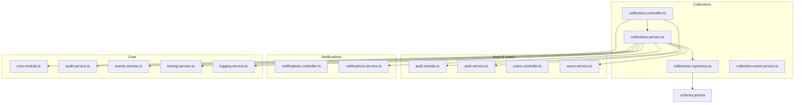
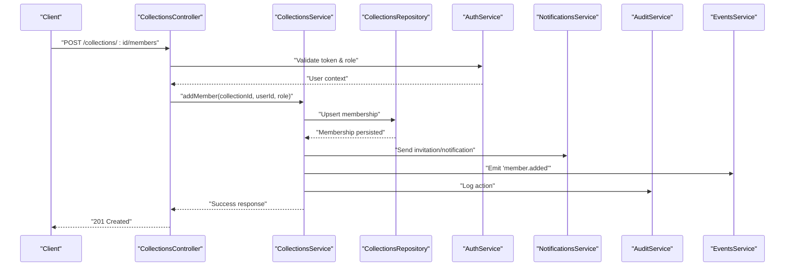
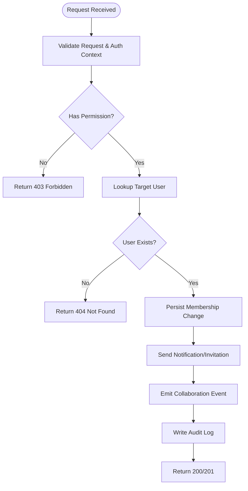
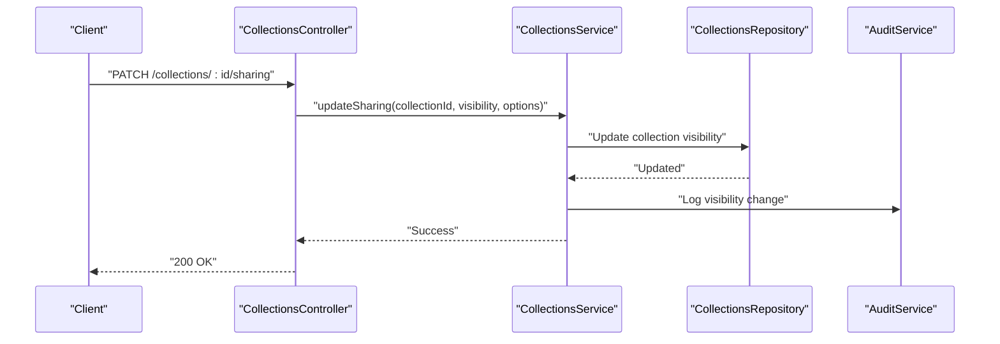
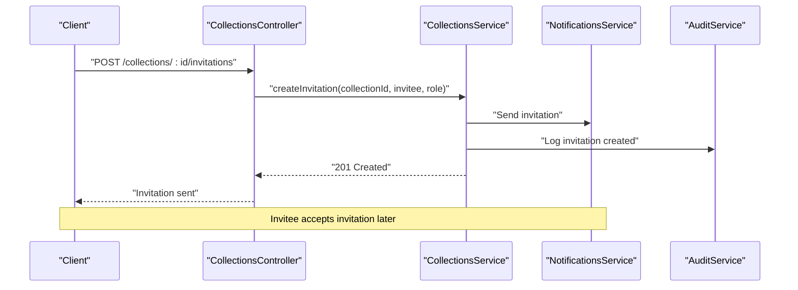
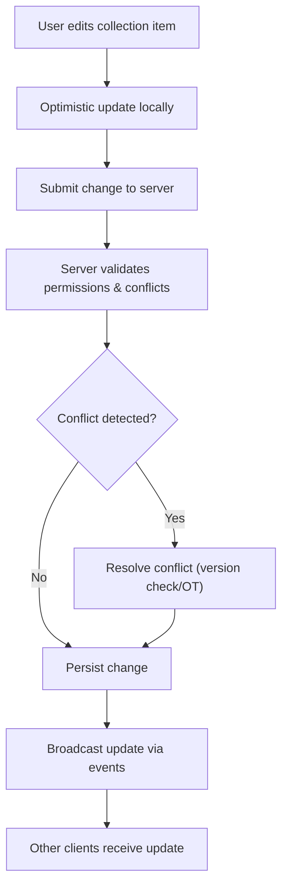
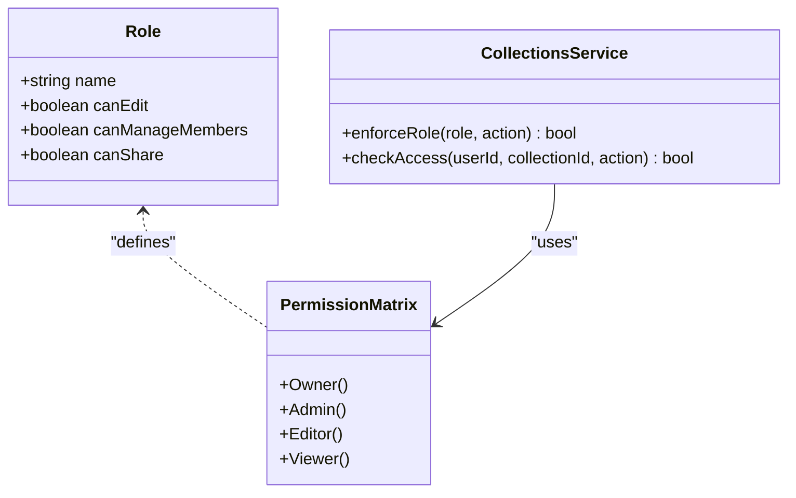
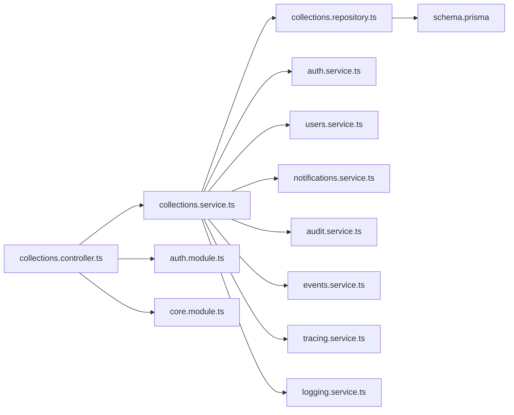

# Collaboration & Sharing

<cite>
**Referenced Files in This Document**
- [collections.controller.ts](file://apps/backend/src/collections/collections.controller.ts)
- [collections.service.ts](file://apps/backend/src/collections/collections.service.ts)
- [collections.repository.ts](file://apps/backend/src/collections/collections.repository.ts)
- [collection-event.service.ts](file://apps/backend/src/collections/collection-event.service.ts)
- [schema.prisma](file://apps/backend/prisma/schema.prisma)
- [auth.module.ts](file://apps/backend/src/auth/auth.module.ts)
- [auth.service.ts](file://apps/backend/src/auth/auth.service.ts)
- [users.controller.ts](file://apps/backend/src/users/users.controller.ts)
- [users.service.ts](file://apps/backend/src/users/users.service.ts)
- [notifications.controller.ts](file://apps/backend/src/notifications/notifications.controller.ts)
- [notifications.service.ts](file://apps/backend/src/notifications/notifications.service.ts)
- [core.module.ts](file://apps/backend/src/core/core.module.ts)
- [audit.service.ts](file://apps/backend/src/core/audit/audit.service.ts)
- [events.service.ts](file://apps/backend/src/core/events/events.service.ts)
- [tracing.service.ts](file://apps/backend/src/observability/tracing.service.ts)
- [logging.service.ts](file://apps/backend/src/observability/logging.service.ts)
- [app.bootstrap.ts](file://apps/backend/src/app.bootstrap.ts)
</cite>

## Table of Contents
1. [Introduction](#introduction)
2. [Project Structure](#project-structure)
3. [Core Components](#core-components)
4. [Architecture Overview](#architecture-overview)
5. [Detailed Component Analysis](#detailed-component-analysis)
6. [Dependency Analysis](#dependency-analysis)
7. [Performance Considerations](#performance-considerations)
8. [Troubleshooting Guide](#troubleshooting-guide)
9. [Conclusion](#conclusion)
10. [Appendices](#appendices)

## Introduction
This document explains the collaboration and sharing features for collections, focusing on member management, role-based permissions, access control, invitation workflows, collaborative editing considerations, permission validation, security, audit logging, and synchronization strategies. It also provides example API endpoints for managing members, controlling sharing settings, and validating permissions. The content is derived from the backend modules related to collections, users, notifications, core services (audit, events, tracing), and the database schema.

## Project Structure
The collaboration and sharing capabilities are primarily implemented in the backend under the collections module, with supporting functionality in auth, users, notifications, and core services. The data model is defined in Prisma schema.

**Diagram sources**
- [collections.controller.ts](file://apps/backend/src/collections/collections.controller.ts)
- [collections.service.ts](file://apps/backend/src/collections/collections.service.ts)
- [collections.repository.ts](file://apps/backend/src/collections/collections.repository.ts)
- [collection-event.service.ts](file://apps/backend/src/collections/collection-event.service.ts)
- [auth.module.ts](file://apps/backend/src/auth/auth.module.ts)
- [auth.service.ts](file://apps/backend/src/auth/auth.service.ts)
- [users.controller.ts](file://apps/backend/src/users/users.controller.ts)
- [users.service.ts](file://apps/backend/src/users/users.service.ts)
- [notifications.controller.ts](file://apps/backend/src/notifications/notifications.controller.ts)
- [notifications.service.ts](file://apps/backend/src/notifications/notifications.service.ts)
- [core.module.ts](file://apps/backend/src/core/core.module.ts)
- [audit.service.ts](file://apps/backend/src/core/audit/audit.service.ts)
- [events.service.ts](file://apps/backend/src/core/events/events.service.ts)
- [tracing.service.ts](file://apps/backend/src/observability/tracing.service.ts)
- [logging.service.ts](file://apps/backend/src/observability/logging.service.ts)
- [schema.prisma](file://apps/backend/prisma/schema.prisma)

**Section sources**
- [collections.controller.ts](file://apps/backend/src/collections/collections.controller.ts)
- [collections.service.ts](file://apps/backend/src/collections/collections.service.ts)
- [collections.repository.ts](file://apps/backend/src/collections/collections.repository.ts)
- [collection-event.service.ts](file://apps/backend/src/collections/collection-event.service.ts)
- [auth.module.ts](file://apps/backend/src/auth/auth.module.ts)
- [auth.service.ts](file://apps/backend/src/auth/auth.service.ts)
- [users.controller.ts](file://apps/backend/src/users/users.controller.ts)
- [users.service.ts](file://apps/backend/src/users/users.service.ts)
- [notifications.controller.ts](file://apps/backend/src/notifications/notifications.controller.ts)
- [notifications.service.ts](file://apps/backend/src/notifications/notifications.service.ts)
- [core.module.ts](file://apps/backend/src/core/core.module.ts)
- [audit.service.ts](file://apps/backend/src/core/audit/audit.service.ts)
- [events.service.ts](file://apps/backend/src/core/events/events.service.ts)
- [tracing.service.ts](file://apps/backend/src/observability/tracing.service.ts)
- [logging.service.ts](file://apps/backend/src/observability/logging.service.ts)
- [schema.prisma](file://apps/backend/prisma/schema.prisma)

## Core Components
- Collections Controller: Exposes HTTP endpoints for collection operations including member management and sharing controls.
- Collections Service: Implements business logic for adding/removing members, assigning roles, enforcing permissions, publishing events, and coordinating notifications.
- Collections Repository: Data access layer for collection-related entities and relationships.
- Collection Event Service: Emits domain events for collaboration activities (e.g., member added, role changed).
- Auth Module & Service: Provides authentication guards and token handling used by controllers and services to enforce identity and authorization.
- Users Module & Service: Manages user lookups and profiles required for invitations and membership.
- Notifications Module & Service: Sends email or in-app notifications for invitations and updates.
- Core Services: Audit logging, event bus, tracing, and logging utilities used across collaboration flows.

**Section sources**
- [collections.controller.ts](file://apps/backend/src/collections/collections.controller.ts)
- [collections.service.ts](file://apps/backend/src/collections/collections.service.ts)
- [collections.repository.ts](file://apps/backend/src/collections/collections.repository.ts)
- [collection-event.service.ts](file://apps/backend/src/collections/collection-event.service.ts)
- [auth.module.ts](file://apps/backend/src/auth/auth.module.ts)
- [auth.service.ts](file://apps/backend/src/auth/auth.service.ts)
- [users.controller.ts](file://apps/backend/src/users/users.controller.ts)
- [users.service.ts](file://apps/backend/src/users/users.service.ts)
- [notifications.controller.ts](file://apps/backend/src/notifications/notifications.controller.ts)
- [notifications.service.ts](file://apps/backend/src/notifications/notifications.service.ts)
- [core.module.ts](file://apps/backend/src/core/core.module.ts)
- [audit.service.ts](file://apps/backend/src/core/audit/audit.service.ts)
- [events.service.ts](file://apps/backend/src/core/events/events.service.ts)
- [tracing.service.ts](file://apps/backend/src/observability/tracing.service.ts)
- [logging.service.ts](file://apps/backend/src/observability/logging.service.ts)

## Architecture Overview
Collaboration flows typically follow this path:
- Client calls a controller endpoint (e.g., add member, update sharing).
- Controller validates request and delegates to service.
- Service enforces permissions, persists changes via repository, emits events, and triggers notifications.
- Audit logs capture actions; tracing and logging provide observability.

**Diagram sources**
- [collections.controller.ts](file://apps/backend/src/collections/collections.controller.ts)
- [collections.service.ts](file://apps/backend/src/collections/collections.service.ts)
- [collections.repository.ts](file://apps/backend/src/collections/collections.repository.ts)
- [auth.service.ts](file://apps/backend/src/auth/auth.service.ts)
- [notifications.service.ts](file://apps/backend/src/notifications/notifications.service.ts)
- [audit.service.ts](file://apps/backend/src/core/audit/audit.service.ts)
- [events.service.ts](file://apps/backend/src/core/events/events.service.ts)

## Detailed Component Analysis

### Member Management
- Add Member: Validates requester’s ownership/role, ensures target user exists, assigns role, persists membership, notifies invitee, emits event, and logs audit.
- Remove Member: Verifies requester has permission to remove, prevents self-removal if owner, updates membership, emits event, and logs audit.
- Update Role: Checks role change rules (e.g., only owner can assign admin), persists new role, emits event, and logs audit.
- List Members: Returns membership list with roles, filtered by requester’s visibility.

**Diagram sources**
- [collections.controller.ts](file://apps/backend/src/collections/collections.controller.ts)
- [collections.service.ts](file://apps/backend/src/collections/collections.service.ts)
- [collections.repository.ts](file://apps/backend/src/collections/collections.repository.ts)
- [notifications.service.ts](file://apps/backend/src/notifications/notifications.service.ts)
- [audit.service.ts](file://apps/backend/src/core/audit/audit.service.ts)
- [events.service.ts](file://apps/backend/src/core/events/events.service.ts)

**Section sources**
- [collections.controller.ts](file://apps/backend/src/collections/collections.controller.ts)
- [collections.service.ts](file://apps/backend/src/collections/collections.service.ts)
- [collections.repository.ts](file://apps/backend/src/collections/collections.repository.ts)
- [notifications.service.ts](file://apps/backend/src/notifications/notifications.service.ts)
- [audit.service.ts](file://apps/backend/src/core/audit/audit.service.ts)
- [events.service.ts](file://apps/backend/src/core/events/events.service.ts)

### Sharing Controls (Public/Private)
- Set Visibility: Owner/admin toggles public/private status; public collections allow read-only access via share links; private requires explicit membership.
- Share Link Generation: Creates secure, expirable tokens for read-only access when enabled.
- Access Validation: On read requests, checks visibility and token validity before serving data.

**Diagram sources**
- [collections.controller.ts](file://apps/backend/src/collections/collections.controller.ts)
- [collections.service.ts](file://apps/backend/src/collections/collections.service.ts)
- [collections.repository.ts](file://apps/backend/src/collections/collections.repository.ts)
- [audit.service.ts](file://apps/backend/src/core/audit/audit.service.ts)

**Section sources**
- [collections.controller.ts](file://apps/backend/src/collections/collections.controller.ts)
- [collections.service.ts](file://apps/backend/src/collections/collections.service.ts)
- [collections.repository.ts](file://apps/backend/src/collections/collections.repository.ts)
- [audit.service.ts](file://apps/backend/src/core/audit/audit.service.ts)

### Invitation System
- Invite Flow: Admin/owner invites by email or user ID; system creates pending invitation, sends notification/email, and awaits acceptance.
- Acceptance: Invitee accepts via link or UI; membership created with assigned role; event emitted and audit logged.
- Revocation: Invitations can be revoked before acceptance.

**Diagram sources**
- [collections.controller.ts](file://apps/backend/src/collections/collections.controller.ts)
- [collections.service.ts](file://apps/backend/src/collections/collections.service.ts)
- [notifications.service.ts](file://apps/backend/src/notifications/notifications.service.ts)
- [audit.service.ts](file://apps/backend/src/core/audit/audit.service.ts)

**Section sources**
- [collections.controller.ts](file://apps/backend/src/collections/collections.controller.ts)
- [collections.service.ts](file://apps/backend/src/collections/collections.service.ts)
- [notifications.service.ts](file://apps/backend/src/notifications/notifications.service.ts)
- [audit.service.ts](file://apps/backend/src/core/audit/audit.service.ts)

### Collaborative Editing Capabilities
- Real-time Sync: Use event-driven architecture to broadcast changes to collaborators; implement optimistic updates on client side.
- Conflict Resolution: Apply last-write-wins with version vectors or operational transforms for concurrent edits.
- Synchronization: Maintain per-collection version counters; clients poll or subscribe to updates.

**Diagram sources**
- [collections.service.ts](file://apps/backend/src/collections/collections.service.ts)
- [events.service.ts](file://apps/backend/src/core/events/events.service.ts)
- [tracing.service.ts](file://apps/backend/src/observability/tracing.service.ts)
- [logging.service.ts](file://apps/backend/src/observability/logging.service.ts)

**Section sources**
- [collections.service.ts](file://apps/backend/src/collections/collections.service.ts)
- [events.service.ts](file://apps/backend/src/core/events/events.service.ts)
- [tracing.service.ts](file://apps/backend/src/observability/tracing.service.ts)
- [logging.service.ts](file://apps/backend/src/observability/logging.service.ts)

### Permission Model & Access Control
- Roles: Owner, Admin, Editor, Viewer. Owner/Admin manage members; Editors can modify content; Viewers have read-only access.
- Enforcement: Controllers use auth guards; services validate role-permission matrix before mutations.
- Inheritance: Collection-level permissions override default library/user permissions.

**Diagram sources**
- [collections.service.ts](file://apps/backend/src/collections/collections.service.ts)
- [auth.service.ts](file://apps/backend/src/auth/auth.service.ts)

**Section sources**
- [collections.service.ts](file://apps/backend/src/collections/collections.service.ts)
- [auth.service.ts](file://apps/backend/src/auth/auth.service.ts)

### Security Considerations
- Authentication: JWT-based sessions validated by auth guards.
- Authorization: Role-based checks at controller and service layers.
- Input Validation: DTOs and pipes ensure safe payloads.
- Rate Limiting: Protect endpoints against abuse.
- Secure Links: Expiring tokens for public sharing.

**Section sources**
- [auth.module.ts](file://apps/backend/src/auth/auth.module.ts)
- [auth.service.ts](file://apps/backend/src/auth/auth.service.ts)
- [collections.controller.ts](file://apps/backend/src/collections/collections.controller.ts)

### Audit Logging
- Action Capture: All member and sharing changes are logged with actor, timestamp, and details.
- Retention: Centralized audit storage for compliance and troubleshooting.
- Querying: Admins can query audit trails by collection and user.

**Section sources**
- [audit.service.ts](file://apps/backend/src/core/audit/audit.service.ts)
- [collections.service.ts](file://apps/backend/src/collections/collections.service.ts)

### Versioning & Synchronization
- Version Counter: Each collection maintains a version number incremented on writes.
- Concurrency: Clients send expected version; server rejects stale updates.
- Event Stream: Changes published via events for real-time sync.

**Section sources**
- [collections.service.ts](file://apps/backend/src/collections/collections.service.ts)
- [events.service.ts](file://apps/backend/src/core/events/events.service.ts)
- [tracing.service.ts](file://apps/backend/src/observability/tracing.service.ts)

## Dependency Analysis
Collaboration features depend on auth, users, notifications, and core services. The repository abstracts data access, while the service orchestrates business logic and cross-cutting concerns.

**Diagram sources**
- [collections.controller.ts](file://apps/backend/src/collections/collections.controller.ts)
- [collections.service.ts](file://apps/backend/src/collections/collections.service.ts)
- [collections.repository.ts](file://apps/backend/src/collections/collections.repository.ts)
- [auth.service.ts](file://apps/backend/src/auth/auth.service.ts)
- [users.service.ts](file://apps/backend/src/users/users.service.ts)
- [notifications.service.ts](file://apps/backend/src/notifications/notifications.service.ts)
- [audit.service.ts](file://apps/backend/src/core/audit/audit.service.ts)
- [events.service.ts](file://apps/backend/src/core/events/events.service.ts)
- [tracing.service.ts](file://apps/backend/src/observability/tracing.service.ts)
- [logging.service.ts](file://apps/backend/src/observability/logging.service.ts)
- [auth.module.ts](file://apps/backend/src/auth/auth.module.ts)
- [core.module.ts](file://apps/backend/src/core/core.module.ts)
- [schema.prisma](file://apps/backend/prisma/schema.prisma)

**Section sources**
- [collections.controller.ts](file://apps/backend/src/collections/collections.controller.ts)
- [collections.service.ts](file://apps/backend/src/collections/collections.service.ts)
- [collections.repository.ts](file://apps/backend/src/collections/collections.repository.ts)
- [auth.service.ts](file://apps/backend/src/auth/auth.service.ts)
- [users.service.ts](file://apps/backend/src/users/users.service.ts)
- [notifications.service.ts](file://apps/backend/src/notifications/notifications.service.ts)
- [audit.service.ts](file://apps/backend/src/core/audit/audit.service.ts)
- [events.service.ts](file://apps/backend/src/core/events/events.service.ts)
- [tracing.service.ts](file://apps/backend/src/observability/tracing.service.ts)
- [logging.service.ts](file://apps/backend/src/observability/logging.service.ts)
- [auth.module.ts](file://apps/backend/src/auth/auth.module.ts)
- [core.module.ts](file://apps/backend/src/core/core.module.ts)
- [schema.prisma](file://apps/backend/prisma/schema.prisma)

## Performance Considerations
- Batch Operations: Group member additions/updates to reduce DB round-trips.
- Caching: Cache membership lists and permissions for frequently accessed collections.
- Pagination: Paginate member lists and audit logs.
- Async Processing: Offload notifications and heavy tasks to queues.
- Indexes: Ensure proper DB indexes on foreign keys and common query fields.

[No sources needed since this section provides general guidance]

## Troubleshooting Guide
Common issues and resolutions:
- 403 Forbidden: Insufficient role; verify requester’s role and collection ownership.
- 404 Not Found: Invalid collection or user ID; confirm IDs exist.
- Duplicate Membership: Attempting to add existing member; handle gracefully.
- Invitation Expired: Tokens expire; regenerate and resend.
- Audit Gaps: Ensure audit logging is enabled and not suppressed by filters.

**Section sources**
- [collections.controller.ts](file://apps/backend/src/collections/collections.controller.ts)
- [collections.service.ts](file://apps/backend/src/collections/collections.service.ts)
- [audit.service.ts](file://apps/backend/src/core/audit/audit.service.ts)

## Conclusion
The collaboration and sharing subsystem integrates member management, role-based permissions, invitation workflows, and robust audit logging. By leveraging event-driven architecture and centralized services, it supports scalable multi-user collaboration with strong security and observability. Future enhancements may include advanced conflict resolution, granular field-level permissions, and richer real-time collaboration features.

[No sources needed since this section summarizes without analyzing specific files]

## Appendices

### Example API Endpoints
- Member Management
  - POST /collections/:id/members
  - PATCH /collections/:id/members/:userId
  - DELETE /collections/:id/members/:userId
  - GET /collections/:id/members
- Sharing Controls
  - PATCH /collections/:id/sharing
  - GET /collections/:id/share-link
  - POST /collections/:id/invitations
  - DELETE /collections/:id/invitations/:invitationId
- Permission Validation
  - GET /collections/:id/permissions?userId=:userId&action=:action

[No sources needed since this section lists conceptual endpoints]

### Data Model Highlights
- Collection: id, ownerId, visibility, version, timestamps
- Membership: collectionId, userId, role, createdAt, updatedAt
- Invitation: collectionId, inviteeEmail, inviteeUserId, role, status, expiresAt
- AuditLog: actorId, action, entityType, entityId, metadata, timestamp

**Section sources**
- [schema.prisma](file://apps/backend/prisma/schema.prisma)