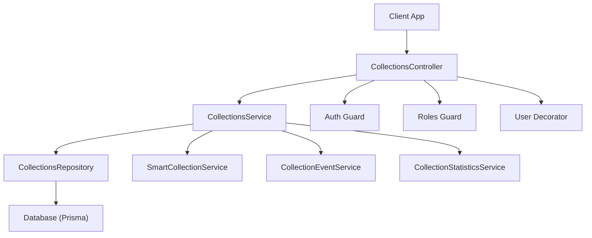
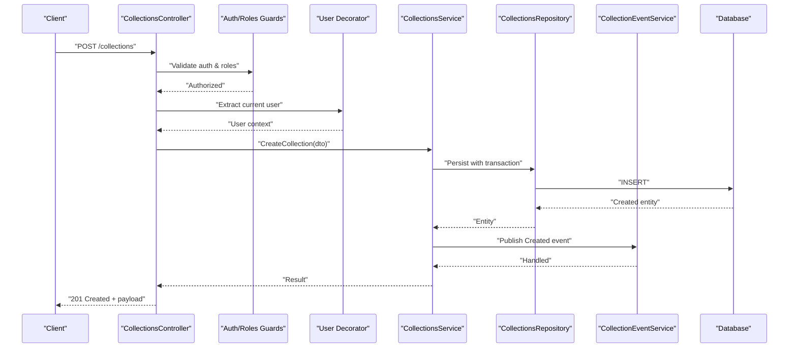
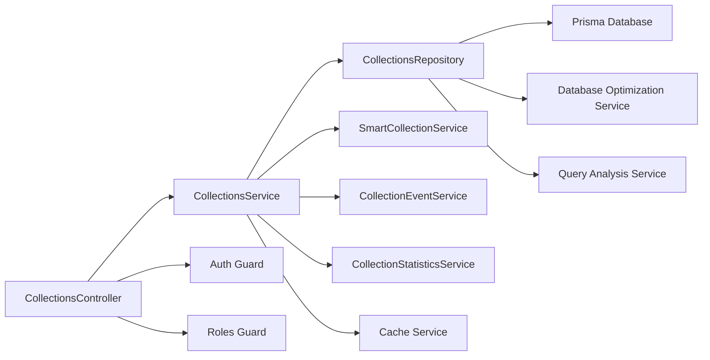
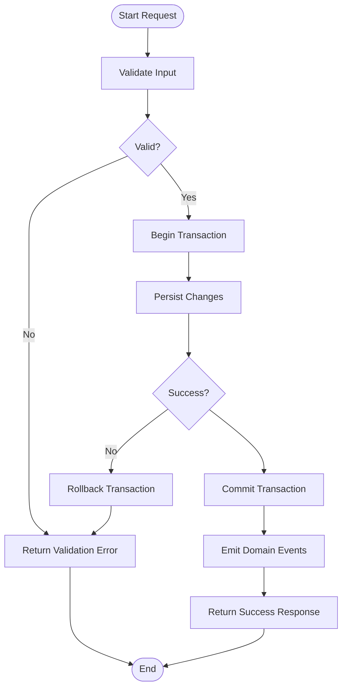

# Collection Management

<cite>
**Referenced Files in This Document**
- [collections.controller.ts](file://apps/backend/src/collections/collections.controller.ts)
- [collections.service.ts](file://apps/backend/src/collections/collections.service.ts)
- [collections.repository.ts](file://apps/backend/src/collections/collections.repository.ts)
- [collections.module.ts](file://apps/backend/src/collections/collections.module.ts)
- [smart-collection.service.ts](file://apps/backend/src/collections/smart-collection.service.ts)
- [collection-event.service.ts](file://apps/backend/src/collections/collection-event.service.ts)
- [collection-statistics.service.ts](file://apps/backend/src/collections/collection-statistics.service.ts)
- [schema.prisma](file://apps/backend/prisma/schema.prisma)
- [auth.guard.ts](file://apps/backend/src/auth/guards/auth.guard.ts)
- [roles.guard.ts](file://apps/backend/src/auth/guards/roles.guard.ts)
- [user.decorator.ts](file://apps/backend/src/auth/decorators/user.decorator.ts)
- [cache.service.ts](file://apps/backend/src/hardening/cache.service.ts)
- [database-optimization.service.ts](file://apps/backend/src/hardening/database-optimization.service.ts)
- [query-analysis.service.ts](file://apps/backend/src/hardening/query-analysis.service.ts)
- [pagination.interceptor.ts](file://apps/backend/src/common/pagination/pagination.interceptor.ts)
- [exception.filter.ts](file://apps/backend/src/common/filters/exception.filter.ts)
- [result.ts](file://apps/backend/src/common/result/result.ts)
</cite>

## Table of Contents
1. [Introduction](#introduction)
2. [Project Structure](#project-structure)
3. [Core Components](#core-components)
4. [Architecture Overview](#architecture-overview)
5. [Detailed Component Analysis](#detailed-component-analysis)
6. [Dependency Analysis](#dependency-analysis)
7. [Performance Considerations](#performance-considerations)
8. [Troubleshooting Guide](#troubleshooting-guide)
9. [Conclusion](#conclusion)
10. [Appendices](#appendices)

## Introduction
This document provides comprehensive documentation for the core collection management functionality. It covers CRUD operations (create, read, update, delete), the collection data model, validation rules, and business logic implemented in the service layer. It also explains repository patterns used for database operations, query optimization techniques, transaction handling, DTOs, error handling strategies, integration with user authentication and authorization, performance considerations for large datasets, and caching strategies.

## Project Structure
The collection feature is organized under a dedicated NestJS module with clear separation of concerns:
- Controller exposes HTTP endpoints for collection operations.
- Service encapsulates business logic and orchestrates domain operations.
- Repository abstracts persistence and implements query optimizations and transactions.
- Supporting services handle events, statistics, and smart collections.
- Guards and decorators enforce authentication and authorization at the controller level.
- Prisma schema defines the data model and relationships.

**Diagram sources**
- [collections.controller.ts](file://apps/backend/src/collections/collections.controller.ts)
- [collections.service.ts](file://apps/backend/src/collections/collections.service.ts)
- [collections.repository.ts](file://apps/backend/src/collections/collections.repository.ts)
- [smart-collection.service.ts](file://apps/backend/src/collections/smart-collection.service.ts)
- [collection-event.service.ts](file://apps/backend/src/collections/collection-event.service.ts)
- [collection-statistics.service.ts](file://apps/backend/src/collections/collection-statistics.service.ts)
- [auth.guard.ts](file://apps/backend/src/auth/guards/auth.guard.ts)
- [roles.guard.ts](file://apps/backend/src/auth/guards/roles.guard.ts)
- [user.decorator.ts](file://apps/backend/src/auth/decorators/user.decorator.ts)

**Section sources**
- [collections.controller.ts](file://apps/backend/src/collections/collections.controller.ts)
- [collections.service.ts](file://apps/backend/src/collections/collections.service.ts)
- [collections.repository.ts](file://apps/backend/src/collections/collections.repository.ts)
- [collections.module.ts](file://apps/backend/src/collections/collections.module.ts)

## Core Components
- CollectionsController: Defines REST endpoints for collection CRUD and related actions. Integrates guards and decorators to enforce authentication and authorization.
- CollectionsService: Implements business logic for creating, updating, deleting, and retrieving collections. Coordinates with repositories and supporting services.
- CollectionsRepository: Encapsulates all persistence operations using Prisma. Provides optimized queries, pagination, filtering, and transactional helpers.
- SmartCollectionService: Manages dynamic or rule-based collections.
- CollectionEventService: Publishes and handles domain events related to collection lifecycle changes.
- CollectionStatisticsService: Computes metrics and aggregates for collections.

Key responsibilities:
- Input validation and transformation via DTOs.
- Authorization checks based on user roles and ownership.
- Transactional writes for consistency.
- Efficient reads with indexing and pagination.
- Event-driven side effects and analytics.

**Section sources**
- [collections.controller.ts](file://apps/backend/src/collections/collections.controller.ts)
- [collections.service.ts](file://apps/backend/src/collections/collections.service.ts)
- [collections.repository.ts](file://apps/backend/src/collections/collections.repository.ts)
- [smart-collection.service.ts](file://apps/backend/src/collections/smart-collection.service.ts)
- [collection-event.service.ts](file://apps/backend/src/collections/collection-event.service.ts)
- [collection-statistics.service.ts](file://apps/backend/src/collections/collection-statistics.service.ts)

## Architecture Overview
The system follows a layered architecture:
- Presentation Layer: Controllers expose HTTP APIs.
- Business Layer: Services implement domain logic and orchestrate operations.
- Data Access Layer: Repositories use Prisma for ORM operations.
- Cross-cutting Concerns: Authentication, authorization, caching, observability, and exception handling.

**Diagram sources**
- [collections.controller.ts](file://apps/backend/src/collections/collections.controller.ts)
- [collections.service.ts](file://apps/backend/src/collections/collections.service.ts)
- [collections.repository.ts](file://apps/backend/src/collections/collections.repository.ts)
- [collection-event.service.ts](file://apps/backend/src/collections/collection-event.service.ts)
- [auth.guard.ts](file://apps/backend/src/auth/guards/auth.guard.ts)
- [roles.guard.ts](file://apps/backend/src/auth/guards/roles.guard.ts)
- [user.decorator.ts](file://apps/backend/src/auth/decorators/user.decorator.ts)

## Detailed Component Analysis

### CollectionsController
Responsibilities:
- Exposes endpoints for create, read, update, delete, and list collections.
- Applies authentication and role-based authorization guards.
- Injects current user context via decorator.
- Returns standardized responses and maps errors.

Validation and authorization:
- Uses DTOs for request body validation.
- Enforces ownership and role checks before delegating to service methods.

Error handling:
- Centralized exception filter normalizes error responses.
- Uses consistent status codes and structured error payloads.

**Section sources**
- [collections.controller.ts](file://apps/backend/src/collections/collections.controller.ts)
- [auth.guard.ts](file://apps/backend/src/auth/guards/auth.guard.ts)
- [roles.guard.ts](file://apps/backend/src/auth/guards/roles.guard.ts)
- [user.decorator.ts](file://apps/backend/src/auth/decorators/user.decorator.ts)
- [exception.filter.ts](file://apps/backend/src/common/filters/exception.filter.ts)

### CollectionsService
Responsibilities:
- Implements CRUD operations with business rules.
- Validates inputs beyond DTO constraints (e.g., uniqueness, ownership).
- Orchestrates transactions for multi-step writes.
- Emits domain events for side effects (e.g., notifications, analytics).
- Delegates heavy computations to statistics and smart collection services.

Business logic highlights:
- Ownership verification ensures users can only modify their own collections.
- Conditional updates prevent invalid state transitions.
- Aggregations and derived fields are computed where necessary.

Transaction handling:
- Wraps write operations in transactions to ensure atomicity.
- Rolls back on any failure and returns consistent error messages.

**Section sources**
- [collections.service.ts](file://apps/backend/src/collections/collections.service.ts)
- [collection-event.service.ts](file://apps/backend/src/collections/collection-event.service.ts)
- [collection-statistics.service.ts](file://apps/backend/src/collections/collection-statistics.service.ts)

### CollectionsRepository
Responsibilities:
- Encapsulates all Prisma interactions for collections.
- Provides optimized queries with selective field projection and joins.
- Implements pagination, sorting, and filtering utilities.
- Offers transaction helpers and batch operations.

Query optimization techniques:
- Selective column selection to reduce payload size.
- Indexed lookups for common filters (e.g., owner_id, slug).
- Pagination with cursor or offset strategies depending on dataset size.
- Batch inserts/updates for bulk operations.

Data model mapping:
- Maps Prisma entities to DTOs and domain models.
- Ensures type safety across layers.

**Section sources**
- [collections.repository.ts](file://apps/backend/src/collections/collections.repository.ts)
- [schema.prisma](file://apps/backend/prisma/schema.prisma)

### SmartCollectionService
Responsibilities:
- Manages rule-based or algorithmic collections that auto-update based on criteria.
- Evaluates membership rules against media items or metadata.
- Integrates with statistics and events to reflect changes.

Use cases:
- Dynamic playlists by genre, date range, or tags.
- Personalized recommendations curated per user.

**Section sources**
- [smart-collection.service.ts](file://apps/backend/src/collections/smart-collection.service.ts)

### CollectionEventService
Responsibilities:
- Publishes lifecycle events such as created, updated, deleted.
- Subscribes to events to trigger downstream processes (notifications, analytics).
- Ensures idempotency and retry policies for reliability.

**Section sources**
- [collection-event.service.ts](file://apps/backend/src/collections/collection-event.service.ts)

### CollectionStatisticsService
Responsibilities:
- Computes metrics like item counts, growth trends, and engagement indicators.
- Provides aggregated views for dashboards and insights.
- Caches expensive calculations when appropriate.

**Section sources**
- [collection-statistics.service.ts](file://apps/backend/src/collections/collection-statistics.service.ts)

### Data Model and Validation
- The Prisma schema defines the collection entity, relationships, and constraints.
- DTOs define input shapes and validation rules for requests.
- Validation includes required fields, format checks, and business constraints enforced in the service layer.

Model relationships:
- Collections relate to owners (users) and associated media items.
- Indexes and foreign keys ensure referential integrity and efficient queries.

**Section sources**
- [schema.prisma](file://apps/backend/prisma/schema.prisma)

### Error Handling Strategies
- Centralized exception filter standardizes error responses.
- Domain-specific exceptions map to HTTP status codes.
- Result types provide consistent success/error envelopes.

Best practices:
- Validate early and fail fast.
- Provide actionable error messages.
- Log contextual information without exposing sensitive data.

**Section sources**
- [exception.filter.ts](file://apps/backend/src/common/filters/exception.filter.ts)
- [result.ts](file://apps/backend/src/common/result/result.ts)

## Dependency Analysis
The collection module depends on authentication, authorization, caching, and database optimization services.

**Diagram sources**
- [collections.controller.ts](file://apps/backend/src/collections/collections.controller.ts)
- [collections.service.ts](file://apps/backend/src/collections/collections.service.ts)
- [collections.repository.ts](file://apps/backend/src/collections/collections.repository.ts)
- [smart-collection.service.ts](file://apps/backend/src/collections/smart-collection.service.ts)
- [collection-event.service.ts](file://apps/backend/src/collections/collection-event.service.ts)
- [collection-statistics.service.ts](file://apps/backend/src/collections/collection-statistics.service.ts)
- [auth.guard.ts](file://apps/backend/src/auth/guards/auth.guard.ts)
- [roles.guard.ts](file://apps/backend/src/auth/guards/roles.guard.ts)
- [cache.service.ts](file://apps/backend/src/hardening/cache.service.ts)
- [database-optimization.service.ts](file://apps/backend/src/hardening/database-optimization.service.ts)
- [query-analysis.service.ts](file://apps/backend/src/hardening/query-analysis.service.ts)

**Section sources**
- [collections.module.ts](file://apps/backend/src/collections/collections.module.ts)
- [cache.service.ts](file://apps/backend/src/hardening/cache.service.ts)
- [database-optimization.service.ts](file://apps/backend/src/hardening/database-optimization.service.ts)
- [query-analysis.service.ts](file://apps/backend/src/hardening/query-analysis.service.ts)

## Performance Considerations
- Pagination: Use cursor-based pagination for large datasets to avoid offset penalties.
- Selective projections: Fetch only needed fields to minimize payload and memory usage.
- Indexing: Ensure indexes on frequently filtered columns (owner_id, slug, timestamps).
- Caching: Cache read-heavy endpoints and aggregation results; invalidate on mutations.
- Transactions: Keep transactions short and focused to reduce lock contention.
- Batch operations: Prefer bulk inserts/updates for high-throughput scenarios.
- Query analysis: Monitor slow queries and optimize joins or add missing indexes.

[No sources needed since this section provides general guidance]

## Troubleshooting Guide
Common issues and resolutions:
- Unauthorized access: Verify authentication guard configuration and token validity.
- Forbidden operation: Check role-based permissions and ownership checks in controllers/services.
- Validation failures: Inspect DTO constraints and custom validation logic in services.
- Database errors: Review transaction boundaries and constraint violations; consult query logs.
- Performance regressions: Use query analysis and cache hit rates to identify bottlenecks.

Operational tips:
- Enable detailed logging for failed requests.
- Use health checks to monitor database connectivity and cache availability.
- Implement retries with exponential backoff for transient failures.

**Section sources**
- [exception.filter.ts](file://apps/backend/src/common/filters/exception.filter.ts)
- [auth.guard.ts](file://apps/backend/src/auth/guards/auth.guard.ts)
- [roles.guard.ts](file://apps/backend/src/auth/guards/roles.guard.ts)
- [cache.service.ts](file://apps/backend/src/hardening/cache.service.ts)
- [database-optimization.service.ts](file://apps/backend/src/hardening/database-optimization.service.ts)
- [query-analysis.service.ts](file://apps/backend/src/hardening/query-analysis.service.ts)

## Conclusion
The collection management subsystem is designed with clear separation of concerns, robust validation, and strong security controls. Repository patterns enable efficient and maintainable database interactions, while services encapsulate complex business logic and coordinate events and statistics. Performance is addressed through indexing, pagination, caching, and query optimization. The modular architecture supports scalability and extensibility for future enhancements.

[No sources needed since this section summarizes without analyzing specific files]

## Appendices

### API Endpoints Overview
- Create Collection: POST /collections
- Update Collection: PATCH /collections/:id
- Delete Collection: DELETE /collections/:id
- Get Collection: GET /collections/:id
- List Collections: GET /collections?filters&sort&page

Authentication and authorization:
- All endpoints require valid authentication.
- Role-based access control restricts modifications to authorized users.
- Ownership checks ensure users can only manage their own collections.

**Section sources**
- [collections.controller.ts](file://apps/backend/src/collections/collections.controller.ts)
- [auth.guard.ts](file://apps/backend/src/auth/guards/auth.guard.ts)
- [roles.guard.ts](file://apps/backend/src/auth/guards/roles.guard.ts)
- [user.decorator.ts](file://apps/backend/src/auth/decorators/user.decorator.ts)

### DTO Examples
- CreateCollectionDto: Fields for title, description, visibility, and metadata.
- UpdateCollectionDto: Partial fields for patch updates.
- ListCollectionsQueryDto: Filters, sort order, and pagination parameters.

Validation rules:
- Required fields enforced at DTO and service layers.
- Format and length constraints applied consistently.
- Business rules validated in service methods (e.g., uniqueness, ownership).

**Section sources**
- [collections.controller.ts](file://apps/backend/src/collections/collections.controller.ts)
- [collections.service.ts](file://apps/backend/src/collections/collections.service.ts)

### Transaction Flow Example

**Diagram sources**
- [collections.service.ts](file://apps/backend/src/collections/collections.service.ts)
- [collections.repository.ts](file://apps/backend/src/collections/collections.repository.ts)