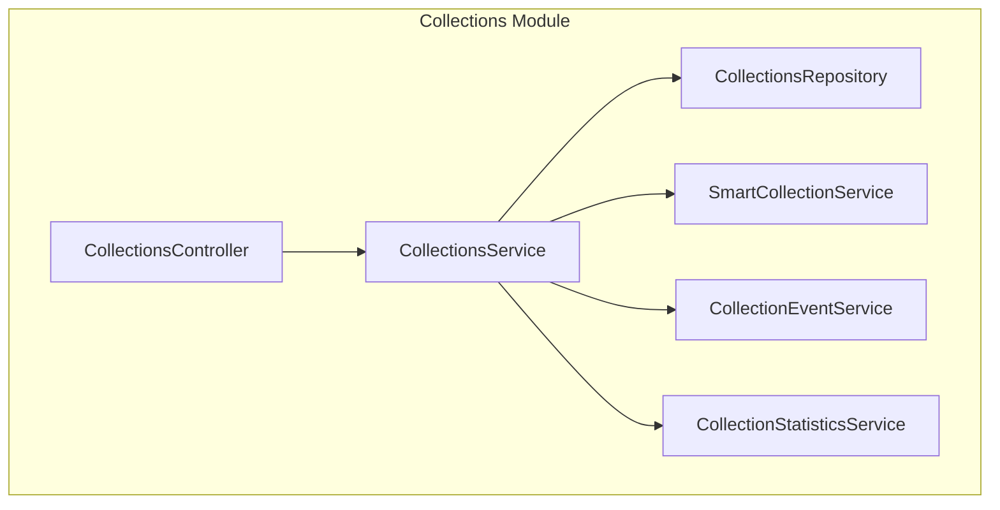
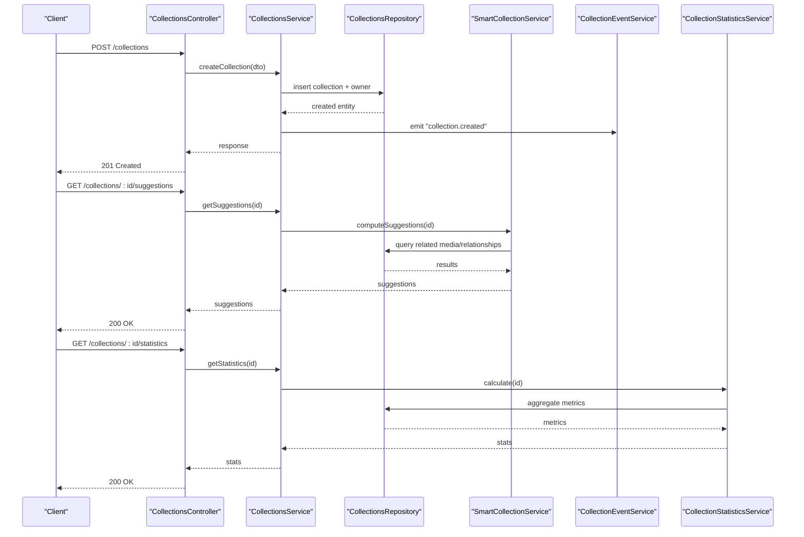
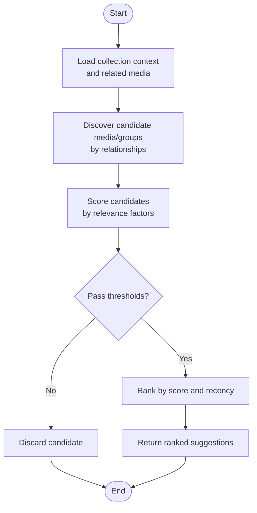
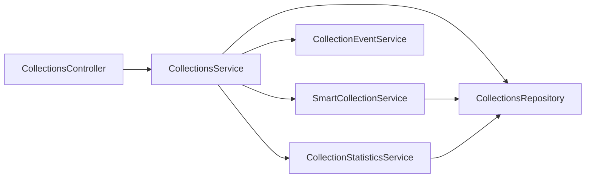

# Collections Module

<cite>
**Referenced Files in This Document**
- [collections.controller.ts](file://apps/backend/src/collections/collections.controller.ts)
- [collections.service.ts](file://apps/backend/src/collections/collections.service.ts)
- [collections.repository.ts](file://apps/backend/src/collections/collections.repository.ts)
- [smart-collection.service.ts](file://apps/backend/src/collections/smart-collection.service.ts)
- [collection-event.service.ts](file://apps/backend/src/collections/collection-event.service.ts)
- [collection-statistics.service.ts](file://apps/backend/src/collections/collection-statistics.service.ts)
- [collections.module.ts](file://apps/backend/src/collections/collections.module.ts)
- [index.ts](file://apps/backend/src/collections/index.ts)
- [schema.prisma](file://apps/backend/prisma/schema.prisma)
</cite>

## Table of Contents
1. [Introduction](#introduction)
2. [Project Structure](#project-structure)
3. [Core Components](#core-components)
4. [Architecture Overview](#architecture-overview)
5. [Detailed Component Analysis](#detailed-component-analysis)
6. [Dependency Analysis](#dependency-analysis)
7. [Performance Considerations](#performance-considerations)
8. [Troubleshooting Guide](#troubleshooting-guide)
9. [Conclusion](#conclusion)

## Introduction
This document provides comprehensive documentation for the Collections Module, which enables themed collection creation, smart collection suggestions, and collaborative features. It covers CRUD operations, smart algorithms based on media relationships, statistics calculation for insights, event-driven architecture for changes, member management, sharing functionality, DTOs, repository patterns for complex queries, and performance optimization strategies for large collection sets.

## Project Structure
The Collections Module is implemented under apps/backend/src/collections with a clear separation of concerns:
- Controller: HTTP endpoints for collections
- Service: Business logic for CRUD, collaboration, and orchestration
- Repository: Data access layer for complex queries
- Smart Collection Service: Automated organization using media relationships
- Event Service: Publishes and handles collection change events
- Statistics Service: Computes metrics and insights
- Module: Wiring dependencies and exports

**Diagram sources**
- [collections.controller.ts](file://apps/backend/src/collections/collections.controller.ts)
- [collections.service.ts](file://apps/backend/src/collections/collections.service.ts)
- [collections.repository.ts](file://apps/backend/src/collections/collections.repository.ts)
- [smart-collection.service.ts](file://apps/backend/src/collections/smart-collection.service.ts)
- [collection-event.service.ts](file://apps/backend/src/collections/collection-event.service.ts)
- [collection-statistics.service.ts](file://apps/backend/src/collections/collection-statistics.service.ts)

**Section sources**
- [collections.controller.ts](file://apps/backend/src/collections/collections.controller.ts)
- [collections.service.ts](file://apps/backend/src/collections/collections.service.ts)
- [collections.repository.ts](file://apps/backend/src/collections/collections.repository.ts)
- [smart-collection.service.ts](file://apps/backend/src/collections/smart-collection.service.ts)
- [collection-event.service.ts](file://apps/backend/src/collections/collection-event.service.ts)
- [collection-statistics.service.ts](file://apps/backend/src/collections/collection-statistics.service.ts)
- [collections.module.ts](file://apps/backend/src/collections/collections.module.ts)
- [index.ts](file://apps/backend/src/collections/index.ts)

## Core Components
- CollectionsController: Exposes REST endpoints for creating, reading, updating, deleting collections; managing members; sharing; and retrieving smart suggestions and statistics.
- CollectionsService: Implements core business logic for collection lifecycle, member permissions, sharing workflows, and orchestrating smart suggestions and statistics.
- CollectionsRepository: Encapsulates complex queries, joins, aggregations, and pagination for collections and their relationships to media and users.
- SmartCollectionService: Applies rules over media relationships (e.g., shared creators, genres, dates, tags) to generate automated collection suggestions.
- CollectionEventService: Emits domain events on create/update/delete/member/share actions; subscribers can react asynchronously.
- CollectionStatisticsService: Calculates metrics such as item counts, recency, diversity, and growth trends for insights dashboards.

Key responsibilities and interactions are wired via NestJS dependency injection in the module.

**Section sources**
- [collections.controller.ts](file://apps/backend/src/collections/collections.controller.ts)
- [collections.service.ts](file://apps/backend/src/collections/collections.service.ts)
- [collections.repository.ts](file://apps/backend/src/collections/collections.repository.ts)
- [smart-collection.service.ts](file://apps/backend/src/collections/smart-collection.service.ts)
- [collection-event.service.ts](file://apps/backend/src/collections/collection-event.service.ts)
- [collection-statistics.service.ts](file://apps/backend/src/collections/collection-statistics.service.ts)
- [collections.module.ts](file://apps/backend/src/collections/collections.module.ts)

## Architecture Overview
The module follows a layered architecture:
- Presentation Layer: Controller validates requests and returns responses.
- Application Layer: Service coordinates use cases, enforces permissions, and triggers side effects.
- Domain Layer: Services encapsulate business rules (smart suggestions, statistics).
- Infrastructure Layer: Repository abstracts database operations.

**Diagram sources**
- [collections.controller.ts](file://apps/backend/src/collections/collections.controller.ts)
- [collections.service.ts](file://apps/backend/src/collections/collections.service.ts)
- [collections.repository.ts](file://apps/backend/src/collections/collections.repository.ts)
- [smart-collection.service.ts](file://apps/backend/src/collections/smart-collection.service.ts)
- [collection-event.service.ts](file://apps/backend/src/collections/collection-event.service.ts)
- [collection-statistics.service.ts](file://apps/backend/src/collections/collection-statistics.service.ts)

## Detailed Component Analysis

### CollectionsController
- Responsibilities:
  - Define routes for collection CRUD, member management, sharing, suggestions, and statistics.
  - Validate request payloads and map to service methods.
  - Return standardized responses and handle errors.

- Typical endpoints:
  - Create collection
  - Update collection metadata
  - Delete collection
  - List collections with filters and pagination
  - Add/remove members and update roles
  - Share/unshare collection
  - Get smart suggestions
  - Get statistics

- Error handling:
  - Unauthorized or forbidden when permission checks fail.
  - Not found for missing collections or members.
  - Validation errors for malformed inputs.

**Section sources**
- [collections.controller.ts](file://apps/backend/src/collections/collections.controller.ts)

### CollectionsService
- Responsibilities:
  - Orchestrate collection lifecycle operations.
  - Enforce ownership and role-based permissions.
  - Coordinate member management and sharing workflows.
  - Trigger smart suggestion computation and statistics aggregation.
  - Emit domain events for auditability and downstream reactions.

- Key flows:
  - Create: validate input, persist via repository, emit event, return entity.
  - Update: load entity, apply updates, recompute dependent data if needed, emit event.
  - Delete: cascade or soft-delete depending on policy, emit event.
  - Suggestions: delegate to SmartCollectionService with context.
  - Statistics: delegate to CollectionStatisticsService with filters.

- Performance considerations:
  - Batch operations where possible.
  - Avoid N+1 queries by leveraging repository joins.
  - Cache hot reads behind a cache layer if applicable.

**Section sources**
- [collections.service.ts](file://apps/backend/src/collections/collections.service.ts)

### CollectionsRepository
- Responsibilities:
  - Implement complex queries across collections, members, and media relationships.
  - Provide paginated lists, filtered searches, and aggregated counts.
  - Optimize joins and indexes for frequent access patterns.

- Common operations:
  - Find by id, owner, or shared status.
  - Query collections containing specific media IDs.
  - Count items per collection and group by attributes.
  - Retrieve member lists with roles and statuses.

- Indexing strategy:
  - Primary keys on collection id and foreign keys for efficient lookups.
  - Composite indexes for common filter combinations (owner, visibility, type).

**Section sources**
- [collections.repository.ts](file://apps/backend/src/collections/collections.repository.ts)
- [schema.prisma](file://apps/backend/prisma/schema.prisma)

### SmartCollectionService
- Responsibilities:
  - Generate automated collection suggestions based on media relationships.
  - Apply rule sets such as shared creators, genres, release years, tags, or user interactions.
  - Rank suggestions by relevance scores and freshness.

- Algorithm overview:
  - Input: target collection context (id, owner, existing members/media).
  - Candidate discovery: find media/entities linked by relationships.
  - Scoring: weight by relationship strength, recency, and diversity.
  - Output: ranked list of suggested collections or media groups.

- Extensibility:
  - Rule modules can be added without changing core logic.
  - Configurable thresholds and weights via configuration.

**Diagram sources**
- [smart-collection.service.ts](file://apps/backend/src/collections/smart-collection.service.ts)
- [collections.repository.ts](file://apps/backend/src/collections/collections.repository.ts)

**Section sources**
- [smart-collection.service.ts](file://apps/backend/src/collections/smart-collection.service.ts)

### CollectionEventService
- Responsibilities:
  - Publish domain events for collection lifecycle and collaboration actions.
  - Subscribe to events to trigger background tasks (e.g., recomputing suggestions, notifications).

- Events:
  - collection.created
  - collection.updated
  - collection.deleted
  - collection.member.added
  - collection.member.removed
  - collection.shared
  - collection.unshared

- Integration:
  - Uses an event bus or messaging system for decoupled processing.
  - Ensures idempotency and retry policies for reliability.

**Section sources**
- [collection-event.service.ts](file://apps/backend/src/collections/collection-event.service.ts)

### CollectionStatisticsService
- Responsibilities:
  - Compute metrics for collection insights: item count, growth rate, diversity index, recency distribution.
  - Aggregate across time windows and dimensions (genre, creator, date).
  - Provide summary and detailed breakdowns for dashboards.

- Metrics examples:
  - Total items and unique creators.
  - Monthly growth trend.
  - Top genres and tags.
  - Engagement signals (if integrated with interaction data).

**Section sources**
- [collection-statistics.service.ts](file://apps/backend/src/collections/collection-statistics.service.ts)

### DTOs and Data Models
- DTOs define request/response shapes for:
  - Creating/updating collections (title, description, visibility, type).
  - Managing members (user id, role, invite token).
  - Sharing (share link, permissions).
  - Suggestions (criteria, scoring parameters).
  - Statistics (filters, time ranges).

- Data models:
  - Collection entity with fields for metadata, visibility, and timestamps.
  - Member entity linking users to collections with roles and statuses.
  - Relationships to media entities through junction tables.

- Validation:
  - Strict schemas ensure consistent payloads and reduce server-side validation overhead.

**Section sources**
- [collections.controller.ts](file://apps/backend/src/collections/collections.controller.ts)
- [collections.service.ts](file://apps/backend/src/collections/collections.service.ts)
- [schema.prisma](file://apps/backend/prisma/schema.prisma)

### Collaboration and Permissions
- Roles:
  - Owner: full control including deletion and membership changes.
  - Editor: modify content and manage members within limits.
  - Viewer: read-only access.

- Permission checks:
  - Ownership verification on sensitive operations.
  - Role-based authorization enforced at service level.
  - Shared links support limited access with expiring tokens.

- Sharing workflow:
  - Generate shareable link with scoped permissions.
  - Track access logs and revoke access when needed.

**Section sources**
- [collections.service.ts](file://apps/backend/src/collections/collections.service.ts)
- [collections.controller.ts](file://apps/backend/src/collections/collections.controller.ts)

## Dependency Analysis
The module’s internal dependencies are cohesive and loosely coupled:
- Controller depends on Service only.
- Service depends on Repository, SmartCollectionService, EventService, and StatisticsService.
- Repository depends on Prisma schema and database connections.
- Smart and Statistics services depend on Repository for data access.

**Diagram sources**
- [collections.controller.ts](file://apps/backend/src/collections/collections.controller.ts)
- [collections.service.ts](file://apps/backend/src/collections/collections.service.ts)
- [collections.repository.ts](file://apps/backend/src/collections/collections.repository.ts)
- [smart-collection.service.ts](file://apps/backend/src/collections/smart-collection.service.ts)
- [collection-event.service.ts](file://apps/backend/src/collections/collection-event.service.ts)
- [collection-statistics.service.ts](file://apps/backend/src/collections/collection-statistics.service.ts)

**Section sources**
- [collections.module.ts](file://apps/backend/src/collections/collections.module.ts)
- [index.ts](file://apps/backend/src/collections/index.ts)

## Performance Considerations
- Query Optimization:
  - Use indexed columns for frequent filters (owner, visibility, type).
  - Prefer batched queries to avoid N+1 problems.
  - Leverage repository-level joins and projections to minimize payload size.

- Caching:
  - Cache frequently accessed collection metadata and statistics.
  - Invalidate caches on write operations or via event-driven invalidation.

- Pagination and Filtering:
  - Implement cursor-based pagination for large result sets.
  - Defer heavy computations to background jobs when necessary.

- Concurrency:
  - Use transactions for multi-step writes to maintain consistency.
  - Apply optimistic locking for concurrent updates.

- Scalability:
  - Offload smart suggestion computation to asynchronous workers.
  - Partition large datasets by owner or visibility scope.

[No sources needed since this section provides general guidance]

## Troubleshooting Guide
- Common issues:
  - Permission denied: verify ownership and roles before performing mutations.
  - Missing data: check repository joins and foreign key constraints.
  - Slow queries: analyze execution plans and add appropriate indexes.
  - Event storms: throttle event publishing and ensure idempotent handlers.

- Debugging steps:
  - Enable detailed logging around controller entry points and service calls.
  - Inspect repository SQL for inefficient queries.
  - Validate DTOs against expected schemas.
  - Review event logs for failed or duplicate processing.

**Section sources**
- [collections.controller.ts](file://apps/backend/src/collections/collections.controller.ts)
- [collections.service.ts](file://apps/backend/src/collections/collections.service.ts)
- [collections.repository.ts](file://apps/backend/src/collections/collections.repository.ts)
- [collection-event.service.ts](file://apps/backend/src/collections/collection-event.service.ts)

## Conclusion
The Collections Module provides a robust foundation for themed collection creation, smart suggestions, and collaboration. Its layered design ensures clarity and scalability, while event-driven architecture supports extensibility and real-time features. By adhering to strong DTOs, repository patterns, and performance best practices, the module delivers reliable insights and seamless user experiences even with large collection sets.

[No sources needed since this section summarizes without analyzing specific files]