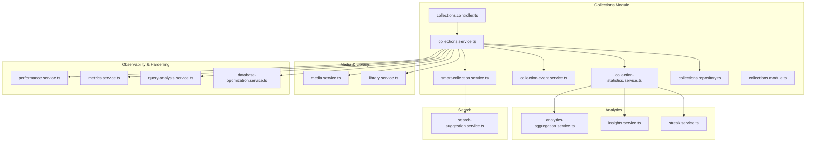
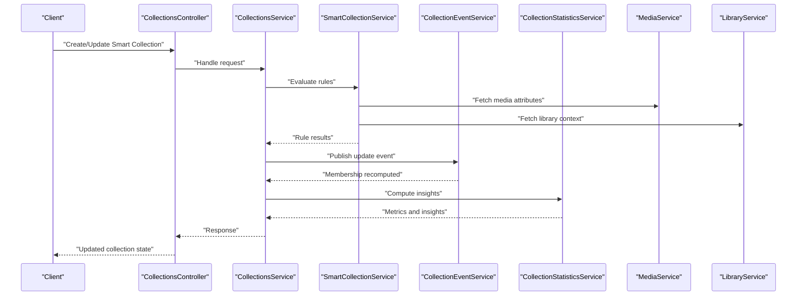
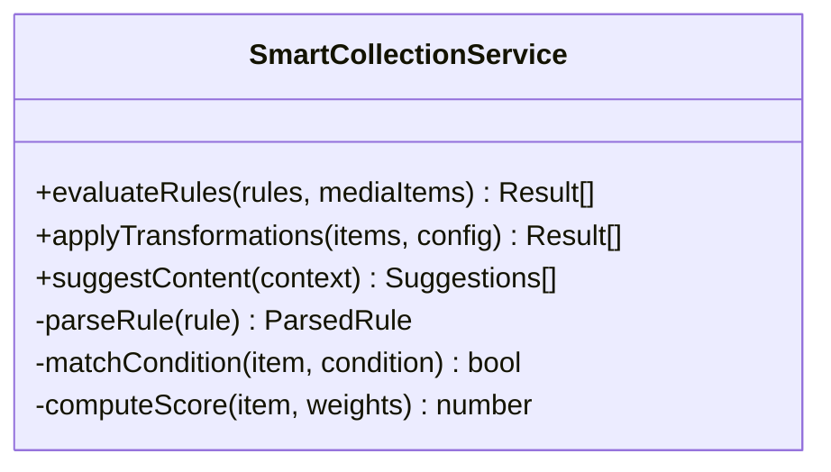
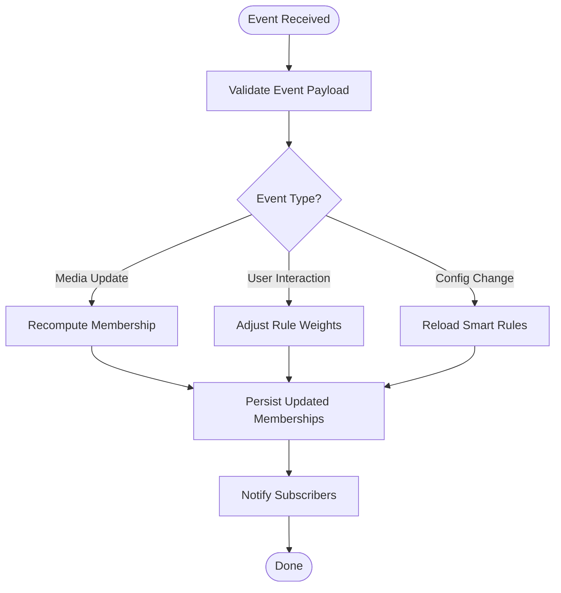
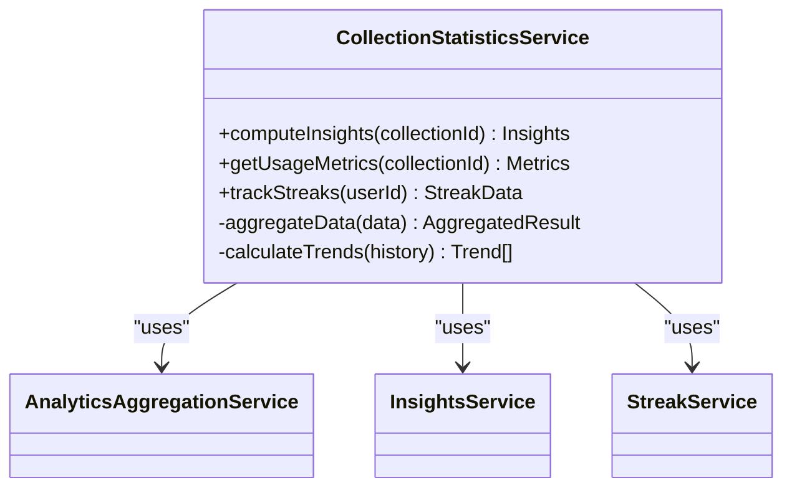
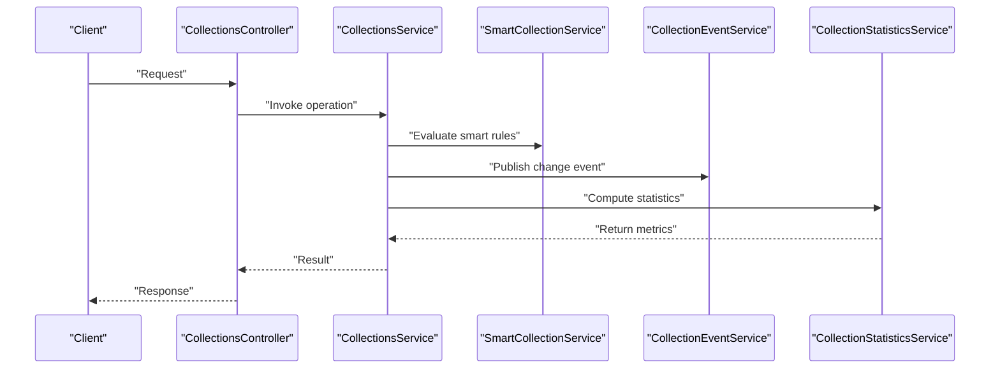
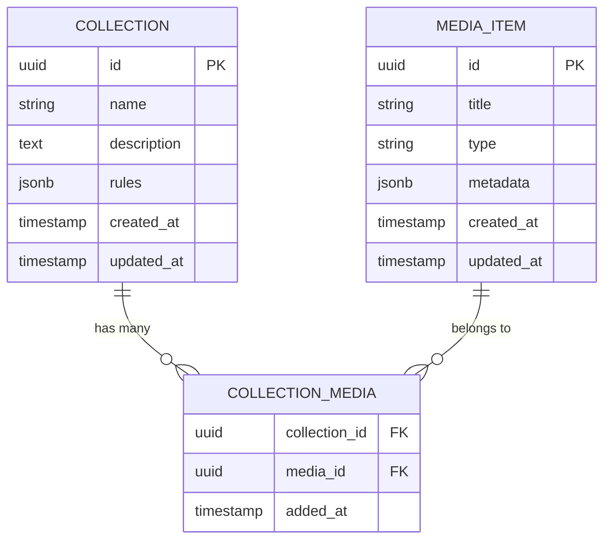
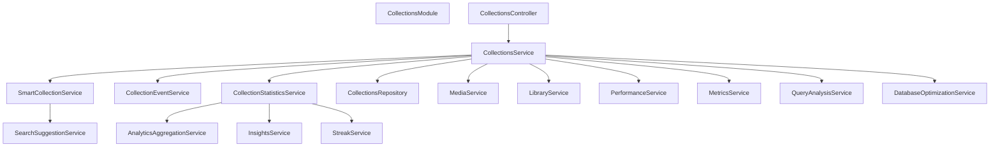

# Smart Collections

<cite>
**Referenced Files in This Document**
- [collections.service.ts](file://apps/backend/src/collections/collections.service.ts)
- [smart-collection.service.ts](file://apps/backend/src/collections/smart-collection.service.ts)
- [collection-event.service.ts](file://apps/backend/src/collections/collection-event.service.ts)
- [collection-statistics.service.ts](file://apps/backend/src/collections/collection-statistics.service.ts)
- [collections.controller.ts](file://apps/backend/src/collections/collections.controller.ts)
- [collections.module.ts](file://apps/backend/src/collections/collections.module.ts)
- [collections.repository.ts](file://apps/backend/src/collections/collections.repository.ts)
- [schema.prisma](file://apps/backend/prisma/schema.prisma)
- [analytics-aggregation.service.ts](file://apps/backend/src/analytics/analytics-aggregation.service.ts)
- [insights.service.ts](file://apps/backend/src/analytics/insights.service.ts)
- [streak.service.ts](file://apps/backend/src/analytics/streak.service.ts)
- [media.service.ts](file://apps/backend/src/media/media.service.ts)
- [library.service.ts](file://apps/backend/src/library/library.service.ts)
- [search-suggestion.service.ts](file://apps/backend/src/search/search-suggestion.service.ts)
- [performance.service.ts](file://apps/backend/src/observability/performance.service.ts)
- [metrics.service.ts](file://apps/backend/src/observability/metrics.service.ts)
- [query-analysis.service.ts](file://apps/backend/src/hardening/query-analysis.service.ts)
- [database-optimization.service.ts](file://apps/backend/src/hardening/database-optimization.service.ts)
</cite>

## Table of Contents
1. [Introduction](#introduction)
2. [Project Structure](#project-structure)
3. [Core Components](#core-components)
4. [Architecture Overview](#architecture-overview)
5. [Detailed Component Analysis](#detailed-component-analysis)
6. [Dependency Analysis](#dependency-analysis)
7. [Performance Considerations](#performance-considerations)
8. [Troubleshooting Guide](#troubleshooting-guide)
9. [Conclusion](#conclusion)
10. [Appendices](#appendices)

## Introduction
This document explains the smart collections system that automatically organizes media based on relationships and patterns. It covers rule-based filtering, automated organization, event-driven updates, relationship detection, dynamic suggestions, statistics calculation, performance metrics, configuration options, scalability considerations, and optimization techniques for complex queries. The goal is to provide both a high-level understanding and deep technical insights for developers and operators.

## Project Structure
The smart collections feature resides primarily under the backend collections module, with integrations across analytics, observability, hardening, media, library, search, and database layers. Key files include services for collection management, smart rules evaluation, event handling, statistics computation, and controllers exposing APIs.

**Diagram sources**
- [collections.controller.ts](file://apps/backend/src/collections/collections.controller.ts)
- [collections.service.ts](file://apps/backend/src/collections/collections.service.ts)
- [smart-collection.service.ts](file://apps/backend/src/collections/smart-collection.service.ts)
- [collection-event.service.ts](file://apps/backend/src/collections/collection-event.service.ts)
- [collection-statistics.service.ts](file://apps/backend/src/collections/collection-statistics.service.ts)
- [collections.repository.ts](file://apps/backend/src/collections/collections.repository.ts)
- [collections.module.ts](file://apps/backend/src/collections/collections.module.ts)
- [media.service.ts](file://apps/backend/src/media/media.service.ts)
- [library.service.ts](file://apps/backend/src/library/library.service.ts)
- [analytics-aggregation.service.ts](file://apps/backend/src/analytics/analytics-aggregation.service.ts)
- [insights.service.ts](file://apps/backend/src/analytics/insights.service.ts)
- [streak.service.ts](file://apps/backend/src/analytics/streak.service.ts)
- [search-suggestion.service.ts](file://apps/backend/src/search/search-suggestion.service.ts)
- [performance.service.ts](file://apps/backend/src/observability/performance.service.ts)
- [metrics.service.ts](file://apps/backend/src/observability/metrics.service.ts)
- [query-analysis.service.ts](file://apps/backend/src/hardening/query-analysis.service.ts)
- [database-optimization.service.ts](file://apps/backend/src/hardening/database-optimization.service.ts)

**Section sources**
- [collections.controller.ts](file://apps/backend/src/collections/collections.controller.ts)
- [collections.service.ts](file://apps/backend/src/collections/collections.service.ts)
- [collections.module.ts](file://apps/backend/src/collections/collections.module.ts)

## Core Components
- Collections Service: Orchestrates CRUD operations, triggers smart evaluations, coordinates events, and computes statistics.
- Smart Collection Service: Implements rule evaluation, pattern matching, and automated organization logic.
- Collection Event Service: Publishes and subscribes to domain events to keep collections updated in real time.
- Collection Statistics Service: Calculates insights, usage analytics, and performance metrics for collections.
- Repository Layer: Encapsulates data access for collections and related entities.
- Controller: Exposes REST endpoints for clients to interact with collections and smart features.

Key responsibilities:
- Rule parsing and evaluation pipeline
- Event-driven recomputation of membership
- Aggregation of metrics and insights
- Integration with media and library services for context-aware suggestions

**Section sources**
- [collections.service.ts](file://apps/backend/src/collections/collections.service.ts)
- [smart-collection.service.ts](file://apps/backend/src/collections/smart-collection.service.ts)
- [collection-event.service.ts](file://apps/backend/src/collections/collection-event.service.ts)
- [collection-statistics.service.ts](file://apps/backend/src/collections/collection-statistics.service.ts)
- [collections.repository.ts](file://apps/backend/src/collections/collections.repository.ts)
- [collections.controller.ts](file://apps/backend/src/collections/collections.controller.ts)

## Architecture Overview
The smart collections architecture follows an event-driven design where changes to media or user interactions trigger recomputation of collection memberships. Rules are evaluated asynchronously to ensure responsiveness, while statistics and insights are computed via aggregation services. Observability and hardening layers monitor performance and optimize queries.

**Diagram sources**
- [collections.controller.ts](file://apps/backend/src/collections/collections.controller.ts)
- [collections.service.ts](file://apps/backend/src/collections/collections.service.ts)
- [smart-collection.service.ts](file://apps/backend/src/collections/smart-collection.service.ts)
- [collection-event.service.ts](file://apps/backend/src/collections/collection-event.service.ts)
- [collection-statistics.service.ts](file://apps/backend/src/collections/collection-statistics.service.ts)
- [media.service.ts](file://apps/backend/src/media/media.service.ts)
- [library.service.ts](file://apps/backend/src/library/library.service.ts)

## Detailed Component Analysis

### Smart Collection Service
Implements rule-based filtering and automated organization. It parses rules, evaluates conditions against media attributes, and applies transformations to maintain collection membership. It integrates with suggestion engines to propose dynamic content.

**Diagram sources**
- [smart-collection.service.ts](file://apps/backend/src/collections/smart-collection.service.ts)

**Section sources**
- [smart-collection.service.ts](file://apps/backend/src/collections/smart-collection.service.ts)
- [search-suggestion.service.ts](file://apps/backend/src/search/search-suggestion.service.ts)

### Collection Event Service
Handles publishing and subscribing to collection-related events. Ensures real-time updates when media metadata changes or user interactions occur. Uses an event bus to decouple producers and consumers.

**Diagram sources**
- [collection-event.service.ts](file://apps/backend/src/collections/collection-event.service.ts)

**Section sources**
- [collection-event.service.ts](file://apps/backend/src/collections/collection-event.service.ts)

### Collection Statistics Service
Computes insights and usage analytics for collections. Integrates with analytics aggregation, streak tracking, and insight generation services to produce actionable metrics.

**Diagram sources**
- [collection-statistics.service.ts](file://apps/backend/src/collections/collection-statistics.service.ts)
- [analytics-aggregation.service.ts](file://apps/backend/src/analytics/analytics-aggregation.service.ts)
- [insights.service.ts](file://apps/backend/src/analytics/insights.service.ts)
- [streak.service.ts](file://apps/backend/src/analytics/streak.service.ts)

**Section sources**
- [collection-statistics.service.ts](file://apps/backend/src/collections/collection-statistics.service.ts)
- [analytics-aggregation.service.ts](file://apps/backend/src/analytics/analytics-aggregation.service.ts)
- [insights.service.ts](file://apps/backend/src/analytics/insights.service.ts)
- [streak.service.ts](file://apps/backend/src/analytics/streak.service.ts)

### Collections Service
Orchestrates collection lifecycle, coordinates smart evaluation, event publishing, and statistics computation. Acts as the central hub for business logic.

**Diagram sources**
- [collections.service.ts](file://apps/backend/src/collections/collections.service.ts)
- [collections.controller.ts](file://apps/backend/src/collections/collections.controller.ts)

**Section sources**
- [collections.service.ts](file://apps/backend/src/collections/collections.service.ts)
- [collections.controller.ts](file://apps/backend/src/collections/collections.controller.ts)

### Data Model and Schema
The Prisma schema defines entities for collections, media, and relationships. It supports constraints and indexes necessary for efficient querying and integrity.

**Diagram sources**
- [schema.prisma](file://apps/backend/prisma/schema.prisma)

**Section sources**
- [schema.prisma](file://apps/backend/prisma/schema.prisma)

## Dependency Analysis
The smart collections system depends on multiple modules for functionality and performance. The following diagram illustrates key dependencies and integration points.

**Diagram sources**
- [collections.module.ts](file://apps/backend/src/collections/collections.module.ts)
- [collections.controller.ts](file://apps/backend/src/collections/collections.controller.ts)
- [collections.service.ts](file://apps/backend/src/collections/collections.service.ts)
- [smart-collection.service.ts](file://apps/backend/src/collections/smart-collection.service.ts)
- [collection-event.service.ts](file://apps/backend/src/collections/collection-event.service.ts)
- [collection-statistics.service.ts](file://apps/backend/src/collections/collection-statistics.service.ts)
- [collections.repository.ts](file://apps/backend/src/collections/collections.repository.ts)
- [media.service.ts](file://apps/backend/src/media/media.service.ts)
- [library.service.ts](file://apps/backend/src/library/library.service.ts)
- [analytics-aggregation.service.ts](file://apps/backend/src/analytics/analytics-aggregation.service.ts)
- [insights.service.ts](file://apps/backend/src/analytics/insights.service.ts)
- [streak.service.ts](file://apps/backend/src/analytics/streak.service.ts)
- [search-suggestion.service.ts](file://apps/backend/src/search/search-suggestion.service.ts)
- [performance.service.ts](file://apps/backend/src/observability/performance.service.ts)
- [metrics.service.ts](file://apps/backend/src/observability/metrics.service.ts)
- [query-analysis.service.ts](file://apps/backend/src/hardening/query-analysis.service.ts)
- [database-optimization.service.ts](file://apps/backend/src/hardening/database-optimization.service.ts)

**Section sources**
- [collections.module.ts](file://apps/backend/src/collections/collections.module.ts)

## Performance Considerations
- Asynchronous Evaluation: Smart rule evaluation should be offloaded to background jobs to avoid blocking requests.
- Indexing Strategy: Ensure database indexes on frequently queried fields (e.g., type, tags, timestamps).
- Caching: Cache intermediate results for expensive computations and common queries.
- Query Optimization: Use query analysis tools to identify slow queries and apply optimizations.
- Rate Limiting: Protect endpoints from abuse and ensure fair resource usage.
- Monitoring: Track performance metrics and set alerts for anomalies.

[No sources needed since this section provides general guidance]

## Troubleshooting Guide
Common issues and resolutions:
- Rule Evaluation Failures: Validate rule syntax and ensure required media attributes exist.
- Event Delays: Check event queue health and consumer processing rates.
- Slow Queries: Use query analysis to identify bottlenecks and add indexes or rewrite queries.
- Inconsistent Statistics: Verify aggregation pipelines and re-run calculations if needed.
- Memory Leaks: Monitor memory usage during large batch operations and implement streaming where possible.

**Section sources**
- [query-analysis.service.ts](file://apps/backend/src/hardening/query-analysis.service.ts)
- [database-optimization.service.ts](file://apps/backend/src/hardening/database-optimization.service.ts)
- [performance.service.ts](file://apps/backend/src/observability/performance.service.ts)
- [metrics.service.ts](file://apps/backend/src/observability/metrics.service.ts)

## Conclusion
The smart collections system provides a robust, event-driven framework for organizing media based on relationships and patterns. With rule-based filtering, automated organization, real-time updates, and comprehensive analytics, it delivers powerful insights and dynamic suggestions. Proper configuration, monitoring, and optimization ensure scalability and reliability for complex use cases.

[No sources needed since this section summarizes without analyzing specific files]

## Appendices
- Configuration Options: Define rule schemas, weights, and thresholds for custom algorithms.
- Integration Points: Connect with recommendation systems via suggestion services.
- Scalability Patterns: Implement sharding, partitioning, and horizontal scaling for high throughput.
- Best Practices: Regularly review rules, monitor performance, and maintain data quality.

[No sources needed since this section provides general guidance]