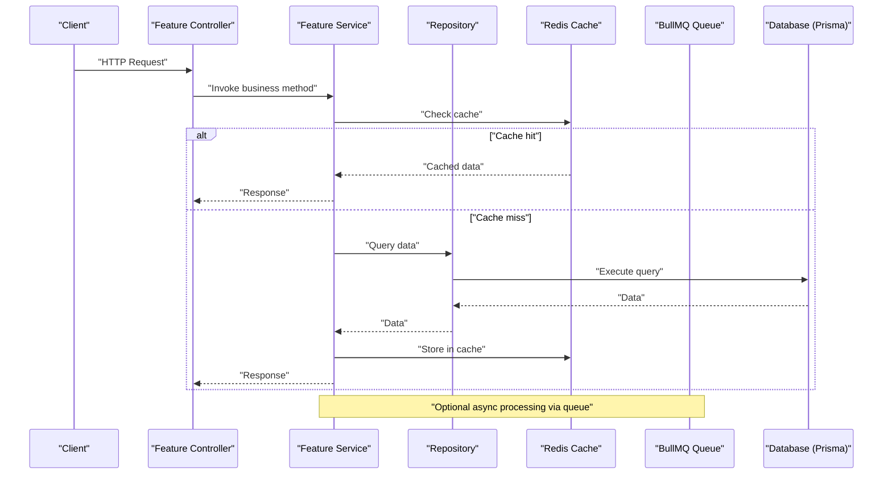
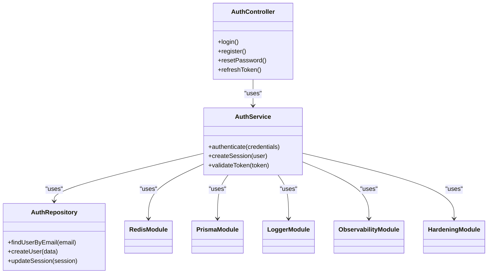
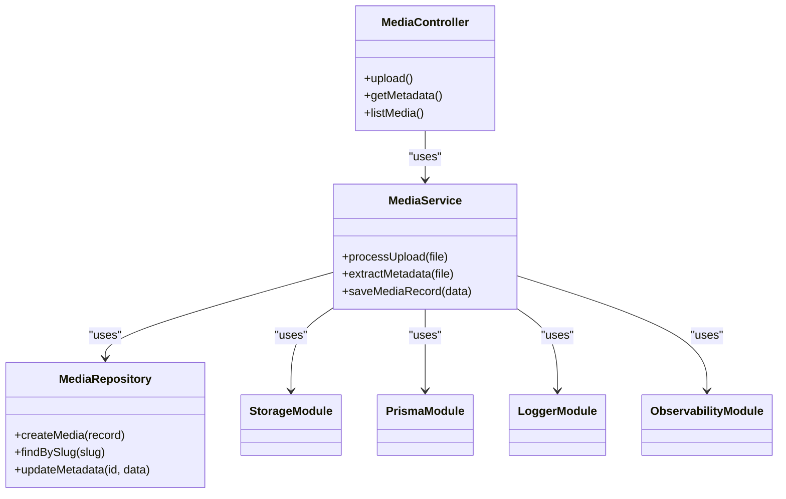
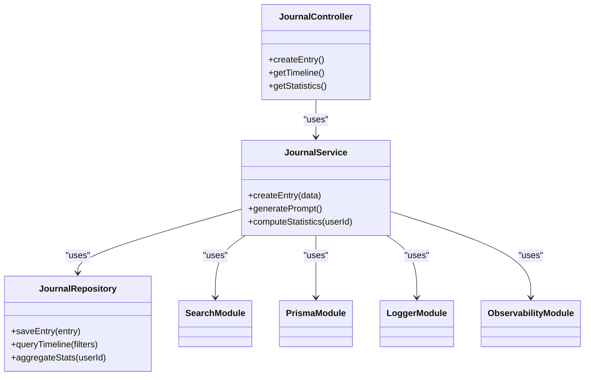
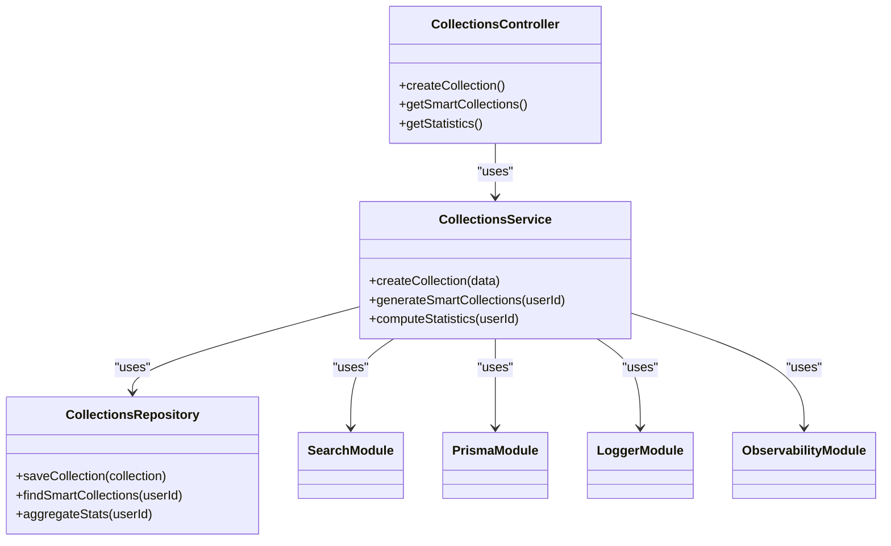
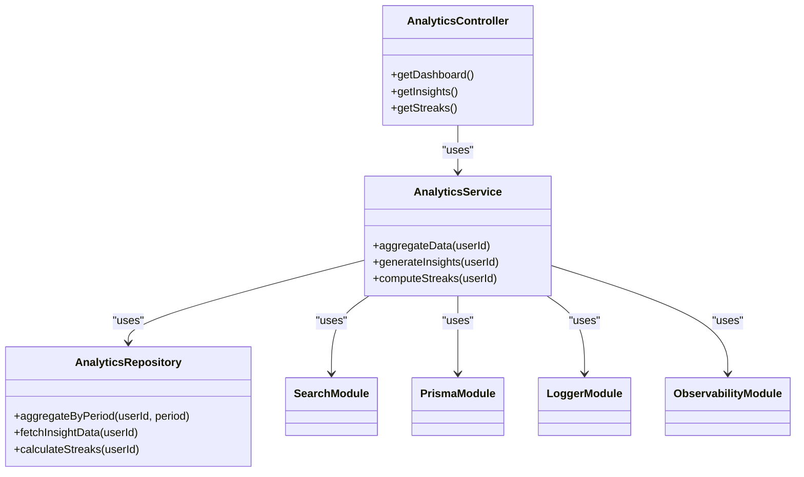

# Feature Modules Architecture

<cite>
**Referenced Files in This Document**
- [app.module.ts](file://apps/backend/src/app.module.ts)
- [auth.module.ts](file://apps/backend/src/auth/auth.module.ts)
- [media.module.ts](file://apps/backend/src/media/media.module.ts)
- [journal.module.ts](file://apps/backend/src/journal/journal.module.ts)
- [collections.module.ts](file://apps/backend/src/collections/collections.module.ts)
- [analytics.module.ts](file://apps/backend/src/analytics/analytics.module.ts)
- [auth.controller.ts](file://apps/backend/src/auth/auth.controller.ts)
- [media.controller.ts](file://apps/backend/src/media/media.controller.ts)
- [journal.controller.ts](file://apps/backend/src/journal/journal.controller.ts)
- [collections.controller.ts](file://apps/backend/src/collections/collections.controller.ts)
- [analytics.controller.ts](file://apps/backend/src/analytics/analytics.controller.ts)
- [auth.service.ts](file://apps/backend/src/auth/auth.service.ts)
- [media.service.ts](file://apps/backend/src/media/media.service.ts)
- [journal.service.ts](file://apps/backend/src/journal/journal.service.ts)
- [collections.service.ts](file://apps/backend/src/collections/collections.service.ts)
- [analytics.service.ts](file://apps/backend/src/analytics/analytics.service.ts)
- [auth.repository.ts](file://apps/backend/src/auth/auth.repository.ts)
- [media.repository.ts](file://apps/backend/src/media/media.repository.ts)
- [journal.repository.ts](file://apps/backend/src/journal/journal.repository.ts)
- [collections.repository.ts](file://apps/backend/src/collections/collections.repository.ts)
- [analytics.repository.ts](file://apps/backend/src/analytics/analytics.repository.ts)
- [core.module.ts](file://apps/backend/src/core/core.module.ts)
- [common.module.ts](file://apps/backend/src/common/common.module.ts)
- [prisma.module.ts](file://apps/backend/src/prisma/prisma.module.ts)
- [bullmq.module.ts](file://apps/backend/src/bullmq/bullmq.module.ts)
- [redis.module.ts](file://apps/backend/src/redis/redis.module.ts)
- [config.module.ts](file://apps/backend/src/config/config.module.ts)
- [logger.module.ts](file://apps/backend/src/logger/logger.module.ts)
- [observability.module.ts](file://apps/backend/src/observability/observability.module.ts)
- [hardening.module.ts](file://apps/backend/src/hardening/hardening.module.ts)
- [deployment.module.ts](file://apps/backend/src/deployment/deployment.module.ts)
- [health.module.ts](file://apps/backend/src/health/health.module.ts)
- [storage.module.ts](file://apps/backend/src/storage/storage.module.ts)
- [notifications.module.ts](file://apps/backend/src/notifications/notifications.module.ts)
- [search.module.ts](file://apps/backend/src/search/search.module.ts)
- [library.module.ts](file://apps/backend/src/library/library.module.ts)
- [progress.module.ts](file://apps/backend/src/progress/progress.module.ts)
- [interaction.module.ts](file://apps/backend/src/interaction/interaction.module.ts)
- [wrapped.module.ts](file://apps/backend/src/wrapped/wrapped.module.ts)
- [users.module.ts](file://apps/backend/src/users/users.module.ts)
- [shared.module.ts](file://apps/backend/src/shared/shared.module.ts)
</cite>

## Table of Contents
1. [Introduction](#introduction)
2. [Project Structure](#project-structure)
3. [Core Components](#core-components)
4. [Architecture Overview](#architecture-overview)
5. [Detailed Component Analysis](#detailed-component-analysis)
6. [Dependency Analysis](#dependency-analysis)
7. [Performance Considerations](#performance-considerations)
8. [Troubleshooting Guide](#troubleshooting-guide)
9. [Conclusion](#conclusion)

## Introduction
This document explains the feature modules architecture of the NestJS backend application. It focuses on modular design with clear separation of concerns across authentication, media management, journaling, collections, and analytics. Each feature module encapsulates its controllers, services, repositories, DTOs, and business logic. The documentation covers inter-module communication patterns, event-driven architecture, dependency injection usage, module lifecycle management, cross-cutting concerns handling, and API endpoint organization within each module.

## Project Structure
The backend is organized into feature modules under apps/backend/src, each containing:
- A module file that wires dependencies and exports public APIs
- Controllers that define HTTP endpoints
- Services that implement business logic
- Repositories that abstract data access
- DTOs for request/response validation
- Optional specialized services (e.g., statistics, events, smart features)

Cross-cutting capabilities are provided by shared modules such as core, common, prisma, bullmq, redis, config, logger, observability, hardening, deployment, health, storage, notifications, search, library, progress, interaction, wrapped, users, and shared.

```mermaid
graph TB
subgraph "Feature Modules"
Auth["Auth Module"]
Media["Media Module"]
Journal["Journal Module"]
Collections["Collections Module"]
Analytics["Analytics Module"]
end
subgraph "Shared & Cross-Cutting"
Core["Core Module"]
Common["Common Module"]
Prisma["Prisma Module"]
BullMQ["BullMQ Module"]
Redis["Redis Module"]
Config["Config Module"]
Logger["Logger Module"]
Observability["Observability Module"]
Hardening["Hardening Module"]
Deployment["Deployment Module"]
Health["Health Module"]
Storage["Storage Module"]
Notifications["Notifications Module"]
Search["Search Module"]
Library["Library Module"]
Progress["Progress Module"]
Interaction["Interaction Module"]
Wrapped["Wrapped Module"]
Users["Users Module"]
Shared["Shared Module"]
end
Auth --> Core
Auth --> Common
Auth --> Prisma
Auth --> Redis
Auth --> Config
Auth --> Logger
Auth --> Observability
Auth --> Hardening
Auth --> Deployment
Auth --> Health
Auth --> Storage
Auth --> Notifications
Auth --> Search
Auth --> Library
Auth --> Progress
Auth --> Interaction
Auth --> Wrapped
Auth --> Users
Auth --> Shared
Media --> Core
Media --> Common
Media --> Prisma
Media --> Redis
Media --> Config
Media --> Logger
Media --> Observability
Media --> Hardening
Media --> Deployment
Media --> Health
Media --> Storage
Media --> Notifications
Media --> Search
Media --> Library
Media --> Progress
Media --> Interaction
Media --> Wrapped
Media --> Users
Media --> Shared
Journal --> Core
Journal --> Common
Journal --> Prisma
Journal --> Redis
Journal --> Config
Journal --> Logger
Journal --> Observability
Journal --> Hardening
Journal --> Deployment
Journal --> Health
Journal --> Storage
Journal --> Notifications
Journal --> Search
Journal --> Library
Journal --> Progress
Journal --> Interaction
Journal --> Wrapped
Journal --> Users
Journal --> Shared
Collections --> Core
Collections --> Common
Collections --> Prisma
Collections --> Redis
Collections --> Config
Collections --> Logger
Collections --> Observability
Collections --> Hardening
Collections --> Deployment
Collections --> Health
Collections --> Storage
Collections --> Notifications
Collections --> Search
Collections --> Library
Collections --> Progress
Collections --> Interaction
Collections --> Wrapped
Collections --> Users
Collections --> Shared
Analytics --> Core
Analytics --> Common
Analytics --> Prisma
Analytics --> Redis
Analytics --> Config
Analytics --> Logger
Analytics --> Observability
Analytics --> Hardening
Analytics --> Deployment
Analytics --> Health
Analytics --> Storage
Analytics --> Notifications
Analytics --> Search
Analytics --> Library
Analytics --> Progress
Analytics --> Interaction
Analytics --> Wrapped
Analytics --> Users
Analytics --> Shared
```

**Diagram sources**
- [app.module.ts](file://apps/backend/src/app.module.ts)
- [auth.module.ts](file://apps/backend/src/auth/auth.module.ts)
- [media.module.ts](file://apps/backend/src/media/media.module.ts)
- [journal.module.ts](file://apps/backend/src/journal/journal.module.ts)
- [collections.module.ts](file://apps/backend/src/collections/collections.module.ts)
- [analytics.module.ts](file://apps/backend/src/analytics/analytics.module.ts)
- [core.module.ts](file://apps/backend/src/core/core.module.ts)
- [common.module.ts](file://apps/backend/src/common/common.module.ts)
- [prisma.module.ts](file://apps/backend/src/prisma/prisma.module.ts)
- [bullmq.module.ts](file://apps/backend/src/bullmq/bullmq.module.ts)
- [redis.module.ts](file://apps/backend/src/redis/redis.module.ts)
- [config.module.ts](file://apps/backend/src/config/config.module.ts)
- [logger.module.ts](file://apps/backend/src/logger/logger.module.ts)
- [observability.module.ts](file://apps/backend/src/observability/observability.module.ts)
- [hardening.module.ts](file://apps/backend/src/hardening/hardening.module.ts)
- [deployment.module.ts](file://apps/backend/src/deployment/deployment.module.ts)
- [health.module.ts](file://apps/backend/src/health/health.module.ts)
- [storage.module.ts](file://apps/backend/src/storage/storage.module.ts)
- [notifications.module.ts](file://apps/backend/src/notifications/notifications.module.ts)
- [search.module.ts](file://apps/backend/src/search/search.module.ts)
- [library.module.ts](file://apps/backend/src/library/library.module.ts)
- [progress.module.ts](file://apps/backend/src/progress/progress.module.ts)
- [interaction.module.ts](file://apps/backend/src/interaction/interaction.module.ts)
- [wrapped.module.ts](file://apps/backend/src/wrapped/wrapped.module.ts)
- [users.module.ts](file://apps/backend/src/users/users.module.ts)
- [shared.module.ts](file://apps/backend/src/shared/shared.module.ts)

**Section sources**
- [app.module.ts](file://apps/backend/src/app.module.ts)

## Core Components
Each feature module follows a consistent structure:
- Controller: defines HTTP endpoints and routes
- Service: implements business logic and orchestrates operations
- Repository: abstracts persistence and queries
- DTOs: validate and serialize input/output payloads
- Specialized services: e.g., statistics, events, smart features

Key cross-cutting modules provide:
- Core domain abstractions, events, caching, hashing, UUID generation, transactions, storage interfaces
- Common utilities like pagination, pipes, interceptors, filters, result types, retry mechanisms
- Infrastructure integrations via Prisma, BullMQ queues, Redis cache, configuration, logging, observability, hardening, deployment, health checks, storage providers, notifications, search, library, progress tracking, interactions, user management, and shared utilities

**Section sources**
- [auth.controller.ts](file://apps/backend/src/auth/auth.controller.ts)
- [auth.service.ts](file://apps/backend/src/auth/auth.service.ts)
- [auth.repository.ts](file://apps/backend/src/auth/auth.repository.ts)
- [media.controller.ts](file://apps/backend/src/media/media.controller.ts)
- [media.service.ts](file://apps/backend/src/media/media.service.ts)
- [media.repository.ts](file://apps/backend/src/media/media.repository.ts)
- [journal.controller.ts](file://apps/backend/src/journal/journal.controller.ts)
- [journal.service.ts](file://apps/backend/src/journal/journal.service.ts)
- [journal.repository.ts](file://apps/backend/src/journal/journal.repository.ts)
- [collections.controller.ts](file://apps/backend/src/collections/collections.controller.ts)
- [collections.service.ts](file://apps/backend/src/collections/collections.service.ts)
- [collections.repository.ts](file://apps/backend/src/collections/collections.repository.ts)
- [analytics.controller.ts](file://apps/backend/src/analytics/analytics.controller.ts)
- [analytics.service.ts](file://apps/backend/src/analytics/analytics.service.ts)
- [analytics.repository.ts](file://apps/backend/src/analytics/analytics.repository.ts)
- [core.module.ts](file://apps/backend/src/core/core.module.ts)
- [common.module.ts](file://apps/backend/src/common/common.module.ts)
- [prisma.module.ts](file://apps/backend/src/prisma/prisma.module.ts)
- [bullmq.module.ts](file://apps/backend/src/bullmq/bullmq.module.ts)
- [redis.module.ts](file://apps/backend/src/redis/redis.module.ts)
- [config.module.ts](file://apps/backend/src/config/config.module.ts)
- [logger.module.ts](file://apps/backend/src/logger/logger.module.ts)
- [observability.module.ts](file://apps/backend/src/observability/observability.module.ts)
- [hardening.module.ts](file://apps/backend/src/hardening/hardening.module.ts)
- [deployment.module.ts](file://apps/backend/src/deployment/deployment.module.ts)
- [health.module.ts](file://apps/backend/src/health/health.module.ts)
- [storage.module.ts](file://apps/backend/src/storage/storage.module.ts)
- [notifications.module.ts](file://apps/backend/src/notifications/notifications.module.ts)
- [search.module.ts](file://apps/backend/src/search/search.module.ts)
- [library.module.ts](file://apps/backend/src/library/library.module.ts)
- [progress.module.ts](file://apps/backend/src/progress/progress.module.ts)
- [interaction.module.ts](file://apps/backend/src/interaction/interaction.module.ts)
- [wrapped.module.ts](file://apps/backend/src/wrapped/wrapped.module.ts)
- [users.module.ts](file://apps/backend/src/users/users.module.ts)
- [shared.module.ts](file://apps/backend/src/shared/shared.module.ts)

## Architecture Overview
The application uses NestJS dependency injection to wire feature modules together. Controllers receive requests, delegate to services, which use repositories for data access. Cross-cutting concerns are handled by shared modules injected at the module level. Event-driven patterns enable asynchronous processing through BullMQ queues and Redis-backed caches. Configuration is centralized and validated. Logging, metrics, tracing, and performance auditing are available across modules.

**Diagram sources**
- [auth.controller.ts](file://apps/backend/src/auth/auth.controller.ts)
- [auth.service.ts](file://apps/backend/src/auth/auth.service.ts)
- [auth.repository.ts](file://apps/backend/src/auth/auth.repository.ts)
- [media.controller.ts](file://apps/backend/src/media/media.controller.ts)
- [media.service.ts](file://apps/backend/src/media/media.service.ts)
- [media.repository.ts](file://apps/backend/src/media/media.repository.ts)
- [journal.controller.ts](file://apps/backend/src/journal/journal.controller.ts)
- [journal.service.ts](file://apps/backend/src/journal/journal.service.ts)
- [journal.repository.ts](file://apps/backend/src/journal/journal.repository.ts)
- [collections.controller.ts](file://apps/backend/src/collections/collections.controller.ts)
- [collections.service.ts](file://apps/backend/src/collections/collections.service.ts)
- [collections.repository.ts](file://apps/backend/src/collections/collections.repository.ts)
- [analytics.controller.ts](file://apps/backend/src/analytics/analytics.controller.ts)
- [analytics.service.ts](file://apps/backend/src/analytics/analytics.service.ts)
- [analytics.repository.ts](file://apps/backend/src/analytics/analytics.repository.ts)
- [redis.module.ts](file://apps/backend/src/redis/redis.module.ts)
- [bullmq.module.ts](file://apps/backend/src/bullmq/bullmq.module.ts)
- [prisma.module.ts](file://apps/backend/src/prisma/prisma.module.ts)

## Detailed Component Analysis

### Authentication Module
Encapsulates identity and access control:
- Controllers handle login, registration, password reset, token refresh, and session management
- Services orchestrate authentication flows, token issuance, and permission checks
- Repositories manage user accounts, sessions, and tokens
- DTOs validate credentials and responses
- Guards and strategies enforce authorization policies

Interactions:
- Uses Redis for session/token storage
- Integrates with Prisma for persistent user data
- Leverages logging, observability, and hardening modules for security and monitoring

API endpoints:
- Authentication endpoints exposed via auth controller
- Protected routes enforced by guards and decorators

**Diagram sources**
- [auth.controller.ts](file://apps/backend/src/auth/auth.controller.ts)
- [auth.service.ts](file://apps/backend/src/auth/auth.service.ts)
- [auth.repository.ts](file://apps/backend/src/auth/auth.repository.ts)
- [redis.module.ts](file://apps/backend/src/redis/redis.module.ts)
- [prisma.module.ts](file://apps/backend/src/prisma/prisma.module.ts)
- [logger.module.ts](file://apps/backend/src/logger/logger.module.ts)
- [observability.module.ts](file://apps/backend/src/observability/observability.module.ts)
- [hardening.module.ts](file://apps/backend/src/hardening/hardening.module.ts)

**Section sources**
- [auth.controller.ts](file://apps/backend/src/auth/auth.controller.ts)
- [auth.service.ts](file://apps/backend/src/auth/auth.service.ts)
- [auth.repository.ts](file://apps/backend/src/auth/auth.repository.ts)
- [auth.module.ts](file://apps/backend/src/auth/auth.module.ts)

### Media Management Module
Handles media ingestion, metadata extraction, and asset management:
- Controllers expose endpoints for upload, retrieval, and metadata operations
- Services coordinate uploads, process metadata, and manage relationships
- Repositories persist media records and associations
- DTOs validate upload payloads and metadata schemas
- Integrates with storage providers for file handling

Interactions:
- Uses Prisma for database operations
- Leverages storage module for file operations
- Utilizes logging and observability for performance insights

API endpoints:
- Media CRUD and metadata endpoints via media controller

**Diagram sources**
- [media.controller.ts](file://apps/backend/src/media/media.controller.ts)
- [media.service.ts](file://apps/backend/src/media/media.service.ts)
- [media.repository.ts](file://apps/backend/src/media/media.repository.ts)
- [storage.module.ts](file://apps/backend/src/storage/storage.module.ts)
- [prisma.module.ts](file://apps/backend/src/prisma/prisma.module.ts)
- [logger.module.ts](file://apps/backend/src/logger/logger.module.ts)
- [observability.module.ts](file://apps/backend/src/observability/observability.module.ts)

**Section sources**
- [media.controller.ts](file://apps/backend/src/media/media.controller.ts)
- [media.service.ts](file://apps/backend/src/media/media.service.ts)
- [media.repository.ts](file://apps/backend/src/media/media.repository.ts)
- [media.module.ts](file://apps/backend/src/media/media.module.ts)

### Journaling Module
Provides journal entry creation, timeline management, and insights:
- Controllers expose endpoints for journal entries and timeline queries
- Services implement journaling logic, prompt generation, and statistics
- Repositories persist journal entries and related data
- DTOs validate journal payloads and response formats
- Integrates with storage and search modules for content indexing

Interactions:
- Uses Prisma for persistence
- Leverages search module for querying journal content
- Utilizes logging and observability for performance tracking

API endpoints:
- Journal CRUD and timeline endpoints via journal controller

**Diagram sources**
- [journal.controller.ts](file://apps/backend/src/journal/journal.controller.ts)
- [journal.service.ts](file://apps/backend/src/journal/journal.service.ts)
- [journal.repository.ts](file://apps/backend/src/journal/journal.repository.ts)
- [search.module.ts](file://apps/backend/src/search/search.module.ts)
- [prisma.module.ts](file://apps/backend/src/prisma/prisma.module.ts)
- [logger.module.ts](file://apps/backend/src/logger/logger.module.ts)
- [observability.module.ts](file://apps/backend/src/observability/observability.module.ts)

**Section sources**
- [journal.controller.ts](file://apps/backend/src/journal/journal.controller.ts)
- [journal.service.ts](file://apps/backend/src/journal/journal.service.ts)
- [journal.repository.ts](file://apps/backend/src/journal/journal.repository.ts)
- [journal.module.ts](file://apps/backend/src/journal/journal.module.ts)

### Collections Module
Manages collection creation, smart grouping, and statistics:
- Controllers expose endpoints for collection CRUD and smart features
- Services implement collection logic, smart grouping algorithms, and analytics
- Repositories persist collections and relationships
- DTOs validate collection payloads and response structures
- Integrates with search and storage modules for enhanced functionality

Interactions:
- Uses Prisma for persistence
- Leverages search module for collection discovery
- Utilizes logging and observability for performance insights

API endpoints:
- Collection CRUD and smart collection endpoints via collections controller

**Diagram sources**
- [collections.controller.ts](file://apps/backend/src/collections/collections.controller.ts)
- [collections.service.ts](file://apps/backend/src/collections/collections.service.ts)
- [collections.repository.ts](file://apps/backend/src/collections/collections.repository.ts)
- [search.module.ts](file://apps/backend/src/search/search.module.ts)
- [prisma.module.ts](file://apps/backend/src/prisma/prisma.module.ts)
- [logger.module.ts](file://apps/backend/src/logger/logger.module.ts)
- [observability.module.ts](file://apps/backend/src/observability/observability.module.ts)

**Section sources**
- [collections.controller.ts](file://apps/backend/src/collections/collections.controller.ts)
- [collections.service.ts](file://apps/backend/src/collections/collections.service.ts)
- [collections.repository.ts](file://apps/backend/src/collections/collections.repository.ts)
- [collections.module.ts](file://apps/backend/src/collections/collections.module.ts)

### Analytics Module
Provides analytics aggregation, dashboard insights, and streak tracking:
- Controllers expose endpoints for analytics queries and dashboard data
- Services implement aggregation algorithms, insight generation, and streak computation
- Repositories persist analytics data and perform complex queries
- DTOs validate analytics payloads and response formats
- Integrates with search and storage modules for data enrichment

Interactions:
- Uses Prisma for analytics data persistence
- Leverages search module for analytical queries
- Utilizes logging and observability for performance monitoring

API endpoints:
- Analytics and dashboard endpoints via analytics controller

**Diagram sources**
- [analytics.controller.ts](file://apps/backend/src/analytics/analytics.controller.ts)
- [analytics.service.ts](file://apps/backend/src/analytics/analytics.service.ts)
- [analytics.repository.ts](file://apps/backend/src/analytics/analytics.repository.ts)
- [search.module.ts](file://apps/backend/src/search/search.module.ts)
- [prisma.module.ts](file://apps/backend/src/prisma/prisma.module.ts)
- [logger.module.ts](file://apps/backend/src/logger/logger.module.ts)
- [observability.module.ts](file://apps/backend/src/observability/observability.module.ts)

**Section sources**
- [analytics.controller.ts](file://apps/backend/src/analytics/analytics.controller.ts)
- [analytics.service.ts](file://apps/backend/src/analytics/analytics.service.ts)
- [analytics.repository.ts](file://apps/backend/src/analytics/analytics.repository.ts)
- [analytics.module.ts](file://apps/backend/src/analytics/analytics.module.ts)

## Dependency Analysis
Feature modules depend on shared infrastructure modules for cross-cutting concerns. The dependency graph shows how each feature module integrates with core services, databases, caching, queues, and observability tools.

```mermaid
graph TB
Auth["Auth Module"] --> Core["Core Module"]
Auth --> Common["Common Module"]
Auth --> Prisma["Prisma Module"]
Auth --> Redis["Redis Module"]
Auth --> BullMQ["BullMQ Module"]
Auth --> Config["Config Module"]
Auth --> Logger["Logger Module"]
Auth --> Observability["Observability Module"]
Auth --> Hardening["Hardening Module"]
Auth --> Deployment["Deployment Module"]
Auth --> Health["Health Module"]
Auth --> Storage["Storage Module"]
Auth --> Notifications["Notifications Module"]
Auth --> Search["Search Module"]
Auth --> Library["Library Module"]
Auth --> Progress["Progress Module"]
Auth --> Interaction["Interaction Module"]
Auth --> Wrapped["Wrapped Module"]
Auth --> Users["Users Module"]
Auth --> Shared["Shared Module"]
Media["Media Module"] --> Core
Media --> Common
Media --> Prisma
Media --> Redis
Media --> BullMQ
Media --> Config
Media --> Logger
Media --> Observability
Media --> Hardening
Media --> Deployment
Media --> Health
Media --> Storage
Media --> Notifications
Media --> Search
Media --> Library
Media --> Progress
Media --> Interaction
Media --> Wrapped
Media --> Users
Media --> Shared
Journal["Journal Module"] --> Core
Journal --> Common
Journal --> Prisma
Journal --> Redis
Journal --> BullMQ
Journal --> Config
Journal --> Logger
Journal --> Observability
Journal --> Hardening
Journal --> Deployment
Journal --> Health
Journal --> Storage
Journal --> Notifications
Journal --> Search
Journal --> Library
Journal --> Progress
Journal --> Interaction
Journal --> Wrapped
Journal --> Users
Journal --> Shared
Collections["Collections Module"] --> Core
Collections --> Common
Collections --> Prisma
Collections --> Redis
Collections --> BullMQ
Collections --> Config
Collections --> Logger
Collections --> Observability
Collections --> Hardening
Collections --> Deployment
Collections --> Health
Collections --> Storage
Collections --> Notifications
Collections --> Search
Collections --> Library
Collections --> Progress
Collections --> Interaction
Collections --> Wrapped
Collections --> Users
Collections --> Shared
Analytics["Analytics Module"] --> Core
Analytics --> Common
Analytics --> Prisma
Analytics --> Redis
Analytics --> BullMQ
Analytics --> Config
Analytics --> Logger
Analytics --> Observability
Analytics --> Hardening
Analytics --> Deployment
Analytics --> Health
Analytics --> Storage
Analytics --> Notifications
Analytics --> Search
Analytics --> Library
Analytics --> Progress
Analytics --> Interaction
Analytics --> Wrapped
Analytics --> Users
Analytics --> Shared
```

**Diagram sources**
- [auth.module.ts](file://apps/backend/src/auth/auth.module.ts)
- [media.module.ts](file://apps/backend/src/media/media.module.ts)
- [journal.module.ts](file://apps/backend/src/journal/journal.module.ts)
- [collections.module.ts](file://apps/backend/src/collections/collections.module.ts)
- [analytics.module.ts](file://apps/backend/src/analytics/analytics.module.ts)
- [core.module.ts](file://apps/backend/src/core/core.module.ts)
- [common.module.ts](file://apps/backend/src/common/common.module.ts)
- [prisma.module.ts](file://apps/backend/src/prisma/prisma.module.ts)
- [bullmq.module.ts](file://apps/backend/src/bullmq/bullmq.module.ts)
- [redis.module.ts](file://apps/backend/src/redis/redis.module.ts)
- [config.module.ts](file://apps/backend/src/config/config.module.ts)
- [logger.module.ts](file://apps/backend/src/logger/logger.module.ts)
- [observability.module.ts](file://apps/backend/src/observability/observability.module.ts)
- [hardening.module.ts](file://apps/backend/src/hardening/hardening.module.ts)
- [deployment.module.ts](file://apps/backend/src/deployment/deployment.module.ts)
- [health.module.ts](file://apps/backend/src/health/health.module.ts)
- [storage.module.ts](file://apps/backend/src/storage/storage.module.ts)
- [notifications.module.ts](file://apps/backend/src/notifications/notifications.module.ts)
- [search.module.ts](file://apps/backend/src/search/search.module.ts)
- [library.module.ts](file://apps/backend/src/library/library.module.ts)
- [progress.module.ts](file://apps/backend/src/progress/progress.module.ts)
- [interaction.module.ts](file://apps/backend/src/interaction/interaction.module.ts)
- [wrapped.module.ts](file://apps/backend/src/wrapped/wrapped.module.ts)
- [users.module.ts](file://apps/backend/src/users/users.module.ts)
- [shared.module.ts](file://apps/backend/src/shared/shared.module.ts)

**Section sources**
- [app.module.ts](file://apps/backend/src/app.module.ts)

## Performance Considerations
- Caching: Use Redis strategically to reduce database load and improve response times
- Database optimization: Leverage Prisma query optimization and proper indexing
- Asynchronous processing: Offload heavy tasks to BullMQ queues for better throughput
- Monitoring: Utilize observability modules for performance metrics and tracing
- Rate limiting: Apply hardening modules to prevent abuse and ensure stability
- Connection pooling: Configure database and cache connections appropriately

[No sources needed since this section provides general guidance]

## Troubleshooting Guide
- Authentication issues: Check guard configurations, token validation, and session storage
- Media upload failures: Verify storage provider configuration and file permissions
- Journaling errors: Validate DTO schemas and check search index synchronization
- Collection problems: Review smart collection algorithms and data consistency
- Analytics discrepancies: Ensure proper data aggregation and time zone handling
- Performance bottlenecks: Monitor logs, metrics, and traces to identify slow queries or external calls

**Section sources**
- [auth.controller.ts](file://apps/backend/src/auth/auth.controller.ts)
- [media.controller.ts](file://apps/backend/src/media/media.controller.ts)
- [journal.controller.ts](file://apps/backend/src/journal/journal.controller.ts)
- [collections.controller.ts](file://apps/backend/src/collections/collections.controller.ts)
- [analytics.controller.ts](file://apps/backend/src/analytics/analytics.controller.ts)
- [logger.module.ts](file://apps/backend/src/logger/logger.module.ts)
- [observability.module.ts](file://apps/backend/src/observability/observability.module.ts)

## Conclusion
The NestJS application demonstrates a well-structured feature modules architecture with clear separation of concerns. Each module encapsulates its controllers, services, repositories, and DTOs while leveraging shared infrastructure for cross-cutting concerns. The dependency injection pattern enables loose coupling and testability. Event-driven architecture and caching strategies enhance performance and scalability. Proper API endpoint organization ensures maintainable and discoverable interfaces for clients.

[No sources needed since this section summarizes without analyzing specific files]