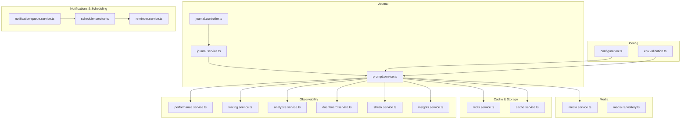
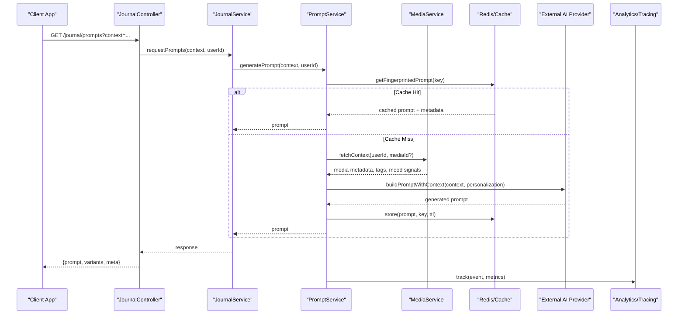
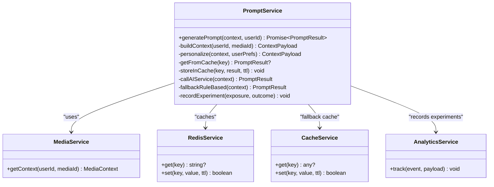
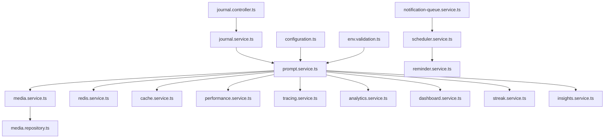

# AI-Powered Prompt Generation

<cite>
**Referenced Files in This Document**
- [prompt.service.ts](file://apps/backend/src/journal/prompt.service.ts)
- [journal.controller.ts](file://apps/backend/src/journal/journal.controller.ts)
- [journal.service.ts](file://apps/backend/src/journal/journal.service.ts)
- [journal.module.ts](file://apps/backend/src/journal/journal.module.ts)
- [media.service.ts](file://apps/backend/src/media/media.service.ts)
- [media.repository.ts](file://apps/backend/src/media/media.repository.ts)
- [redis.service.ts](file://apps/backend/src/redis/redis.service.ts)
- [cache.service.ts](file://apps/backend/src/hardening/cache.service.ts)
- [performance.service.ts](file://apps/backend/src/observability/performance.service.ts)
- [tracing.service.ts](file://apps/backend/src/observability/tracing.service.ts)
- [analytics.service.ts](file://apps/backend/src/analytics/analytics.service.ts)
- [dashboard.service.ts](file://apps/backend/src/analytics/dashboard.service.ts)
- [streak.service.ts](file://apps/backend/src/analytics/streak.service.ts)
- [insights.service.ts](file://apps/backend/src/analytics/insights.service.ts)
- [search-suggestion.service.ts](file://apps/backend/src/search/search-suggestion.service.ts)
- [notification-queue.service.ts](file://apps/backend/src/notifications/notification-queue.service.ts)
- [scheduler.service.ts](file://apps/backend/src/notifications/scheduler.service.ts)
- [reminder.service.ts](file://apps/backend/src/notifications/reminder.service.ts)
- [configuration.ts](file://apps/backend/src/config/configuration.ts)
- [env.validation.ts](file://apps/backend/src/config/env.validation.ts)
- [app.module.ts](file://apps/backend/src/app.module.ts)
- [main.ts](file://apps/backend/src/main.ts)
</cite>

## Table of Contents
1. [Introduction](#introduction)
2. [Project Structure](#project-structure)
3. [Core Components](#core-components)
4. [Architecture Overview](#architecture-overview)
5. [Detailed Component Analysis](#detailed-component-analysis)
6. [Dependency Analysis](#dependency-analysis)
7. [Performance Considerations](#performance-considerations)
8. [Troubleshooting Guide](#troubleshooting-guide)
9. [Conclusion](#conclusion)
10. [Appendices](#appendices)

## Introduction
This document explains the AI-Powered Prompt Generation system that provides contextual writing suggestions for journal entries. It covers prompt generation algorithms, context analysis, personalization based on user history and preferences, media-aware prompts, emotional state modeling, time-based triggers, integration with external AI services, caching strategies, fallback mechanisms, customization examples, A/B testing configurations, and performance optimization techniques.

## Project Structure
The prompt generation feature is implemented as a backend service within the NestJS application. Key modules include:
- Journal module exposing endpoints and orchestration logic
- Media service providing metadata and context
- Redis and cache layers for fast retrieval and fallbacks
- Observability and analytics for performance tracking and experimentation
- Notifications and scheduling for time-based triggers

**Diagram sources**
- [journal.controller.ts](file://apps/backend/src/journal/journal.controller.ts)
- [journal.service.ts](file://apps/backend/src/journal/journal.service.ts)
- [prompt.service.ts](file://apps/backend/src/journal/prompt.service.ts)
- [media.service.ts](file://apps/backend/src/media/media.service.ts)
- [media.repository.ts](file://apps/backend/src/media/media.repository.ts)
- [redis.service.ts](file://apps/backend/src/redis/redis.service.ts)
- [cache.service.ts](file://apps/backend/src/hardening/cache.service.ts)
- [performance.service.ts](file://apps/backend/src/observability/performance.service.ts)
- [tracing.service.ts](file://apps/backend/src/observability/tracing.service.ts)
- [analytics.service.ts](file://apps/backend/src/analytics/analytics.service.ts)
- [dashboard.service.ts](file://apps/backend/src/analytics/dashboard.service.ts)
- [streak.service.ts](file://apps/backend/src/analytics/streak.service.ts)
- [insights.service.ts](file://apps/backend/src/analytics/insights.service.ts)
- [notification-queue.service.ts](file://apps/backend/src/notifications/notification-queue.service.ts)
- [scheduler.service.ts](file://apps/backend/src/notifications/scheduler.service.ts)
- [reminder.service.ts](file://apps/backend/src/notifications/reminder.service.ts)
- [configuration.ts](file://apps/backend/src/config/configuration.ts)
- [env.validation.ts](file://apps/backend/src/config/env.validation.ts)

**Section sources**
- [journal.controller.ts](file://apps/backend/src/journal/journal.controller.ts)
- [journal.service.ts](file://apps/backend/src/journal/journal.service.ts)
- [prompt.service.ts](file://apps/backend/src/journal/prompt.service.ts)
- [media.service.ts](file://apps/backend/src/media/media.service.ts)
- [media.repository.ts](file://apps/backend/src/media/media.repository.ts)
- [redis.service.ts](file://apps/backend/src/redis/redis.service.ts)
- [cache.service.ts](file://apps/backend/src/hardening/cache.service.ts)
- [performance.service.ts](file://apps/backend/src/observability/performance.service.ts)
- [tracing.service.ts](file://apps/backend/src/observability/tracing.service.ts)
- [analytics.service.ts](file://apps/backend/src/analytics/analytics.service.ts)
- [dashboard.service.ts](file://apps/backend/src/analytics/dashboard.service.ts)
- [streak.service.ts](file://apps/backend/src/analytics/streak.service.ts)
- [insights.service.ts](file://apps/backend/src/analytics/insights.service.ts)
- [notification-queue.service.ts](file://apps/backend/src/notifications/notification-queue.service.ts)
- [scheduler.service.ts](file://apps/backend/src/notifications/scheduler.service.ts)
- [reminder.service.ts](file://apps/backend/src/notifications/reminder.service.ts)
- [configuration.ts](file://apps/backend/src/config/configuration.ts)
- [env.validation.ts](file://apps/backend/src/config/env.validation.ts)

## Core Components
- Prompt Service: Orchestrates context gathering, personalization, and prompt generation. Integrates with media context, user insights, and external AI providers. Implements caching and fallback strategies.
- Journal Controller and Service: Expose endpoints to request prompts and manage journal entry interactions.
- Media Service and Repository: Provide media metadata (type, tags, mood signals) used to tailor prompts.
- Cache and Redis: Store generated prompts and context fingerprints for low-latency retrieval.
- Observability: Track latency, errors, and experiment metrics; support A/B testing via analytics and dashboard.
- Notifications and Scheduler: Trigger time-based prompts and reminders.

**Section sources**
- [prompt.service.ts](file://apps/backend/src/journal/prompt.service.ts)
- [journal.controller.ts](file://apps/backend/src/journal/journal.controller.ts)
- [journal.service.ts](file://apps/backend/src/journal/journal.service.ts)
- [media.service.ts](file://apps/backend/src/media/media.service.ts)
- [media.repository.ts](file://apps/backend/src/media/media.repository.ts)
- [redis.service.ts](file://apps/backend/src/redis/redis.service.ts)
- [cache.service.ts](file://apps/backend/src/hardening/cache.service.ts)
- [performance.service.ts](file://apps/backend/src/observability/performance.service.ts)
- [tracing.service.ts](file://apps/backend/src/observability/tracing.service.ts)
- [analytics.service.ts](file://apps/backend/src/analytics/analytics.service.ts)
- [dashboard.service.ts](file://apps/backend/src/analytics/dashboard.service.ts)
- [streak.service.ts](file://apps/backend/src/analytics/streak.service.ts)
- [insights.service.ts](file://apps/backend/src/analytics/insights.service.ts)
- [notification-queue.service.ts](file://apps/backend/src/notifications/notification-queue.service.ts)
- [scheduler.service.ts](file://apps/backend/src/notifications/scheduler.service.ts)
- [reminder.service.ts](file://apps/backend/src/notifications/reminder.service.ts)

## Architecture Overview
The prompt generation pipeline integrates multiple data sources and services to produce personalized, context-aware prompts.

**Diagram sources**
- [journal.controller.ts](file://apps/backend/src/journal/journal.controller.ts)
- [journal.service.ts](file://apps/backend/src/journal/journal.service.ts)
- [prompt.service.ts](file://apps/backend/src/journal/prompt.service.ts)
- [media.service.ts](file://apps/backend/src/media/media.service.ts)
- [redis.service.ts](file://apps/backend/src/redis/redis.service.ts)
- [cache.service.ts](file://apps/backend/src/hardening/cache.service.ts)
- [analytics.service.ts](file://apps/backend/src/analytics/analytics.service.ts)
- [tracing.service.ts](file://apps/backend/src/observability/tracing.service.ts)

## Detailed Component Analysis

### Prompt Service
Responsibilities:
- Context assembly from media, user insights, streaks, and dashboards
- Personalization using user preferences and historical patterns
- Prompt generation via external AI provider with structured prompts
- Caching by fingerprinted keys and TTL management
- Fallback to rule-based or template prompts when AI fails
- Experimentation hooks for A/B testing variants

Key behaviors:
- Builds a context payload including media type, tags, mood signals, recent activity, and time-of-day
- Selects variant sets for A/B testing and records exposure and outcomes
- Stores results in Redis with keys derived from normalized inputs
- Emits analytics events for performance and conversion tracking

**Diagram sources**
- [prompt.service.ts](file://apps/backend/src/journal/prompt.service.ts)
- [media.service.ts](file://apps/backend/src/media/media.service.ts)
- [redis.service.ts](file://apps/backend/src/redis/redis.service.ts)
- [cache.service.ts](file://apps/backend/src/hardening/cache.service.ts)
- [analytics.service.ts](file://apps/backend/src/analytics/analytics.service.ts)

**Section sources**
- [prompt.service.ts](file://apps/backend/src/journal/prompt.service.ts)

### Journal Controller and Service
Responsibilities:
- Expose REST endpoints for prompt requests
- Validate inputs and route to service layer
- Return standardized responses with prompt variants and metadata

Behavior highlights:
- Accepts query parameters for context (e.g., mediaId, category, emotion)
- Delegates to JournalService which orchestrates PromptService calls
- Returns prompt objects with optional A/B variant identifiers

**Section sources**
- [journal.controller.ts](file://apps/backend/src/journal/journal.controller.ts)
- [journal.service.ts](file://apps/backend/src/journal/journal.service.ts)

### Media Context Integration
Responsibilities:
- Provide media metadata (type, genre, tags, mood signals)
- Support different media types (video, audio, image) to tailor prompts

Integration points:
- PromptService queries MediaService for context
- MediaRepository supplies raw data; MediaService normalizes into context payloads

**Section sources**
- [media.service.ts](file://apps/backend/src/media/media.service.ts)
- [media.repository.ts](file://apps/backend/src/media/media.repository.ts)

### Caching Strategy
Responsibilities:
- Use Redis for primary cache with TTL
- Fallback to in-memory cache if Redis unavailable
- Derive deterministic keys from normalized inputs (user, media, time window, filters)

Operational details:
- Cache hit returns prompt immediately
- Cache miss triggers generation and stores result
- TTL configured per environment and prompt complexity

**Section sources**
- [redis.service.ts](file://apps/backend/src/redis/redis.service.ts)
- [cache.service.ts](file://apps/backend/src/hardening/cache.service.ts)

### Time-Based Triggers and Reminders
Responsibilities:
- Schedule periodic checks to generate and push prompts
- Send reminders based on user activity patterns and streaks

Workflow:
- Scheduler triggers reminder jobs
- ReminderService evaluates conditions and enqueues notifications
- NotificationQueue delivers prompts to clients

**Section sources**
- [scheduler.service.ts](file://apps/backend/src/notifications/scheduler.service.ts)
- [reminder.service.ts](file://apps/backend/src/notifications/reminder.service.ts)
- [notification-queue.service.ts](file://apps/backend/src/notifications/notification-queue.service.ts)

### Observability and Experimentation
Responsibilities:
- Track latency, error rates, and prompt usage
- Record A/B experiment exposures and outcomes
- Provide dashboard metrics and insights

Key integrations:
- PerformanceService measures endpoint latency
- TracingService adds spans for AI calls and cache operations
- AnalyticsService logs events for experiments and conversions
- DashboardService aggregates metrics for UI display
- StreakService and InsightsService enrich personalization signals

**Section sources**
- [performance.service.ts](file://apps/backend/src/observability/performance.service.ts)
- [tracing.service.ts](file://apps/backend/src/observability/tracing.service.ts)
- [analytics.service.ts](file://apps/backend/src/analytics/analytics.service.ts)
- [dashboard.service.ts](file://apps/backend/src/analytics/dashboard.service.ts)
- [streak.service.ts](file://apps/backend/src/analytics/streak.service.ts)
- [insights.service.ts](file://apps/backend/src/analytics/insights.service.ts)

### Configuration and Environment
Responsibilities:
- Manage AI provider credentials and endpoints
- Configure cache TTLs, retry policies, and feature flags
- Validate environment variables at startup

**Section sources**
- [configuration.ts](file://apps/backend/src/config/configuration.ts)
- [env.validation.ts](file://apps/backend/src/config/env.validation.ts)

## Dependency Analysis
The prompt generation system depends on several modules and services. The following diagram shows core dependencies and their relationships.

**Diagram sources**
- [prompt.service.ts](file://apps/backend/src/journal/prompt.service.ts)
- [journal.service.ts](file://apps/backend/src/journal/journal.service.ts)
- [journal.controller.ts](file://apps/backend/src/journal/journal.controller.ts)
- [media.service.ts](file://apps/backend/src/media/media.service.ts)
- [media.repository.ts](file://apps/backend/src/media/media.repository.ts)
- [redis.service.ts](file://apps/backend/src/redis/redis.service.ts)
- [cache.service.ts](file://apps/backend/src/hardening/cache.service.ts)
- [performance.service.ts](file://apps/backend/src/observability/performance.service.ts)
- [tracing.service.ts](file://apps/backend/src/observability/tracing.service.ts)
- [analytics.service.ts](file://apps/backend/src/analytics/analytics.service.ts)
- [dashboard.service.ts](file://apps/backend/src/analytics/dashboard.service.ts)
- [streak.service.ts](file://apps/backend/src/analytics/streak.service.ts)
- [insights.service.ts](file://apps/backend/src/analytics/insights.service.ts)
- [notification-queue.service.ts](file://apps/backend/src/notifications/notification-queue.service.ts)
- [scheduler.service.ts](file://apps/backend/src/notifications/scheduler.service.ts)
- [reminder.service.ts](file://apps/backend/src/notifications/reminder.service.ts)
- [configuration.ts](file://apps/backend/src/config/configuration.ts)
- [env.validation.ts](file://apps/backend/src/config/env.validation.ts)

**Section sources**
- [prompt.service.ts](file://apps/backend/src/journal/prompt.service.ts)
- [journal.service.ts](file://apps/backend/src/journal/journal.service.ts)
- [journal.controller.ts](file://apps/backend/src/journal/journal.controller.ts)
- [media.service.ts](file://apps/backend/src/media/media.service.ts)
- [media.repository.ts](file://apps/backend/src/media/media.repository.ts)
- [redis.service.ts](file://apps/backend/src/redis/redis.service.ts)
- [cache.service.ts](file://apps/backend/src/hardening/cache.service.ts)
- [performance.service.ts](file://apps/backend/src/observability/performance.service.ts)
- [tracing.service.ts](file://apps/backend/src/observability/tracing.service.ts)
- [analytics.service.ts](file://apps/backend/src/analytics/analytics.service.ts)
- [dashboard.service.ts](file://apps/backend/src/analytics/dashboard.service.ts)
- [streak.service.ts](file://apps/backend/src/analytics/streak.service.ts)
- [insights.service.ts](file://apps/backend/src/analytics/insights.service.ts)
- [notification-queue.service.ts](file://apps/backend/src/notifications/notification-queue.service.ts)
- [scheduler.service.ts](file://apps/backend/src/notifications/scheduler.service.ts)
- [reminder.service.ts](file://apps/backend/src/notifications/reminder.service.ts)
- [configuration.ts](file://apps/backend/src/config/configuration.ts)
- [env.validation.ts](file://apps/backend/src/config/env.validation.ts)

## Performance Considerations
- Cache-first strategy: Always check Redis before calling AI provider to reduce latency and cost.
- Deterministic keys: Normalize inputs to ensure high cache hit rates across sessions.
- TTL tuning: Adjust TTL based on prompt volatility and user activity frequency.
- Circuit breaker: Fail fast to fallback rules when AI provider is down or slow.
- Concurrency control: Limit concurrent AI calls to avoid rate limits and throttling.
- Metrics and tracing: Monitor p95 latency, error rates, and cache hit ratios.

[No sources needed since this section provides general guidance]

## Troubleshooting Guide
Common issues and resolutions:
- AI provider timeout: Enable fallback rule-based prompts and log failures; increase timeouts gradually.
- Cache misses: Verify key normalization and TTL settings; inspect Redis connectivity.
- Missing media context: Ensure MediaService returns complete metadata; add default tags if absent.
- Experiment drift: Check analytics event ingestion; validate variant assignment logic.
- Notification delivery failures: Inspect queue depth and retry policies; monitor scheduler health.

**Section sources**
- [prompt.service.ts](file://apps/backend/src/journal/prompt.service.ts)
- [media.service.ts](file://apps/backend/src/media/media.service.ts)
- [redis.service.ts](file://apps/backend/src/redis/redis.service.ts)
- [analytics.service.ts](file://apps/backend/src/analytics/analytics.service.ts)
- [notification-queue.service.ts](file://apps/backend/src/notifications/notification-queue.service.ts)
- [scheduler.service.ts](file://apps/backend/src/notifications/scheduler.service.ts)

## Conclusion
The AI-Powered Prompt Generation system combines rich context, personalization, and robust infrastructure to deliver timely, relevant journal prompts. By leveraging media insights, user history, and time-based triggers, it creates engaging writing experiences. Caching, fallbacks, observability, and experimentation ensure reliability, performance, and continuous improvement.

[No sources needed since this section summarizes without analyzing specific files]

## Appendices

### Prompt Customization Examples
- Media-aware prompts: Tailor questions based on video/audio/image type and associated tags.
- Emotional state prompts: Incorporate mood signals from user activity and reflections.
- Time-based prompts: Generate morning reflection prompts or evening wrap-up suggestions.

[No sources needed since this section provides conceptual examples]

### A/B Testing Configurations
- Variant selection: Assign users to control or experimental groups deterministically.
- Exposure tracking: Log variant exposure and subsequent engagement metrics.
- Outcome measurement: Compare prompt acceptance rates and journaling frequency.

[No sources needed since this section provides conceptual guidance]

### Performance Optimization Techniques
- Batch context fetching: Combine media and insight queries to reduce round-trips.
- Lazy loading: Defer heavy computations until necessary.
- Connection pooling: Reuse database and HTTP connections where applicable.
- Monitoring: Continuously review performance metrics and adjust thresholds.

[No sources needed since this section provides general guidance]