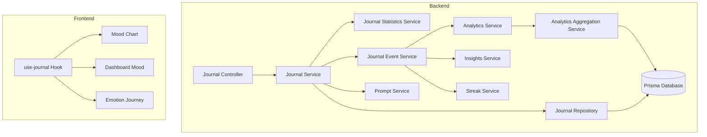
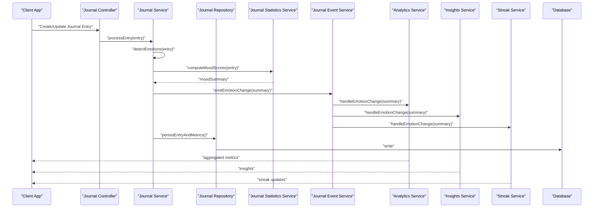
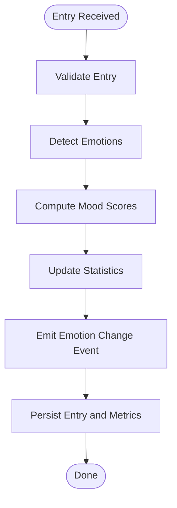
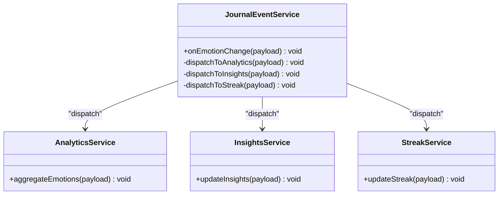
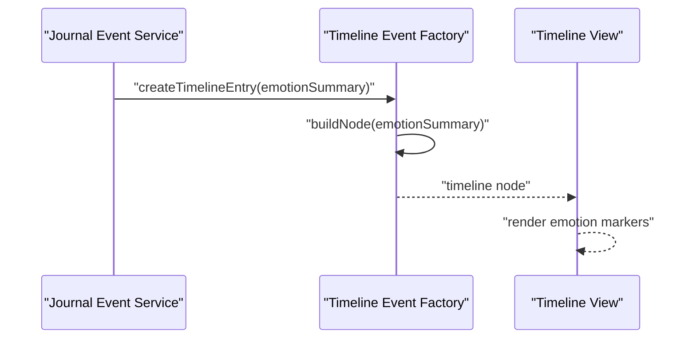
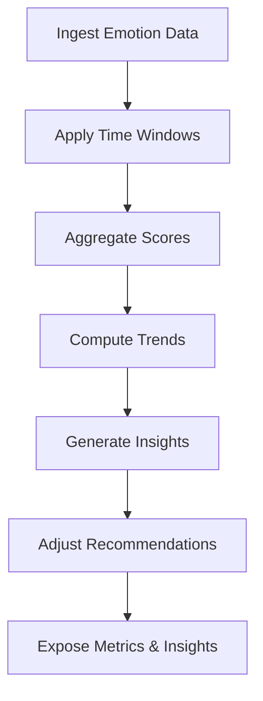
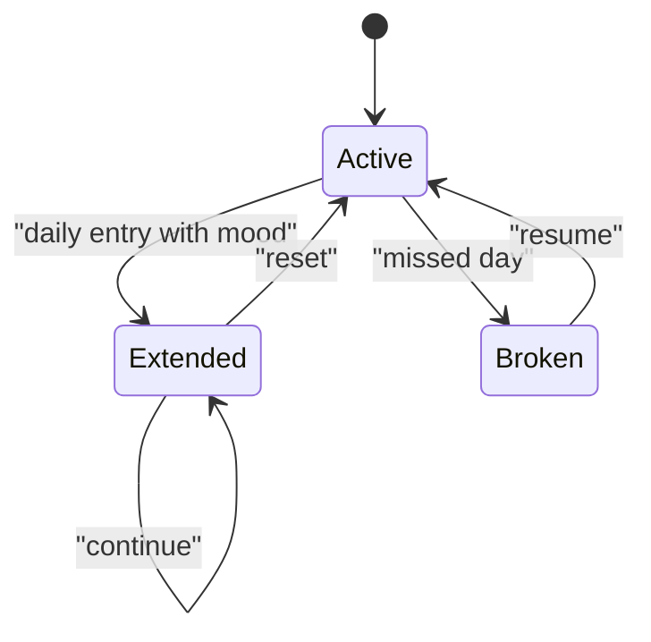
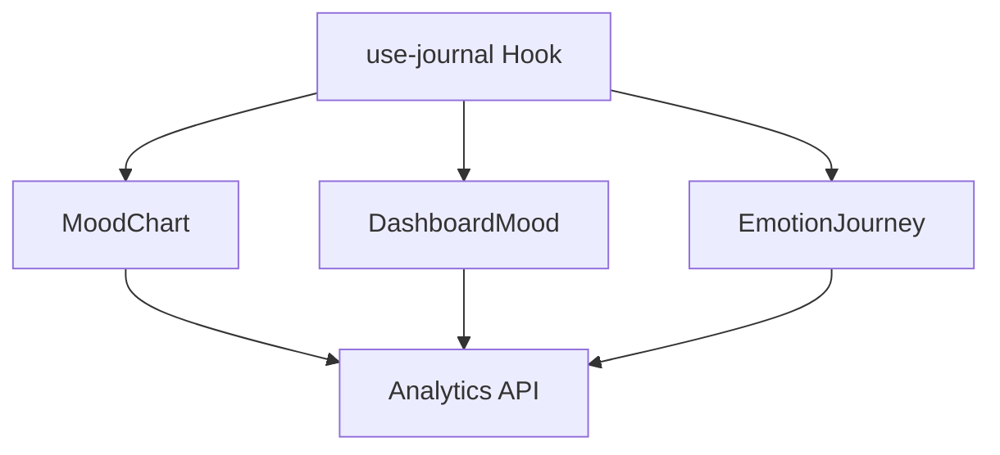
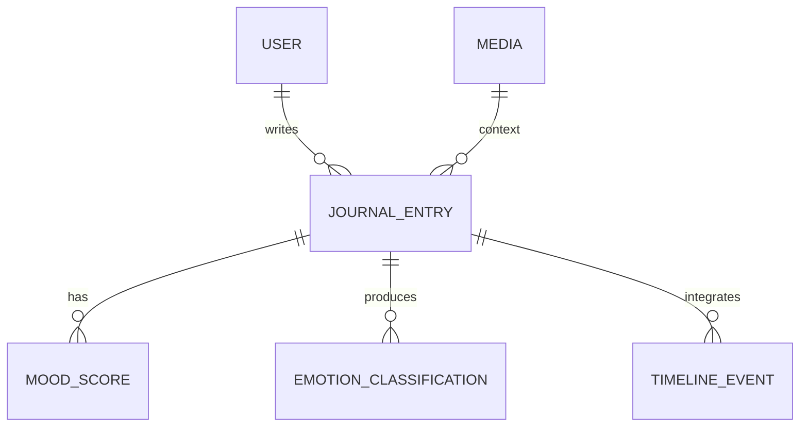
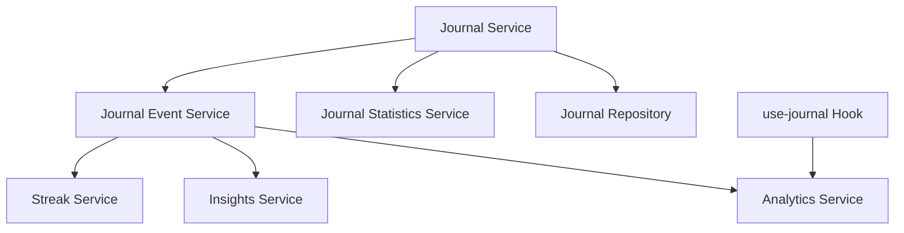

# Emotional Tracking System

<cite>
**Referenced Files in This Document**
- [journal.service.ts](file://apps/backend/src/journal/journal.service.ts)
- [journal-event.service.ts](file://apps/backend/src/journal/journal-event.service.ts)
- [timeline-event-factory.ts](file://apps/backend/src/journal/timeline-event-factory.ts)
- [journal-statistics.service.ts](file://apps/backend/src/journal/journal-statistics.service.ts)
- [journal.controller.ts](file://apps/backend/src/journal/journal.controller.ts)
- [journal.module.ts](file://apps/backend/src/journal/journal.module.ts)
- [journal.repository.ts](file://apps/backend/src/journal/journal.repository.ts)
- [prompt.service.ts](file://apps/backend/src/journal/prompt.service.ts)
- [dashboard-mood.tsx](file://src/components/dashboard/DashboardMood.tsx)
- [mood-chart.tsx](file://src/components/journal/MoodChart.tsx)
- [emotion-journey.tsx](file://src/components/media/EmotionJourney.tsx)
- [analytics.service.ts](file://apps/backend/src/analytics/analytics.service.ts)
- [insights.service.ts](file://apps/backend/src/analytics/insights.service.ts)
- [streak.service.ts](file://apps/backend/src/analytics/streak.service.ts)
- [analytics-aggregation.service.ts](file://apps/backend/src/analytics/analytics-aggregation.service.ts)
- [use-journal.ts](file://src/hooks/use-journal.ts)
- [memoryJournal.ts](file://src/lib/memoryJournal.ts)
- [schema.prisma](file://apps/backend/prisma/schema.prisma)
</cite>

## Table of Contents
1. [Introduction](#introduction)
2. [Project Structure](#project-structure)
3. [Core Components](#core-components)
4. [Architecture Overview](#architecture-overview)
5. [Detailed Component Analysis](#detailed-component-analysis)
6. [Dependency Analysis](#dependency-analysis)
7. [Performance Considerations](#performance-considerations)
8. [Troubleshooting Guide](#troubleshooting-guide)
9. [Conclusion](#conclusion)
10. [Appendices](#appendices)

## Introduction
This document explains the Emotional Tracking System that analyzes and categorizes user emotions from journal entries, computes mood scores, performs temporal analysis of emotional states, integrates emotional data with timeline events, and influences recommendation systems. It also details the event-driven architecture for processing emotional changes and triggering related actions, along with examples of emotion classification, mood trend analysis, and integration with visualization components.

## Project Structure
The Emotional Tracking System spans backend services (NestJS), a Prisma schema for persistence, and frontend components/hooks for visualization and interaction. Key areas include:
- Journal domain services for entry processing, statistics, and event emission
- Analytics services for aggregation, insights, and streaks
- Frontend mood visualizations and hooks for data binding
- Timeline event factory to integrate emotional signals into the timeline

**Diagram sources**
- [journal.controller.ts](file://apps/backend/src/journal/journal.controller.ts)
- [journal.service.ts](file://apps/backend/src/journal/journal.service.ts)
- [journal.repository.ts](file://apps/backend/src/journal/journal.repository.ts)
- [journal-statistics.service.ts](file://apps/backend/src/journal/journal-statistics.service.ts)
- [journal-event.service.ts](file://apps/backend/src/journal/journal-event.service.ts)
- [prompt.service.ts](file://apps/backend/src/journal/prompt.service.ts)
- [analytics.service.ts](file://apps/backend/src/analytics/analytics.service.ts)
- [insights.service.ts](file://apps/backend/src/analytics/insights.service.ts)
- [streak.service.ts](file://apps/backend/src/analytics/streak.service.ts)
- [analytics-aggregation.service.ts](file://apps/backend/src/analytics/analytics-aggregation.service.ts)
- [use-journal.ts](file://src/hooks/use-journal.ts)
- [mood-chart.tsx](file://src/components/journal/MoodChart.tsx)
- [dashboard-mood.tsx](file://src/components/dashboard/DashboardMood.tsx)
- [emotion-journey.tsx](file://src/components/media/EmotionJourney.tsx)

**Section sources**
- [journal.controller.ts](file://apps/backend/src/journal/journal.controller.ts)
- [journal.service.ts](file://apps/backend/src/journal/journal.service.ts)
- [journal.repository.ts](file://apps/backend/src/journal/journal.repository.ts)
- [journal-statistics.service.ts](file://apps/backend/src/journal/journal-statistics.service.ts)
- [journal-event.service.ts](file://apps/backend/src/journal/journal-event.service.ts)
- [prompt.service.ts](file://apps/backend/src/journal/prompt.service.ts)
- [analytics.service.ts](file://apps/backend/src/analytics/analytics.service.ts)
- [insights.service.ts](file://apps/backend/src/analytics/insights.service.ts)
- [streak.service.ts](file://apps/backend/src/analytics/streak.service.ts)
- [analytics-aggregation.service.ts](file://apps/backend/src/analytics/analytics-aggregation.service.ts)
- [use-journal.ts](file://src/hooks/use-journal.ts)
- [mood-chart.tsx](file://src/components/journal/MoodChart.tsx)
- [dashboard-mood.tsx](file://src/components/dashboard/DashboardMood.tsx)
- [emotion-journey.tsx](file://src/components/media/EmotionJourney.tsx)

## Core Components
- Journal Service: Orchestrates creation/update of journal entries, triggers emotion detection, updates statistics, and emits events for downstream consumers.
- Journal Statistics Service: Computes mood scores, sentiment aggregates, and temporal summaries used by analytics and UI.
- Journal Event Service: Publishes emotion change events to subscribers such as analytics, insights, and streak calculators.
- Prompt Service: Provides prompts and guidance to improve journal quality and consistency, indirectly supporting emotion detection accuracy.
- Analytics Services: Aggregate emotional data over time, compute insights, and maintain streaks based on consistent journaling and mood trends.
- Frontend Hooks and Components: Provide reactive access to journal and mood data, render charts, dashboards, and emotion journeys.

**Section sources**
- [journal.service.ts](file://apps/backend/src/journal/journal.service.ts)
- [journal-statistics.service.ts](file://apps/backend/src/journal/journal-statistics.service.ts)
- [journal-event.service.ts](file://apps/backend/src/journal/journal-event.service.ts)
- [prompt.service.ts](file://apps/backend/src/journal/prompt.service.ts)
- [analytics.service.ts](file://apps/backend/src/analytics/analytics.service.ts)
- [insights.service.ts](file://apps/backend/src/analytics/insights.service.ts)
- [streak.service.ts](file://apps/backend/src/analytics/streak.service.ts)
- [use-journal.ts](file://src/hooks/use-journal.ts)
- [mood-chart.tsx](file://src/components/journal/MoodChart.tsx)
- [dashboard-mood.tsx](file://src/components/dashboard/DashboardMood.tsx)
- [emotion-journey.tsx](file://src/components/media/EmotionJourney.tsx)

## Architecture Overview
The system follows an event-driven architecture where journal entry mutations trigger emotion detection and statistical updates. Events are emitted to analytics, insights, and streak services, which persist aggregated metrics and feed recommendations. The timeline event factory integrates emotional signals into the user’s timeline view.

**Diagram sources**
- [journal.controller.ts](file://apps/backend/src/journal/journal.controller.ts)
- [journal.service.ts](file://apps/backend/src/journal/journal.service.ts)
- [journal.repository.ts](file://apps/backend/src/journal/journal.repository.ts)
- [journal-statistics.service.ts](file://apps/backend/src/journal/journal-statistics.service.ts)
- [journal-event.service.ts](file://apps/backend/src/journal/journal-event.service.ts)
- [analytics.service.ts](file://apps/backend/src/analytics/analytics.service.ts)
- [insights.service.ts](file://apps/backend/src/analytics/insights.service.ts)
- [streak.service.ts](file://apps/backend/src/analytics/streak.service.ts)

## Detailed Component Analysis

### Journal Service: Emotion Detection and Mood Scoring
Responsibilities:
- Accepts journal entries and runs emotion detection logic to classify emotions and compute mood scores.
- Updates statistics via the statistics service and persists results through the repository.
- Emits emotion change events to downstream services.

Key behaviors:
- Emotion classification: Analyzes text content to assign emotion categories and intensities.
- Mood scoring: Aggregates emotion intensities into a composite mood score per entry and rolling windows.
- Temporal analysis: Maintains time-series of mood scores for trend computation.

**Diagram sources**
- [journal.service.ts](file://apps/backend/src/journal/journal.service.ts)
- [journal-statistics.service.ts](file://apps/backend/src/journal/journal-statistics.service.ts)
- [journal-event.service.ts](file://apps/backend/src/journal/journal-event.service.ts)
- [journal.repository.ts](file://apps/backend/src/journal/journal.repository.ts)

**Section sources**
- [journal.service.ts](file://apps/backend/src/journal/journal.service.ts)
- [journal-statistics.service.ts](file://apps/backend/src/journal/journal-statistics.service.ts)
- [journal-event.service.ts](file://apps/backend/src/journal/journal-event.service.ts)
- [journal.repository.ts](file://apps/backend/src/journal/journal.repository.ts)

### Journal Event Service: Event-Driven Processing
Responsibilities:
- Subscribes to emotion change events and dispatches them to analytics, insights, and streak services.
- Ensures decoupling between core journal operations and downstream consumers.

Processing flow:
- Receives emotion change payloads.
- Invokes handlers in analytics, insights, and streak services.
- Logs outcomes and handles errors gracefully.

**Diagram sources**
- [journal-event.service.ts](file://apps/backend/src/journal/journal-event.service.ts)
- [analytics.service.ts](file://apps/backend/src/analytics/analytics.service.ts)
- [insights.service.ts](file://apps/backend/src/analytics/insights.service.ts)
- [streak.service.ts](file://apps/backend/src/analytics/streak.service.ts)

**Section sources**
- [journal-event.service.ts](file://apps/backend/src/journal/journal-event.service.ts)
- [analytics.service.ts](file://apps/backend/src/analytics/analytics.service.ts)
- [insights.service.ts](file://apps/backend/src/analytics/insights.service.ts)
- [streak.service.ts](file://apps/backend/src/analytics/streak.service.ts)

### Timeline Integration: Timeline Event Factory
Responsibilities:
- Integrates emotional signals into timeline events to reflect mood shifts alongside media interactions and journal entries.
- Produces timeline nodes that combine timestamps, context, and emotional metadata.

Integration points:
- Consumes emotion change events or computed mood summaries.
- Generates timeline entries with emotion tags and intensity values.
- Supports filtering and grouping by emotion type and time windows.

**Diagram sources**
- [timeline-event-factory.ts](file://apps/backend/src/journal/timeline-event-factory.ts)
- [journal-event.service.ts](file://apps/backend/src/journal/journal-event.service.ts)

**Section sources**
- [timeline-event-factory.ts](file://apps/backend/src/journal/timeline-event-factory.ts)
- [journal-event.service.ts](file://apps/backend/src/journal/journal-event.service.ts)

### Analytics and Insights: Temporal Analysis and Recommendations
Responsibilities:
- Aggregates emotional data across time windows to compute trends, averages, and variance.
- Derives insights such as dominant emotions, mood volatility, and correlations with media consumption.
- Feeds recommendation engines with emotional context to personalize suggestions.

Temporal analysis:
- Rolling window computations for mood scores.
- Trend detection using moving averages and change-point analysis.
- Correlation with external events (e.g., media releases, user activity).

Recommendation influence:
- Adjusts recommendation weights based on recent mood and emotion patterns.
- Suggests content aligned with desired emotional outcomes or historical preferences.

**Diagram sources**
- [analytics.service.ts](file://apps/backend/src/analytics/analytics.service.ts)
- [insights.service.ts](file://apps/backend/src/analytics/insights.service.ts)
- [analytics-aggregation.service.ts](file://apps/backend/src/analytics/analytics-aggregation.service.ts)

**Section sources**
- [analytics.service.ts](file://apps/backend/src/analytics/analytics.service.ts)
- [insights.service.ts](file://apps/backend/src/analytics/insights.service.ts)
- [analytics-aggregation.service.ts](file://apps/backend/src/analytics/analytics-aggregation.service.ts)

### Streak Service: Consistency and Motivation
Responsibilities:
- Tracks consecutive days of journaling and mood logging.
- Resets or extends streaks based on daily activity and mood completeness.

Behavior:
- Evaluates daily presence of journal entries and valid mood scores.
- Updates streak counters and notifies users via insights or notifications.

**Diagram sources**
- [streak.service.ts](file://apps/backend/src/analytics/streak.service.ts)

**Section sources**
- [streak.service.ts](file://apps/backend/src/analytics/streak.service.ts)

### Frontend Integration: Visualization and Interaction
Components and hooks:
- use-journal hook: Provides reactive access to journal entries, mood scores, and emotion summaries.
- MoodChart component: Renders time-series of mood scores and emotion distributions.
- DashboardMood component: Displays current mood state and recent trends.
- EmotionJourney component: Visualizes emotion progression over time with interactive filters.

Data binding:
- Fetches aggregated mood and emotion data from backend analytics endpoints.
- Updates charts and dashboards reactively on new journal entries or processed events.

**Diagram sources**
- [use-journal.ts](file://src/hooks/use-journal.ts)
- [mood-chart.tsx](file://src/components/journal/MoodChart.tsx)
- [dashboard-mood.tsx](file://src/components/dashboard/DashboardMood.tsx)
- [emotion-journey.tsx](file://src/components/media/EmotionJourney.tsx)
- [analytics.service.ts](file://apps/backend/src/analytics/analytics.service.ts)

**Section sources**
- [use-journal.ts](file://src/hooks/use-journal.ts)
- [mood-chart.tsx](file://src/components/journal/MoodChart.tsx)
- [dashboard-mood.tsx](file://src/components/dashboard/DashboardMood.tsx)
- [emotion-journey.tsx](file://src/components/media/EmotionJourney.tsx)
- [analytics.service.ts](file://apps/backend/src/analytics/analytics.service.ts)

### Data Model: Persistence and Schema
The Prisma schema defines entities for journal entries, mood scores, emotion classifications, and related metadata. Relationships ensure referential integrity and support efficient queries for temporal analysis.

Key entities:
- JournalEntry: Stores text, timestamps, and references to user and media context.
- MoodScore: Captures computed mood values and time windows.
- EmotionClassification: Records detected emotions and intensities per entry.
- TimelineEvent: Represents integrated emotional signals within the timeline.

**Diagram sources**
- [schema.prisma](file://apps/backend/prisma/schema.prisma)

**Section sources**
- [schema.prisma](file://apps/backend/prisma/schema.prisma)

## Dependency Analysis
The Emotional Tracking System exhibits clear separation of concerns:
- Journal Service depends on Repository, Statistics, and Event services.
- Event Service decouples downstream consumers (Analytics, Insights, Streak).
- Frontend hooks depend on analytics APIs and components render derived data.

Potential circular dependencies are avoided by emitting events rather than direct calls between analytics and journal modules.

**Diagram sources**
- [journal.service.ts](file://apps/backend/src/journal/journal.service.ts)
- [journal.repository.ts](file://apps/backend/src/journal/journal.repository.ts)
- [journal-statistics.service.ts](file://apps/backend/src/journal/journal-statistics.service.ts)
- [journal-event.service.ts](file://apps/backend/src/journal/journal-event.service.ts)
- [analytics.service.ts](file://apps/backend/src/analytics/analytics.service.ts)
- [insights.service.ts](file://apps/backend/src/analytics/insights.service.ts)
- [streak.service.ts](file://apps/backend/src/analytics/streak.service.ts)
- [use-journal.ts](file://src/hooks/use-journal.ts)

**Section sources**
- [journal.service.ts](file://apps/backend/src/journal/journal.service.ts)
- [journal.repository.ts](file://apps/backend/src/journal/journal.repository.ts)
- [journal-statistics.service.ts](file://apps/backend/src/journal/journal-statistics.service.ts)
- [journal-event.service.ts](file://apps/backend/src/journal/journal-event.service.ts)
- [analytics.service.ts](file://apps/backend/src/analytics/analytics.service.ts)
- [insights.service.ts](file://apps/backend/src/analytics/insights.service.ts)
- [streak.service.ts](file://apps/backend/src/analytics/streak.service.ts)
- [use-journal.ts](file://src/hooks/use-journal.ts)

## Performance Considerations
- Batch processing: Group emotion detections and statistic updates to reduce database writes.
- Caching: Cache aggregated mood scores and insights for frequent reads.
- Asynchronous event handling: Offload analytics and insights updates to background workers.
- Efficient time-window queries: Use indexed timestamps and partitioned tables for temporal analysis.
- Frontend memoization: Memoize chart data and avoid unnecessary re-renders.

[No sources needed since this section provides general guidance]

## Troubleshooting Guide
Common issues and resolutions:
- Missing emotion classifications: Ensure prompt service is configured and journal entries contain sufficient context.
- Incorrect mood scores: Validate statistics computation logic and input normalization.
- Event delivery failures: Check event service logs and retry mechanisms for analytics/insights/streak handlers.
- Timeline gaps: Verify timeline event factory integration and timestamp alignment.

**Section sources**
- [journal-event.service.ts](file://apps/backend/src/journal/journal-event.service.ts)
- [journal-statistics.service.ts](file://apps/backend/src/journal/journal-statistics.service.ts)
- [prompt.service.ts](file://apps/backend/src/journal/prompt.service.ts)
- [timeline-event-factory.ts](file://apps/backend/src/journal/timeline-event-factory.ts)

## Conclusion
The Emotional Tracking System combines robust emotion detection, mood scoring, and temporal analysis within an event-driven architecture. It integrates emotional signals into timelines and influences recommendations through analytics and insights. Frontend components provide intuitive visualizations and interactive exploration of emotional journeys. Proper configuration, performance tuning, and troubleshooting ensure reliable operation and meaningful user insights.

[No sources needed since this section summarizes without analyzing specific files]

## Appendices
- Example Emotion Classification: Classify entries into emotions such as joy, sadness, anger, calm, excitement, and anxiety with intensity levels.
- Mood Trend Analysis: Compute weekly averages, detect upward/downward trends, and highlight significant mood shifts.
- Recommendation Influence: Adjust suggested media based on desired emotional outcomes and historical preferences.

[No sources needed since this section provides conceptual examples]