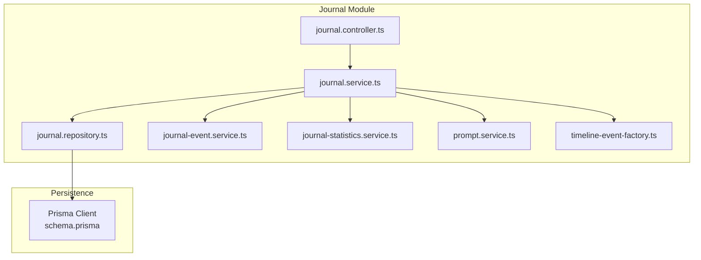
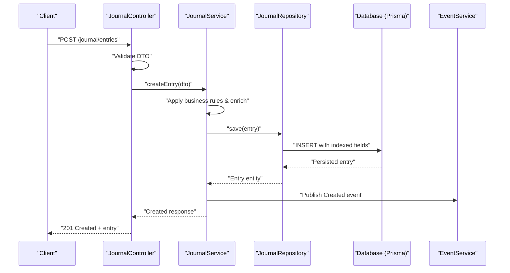
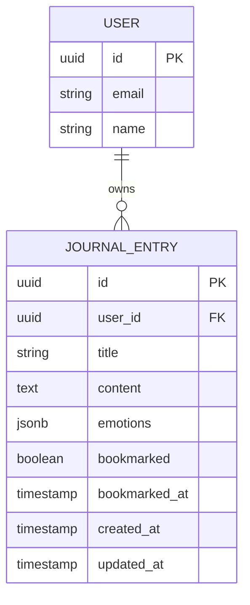
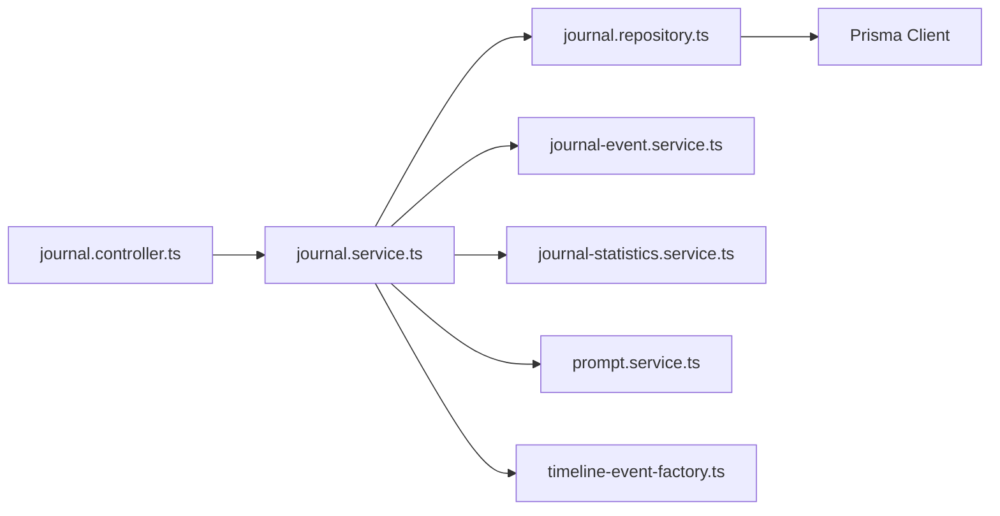

# Journal Entry Management

<cite>
**Referenced Files in This Document**
- [journal.controller.ts](file://apps/backend/src/journal/journal.controller.ts)
- [journal.service.ts](file://apps/backend/src/journal/journal.service.ts)
- [journal.repository.ts](file://apps/backend/src/journal/journal.repository.ts)
- [journal.module.ts](file://apps/backend/src/journal/journal.module.ts)
- [journal-event.service.ts](file://apps/backend/src/journal/journal-event.service.ts)
- [journal-statistics.service.ts](file://apps/backend/src/journal/journal-statistics.service.ts)
- [prompt.service.ts](file://apps/backend/src/journal/prompt.service.ts)
- [timeline-event-factory.ts](file://apps/backend/src/journal/timeline-event-factory.ts)
- [schema.prisma](file://apps/backend/prisma/schema.prisma)
- [20260703_add_bookmarked_at_column/migration.sql](file://apps/backend/prisma/migrations/20260703_add_bookmarked_at_column/migration.sql)
- [20260703_add_bookmarked_column/migration.sql](file://apps/backend/prisma/migrations/20260703_add_bookmarked_column/migration.sql)
- [20260703_remove_redundant_indexes/migration.sql](file://apps/backend/prisma/migrations/20260703_remove_redundant_indexes/migration.sql)
- [20260721005559_fix_media_cascade_restrict/migration.sql](file://apps/backend/prisma/migrations/20260721005559_fix_media_cascade_restrict/migration.sql)
- [index.ts](file://apps/backend/src/journal/index.ts)
</cite>

## Table of Contents
1. [Introduction](#introduction)
2. [Project Structure](#project-structure)
3. [Core Components](#core-components)
4. [Architecture Overview](#architecture-overview)
5. [Detailed Component Analysis](#detailed-component-analysis)
6. [Dependency Analysis](#dependency-analysis)
7. [Performance Considerations](#performance-considerations)
8. [Troubleshooting Guide](#troubleshooting-guide)
9. [Conclusion](#conclusion)
10. [Appendices](#appendices)

## Introduction
This document explains the Journal Entry Management system implemented in the backend. It covers CRUD operations for journal entries, the data model and validation rules enforced by DTOs, business logic in the service layer, repository patterns for efficient database access, indexing strategies, and performance optimizations. It also includes examples for creating entries with emotional metadata, searching through entries, and handling concurrent updates, along with error handling patterns.

## Project Structure
The journal feature is organized as a NestJS module under apps/backend/src/journal with clear separation of concerns:
- Controller exposes HTTP endpoints for journal entry operations.
- Service encapsulates business logic, orchestration, and domain rules.
- Repository abstracts Prisma-based persistence and query optimization.
- Supporting services handle events, statistics, prompts, and timeline integration.
- DTOs define request/response shapes and validation constraints.
- Prisma schema defines the data model and indexes.

**Diagram sources**
- [journal.controller.ts](file://apps/backend/src/journal/journal.controller.ts)
- [journal.service.ts](file://apps/backend/src/journal/journal.service.ts)
- [journal.repository.ts](file://apps/backend/src/journal/journal.repository.ts)
- [journal-event.service.ts](file://apps/backend/src/journal/journal-event.service.ts)
- [journal-statistics.service.ts](file://apps/backend/src/journal/journal-statistics.service.ts)
- [prompt.service.ts](file://apps/backend/src/journal/prompt.service.ts)
- [timeline-event-factory.ts](file://apps/backend/src/journal/timeline-event-factory.ts)
- [schema.prisma](file://apps/backend/prisma/schema.prisma)

**Section sources**
- [journal.module.ts](file://apps/backend/src/journal/journal.module.ts)
- [index.ts](file://apps/backend/src/journal/index.ts)

## Core Components
- Controller: Defines REST endpoints for creating, reading, updating, deleting, and searching journal entries. It validates inputs via DTOs and delegates to the service.
- Service: Implements business logic including validation, enrichment (e.g., emotional metadata), event publishing, statistics updates, and transactional operations.
- Repository: Encapsulates Prisma queries, pagination, filtering, and indexing-aware operations. Provides methods for efficient reads/writes and bulk operations where applicable.
- Event Service: Publishes domain events when entries are created/updated/deleted to support analytics and integrations.
- Statistics Service: Aggregates metrics such as counts, trends, and mood distributions.
- Prompt Service: Generates or retrieves writing prompts to assist users.
- Timeline Event Factory: Creates timeline events based on journal activity.

Key responsibilities:
- Input validation and transformation via DTOs.
- Business rule enforcement (e.g., required fields, length limits, emotion categories).
- Transactional writes with proper error handling and rollback.
- Efficient querying using indexes and selective projections.
- Publishing side effects (events, stats) without blocking core flows.

**Section sources**
- [journal.controller.ts](file://apps/backend/src/journal/journal.controller.ts)
- [journal.service.ts](file://apps/backend/src/journal/journal.service.ts)
- [journal.repository.ts](file://apps/backend/src/journal/journal.repository.ts)
- [journal-event.service.ts](file://apps/backend/src/journal/journal-event.service.ts)
- [journal-statistics.service.ts](file://apps/backend/src/journal/journal-statistics.service.ts)
- [prompt.service.ts](file://apps/backend/src/journal/prompt.service.ts)
- [timeline-event-factory.ts](file://apps/backend/src/journal/timeline-event-factory.ts)

## Architecture Overview
The journal subsystem follows a layered architecture:
- HTTP layer (Controller) receives requests, validates DTOs, and returns standardized responses.
- Service layer orchestrates domain logic, coordinates repositories, and emits events.
- Repository layer interacts with Prisma for data access, leveraging indexes and optimized queries.
- Cross-cutting concerns include transactions, caching (if used elsewhere), and observability.

**Diagram sources**
- [journal.controller.ts](file://apps/backend/src/journal/journal.controller.ts)
- [journal.service.ts](file://apps/backend/src/journal/journal.service.ts)
- [journal.repository.ts](file://apps/backend/src/journal/journal.repository.ts)
- [journal-event.service.ts](file://apps/backend/src/journal/journal-event.service.ts)
- [schema.prisma](file://apps/backend/prisma/schema.prisma)

## Detailed Component Analysis

### Data Model and Schema
The journal entry model is defined in Prisma and supports:
- Core fields: id, userId, title, content, timestamps, and optional bookmarking flags.
- Emotional metadata: structured fields for emotions, intensity, and tags.
- Indexing: composite and single-column indexes for common filters (userId, createdAt, emotions).

Relevant migrations indicate:
- Addition of bookmark-related columns and timestamps.
- Removal of redundant indexes to optimize storage and write performance.
- Cascade restrictions for media relationships to maintain referential integrity.

**Diagram sources**
- [schema.prisma](file://apps/backend/prisma/schema.prisma)

**Section sources**
- [schema.prisma](file://apps/backend/prisma/schema.prisma)
- [20260703_add_bookmarked_column/migration.sql](file://apps/backend/prisma/migrations/20260703_add_bookmarked_column/migration.sql)
- [20260703_add_bookmarked_at_column/migration.sql](file://apps/backend/prisma/migrations/20260703_add_bookmarked_at_column/migration.sql)
- [20260703_remove_redundant_indexes/migration.sql](file://apps/backend/prisma/migrations/20260703_remove_redundant_indexes/migration.sql)
- [20260721005559_fix_media_cascade_restrict/migration.sql](file://apps/backend/prisma/migrations/20260721005559_fix_media_cascade_restrict/migration.sql)

### DTOs and Validation Rules
DTOs enforce:
- Required fields: userId, title, content.
- Length constraints: title max length, content min/max length.
- Emotion structure: allowed categories, numeric intensity ranges, and tag arrays.
- Optional fields: bookmarked flag and bookmarkedAt timestamp.

Validation ensures:
- Type safety across layers.
- Early rejection of malformed requests.
- Consistent error messages for clients.

**Section sources**
- [journal.controller.ts](file://apps/backend/src/journal/journal.controller.ts)
- [journal.service.ts](file://apps/backend/src/journal/journal.service.ts)

### CRUD Operations and Business Logic
- Create: Validates DTO, enriches emotional metadata, persists via repository, publishes creation event, updates statistics.
- Read: Supports fetching by id, listing with filters (userId, date range, emotions), pagination, and projection of only needed fields.
- Update: Applies partial updates, enforces business rules, handles concurrency via optimistic locking or version fields if present, publishes update event.
- Delete: Soft delete or hard delete depending on policy, cascades related entities safely, publishes deletion event.

Business logic highlights:
- Enforce ownership checks (userId must match authenticated user).
- Normalize emotional metadata before persisting.
- Maintain consistency between journal entries and timeline events.

**Section sources**
- [journal.service.ts](file://apps/backend/src/journal/journal.service.ts)
- [journal.repository.ts](file://apps/backend/src/journal/journal.repository.ts)

### Repository Patterns and Query Optimization
Repository methods provide:
- create, findById, findByUser, filterByEmotions, paginate, update, remove.
- Selective projections to reduce payload size.
- Indexed queries leveraging userId, createdAt, and emotion fields.
- Batch operations where appropriate to minimize round trips.

Indexing strategy:
- Single-column indexes on frequently filtered fields (userId, createdAt).
- Composite indexes for common query patterns (userId + createdAt).
- Removal of redundant indexes to improve write throughput.

**Section sources**
- [journal.repository.ts](file://apps/backend/src/journal/journal.repository.ts)
- [20260703_remove_redundant_indexes/migration.sql](file://apps/backend/prisma/migrations/20260703_remove_redundant_indexes/migration.sql)

### Event Publishing and Side Effects
- Creation/Update/Delete events are published to support analytics, notifications, and timeline generation.
- Statistics service aggregates counts and mood distributions asynchronously.
- Timeline event factory creates consistent timeline entries reflecting journal activity.

**Section sources**
- [journal-event.service.ts](file://apps/backend/src/journal/journal-event.service.ts)
- [journal-statistics.service.ts](file://apps/backend/src/journal/journal-statistics.service.ts)
- [timeline-event-factory.ts](file://apps/backend/src/journal/timeline-event-factory.ts)

### Search and Filtering
Search capabilities include:
- Full-text search over title and content.
- Filter by emotions, date ranges, and user context.
- Pagination and sorting by relevance or timestamps.

Optimizations:
- Use of Prisma's where clauses with indexed fields.
- Projection of minimal fields for list views.
- Caching strategies at higher layers if implemented.

**Section sources**
- [journal.service.ts](file://apps/backend/src/journal/journal.service.ts)
- [journal.repository.ts](file://apps/backend/src/journal/journal.repository.ts)

### Concurrent Updates Handling
Concurrency is managed by:
- Optimistic locking using version fields or conditional updates.
- Conflict detection and retry logic in the service layer.
- Clear error responses indicating conflicts and suggested actions.

**Section sources**
- [journal.service.ts](file://apps/backend/src/journal/journal.service.ts)
- [journal.repository.ts](file://apps/backend/src/journal/journal.repository.ts)

### Examples

#### Creating a Journal Entry with Emotional Metadata
Steps:
- Validate DTO with required fields and emotion constraints.
- Normalize emotions and set defaults.
- Persist entry and publish creation event.
- Return created entry with enriched metadata.

**Section sources**
- [journal.controller.ts](file://apps/backend/src/journal/journal.controller.ts)
- [journal.service.ts](file://apps/backend/src/journal/journal.service.ts)
- [journal.repository.ts](file://apps/backend/src/journal/journal.repository.ts)

#### Searching Through Entries
Steps:
- Build query filters from DTO parameters.
- Apply indexed filters (userId, createdAt, emotions).
- Paginate results and project necessary fields.
- Return paginated list with total count.

**Section sources**
- [journal.service.ts](file://apps/backend/src/journal/journal.service.ts)
- [journal.repository.ts](file://apps/backend/src/journal/journal.repository.ts)

#### Handling Concurrent Updates
Steps:
- Fetch current entry with version field.
- Apply updates conditionally based on version.
- On conflict, return conflict error with guidance.
- Optionally retry with backoff.

**Section sources**
- [journal.service.ts](file://apps/backend/src/journal/journal.service.ts)
- [journal.repository.ts](file://apps/backend/src/journal/journal.repository.ts)

## Dependency Analysis
The journal module depends on:
- Prisma for data access and schema management.
- Event infrastructure for publishing domain events.
- Statistics and timeline services for side effects.
- Common utilities for validation, exceptions, and pagination.

**Diagram sources**
- [journal.controller.ts](file://apps/backend/src/journal/journal.controller.ts)
- [journal.service.ts](file://apps/backend/src/journal/journal.service.ts)
- [journal.repository.ts](file://apps/backend/src/journal/journal.repository.ts)
- [journal-event.service.ts](file://apps/backend/src/journal/journal-event.service.ts)
- [journal-statistics.service.ts](file://apps/backend/src/journal/journal-statistics.service.ts)
- [prompt.service.ts](file://apps/backend/src/journal/prompt.service.ts)
- [timeline-event-factory.ts](file://apps/backend/src/journal/timeline-event-factory.ts)
- [schema.prisma](file://apps/backend/prisma/schema.prisma)

**Section sources**
- [journal.module.ts](file://apps/backend/src/journal/journal.module.ts)

## Performance Considerations
- Indexing: Ensure frequent filters use single or composite indexes; avoid redundant indexes that slow writes.
- Projections: Select only required fields to reduce payload and memory usage.
- Transactions: Wrap multi-step writes in transactions to maintain consistency and reduce lock contention.
- Pagination: Implement cursor-based or offset pagination for large datasets.
- Asynchronous side effects: Publish events and update statistics outside the critical path where possible.
- Caching: Consider read-through caches for hot queries if appropriate.

[No sources needed since this section provides general guidance]

## Troubleshooting Guide
Common issues and resolutions:
- Validation errors: Check DTO constraints and input payloads; ensure required fields and formats are correct.
- Concurrency conflicts: Retry with exponential backoff; verify version fields and conditional updates.
- Slow queries: Review indexes and query patterns; add composite indexes for frequent filters.
- Missing events: Verify event publishing pipeline and consumer health.
- Data integrity: Confirm foreign key constraints and cascade policies.

**Section sources**
- [journal.controller.ts](file://apps/backend/src/journal/journal.controller.ts)
- [journal.service.ts](file://apps/backend/src/journal/journal.service.ts)
- [journal.repository.ts](file://apps/backend/src/journal/journal.repository.ts)

## Conclusion
The Journal Entry Management system implements robust CRUD operations with strong validation, efficient repository patterns, and clear separation of concerns. The data model supports emotional metadata and bookmarking, while indexing and projections optimize performance. Event-driven side effects enable analytics and timeline features. Proper concurrency handling and error patterns ensure reliability under load.

[No sources needed since this section summarizes without analyzing specific files]

## Appendices

### API Endpoints Summary
- POST /journal/entries: Create a new journal entry with validated DTO.
- GET /journal/entries/:id: Retrieve a specific entry by id.
- GET /journal/entries: List entries with filters, pagination, and sorting.
- PATCH /journal/entries/:id: Update an entry with partial data and concurrency checks.
- DELETE /journal/entries/:id: Delete an entry with appropriate side effects.

**Section sources**
- [journal.controller.ts](file://apps/backend/src/journal/journal.controller.ts)

### Error Handling Patterns
- Validation errors return 400 with detailed messages.
- Not found errors return 404 with resource identifiers.
- Concurrency conflicts return 409 with retry guidance.
- Internal errors return 500 with sanitized messages and correlation IDs.

**Section sources**
- [journal.controller.ts](file://apps/backend/src/journal/journal.controller.ts)
- [journal.service.ts](file://apps/backend/src/journal/journal.service.ts)