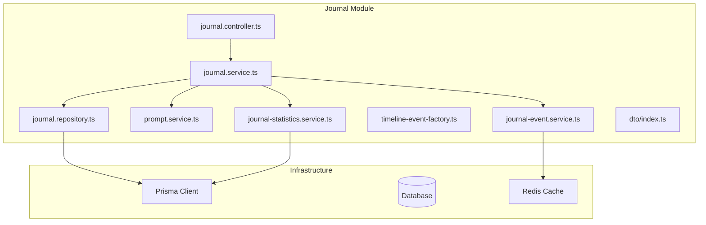
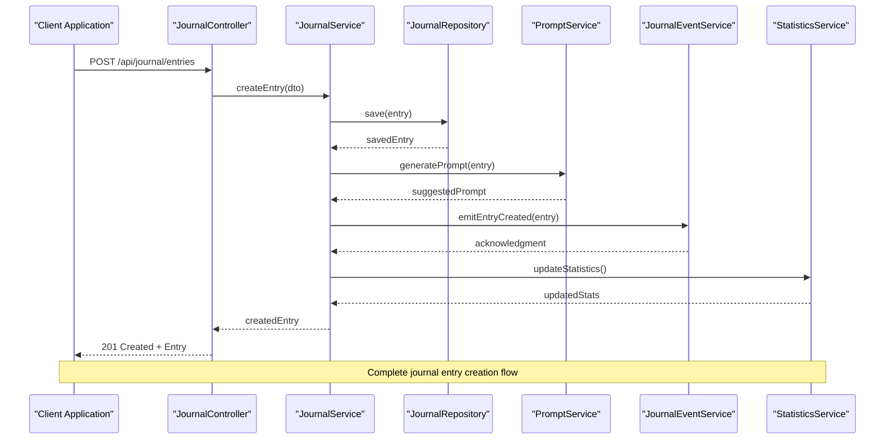
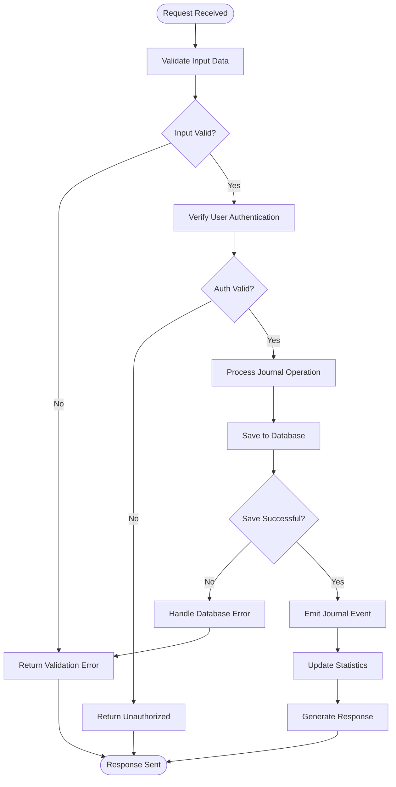
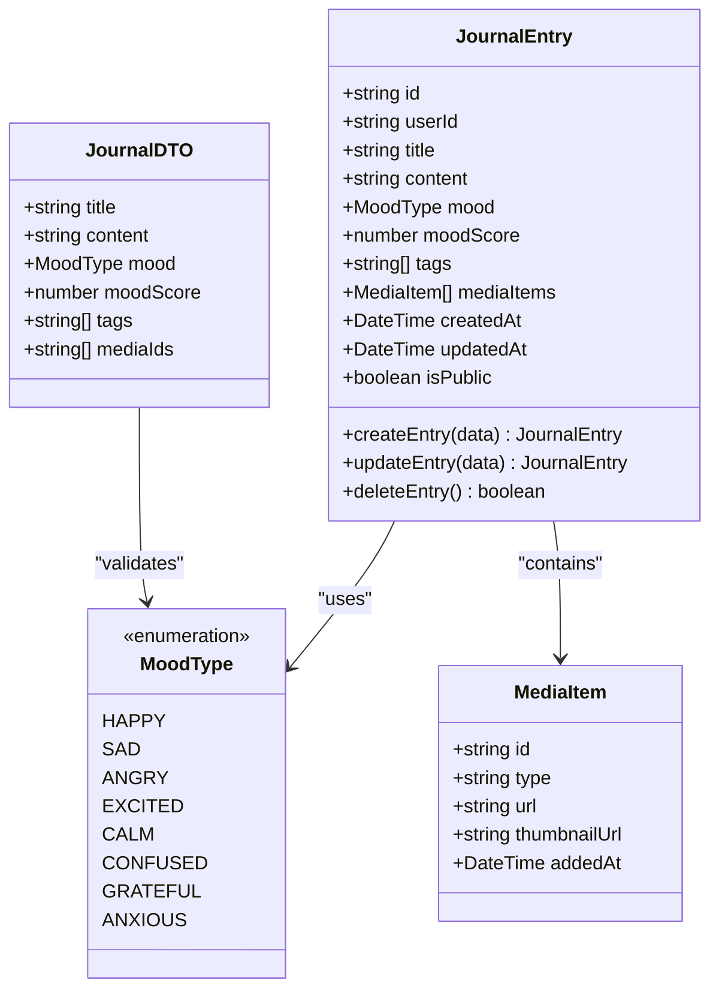
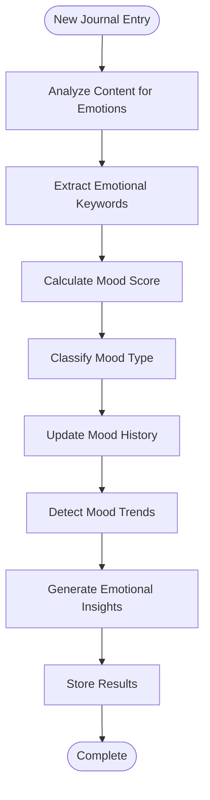
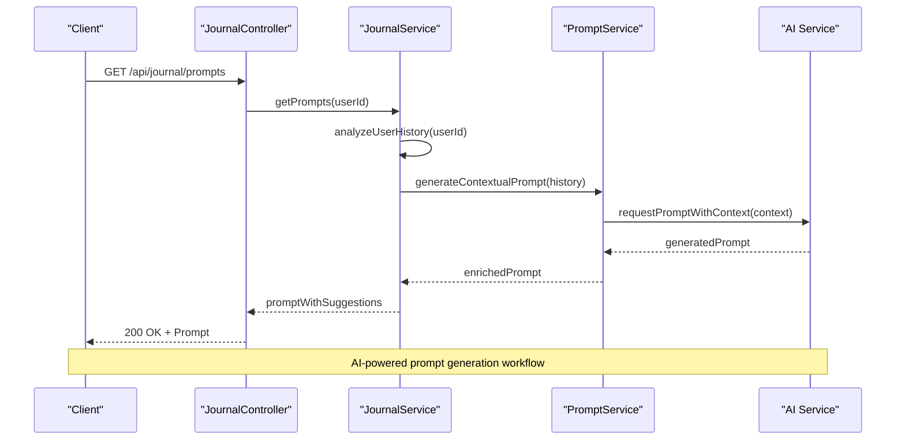
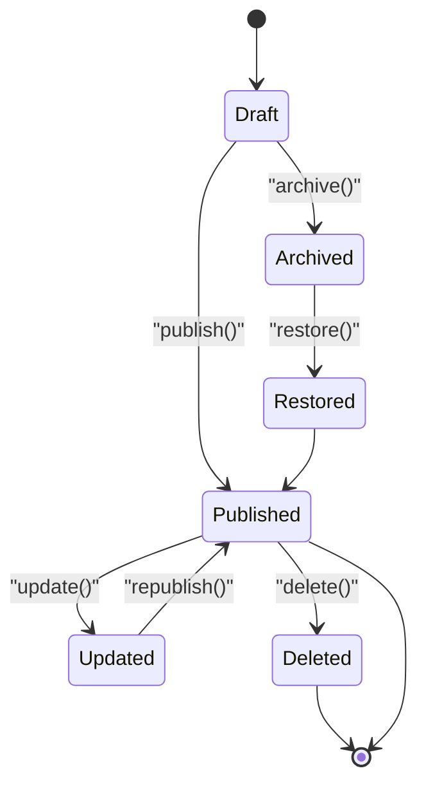
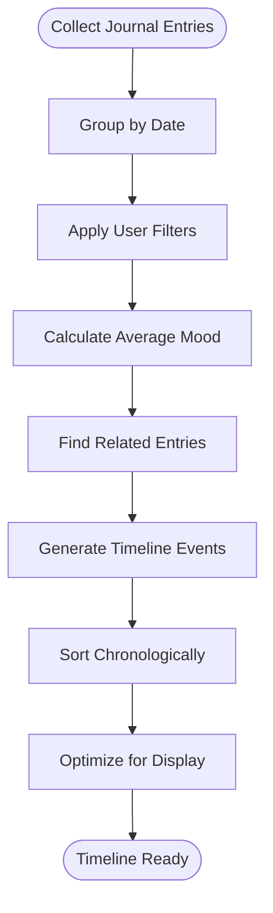
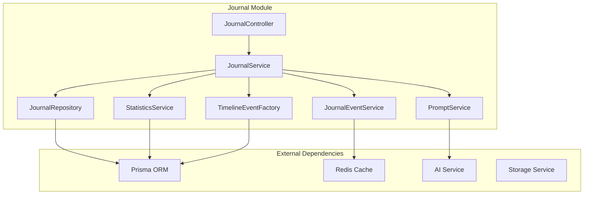

# Journal System Module

<cite>
**Referenced Files in This Document**
- [journal.controller.ts](file://apps/backend/src/journal/journal.controller.ts)
- [journal.service.ts](file://apps/backend/src/journal/journal.service.ts)
- [journal.repository.ts](file://apps/backend/src/journal/journal.repository.ts)
- [journal.module.ts](file://apps/backend/src/journal/journal.module.ts)
- [prompt.service.ts](file://apps/backend/src/journal/prompt.service.ts)
- [journal-event.service.ts](file://apps/backend/src/journal/journal-event.service.ts)
- [timeline-event-factory.ts](file://apps/backend/src/journal/timeline-event-factory.ts)
- [journal-statistics.service.ts](file://apps/backend/src/journal/journal-statistics.service.ts)
- [dto/index.ts](file://apps/backend/src/journal/dto/index.ts)
- [schema.prisma](file://apps/backend/prisma/schema.prisma)
- [app.module.ts](file://apps/backend/src/app.module.ts)
</cite>

## Table of Contents
1. [Introduction](#introduction)
2. [Project Structure](#project-structure)
3. [Core Components](#core-components)
4. [Architecture Overview](#architecture-overview)
5. [Detailed Component Analysis](#detailed-component-analysis)
6. [Dependency Analysis](#dependency-analysis)
7. [Performance Considerations](#performance-considerations)
8. [Troubleshooting Guide](#troubleshooting-guide)
9. [Conclusion](#conclusion)

## Introduction
The Journal System Module provides personal reflection and emotional tracking capabilities with timeline-based memory organization. It supports journal entry CRUD operations, mood analysis, AI-powered prompt generation, statistics calculation, and event-driven updates that integrate with media items for a cohesive user experience. The module is designed to scale efficiently through repository patterns and optimized queries while maintaining clear separation between controllers, services, and data access layers.

## Project Structure
The Journal System Module follows NestJS architectural patterns with clear separation of concerns:

**Diagram sources**
- [journal.controller.ts](file://apps/backend/src/journal/journal.controller.ts)
- [journal.service.ts](file://apps/backend/src/journal/journal.service.ts)
- [journal.repository.ts](file://apps/backend/src/journal/journal.repository.ts)
- [prompt.service.ts](file://apps/backend/src/journal/prompt.service.ts)
- [journal-event.service.ts](file://apps/backend/src/journal/journal-event.service.ts)
- [timeline-event-factory.ts](file://apps/backend/src/journal/timeline-event-factory.ts)
- [journal-statistics.service.ts](file://apps/backend/src/journal/journal-statistics.service.ts)

**Section sources**
- [journal.module.ts](file://apps/backend/src/journal/journal.module.ts)
- [app.module.ts](file://apps/backend/src/app.module.ts)

## Core Components

### Journal Controller
Handles HTTP endpoints for journal operations including CRUD operations, mood tracking, and timeline management.

### Journal Service
Core business logic layer that orchestrates journal entry management, emotional state tracking, and integration with other services.

### Journal Repository
Data access layer implementing efficient database queries using Prisma ORM with optimized pagination and filtering.

### Prompt Service
AI-powered service for generating contextual writing suggestions based on user history, mood, and media context.

### Event Service
Event-driven architecture component that handles journal updates and broadcasts changes to subscribers.

### Timeline Factory
Generates timeline events from journal entries with mood analysis and media integration.

### Statistics Service
Calculates journaling statistics, mood trends, and engagement metrics.

**Section sources**
- [journal.controller.ts](file://apps/backend/src/journal/journal.controller.ts)
- [journal.service.ts](file://apps/backend/src/journal/journal.service.ts)
- [journal.repository.ts](file://apps/backend/src/journal/journal.repository.ts)
- [prompt.service.ts](file://apps/backend/src/journal/prompt.service.ts)
- [journal-event.service.ts](file://apps/backend/src/journal/journal-event.service.ts)
- [timeline-event-factory.ts](file://apps/backend/src/journal/timeline-event-factory.ts)
- [journal-statistics.service.ts](file://apps/backend/src/journal/journal-statistics.service.ts)

## Architecture Overview

**Diagram sources**
- [journal.controller.ts](file://apps/backend/src/journal/journal.controller.ts)
- [journal.service.ts](file://apps/backend/src/journal/journal.service.ts)
- [journal.repository.ts](file://apps/backend/src/journal/journal.repository.ts)
- [prompt.service.ts](file://apps/backend/src/journal/prompt.service.ts)
- [journal-event.service.ts](file://apps/backend/src/journal/journal-event.service.ts)
- [journal-statistics.service.ts](file://apps/backend/src/journal/journal-statistics.service.ts)

## Detailed Component Analysis

### Journal Entry Management

#### CRUD Operations Flow
The journal system implements comprehensive CRUD operations with validation, transformation, and error handling:

**Diagram sources**
- [journal.controller.ts](file://apps/backend/src/journal/journal.controller.ts)
- [journal.service.ts](file://apps/backend/src/journal/journal.service.ts)
- [journal.repository.ts](file://apps/backend/src/journal/journal.repository.ts)

#### Data Models and DTOs
The journal system uses structured DTOs for type-safe data transfer:

**Diagram sources**
- [dto/index.ts](file://apps/backend/src/journal/dto/index.ts)
- [schema.prisma](file://apps/backend/prisma/schema.prisma)

**Section sources**
- [journal.controller.ts](file://apps/backend/src/journal/journal.controller.ts)
- [journal.service.ts](file://apps/backend/src/journal/journal.service.ts)
- [dto/index.ts](file://apps/backend/src/journal/dto/index.ts)

### Emotional State Tracking

#### Mood Analysis Algorithm
The system tracks emotional states through mood scoring and trend analysis:

**Diagram sources**
- [journal-statistics.service.ts](file://apps/backend/src/journal/journal-statistics.service.ts)
- [journal.service.ts](file://apps/backend/src/journal/journal.service.ts)

### AI-Powered Prompt Generation

#### Contextual Writing Suggestions
The prompt service generates personalized writing prompts based on user context:

**Diagram sources**
- [prompt.service.ts](file://apps/backend/src/journal/prompt.service.ts)
- [journal.service.ts](file://apps/backend/src/journal/journal.service.ts)

### Event-Driven Architecture

#### Journal Update Events
The system uses events to maintain consistency across components:

**Diagram sources**
- [journal-event.service.ts](file://apps/backend/src/journal/journal-event.service.ts)
- [journal.service.ts](file://apps/backend/src/journal/journal.service.ts)

### Timeline Generation

#### Memory Organization Algorithm
Timeline events are generated from journal entries with intelligent grouping:

**Diagram sources**
- [timeline-event-factory.ts](file://apps/backend/src/journal/timeline-event-factory.ts)
- [journal-statistics.service.ts](file://apps/backend/src/journal/journal-statistics.service.ts)

**Section sources**
- [journal-statistics.service.ts](file://apps/backend/src/journal/journal-statistics.service.ts)
- [timeline-event-factory.ts](file://apps/backend/src/journal/timeline-event-factory.ts)
- [journal-event.service.ts](file://apps/backend/src/journal/journal-event.service.ts)

## Dependency Analysis

**Diagram sources**
- [journal.module.ts](file://apps/backend/src/journal/journal.module.ts)
- [journal.service.ts](file://apps/backend/src/journal/journal.service.ts)
- [journal.repository.ts](file://apps/backend/src/journal/journal.repository.ts)

**Section sources**
- [journal.module.ts](file://apps/backend/src/journal/journal.module.ts)
- [app.module.ts](file://apps/backend/src/app.module.ts)

## Performance Considerations

### Database Optimization
- **Pagination**: Implement cursor-based pagination for large journal datasets
- **Indexing**: Create indexes on frequently queried fields (userId, createdAt, mood)
- **Query Optimization**: Use selective field projection to reduce payload size
- **Connection Pooling**: Configure optimal connection pool sizes for high concurrency

### Caching Strategy
- **Hot Data Caching**: Cache frequently accessed journal entries and statistics
- **Prompt Caching**: Cache AI-generated prompts for similar contexts
- **Timeline Caching**: Cache computed timeline data with invalidation strategies

### Scalability Patterns
- **Read Replicas**: Use read replicas for heavy query workloads
- **Async Processing**: Offload AI prompt generation and statistics calculation to background jobs
- **Sharding**: Consider user-based sharding for large-scale deployments

## Troubleshooting Guide

### Common Issues
- **Database Connection Errors**: Verify Prisma connection string and database availability
- **AI Service Timeouts**: Implement retry logic and fallback mechanisms for prompt generation
- **Memory Leaks**: Monitor event listener cleanup and proper resource disposal
- **Performance Degradation**: Profile slow queries and optimize database access patterns

### Debugging Strategies
- **Structured Logging**: Implement detailed logging for journal operations
- **Metrics Collection**: Track key performance indicators like response times and error rates
- **Health Checks**: Monitor database connectivity and external service availability

**Section sources**
- [journal.service.ts](file://apps/backend/src/journal/journal.service.ts)
- [journal.repository.ts](file://apps/backend/src/journal/journal.repository.ts)

## Conclusion
The Journal System Module provides a robust foundation for personal reflection and emotional tracking with advanced features like AI-powered prompts, mood analysis, and timeline visualization. The modular architecture ensures scalability and maintainability while the event-driven design enables seamless integration with other system components. The implementation follows best practices for performance optimization, error handling, and data integrity, making it suitable for production deployments with growing user bases.