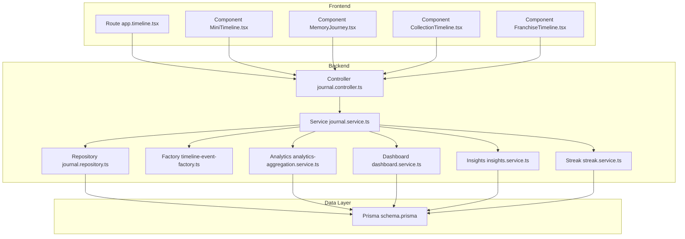
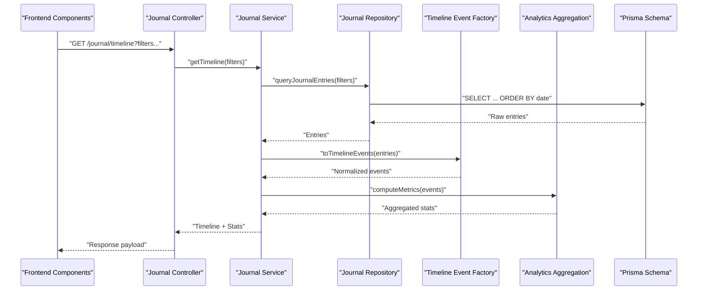
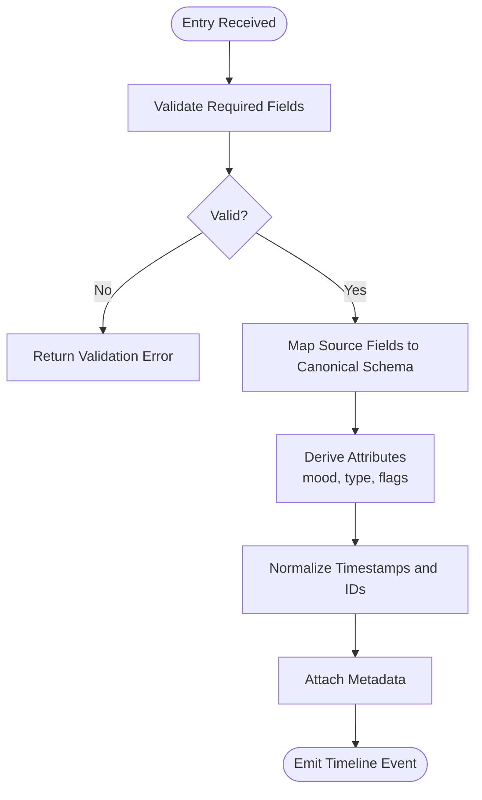
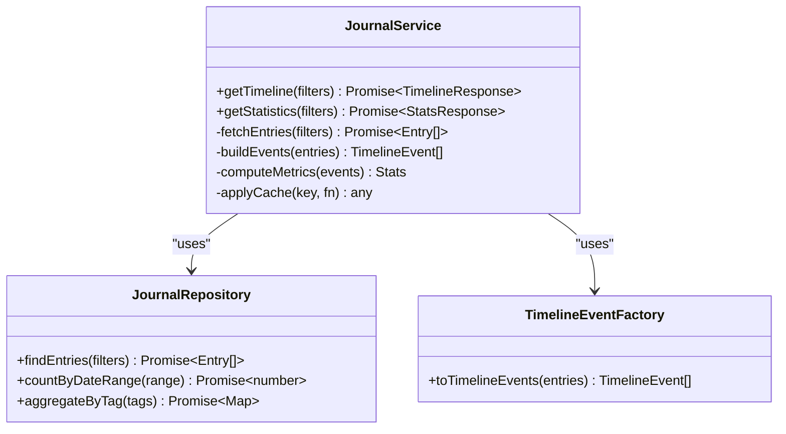
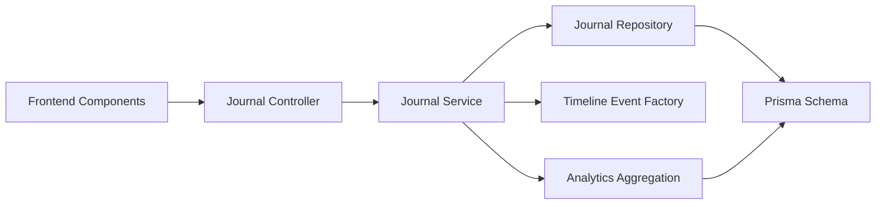

# Timeline Visualization & Statistics

<cite>
**Referenced Files in This Document**
- [timeline-event-factory.ts](file://apps/backend/src/journal/timeline-event-factory.ts)
- [journal-statistics.service.ts](file://apps/backend/src/journal/journal-statistics.service.ts)
- [journal.controller.ts](file://apps/backend/src/journal/journal.controller.ts)
- [journal.service.ts](file://apps/backend/src/journal/journal.service.ts)
- [journal.repository.ts](file://apps/backend/src/journal/journal.repository.ts)
- [analytics-aggregation.service.ts](file://apps/backend/src/analytics/analytics-aggregation.service.ts)
- [dashboard.service.ts](file://apps/backend/src/analytics/dashboard.service.ts)
- [insights.service.ts](file://apps/backend/src/analytics/insights.service.ts)
- [streak.service.ts](file://apps/backend/src/analytics/streak.service.ts)
- [app.timeline.tsx](file://src/routes/app.timeline.tsx)
- [MiniTimeline.tsx](file://src/components/dashboard/MiniTimeline.tsx)
- [MemoryJourney.tsx](file://src/components/memory/MemoryJourney.tsx)
- [CollectionTimeline.tsx](file://src/components/collections/CollectionTimeline.tsx)
- [FranchiseTimeline.tsx](file://src/components/franchise/FranchiseTimeline.tsx)
- [schema.prisma](file://apps/backend/prisma/schema.prisma)
</cite>

## Table of Contents
1. [Introduction](#introduction)
2. [Project Structure](#project-structure)
3. [Core Components](#core-components)
4. [Architecture Overview](#architecture-overview)
5. [Detailed Component Analysis](#detailed-component-analysis)
6. [Dependency Analysis](#dependency-analysis)
7. [Performance Considerations](#performance-considerations)
8. [Troubleshooting Guide](#troubleshooting-guide)
9. [Conclusion](#conclusion)
10. [Appendices](#appendices)

## Introduction
This document explains the Timeline Visualization and Statistics system that aggregates journal data into meaningful insights and visual representations. It covers how journal entries are transformed into timeline events, chronological ordering, filtering, statistics calculation algorithms, caching strategies for performance, and real-time update considerations. It also provides examples for generating custom timelines, calculating engagement metrics, and optimizing query performance for timeline queries.

## Project Structure
The system spans backend services (NestJS), a Prisma-based data layer, and frontend components that render timelines and statistics. Key areas:
- Backend: Journal module for timeline event generation and statistics; Analytics module for aggregation and insights; Prisma schema for data model.
- Frontend: Route and components for rendering timelines and dashboards.

**Diagram sources**
- [app.timeline.tsx](file://src/routes/app.timeline.tsx)
- [MiniTimeline.tsx](file://src/components/dashboard/MiniTimeline.tsx)
- [MemoryJourney.tsx](file://src/components/memory/MemoryJourney.tsx)
- [CollectionTimeline.tsx](file://src/components/collections/CollectionTimeline.tsx)
- [FranchiseTimeline.tsx](file://src/components/franchise/FranchiseTimeline.tsx)
- [journal.controller.ts](file://apps/backend/src/journal/journal.controller.ts)
- [journal.service.ts](file://apps/backend/src/journal/journal.service.ts)
- [journal.repository.ts](file://apps/backend/src/journal/journal.repository.ts)
- [timeline-event-factory.ts](file://apps/backend/src/journal/timeline-event-factory.ts)
- [analytics-aggregation.service.ts](file://apps/backend/src/analytics/analytics-aggregation.service.ts)
- [dashboard.service.ts](file://apps/backend/src/analytics/dashboard.service.ts)
- [insights.service.ts](file://apps/backend/src/analytics/insights.service.ts)
- [streak.service.ts](file://apps/backend/src/analytics/streak.service.ts)
- [schema.prisma](file://apps/backend/prisma/schema.prisma)

**Section sources**
- [journal.controller.ts](file://apps/backend/src/journal/journal.controller.ts)
- [journal.service.ts](file://apps/backend/src/journal/journal.service.ts)
- [journal.repository.ts](file://apps/backend/src/journal/journal.repository.ts)
- [timeline-event-factory.ts](file://apps/backend/src/journal/timeline-event-factory.ts)
- [analytics-aggregation.service.ts](file://apps/backend/src/analytics/analytics-aggregation.service.ts)
- [dashboard.service.ts](file://apps/backend/src/analytics/dashboard.service.ts)
- [insights.service.ts](file://apps/backend/src/analytics/insights.service.ts)
- [streak.service.ts](file://apps/backend/src/analytics/streak.service.ts)
- [schema.prisma](file://apps/backend/prisma/schema.prisma)
- [app.timeline.tsx](file://src/routes/app.timeline.tsx)
- [MiniTimeline.tsx](file://src/components/dashboard/MiniTimeline.tsx)
- [MemoryJourney.tsx](file://src/components/memory/MemoryJourney.tsx)
- [CollectionTimeline.tsx](file://src/components/collections/CollectionTimeline.tsx)
- [FranchiseTimeline.tsx](file://src/components/franchise/FranchiseTimeline.tsx)

## Core Components
- Timeline Event Factory: Transforms raw journal records into normalized timeline events with consistent fields, types, and timestamps.
- Journal Service: Orchestrates fetching, filtering, sorting, and enriching timeline data; coordinates statistics and insights.
- Journal Repository: Encapsulates database queries for efficient retrieval and aggregation.
- Analytics Aggregation Service: Computes time-series metrics, rolling averages, and cohort stats used by timelines and dashboards.
- Dashboard/Insights/Streak Services: Provide higher-level summaries like streaks, daily activity, and insight cards.

Key responsibilities:
- Transform journal entries to timeline events with stable schemas.
- Order chronologically and support filters (date ranges, tags, media types).
- Compute engagement metrics (entries per day, streaks, mood trends).
- Cache hot aggregations and provide real-time updates via events or polling.

**Section sources**
- [timeline-event-factory.ts](file://apps/backend/src/journal/timeline-event-factory.ts)
- [journal.service.ts](file://apps/backend/src/journal/journal.service.ts)
- [journal.repository.ts](file://apps/backend/src/journal/journal.repository.ts)
- [analytics-aggregation.service.ts](file://apps/backend/src/analytics/analytics-aggregation.service.ts)
- [dashboard.service.ts](file://apps/backend/src/analytics/dashboard.service.ts)
- [insights.service.ts](file://apps/backend/src/analytics/insights.service.ts)
- [streak.service.ts](file://apps/backend/src/analytics/streak.service.ts)

## Architecture Overview
The system follows a layered architecture:
- Controllers expose endpoints for timeline and statistics.
- Services implement business logic, orchestrate repositories and analytics.
- Repositories perform optimized queries against Prisma models.
- Factories normalize data into timeline events.
- Frontend routes and components consume APIs and render interactive timelines.

**Diagram sources**
- [journal.controller.ts](file://apps/backend/src/journal/journal.controller.ts)
- [journal.service.ts](file://apps/backend/src/journal/journal.service.ts)
- [journal.repository.ts](file://apps/backend/src/journal/journal.repository.ts)
- [timeline-event-factory.ts](file://apps/backend/src/journal/timeline-event-factory.ts)
- [analytics-aggregation.service.ts](file://apps/backend/src/analytics/analytics-aggregation.service.ts)
- [schema.prisma](file://apps/backend/prisma/schema.prisma)

## Detailed Component Analysis

### Timeline Event Factory
Purpose: Normalize raw journal records into consistent timeline events with standardized fields such as id, type, timestamp, title, summary, tags, and metadata.

Processing flow:
- Validate input record presence and required fields.
- Map source fields to canonical event schema.
- Derive derived attributes (e.g., mood category, media type).
- Ensure deterministic sorting keys (timestamp, id).
- Attach computed flags (e.g., isBookmark, hasMedia).

**Diagram sources**
- [timeline-event-factory.ts](file://apps/backend/src/journal/timeline-event-factory.ts)

**Section sources**
- [timeline-event-factory.ts](file://apps/backend/src/journal/timeline-event-factory.ts)

### Journal Service
Responsibilities:
- Accept filter parameters (date range, tags, media types, search text).
- Fetch entries from repository with pagination and ordering.
- Transform entries using the timeline event factory.
- Compute engagement metrics and attach to response.
- Cache results where appropriate.

**Diagram sources**
- [journal.service.ts](file://apps/backend/src/journal/journal.service.ts)
- [journal.repository.ts](file://apps/backend/src/journal/journal.repository.ts)
- [timeline-event-factory.ts](file://apps/backend/src/journal/timeline-event-factory.ts)

**Section sources**
- [journal.service.ts](file://apps/backend/src/journal/journal.service.ts)
- [journal.repository.ts](file://apps/backend/src/journal/journal.repository.ts)
- [timeline-event-factory.ts](file://apps/backend/src/journal/timeline-event-factory.ts)

### Analytics Aggregation Service
Computes:
- Daily/weekly/monthly entry counts.
- Rolling averages and moving windows.
- Mood distribution and sentiment trends.
- Cohort analysis by tags or categories.

Optimization techniques:
- Pre-aggregate over time buckets.
- Use indexed columns for date and tag filters.
- Memoize expensive computations within request scope.

**Section sources**
- [analytics-aggregation.service.ts](file://apps/backend/src/analytics/analytics-aggregation.service.ts)

### Dashboard, Insights, and Streak Services
- Dashboard service aggregates high-level metrics for overview panels.
- Insights service derives actionable insights (e.g., “most active days”, “top tags”).
- Streak service calculates consecutive activity periods and milestones.

These services feed timeline overlays and stat cards shown in the frontend.

**Section sources**
- [dashboard.service.ts](file://apps/backend/src/analytics/dashboard.service.ts)
- [insights.service.ts](file://apps/backend/src/analytics/insights.service.ts)
- [streak.service.ts](file://apps/backend/src/analytics/streak.service.ts)

### Frontend Timeline Components
Components consume timeline and statistics endpoints to render:
- MiniTimeline: compact view for dashboard.
- MemoryJourney: narrative timeline with highlights.
- CollectionTimeline: collection-scoped timeline.
- FranchiseTimeline: franchise-scoped timeline.

They handle:
- Query parameter construction for filters.
- Pagination and infinite scroll.
- Real-time updates via polling or events.

**Section sources**
- [app.timeline.tsx](file://src/routes/app.timeline.tsx)
- [MiniTimeline.tsx](file://src/components/dashboard/MiniTimeline.tsx)
- [MemoryJourney.tsx](file://src/components/memory/MemoryJourney.tsx)
- [CollectionTimeline.tsx](file://src/components/collections/CollectionTimeline.tsx)
- [FranchiseTimeline.tsx](file://src/components/franchise/FranchiseTimeline.tsx)

## Dependency Analysis
- Controller depends on Service for business logic.
- Service depends on Repository for data access and Factory for normalization.
- Analytics services depend on Prisma models for aggregated queries.
- Frontend components depend on controller endpoints and optional analytics endpoints.

**Diagram sources**
- [journal.controller.ts](file://apps/backend/src/journal/journal.controller.ts)
- [journal.service.ts](file://apps/backend/src/journal/journal.service.ts)
- [journal.repository.ts](file://apps/backend/src/journal/journal.repository.ts)
- [timeline-event-factory.ts](file://apps/backend/src/journal/timeline-event-factory.ts)
- [analytics-aggregation.service.ts](file://apps/backend/src/analytics/analytics-aggregation.service.ts)
- [schema.prisma](file://apps/backend/prisma/schema.prisma)

**Section sources**
- [journal.controller.ts](file://apps/backend/src/journal/journal.controller.ts)
- [journal.service.ts](file://apps/backend/src/journal/journal.service.ts)
- [journal.repository.ts](file://apps/backend/src/journal/journal.repository.ts)
- [timeline-event-factory.ts](file://apps/backend/src/journal/timeline-event-factory.ts)
- [analytics-aggregation.service.ts](file://apps/backend/src/analytics/analytics-aggregation.service.ts)
- [schema.prisma](file://apps/backend/prisma/schema.prisma)

## Performance Considerations
- Indexing: Ensure indexes on date, userId, tags, and mediaType columns used in filters and sorting.
- Pagination: Implement cursor-based or offset pagination to limit payload size.
- Caching: Cache frequent aggregations (daily counts, top tags) with short TTLs; invalidate on write operations.
- Batch Queries: Use batched reads and eager loading to reduce N+1 queries.
- Streaming: For large timelines, stream responses or use server-sent events for incremental updates.
- Denormalization: Maintain lightweight summary tables for hot paths (e.g., daily entry counts).
- Query Optimization: Push down filters to the database; avoid client-side heavy processing.

[No sources needed since this section provides general guidance]

## Troubleshooting Guide
Common issues and resolutions:
- Missing fields in timeline events: Validate inputs in the factory and add explicit error messages.
- Incorrect chronological order: Verify sort keys and timezone handling in repository queries.
- Slow timeline queries: Check execution plans, add missing indexes, and paginate aggressively.
- Stale statistics: Ensure cache invalidation on journal writes and set appropriate TTLs.
- Real-time drift: Implement optimistic updates and reconciliation on the frontend.

**Section sources**
- [timeline-event-factory.ts](file://apps/backend/src/journal/timeline-event-factory.ts)
- [journal.repository.ts](file://apps/backend/src/journal/journal.repository.ts)
- [journal.service.ts](file://apps/backend/src/journal/journal.service.ts)

## Conclusion
The Timeline Visualization and Statistics system transforms journal entries into structured timeline events, computes engagement metrics, and powers rich frontend visualizations. By combining robust backend services, efficient data access, and thoughtful caching, it delivers responsive timelines even at scale. The modular design allows customization of timelines, metrics, and real-time behavior to meet diverse user needs.

[No sources needed since this section summarizes without analyzing specific files]

## Appendices

### Example: Generating Custom Timelines
- Define filters: date range, tags, media types, search keywords.
- Request timeline endpoint with filters.
- Render events using component props (type, timestamp, content).
- Apply client-side sorting if needed for secondary dimensions.

**Section sources**
- [journal.controller.ts](file://apps/backend/src/journal/journal.controller.ts)
- [journal.service.ts](file://apps/backend/src/journal/journal.service.ts)
- [app.timeline.tsx](file://src/routes/app.timeline.tsx)

### Example: Calculating Engagement Metrics
- Compute entries per day over selected window.
- Calculate rolling averages and trend direction.
- Aggregate mood distribution and top tags.
- Surface streaks and milestones.

**Section sources**
- [analytics-aggregation.service.ts](file://apps/backend/src/analytics/analytics-aggregation.service.ts)
- [dashboard.service.ts](file://apps/backend/src/analytics/dashboard.service.ts)
- [insights.service.ts](file://apps/backend/src/analytics/insights.service.ts)
- [streak.service.ts](file://apps/backend/src/analytics/streak.service.ts)

### Example: Optimizing Query Performance
- Add composite indexes for frequently filtered columns.
- Use projection to select only needed fields.
- Paginate with cursors for large datasets.
- Cache aggregate results with short TTLs.

**Section sources**
- [journal.repository.ts](file://apps/backend/src/journal/journal.repository.ts)
- [schema.prisma](file://apps/backend/prisma/schema.prisma)