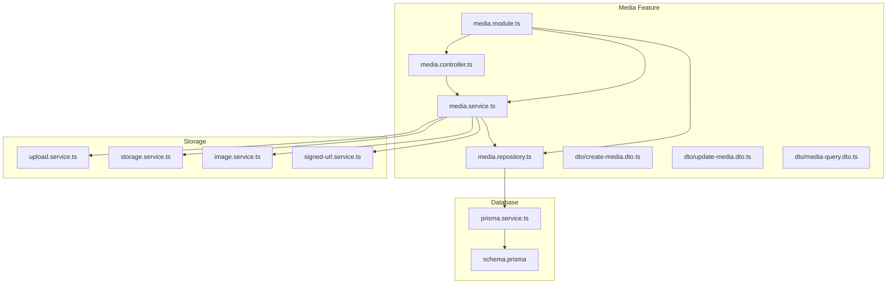
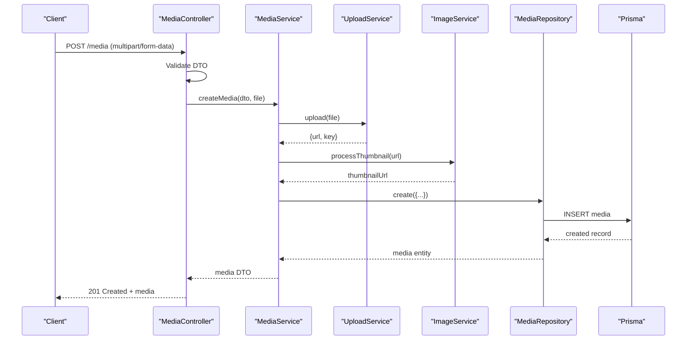
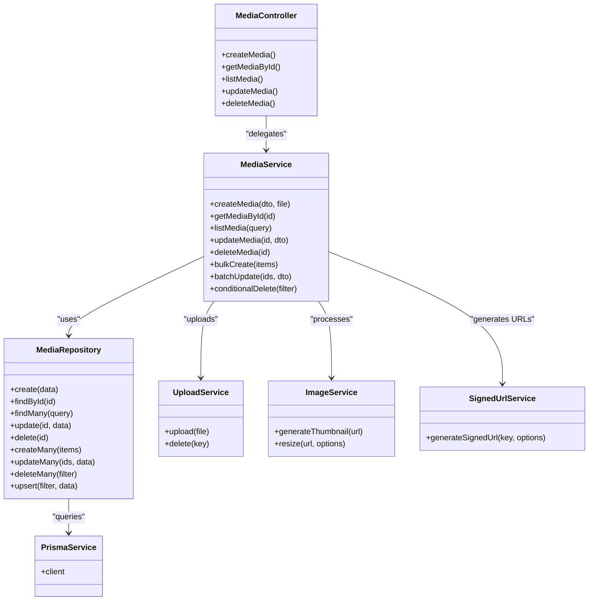
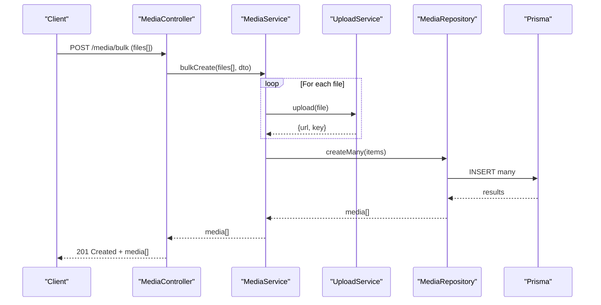
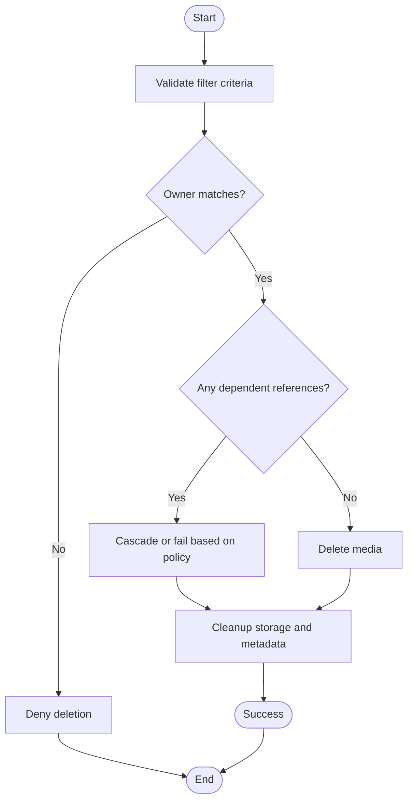
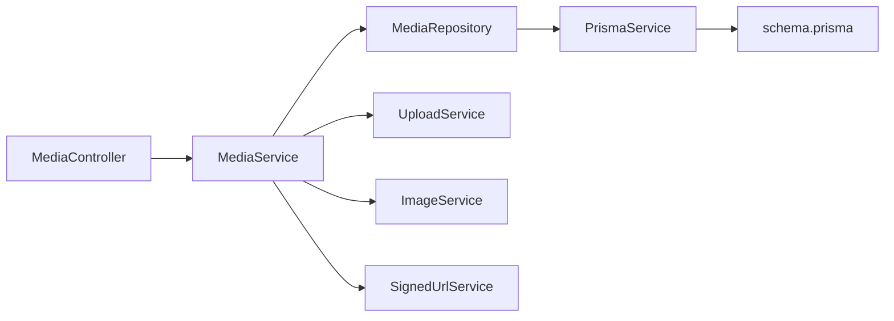

# Media CRUD Operations

<cite>
**Referenced Files in This Document**
- [media.controller.ts](file://apps/backend/src/media/media.controller.ts)
- [media.service.ts](file://apps/backend/src/media/media.service.ts)
- [media.repository.ts](file://apps/backend/src/media/media.repository.ts)
- [media.module.ts](file://apps/backend/src/media/media.module.ts)
- [dto/create-media.dto.ts](file://apps/backend/src/media/dto/create-media.dto.ts)
- [dto/update-media.dto.ts](file://apps/backend/src/media/dto/update-media.dto.ts)
- [dto/media-query.dto.ts](file://apps/backend/src/media/dto/media-query.dto.ts)
- [schema.prisma](file://apps/backend/prisma/schema.prisma)
- [prisma.service.ts](file://apps/backend/src/prisma/prisma.service.ts)
- [transaction.decorator.ts](file://apps/backend/src/core/transaction/transaction.decorator.ts)
- [upload.service.ts](file://apps/backend/src/storage/upload.service.ts)
- [storage.service.ts](file://apps/backend/src/storage/storage.service.ts)
- [image.service.ts](file://apps/backend/src/storage/image.service.ts)
- [signed-url.service.ts](file://apps/backend/src/storage/signed-url.service.ts)
- [media-metadata.service.ts](file://apps/backend/src/media/media-metadata.service.ts)
- [slug.service.ts](file://apps/backend/src/media/slug.service.ts)
</cite>

## Table of Contents
1. [Introduction](#introduction)
2. [Project Structure](#project-structure)
3. [Core Components](#core-components)
4. [Architecture Overview](#architecture-overview)
5. [Detailed Component Analysis](#detailed-component-analysis)
6. [Dependency Analysis](#dependency-analysis)
7. [Performance Considerations](#performance-considerations)
8. [Troubleshooting Guide](#troubleshooting-guide)
9. [Conclusion](#conclusion)
10. [Appendices](#appendices)

## Introduction
This document explains the complete lifecycle of media items through a layered architecture: controllers handle HTTP requests, services implement business logic and orchestration, repositories encapsulate Prisma ORM queries, and DTOs define request validation and response shapes. It covers create, read, update, delete operations; bulk uploads; batch updates; conditional deletions; query optimization; transaction handling; error handling strategies; and data validation rules.

## Project Structure
The media feature is implemented under apps/backend/src/media with associated DTOs and integrations to storage and Prisma. The module wires controllers, services, and repositories together. Storage operations are delegated to dedicated services for upload, image processing, and signed URL generation.

**Diagram sources**
- [media.controller.ts](file://apps/backend/src/media/media.controller.ts)
- [media.service.ts](file://apps/backend/src/media/media.service.ts)
- [media.repository.ts](file://apps/backend/src/media/media.repository.ts)
- [media.module.ts](file://apps/backend/src/media/media.module.ts)
- [upload.service.ts](file://apps/backend/src/storage/upload.service.ts)
- [storage.service.ts](file://apps/backend/src/storage/storage.service.ts)
- [image.service.ts](file://apps/backend/src/storage/image.service.ts)
- [signed-url.service.ts](file://apps/backend/src/storage/signed-url.service.ts)
- [prisma.service.ts](file://apps/backend/src/prisma/prisma.service.ts)
- [schema.prisma](file://apps/backend/prisma/schema.prisma)

**Section sources**
- [media.controller.ts](file://apps/backend/src/media/media.controller.ts)
- [media.service.ts](file://apps/backend/src/media/media.service.ts)
- [media.repository.ts](file://apps/backend/src/media/media.repository.ts)
- [media.module.ts](file://apps/backend/src/media/media.module.ts)
- [schema.prisma](file://apps/backend/prisma/schema.prisma)

## Core Components
- Controller: Exposes REST endpoints for media CRUD and related actions (e.g., upload, list, search, update, delete). Validates input using DTOs and returns standardized responses.
- Service: Implements business logic for media lifecycle, orchestrates storage interactions, metadata extraction, slug generation, and database persistence via repository. Supports transactions for multi-step operations.
- Repository: Encapsulates all Prisma queries, including filtering, pagination, joins, and bulk operations. Provides optimized finders and upserts.
- DTOs: Define strict validation schemas for create, update, and query parameters. Enforce constraints like required fields, formats, and ranges.
- Storage Services: Handle file uploads, image processing, and generating signed URLs for secure access.
- Metadata Service: Extracts or computes media metadata (dimensions, duration, MIME type) as needed.
- Slug Service: Generates URL-safe identifiers for media resources.

**Section sources**
- [media.controller.ts](file://apps/backend/src/media/media.controller.ts)
- [media.service.ts](file://apps/backend/src/media/media.service.ts)
- [media.repository.ts](file://apps/backend/src/media/media.repository.ts)
- [create-media.dto.ts](file://apps/backend/src/media/dto/create-media.dto.ts)
- [update-media.dto.ts](file://apps/backend/src/media/dto/update-media.dto.ts)
- [media-query.dto.ts](file://apps/backend/src/media/dto/media-query.dto.ts)
- [upload.service.ts](file://apps/backend/src/storage/upload.service.ts)
- [storage.service.ts](file://apps/backend/src/storage/storage.service.ts)
- [image.service.ts](file://apps/backend/src/storage/image.service.ts)
- [signed-url.service.ts](file://apps/backend/src/storage/signed-url.service.ts)
- [media-metadata.service.ts](file://apps/backend/src/media/media-metadata.service.ts)
- [slug.service.ts](file://apps/backend/src/media/slug.service.ts)

## Architecture Overview
The system follows a layered pattern with clear separation of concerns:
- Controllers receive HTTP requests, validate inputs via DTOs, and delegate to services.
- Services coordinate domain logic, call repositories for data access, and integrate with storage and metadata services.
- Repositories use Prisma ORM to perform efficient queries and mutations.
- Transactions wrap critical sequences to ensure consistency.

**Diagram sources**
- [media.controller.ts](file://apps/backend/src/media/media.controller.ts)
- [media.service.ts](file://apps/backend/src/media/media.service.ts)
- [upload.service.ts](file://apps/backend/src/storage/upload.service.ts)
- [image.service.ts](file://apps/backend/src/storage/image.service.ts)
- [media.repository.ts](file://apps/backend/src/media/media.repository.ts)
- [prisma.service.ts](file://apps/backend/src/prisma/prisma.service.ts)

## Detailed Component Analysis

### Media Controller
Responsibilities:
- Define routes for media CRUD: create, read by id, read list/search, update, delete.
- Parse and validate multipart form data and JSON payloads using DTOs.
- Return consistent API responses and map errors to appropriate HTTP status codes.

Key behaviors:
- Create endpoint accepts file upload and metadata fields, validates via create DTO.
- Read endpoints support filtering, sorting, and pagination via query DTO.
- Update endpoint supports partial updates via update DTO.
- Delete endpoint enforces ownership and referential integrity checks.

**Section sources**
- [media.controller.ts](file://apps/backend/src/media/media.controller.ts)
- [create-media.dto.ts](file://apps/backend/src/media/dto/create-media.dto.ts)
- [update-media.dto.ts](file://apps/backend/src/media/dto/update-media.dto.ts)
- [media-query.dto.ts](file://apps/backend/src/media/dto/media-query.dto.ts)

### Media Service
Responsibilities:
- Orchestrate media creation: upload file, generate thumbnails, extract metadata, persist via repository.
- Implement read operations: single item retrieval, filtered lists, aggregations.
- Implement update operations: patch fields, reprocess assets if needed, maintain audit timestamps.
- Implement delete operations: soft/hard delete based on policy, cascade cleanup.
- Support bulk operations: batch create, batch update, conditional delete.
- Use transactions for multi-step writes to ensure atomicity.

Common patterns:
- Input normalization and validation before DB calls.
- Delegation to storage services for durable object storage.
- Integration with metadata and slug services for enrichment.
- Error translation into domain exceptions.

Transaction usage:
- Wraps create/update/delete sequences that touch multiple tables or external systems.
- Ensures rollback on failure to prevent partial state.

**Section sources**
- [media.service.ts](file://apps/backend/src/media/media.service.ts)
- [upload.service.ts](file://apps/backend/src/storage/upload.service.ts)
- [image.service.ts](file://apps/backend/src/storage/image.service.ts)
- [media-metadata.service.ts](file://apps/backend/src/media/media-metadata.service.ts)
- [slug.service.ts](file://apps/backend/src/media/slug.service.ts)
- [transaction.decorator.ts](file://apps/backend/src/core/transaction/transaction.decorator.ts)

### Media Repository (Prisma ORM)
Responsibilities:
- Provide typed methods for CRUD against the media table(s).
- Implement complex queries: filtering by tags, categories, dates; sorting; pagination.
- Optimize queries with select/projection, include relations, and indexes.
- Perform bulk operations: createMany, updateMany, deleteMany.
- Upsert operations for idempotent writes.

Query optimization techniques:
- Select only necessary fields to reduce payload size.
- Use where clauses with indexed columns for fast lookups.
- Leverage Prisma’s relation includes efficiently to avoid N+1.
- Batch writes to minimize round-trips.

Transaction handling:
- Execute multiple operations within a single Prisma transaction block.
- Roll back on any error to maintain consistency.

**Section sources**
- [media.repository.ts](file://apps/backend/src/media/media.repository.ts)
- [prisma.service.ts](file://apps/backend/src/prisma/prisma.service.ts)
- [schema.prisma](file://apps/backend/prisma/schema.prisma)

### DTOs and Validation
Create Media DTO:
- Required fields: title, type, source URL or file reference, owner/user context.
- Optional fields: description, tags, category, custom metadata.
- Validation rules: non-empty strings, allowed MIME types, size limits enforced upstream.

Update Media DTO:
- Partial fields: title, description, tags, category, visibility, custom metadata.
- Validation rules: field presence, format constraints, allowed enum values.

Media Query DTO:
- Filters: tag, category, date range, owner, status.
- Sorting: by createdAt, updatedAt, title.
- Pagination: page, limit with defaults and bounds.

Response formatting:
- Consistent envelope with data, meta (pagination), and optional links.
- Omit sensitive fields from responses.

**Section sources**
- [create-media.dto.ts](file://apps/backend/src/media/dto/create-media.dto.ts)
- [update-media.dto.ts](file://apps/backend/src/media/dto/update-media.dto.ts)
- [media-query.dto.ts](file://apps/backend/src/media/dto/media-query.dto.ts)

### Storage Integration
Upload flow:
- Accept multipart file, validate size/type, upload to storage backend.
- Generate unique keys and return stable URLs.
- Trigger image processing for thumbnails and derivatives.

Signed URLs:
- Generate time-limited signed URLs for private assets.
- Integrate with storage provider SDKs.

Error handling:
- Map storage failures to meaningful exceptions.
- Retry policies for transient network issues.

**Section sources**
- [upload.service.ts](file://apps/backend/src/storage/upload.service.ts)
- [storage.service.ts](file://apps/backend/src/storage/storage.service.ts)
- [image.service.ts](file://apps/backend/src/storage/image.service.ts)
- [signed-url.service.ts](file://apps/backend/src/storage/signed-url.service.ts)

### Metadata and Slug Generation
Metadata service:
- Extract dimensions, duration, MIME type, and other properties from uploaded files.
- Normalize and store structured metadata alongside media records.

Slug service:
- Generate URL-friendly slugs from titles or IDs.
- Ensure uniqueness and collision resolution.

**Section sources**
- [media-metadata.service.ts](file://apps/backend/src/media/media-metadata.service.ts)
- [slug.service.ts](file://apps/backend/src/media/slug.service.ts)

### Class Diagram

**Diagram sources**
- [media.controller.ts](file://apps/backend/src/media/media.controller.ts)
- [media.service.ts](file://apps/backend/src/media/media.service.ts)
- [media.repository.ts](file://apps/backend/src/media/media.repository.ts)
- [upload.service.ts](file://apps/backend/src/storage/upload.service.ts)
- [image.service.ts](file://apps/backend/src/storage/image.service.ts)
- [signed-url.service.ts](file://apps/backend/src/storage/signed-url.service.ts)
- [prisma.service.ts](file://apps/backend/src/prisma/prisma.service.ts)

### Sequence Diagram: Bulk Upload

**Diagram sources**
- [media.controller.ts](file://apps/backend/src/media/media.controller.ts)
- [media.service.ts](file://apps/backend/src/media/media.service.ts)
- [upload.service.ts](file://apps/backend/src/storage/upload.service.ts)
- [media.repository.ts](file://apps/backend/src/media/media.repository.ts)
- [prisma.service.ts](file://apps/backend/src/prisma/prisma.service.ts)

### Flowchart: Conditional Deletion

**Diagram sources**
- [media.service.ts](file://apps/backend/src/media/media.service.ts)
- [media.repository.ts](file://apps/backend/src/media/media.repository.ts)

## Dependency Analysis
- Controller depends on DTOs for validation and on the service for business logic.
- Service depends on repository for data access and on storage/metadata services for side effects.
- Repository depends on Prisma service and schema definitions.
- Module wires dependencies and provides DI bindings.

**Diagram sources**
- [media.controller.ts](file://apps/backend/src/media/media.controller.ts)
- [media.service.ts](file://apps/backend/src/media/media.service.ts)
- [media.repository.ts](file://apps/backend/src/media/media.repository.ts)
- [upload.service.ts](file://apps/backend/src/storage/upload.service.ts)
- [image.service.ts](file://apps/backend/src/storage/image.service.ts)
- [signed-url.service.ts](file://apps/backend/src/storage/signed-url.service.ts)
- [prisma.service.ts](file://apps/backend/src/prisma/prisma.service.ts)
- [schema.prisma](file://apps/backend/prisma/schema.prisma)

**Section sources**
- [media.module.ts](file://apps/backend/src/media/media.module.ts)

## Performance Considerations
- Use selective projections in Prisma queries to minimize payload sizes.
- Apply proper indexing on frequently filtered columns (e.g., owner_id, category, tags).
- Batch writes with createMany/updateMany/deleteMany to reduce round-trips.
- Avoid N+1 queries by using include/select judiciously.
- Cache frequent reads where appropriate (e.g., popular media listings).
- Stream large file uploads and process images asynchronously when possible.
- Use transactions to group related writes and reduce lock contention.

[No sources needed since this section provides general guidance]

## Troubleshooting Guide
Common issues and resolutions:
- Validation errors: Ensure DTOs match client payloads; check required fields and formats.
- Upload failures: Verify storage credentials, bucket permissions, and file size limits.
- Duplicate entries: Use upsert operations and enforce unique constraints at the schema level.
- Slow queries: Analyze Prisma query logs, add indexes, and refine filters.
- Transaction rollbacks: Inspect error messages and ensure all steps succeed or fail atomically.
- Missing metadata: Confirm metadata extraction pipeline runs successfully post-upload.

Operational tips:
- Enable detailed logging around storage and DB operations.
- Monitor error rates and latency for media endpoints.
- Use health checks to verify storage and database connectivity.

**Section sources**
- [media.service.ts](file://apps/backend/src/media/media.service.ts)
- [media.repository.ts](file://apps/backend/src/media/media.repository.ts)
- [upload.service.ts](file://apps/backend/src/storage/upload.service.ts)
- [image.service.ts](file://apps/backend/src/storage/image.service.ts)
- [signed-url.service.ts](file://apps/backend/src/storage/signed-url.service.ts)

## Conclusion
The media CRUD implementation follows a clean, testable architecture with strong separation between HTTP handling, business logic, and data access. DTOs enforce robust validation, while the repository layer leverages Prisma for efficient and maintainable queries. Storage integration ensures reliable file handling and asset processing. Transactions and error handling provide reliability and consistency across the media lifecycle.

[No sources needed since this section summarizes without analyzing specific files]

## Appendices

### Example Operations

- Create media:
  - Endpoint: POST /media
  - Payload: multipart/form-data with file and metadata fields validated by create DTO.
  - Response: Created media DTO.

- Read media:
  - Single: GET /media/:id
  - List: GET /media?filters&sort&page&limit using media query DTO.

- Update media:
  - PATCH /media/:id with partial fields validated by update DTO.

- Delete media:
  - DELETE /media/:id with ownership and referential checks.

- Bulk upload:
  - POST /media/bulk with array of files; service batches uploads and persists records.

- Batch update:
  - PATCH /media/batch with ids and partial fields; repository performs updateMany.

- Conditional deletion:
  - DELETE /media?filter=... with ownership and dependency checks; cascades or fails per policy.

**Section sources**
- [media.controller.ts](file://apps/backend/src/media/media.controller.ts)
- [media.service.ts](file://apps/backend/src/media/media.service.ts)
- [media.repository.ts](file://apps/backend/src/media/media.repository.ts)
- [create-media.dto.ts](file://apps/backend/src/media/dto/create-media.dto.ts)
- [update-media.dto.ts](file://apps/backend/src/media/dto/update-media.dto.ts)
- [media-query.dto.ts](file://apps/backend/src/media/dto/media-query.dto.ts)