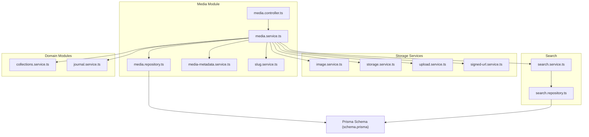
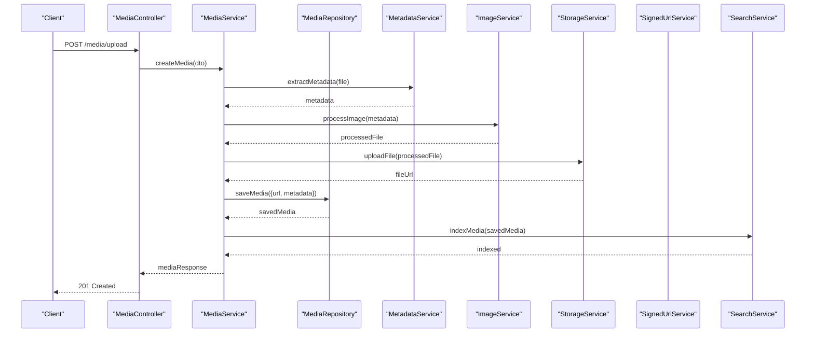
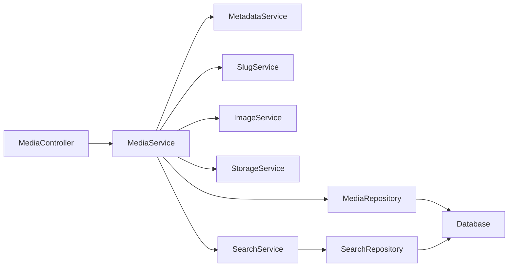

# Media Management Module

<cite>
**Referenced Files in This Document**
- [media.controller.ts](file://apps/backend/src/media/media.controller.ts)
- [media.service.ts](file://apps/backend/src/media/media.service.ts)
- [media.repository.ts](file://apps/backend/src/media/media.repository.ts)
- [media-metadata.service.ts](file://apps/backend/src/media/media-metadata.service.ts)
- [slug.service.ts](file://apps/backend/src/media/slug.service.ts)
- [media.module.ts](file://apps/backend/src/media/media.module.ts)
- [image.service.ts](file://apps/backend/src/storage/image.service.ts)
- [storage.service.ts](file://apps/backend/src/storage/storage.service.ts)
- [upload.service.ts](file://apps/backend/src/storage/upload.service.ts)
- [signed-url.service.ts](file://apps/backend/src/storage/signed-url.service.ts)
- [search.service.ts](file://apps/backend/src/search/search.service.ts)
- [search.repository.ts](file://apps/backend/src/search/search.repository.ts)
- [schema.prisma](file://apps/backend/prisma/schema.prisma)
- [collections.service.ts](file://apps/backend/src/collections/collections.service.ts)
- [journal.service.ts](file://apps/backend/src/journal/journal.service.ts)
</cite>

## Table of Contents
1. [Introduction](#introduction)
2. [Project Structure](#project-structure)
3. [Core Components](#core-components)
4. [Architecture Overview](#architecture-overview)
5. [Detailed Component Analysis](#detailed-component-analysis)
6. [Dependency Analysis](#dependency-analysis)
7. [Performance Considerations](#performance-considerations)
8. [Troubleshooting Guide](#troubleshooting-guide)
9. [Conclusion](#conclusion)

## Introduction
This document provides comprehensive documentation for the Media Management Module responsible for media item CRUD operations, metadata extraction, image processing, and search functionality. It explains the service layer with media lifecycle management, repository patterns for database operations, DTOs for data validation, slug generation, metadata processing, integration with storage services, and search implementation with filtering capabilities. It also covers performance optimization strategies, caching mechanisms, and relationships between media items and other entities such as collections and journal entries.

## Project Structure
The Media Management Module is implemented within the backend NestJS application under apps/backend/src/media. It integrates with storage services (apps/backend/src/storage), search (apps/backend/src/search), and domain modules like collections and journal. The data model is defined using Prisma schema.

**Diagram sources**
- [media.controller.ts](file://apps/backend/src/media/media.controller.ts)
- [media.service.ts](file://apps/backend/src/media/media.service.ts)
- [media.repository.ts](file://apps/backend/src/media/media.repository.ts)
- [media-metadata.service.ts](file://apps/backend/src/media/media-metadata.service.ts)
- [slug.service.ts](file://apps/backend/src/media/slug.service.ts)
- [image.service.ts](file://apps/backend/src/storage/image.service.ts)
- [storage.service.ts](file://apps/backend/src/storage/storage.service.ts)
- [upload.service.ts](file://apps/backend/src/storage/upload.service.ts)
- [signed-url.service.ts](file://apps/backend/src/storage/signed-url.service.ts)
- [search.service.ts](file://apps/backend/src/search/search.service.ts)
- [search.repository.ts](file://apps/backend/src/search/search.repository.ts)
- [schema.prisma](file://apps/backend/prisma/schema.prisma)
- [collections.service.ts](file://apps/backend/src/collections/collections.service.ts)
- [journal.service.ts](file://apps/backend/src/journal/journal.service.ts)

**Section sources**
- [media.module.ts](file://apps/backend/src/media/media.module.ts)
- [schema.prisma](file://apps/backend/prisma/schema.prisma)

## Core Components
- Media Controller: Exposes HTTP endpoints for media CRUD, upload, metadata retrieval, and deletion.
- Media Service: Orchestrates media lifecycle including creation, updates, deletion, thumbnail generation, and metadata extraction.
- Media Repository: Encapsulates database operations for media items using Prisma client.
- Metadata Service: Extracts and normalizes media metadata from files or external sources.
- Slug Service: Generates URL-friendly slugs for media items to ensure unique, readable identifiers.
- Storage Integration: Uses image processing and storage services for file handling, transformations, and signed URLs.
- Search Integration: Provides search and filtering capabilities across media items.

Key responsibilities:
- Validate inputs via DTOs before persistence.
- Manage media state transitions (e.g., pending -> processed).
- Coordinate asynchronous tasks for heavy operations (metadata extraction, image processing).
- Ensure referential integrity with collections and journal entries.

**Section sources**
- [media.controller.ts](file://apps/backend/src/media/media.controller.ts)
- [media.service.ts](file://apps/backend/src/media/media.service.ts)
- [media.repository.ts](file://apps/backend/src/media/media.repository.ts)
- [media-metadata.service.ts](file://apps/backend/src/media/media-metadata.service.ts)
- [slug.service.ts](file://apps/backend/src/media/slug.service.ts)

## Architecture Overview
The module follows a layered architecture:
- Controller layer handles HTTP requests and responses.
- Service layer implements business logic and orchestrates workflows.
- Repository layer abstracts database interactions.
- Domain services handle cross-cutting concerns like metadata extraction and slug generation.
- Storage services manage file uploads, transformations, and access control.
- Search services provide indexing and querying capabilities.

**Diagram sources**
- [media.controller.ts](file://apps/backend/src/media/media.controller.ts)
- [media.service.ts](file://apps/backend/src/media/media.service.ts)
- [media.repository.ts](file://apps/backend/src/media/media.repository.ts)
- [media-metadata.service.ts](file://apps/backend/src/media/media-metadata.service.ts)
- [image.service.ts](file://apps/backend/src/storage/image.service.ts)
- [storage.service.ts](file://apps/backend/src/storage/storage.service.ts)
- [signed-url.service.ts](file://apps/backend/src/storage/signed-url.service.ts)
- [search.service.ts](file://apps/backend/src/search/search.service.ts)

## Detailed Component Analysis

### Media Controller
Responsibilities:
- Define REST endpoints for media CRUD, upload, metadata retrieval, and deletion.
- Validate request payloads using DTOs.
- Delegate business logic to MediaService.

Key endpoints:
- Create media (upload + metadata extraction)
- Update media metadata
- Delete media
- Retrieve media by ID or slug
- List media with pagination and filters

Error handling:
- Return standardized error responses for validation failures and storage errors.

**Section sources**
- [media.controller.ts](file://apps/backend/src/media/media.controller.ts)

### Media Service
Responsibilities:
- Orchestrate media lifecycle: create, update, delete, and retrieve.
- Coordinate metadata extraction and image processing.
- Manage transactions for consistency when updating related entities.
- Integrate with search indexing and storage services.

Lifecycle states:
- Pending: Upload initiated, awaiting processing.
- Processing: Metadata extraction and image processing in progress.
- Processed: Ready for use; thumbnails generated and metadata normalized.
- Archived: Soft-deleted or marked inactive.

Optimization strategies:
- Use background jobs for heavy operations (metadata extraction, image resizing).
- Implement idempotency for upload endpoints to prevent duplicates.
- Batch updates when modifying multiple media items.

Caching mechanisms:
- Cache frequently accessed metadata and thumbnails.
- Invalidate cache on media updates or deletions.

**Section sources**
- [media.service.ts](file://apps/backend/src/media/media.service.ts)

### Media Repository
Responsibilities:
- Provide data access methods for media items using Prisma.
- Implement efficient queries with filtering, sorting, and pagination.
- Handle relationships with collections and journal entries.

Common operations:
- Find by ID, slug, or user context.
- Bulk insert/update for batch operations.
- Soft delete with cascade rules for related entities.

Indexing considerations:
- Add database indexes for frequently queried fields (e.g., user_id, type, status).
- Use composite indexes for complex filter combinations.

**Section sources**
- [media.repository.ts](file://apps/backend/src/media/media.repository.ts)
- [schema.prisma](file://apps/backend/prisma/schema.prisma)

### Metadata Service
Responsibilities:
- Extract metadata from uploaded files (e.g., dimensions, duration, format).
- Normalize metadata into a consistent structure.
- Validate metadata against expected schemas.

Processing pipeline:
- Detect file type and choose appropriate extractor.
- Parse binary headers or container formats.
- Enrich with derived properties (e.g., aspect ratio, bitrate).

Error handling:
- Gracefully handle unsupported formats and corrupted files.
- Log warnings for missing metadata fields.

**Section sources**
- [media-metadata.service.ts](file://apps/backend/src/media/media-metadata.service.ts)

### Slug Service
Responsibilities:
- Generate URL-friendly slugs from media titles or names.
- Ensure uniqueness by appending suffixes if necessary.
- Sanitize input to remove invalid characters.

Algorithm overview:
- Convert to lowercase and replace spaces with hyphens.
- Remove non-alphanumeric characters except hyphens.
- Check existing slugs and append incremental suffixes.

Performance considerations:
- Cache slug lookups to reduce database queries.
- Pre-generate slugs during media creation.

**Section sources**
- [slug.service.ts](file://apps/backend/src/media/slug.service.ts)

### Storage Integration
Components:
- ImageService: Handles image transformations (resize, crop, format conversion).
- StorageService: Manages file uploads, downloads, and cleanup.
- UploadService: Coordinates multipart uploads and temporary storage.
- SignedUrlService: Generates time-limited access URLs for secure downloads.

Workflow:
- Validate file types and sizes.
- Store original files in secure storage.
- Generate optimized versions for different devices.
- Return signed URLs for authenticated access.

Security measures:
- Validate content types to prevent malicious uploads.
- Limit file sizes based on media type.
- Use signed URLs with expiration times.

**Section sources**
- [image.service.ts](file://apps/backend/src/storage/image.service.ts)
- [storage.service.ts](file://apps/backend/src/storage/storage.service.ts)
- [upload.service.ts](file://apps/backend/src/storage/upload.service.ts)
- [signed-url.service.ts](file://apps/backend/src/storage/signed-url.service.ts)

### Search Implementation
Capabilities:
- Full-text search across media titles, descriptions, and tags.
- Filter by type, date range, user, and collection membership.
- Sort by relevance, date, or custom criteria.

Architecture:
- SearchService coordinates query parsing and result aggregation.
- SearchRepository executes optimized database queries or external search engines.
- Indexing ensures fast retrieval through precomputed structures.

Filtering features:
- Type-based filtering (image, video, audio).
- Date range filters for temporal searches.
- Collection membership filters.
- User-specific scoping for privacy.

Performance optimizations:
- Use database indexes on searchable columns.
- Implement query caching for common searches.
- Paginate results to reduce payload size.

**Section sources**
- [search.service.ts](file://apps/backend/src/search/search.service.ts)
- [search.repository.ts](file://apps/backend/src/search/search.repository.ts)

### Relationships with Collections and Journal Entries
Media items can be associated with:
- Collections: Groupings of media for thematic organization.
- Journal entries: Personal reflections or notes linked to specific media.

Relationships:
- Many-to-many between media and collections via junction tables.
- One-to-many from media to journal entries for annotations.

Data integrity:
- Enforce foreign key constraints to maintain referential integrity.
- Cascade deletes to clean up related records.

Query patterns:
- Fetch media within a collection with pagination.
- Retrieve journal entries for a specific media item.

**Section sources**
- [collections.service.ts](file://apps/backend/src/collections/collections.service.ts)
- [journal.service.ts](file://apps/backend/src/journal/journal.service.ts)
- [schema.prisma](file://apps/backend/prisma/schema.prisma)

## Dependency Analysis
The Media Management Module has well-defined dependencies:
- Internal dependencies: Controllers depend on services, services depend on repositories and domain services.
- External dependencies: Storage services for file operations, search services for querying, and Prisma for database access.

Coupling and cohesion:
- High cohesion within each component (single responsibility).
- Low coupling through interfaces and dependency injection.

Potential circular dependencies:
- Avoid direct imports between media and domain modules; use event-driven communication where possible.

External integrations:
- Storage providers (cloud or local filesystem).
- Search engines (database-native or external like Elasticsearch).

**Diagram sources**
- [media.controller.ts](file://apps/backend/src/media/media.controller.ts)
- [media.service.ts](file://apps/backend/src/media/media.service.ts)
- [media.repository.ts](file://apps/backend/src/media/media.repository.ts)
- [media-metadata.service.ts](file://apps/backend/src/media/media-metadata.service.ts)
- [slug.service.ts](file://apps/backend/src/media/slug.service.ts)
- [image.service.ts](file://apps/backend/src/storage/image.service.ts)
- [storage.service.ts](file://apps/backend/src/storage/storage.service.ts)
- [search.service.ts](file://apps/backend/src/search/search.service.ts)
- [search.repository.ts](file://apps/backend/src/search/search.repository.ts)
- [schema.prisma](file://apps/backend/prisma/schema.prisma)

**Section sources**
- [media.module.ts](file://apps/backend/src/media/media.module.ts)

## Performance Considerations
- Database optimization:
  - Use appropriate indexes for frequently queried columns.
  - Implement connection pooling for database efficiency.
  - Optimize N+1 queries with eager loading.

- Caching strategies:
  - Cache metadata and thumbnails in memory or Redis.
  - Implement cache invalidation on media updates.
  - Use CDN for static assets like images and videos.

- Asynchronous processing:
  - Offload heavy operations to background jobs.
  - Use message queues for scalable task distribution.

- Query optimization:
  - Limit result sets with pagination.
  - Use selective field projection to reduce payload size.
  - Implement query timeouts to prevent long-running operations.

- Storage optimization:
  - Compress images and videos for faster transfers.
  - Use adaptive bitrate streaming for videos.
  - Implement lazy loading for large media files.

[No sources needed since this section provides general guidance]

## Troubleshooting Guide
Common issues and solutions:
- Upload failures:
  - Check file size limits and supported formats.
  - Verify storage service connectivity and permissions.
  - Review error logs for specific failure reasons.

- Metadata extraction errors:
  - Validate file integrity and format compatibility.
  - Handle corrupted files gracefully with fallback metadata.
  - Log detailed error information for debugging.

- Search performance issues:
  - Monitor query execution times and optimize indexes.
  - Implement query caching for frequent searches.
  - Scale search infrastructure horizontally if needed.

- Relationship integrity problems:
  - Verify foreign key constraints and cascade rules.
  - Use database migrations to fix schema inconsistencies.
  - Implement soft deletes to preserve relationship history.

Debugging utilities:
- Enable detailed logging for media operations.
- Use correlation IDs to trace requests across services.
- Implement health checks for storage and search services.

**Section sources**
- [media.service.ts](file://apps/backend/src/media/media.service.ts)
- [media-metadata.service.ts](file://apps/backend/src/media/media-metadata.service.ts)
- [search.service.ts](file://apps/backend/src/search/search.service.ts)

## Conclusion
The Media Management Module provides a robust foundation for handling media items with comprehensive CRUD operations, metadata extraction, image processing, and search capabilities. Its layered architecture ensures maintainability and scalability, while integration with storage and search services enables efficient file management and discovery. Proper relationship management with collections and journal entries enhances the user experience by providing contextual organization and personalization. Performance optimizations and caching mechanisms ensure responsive operations even with large media libraries.

[No sources needed since this section summarizes without analyzing specific files]