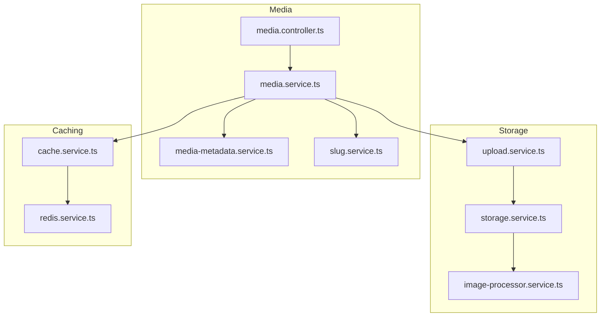
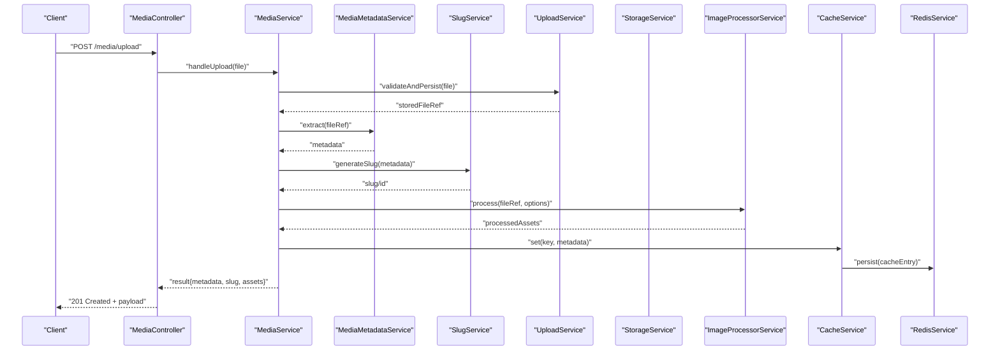
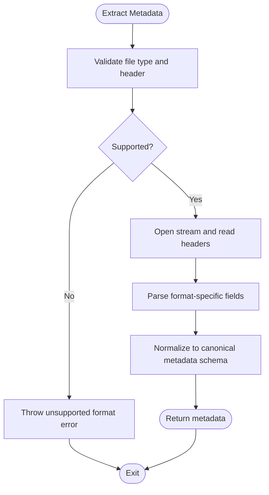
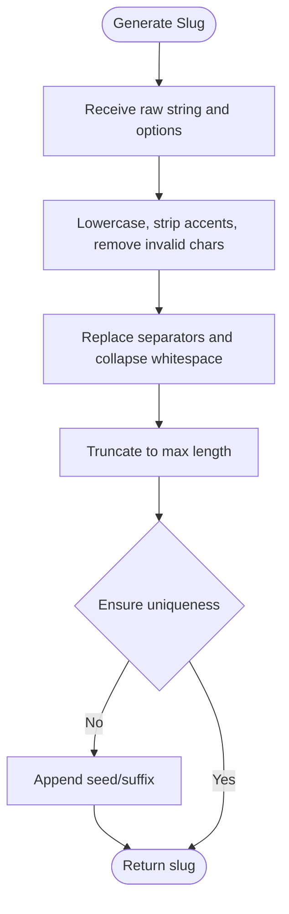
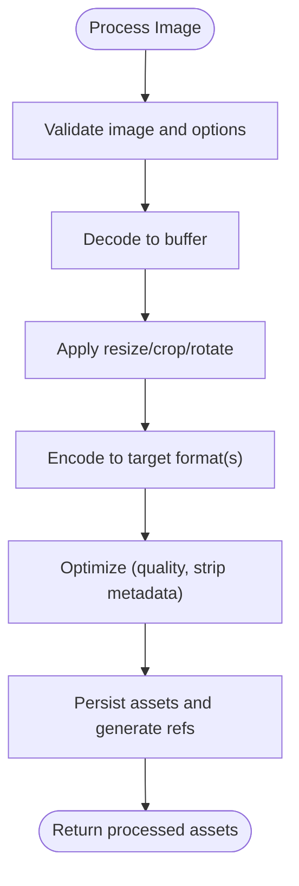
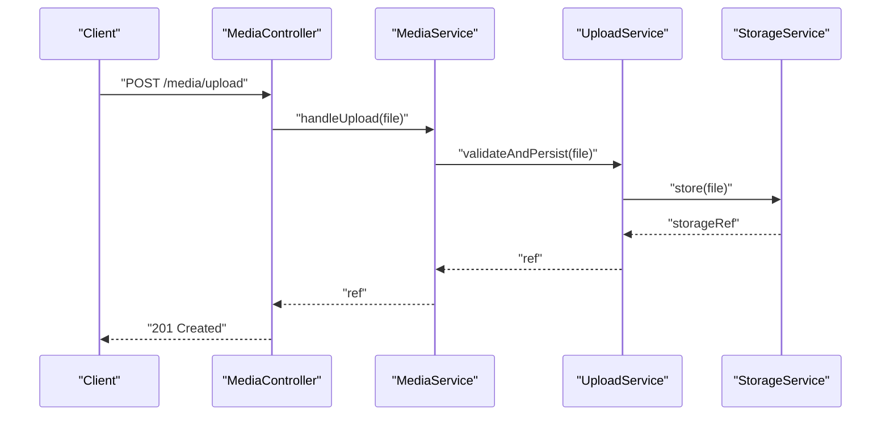
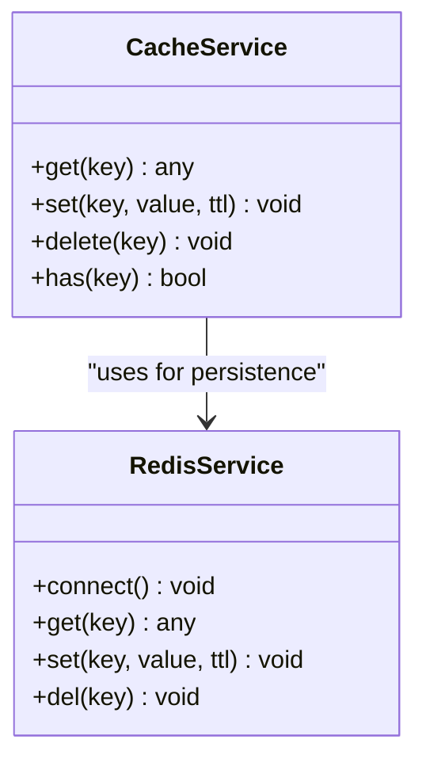
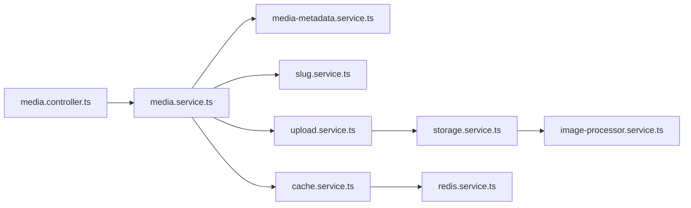

# Media Metadata Processing

<cite>
**Referenced Files in This Document**
- [media-metadata.service.ts](file://apps/backend/src/media/media-metadata.service.ts)
- [slug.service.ts](file://apps/backend/src/media/slug.service.ts)
- [image-processor.service.ts](file://apps/backend/src/storage/image-processor.service.ts)
- [storage.service.ts](file://apps/backend/src/storage/storage.service.ts)
- [upload.service.ts](file://apps/backend/src/storage/upload.service.ts)
- [media.controller.ts](file://apps/backend/src/media/media.controller.ts)
- [media.service.ts](file://apps/backend/src/media/media.service.ts)
- [cache.service.ts](file://apps/backend/src/hardening/cache.service.ts)
- [redis.service.ts](file://apps/backend/src/redis/redis.service.ts)
</cite>

## Table of Contents
1. [Introduction](#introduction)
2. [Project Structure](#project-structure)
3. [Core Components](#core-components)
4. [Architecture Overview](#architecture-overview)
5. [Detailed Component Analysis](#detailed-component-analysis)
6. [Dependency Analysis](#dependency-analysis)
7. [Performance Considerations](#performance-considerations)
8. [Troubleshooting Guide](#troubleshooting-guide)
9. [Conclusion](#conclusion)

## Introduction
This document explains the media metadata processing capabilities, focusing on:
- Extracting metadata for images, videos, and audio files (dimensions, duration, file size, format details).
- Generating SEO-friendly slugs and unique identifiers.
- The image processing pipeline including thumbnail generation, format conversion, and optimization.
- Caching strategies for metadata and performance considerations for large files.
- Error handling for corrupted or unsupported formats.

## Project Structure
The relevant backend modules are organized under apps/backend/src with clear separation of concerns:
- Media module: metadata extraction and slug generation services, controller, and service orchestration.
- Storage module: upload handling, storage abstraction, and image processing pipeline.
- Hardening and Redis modules: caching utilities and Redis integration.

**Diagram sources**
- [media.controller.ts](file://apps/backend/src/media/media.controller.ts)
- [media.service.ts](file://apps/backend/src/media/media.service.ts)
- [media-metadata.service.ts](file://apps/backend/src/media/media-metadata.service.ts)
- [slug.service.ts](file://apps/backend/src/media/slug.service.ts)
- [upload.service.ts](file://apps/backend/src/storage/upload.service.ts)
- [storage.service.ts](file://apps/backend/src/storage/storage.service.ts)
- [image-processor.service.ts](file://apps/backend/src/storage/image-processor.service.ts)
- [cache.service.ts](file://apps/backend/src/hardening/cache.service.ts)
- [redis.service.ts](file://apps/backend/src/redis/redis.service.ts)

**Section sources**
- [media.controller.ts](file://apps/backend/src/media/media.controller.ts)
- [media.service.ts](file://apps/backend/src/media/media.service.ts)
- [media-metadata.service.ts](file://apps/backend/src/media/media-metadata.service.ts)
- [slug.service.ts](file://apps/backend/src/media/slug.service.ts)
- [upload.service.ts](file://apps/backend/src/storage/upload.service.ts)
- [storage.service.ts](file://apps/backend/src/storage/storage.service.ts)
- [image-processor.service.ts](file://apps/backend/src/storage/image-processor.service.ts)
- [cache.service.ts](file://apps/backend/src/hardening/cache.service.ts)
- [redis.service.ts](file://apps/backend/src/redis/redis.service.ts)

## Core Components
- Media Metadata Service: extracts structured metadata from uploaded media (images, videos, audio), including dimensions, duration, file size, MIME type, codec info where available.
- Slug Service: generates URL-safe, SEO-friendly slugs and unique identifiers based on input content and optional seeds.
- Image Processor Service: implements thumbnail generation, format conversion, and optimization (e.g., resizing, quality tuning).
- Upload and Storage Services: handle incoming uploads, validate types/sizes, persist to storage, and coordinate downstream processing.
- Cache and Redis Services: provide in-memory and distributed caching for metadata and processed assets.

**Section sources**
- [media-metadata.service.ts](file://apps/backend/src/media/media-metadata.service.ts)
- [slug.service.ts](file://apps/backend/src/media/slug.service.ts)
- [image-processor.service.ts](file://apps/backend/src/storage/image-processor.service.ts)
- [upload.service.ts](file://apps/backend/src/storage/upload.service.ts)
- [storage.service.ts](file://apps/backend/src/storage/storage.service.ts)
- [cache.service.ts](file://apps/backend/src/hardening/cache.service.ts)
- [redis.service.ts](file://apps/backend/src/redis/redis.service.ts)

## Architecture Overview
The media processing flow integrates HTTP endpoints, orchestration services, metadata extraction, storage, and image processing with caching.

**Diagram sources**
- [media.controller.ts](file://apps/backend/src/media/media.controller.ts)
- [media.service.ts](file://apps/backend/src/media/media.service.ts)
- [media-metadata.service.ts](file://apps/backend/src/media/media-metadata.service.ts)
- [slug.service.ts](file://apps/backend/src/media/slug.service.ts)
- [upload.service.ts](file://apps/backend/src/storage/upload.service.ts)
- [storage.service.ts](file://apps/backend/src/storage/storage.service.ts)
- [image-processor.service.ts](file://apps/backend/src/storage/image-processor.service.ts)
- [cache.service.ts](file://apps/backend/src/hardening/cache.service.ts)
- [redis.service.ts](file://apps/backend/src/redis/redis.service.ts)

## Detailed Component Analysis

### Media Metadata Extraction
Responsibilities:
- Detect media type and validate supported formats.
- Read file headers/stream to extract:
  - Images: width, height, aspect ratio, color space, orientation.
  - Videos: duration, resolution, frame rate, codecs.
  - Audio: duration, sample rate, channels, bitrate, codec.
- Return normalized metadata structure suitable for persistence and UI display.

Key behaviors:
- Stream-based reading to avoid loading entire files into memory.
- Graceful fallbacks when specific properties are unavailable.
- Consistent error taxonomy for unsupported/corrupted inputs.

**Diagram sources**
- [media-metadata.service.ts](file://apps/backend/src/media/media-metadata.service.ts)

**Section sources**
- [media-metadata.service.ts](file://apps/backend/src/media/media-metadata.service.ts)

### Slug Generation Service
Responsibilities:
- Generate SEO-friendly slugs from titles, filenames, or other text inputs.
- Produce stable, unique identifiers for media records.
- Sanitize and normalize strings (lowercase, remove special characters, replace spaces).

Key behaviors:
- Deterministic output for identical inputs.
- Optional seed or suffix to ensure uniqueness across collisions.
- Configurable length limits and character sets.

**Diagram sources**
- [slug.service.ts](file://apps/backend/src/media/slug.service.ts)

**Section sources**
- [slug.service.ts](file://apps/backend/src/media/slug.service.ts)

### Image Processing Pipeline
Responsibilities:
- Thumbnail generation at multiple sizes.
- Format conversion (e.g., PNG/JPEG/WebP) with quality settings.
- Optimization (lossless/lossy compression, stripping EXIF if needed).
- Output asset management and storage references.

Pipeline steps:
- Validate image input and target formats.
- Decode source image into a buffer.
- Apply transformations (resize, crop, rotate).
- Encode to target format(s) with quality presets.
- Persist outputs and return asset metadata.

**Diagram sources**
- [image-processor.service.ts](file://apps/backend/src/storage/image-processor.service.ts)

**Section sources**
- [image-processor.service.ts](file://apps/backend/src/storage/image-processor.service.ts)

### Upload and Storage Orchestration
Responsibilities:
- Accept multipart uploads, enforce size/type limits.
- Create temporary storage locations and move to persistent storage.
- Coordinate metadata extraction and image processing tasks.
- Provide signed URLs or direct links for assets.

Key behaviors:
- Idempotent upload handling using unique IDs/slugs.
- Transactional updates to storage references.
- Integration with storage backends via a unified interface.

**Diagram sources**
- [media.controller.ts](file://apps/backend/src/media/media.controller.ts)
- [media.service.ts](file://apps/backend/src/media/media.service.ts)
- [upload.service.ts](file://apps/backend/src/storage/upload.service.ts)
- [storage.service.ts](file://apps/backend/src/storage/storage.service.ts)

**Section sources**
- [media.controller.ts](file://apps/backend/src/media/media.controller.ts)
- [media.service.ts](file://apps/backend/src/media/media.service.ts)
- [upload.service.ts](file://apps/backend/src/storage/upload.service.ts)
- [storage.service.ts](file://apps/backend/src/storage/storage.service.ts)

### Caching Strategy for Metadata
Responsibilities:
- Cache extracted metadata by media ID or slug.
- Cache processed asset references to avoid reprocessing.
- Use in-memory cache with Redis-backed persistence for horizontal scaling.

Key behaviors:
- TTL-based expiration aligned with asset lifecycle.
- Cache invalidation on asset update or deletion.
- Fallback to direct extraction when cache miss occurs.

**Diagram sources**
- [cache.service.ts](file://apps/backend/src/hardening/cache.service.ts)
- [redis.service.ts](file://apps/backend/src/redis/redis.service.ts)

**Section sources**
- [cache.service.ts](file://apps/backend/src/hardening/cache.service.ts)
- [redis.service.ts](file://apps/backend/src/redis/redis.service.ts)

## Dependency Analysis
High-level dependencies among core components:

**Diagram sources**
- [media.controller.ts](file://apps/backend/src/media/media.controller.ts)
- [media.service.ts](file://apps/backend/src/media/media.service.ts)
- [media-metadata.service.ts](file://apps/backend/src/media/media-metadata.service.ts)
- [slug.service.ts](file://apps/backend/src/media/slug.service.ts)
- [upload.service.ts](file://apps/backend/src/storage/upload.service.ts)
- [storage.service.ts](file://apps/backend/src/storage/storage.service.ts)
- [image-processor.service.ts](file://apps/backend/src/storage/image-processor.service.ts)
- [cache.service.ts](file://apps/backend/src/hardening/cache.service.ts)
- [redis.service.ts](file://apps/backend/src/redis/redis.service.ts)

**Section sources**
- [media.controller.ts](file://apps/backend/src/media/media.controller.ts)
- [media.service.ts](file://apps/backend/src/media/media.service.ts)
- [media-metadata.service.ts](file://apps/backend/src/media/media-metadata.service.ts)
- [slug.service.ts](file://apps/backend/src/media/slug.service.ts)
- [upload.service.ts](file://apps/backend/src/storage/upload.service.ts)
- [storage.service.ts](file://apps/backend/src/storage/storage.service.ts)
- [image-processor.service.ts](file://apps/backend/src/storage/image-processor.service.ts)
- [cache.service.ts](file://apps/backend/src/hardening/cache.service.ts)
- [redis.service.ts](file://apps/backend/src/redis/redis.service.ts)

## Performance Considerations
- Stream-based metadata extraction to minimize memory usage for large files.
- Parallel processing for thumbnails and format conversions where safe.
- Cache warm-up for frequently accessed metadata; use short TTLs for volatile data.
- Limit maximum file sizes and enforce strict type checks at upload boundaries.
- Prefer lossless optimizations first; apply lossy compression selectively.
- Offload heavy processing to background jobs if necessary to keep request latency low.

[No sources needed since this section provides general guidance]

## Troubleshooting Guide
Common issues and resolutions:
- Unsupported or corrupted files:
  - Ensure proper validation at upload time.
  - Log detailed error messages indicating the failure point (header parsing, decoding).
  - Reject early with clear status codes and messages.
- Memory spikes during processing:
  - Verify streaming reads and avoid buffering full files.
  - Cap concurrent operations per worker/process.
- Cache inconsistencies:
  - Implement cache invalidation on asset updates/deletes.
  - Add health checks for Redis connectivity and fallback behavior.
- Slow responses:
  - Introduce async processing for non-critical steps (e.g., generating all thumbnails).
  - Precompute common variants and cache results.

**Section sources**
- [media-metadata.service.ts](file://apps/backend/src/media/media-metadata.service.ts)
- [image-processor.service.ts](file://apps/backend/src/storage/image-processor.service.ts)
- [upload.service.ts](file://apps/backend/src/storage/upload.service.ts)
- [cache.service.ts](file://apps/backend/src/hardening/cache.service.ts)
- [redis.service.ts](file://apps/backend/src/redis/redis.service.ts)

## Conclusion
The media metadata processing system combines robust metadata extraction, SEO-friendly slug generation, and an efficient image processing pipeline backed by caching and storage abstractions. By leveraging streams, parallelism, and caching, it scales well for large files while maintaining responsiveness. Proper error handling ensures resilience against corrupted or unsupported formats, and the modular design allows easy extension for additional media types and processing features.

[No sources needed since this section summarizes without analyzing specific files]