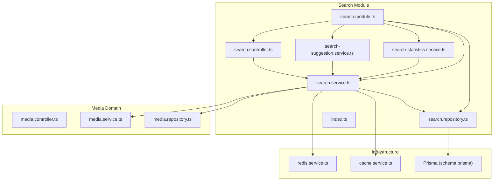
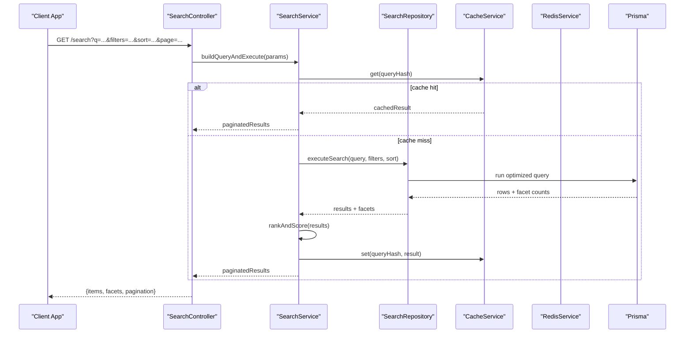
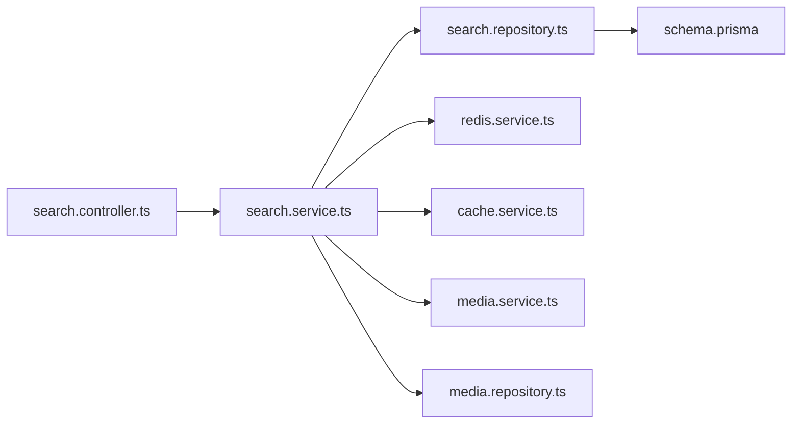

# Media Search Functionality

<cite>
**Referenced Files in This Document**
- [search.controller.ts](file://apps/backend/src/search/search.controller.ts)
- [search.service.ts](file://apps/backend/src/search/search.service.ts)
- [search.repository.ts](file://apps/backend/src/search/search.repository.ts)
- [search.module.ts](file://apps/backend/src/search/search.module.ts)
- [index.ts](file://apps/backend/src/search/index.ts)
- [search-statistics.service.ts](file://apps/backend/src/search/search-statistics.service.ts)
- [search-suggestion.service.ts](file://apps/backend/src/search/search-suggestion.service.ts)
- [dto](file://apps/backend/src/search/dto)
- [media.controller.ts](file://apps/backend/src/media/media.controller.ts)
- [media.service.ts](file://apps/backend/src/media/media.service.ts)
- [media.repository.ts](file://apps/backend/src/media/media.repository.ts)
- [schema.prisma](file://apps/backend/prisma/schema.prisma)
- [redis.service.ts](file://apps/backend/src/redis/redis.service.ts)
- [cache.service.ts](file://apps/backend/src/hardening/cache.service.ts)
- [database-optimization.service.ts](file://apps/backend/src/hardening/database-optimization.service.ts)
- [query-analysis.service.ts](file://apps/backend/src/hardening/query-analysis.service.ts)
</cite>

## Table of Contents
1. [Introduction](#introduction)
2. [Project Structure](#project-structure)
3. [Core Components](#core-components)
4. [Architecture Overview](#architecture-overview)
5. [Detailed Component Analysis](#detailed-component-analysis)
6. [Dependency Analysis](#dependency-analysis)
7. [Performance Considerations](#performance-considerations)
8. [Troubleshooting Guide](#troubleshooting-guide)
9. [Conclusion](#conclusion)
10. [Appendices](#appendices)

## Introduction
This document explains the media search functionality that provides full-text search, filtering, and sorting across media items. It covers the search service implementation with advanced query building, faceted search options, result ranking, database indexing integration, DTOs for queries and pagination, examples of complex queries, performance optimization techniques, and caching strategies. The goal is to make the system understandable for both technical and non-technical readers while providing actionable guidance for developers integrating or extending search capabilities.

## Project Structure
The search feature is implemented as a NestJS module under apps/backend/src/search. It exposes HTTP endpoints via a controller, orchestrates logic through a service, and delegates data access to a repository. Supporting services provide suggestions and statistics. DTOs define request/response shapes. Integration points include Redis for caching and Prisma for database operations.

**Diagram sources**
- [search.controller.ts](file://apps/backend/src/search/search.controller.ts)
- [search.service.ts](file://apps/backend/src/search/search.service.ts)
- [search.repository.ts](file://apps/backend/src/search/search.repository.ts)
- [search.module.ts](file://apps/backend/src/search/search.module.ts)
- [index.ts](file://apps/backend/src/search/index.ts)
- [search-suggestion.service.ts](file://apps/backend/src/search/search-suggestion.service.ts)
- [search-statistics.service.ts](file://apps/backend/src/search/search-statistics.service.ts)
- [media.controller.ts](file://apps/backend/src/media/media.controller.ts)
- [media.service.ts](file://apps/backend/src/media/media.service.ts)
- [media.repository.ts](file://apps/backend/src/media/media.repository.ts)
- [redis.service.ts](file://apps/backend/src/redis/redis.service.ts)
- [cache.service.ts](file://apps/backend/src/hardening/cache.service.ts)
- [schema.prisma](file://apps/backend/prisma/schema.prisma)

**Section sources**
- [search.module.ts](file://apps/backend/src/search/search.module.ts)
- [index.ts](file://apps/backend/src/search/index.ts)

## Core Components
- Controller: Exposes search endpoints, validates inputs, and returns paginated results.
- Service: Builds search queries, applies filters and sorting, computes rankings, and integrates caching and suggestions.
- Repository: Encapsulates Prisma queries for efficient retrieval and aggregation.
- Suggestions: Provides autocomplete and related terms based on usage and content.
- Statistics: Tracks search metrics like popular queries and conversion rates.
- DTOs: Define structured query parameters, filter conditions, and pagination fields.

Key responsibilities:
- Full-text search across relevant text fields.
- Faceted filtering by metadata such as type, tags, date ranges, and user-specific attributes.
- Sorting by relevance, date, popularity, and custom weights.
- Pagination with cursor or offset strategies.
- Caching of frequent queries and suggestion lists.

**Section sources**
- [search.controller.ts](file://apps/backend/src/search/search.controller.ts)
- [search.service.ts](file://apps/backend/src/search/search.service.ts)
- [search.repository.ts](file://apps/backend/src/search/search.repository.ts)
- [search-suggestion.service.ts](file://apps/backend/src/search/search-suggestion.service.ts)
- [search-statistics.service.ts](file://apps/backend/src/search/search-statistics.service.ts)
- [dto](file://apps/backend/src/search/dto)

## Architecture Overview
The search flow begins at the controller, which validates and normalizes incoming requests. The service constructs a composite query using full-text search clauses, filters, and sorting rules. The repository executes optimized Prisma queries against indexed columns and aggregates facets. Results are ranked and returned with pagination metadata. Caching layers reduce repeated work for identical queries.

**Diagram sources**
- [search.controller.ts](file://apps/backend/src/search/search.controller.ts)
- [search.service.ts](file://apps/backend/src/search/search.service.ts)
- [search.repository.ts](file://apps/backend/src/search/search.repository.ts)
- [cache.service.ts](file://apps/backend/src/hardening/cache.service.ts)
- [redis.service.ts](file://apps/backend/src/redis/redis.service.ts)
- [schema.prisma](file://apps/backend/prisma/schema.prisma)

## Detailed Component Analysis

### Search Controller
- Validates query parameters including text, filters, sorting, and pagination.
- Delegates execution to the search service and formats responses.
- Integrates with common response wrappers and error handling.

Responsibilities:
- Input normalization and sanitization.
- Mapping DTOs to internal query structures.
- Returning consistent JSON responses with pagination metadata.

**Section sources**
- [search.controller.ts](file://apps/backend/src/search/search.controller.ts)

### Search Service
- Orchestrates search logic: query building, filtering, sorting, ranking, and caching.
- Composes full-text search expressions and combines them with faceted filters.
- Applies ranking algorithms based on relevance scores, recency, and popularity.
- Coordinates with suggestion and statistics services.

Key behaviors:
- Query hashing for cache keys.
- Conditional inclusion of facets and aggregations.
- Fallback strategies when indexes are unavailable.

**Section sources**
- [search.service.ts](file://apps/backend/src/search/search.service.ts)
- [search-suggestion.service.ts](file://apps/backend/src/search/search-suggestion.service.ts)
- [search-statistics.service.ts](file://apps/backend/src/search/search-statistics.service.ts)

### Search Repository
- Implements Prisma-based queries for media entities.
- Builds dynamic where clauses from filters and sorts.
- Executes full-text searches using configured search vectors or tsvector-like fields.
- Aggregates facet counts efficiently.

Optimizations:
- Selective field projection to minimize payload size.
- Index-driven queries leveraging Prisma schema definitions.
- Batched reads for related entities.

**Section sources**
- [search.repository.ts](file://apps/backend/src/search/search.repository.ts)
- [schema.prisma](file://apps/backend/prisma/schema.prisma)

### DTOs and Query Models
- Query DTOs define text search, filter conditions, sorting options, and pagination parameters.
- Filter conditions support equality, range, list membership, and boolean combinations.
- Pagination supports page/size or cursor-based navigation.

Typical fields:
- Text: q, language, operator (AND/OR/PHRASE).
- Filters: type, tags, dateFrom/dateTo, status, userId.
- Sort: sortBy, sortOrder, weightBoosters.
- Pagination: page, size, cursor.

**Section sources**
- [dto](file://apps/backend/src/search/dto)

### Database Indexing and Text Search Configuration
- Prisma schema defines searchable columns and indexes.
- Full-text search leverages database-native features (e.g., PostgreSQL tsvector/tsquery) via Prisma.
- Custom operators can be mapped to SQL functions for advanced matching.

Recommendations:
- Use GIN indexes for full-text search fields.
- Normalize and tokenize input before querying.
- Maintain index health and reindex periodically.

**Section sources**
- [schema.prisma](file://apps/backend/prisma/schema.prisma)

### Ranking Algorithms
- Relevance scoring combines keyword match strength, proximity, and field boosts.
- Recency boost favors recently updated or created items.
- Popularity boost considers interactions, views, or bookmarks.
- User context may personalize ranking (e.g., preferred genres).

Implementation approach:
- Compute per-item score during query execution.
- Apply weighted sums and normalize scores.
- Allow configuration of boost factors via query parameters.

**Section sources**
- [search.service.ts](file://apps/backend/src/search/search.service.ts)

### Faceted Search
- Aggregates counts for categories such as type, tags, and date ranges.
- Supports nested facets and conditional aggregation.
- Returns facet metadata alongside results for UI-driven refinement.

Optimization:
- Precompute frequently used facets if needed.
- Limit facet cardinality to avoid heavy aggregations.

**Section sources**
- [search.repository.ts](file://apps/backend/src/search/search.repository.ts)

### Suggestions and Autocomplete
- Generates suggestions based on prefix matches and recent queries.
- Uses Redis-backed caches for fast lookups.
- Incorporates user history and global trends.

Integration:
- Triggered on minimal input length.
- Debounced client-side calls to reduce load.

**Section sources**
- [search-suggestion.service.ts](file://apps/backend/src/search/search-suggestion.service.ts)
- [redis.service.ts](file://apps/backend/src/redis/redis.service.ts)

### Statistics and Analytics
- Tracks query frequency, zero-result queries, and click-through rates.
- Helps identify gaps in indexing and improve ranking.
- Exposes metrics for monitoring dashboards.

**Section sources**
- [search-statistics.service.ts](file://apps/backend/src/search/search-statistics.service.ts)

### Integration with Media Domain
- Search queries target media entities defined in the media module.
- Cross-references collections, tags, and user associations.
- Ensures consistency with media lifecycle events (create/update/delete).

**Section sources**
- [media.controller.ts](file://apps/backend/src/media/media.controller.ts)
- [media.service.ts](file://apps/backend/src/media/media.service.ts)
- [media.repository.ts](file://apps/backend/src/media/media.repository.ts)

## Dependency Analysis
The search module depends on infrastructure services for caching and database access, and on the media domain for entity definitions and relationships.

**Diagram sources**
- [search.controller.ts](file://apps/backend/src/search/search.controller.ts)
- [search.service.ts](file://apps/backend/src/search/search.service.ts)
- [search.repository.ts](file://apps/backend/src/search/search.repository.ts)
- [redis.service.ts](file://apps/backend/src/redis/redis.service.ts)
- [cache.service.ts](file://apps/backend/src/hardening/cache.service.ts)
- [media.service.ts](file://apps/backend/src/media/media.service.ts)
- [media.repository.ts](file://apps/backend/src/media/media.repository.ts)
- [schema.prisma](file://apps/backend/prisma/schema.prisma)

**Section sources**
- [search.module.ts](file://apps/backend/src/search/search.module.ts)
- [index.ts](file://apps/backend/src/search/index.ts)

## Performance Considerations
- Indexing: Ensure full-text indexes exist on searchable fields; use GIN indexes for PostgreSQL.
- Query Optimization: Avoid SELECT *, project only necessary fields; leverage Prisma relations efficiently.
- Caching: Cache frequent queries and suggestion lists with appropriate TTLs; invalidate on updates.
- Pagination: Prefer cursor-based pagination for large datasets; limit page sizes.
- Facets: Cap facet cardinality; precompute hot facets if necessary.
- Monitoring: Use query analysis tools to detect slow queries and optimize plans.

[No sources needed since this section provides general guidance]

## Troubleshooting Guide
Common issues and resolutions:
- Slow queries: Analyze execution plans; add or adjust indexes; simplify complex filters.
- Missing results: Verify tokenization and language settings; check index health; ensure data consistency.
- Stale cache: Implement cache invalidation on media updates; use versioned cache keys.
- High memory usage: Reduce payload size; paginate aggressively; avoid loading unnecessary relations.

Operational utilities:
- Query analysis service helps identify bottlenecks.
- Database optimization service provides maintenance routines.
- Cache service offers eviction policies and monitoring hooks.

**Section sources**
- [query-analysis.service.ts](file://apps/backend/src/hardening/query-analysis.service.ts)
- [database-optimization.service.ts](file://apps/backend/src/hardening/database-optimization.service.ts)
- [cache.service.ts](file://apps/backend/src/hardening/cache.service.ts)

## Conclusion
The media search functionality delivers robust full-text search, filtering, and sorting with faceted exploration and ranking tailored to user preferences. By leveraging Prisma indexes, Redis caching, and well-structured DTOs, it achieves high performance and scalability. Continuous monitoring and optimization ensure reliability under varying loads.

[No sources needed since this section summarizes without analyzing specific files]

## Appendices

### Example Complex Queries
- Full-text search with phrase matching and AND/OR operators.
- Range filters for dates combined with tag lists and status booleans.
- Sorting by relevance with recency and popularity boosts.
- Paginated results with cursor navigation and facet aggregation.

[No sources needed since this section provides conceptual examples]

### Search Result Caching Strategies
- Key generation: hash normalized query parameters.
- TTL policy: shorter for volatile data, longer for stable facets.
- Invalidation: trigger on media create/update/delete events.
- Fallback: bypass cache on errors or timeouts.

[No sources needed since this section provides conceptual guidance]