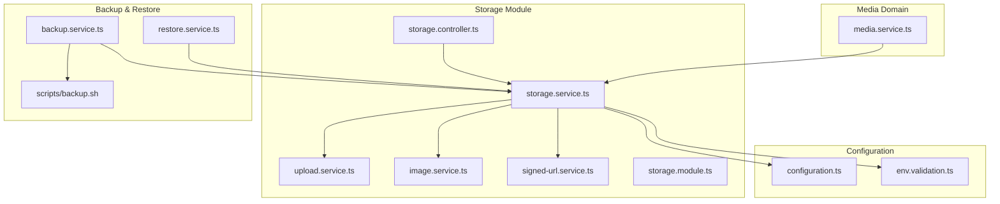
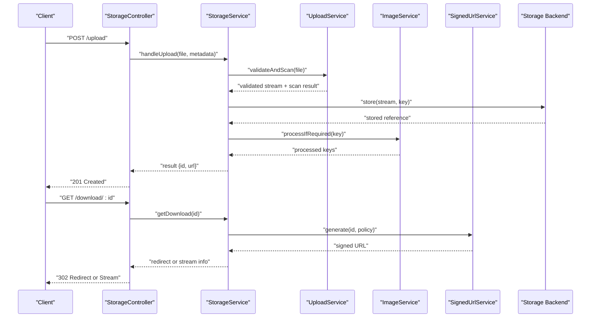
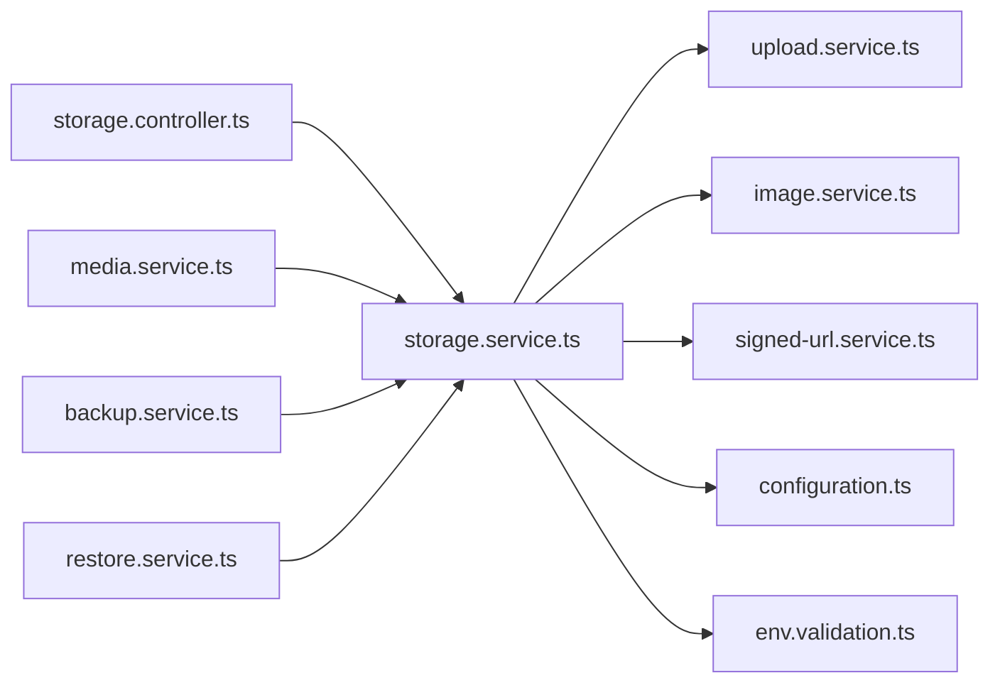
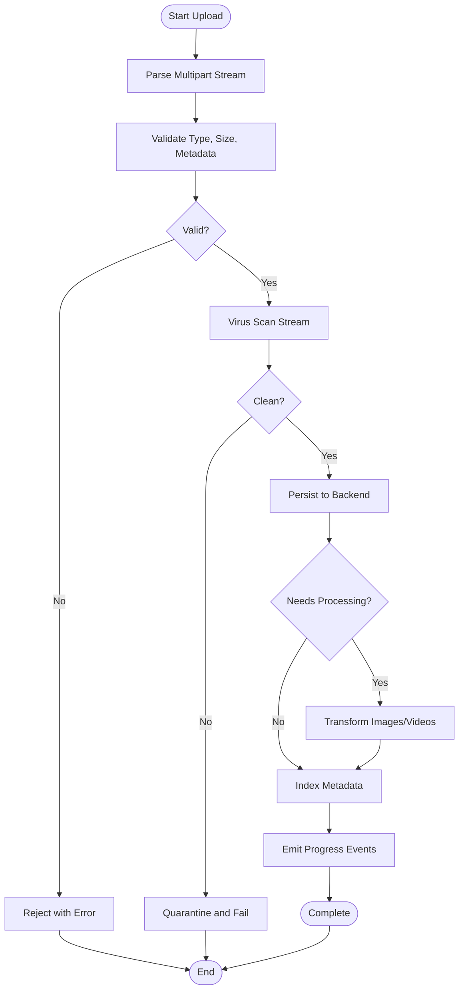

# Media Storage Integration

<cite>
**Referenced Files in This Document**
- [storage.service.ts](file://apps/backend/src/storage/storage.service.ts)
- [upload.service.ts](file://apps/backend/src/storage/upload.service.ts)
- [image.service.ts](file://apps/backend/src/storage/image.service.ts)
- [signed-url.service.ts](file://apps/backend/src/storage/signed-url.service.ts)
- [storage.controller.ts](file://apps/backend/src/storage/storage.controller.ts)
- [storage.module.ts](file://apps/backend/src/storage/storage.module.ts)
- [media.service.ts](file://apps/backend/src/media/media.service.ts)
- [configuration.ts](file://apps/backend/src/config/configuration.ts)
- [env.validation.ts](file://apps/backend/src/config/env.validation.ts)
- [backup.service.ts](file://apps/backend/src/deployment/backup.service.ts)
- [restore.service.ts](file://apps/backend/src/deployment/restore.service.ts)
- [scripts/backup.sh](file://apps/backend/scripts/backup.sh)
</cite>

## Table of Contents
1. [Introduction](#introduction)
2. [Project Structure](#project-structure)
3. [Core Components](#core-components)
4. [Architecture Overview](#architecture-overview)
5. [Detailed Component Analysis](#detailed-component-analysis)
6. [Dependency Analysis](#dependency-analysis)
7. [Performance Considerations](#performance-considerations)
8. [Troubleshooting Guide](#troubleshooting-guide)
9. [Conclusion](#conclusion)
10. [Appendices](#appendices)

## Introduction
This document explains the media storage integration for file uploads, downloads, and backend abstraction. It covers the storage service interface and implementations for local filesystem and cloud providers (e.g., S3), upload workflows including validation and virus scanning, download mechanisms with streaming and access control, CDN integration, configuration options, error handling, and backup/restore procedures for media files.

## Project Structure
The media storage functionality is implemented in the backend under the storage module, with supporting services for image processing, signed URL generation, and orchestration of uploads. Configuration is centralized in the config module, while backup and restore utilities are provided under deployment and scripts.

**Diagram sources**
- [storage.controller.ts](file://apps/backend/src/storage/storage.controller.ts)
- [storage.service.ts](file://apps/backend/src/storage/storage.service.ts)
- [upload.service.ts](file://apps/backend/src/storage/upload.service.ts)
- [image.service.ts](file://apps/backend/src/storage/image.service.ts)
- [signed-url.service.ts](file://apps/backend/src/storage/signed-url.service.ts)
- [storage.module.ts](file://apps/backend/src/storage/storage.module.ts)
- [media.service.ts](file://apps/backend/src/media/media.service.ts)
- [configuration.ts](file://apps/backend/src/config/configuration.ts)
- [env.validation.ts](file://apps/backend/src/config/env.validation.ts)
- [backup.service.ts](file://apps/backend/src/deployment/backup.service.ts)
- [restore.service.ts](file://apps/backend/src/deployment/restore.service.ts)
- [scripts/backup.sh](file://apps/backend/scripts/backup.sh)

**Section sources**
- [storage.controller.ts](file://apps/backend/src/storage/storage.controller.ts)
- [storage.service.ts](file://apps/backend/src/storage/storage.service.ts)
- [upload.service.ts](file://apps/backend/src/storage/upload.service.ts)
- [image.service.ts](file://apps/backend/src/storage/image.service.ts)
- [signed-url.service.ts](file://apps/backend/src/storage/signed-url.service.ts)
- [storage.module.ts](file://apps/backend/src/storage/storage.module.ts)
- [media.service.ts](file://apps/backend/src/media/media.service.ts)
- [configuration.ts](file://apps/backend/src/config/configuration.ts)
- [env.validation.ts](file://apps/backend/src/config/env.validation.ts)
- [backup.service.ts](file://apps/backend/src/deployment/backup.service.ts)
- [restore.service.ts](file://apps/backend/src/deployment/restore.service.ts)
- [scripts/backup.sh](file://apps/backend/scripts/backup.sh)

## Core Components
- Storage Service: Central orchestrator for upload/download operations, metadata handling, and backend selection.
- Upload Service: Handles multipart parsing, validation, virus scanning hooks, and progress events.
- Image Service: Provides image transformations and optimization pipelines.
- Signed URL Service: Generates time-bound, access-controlled URLs for secure downloads.
- Storage Controller: Exposes HTTP endpoints for upload and download flows.
- Configuration: Environment-driven settings for backends, limits, and security policies.
- Backup/Restore Services: Utilities to export/import media assets and manage lifecycle.

**Section sources**
- [storage.service.ts](file://apps/backend/src/storage/storage.service.ts)
- [upload.service.ts](file://apps/backend/src/storage/upload.service.ts)
- [image.service.ts](file://apps/backend/src/storage/image.service.ts)
- [signed-url.service.ts](file://apps/backend/src/storage/signed-url.service.ts)
- [storage.controller.ts](file://apps/backend/src/storage/storage.controller.ts)
- [configuration.ts](file://apps/backend/src/config/configuration.ts)
- [env.validation.ts](file://apps/backend/src/config/env.validation.ts)
- [backup.service.ts](file://apps/backend/src/deployment/backup.service.ts)
- [restore.service.ts](file://apps/backend/src/deployment/restore.service.ts)

## Architecture Overview
The system abstracts storage backends behind a unified interface. The controller receives requests, delegates to the storage service, which coordinates upload/download logic, invokes image processing when needed, and uses signed URLs for secure access. Configuration determines the active backend and runtime behavior.

**Diagram sources**
- [storage.controller.ts](file://apps/backend/src/storage/storage.controller.ts)
- [storage.service.ts](file://apps/backend/src/storage/storage.service.ts)
- [upload.service.ts](file://apps/backend/src/storage/upload.service.ts)
- [image.service.ts](file://apps/backend/src/storage/image.service.ts)
- [signed-url.service.ts](file://apps/backend/src/storage/signed-url.service.ts)

## Detailed Component Analysis

### Storage Service
Responsibilities:
- Abstracts backend operations (local filesystem vs cloud).
- Coordinates upload pipeline: validation, scanning, persistence, post-processing.
- Manages download flows: direct stream or signed URL generation.
- Integrates with image processing and metadata extraction.
- Emits progress events and handles errors consistently.

Key behaviors:
- Backend selection based on configuration.
- Retry and fallback strategies for transient failures.
- Access control enforcement via signed URLs or middleware.

**Section sources**
- [storage.service.ts](file://apps/backend/src/storage/storage.service.ts)

### Upload Service
Responsibilities:
- Parses multipart/form-data streams efficiently.
- Validates file type, size, and content characteristics.
- Invokes virus scanning hooks before persisting.
- Emits progress updates for long-running uploads.
- Ensures idempotency where applicable.

Validation and scanning:
- Enforces allowed MIME types and extensions.
- Applies maximum size limits per environment.
- Scans streams using configured scanner; aborts on detection.

Progress tracking:
- Streams bytes through an event emitter or observable.
- Supports resumable uploads by chunking and state management.

**Section sources**
- [upload.service.ts](file://apps/backend/src/storage/upload.service.ts)

### Image Service
Responsibilities:
- Detects images and applies transformations (resize, crop, format conversion).
- Produces optimized variants for web delivery.
- Caches processed outputs to reduce recomputation.

Processing pipeline:
- Input validation and safe decoding.
- Transformation queue with concurrency controls.
- Output validation and integrity checks.

**Section sources**
- [image.service.ts](file://apps/backend/src/storage/image.service.ts)

### Signed URL Service
Responsibilities:
- Generates time-limited, scoped URLs for secure downloads.
- Supports role-based access and IP restrictions if configured.
- Integrates with CDN providers for edge caching and signing.

Access control:
- Embeds permissions into token payload.
- Verifies signatures server-side for additional safety.

CDN integration:
- Configurable base domains and cache policies.
- Optional pre-warming and invalidation helpers.

**Section sources**
- [signed-url.service.ts](file://apps/backend/src/storage/signed-url.service.ts)

### Storage Controller
Responsibilities:
- Exposes REST endpoints for upload and download.
- Binds request DTOs and validates inputs.
- Delegates business logic to services and returns standardized responses.

Endpoints:
- Upload: accepts multipart payloads, returns asset identifiers and metadata.
- Download: supports direct streaming or redirect to signed URLs.

**Section sources**
- [storage.controller.ts](file://apps/backend/src/storage/storage.controller.ts)

### Configuration and Validation
Responsibilities:
- Centralizes environment variables for storage backends, limits, and security.
- Validates required settings at startup and fails fast on misconfiguration.

Options typically include:
- Backend type (local, s3).
- Bucket/container names and regions.
- Access credentials and encryption flags.
- Max upload size and allowed MIME types.
- CDN domain and signing parameters.
- Virus scanner endpoint and thresholds.

**Section sources**
- [configuration.ts](file://apps/backend/src/config/configuration.ts)
- [env.validation.ts](file://apps/backend/src/config/env.validation.ts)

### Backup and Restore
Responsibilities:
- Export media assets to a durable location (archive or remote bucket).
- Import and reconcile assets during restore operations.
- Provide CLI/scripted automation for scheduled backups.

Procedures:
- Snapshot current state and generate manifests.
- Stream large files without loading entirely into memory.
- Verify checksums and report inconsistencies.

Automation:
- Cron-friendly script for incremental or full backups.
- Retention policies and rotation strategies.

**Section sources**
- [backup.service.ts](file://apps/backend/src/deployment/backup.service.ts)
- [restore.service.ts](file://apps/backend/src/deployment/restore.service.ts)
- [scripts/backup.sh](file://apps/backend/scripts/backup.sh)

## Dependency Analysis
The storage module depends on configuration for runtime behavior and integrates with external services like virus scanners and CDNs. Media domain services consume storage capabilities through the storage service interface.

**Diagram sources**
- [storage.controller.ts](file://apps/backend/src/storage/storage.controller.ts)
- [storage.service.ts](file://apps/backend/src/storage/storage.service.ts)
- [upload.service.ts](file://apps/backend/src/storage/upload.service.ts)
- [image.service.ts](file://apps/backend/src/storage/image.service.ts)
- [signed-url.service.ts](file://apps/backend/src/storage/signed-url.service.ts)
- [configuration.ts](file://apps/backend/src/config/configuration.ts)
- [env.validation.ts](file://apps/backend/src/config/env.validation.ts)
- [media.service.ts](file://apps/backend/src/media/media.service.ts)
- [backup.service.ts](file://apps/backend/src/deployment/backup.service.ts)
- [restore.service.ts](file://apps/backend/src/deployment/restore.service.ts)

**Section sources**
- [storage.module.ts](file://apps/backend/src/storage/storage.module.ts)

## Performance Considerations
- Streaming: Use streaming APIs for uploads and downloads to minimize memory usage.
- Concurrency: Limit parallel image processing jobs to avoid CPU saturation.
- Caching: Cache transformed images and signed URL results where appropriate.
- Chunking: Support resumable uploads for large files and unstable networks.
- CDN: Offload static delivery to CDN and leverage edge caching policies.
- Backpressure: Ensure proper backpressure handling across I/O boundaries.

[No sources needed since this section provides general guidance]

## Troubleshooting Guide
Common issues and resolutions:
- Upload failures due to size or MIME restrictions: Review configuration limits and client constraints.
- Virus scan timeouts: Adjust scanner timeout and retry policies; verify scanner availability.
- Permission denied on storage: Validate backend credentials and bucket/container permissions.
- Slow downloads: Enable CDN caching and signed URL short-lived tokens; check network paths.
- Inconsistent backups: Verify manifest integrity and checksums; re-run restore with verification enabled.

Operational tips:
- Log detailed error contexts and correlation IDs.
- Monitor queue depths and processing latencies.
- Use health checks for storage backends and scanners.

**Section sources**
- [storage.service.ts](file://apps/backend/src/storage/storage.service.ts)
- [upload.service.ts](file://apps/backend/src/storage/upload.service.ts)
- [signed-url.service.ts](file://apps/backend/src/storage/signed-url.service.ts)
- [backup.service.ts](file://apps/backend/src/deployment/backup.service.ts)
- [restore.service.ts](file://apps/backend/src/deployment/restore.service.ts)

## Conclusion
The media storage integration provides a robust, configurable abstraction over multiple backends, enabling secure uploads, efficient downloads, and reliable backup/restore workflows. By leveraging streaming, signed URLs, and CDN integration, the system balances performance and security while maintaining flexibility for evolving storage requirements.

[No sources needed since this section summarizes without analyzing specific files]

## Appendices

### Upload Flow Algorithm

**Diagram sources**
- [upload.service.ts](file://apps/backend/src/storage/upload.service.ts)
- [storage.service.ts](file://apps/backend/src/storage/storage.service.ts)
- [image.service.ts](file://apps/backend/src/storage/image.service.ts)

### Configuration Options Reference
- Backend type: local, s3
- Bucket/container name and region
- Access key/secret or IAM roles
- Max upload size and allowed MIME types
- CDN domain and signing parameters
- Virus scanner endpoint and thresholds
- Encryption flags and KMS keys
- Retention and cleanup policies

**Section sources**
- [configuration.ts](file://apps/backend/src/config/configuration.ts)
- [env.validation.ts](file://apps/backend/src/config/env.validation.ts)