# Security & Authentication System

<cite>
**Referenced Files in This Document**
- [auth.module.ts](file://apps/backend/src/auth/auth.module.ts)
- [auth.controller.ts](file://apps/backend/src/auth/auth.controller.ts)
- [auth.service.ts](file://apps/backend/src/auth/auth.service.ts)
- [auth.repository.ts](file://apps/backend/src/auth/auth.repository.ts)
- [jwt.strategy.ts](file://apps/backend/src/auth/strategies/jwt.strategy.ts)
- [google.strategy.ts](file://apps/backend/src/auth/strategies/google.strategy.ts)
- [roles.decorator.ts](file://apps/backend/src/auth/decorators/roles.decorator.ts)
- [is-authenticated.guard.ts](file://apps/backend/src/auth/guards/is-authenticated.guard.ts)
- [roles.guard.ts](file://apps/backend/src/auth/guards/roles.guard.ts)
- [rate-limit.guard.ts](file://apps/backend/src/hardening/rate-limit-audit.service.ts)
- [redis.service.ts](file://apps/backend/src/redis/redis.service.ts)
- [configuration.ts](file://apps/backend/src/config/configuration.ts)
- [env.validation.ts](file://apps/backend/src/config/env.validation.ts)
- [app.bootstrap.ts](file://apps/backend/src/app.bootstrap.ts)
- [main.ts](file://apps/backend/src/main.ts)
- [audit-log.service.ts](file://apps/backend/src/core/audit/audit-log.service.ts)
- [security.headers.interceptor.ts](file://apps/backend/src/common/interceptors/security.headers.interceptor.ts)
- [input-validation.pipe.ts](file://apps/backend/src/common/pipes/input-validation.pipe.ts)
- [output-sanitization.interceptor.ts](file://apps/backend/src/common/interceptors/output-sanitization.interceptor.ts)
- [csrf.middleware.ts](file://apps/backend/src/common/middleware/csrf.middleware.ts)
- [cors.config.ts](file://apps/backend/src/config/cors.config.ts)
</cite>

## Table of Contents
1. [Introduction](#introduction)
2. [Project Structure](#project-structure)
3. [Core Components](#core-components)
4. [Architecture Overview](#architecture-overview)
5. [Detailed Component Analysis](#detailed-component-analysis)
6. [Dependency Analysis](#dependency-analysis)
7. [Performance Considerations](#performance-considerations)
8. [Troubleshooting Guide](#troubleshooting-guide)
9. [Conclusion](#conclusion)

## Introduction
This document explains the security and authentication system implemented in the backend application. It covers JWT-based authentication, token management with Redis-backed sessions, role-based access control (RBAC), custom decorators and guards, OAuth integration with Google, email verification workflows, password security, input validation, output sanitization, audit logging, security headers, rate limiting, CORS configuration, CSRF protection, and secure cookie settings. The goal is to provide a comprehensive understanding for both developers and operators to implement, maintain, and troubleshoot the security features effectively.

## Project Structure
The security and authentication logic is primarily located under apps/backend/src/auth, with supporting modules for strategies, guards, decorators, services, repositories, and configuration. Cross-cutting concerns such as rate limiting, security headers, input validation, output sanitization, CSRF middleware, and CORS are implemented in dedicated modules and interceptors.

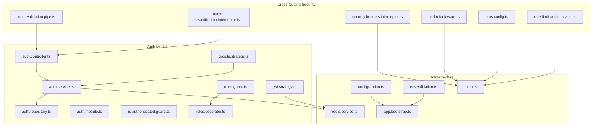

**Diagram sources**
- [auth.controller.ts](file://apps/backend/src/auth/auth.controller.ts)
- [auth.service.ts](file://apps/backend/src/auth/auth.service.ts)
- [auth.repository.ts](file://apps/backend/src/auth/auth.repository.ts)
- [auth.module.ts](file://apps/backend/src/auth/auth.module.ts)
- [jwt.strategy.ts](file://apps/backend/src/auth/strategies/jwt.strategy.ts)
- [google.strategy.ts](file://apps/backend/src/auth/strategies/google.strategy.ts)
- [roles.guard.ts](file://apps/backend/src/auth/guards/roles.guard.ts)
- [is-authenticated.guard.ts](file://apps/backend/src/auth/guards/is-authenticated.guard.ts)
- [roles.decorator.ts](file://apps/backend/src/auth/decorators/roles.decorator.ts)
- [rate-limit-audit.service.ts](file://apps/backend/src/hardening/rate-limit-audit.service.ts)
- [security.headers.interceptor.ts](file://apps/backend/src/common/interceptors/security.headers.interceptor.ts)
- [input-validation.pipe.ts](file://apps/backend/src/common/pipes/input-validation.pipe.ts)
- [output-sanitization.interceptor.ts](file://apps/backend/src/common/interceptors/output-sanitization.interceptor.ts)
- [csrf.middleware.ts](file://apps/backend/src/common/middleware/csrf.middleware.ts)
- [cors.config.ts](file://apps/backend/src/config/cors.config.ts)
- [redis.service.ts](file://apps/backend/src/redis/redis.service.ts)
- [configuration.ts](file://apps/backend/src/config/configuration.ts)
- [env.validation.ts](file://apps/backend/src/config/env.validation.ts)
- [app.bootstrap.ts](file://apps/backend/src/app.bootstrap.ts)
- [main.ts](file://apps/backend/src/main.ts)

**Section sources**
- [auth.module.ts](file://apps/backend/src/auth/auth.module.ts)
- [auth.controller.ts](file://apps/backend/src/auth/auth.controller.ts)
- [auth.service.ts](file://apps/backend/src/auth/auth.service.ts)
- [auth.repository.ts](file://apps/backend/src/auth/auth.repository.ts)
- [jwt.strategy.ts](file://apps/backend/src/auth/strategies/jwt.strategy.ts)
- [google.strategy.ts](file://apps/backend/src/auth/strategies/google.strategy.ts)
- [roles.guard.ts](file://apps/backend/src/auth/guards/roles.guard.ts)
- [is-authenticated.guard.ts](file://apps/backend/src/auth/guards/is-authenticated.guard.ts)
- [roles.decorator.ts](file://apps/backend/src/auth/decorators/roles.decorator.ts)
- [rate-limit-audit.service.ts](file://apps/backend/src/hardening/rate-limit-audit.service.ts)
- [security.headers.interceptor.ts](file://apps/backend/src/common/interceptors/security.headers.interceptor.ts)
- [input-validation.pipe.ts](file://apps/backend/src/common/pipes/input-validation.pipe.ts)
- [output-sanitization.interceptor.ts](file://apps/backend/src/common/interceptors/output-sanitization.interceptor.ts)
- [csrf.middleware.ts](file://apps/backend/src/common/middleware/csrf.middleware.ts)
- [cors.config.ts](file://apps/backend/src/config/cors.config.ts)
- [redis.service.ts](file://apps/backend/src/redis/redis.service.ts)
- [configuration.ts](file://apps/backend/src/config/configuration.ts)
- [env.validation.ts](file://apps/backend/src/config/env.validation.ts)
- [app.bootstrap.ts](file://apps/backend/src/app.bootstrap.ts)
- [main.ts](file://apps/backend/src/main.ts)

## Core Components
- Authentication Controller: Exposes endpoints for login, logout, refresh, password reset, and OAuth callback handling.
- Authentication Service: Orchestrates user lookup, credential verification, token issuance, session storage, and email verification flows.
- Authentication Repository: Data access layer for users and related entities.
- JWT Strategy: Validates and deserializes JWTs from requests.
- Google Strategy: Handles OAuth2 flow with Google and maps provider claims to local user model.
- Guards and Decorators: Enforce authentication and role-based authorization at route level.
- Redis Service: Provides session storage and token blacklisting capabilities.
- Configuration and Environment Validation: Ensures secure defaults and required secrets.
- Cross-Cutting Security: Rate limiting, security headers, input validation, output sanitization, CSRF middleware, and CORS configuration.

**Section sources**
- [auth.controller.ts](file://apps/backend/src/auth/auth.controller.ts)
- [auth.service.ts](file://apps/backend/src/auth/auth.service.ts)
- [auth.repository.ts](file://apps/backend/src/auth/auth.repository.ts)
- [jwt.strategy.ts](file://apps/backend/src/auth/strategies/jwt.strategy.ts)
- [google.strategy.ts](file://apps/backend/src/auth/strategies/google.strategy.ts)
- [roles.guard.ts](file://apps/backend/src/auth/guards/roles.guard.ts)
- [is-authenticated.guard.ts](file://apps/backend/src/auth/guards/is-authenticated.guard.ts)
- [roles.decorator.ts](file://apps/backend/src/auth/decorators/roles.decorator.ts)
- [redis.service.ts](file://apps/backend/src/redis/redis.service.ts)
- [configuration.ts](file://apps/backend/src/config/configuration.ts)
- [env.validation.ts](file://apps/backend/src/config/env.validation.ts)

## Architecture Overview
The authentication architecture combines stateless JWTs with stateful Redis sessions for enhanced security and revocation support. Requests pass through global middleware and interceptors that enforce rate limits, validate inputs, sanitize outputs, set security headers, and protect against CSRF. Routes protected by guards require valid tokens and roles. OAuth providers integrate via Passport strategies, bridging external identities to internal user accounts.

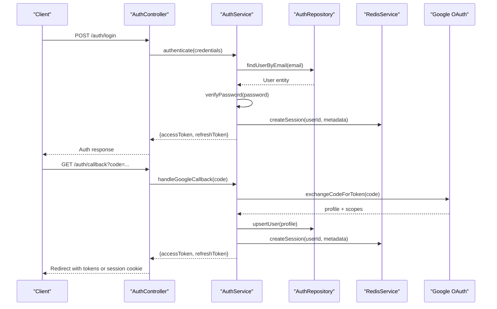

**Diagram sources**
- [auth.controller.ts](file://apps/backend/src/auth/auth.controller.ts)
- [auth.service.ts](file://apps/backend/src/auth/auth.service.ts)
- [auth.repository.ts](file://apps/backend/src/auth/auth.repository.ts)
- [redis.service.ts](file://apps/backend/src/redis/redis.service.ts)
- [google.strategy.ts](file://apps/backend/src/auth/strategies/google.strategy.ts)

## Detailed Component Analysis

### JWT-Based Authentication Flow
- Token Issuance: After successful credential verification, the service issues short-lived access tokens and longer-lived refresh tokens.
- Session Storage: Refresh tokens and optional session metadata are stored in Redis with expiration and rotation support.
- Token Validation: The JWT strategy validates signatures, expiry, and optionally checks Redis for blacklist entries.
- Logout and Revocation: On logout, refresh tokens are invalidated in Redis; access tokens rely on short TTL.

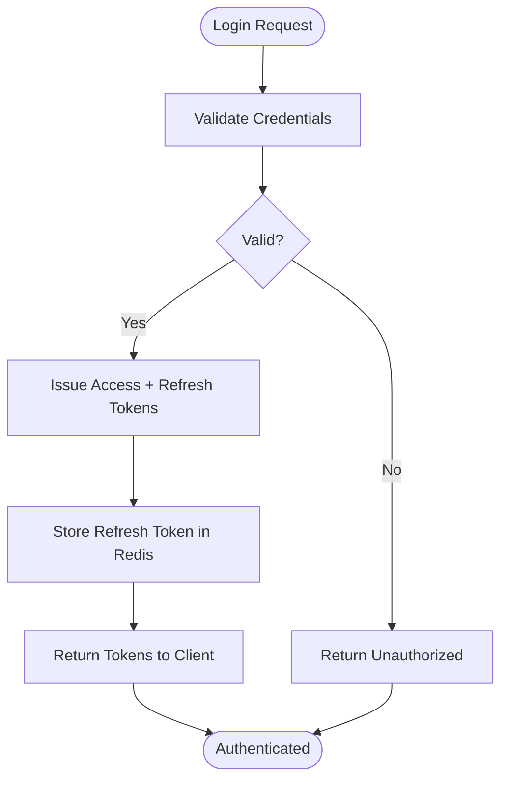

**Diagram sources**
- [auth.service.ts](file://apps/backend/src/auth/auth.service.ts)
- [redis.service.ts](file://apps/backend/src/redis/redis.service.ts)
- [jwt.strategy.ts](file://apps/backend/src/auth/strategies/jwt.strategy.ts)

**Section sources**
- [auth.service.ts](file://apps/backend/src/auth/auth.service.ts)
- [jwt.strategy.ts](file://apps/backend/src/auth/strategies/jwt.strategy.ts)
- [redis.service.ts](file://apps/backend/src/redis/redis.service.ts)

### Token Management with Redis
- Refresh Token Rotation: Each refresh triggers issuance of a new refresh token and invalidation of the previous one.
- Blacklist Support: Access tokens can be revoked by adding their identifiers to a Redis blacklist.
- Session Metadata: Optional fields like device info, IP, and last activity are stored alongside tokens.

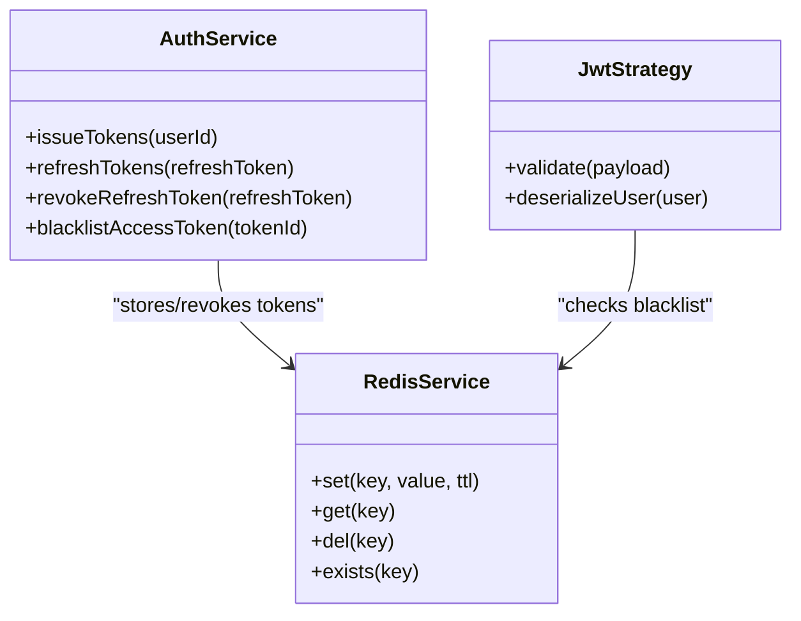

**Diagram sources**
- [auth.service.ts](file://apps/backend/src/auth/auth.service.ts)
- [redis.service.ts](file://apps/backend/src/redis/redis.service.ts)
- [jwt.strategy.ts](file://apps/backend/src/auth/strategies/jwt.strategy.ts)

**Section sources**
- [auth.service.ts](file://apps/backend/src/auth/auth.service.ts)
- [redis.service.ts](file://apps/backend/src/redis/redis.service.ts)
- [jwt.strategy.ts](file://apps/backend/src/auth/strategies/jwt.strategy.ts)

### Role-Based Access Control (RBAC)
- Roles Decorator: Declares required roles for a controller method.
- Roles Guard: Checks the authenticated user’s roles against the decorator requirements.
- Enforcement: Applied per-route to restrict sensitive operations to authorized roles.

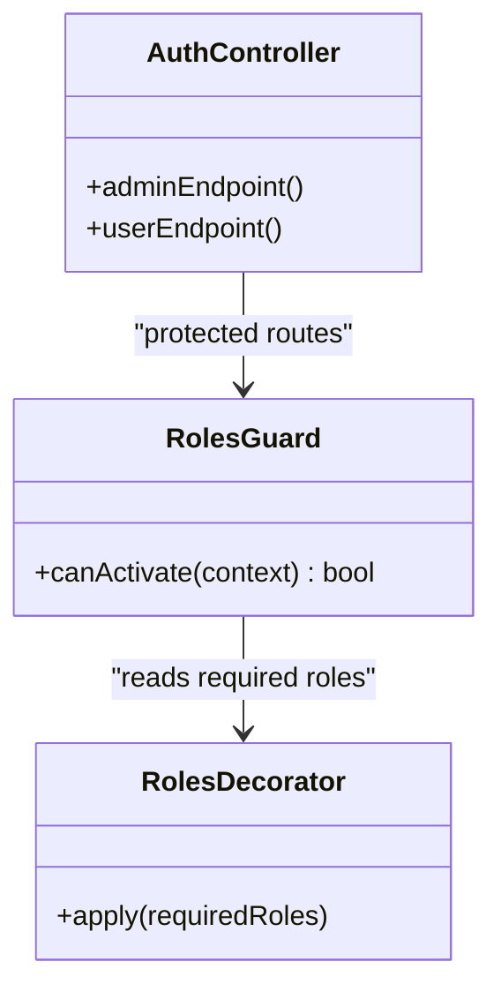

**Diagram sources**
- [roles.decorator.ts](file://apps/backend/src/auth/decorators/roles.decorator.ts)
- [roles.guard.ts](file://apps/backend/src/auth/guards/roles.guard.ts)
- [auth.controller.ts](file://apps/backend/src/auth/auth.controller.ts)

**Section sources**
- [roles.decorator.ts](file://apps/backend/src/auth/decorators/roles.decorator.ts)
- [roles.guard.ts](file://apps/backend/src/auth/guards/roles.guard.ts)
- [auth.controller.ts](file://apps/backend/src/auth/auth.controller.ts)

### Custom Decorators and Guards
- Is-Authenticated Guard: Ensures a valid JWT is present and deserialized into the request context.
- Roles Decorator/Guard: Enforces RBAC as described above.
- Extensibility: Additional guards can be composed for MFA, IP allowlists, or feature flags.

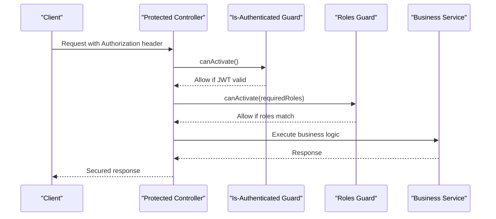

**Diagram sources**
- [is-authenticated.guard.ts](file://apps/backend/src/auth/guards/is-authenticated.guard.ts)
- [roles.guard.ts](file://apps/backend/src/auth/guards/roles.guard.ts)
- [roles.decorator.ts](file://apps/backend/src/auth/decorators/roles.decorator.ts)
- [auth.controller.ts](file://apps/backend/src/auth/auth.controller.ts)

**Section sources**
- [is-authenticated.guard.ts](file://apps/backend/src/auth/guards/is-authenticated.guard.ts)
- [roles.guard.ts](file://apps/backend/src/auth/guards/roles.guard.ts)
- [roles.decorator.ts](file://apps/backend/src/auth/decorators/roles.decorator.ts)

### OAuth Integration with Google
- Strategy: Uses Google OAuth2 to obtain user profile and scopes.
- Callback Handling: Maps provider data to local user model, creates or updates user records, and issues tokens.
- Linking: Supports linking existing accounts with Google identity.

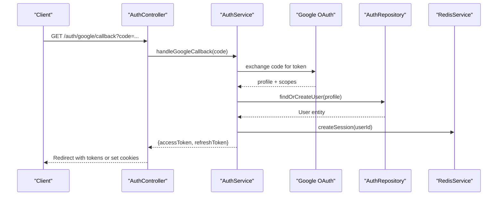

**Diagram sources**
- [google.strategy.ts](file://apps/backend/src/auth/strategies/google.strategy.ts)
- [auth.controller.ts](file://apps/backend/src/auth/auth.controller.ts)
- [auth.service.ts](file://apps/backend/src/auth/auth.service.ts)
- [auth.repository.ts](file://apps/backend/src/auth/auth.repository.ts)
- [redis.service.ts](file://apps/backend/src/redis/redis.service.ts)

**Section sources**
- [google.strategy.ts](file://apps/backend/src/auth/strategies/google.strategy.ts)
- [auth.controller.ts](file://apps/backend/src/auth/auth.controller.ts)
- [auth.service.ts](file://apps/backend/src/auth/auth.service.ts)
- [auth.repository.ts](file://apps/backend/src/auth/auth.repository.ts)
- [redis.service.ts](file://apps/backend/src/redis/redis.service.ts)

### Email Verification Workflow
- Initiation: User submits registration or email change request.
- Code Generation: A time-bound, single-use verification code is created and stored securely.
- Delivery: An email containing the verification link/code is sent asynchronously.
- Verification: Endpoint validates the code, marks the email as verified, and updates user status.

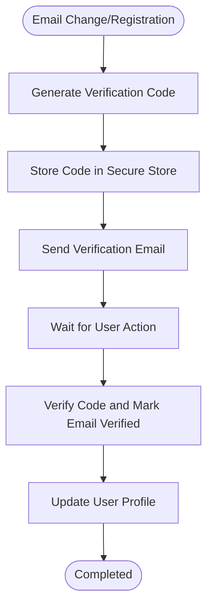

**Diagram sources**
- [auth.service.ts](file://apps/backend/src/auth/auth.service.ts)
- [auth.repository.ts](file://apps/backend/src/auth/auth.repository.ts)

**Section sources**
- [auth.service.ts](file://apps/backend/src/auth/auth.service.ts)
- [auth.repository.ts](file://apps/backend/src/auth/auth.repository.ts)

### Password Security Measures
- Hashing: Strong hashing algorithm used for passwords with unique salts per user.
- Strength Validation: Enforces minimum length, complexity, and common password checks.
- Rotation: Supports periodic password rotation and prevents reuse of recent passwords.
- Reset Flow: Time-bound reset tokens delivered via email with single-use semantics.

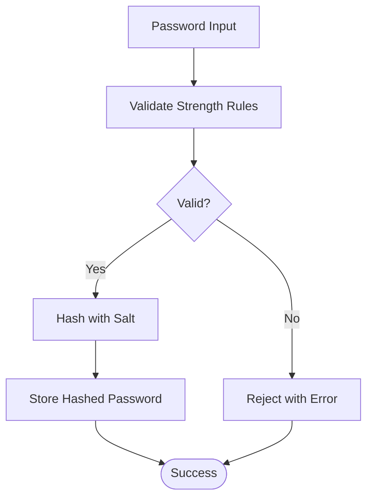

**Diagram sources**
- [auth.service.ts](file://apps/backend/src/auth/auth.service.ts)

**Section sources**
- [auth.service.ts](file://apps/backend/src/auth/auth.service.ts)

### Input Validation and Output Sanitization
- Input Validation: DTOs and pipes enforce schema validation and type coercion before controllers process requests.
- Output Sanitization: Interceptors strip sensitive fields and ensure safe serialization of responses.
- Consistency: Centralized validation rules reduce duplication and improve reliability.

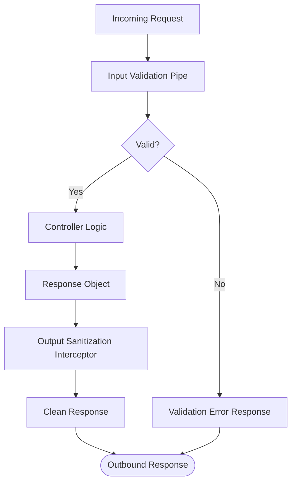

**Diagram sources**
- [input-validation.pipe.ts](file://apps/backend/src/common/pipes/input-validation.pipe.ts)
- [output-sanitization.interceptor.ts](file://apps/backend/src/common/interceptors/output-sanitization.interceptor.ts)
- [auth.controller.ts](file://apps/backend/src/auth/auth.controller.ts)

**Section sources**
- [input-validation.pipe.ts](file://apps/backend/src/common/pipes/input-validation.pipe.ts)
- [output-sanitization.interceptor.ts](file://apps/backend/src/common/interceptors/output-sanitization.interceptor.ts)
- [auth.controller.ts](file://apps/backend/src/auth/auth.controller.ts)

### Audit Logging
- Event Capture: Authentication events (login, logout, failed attempts, password resets) are logged with contextual details.
- Correlation: Requests include correlation IDs for tracing across services.
- Retention: Logs are structured and retained according to policy.

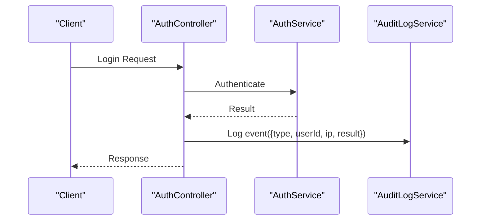

**Diagram sources**
- [audit-log.service.ts](file://apps/backend/src/core/audit/audit-log.service.ts)
- [auth.controller.ts](file://apps/backend/src/auth/auth.controller.ts)
- [auth.service.ts](file://apps/backend/src/auth/auth.service.ts)

**Section sources**
- [audit-log.service.ts](file://apps/backend/src/core/audit/audit-log.service.ts)
- [auth.controller.ts](file://apps/backend/src/auth/auth.controller.ts)
- [auth.service.ts](file://apps/backend/src/auth/auth.service.ts)

### Security Headers
- Global Headers: Middleware sets strict transport security, content type options, frameguard, XSS protection, and more.
- CSP: Content Security Policy configured to mitigate injection attacks.
- Cache Control: Prevents caching of sensitive responses.

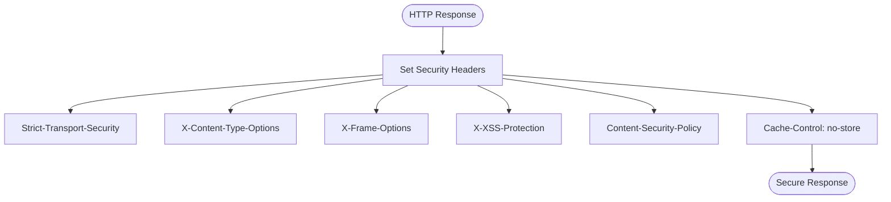

**Diagram sources**
- [security.headers.interceptor.ts](file://apps/backend/src/common/interceptors/security.headers.interceptor.ts)

**Section sources**
- [security.headers.interceptor.ts](file://apps/backend/src/common/interceptors/security.headers.interceptor.ts)

### Rate Limiting
- Per-Endpoint Limits: Controllers or routes apply fine-grained rate limits.
- Global Limits: Application-level middleware enforces baseline limits.
- Auditing: Rate limit events are logged for monitoring and alerting.

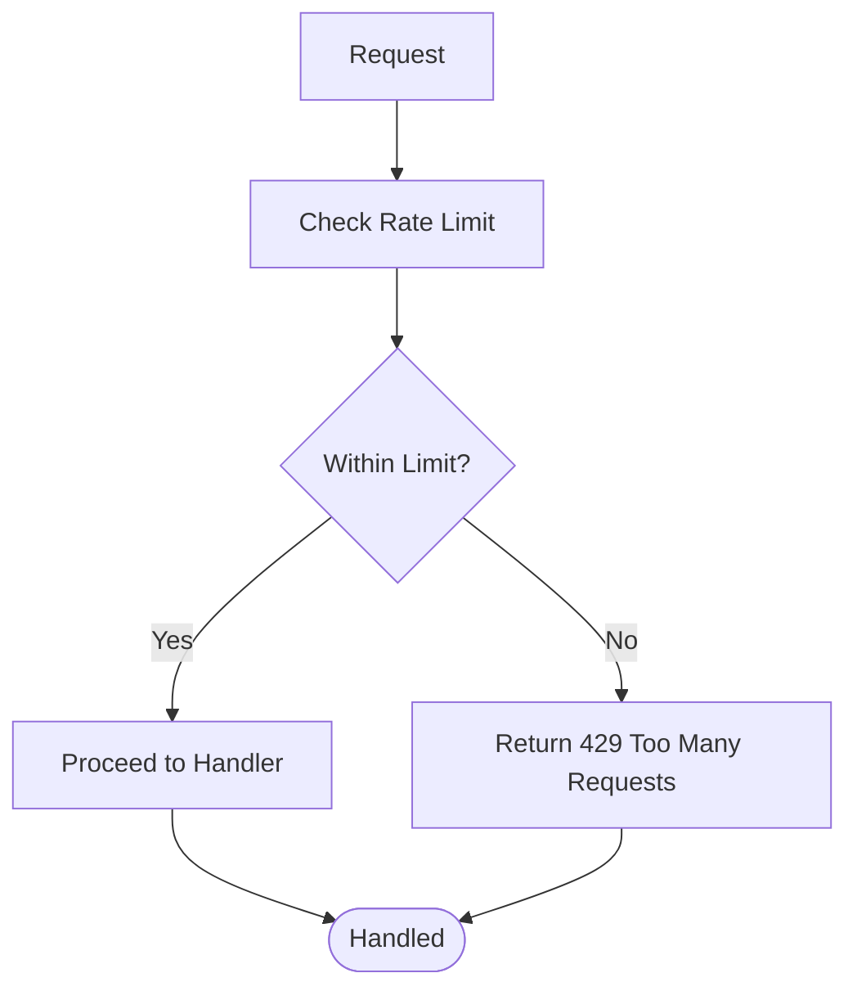

**Diagram sources**
- [rate-limit-audit.service.ts](file://apps/backend/src/hardening/rate-limit-audit.service.ts)

**Section sources**
- [rate-limit-audit.service.ts](file://apps/backend/src/hardening/rate-limit-audit.service.ts)

### CORS Configuration
- Origins: Allowed origins restricted to trusted domains.
- Methods and Headers: Whitelisted HTTP methods and headers.
- Credentials: Cookie and authorization headers allowed when necessary.

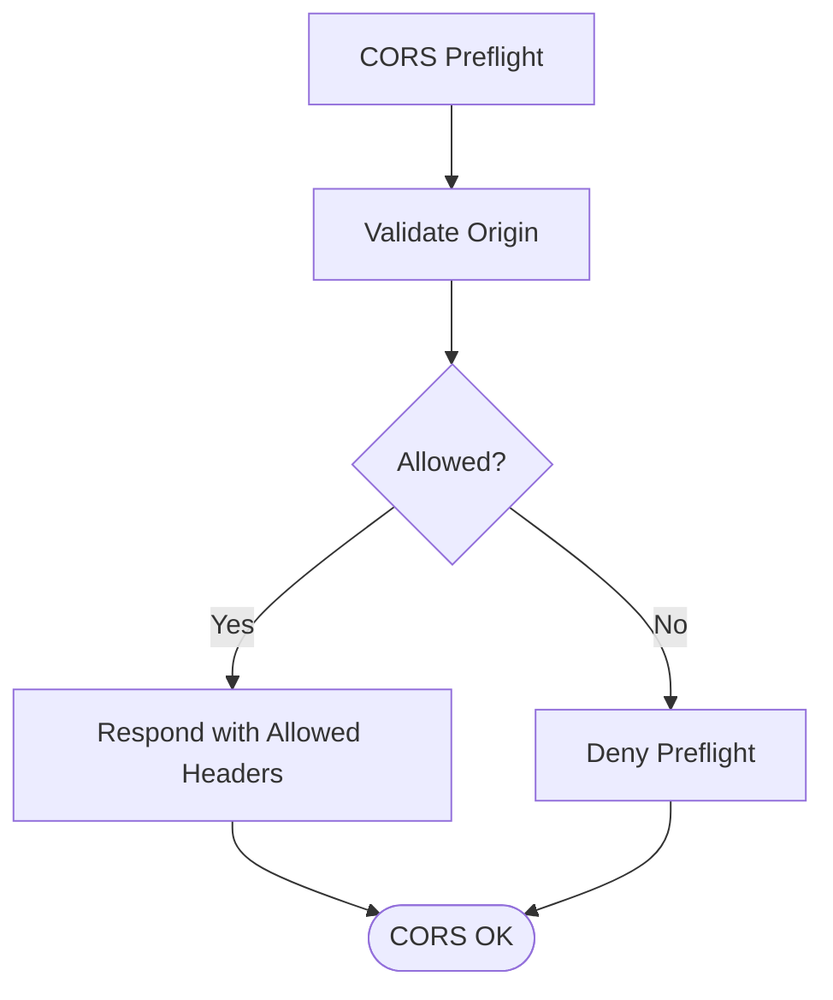

**Diagram sources**
- [cors.config.ts](file://apps/backend/src/config/cors.config.ts)

**Section sources**
- [cors.config.ts](file://apps/backend/src/config/cors.config.ts)

### CSRF Protection
- Token Exchange: CSRF tokens issued and validated for state-changing requests.
- SameSite Cookies: Secure cookie attributes applied where applicable.
- Exclusions: Public read-only endpoints excluded from CSRF checks.

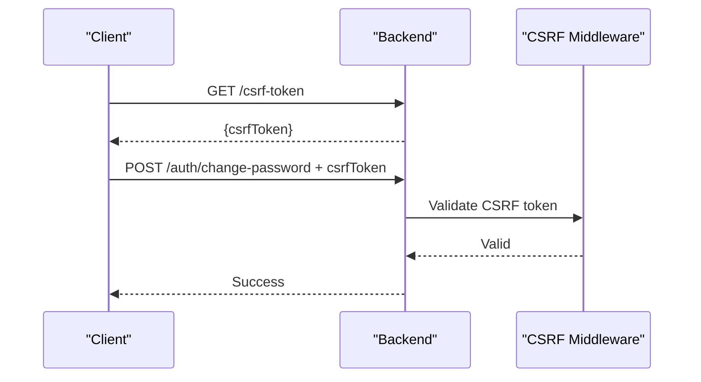

**Diagram sources**
- [csrf.middleware.ts](file://apps/backend/src/common/middleware/csrf.middleware.ts)

**Section sources**
- [csrf.middleware.ts](file://apps/backend/src/common/middleware/csrf.middleware.ts)

### Secure Cookie Settings
- HttpOnly: Prevents client-side script access to cookies.
- Secure: Ensures cookies are only sent over HTTPS.
- SameSite: Mitigates cross-site request forgery.
- Domain and Path: Restrict scope to intended domains and paths.

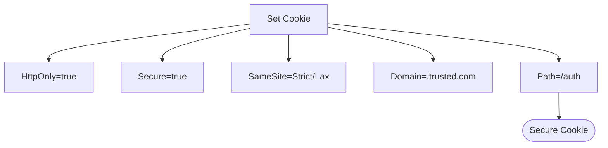

**Diagram sources**
- [configuration.ts](file://apps/backend/src/config/configuration.ts)
- [env.validation.ts](file://apps/backend/src/config/env.validation.ts)

**Section sources**
- [configuration.ts](file://apps/backend/src/config/configuration.ts)
- [env.validation.ts](file://apps/backend/src/config/env.validation.ts)

## Dependency Analysis
The authentication module depends on infrastructure services (Redis), configuration, and cross-cutting security components. Strategies integrate with external OAuth providers. Guards and decorators depend on request context populated by strategies and middleware.

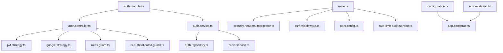

**Diagram sources**
- [auth.module.ts](file://apps/backend/src/auth/auth.module.ts)
- [auth.controller.ts](file://apps/backend/src/auth/auth.controller.ts)
- [auth.service.ts](file://apps/backend/src/auth/auth.service.ts)
- [auth.repository.ts](file://apps/backend/src/auth/auth.repository.ts)
- [redis.service.ts](file://apps/backend/src/redis/redis.service.ts)
- [jwt.strategy.ts](file://apps/backend/src/auth/strategies/jwt.strategy.ts)
- [google.strategy.ts](file://apps/backend/src/auth/strategies/google.strategy.ts)
- [roles.guard.ts](file://apps/backend/src/auth/guards/roles.guard.ts)
- [is-authenticated.guard.ts](file://apps/backend/src/auth/guards/is-authenticated.guard.ts)
- [security.headers.interceptor.ts](file://apps/backend/src/common/interceptors/security.headers.interceptor.ts)
- [csrf.middleware.ts](file://apps/backend/src/common/middleware/csrf.middleware.ts)
- [cors.config.ts](file://apps/backend/src/config/cors.config.ts)
- [rate-limit-audit.service.ts](file://apps/backend/src/hardening/rate-limit-audit.service.ts)
- [configuration.ts](file://apps/backend/src/config/configuration.ts)
- [env.validation.ts](file://apps/backend/src/config/env.validation.ts)
- [app.bootstrap.ts](file://apps/backend/src/app.bootstrap.ts)
- [main.ts](file://apps/backend/src/main.ts)

**Section sources**
- [auth.module.ts](file://apps/backend/src/auth/auth.module.ts)
- [auth.controller.ts](file://apps/backend/src/auth/auth.controller.ts)
- [auth.service.ts](file://apps/backend/src/auth/auth.service.ts)
- [auth.repository.ts](file://apps/backend/src/auth/auth.repository.ts)
- [redis.service.ts](file://apps/backend/src/redis/redis.service.ts)
- [jwt.strategy.ts](file://apps/backend/src/auth/strategies/jwt.strategy.ts)
- [google.strategy.ts](file://apps/backend/src/auth/strategies/google.strategy.ts)
- [roles.guard.ts](file://apps/backend/src/auth/guards/roles.guard.ts)
- [is-authenticated.guard.ts](file://apps/backend/src/auth/guards/is-authenticated.guard.ts)
- [security.headers.interceptor.ts](file://apps/backend/src/common/interceptors/security.headers.interceptor.ts)
- [csrf.middleware.ts](file://apps/backend/src/common/middleware/csrf.middleware.ts)
- [cors.config.ts](file://apps/backend/src/config/cors.config.ts)
- [rate-limit-audit.service.ts](file://apps/backend/src/hardening/rate-limit-audit.service.ts)
- [configuration.ts](file://apps/backend/src/config/configuration.ts)
- [env.validation.ts](file://apps/backend/src/config/env.validation.ts)
- [app.bootstrap.ts](file://apps/backend/src/app.bootstrap.ts)
- [main.ts](file://apps/backend/src/main.ts)

## Performance Considerations
- Short-Lived Access Tokens: Reduce exposure window and minimize server-side checks.
- Redis Latency: Cache frequently accessed user profiles and session metadata; use connection pooling.
- Batch Operations: Where possible, batch Redis writes for token rotation and audit logs.
- Indexing: Ensure database indexes for user lookups by email and provider IDs.
- Monitoring: Track latency and error rates for auth endpoints and Redis operations.

[No sources needed since this section provides general guidance]

## Troubleshooting Guide
- Invalid Token Errors: Inspect JWT signature, expiry, and Redis blacklist status.
- OAuth Failures: Verify client credentials, redirect URIs, and scope mappings.
- Rate Limiting: Check per-endpoint counters and global limits; adjust thresholds as needed.
- CSRF Rejections: Ensure CSRF tokens are included and not expired; validate SameSite settings.
- CORS Issues: Confirm allowed origins and credentials settings; inspect preflight responses.
- Cookie Problems: Verify HttpOnly, Secure, SameSite, domain, and path attributes.

**Section sources**
- [jwt.strategy.ts](file://apps/backend/src/auth/strategies/jwt.strategy.ts)
- [google.strategy.ts](file://apps/backend/src/auth/strategies/google.strategy.ts)
- [rate-limit-audit.service.ts](file://apps/backend/src/hardening/rate-limit-audit.service.ts)
- [csrf.middleware.ts](file://apps/backend/src/common/middleware/csrf.middleware.ts)
- [cors.config.ts](file://apps/backend/src/config/cors.config.ts)
- [configuration.ts](file://apps/backend/src/config/configuration.ts)

## Conclusion
The security and authentication system integrates JWT-based stateless authentication with Redis-backed session management, robust RBAC, and comprehensive cross-cutting protections. OAuth with Google enables seamless third-party logins, while email verification and password security measures safeguard user accounts. Input validation, output sanitization, audit logging, security headers, rate limiting, CORS, CSRF, and secure cookies collectively harden the application against common vulnerabilities. Operators should monitor performance and security metrics, tune configurations for production, and regularly review policies and dependencies.

[No sources needed since this section summarizes without analyzing specific files]