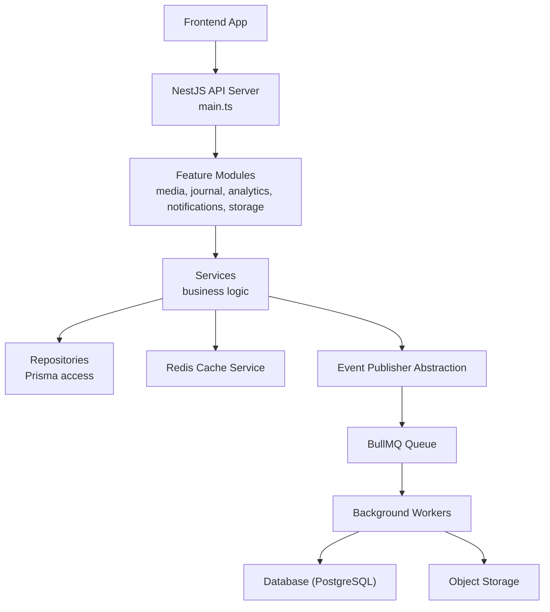
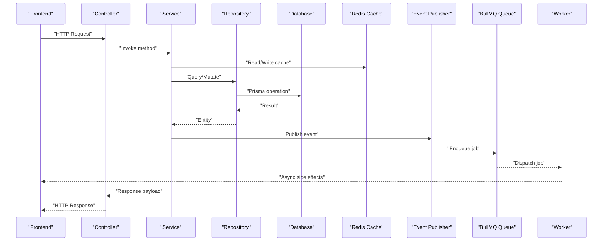
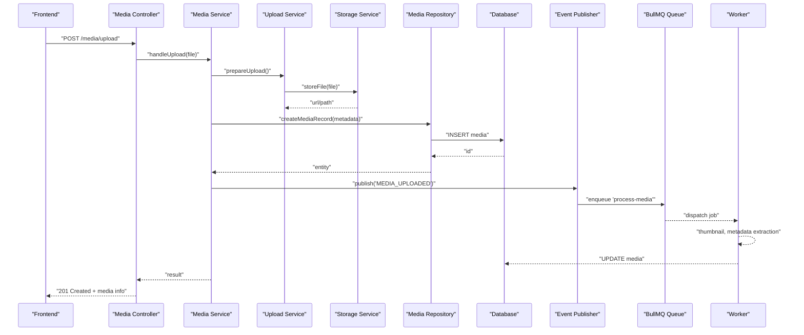
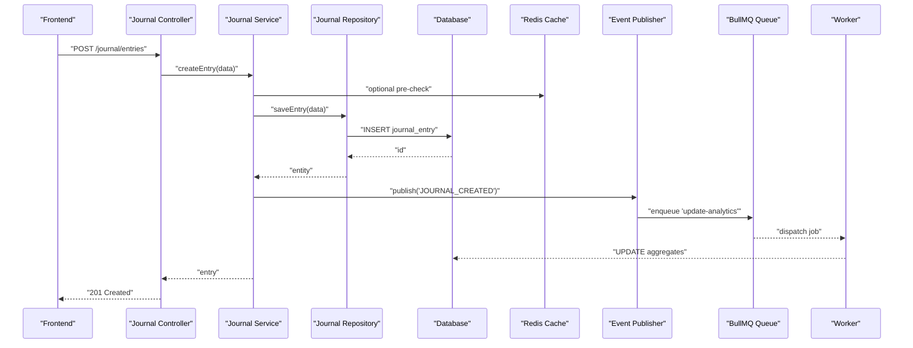
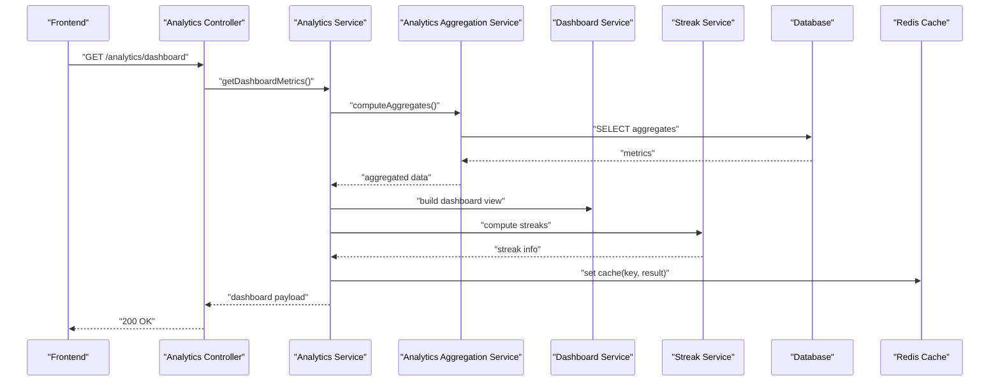
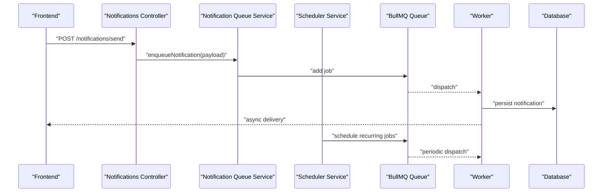
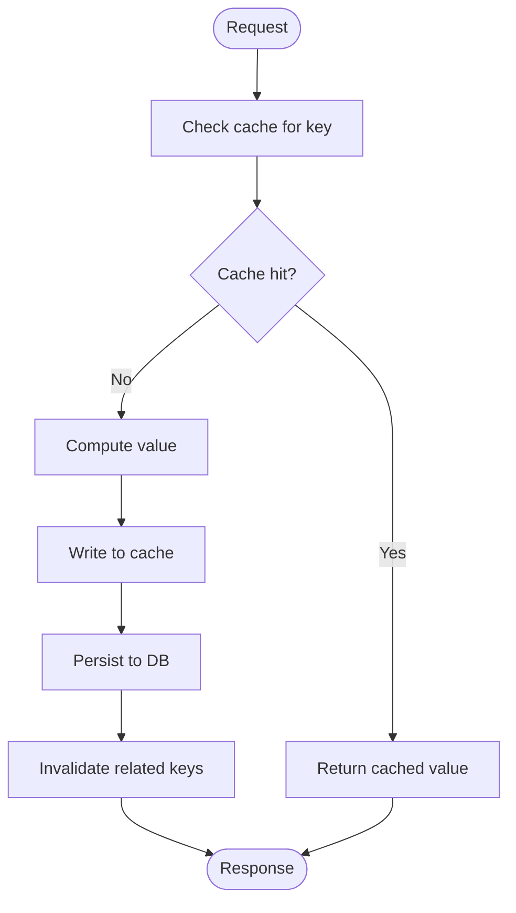
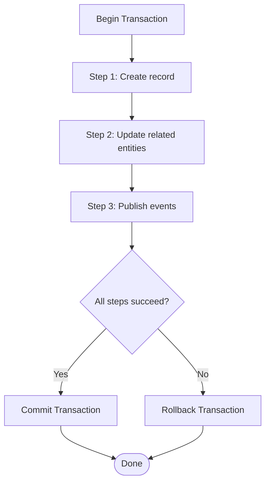
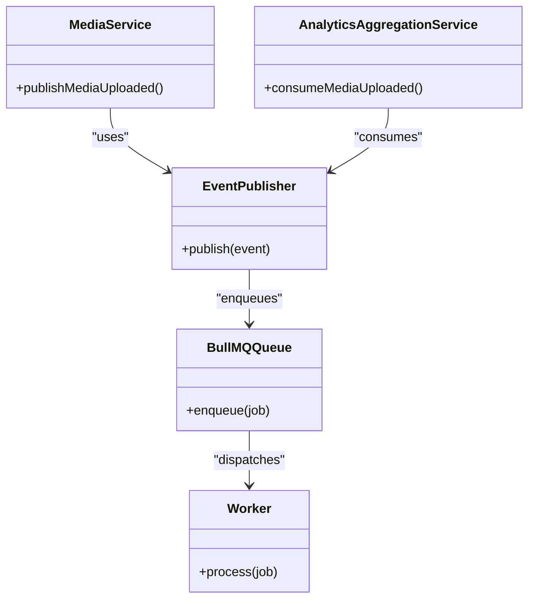
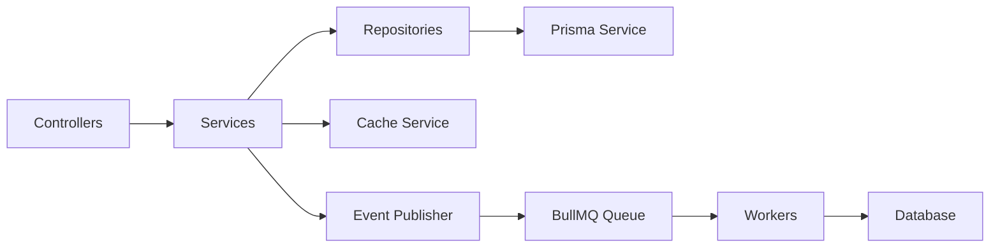

# Data Flow Architecture

<cite>
**Referenced Files in This Document**
- [main.ts](file://apps/backend/src/main.ts)
- [app.module.ts](file://apps/backend/src/app.module.ts)
- [bullmq.module.ts](file://apps/backend/src/bullmq/bullmq.module.ts)
- [redis.service.ts](file://apps/backend/src/redis/redis.service.ts)
- [media.controller.ts](file://apps/backend/src/media/media.controller.ts)
- [media.service.ts](file://apps/backend/src/media/media.service.ts)
- [media.repository.ts](file://apps/backend/src/media/media.repository.ts)
- [upload.service.ts](file://apps/backend/src/storage/upload.service.ts)
- [storage.service.ts](file://apps/backend/src/storage/storage.service.ts)
- [journal.controller.ts](file://apps/backend/src/journal/journal.controller.ts)
- [journal.service.ts](file://apps/backend/src/journal/journal.service.ts)
- [journal.repository.ts](file://apps/backend/src/journal/journal.repository.ts)
- [analytics.controller.ts](file://apps/backend/src/analytics/analytics.controller.ts)
- [analytics.service.ts](file://apps/backend/src/analytics/analytics.service.ts)
- [analytics-aggregation.service.ts](file://apps/backend/src/analytics/analytics-aggregation.service.ts)
- [dashboard.service.ts](file://apps/backend/src/analytics/dashboard.service.ts)
- [streak.service.ts](file://apps/backend/src/analytics/streak.service.ts)
- [notifications.controller.ts](file://apps/backend/src/notifications/notifications.controller.ts)
- [notification-queue.service.ts](file://apps/backend/src/notifications/notification-queue.service.ts)
- [scheduler.service.ts](file://apps/backend/src/notifications/scheduler.service.ts)
- [cache.service.ts](file://apps/backend/src/hardening/cache.service.ts)
- [cache-invalidation.service.ts](file://apps/backend/src/hardening/cache-invalidation.service.ts)
- [core.module.ts](file://apps/backend/src/core/core.module.ts)
- [events/index.ts](file://apps/backend/src/core/events/index.ts)
- [transaction/index.ts](file://apps/backend/src/core/transaction/index.ts)
- [prisma.service.ts](file://apps/backend/src/prisma/prisma.service.ts)
- [schema.prisma](file://apps/backend/prisma/schema.prisma)
</cite>

## Table of Contents
1. [Introduction](#introduction)
2. [Project Structure](#project-structure)
3. [Core Components](#core-components)
4. [Architecture Overview](#architecture-overview)
5. [Detailed Component Analysis](#detailed-component-analysis)
6. [Dependency Analysis](#dependency-analysis)
7. [Performance Considerations](#performance-considerations)
8. [Troubleshooting Guide](#troubleshooting-guide)
9. [Conclusion](#conclusion)

## Introduction
This document explains how data moves through the Chronicle Your Media Story system, focusing on request-response cycles from frontend components to API endpoints, database operations, event-driven propagation, background job processing with BullMQ, caching with Redis, transaction management, and data consistency strategies. It includes sequence diagrams for typical workflows such as media upload, journal entry creation, and analytics aggregation.

## Project Structure
The backend is a NestJS application organized by feature modules (media, journal, analytics, notifications, storage, etc.) with shared core capabilities (events, transactions, cache, Prisma). The entry point initializes the HTTP server, global interceptors/filters, and module graph. Feature controllers expose REST endpoints; services encapsulate business logic; repositories abstract persistence via Prisma. Background jobs are managed by BullMQ with Redis as the queue store. Caching is provided by a dedicated service layer over Redis.

**Diagram sources**
- [main.ts](file://apps/backend/src/main.ts)
- [app.module.ts](file://apps/backend/src/app.module.ts)
- [bullmq.module.ts](file://apps/backend/src/bullmq/bullmq.module.ts)
- [redis.service.ts](file://apps/backend/src/redis/redis.service.ts)
- [media.controller.ts](file://apps/backend/src/media/media.controller.ts)
- [journal.controller.ts](file://apps/backend/src/journal/journal.controller.ts)
- [analytics.controller.ts](file://apps/backend/src/analytics/analytics.controller.ts)
- [notifications.controller.ts](file://apps/backend/src/notifications/notifications.controller.ts)

**Section sources**
- [main.ts](file://apps/backend/src/main.ts)
- [app.module.ts](file://apps/backend/src/app.module.ts)

## Core Components
- Controllers: Define HTTP endpoints for media, journal, analytics, notifications, and storage. They validate inputs, delegate to services, and return standardized responses.
- Services: Implement domain logic, orchestrate repositories, publish events, interact with cache, and manage transactions.
- Repositories: Encapsulate Prisma queries and mutations for each domain entity.
- Event Publisher: Decouples producers from consumers; events are enqueued into BullMQ for async processing.
- Background Jobs: BullMQ workers process queued tasks like notifications, aggregations, and cleanup.
- Cache: Redis-backed caching service with invalidation helpers.
- Transaction Manager: Wraps multi-step operations in database transactions for consistency.
- Prisma: ORM providing type-safe database access and migrations.

**Section sources**
- [media.controller.ts](file://apps/backend/src/media/media.controller.ts)
- [media.service.ts](file://apps/backend/src/media/media.service.ts)
- [media.repository.ts](file://apps/backend/src/media/media.repository.ts)
- [journal.controller.ts](file://apps/backend/src/journal/journal.controller.ts)
- [journal.service.ts](file://apps/backend/src/journal/journal.service.ts)
- [journal.repository.ts](file://apps/backend/src/journal/journal.repository.ts)
- [analytics.controller.ts](file://apps/backend/src/analytics/analytics.controller.ts)
- [analytics.service.ts](file://apps/backend/src/analytics/analytics.service.ts)
- [notifications.controller.ts](file://apps/backend/src/notifications/notifications.controller.ts)
- [notification-queue.service.ts](file://apps/backend/src/notifications/notification-queue.service.ts)
- [scheduler.service.ts](file://apps/backend/src/notifications/scheduler.service.ts)
- [cache.service.ts](file://apps/backend/src/hardening/cache.service.ts)
- [cache-invalidation.service.ts](file://apps/backend/src/hardening/cache-invalidation.service.ts)
- [core.module.ts](file://apps/backend/src/core/core.module.ts)
- [events/index.ts](file://apps/backend/src/core/events/index.ts)
- [transaction/index.ts](file://apps/backend/src/core/transaction/index.ts)
- [prisma.service.ts](file://apps/backend/src/prisma/prisma.service.ts)
- [schema.prisma](file://apps/backend/prisma/schema.prisma)

## Architecture Overview
The system follows a layered architecture:
- Presentation Layer: Frontend components call REST endpoints.
- API Layer: NestJS controllers handle requests, validation, and response formatting.
- Domain Layer: Services implement business rules, coordinate repositories, and publish events.
- Infrastructure Layer: Repositories use Prisma for persistence; Redis provides caching and queues; object storage handles media files.

**Diagram sources**
- [media.controller.ts](file://apps/backend/src/media/media.controller.ts)
- [media.service.ts](file://apps/backend/src/media/media.service.ts)
- [media.repository.ts](file://apps/backend/src/media/media.repository.ts)
- [cache.service.ts](file://apps/backend/src/hardening/cache.service.ts)
- [events/index.ts](file://apps/backend/src/core/events/index.ts)
- [bullmq.module.ts](file://apps/backend/src/bullmq/bullmq.module.ts)

## Detailed Component Analysis

### Media Upload Workflow
Media upload involves controller handling multipart/form-data, service orchestrating storage and metadata, repository persisting records, and background jobs for processing.

**Diagram sources**
- [media.controller.ts](file://apps/backend/src/media/media.controller.ts)
- [media.service.ts](file://apps/backend/src/media/media.service.ts)
- [upload.service.ts](file://apps/backend/src/storage/upload.service.ts)
- [storage.service.ts](file://apps/backend/src/storage/storage.service.ts)
- [media.repository.ts](file://apps/backend/src/media/media.repository.ts)
- [events/index.ts](file://apps/backend/src/core/events/index.ts)
- [bullmq.module.ts](file://apps/backend/src/bullmq/bullmq.module.ts)

**Section sources**
- [media.controller.ts](file://apps/backend/src/media/media.controller.ts)
- [media.service.ts](file://apps/backend/src/media/media.service.ts)
- [upload.service.ts](file://apps/backend/src/storage/upload.service.ts)
- [storage.service.ts](file://apps/backend/src/storage/storage.service.ts)
- [media.repository.ts](file://apps/backend/src/media/media.repository.ts)

### Journal Entry Creation Workflow
Journal entries are created synchronously with optional async enrichment (e.g., suggestions or analytics updates).

**Diagram sources**
- [journal.controller.ts](file://apps/backend/src/journal/journal.controller.ts)
- [journal.service.ts](file://apps/backend/src/journal/journal.service.ts)
- [journal.repository.ts](file://apps/backend/src/journal/journal.repository.ts)
- [events/index.ts](file://apps/backend/src/core/events/index.ts)
- [bullmq.module.ts](file://apps/backend/src/bullmq/bullmq.module.ts)

**Section sources**
- [journal.controller.ts](file://apps/backend/src/journal/journal.controller.ts)
- [journal.service.ts](file://apps/backend/src/journal/journal.service.ts)
- [journal.repository.ts](file://apps/backend/src/journal/journal.repository.ts)

### Analytics Aggregation Workflow
Analytics endpoints serve aggregated metrics computed asynchronously via background jobs.

**Diagram sources**
- [analytics.controller.ts](file://apps/backend/src/analytics/analytics.controller.ts)
- [analytics.service.ts](file://apps/backend/src/analytics/analytics.service.ts)
- [analytics-aggregation.service.ts](file://apps/backend/src/analytics/analytics-aggregation.service.ts)
- [dashboard.service.ts](file://apps/backend/src/analytics/dashboard.service.ts)
- [streak.service.ts](file://apps/backend/src/analytics/streak.service.ts)
- [cache.service.ts](file://apps/backend/src/hardening/cache.service.ts)

**Section sources**
- [analytics.controller.ts](file://apps/backend/src/analytics/analytics.controller.ts)
- [analytics.service.ts](file://apps/backend/src/analytics/analytics.service.ts)
- [analytics-aggregation.service.ts](file://apps/backend/src/analytics/analytics-aggregation.service.ts)
- [dashboard.service.ts](file://apps/backend/src/analytics/dashboard.service.ts)
- [streak.service.ts](file://apps/backend/src/analytics/streak.service.ts)

### Notification Queue and Scheduler
Notifications are enqueued and processed asynchronously, with scheduled tasks driving periodic work.

**Diagram sources**
- [notifications.controller.ts](file://apps/backend/src/notifications/notifications.controller.ts)
- [notification-queue.service.ts](file://apps/backend/src/notifications/notification-queue.service.ts)
- [scheduler.service.ts](file://apps/backend/src/notifications/scheduler.service.ts)
- [bullmq.module.ts](file://apps/backend/src/bullmq/bullmq.module.ts)

**Section sources**
- [notifications.controller.ts](file://apps/backend/src/notifications/notifications.controller.ts)
- [notification-queue.service.ts](file://apps/backend/src/notifications/notification-queue.service.ts)
- [scheduler.service.ts](file://apps/backend/src/notifications/scheduler.service.ts)

### Caching Strategy with Redis
Caching is implemented via a dedicated service that wraps Redis operations. Cache invalidation is coordinated through a helper service triggered by write paths.

**Diagram sources**
- [cache.service.ts](file://apps/backend/src/hardening/cache.service.ts)
- [cache-invalidation.service.ts](file://apps/backend/src/hardening/cache-invalidation.service.ts)

**Section sources**
- [cache.service.ts](file://apps/backend/src/hardening/cache.service.ts)
- [cache-invalidation.service.ts](file://apps/backend/src/hardening/cache-invalidation.service.ts)

### Transaction Management Patterns
Transactions wrap multi-step operations to ensure atomicity across repositories and external calls. Use the transaction abstraction to group writes and roll back on failure.

**Diagram sources**
- [transaction/index.ts](file://apps/backend/src/core/transaction/index.ts)

**Section sources**
- [transaction/index.ts](file://apps/backend/src/core/transaction/index.ts)

### Event-Driven Data Propagation
Events decouple producers from consumers. Producers publish domain events; consumers subscribe and enqueue jobs for background processing.

**Diagram sources**
- [events/index.ts](file://apps/backend/src/core/events/index.ts)
- [bullmq.module.ts](file://apps/backend/src/bullmq/bullmq.module.ts)

**Section sources**
- [events/index.ts](file://apps/backend/src/core/events/index.ts)
- [bullmq.module.ts](file://apps/backend/src/bullmq/bullmq.module.ts)

## Dependency Analysis
Key dependencies include:
- Controllers depend on Services for business logic.
- Services depend on Repositories for persistence and on Cache/EventPublisher for cross-cutting concerns.
- Repositories depend on Prisma for database access.
- Background workers depend on BullMQ and Redis for queueing and state.

**Diagram sources**
- [app.module.ts](file://apps/backend/src/app.module.ts)
- [prisma.service.ts](file://apps/backend/src/prisma/prisma.service.ts)
- [redis.service.ts](file://apps/backend/src/redis/redis.service.ts)
- [bullmq.module.ts](file://apps/backend/src/bullmq/bullmq.module.ts)

**Section sources**
- [app.module.ts](file://apps/backend/src/app.module.ts)
- [prisma.service.ts](file://apps/backend/src/prisma/prisma.service.ts)
- [redis.service.ts](file://apps/backend/src/redis/redis.service.ts)
- [bullmq.module.ts](file://apps/backend/src/bullmq/bullmq.module.ts)

## Performance Considerations
- Prefer read-through caching for frequently accessed aggregates; invalidate on writes.
- Offload heavy processing (media transcoding, analytics computation) to background jobs.
- Use pagination at the repository level to limit memory usage.
- Batch database operations where possible to reduce round-trips.
- Monitor queue depth and worker concurrency to avoid bottlenecks.

[No sources needed since this section provides general guidance]

## Troubleshooting Guide
Common issues and resolutions:
- Queue backlog: Inspect BullMQ queue status and worker logs; scale workers if necessary.
- Cache inconsistency: Verify cache invalidation triggers after writes; check TTL settings.
- Transaction failures: Review rollback behavior and error propagation; ensure idempotent retries.
- Database locks: Analyze long-running queries and adjust indexes; consider read replicas for heavy reads.

[No sources needed since this section provides general guidance]

## Conclusion
The Chronicle Your Media Story system uses a clear separation of concerns with controllers, services, and repositories, augmented by event-driven architecture and background processing. Redis caching and Prisma-based persistence provide performance and reliability. Proper transaction boundaries and cache invalidation ensure data consistency. The documented workflows illustrate typical user interactions and their underlying data flows.

[No sources needed since this section summarizes without analyzing specific files]