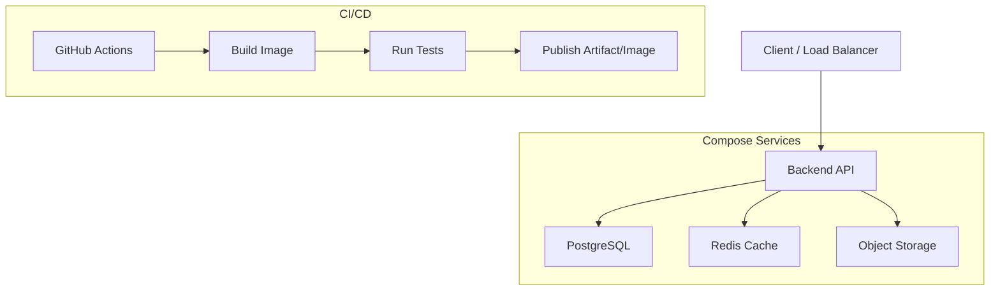
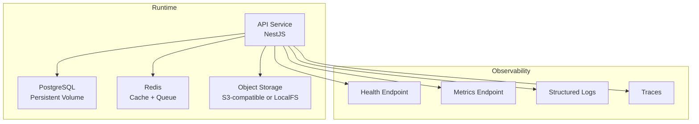
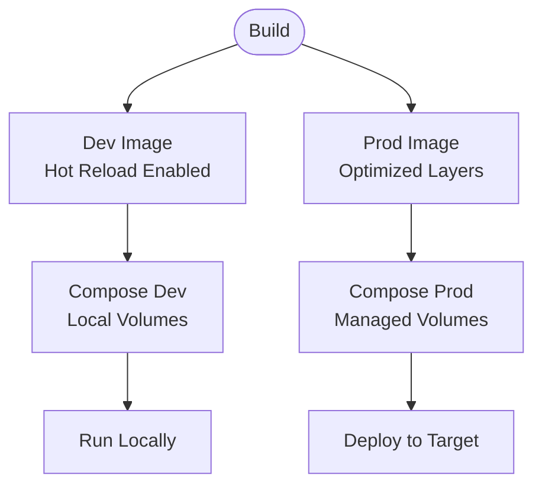
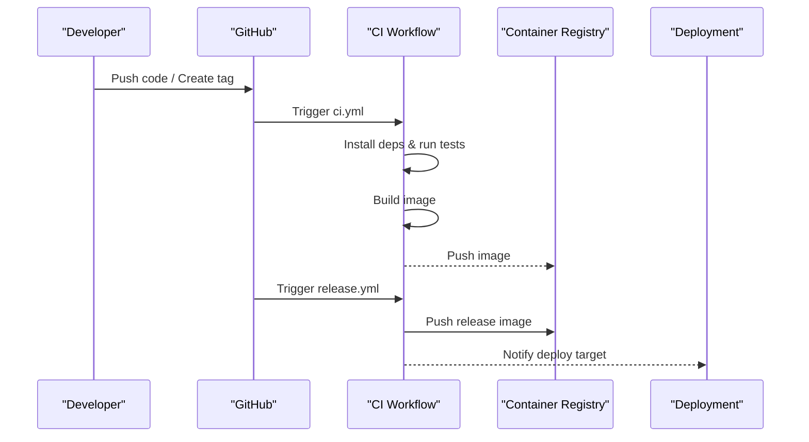
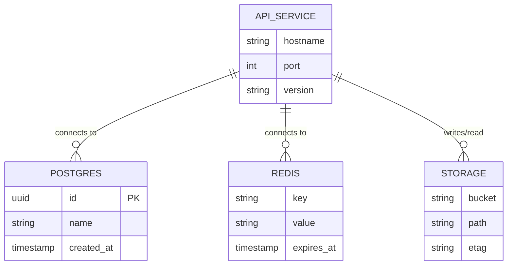
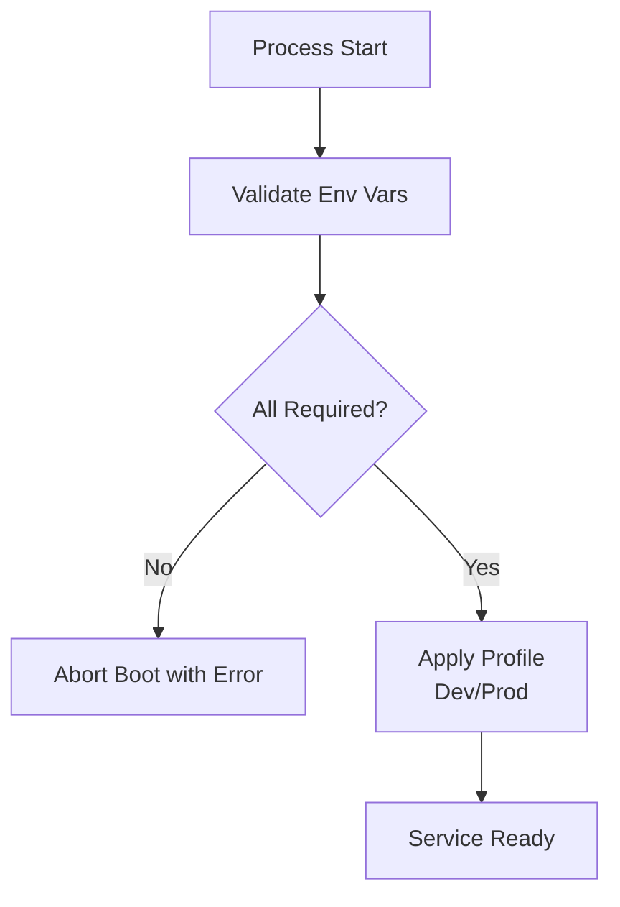
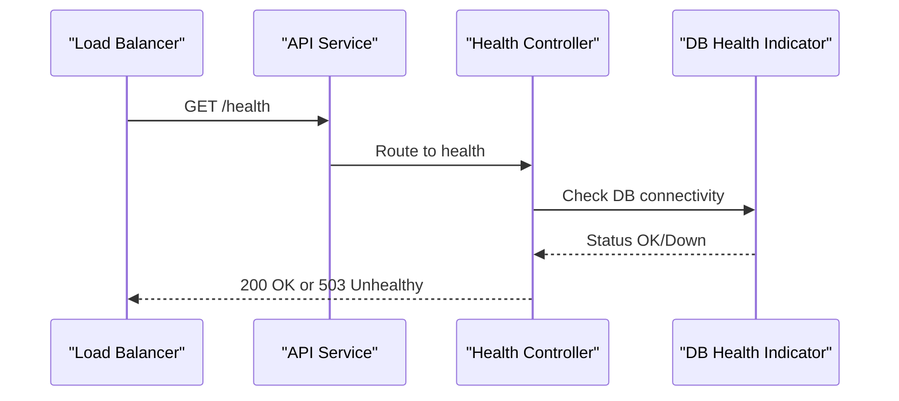
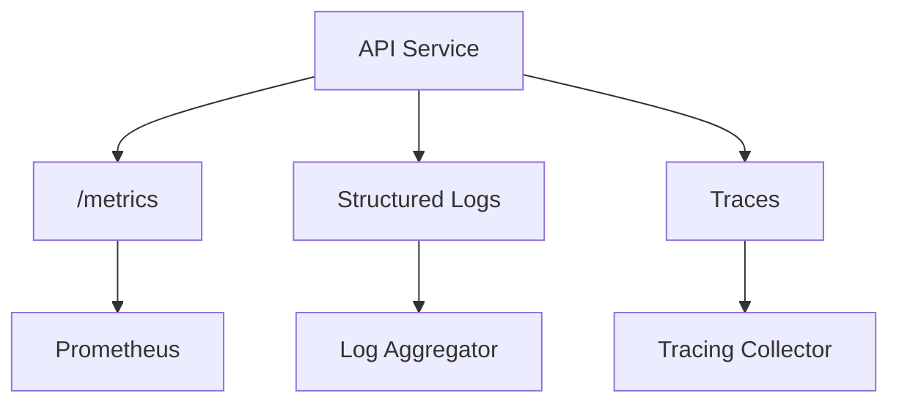
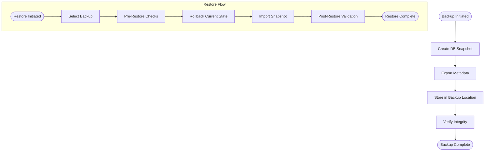
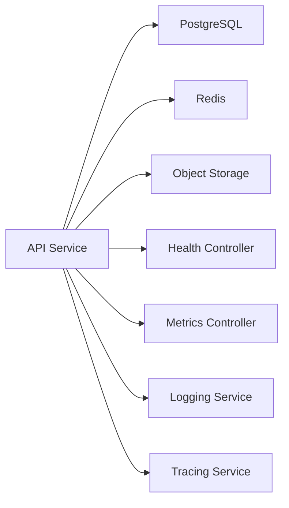

# Deployment Architecture

<cite>
**Referenced Files in This Document**
- [docker-compose.yml](file://apps/backend/docker-compose.yml)
- [docker-compose.dev.yml](file://apps/backend/docker-compose.dev.yml)
- [docker-compose.prod.yml](file://apps/backend/docker-compose.prod.yml)
- [Dockerfile](file://apps/backend/Dockerfile)
- [Dockerfile.dev](file://apps/backend/Dockerfile.dev)
- [ci.yml](file://.github/workflows/ci.yml)
- [release.yml](file://.github/workflows/release.yml)
- [package.json](file://apps/backend/package.json)
- [schema.prisma](file://apps/backend/prisma/schema.prisma)
- [main.ts](file://apps/backend/src/main.ts)
- [app.module.ts](file://apps/backend/src/app.module.ts)
- [health.controller.ts](file://apps/backend/src/health/health.controller.ts)
- [prisma-health.indicator.ts](file://apps/backend/src/health/prisma-health.indicator.ts)
- [metrics.controller.ts](file://apps/backend/src/observability/metrics.controller.ts)
- [logging.service.ts](file://apps/backend/src/observability/logging.service.ts)
- [tracing.service.ts](file://apps/backend/src/observability/tracing.service.ts)
- [redis.service.ts](file://apps/backend/src/redis/redis.service.ts)
- [storage.service.ts](file://apps/backend/src/storage/storage.service.ts)
- [backup.service.ts](file://apps/backend/src/deployment/backup.service.ts)
- [restore.service.ts](file://apps/backend/src/deployment/restore.service.ts)
- [production-configuration.service.ts](file://apps/backend/src/deployment/production-configuration.service.ts)
- [environment-validation.service.ts](file://apps/backend/src/deployment/environment-validation.service.ts)
- [DEPLOYMENT.md](file://docs/DEPLOYMENT.md)
- [BACKUP.md](file://docs/BACKUP.md)
- [DISASTER_RECOVERY.md](file://docs/DISASTER_RECOVERY.md)
- [PRODUCTION.md](file://docs/PRODUCTION.md)
- [OPERATIONS.md](file://docs/OPERATIONS.md)
</cite>

## Table of Contents
1. [Introduction](#introduction)
2. [Project Structure](#project-structure)
3. [Core Components](#core-components)
4. [Architecture Overview](#architecture-overview)
5. [Detailed Component Analysis](#detailed-component-analysis)
6. [Dependency Analysis](#dependency-analysis)
7. [Performance Considerations](#performance-considerations)
8. [Troubleshooting Guide](#troubleshooting-guide)
9. [Conclusion](#conclusion)
10. [Appendices](#appendices)

## Introduction
This document describes the deployment architecture for Chronicle Your Media Story, focusing on containerized deployment with Docker Compose for local development and production environments, CI/CD automation via GitHub Actions, infrastructure requirements (PostgreSQL, Redis, storage backends), environment-specific configurations, scaling considerations, monitoring setup, backup and recovery procedures, disaster recovery planning, and production best practices. It also documents health check endpoints, log aggregation, and performance monitoring integrations.

## Project Structure
The backend application is a NestJS service packaged as a Docker image and orchestrated with Docker Compose. The repository includes:
- Container definitions for development and production
- GitHub Actions workflows for CI and release
- Prisma schema and migrations
- Health, observability, and deployment services
- Documentation for operations, backup, and disaster recovery

**Diagram sources**
- [docker-compose.yml](file://apps/backend/docker-compose.yml)
- [docker-compose.dev.yml](file://apps/backend/docker-compose.dev.yml)
- [docker-compose.prod.yml](file://apps/backend/docker-compose.prod.yml)
- [ci.yml](file://.github/workflows/ci.yml)
- [release.yml](file://.github/workflows/release.yml)

**Section sources**
- [docker-compose.yml](file://apps/backend/docker-compose.yml)
- [docker-compose.dev.yml](file://apps/backend/docker-compose.dev.yml)
- [docker-compose.prod.yml](file://apps/backend/docker-compose.prod.yml)
- [ci.yml](file://.github/workflows/ci.yml)
- [release.yml](file://.github/workflows/release.yml)

## Core Components
- Backend API: NestJS application serving REST APIs, background jobs, and internal services.
- PostgreSQL: Relational database for persistent data; managed by Prisma ORM.
- Redis: In-memory cache and job queue backing for background processing.
- Object Storage: Pluggable storage backend for media assets.
- Observability: Health checks, metrics, logging, and tracing exposed via controllers and services.
- Deployment utilities: Backup and restore services, environment validation, and production configuration helpers.

Key runtime entry points and modules:
- Application bootstrap and module composition
- Health controller and indicators
- Metrics controller for Prometheus scraping
- Logging and tracing services
- Redis integration
- Storage abstraction

**Section sources**
- [main.ts](file://apps/backend/src/main.ts)
- [app.module.ts](file://apps/backend/src/app.module.ts)
- [health.controller.ts](file://apps/backend/src/health/health.controller.ts)
- [prisma-health.indicator.ts](file://apps/backend/src/health/prisma-health.indicator.ts)
- [metrics.controller.ts](file://apps/backend/src/observability/metrics.controller.ts)
- [logging.service.ts](file://apps/backend/src/observability/logging.service.ts)
- [tracing.service.ts](file://apps/backend/src/observability/tracing.service.ts)
- [redis.service.ts](file://apps/backend/src/redis/redis.service.ts)
- [storage.service.ts](file://apps/backend/src/storage/storage.service.ts)
- [backup.service.ts](file://apps/backend/src/deployment/backup.service.ts)
- [restore.service.ts](file://apps/backend/src/deployment/restore.service.ts)
- [production-configuration.service.ts](file://apps/backend/src/deployment/production-configuration.service.ts)
- [environment-validation.service.ts](file://apps/backend/src/deployment/environment-validation.service.ts)

## Architecture Overview
The system deploys as a set of containers orchestrated by Docker Compose. The API depends on PostgreSQL and Redis, and writes media to an object storage backend. Health and metrics endpoints are exposed for orchestration and monitoring. CI/CD automates testing, building, and publishing artifacts/images.

**Diagram sources**
- [docker-compose.yml](file://apps/backend/docker-compose.yml)
- [docker-compose.prod.yml](file://apps/backend/docker-compose.prod.yml)
- [health.controller.ts](file://apps/backend/src/health/health.controller.ts)
- [metrics.controller.ts](file://apps/backend/src/observability/metrics.controller.ts)
- [logging.service.ts](file://apps/backend/src/observability/logging.service.ts)
- [tracing.service.ts](file://apps/backend/src/observability/tracing.service.ts)

## Detailed Component Analysis

### Containerization Strategy
- Development image: Optimized for hot reload and debugging.
- Production image: Multi-stage build for minimal runtime footprint.
- Compose profiles: Separate compose files for dev and prod with distinct volumes, networks, and environment variables.

**Diagram sources**
- [Dockerfile](file://apps/backend/Dockerfile)
- [Dockerfile.dev](file://apps/backend/Dockerfile.dev)
- [docker-compose.yml](file://apps/backend/docker-compose.yml)
- [docker-compose.dev.yml](file://apps/backend/docker-compose.dev.yml)
- [docker-compose.prod.yml](file://apps/backend/docker-compose.prod.yml)

**Section sources**
- [Dockerfile](file://apps/backend/Dockerfile)
- [Dockerfile.dev](file://apps/backend/Dockerfile.dev)
- [docker-compose.yml](file://apps/backend/docker-compose.yml)
- [docker-compose.dev.yml](file://apps/backend/docker-compose.dev.yml)
- [docker-compose.prod.yml](file://apps/backend/docker-compose.prod.yml)

### CI/CD Pipeline (GitHub Actions)
- CI workflow: Installs dependencies, runs tests, builds the application image, and publishes artifacts.
- Release workflow: Triggers on tags/releases, builds images, pushes to registry, and can trigger deployments.

**Diagram sources**
- [ci.yml](file://.github/workflows/ci.yml)
- [release.yml](file://.github/workflows/release.yml)

**Section sources**
- [ci.yml](file://.github/workflows/ci.yml)
- [release.yml](file://.github/workflows/release.yml)

### Infrastructure Requirements
- PostgreSQL: Persistent relational store used by Prisma. Requires volume persistence and migration execution at startup.
- Redis: Cache and queue backend for background tasks.
- Storage Backends: Configurable object storage (e.g., S3-compatible or local filesystem).
- Networking: Internal network for service communication; external exposure only for API and health/metrics endpoints as needed.

**Diagram sources**
- [schema.prisma](file://apps/backend/prisma/schema.prisma)
- [redis.service.ts](file://apps/backend/src/redis/redis.service.ts)
- [storage.service.ts](file://apps/backend/src/storage/storage.service.ts)

**Section sources**
- [schema.prisma](file://apps/backend/prisma/schema.prisma)
- [redis.service.ts](file://apps/backend/src/redis/redis.service.ts)
- [storage.service.ts](file://apps/backend/src/storage/storage.service.ts)

### Environment-Specific Configuration
- Development: Hot reload, verbose logs, local storage, and debug flags.
- Production: Minimal logs, hardened settings, external secrets, and resource limits.
- Validation: Runtime environment validation ensures required keys exist before boot.

**Diagram sources**
- [environment-validation.service.ts](file://apps/backend/src/deployment/environment-validation.service.ts)
- [production-configuration.service.ts](file://apps/backend/src/deployment/production-configuration.service.ts)

**Section sources**
- [environment-validation.service.ts](file://apps/backend/src/deployment/environment-validation.service.ts)
- [production-configuration.service.ts](file://apps/backend/src/deployment/production-configuration.service.ts)

### Health Check Endpoints
- Health controller exposes readiness/liveness endpoints.
- Database health indicator verifies connectivity and schema status.
- Metrics endpoint exposes Prometheus-compatible metrics.

**Diagram sources**
- [health.controller.ts](file://apps/backend/src/health/health.controller.ts)
- [prisma-health.indicator.ts](file://apps/backend/src/health/prisma-health.indicator.ts)

**Section sources**
- [health.controller.ts](file://apps/backend/src/health/health.controller.ts)
- [prisma-health.indicator.ts](file://apps/backend/src/health/prisma-health.indicator.ts)

### Monitoring and Observability
- Metrics: Prometheus scrape endpoint for CPU, memory, HTTP, and custom business metrics.
- Logging: Structured JSON logs emitted via logging service; aggregate centrally.
- Tracing: Distributed tracing enabled via tracing service for request spans.

**Diagram sources**
- [metrics.controller.ts](file://apps/backend/src/observability/metrics.controller.ts)
- [logging.service.ts](file://apps/backend/src/observability/logging.service.ts)
- [tracing.service.ts](file://apps/backend/src/observability/tracing.service.ts)

**Section sources**
- [metrics.controller.ts](file://apps/backend/src/observability/metrics.controller.ts)
- [logging.service.ts](file://apps/backend/src/observability/logging.service.ts)
- [tracing.service.ts](file://apps/backend/src/observability/tracing.service.ts)

### Backup and Recovery Procedures
- Backup service: Exports database snapshots and metadata; supports scheduled runs.
- Restore service: Restores from backups with integrity checks and rollback hooks.
- Operational scripts: Backup shell script for CLI-driven maintenance.

**Diagram sources**
- [backup.service.ts](file://apps/backend/src/deployment/backup.service.ts)
- [restore.service.ts](file://apps/backend/src/deployment/restore.service.ts)

**Section sources**
- [backup.service.ts](file://apps/backend/src/deployment/backup.service.ts)
- [restore.service.ts](file://apps/backend/src/deployment/restore.service.ts)

### Scaling Considerations
- Horizontal scaling: Stateless API instances behind a load balancer; shared state via Redis and external storage.
- Database scaling: Read replicas and connection pooling; consider managed PostgreSQL for HA.
- Cache scaling: Redis cluster or managed Redis for high availability.
- Resource limits: Configure CPU/memory limits per container; tune worker concurrency for background jobs.

[No sources needed since this section provides general guidance]

### Disaster Recovery Planning
- RPO/RTO targets defined in operational docs.
- Automated backups with retention policies and offsite replication.
- Periodic DR drills to validate restore procedures and runbooks.

**Section sources**
- [DISASTER_RECOVERY.md](file://docs/DISASTER_RECOVERY.md)
- [BACKUP.md](file://docs/BACKUP.md)

### Production Deployment Best Practices
- Use immutable images and signed registries.
- Externalize secrets via environment managers or secret stores.
- Enable structured logging and centralized aggregation.
- Implement graceful shutdown and rolling updates.
- Enforce least privilege and network segmentation.

**Section sources**
- [PRODUCTION.md](file://docs/PRODUCTION.md)
- [OPERATIONS.md](file://docs/OPERATIONS.md)

## Dependency Analysis
The backend depends on PostgreSQL, Redis, and a configurable storage backend. Observability components expose endpoints consumed by external systems.

**Diagram sources**
- [app.module.ts](file://apps/backend/src/app.module.ts)
- [redis.service.ts](file://apps/backend/src/redis/redis.service.ts)
- [storage.service.ts](file://apps/backend/src/storage/storage.service.ts)
- [health.controller.ts](file://apps/backend/src/health/health.controller.ts)
- [metrics.controller.ts](file://apps/backend/src/observability/metrics.controller.ts)
- [logging.service.ts](file://apps/backend/src/observability/logging.service.ts)
- [tracing.service.ts](file://apps/backend/src/observability/tracing.service.ts)

**Section sources**
- [app.module.ts](file://apps/backend/src/app.module.ts)
- [redis.service.ts](file://apps/backend/src/redis/redis.service.ts)
- [storage.service.ts](file://apps/backend/src/storage/storage.service.ts)
- [health.controller.ts](file://apps/backend/src/health/health.controller.ts)
- [metrics.controller.ts](file://apps/backend/src/observability/metrics.controller.ts)
- [logging.service.ts](file://apps/backend/src/observability/logging.service.ts)
- [tracing.service.ts](file://apps/backend/src/observability/tracing.service.ts)

## Performance Considerations
- Connection pooling for PostgreSQL and Redis to reduce latency under load.
- Background job queues for heavy processing; scale workers independently.
- Caching strategies with invalidation policies to minimize DB pressure.
- Efficient image layers and dependency caching in CI to speed up builds.
- Monitor metrics and traces to identify bottlenecks and optimize hot paths.

[No sources needed since this section provides general guidance]

## Troubleshooting Guide
- Health checks failing: Inspect DB connectivity and Redis reachability; verify environment variables and secrets.
- High memory usage: Review worker concurrency and GC tuning; analyze heap dumps if available.
- Slow queries: Use query analysis tools and enable slow query logs; add indexes where appropriate.
- Storage errors: Validate credentials and permissions; test upload/download flows.
- CI failures: Check dependency installation, test outputs, and linting rules.

**Section sources**
- [health.controller.ts](file://apps/backend/src/health/health.controller.ts)
- [prisma-health.indicator.ts](file://apps/backend/src/health/prisma-health.indicator.ts)
- [redis.service.ts](file://apps/backend/src/redis/redis.service.ts)
- [storage.service.ts](file://apps/backend/src/storage/storage.service.ts)
- [ci.yml](file://.github/workflows/ci.yml)

## Conclusion
Chronicle Your Media Story uses a robust, containerized architecture with clear separation of concerns, strong observability, and automated CI/CD. By following the documented best practices for environment configuration, scaling, monitoring, backup, and disaster recovery, teams can reliably operate both local development and production environments.

## Appendices

### Environment Variables and Secrets
- Database connection strings and credentials
- Redis URL and optional password
- Storage backend configuration (provider, bucket, credentials)
- Feature flags and logging levels
- Security tokens and encryption keys

[No sources needed since this section provides general guidance]

### Compose Profiles and Overrides
- Development profile: hot reload, debug ports, local volumes
- Production profile: resource limits, health checks, external secrets
- Network isolation and service discovery

**Section sources**
- [docker-compose.yml](file://apps/backend/docker-compose.yml)
- [docker-compose.dev.yml](file://apps/backend/docker-compose.dev.yml)
- [docker-compose.prod.yml](file://apps/backend/docker-compose.prod.yml)

### Package Scripts and Tooling
- Build, test, lint, seed, and deploy scripts
- Load testing and smoke tests for CI validation

**Section sources**
- [package.json](file://apps/backend/package.json)

### Documentation References
- Deployment guide and operational runbook
- Backup and disaster recovery procedures
- Production hardening checklist

**Section sources**
- [DEPLOYMENT.md](file://docs/DEPLOYMENT.md)
- [BACKUP.md](file://docs/BACKUP.md)
- [DISASTER_RECOVERY.md](file://docs/DISASTER_RECOVERY.md)
- [PRODUCTION.md](file://docs/PRODUCTION.md)
- [OPERATIONS.md](file://docs/OPERATIONS.md)