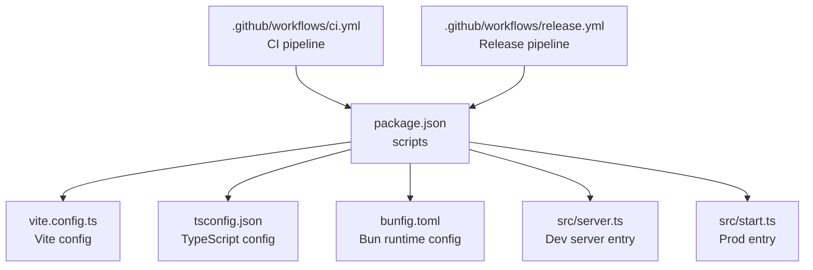
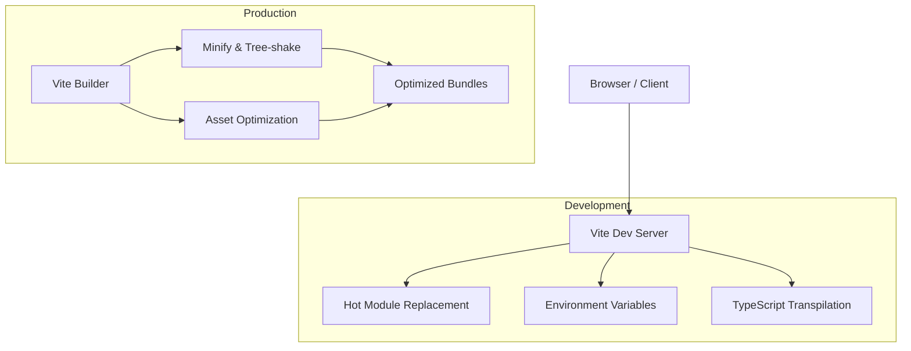
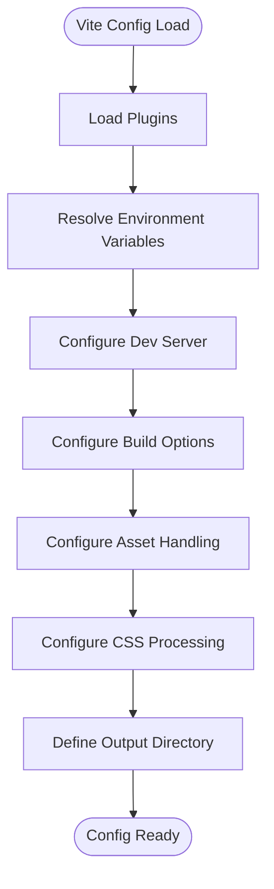
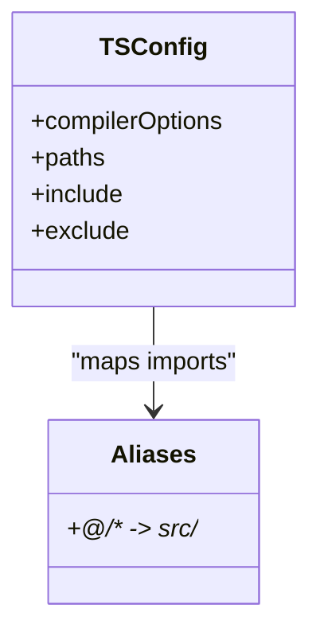
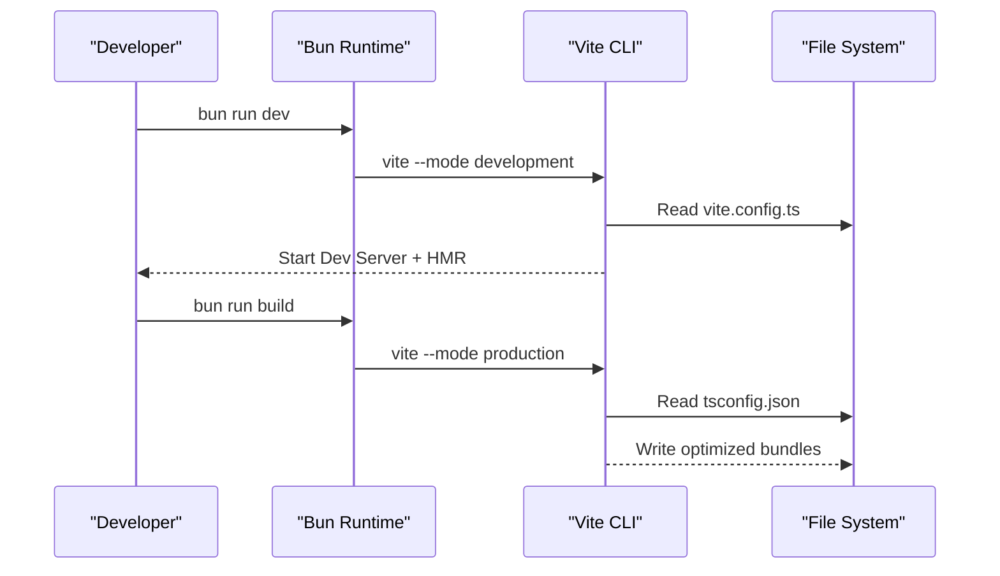
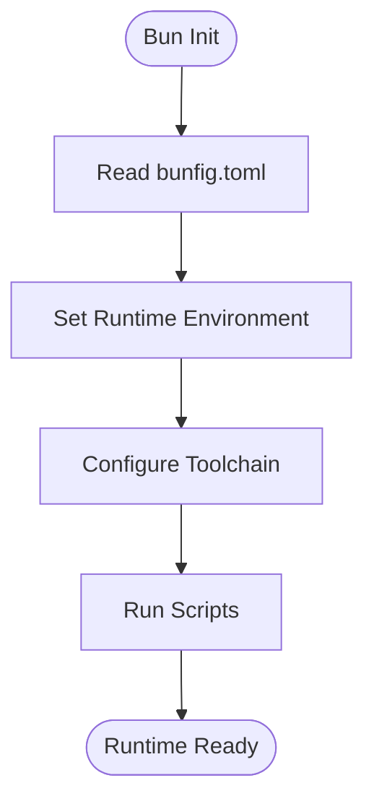
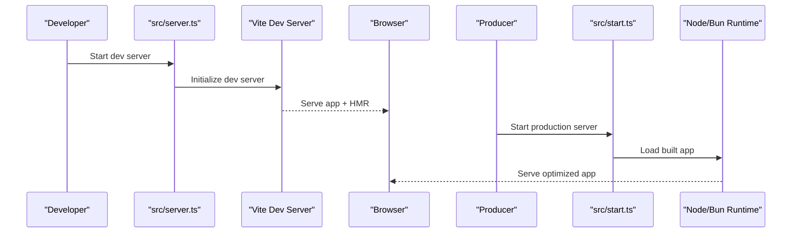
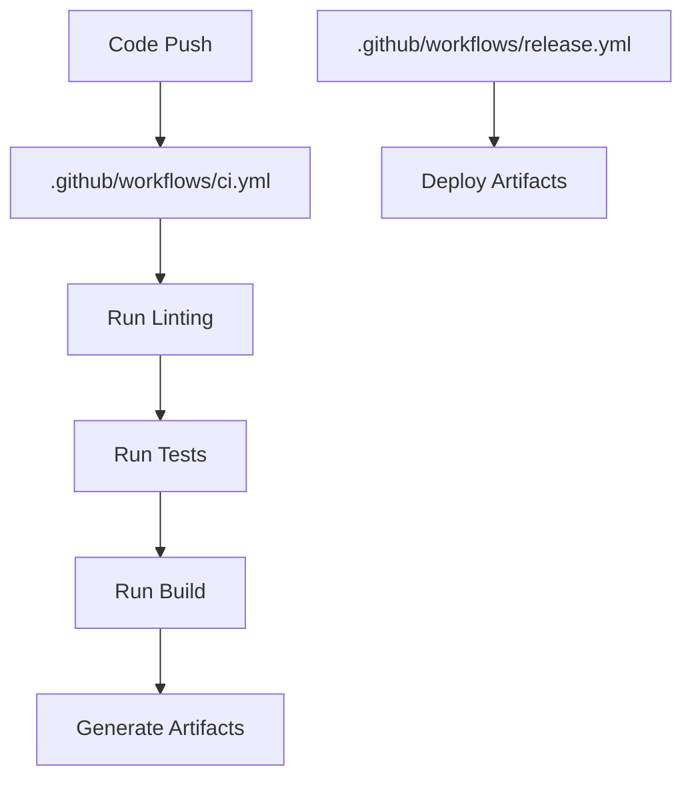
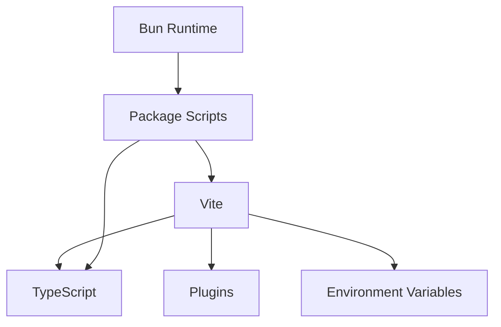

# Build Configuration

<cite>
**Referenced Files in This Document**
- [vite.config.ts](file://vite.config.ts)
- [tsconfig.json](file://tsconfig.json)
- [package.json](file://package.json)
- [bunfig.toml](file://bunfig.toml)
- [src/server.ts](file://src/server.ts)
- [src/start.ts](file://src/start.ts)
- [.github/workflows/ci.yml](file://.github/workflows/ci.yml)
- [.github/workflows/release.yml](file://.github/workflows/release.yml)
</cite>

## Table of Contents
1. [Introduction](#introduction)
2. [Project Structure](#project-structure)
3. [Core Components](#core-components)
4. [Architecture Overview](#architecture-overview)
5. [Detailed Component Analysis](#detailed-component-analysis)
6. [Dependency Analysis](#dependency-analysis)
7. [Performance Considerations](#performance-considerations)
8. [Troubleshooting Guide](#troubleshooting-guide)
9. [Conclusion](#conclusion)
10. [Appendices](#appendices)

## Introduction
This document explains the build configuration for the project using Vite, Bun runtime, and TypeScript compilation. It covers Vite options and plugins, environment variables, build optimizations, TypeScript configuration with path aliases and type checking, development versus production builds, bundle analysis, asset handling, CSS processing, static file management, development workflow with hot module replacement (HMR), and debugging configurations.

## Project Structure
The build system is centered around a root-level Vite configuration, a TypeScript configuration, and package scripts that orchestrate development and production workflows. The Bun runtime is used to run both the dev server and production entry points. CI/CD pipelines define how builds are executed in continuous integration and release flows.

**Diagram sources**
- [package.json](file://package.json)
- [vite.config.ts](file://vite.config.ts)
- [tsconfig.json](file://tsconfig.json)
- [bunfig.toml](file://bunfig.toml)
- [src/server.ts](file://src/server.ts)
- [src/start.ts](file://src/start.ts)
- [.github/workflows/ci.yml](file://.github/workflows/ci.yml)
- [.github/workflows/release.yml](file://.github/workflows/release.yml)

**Section sources**
- [package.json](file://package.json)
- [vite.config.ts](file://vite.config.ts)
- [tsconfig.json](file://tsconfig.json)
- [bunfig.toml](file://bunfig.toml)
- [src/server.ts](file://src/server.ts)
- [src/start.ts](file://src/start.ts)
- [.github/workflows/ci.yml](file://.github/workflows/ci.yml)
- [.github/workflows/release.yml](file://.github/workflows/release.yml)

## Core Components
- Vite configuration: Defines the build target, plugins, environment variable exposure, optimization settings, and output structure.
- TypeScript configuration: Sets up compilation targets, strictness, path aliases, and type-checking behavior.
- Package scripts: Provide commands for development, building, previewing, and testing via Bun.
- Bun runtime configuration: Controls runtime behavior and tooling integration.
- Server entries: Separate development server and production entry points.

Key responsibilities:
- Development: Fast startup, HMR, source maps, and environment injection.
- Production: Optimized bundles, tree-shaking, minification, and asset handling.
- Type safety: Strict TS checks and consistent path resolution across tools.

**Section sources**
- [vite.config.ts](file://vite.config.ts)
- [tsconfig.json](file://tsconfig.json)
- [package.json](file://package.json)
- [bunfig.toml](file://bunfig.toml)
- [src/server.ts](file://src/server.ts)
- [src/start.ts](file://src/start.ts)

## Architecture Overview
The build architecture integrates Vite as the bundler and dev server, Bun as the runtime, and TypeScript for type-safe code. Environment variables are injected at build time for feature flags and configuration. Static assets under public are served directly. CSS is processed through Vite’s default pipeline and can be extended with PostCSS or Tailwind if configured.

[No sources needed since this diagram shows conceptual workflow, not actual code structure]

## Detailed Component Analysis

### Vite Configuration
- Purpose: Configure the dev server, build pipeline, plugins, environment variables, and optimization strategies.
- Key areas:
  - Plugins: Extend functionality such as React, path resolution, and asset handling.
  - Environment variables: Define which variables are exposed to the client and how they are loaded.
  - Build options: Target browsers, chunk splitting, sourcemaps, and output directory.
  - Asset handling: Configure image, font, and media processing rules.
  - CSS processing: Enable preprocessors or frameworks like Tailwind if present.
  - Proxy and dev server: Configure API proxies and local development behaviors.

**Diagram sources**
- [vite.config.ts](file://vite.config.ts)

**Section sources**
- [vite.config.ts](file://vite.config.ts)

### TypeScript Configuration
- Purpose: Ensure type safety, consistent path aliases, and correct compilation targets.
- Key areas:
  - Compiler options: Strict mode, module resolution, and target environments.
  - Path aliases: Map import paths to directories for cleaner imports.
  - Type checking: Integration with Vite and CLI tools for fast feedback.
  - Exclusions: Ignore test files or generated code from compilation when appropriate.

**Diagram sources**
- [tsconfig.json](file://tsconfig.json)

**Section sources**
- [tsconfig.json](file://tsconfig.json)

### Package Scripts and Workflows
- Purpose: Orchestrate development, building, previewing, and testing using Bun.
- Typical scripts:
  - dev: Start Vite dev server with Bun.
  - build: Run Vite build for production.
  - preview: Serve the built output locally.
  - lint/test: Execute linters and tests.
- Integration:
  - CI uses these scripts to validate builds and run tests.
  - Release pipelines may trigger optimized builds and artifact generation.

**Diagram sources**
- [package.json](file://package.json)
- [vite.config.ts](file://vite.config.ts)
- [tsconfig.json](file://tsconfig.json)

**Section sources**
- [package.json](file://package.json)

### Bun Runtime Configuration
- Purpose: Configure runtime behavior, tooling integration, and environment specifics.
- Key areas:
  - Node compatibility settings.
  - Toolchain preferences (e.g., bundler, transpiler).
  - Environment variables and process overrides.

**Diagram sources**
- [bunfig.toml](file://bunfig.toml)

**Section sources**
- [bunfig.toml](file://bunfig.toml)

### Server Entries
- Development server entry: Initializes Vite dev server, sets up middleware, and serves assets.
- Production entry: Loads the built application and serves it efficiently.

**Diagram sources**
- [src/server.ts](file://src/server.ts)
- [src/start.ts](file://src/start.ts)

**Section sources**
- [src/server.ts](file://src/server.ts)
- [src/start.ts](file://src/start.ts)

### CI/CD Pipelines
- Purpose: Automate builds, tests, and releases.
- CI: Validates changes by running lint, type checks, and builds.
- Release: Produces optimized artifacts and deploys them.

**Diagram sources**
- [.github/workflows/ci.yml](file://.github/workflows/ci.yml)
- [.github/workflows/release.yml](file://.github/workflows/release.yml)

**Section sources**
- [.github/workflows/ci.yml](file://.github/workflows/ci.yml)
- [.github/workflows/release.yml](file://.github/workflows/release.yml)

## Dependency Analysis
Vite depends on TypeScript for transpilation and type checking. Bun provides the runtime for executing scripts and servers. The build pipeline reads configuration files to determine plugin usage, environment variables, and optimization strategies.

**Diagram sources**
- [vite.config.ts](file://vite.config.ts)
- [tsconfig.json](file://tsconfig.json)
- [package.json](file://package.json)
- [bunfig.toml](file://bunfig.toml)

**Section sources**
- [vite.config.ts](file://vite.config.ts)
- [tsconfig.json](file://tsconfig.json)
- [package.json](file://package.json)
- [bunfig.toml](file://bunfig.toml)

## Performance Considerations
- Development:
  - Use incremental builds and HMR for rapid feedback.
  - Keep plugins minimal to reduce startup time.
  - Prefer lazy loading for large modules.
- Production:
  - Enable minification and tree-shaking.
  - Split chunks strategically to improve caching.
  - Optimize images and fonts; use modern formats where possible.
  - Analyze bundle size to identify heavy dependencies.
- Asset handling:
  - Inline small assets to reduce requests.
  - Use CDN for large static assets.
- CSS processing:
  - Purge unused styles in production.
  - Avoid heavy preprocessors unless necessary.

[No sources needed since this section provides general guidance]

## Troubleshooting Guide
Common issues and resolutions:
- Environment variables not available:
  - Ensure variables are prefixed correctly and exposed in Vite config.
  - Verify .env files are loaded and match expected modes.
- Path alias errors:
  - Confirm tsconfig paths align with Vite resolve settings.
  - Restart dev server after changing aliases.
- HMR not working:
  - Check network settings and proxy configurations.
  - Ensure no conflicting middleware blocks updates.
- Build failures:
  - Review TypeScript errors and fix type mismatches.
  - Inspect plugin conflicts or deprecated options.
- Debugging:
  - Use source maps in development for accurate stack traces.
  - Add logging selectively to avoid noise.

**Section sources**
- [vite.config.ts](file://vite.config.ts)
- [tsconfig.json](file://tsconfig.json)
- [package.json](file://package.json)

## Conclusion
The build system combines Vite, Bun, and TypeScript to deliver a fast development experience and optimized production builds. Proper configuration of environment variables, plugins, and asset handling ensures reliability and performance. Following the guidelines here will help maintain a smooth workflow and high-quality outputs.

[No sources needed since this section summarizes without analyzing specific files]

## Appendices
- Recommended practices:
  - Keep dependencies updated and audit regularly.
  - Use consistent naming conventions for environment variables.
  - Document custom plugins and their purposes.
- Useful commands:
  - Development: Start dev server with HMR.
  - Build: Generate production bundles.
  - Preview: Serve built assets locally.
  - Lint/Test: Validate code quality and correctness.

[No sources needed since this section provides general guidance]