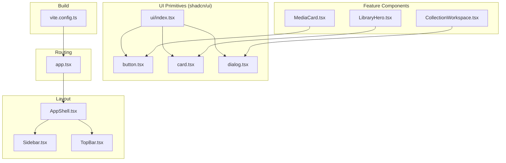
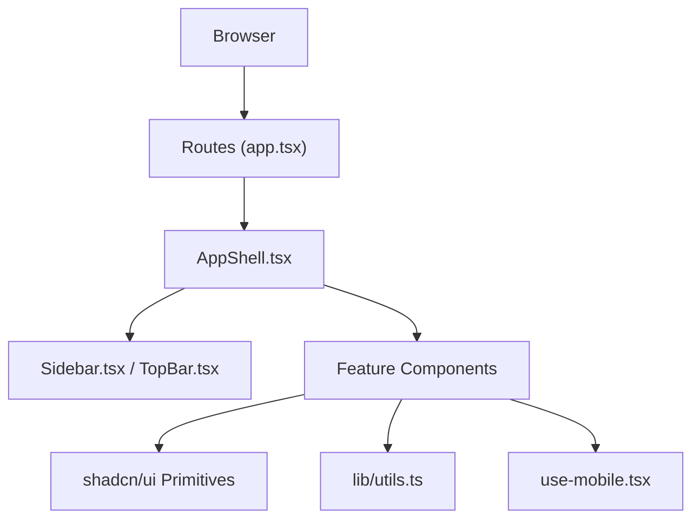
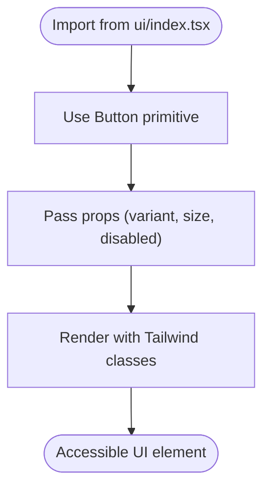
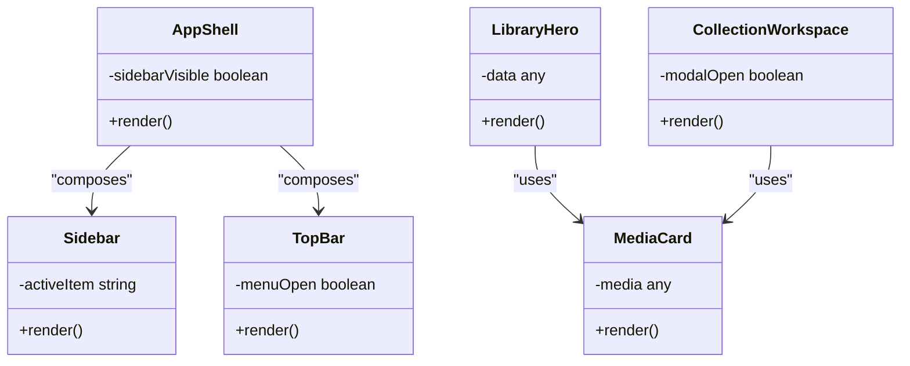
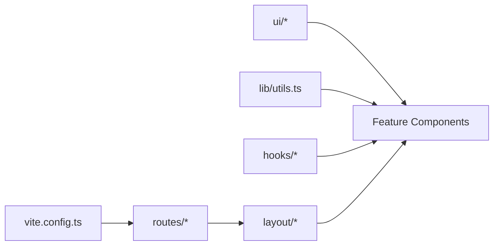
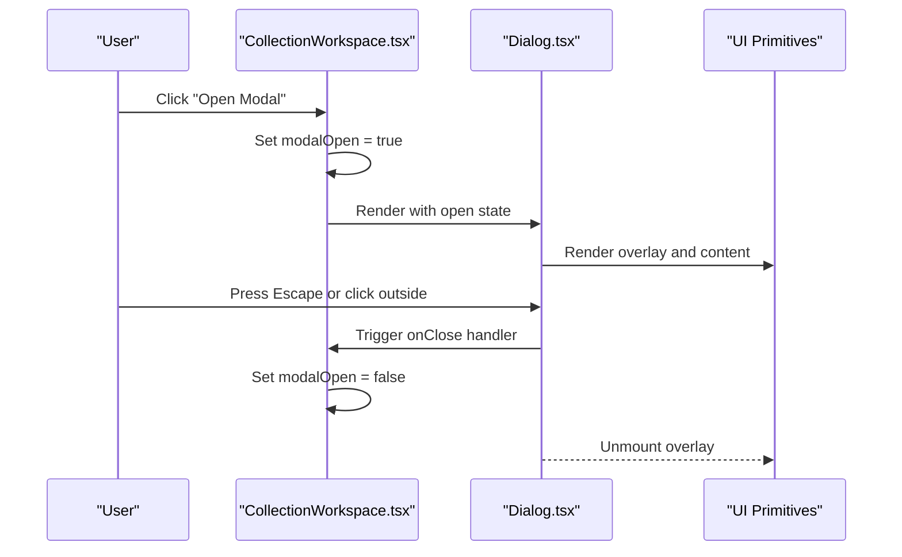
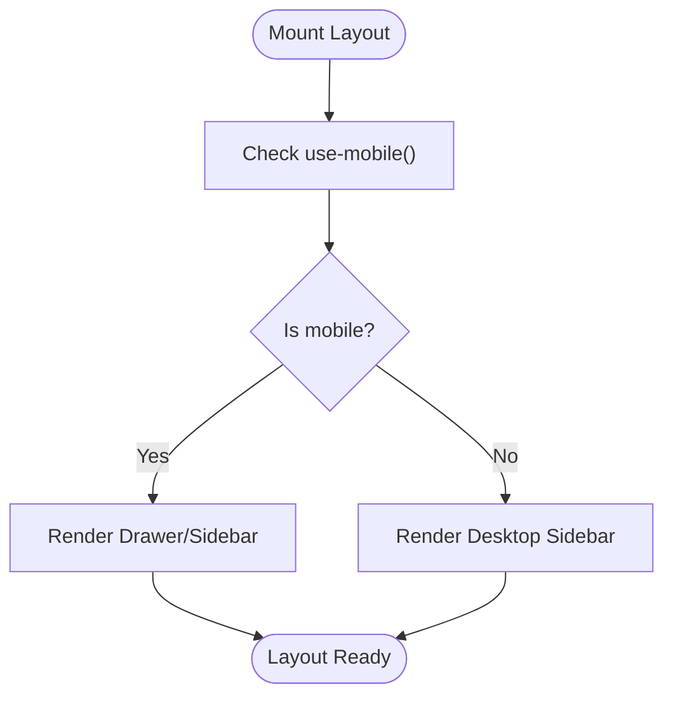

# Component Architecture

<cite>
**Referenced Files in This Document**
- [components.json](file://components.json)
- [src/components/ui/index.tsx](file://src/components/ui/index.tsx)
- [src/components/ui/button.tsx](file://src/components/ui/button.tsx)
- [src/components/ui/card.tsx](file://src/components/ui/card.tsx)
- [src/components/ui/dialog.tsx](file://src/components/ui/dialog.tsx)
- [src/components/layout/AppShell.tsx](file://src/components/layout/AppShell.tsx)
- [src/components/layout/Sidebar.tsx](file://src/components/layout/Sidebar.tsx)
- [src/components/layout/TopBar.tsx](file://src/components/layout/TopBar.tsx)
- [src/components/library/LibraryHero.tsx](file://src/components/library/LibraryHero.tsx)
- [src/components/media/MediaCard.tsx](file://src/components/media/MediaCard.tsx)
- [src/components/collections/CollectionWorkspace.tsx](file://src/components/collections/CollectionWorkspace.tsx)
- [src/hooks/use-mobile.tsx](file://src/hooks/use-mobile.tsx)
- [src/lib/utils.ts](file://src/lib/utils.ts)
- [src/routes/app.tsx](file://src/routes/app.tsx)
- [vite.config.ts](file://vite.config.ts)
</cite>

## Table of Contents
1. [Introduction](#introduction)
2. [Project Structure](#project-structure)
3. [Core Components](#core-components)
4. [Architecture Overview](#architecture-overview)
5. [Detailed Component Analysis](#detailed-component-analysis)
6. [Dependency Analysis](#dependency-analysis)
7. [Performance Considerations](#performance-considerations)
8. [Troubleshooting Guide](#troubleshooting-guide)
9. [Conclusion](#conclusion)
10. [Appendices](#appendices)

## Introduction
This document explains the React application’s component architecture with a focus on shadcn/ui integration, custom component development guidelines, and composition strategies. It clarifies the separation between UI primitives (shadcn/ui), business logic components, and layout components. It also covers component hierarchy, prop interfaces, event handling patterns, state management within components, accessibility, responsive design, and performance optimization techniques such as memoization and lazy loading.

## Project Structure
The frontend is organized by feature directories under src/components, with a dedicated ui folder for shadcn/ui primitives and a layout folder for shell and navigation components. Routes live under src/routes, hooks under src/hooks, and shared utilities under src/lib. The build configuration is managed via Vite.

**Diagram sources**
- [src/components/ui/button.tsx](file://src/components/ui/button.tsx)
- [src/components/ui/card.tsx](file://src/components/ui/card.tsx)
- [src/components/ui/dialog.tsx](file://src/components/ui/dialog.tsx)
- [src/components/ui/index.tsx](file://src/components/ui/index.tsx)
- [src/components/layout/AppShell.tsx](file://src/components/layout/AppShell.tsx)
- [src/components/layout/Sidebar.tsx](file://src/components/layout/Sidebar.tsx)
- [src/components/layout/TopBar.tsx](file://src/components/layout/TopBar.tsx)
- [src/components/library/LibraryHero.tsx](file://src/components/library/LibraryHero.tsx)
- [src/components/media/MediaCard.tsx](file://src/components/media/MediaCard.tsx)
- [src/components/collections/CollectionWorkspace.tsx](file://src/components/collections/CollectionWorkspace.tsx)
- [src/routes/app.tsx](file://src/routes/app.tsx)
- [vite.config.ts](file://vite.config.ts)

**Section sources**
- [components.json](file://components.json)
- [vite.config.ts](file://vite.config.ts)

## Core Components
- UI primitives (shadcn/ui): Reusable, accessible building blocks such as Button, Card, Dialog. These are typically thin wrappers around Radix primitives styled with Tailwind CSS. They expose stable prop interfaces and follow consistent naming conventions.
- Layout components: AppShell orchestrates global chrome (sidebar, top bar, content area). Sidebar and TopBar manage navigation and contextual actions.
- Business logic components: Feature components like LibraryHero, MediaCard, and CollectionWorkspace compose UI primitives to implement domain-specific behavior, often coordinating local state and events.

Guidelines:
- Keep UI primitives pure and focused on presentation and accessibility.
- Encapsulate business logic in feature components; avoid leaking domain concerns into UI primitives.
- Compose complex screens from small, testable components.
- Centralize shared styles and utilities under src/lib.

**Section sources**
- [src/components/ui/button.tsx](file://src/components/ui/button.tsx)
- [src/components/ui/card.tsx](file://src/components/ui/card.tsx)
- [src/components/ui/dialog.tsx](file://src/components/ui/dialog.tsx)
- [src/components/layout/AppShell.tsx](file://src/components/layout/AppShell.tsx)
- [src/components/layout/Sidebar.tsx](file://src/components/layout/Sidebar.tsx)
- [src/components/layout/TopBar.tsx](file://src/components/layout/TopBar.tsx)
- [src/components/library/LibraryHero.tsx](file://src/components/library/LibraryHero.tsx)
- [src/components/media/MediaCard.tsx](file://src/components/media/MediaCard.tsx)
- [src/components/collections/CollectionWorkspace.tsx](file://src/components/collections/CollectionWorkspace.tsx)

## Architecture Overview
The application follows a layered approach:
- UI layer: shadcn/ui primitives provide accessible, theme-consistent elements.
- Layout layer: shells and navigation orchestrate page chrome and routing context.
- Feature layer: business components compose UI primitives and manage local state and interactions.
- Routing layer: routes mount layouts and feature pages.
- Build layer: Vite configures module resolution and optimizations.

**Diagram sources**
- [src/routes/app.tsx](file://src/routes/app.tsx)
- [src/components/layout/AppShell.tsx](file://src/components/layout/AppShell.tsx)
- [src/components/layout/Sidebar.tsx](file://src/components/layout/Sidebar.tsx)
- [src/components/layout/TopBar.tsx](file://src/components/layout/TopBar.tsx)
- [src/components/ui/button.tsx](file://src/components/ui/button.tsx)
- [src/lib/utils.ts](file://src/lib/utils.ts)
- [src/hooks/use-mobile.tsx](file://src/hooks/use-mobile.tsx)

## Detailed Component Analysis

### shadcn/ui Integration Pattern
- Configuration: components.json defines shadcn/ui settings such as style, base color, and paths.
- Entry point: ui/index.tsx re-exports primitives for centralized imports.
- Primitives: button.tsx, card.tsx, dialog.tsx encapsulate Radix-based behaviors and Tailwind styling.

Best practices:
- Import from the ui index to ensure consistency.
- Extend primitives via composition rather than mutation.
- Maintain accessible attributes and keyboard navigation.

**Diagram sources**
- [components.json](file://components.json)
- [src/components/ui/index.tsx](file://src/components/ui/index.tsx)
- [src/components/ui/button.tsx](file://src/components/ui/button.tsx)
- [src/components/ui/card.tsx](file://src/components/ui/card.tsx)
- [src/components/ui/dialog.tsx](file://src/components/ui/dialog.tsx)

**Section sources**
- [components.json](file://components.json)
- [src/components/ui/index.tsx](file://src/components/ui/index.tsx)
- [src/components/ui/button.tsx](file://src/components/ui/button.tsx)
- [src/components/ui/card.tsx](file://src/components/ui/card.tsx)
- [src/components/ui/dialog.tsx](file://src/components/ui/dialog.tsx)

### Custom Component Development Guidelines
- Pure functions: Prefer functional components with explicit props and minimal side effects.
- Prop contracts: Define clear TypeScript interfaces; prefer union types for variants and sizes.
- Event handling: Use stable handlers; memoize callbacks when passed to children to prevent unnecessary re-renders.
- Composition over inheritance: Combine small components to build complex ones.
- Accessibility: Ensure semantic HTML, ARIA attributes where needed, and keyboard support.

Example pattern references:
- Button usage in MediaCard demonstrates variant and disabled states.
- Card usage in LibraryHero shows composition with media metadata.
- Dialog usage in CollectionWorkspace illustrates modal workflows.

**Section sources**
- [src/components/media/MediaCard.tsx](file://src/components/media/MediaCard.tsx)
- [src/components/library/LibraryHero.tsx](file://src/components/library/LibraryHero.tsx)
- [src/components/collections/CollectionWorkspace.tsx](file://src/components/collections/CollectionWorkspace.tsx)

### Component Composition Strategies
- Atomic composition: Build feature components from atomic UI primitives.
- Container/presentational split: Keep data fetching and state in container-like components; pass data down to presentational components.
- Contextual composition: Use providers or hooks for cross-cutting concerns (theme, mobile breakpoint).

**Diagram sources**
- [src/components/layout/AppShell.tsx](file://src/components/layout/AppShell.tsx)
- [src/components/layout/Sidebar.tsx](file://src/components/layout/Sidebar.tsx)
- [src/components/layout/TopBar.tsx](file://src/components/layout/TopBar.tsx)
- [src/components/library/LibraryHero.tsx](file://src/components/library/LibraryHero.tsx)
- [src/components/media/MediaCard.tsx](file://src/components/media/MediaCard.tsx)
- [src/components/collections/CollectionWorkspace.tsx](file://src/components/collections/CollectionWorkspace.tsx)

**Section sources**
- [src/components/layout/AppShell.tsx](file://src/components/layout/AppShell.tsx)
- [src/components/layout/Sidebar.tsx](file://src/components/layout/Sidebar.tsx)
- [src/components/layout/TopBar.tsx](file://src/components/layout/TopBar.tsx)
- [src/components/library/LibraryHero.tsx](file://src/components/library/LibraryHero.tsx)
- [src/components/media/MediaCard.tsx](file://src/components/media/MediaCard.tsx)
- [src/components/collections/CollectionWorkspace.tsx](file://src/components/collections/CollectionWorkspace.tsx)

### Prop Interfaces and Event Handling Patterns
- Props: Use explicit TypeScript interfaces; include required and optional fields; prefer discriminated unions for variant props.
- Events: Forward native events where appropriate; wrap callbacks with useCallback to stabilize references.
- State: Local state via useState; lift state up only when necessary; keep feature components cohesive.

References:
- Button props demonstrate variant and size discrimination.
- Dialog control props show open/close state management.
- MediaCard handles click and hover events for interactions.

**Section sources**
- [src/components/ui/button.tsx](file://src/components/ui/button.tsx)
- [src/components/ui/dialog.tsx](file://src/components/ui/dialog.tsx)
- [src/components/media/MediaCard.tsx](file://src/components/media/MediaCard.tsx)

### State Management Within Components
- Local state: Manage ephemeral UI state (e.g., modal visibility, form inputs) with useState.
- Derived state: Compute values based on props/state using useMemo where expensive.
- Side effects: Use useEffect for synchronization with external systems; clean up listeners and timers.

Patterns:
- Memoize derived lists and objects to avoid re-renders.
- Defer heavy computations off the render path.

**Section sources**
- [src/components/collections/CollectionWorkspace.tsx](file://src/components/collections/CollectionWorkspace.tsx)
- [src/components/media/MediaCard.tsx](file://src/components/media/MediaCard.tsx)

### Accessibility Implementation
- Semantic elements: Use proper HTML semantics (buttons, links, headings).
- ARIA attributes: Add aria-label, aria-expanded, aria-controls where needed.
- Keyboard navigation: Ensure focus management and visible focus indicators.
- Color contrast: Follow WCAG contrast guidelines; rely on theme tokens.

References:
- Dialog manages focus trap and escape key handling.
- Button supports keyboard activation and accessible labels.

**Section sources**
- [src/components/ui/dialog.tsx](file://src/components/ui/dialog.tsx)
- [src/components/ui/button.tsx](file://src/components/ui/button.tsx)

### Responsive Design Patterns
- Mobile-first: Design for small screens first; enhance for larger breakpoints.
- Breakpoints: Use utility classes or hooks (use-mobile) to adapt layouts.
- Adaptive components: Switch between drawer and sidebar based on viewport.

Reference:
- use-mobile hook provides a boolean flag for mobile detection.

**Section sources**
- [src/hooks/use-mobile.tsx](file://src/hooks/use-mobile.tsx)

### Performance Optimization Techniques
- Memoization: Wrap expensive computations with useMemo; memoize callbacks with useCallback.
- Lazy loading: Code-split routes and heavy components; load on demand.
- Virtualization: For large lists, consider virtual scrolling libraries.
- Image/media optimization: Use lazy loading and appropriate formats.

References:
- Vite config enables code splitting and asset optimization.
- Route-level lazy loading can be applied per route.

**Section sources**
- [vite.config.ts](file://vite.config.ts)
- [src/routes/app.tsx](file://src/routes/app.tsx)

## Dependency Analysis
The dependency graph emphasizes clear boundaries:
- UI primitives depend on Radix and Tailwind utilities.
- Layout components depend on UI primitives and routing context.
- Feature components depend on UI primitives, utilities, and hooks.
- Routes mount layouts and feature components.

**Diagram sources**
- [src/components/ui/button.tsx](file://src/components/ui/button.tsx)
- [src/components/ui/card.tsx](file://src/components/ui/card.tsx)
- [src/components/ui/dialog.tsx](file://src/components/ui/dialog.tsx)
- [src/components/layout/AppShell.tsx](file://src/components/layout/AppShell.tsx)
- [src/components/layout/Sidebar.tsx](file://src/components/layout/Sidebar.tsx)
- [src/components/layout/TopBar.tsx](file://src/components/layout/TopBar.tsx)
- [src/components/library/LibraryHero.tsx](file://src/components/library/LibraryHero.tsx)
- [src/components/media/MediaCard.tsx](file://src/components/media/MediaCard.tsx)
- [src/components/collections/CollectionWorkspace.tsx](file://src/components/collections/CollectionWorkspace.tsx)
- [src/lib/utils.ts](file://src/lib/utils.ts)
- [src/hooks/use-mobile.tsx](file://src/hooks/use-mobile.tsx)
- [src/routes/app.tsx](file://src/routes/app.tsx)
- [vite.config.ts](file://vite.config.ts)

**Section sources**
- [src/components/ui/index.tsx](file://src/components/ui/index.tsx)
- [src/lib/utils.ts](file://src/lib/utils.ts)
- [src/hooks/use-mobile.tsx](file://src/hooks/use-mobile.tsx)
- [src/routes/app.tsx](file://src/routes/app.tsx)
- [vite.config.ts](file://vite.config.ts)

## Performance Considerations
- Minimize re-renders: Use React.memo for pure components; avoid passing new object/array props without memoization.
- Code splitting: Split routes and heavy components; preload critical assets.
- Debounce/throttle: For search inputs and scroll handlers.
- Memory leaks: Clean up subscriptions and timers in useEffect.
- Bundle size: Tree-shake unused dependencies; prefer lightweight libraries.

[No sources needed since this section provides general guidance]

## Troubleshooting Guide
Common issues and resolutions:
- Missing shadcn/ui exports: Ensure imports come from ui/index.tsx and that components.json paths are correct.
- Accessibility regressions: Validate keyboard navigation and ARIA attributes; run automated checks.
- Performance bottlenecks: Profile with browser dev tools; identify heavy renders and optimize with memoization.
- Responsive breaks: Verify breakpoint usage and mobile-first styles; test on multiple devices.

Checklist:
- Confirm component props match expected interfaces.
- Ensure dialogs close on escape and trap focus correctly.
- Validate color contrast and focus indicators.
- Test lazy-loaded components for loading states and errors.

**Section sources**
- [src/components/ui/dialog.tsx](file://src/components/ui/dialog.tsx)
- [src/components/ui/button.tsx](file://src/components/ui/button.tsx)
- [src/components/ui/index.tsx](file://src/components/ui/index.tsx)

## Conclusion
The application’s component architecture separates concerns cleanly: shadcn/ui primitives handle accessible UI, layout components orchestrate chrome, and feature components encapsulate business logic. By following composition patterns, maintaining strict prop interfaces, and applying performance optimizations, the codebase remains scalable and maintainable. Consistent accessibility and responsive design ensure a robust user experience across devices.

[No sources needed since this section summarizes without analyzing specific files]

## Appendices

### Example: Sequence of a Dialog Workflow

**Diagram sources**
- [src/components/collections/CollectionWorkspace.tsx](file://src/components/collections/CollectionWorkspace.tsx)
- [src/components/ui/dialog.tsx](file://src/components/ui/dialog.tsx)

### Example: Flowchart for Responsive Sidebar Behavior

**Diagram sources**
- [src/components/layout/AppShell.tsx](file://src/components/layout/AppShell.tsx)
- [src/components/layout/Sidebar.tsx](file://src/components/layout/Sidebar.tsx)
- [src/hooks/use-mobile.tsx](file://src/hooks/use-mobile.tsx)