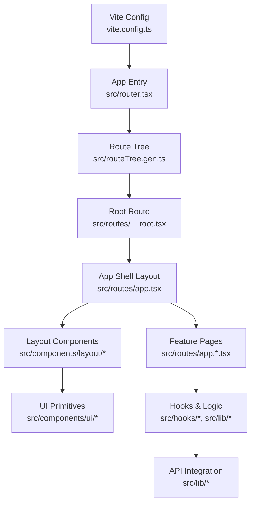
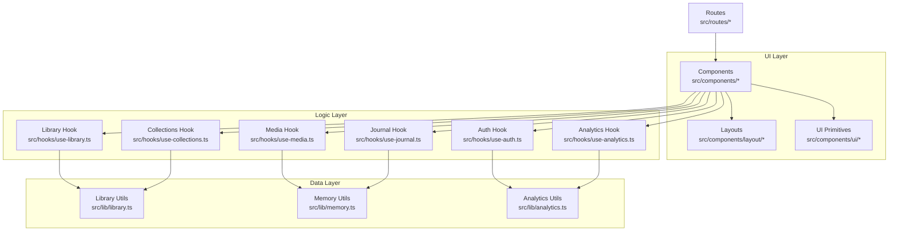
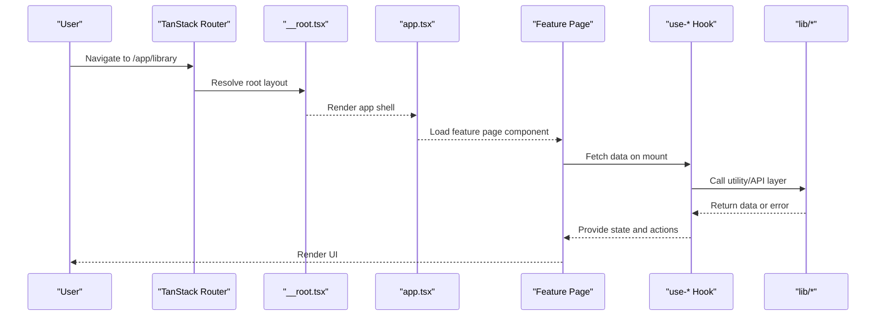
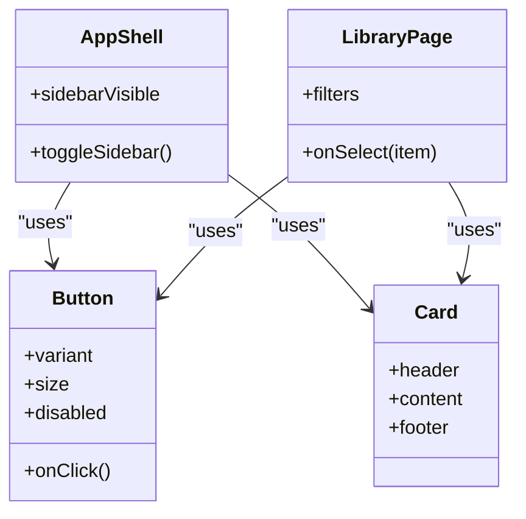
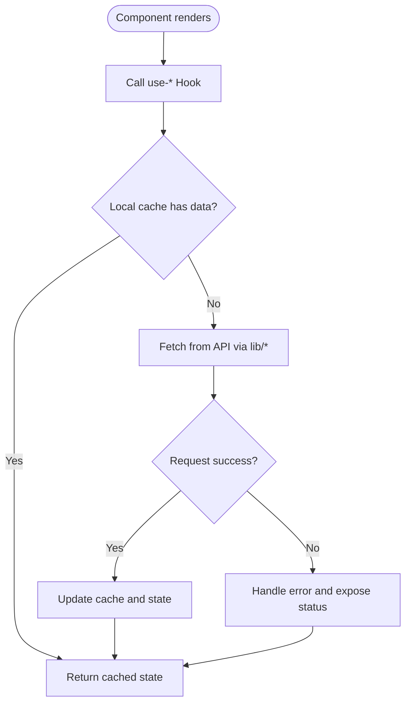
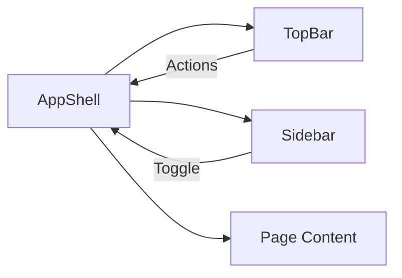
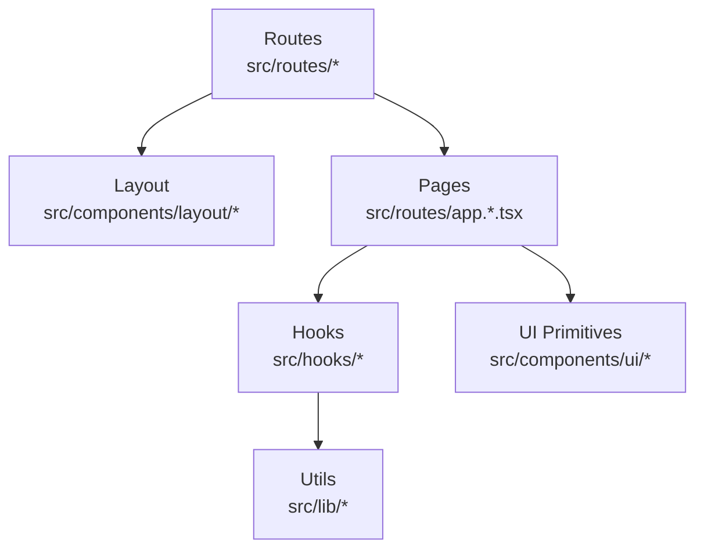

# Frontend Architecture

<cite>
**Referenced Files in This Document**
- [vite.config.ts](file://vite.config.ts)
- [package.json](file://package.json)
- [components.json](file://components.json)
- [src/router.tsx](file://src/router.tsx)
- [src/routeTree.gen.ts](file://src/routeTree.gen.ts)
- [src/routes/__root.tsx](file://src/routes/__root.tsx)
- [src/routes/app.tsx](file://src/routes/app.tsx)
- [src/routes/index.tsx](file://src/routes/index.tsx)
- [src/routes/new-landing.tsx](file://src/routes/new-landing.tsx)
- [src/components/layout/AppShell.tsx](file://src/components/layout/AppShell.tsx)
- [src/components/layout/Sidebar.tsx](file://src/components/layout/Sidebar.tsx)
- [src/components/layout/TopBar.tsx](file://src/components/layout/TopBar.tsx)
- [src/components/ui/button.tsx](file://src/components/ui/button.tsx)
- [src/components/ui/card.tsx](file://src/components/ui/card.tsx)
- [src/hooks/use-auth.ts](file://src/hooks/use-auth.ts)
- [src/hooks/use-library.ts](file://src/hooks/use-library.ts)
- [src/hooks/use-media.ts](file://src/hooks/use-media.ts)
- [src/hooks/use-collections.ts](file://src/hooks/use-collections.ts)
- [src/hooks/use-journal.ts](file://src/hooks/use-journal.ts)
- [src/hooks/use-analytics.ts](file://src/hooks/use-analytics.ts)
- [src/lib/analytics.ts](file://src/lib/analytics.ts)
- [src/lib/library.ts](file://src/lib/library.ts)
- [src/lib/memory.ts](file://src/lib/memory.ts)
- [src/styles.css](file://src/styles.css)
</cite>

## Table of Contents
1. [Introduction](#introduction)
2. [Project Structure](#project-structure)
3. [Core Components](#core-components)
4. [Architecture Overview](#architecture-overview)
5. [Detailed Component Analysis](#detailed-component-analysis)
6. [Dependency Analysis](#dependency-analysis)
7. [Performance Considerations](#performance-considerations)
8. [Troubleshooting Guide](#troubleshooting-guide)
9. [Conclusion](#conclusion)
10. [Appendices](#appendices)

## Introduction
This document describes the frontend architecture of a React-based application that uses:
- shadcn/ui for accessible, composable UI primitives
- Custom hooks for state and side effects (business logic separation)
- TanStack Router for file-based routing and code splitting
- Vite for fast builds, dev server, and optimized production output

The goal is to explain how UI components, business logic hooks, and API integration layers are separated, how navigation works, and how build-time optimizations like code splitting and lazy loading are applied. It also covers responsive design patterns, accessibility considerations, and performance techniques used across the app.

## Project Structure
The frontend follows a feature-oriented structure with clear boundaries:
- Routes under src/routes define pages and nested layouts using TanStack Router’s file-based conventions.
- Reusable UI components live under src/components/ui (shadcn/ui primitives) and feature-specific folders (layout, media, library, etc.).
- Business logic and data fetching are encapsulated in src/hooks and src/lib modules.
- Build configuration is centralized in vite.config.ts and package.json; shadcn/ui is configured via components.json.

**Diagram sources**
- [vite.config.ts](file://vite.config.ts)
- [src/router.tsx](file://src/router.tsx)
- [src/routeTree.gen.ts](file://src/routeTree.gen.ts)
- [src/routes/__root.tsx](file://src/routes/__root.tsx)
- [src/routes/app.tsx](file://src/routes/app.tsx)
- [src/components/layout/AppShell.tsx](file://src/components/layout/AppShell.tsx)
- [src/components/ui/button.tsx](file://src/components/ui/button.tsx)

**Section sources**
- [vite.config.ts](file://vite.config.ts)
- [package.json](file://package.json)
- [components.json](file://components.json)
- [src/router.tsx](file://src/router.tsx)
- [src/routeTree.gen.ts](file://src/routeTree.gen.ts)
- [src/routes/__root.tsx](file://src/routes/__root.tsx)
- [src/routes/app.tsx](file://src/routes/app.tsx)

## Core Components
- UI primitives from shadcn/ui provide consistent, accessible building blocks (buttons, cards, dialogs, forms). These are thin wrappers around Radix primitives styled with Tailwind CSS utilities.
- Layout components (AppShell, Sidebar, TopBar) compose page chrome and manage global layout state such as sidebar visibility and top bar actions.
- Feature pages (under src/routes/app.*) implement domain screens by composing UI primitives and orchestrating data through hooks.

Key responsibilities:
- UI primitives: render accessible elements with consistent styling and props.
- Layout: orchestrate shell-level interactions (navigation, responsive behavior).
- Feature pages: present data, handle user input, and delegate side effects to hooks.

**Section sources**
- [src/components/ui/button.tsx](file://src/components/ui/button.tsx)
- [src/components/ui/card.tsx](file://src/components/ui/card.tsx)
- [src/components/layout/AppShell.tsx](file://src/components/layout/AppShell.tsx)
- [src/components/layout/Sidebar.tsx](file://src/components/layout/Sidebar.tsx)
- [src/components/layout/TopBar.tsx](file://src/components/layout/TopBar.tsx)

## Architecture Overview
The application separates concerns into three layers:
- UI Layer: React components (shadcn/ui + custom features)
- Logic Layer: Custom hooks and lib modules encapsulating state, caching, and side effects
- Data Layer: API integrations and local utilities

TanStack Router provides declarative routes and automatic code splitting per route. Vite optimizes bundling and enables dynamic imports for lazy loading.

**Diagram sources**
- [src/routes/app.tsx](file://src/routes/app.tsx)
- [src/components/layout/AppShell.tsx](file://src/components/layout/AppShell.tsx)
- [src/components/ui/button.tsx](file://src/components/ui/button.tsx)
- [src/hooks/use-auth.ts](file://src/hooks/use-auth.ts)
- [src/hooks/use-library.ts](file://src/hooks/use-library.ts)
- [src/hooks/use-media.ts](file://src/hooks/use-media.ts)
- [src/hooks/use-collections.ts](file://src/hooks/use-collections.ts)
- [src/hooks/use-journal.ts](file://src/hooks/use-journal.ts)
- [src/hooks/use-analytics.ts](file://src/hooks/use-analytics.ts)
- [src/lib/library.ts](file://src/lib/library.ts)
- [src/lib/memory.ts](file://src/lib/memory.ts)
- [src/lib/analytics.ts](file://src/lib/analytics.ts)

## Detailed Component Analysis

### Routing and Navigation (TanStack Router)
- File-based routes under src/routes map directly to URL paths. The generated route tree (routeTree.gen.ts) drives type-safe navigation and code-splitting.
- Root route (__root.tsx) sets up global providers and error boundaries.
- App route (app.tsx) composes the main shell layout and nested child routes.
- Public routes (index.tsx, new-landing.tsx) serve marketing/onboarding pages outside the authenticated shell.

**Diagram sources**
- [src/routes/__root.tsx](file://src/routes/__root.tsx)
- [src/routes/app.tsx](file://src/routes/app.tsx)
- [src/routeTree.gen.ts](file://src/routeTree.gen.ts)
- [src/hooks/use-library.ts](file://src/hooks/use-library.ts)
- [src/lib/library.ts](file://src/lib/library.ts)

**Section sources**
- [src/router.tsx](file://src/router.tsx)
- [src/routeTree.gen.ts](file://src/routeTree.gen.ts)
- [src/routes/__root.tsx](file://src/routes/__root.tsx)
- [src/routes/app.tsx](file://src/routes/app.tsx)
- [src/routes/index.tsx](file://src/routes/index.tsx)
- [src/routes/new-landing.tsx](file://src/routes/new-landing.tsx)

### UI Component Composition (shadcn/ui)
- shadcn/ui components are colocated under src/components/ui and composed throughout feature components.
- They follow a consistent prop interface and leverage Tailwind classes for theming and responsiveness.
- Accessibility is ensured via underlying Radix primitives and semantic HTML.

**Diagram sources**
- [src/components/ui/button.tsx](file://src/components/ui/button.tsx)
- [src/components/ui/card.tsx](file://src/components/ui/card.tsx)
- [src/components/layout/AppShell.tsx](file://src/components/layout/AppShell.tsx)

**Section sources**
- [src/components/ui/button.tsx](file://src/components/ui/button.tsx)
- [src/components/ui/card.tsx](file://src/components/ui/card.tsx)
- [components.json](file://components.json)

### State Management with Custom Hooks
- Each domain has a dedicated hook (e.g., use-auth, use-library, use-media, use-collections, use-journal, use-analytics).
- Hooks encapsulate:
  - Local state and derived values
  - Side effects (data fetching, caching, retries)
  - Actions (mutations, optimistic updates)
- Utility modules in src/lib provide shared logic and API abstractions.

**Diagram sources**
- [src/hooks/use-library.ts](file://src/hooks/use-library.ts)
- [src/hooks/use-media.ts](file://src/hooks/use-media.ts)
- [src/hooks/use-collections.ts](file://src/hooks/use-collections.ts)
- [src/hooks/use-journal.ts](file://src/hooks/use-journal.ts)
- [src/hooks/use-analytics.ts](file://src/hooks/use-analytics.ts)
- [src/lib/library.ts](file://src/lib/library.ts)
- [src/lib/memory.ts](file://src/lib/memory.ts)
- [src/lib/analytics.ts](file://src/lib/analytics.ts)

**Section sources**
- [src/hooks/use-auth.ts](file://src/hooks/use-auth.ts)
- [src/hooks/use-library.ts](file://src/hooks/use-library.ts)
- [src/hooks/use-media.ts](file://src/hooks/use-media.ts)
- [src/hooks/use-collections.ts](file://src/hooks/use-collections.ts)
- [src/hooks/use-journal.ts](file://src/hooks/use-journal.ts)
- [src/hooks/use-analytics.ts](file://src/hooks/use-analytics.ts)
- [src/lib/library.ts](file://src/lib/library.ts)
- [src/lib/memory.ts](file://src/lib/memory.ts)
- [src/lib/analytics.ts](file://src/lib/analytics.ts)

### Layout and Responsive Design
- AppShell coordinates global layout regions (top bar, sidebar, content area).
- Sidebar and TopBar adapt to screen sizes using responsive utilities and conditional rendering.
- Mobile-first patterns ensure usability across devices.

**Diagram sources**
- [src/components/layout/AppShell.tsx](file://src/components/layout/AppShell.tsx)
- [src/components/layout/Sidebar.tsx](file://src/components/layout/Sidebar.tsx)
- [src/components/layout/TopBar.tsx](file://src/components/layout/TopBar.tsx)

**Section sources**
- [src/components/layout/AppShell.tsx](file://src/components/layout/AppShell.tsx)
- [src/components/layout/Sidebar.tsx](file://src/components/layout/Sidebar.tsx)
- [src/components/layout/TopBar.tsx](file://src/components/layout/TopBar.tsx)

## Dependency Analysis
- Routes depend on layout components and feature pages.
- Feature pages depend on hooks for state and side effects.
- Hooks depend on lib modules for shared logic and API calls.
- UI primitives are independent and reused across components.

**Diagram sources**
- [src/routes/app.tsx](file://src/routes/app.tsx)
- [src/components/layout/AppShell.tsx](file://src/components/layout/AppShell.tsx)
- [src/components/ui/button.tsx](file://src/components/ui/button.tsx)
- [src/hooks/use-library.ts](file://src/hooks/use-library.ts)
- [src/lib/library.ts](file://src/lib/library.ts)

**Section sources**
- [src/routes/app.tsx](file://src/routes/app.tsx)
- [src/hooks/use-library.ts](file://src/hooks/use-library.ts)
- [src/lib/library.ts](file://src/lib/library.ts)

## Performance Considerations
- Code Splitting: TanStack Router automatically splits routes; each page loads only its necessary code.
- Lazy Loading: Dynamic imports can be used for heavy components or third-party libraries.
- Bundle Optimization: Vite’s build pipeline minifies, tree-shakes, and pre-bundles dependencies.
- Caching: Hooks should implement local caching strategies to reduce network requests.
- Rendering: Memoization (React.memo, useMemo, useCallback) where appropriate to avoid unnecessary re-renders.
- Images/Media: Use responsive images, lazy loading, and efficient formats.
- Styles: Tailwind purges unused styles; keep theme tokens centralized.

[No sources needed since this section provides general guidance]

## Troubleshooting Guide
Common issues and resolutions:
- Route not found: Verify route files exist under src/routes and match expected paths; check routeTree.gen.ts generation.
- Missing layout: Ensure __root.tsx and app.tsx correctly wrap nested routes.
- Hook errors: Inspect network requests and error states exposed by hooks; add logging in lib modules.
- UI inconsistencies: Confirm shadcn/ui theme variables and Tailwind config; validate components.json settings.
- Performance regressions: Profile with browser dev tools; identify heavy components and apply memoization or lazy loading.

**Section sources**
- [src/routes/__root.tsx](file://src/routes/__root.tsx)
- [src/routes/app.tsx](file://src/routes/app.tsx)
- [src/hooks/use-library.ts](file://src/hooks/use-library.ts)
- [src/lib/library.ts](file://src/lib/library.ts)
- [components.json](file://components.json)

## Conclusion
The frontend architecture cleanly separates UI, logic, and data layers:
- UI components built with shadcn/ui ensure consistency and accessibility.
- Custom hooks encapsulate state and side effects, improving testability and reuse.
- TanStack Router provides robust navigation and code splitting.
- Vite optimizes builds and development experience.

Adhering to these patterns yields a maintainable, performant, and accessible application.

[No sources needed since this section summarizes without analyzing specific files]

## Appendices

### Build Configuration Highlights
- Vite config centralizes plugins, aliases, and optimization flags.
- Package.json defines scripts for dev, build, and preview.
- shadcn/ui configuration via components.json controls component generation and theming.

**Section sources**
- [vite.config.ts](file://vite.config.ts)
- [package.json](file://package.json)
- [components.json](file://components.json)

### Global Styles and Theming
- Centralized styles in src/styles.css support theme tokens and global resets.
- Tailwind utilities enable responsive and accessible designs.

**Section sources**
- [src/styles.css](file://src/styles.css)