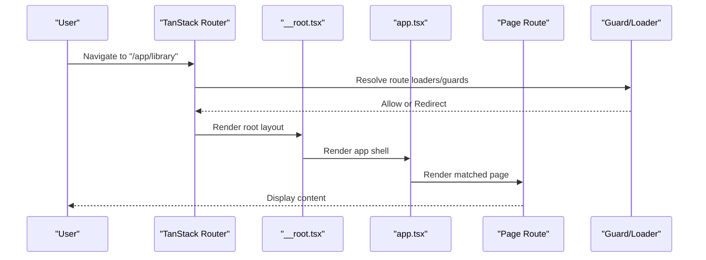
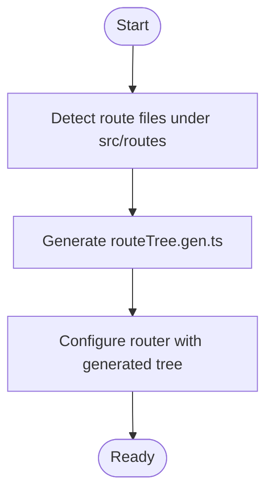
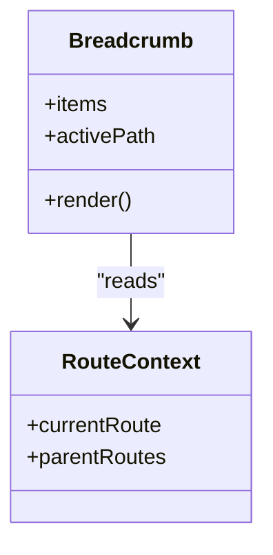
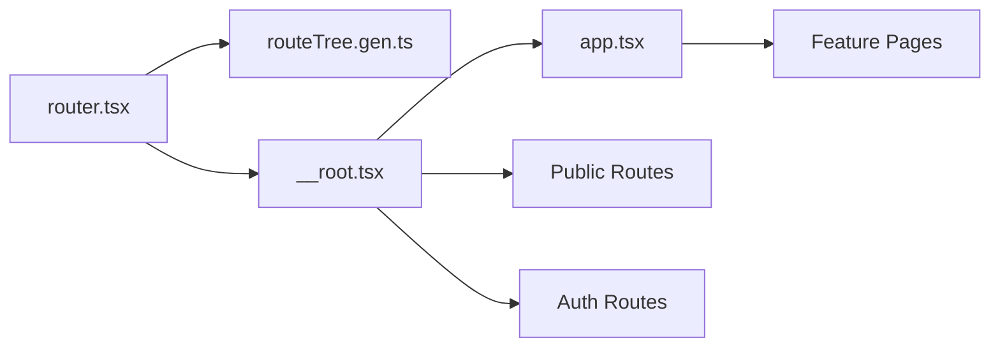

# Routing & Navigation

<cite>
**Referenced Files in This Document**
- [router.tsx](file://src/router.tsx)
- [routeTree.gen.ts](file://src/routeTree.gen.ts)
- [__root.tsx](file://src/routes/__root.tsx)
- [app.tsx](file://src/routes/app.tsx)
- [index.tsx](file://src/routes/index.tsx)
- [auth.tsx](file://src/routes/auth.tsx)
- [auth.callback.tsx](file://src/routes/auth.callback.tsx)
- [auth.forgot-password.tsx](file://src/routes/auth.forgot-password.tsx)
- [new-landing.tsx](file://src/routes/new-landing.tsx)
- [pricing.tsx](file://src/routes/pricing.tsx)
- [privacy.tsx](file://src/routes/privacy.tsx)
- [terms.tsx](file://src/routes/terms.tsx)
- [visual.tsx](file://src/routes/visual.tsx)
- [app.index.tsx](file://src/routes/app.index.tsx)
- [app.library.tsx](file://src/routes/app.library.tsx)
- [app.library.index.tsx](file://src/routes/app.library.index.tsx)
- [app.media.$id.tsx](file://src/routes/app.media.$id.tsx)
- [app.collections.$id.tsx](file://src/routes/app.collections.$id.tsx)
- [app.characters.$id.tsx](file://src/routes/app.characters.$id.tsx)
- [app.creators.$id.tsx](file://src/routes/app.creators.$id.tsx)
- [app.franchises.$id.tsx](file://src/routes/app.franchises.$id.tsx)
- [app.tags.$tag.tsx](file://src/routes/app.tags.$tag.tsx)
- [app.settings.tsx](file://src/routes/app.settings.tsx)
- [app.settings.email-capture.tsx](file://src/routes/app.settings.email-capture.tsx)
- [app.analytics.tsx](file://src/routes/app.analytics.tsx)
- [app.bookmarks.tsx](file://src/routes/app.bookmarks.tsx)
- [app.calendar.tsx](file://src/routes/app.calendar.tsx)
- [app.dev.tsx](file://src/routes/app.dev.tsx)
- [app.import.tsx](file://src/routes/app.import.tsx)
- [app.journal.tsx](file://src/routes/app.journal.tsx)
- [app.museum.tsx](file://src/routes/app.museum.tsx)
- [app.notifications.tsx](file://src/routes/app.notifications.tsx)
- [app.onboarding.tsx](file://src/routes/app.onboarding.tsx)
- [app.profile.tsx](file://src/routes/app.profile.tsx)
- [app.quotes.tsx](file://src/routes/app.quotes.tsx)
- [app.save-for-later.tsx](file://src/routes/app.save-for-later.tsx)
- [app.search.tsx](file://src/routes/app.search.tsx)
- [app.timeline.tsx](file://src/routes/app.timeline.tsx)
- [app.wrapped.tsx](file://src/routes/app.wrapped.tsx)
- [Breadcrumb.tsx](file://src/components/ui/breadcrumb.tsx)
- [nav.ts](file://src/lib/nav.ts)
</cite>

## Table of Contents
1. [Introduction](#introduction)
2. [Project Structure](#project-structure)
3. [Core Components](#core-components)
4. [Architecture Overview](#architecture-overview)
5. [Detailed Component Analysis](#detailed-component-analysis)
6. [Dependency Analysis](#dependency-analysis)
7. [Performance Considerations](#performance-considerations)
8. [Troubleshooting Guide](#troubleshooting-guide)
9. [Conclusion](#conclusion)
10. [Appendices](#appendices)

## Introduction
This document explains how routing and navigation are implemented using TanStack Router in the application. It covers the route tree structure, nested routes, dynamic segments, programmatic navigation, route guards and protected routes, authentication-based access control, transitions, query/search parameters, code splitting by route, navigation patterns, breadcrumbs, deep linking, and how to add new routes following established conventions.

## Project Structure
The routing implementation is file-based under src/routes with a generated route tree and a central router configuration:
- Route files define pages and nested layouts (e.g., app layout, auth layout).
- A generated route tree is produced for type safety and performance.
- The router entry configures providers, history, and global settings.

```mermaid
graph TB
subgraph "Router"
R["router.tsx"]
RT["routeTree.gen.ts"]
end
subgraph "Root Layout"
ROOT["routes/__root.tsx"]
end
subgraph "App Shell"
APP["routes/app.tsx"]
end
subgraph "Public Routes"
IDX["routes/index.tsx"]
LANDING["routes/new-landing.tsx"]
PRICING["routes/pricing.tsx"]
PRIVACY["routes/privacy.tsx"]
TERMS["routes/terms.tsx"]
VISUAL["routes/visual.tsx"]
end
subgraph "Auth Flow"
AUTH["routes/auth.tsx"]
CB["routes/auth.callback.tsx"]
FP["routes/auth.forgot-password.tsx"]
end
subgraph "App Pages"
AIDX["routes/app.index.tsx"]
LIB["routes/app.library.tsx"]
LIBIDX["routes/app.library.index.tsx"]
MEDIAID["routes/app.media.$id.tsx"]
COLID["routes/app.collections.$id.tsx"]
CHARID["routes/app.characters.$id.tsx"]
CREATORID["routes/app.creators.$id.tsx"]
FRANCHISEID["routes/app.franchises.$id.tsx"]
TAGID["routes/app.tags.$tag.tsx"]
SETTING["routes/app.settings.tsx"]
EMAILCAPTURE["routes/app.settings.email-capture.tsx"]
ANALYTICS["routes/app.analytics.tsx"]
BOOKMARKS["routes/app.bookmarks.tsx"]
CALENDAR["routes/app.calendar.tsx"]
DEV["routes/app.dev.tsx"]
IMPORT["routes/app.import.tsx"]
JOURNAL["routes/app.journal.tsx"]
MUSEUM["routes/app.museum.tsx"]
NOTIFICATIONS["routes/app.notifications.tsx"]
ONBOARDING["routes/app.onboarding.tsx"]
PROFILE["routes/app.profile.tsx"]
QUOTES["routes/app.quotes.tsx"]
SAVEFORLATER["routes/app.save-for-later.tsx"]
SEARCH["routes/app.search.tsx"]
TIMELINE["routes/app.timeline.tsx"]
WRAPPED["routes/app.wrapped.tsx"]
end
R --> RT
R --> ROOT
ROOT --> APP
ROOT --> IDX
ROOT --> LANDING
ROOT --> PRICING
ROOT --> PRIVACY
ROOT --> TERMS
ROOT --> VISUAL
ROOT --> AUTH
AUTH --> CB
AUTH --> FP
APP --> AIDX
APP --> LIB
LIB --> LIBIDX
APP --> MEDIAID
APP --> COLID
APP --> CHARID
APP --> CREATORID
APP --> FRANCHISEID
APP --> TAGID
APP --> SETTING
SETTING --> EMAILCAPTURE
APP --> ANALYTICS
APP --> BOOKMARKS
APP --> CALENDAR
APP --> DEV
APP --> IMPORT
APP --> JOURNAL
APP --> MUSEUM
APP --> NOTIFICATIONS
APP --> ONBOARDING
APP --> PROFILE
APP --> QUOTES
APP --> SAVEFORLATER
APP --> SEARCH
APP --> TIMELINE
APP --> WRAPPED
```

**Diagram sources**
- [router.tsx](file://src/router.tsx)
- [routeTree.gen.ts](file://src/routeTree.gen.ts)
- [__root.tsx](file://src/routes/__root.tsx)
- [app.tsx](file://src/routes/app.tsx)
- [index.tsx](file://src/routes/index.tsx)
- [auth.tsx](file://src/routes/auth.tsx)
- [auth.callback.tsx](file://src/routes/auth.callback.tsx)
- [auth.forgot-password.tsx](file://src/routes/auth.forgot-password.tsx)
- [new-landing.tsx](file://src/routes/new-landing.tsx)
- [pricing.tsx](file://src/routes/pricing.tsx)
- [privacy.tsx](file://src/routes/privacy.tsx)
- [terms.tsx](file://src/routes/terms.tsx)
- [visual.tsx](file://src/routes/visual.tsx)
- [app.index.tsx](file://src/routes/app.index.tsx)
- [app.library.tsx](file://src/routes/app.library.tsx)
- [app.library.index.tsx](file://src/routes/app.library.index.tsx)
- [app.media.$id.tsx](file://src/routes/app.media.$id.tsx)
- [app.collections.$id.tsx](file://src/routes/app.collections.$id.tsx)
- [app.characters.$id.tsx](file://src/routes/app.characters.$id.tsx)
- [app.creators.$id.tsx](file://src/routes/app.creators.$id.tsx)
- [app.franchises.$id.tsx](file://src/routes/app.franchises.$id.tsx)
- [app.tags.$tag.tsx](file://src/routes/app.tags.$tag.tsx)
- [app.settings.tsx](file://src/routes/app.settings.tsx)
- [app.settings.email-capture.tsx](file://src/routes/app.settings.email-capture.tsx)
- [app.analytics.tsx](file://src/routes/app.analytics.tsx)
- [app.bookmarks.tsx](file://src/routes/app.bookmarks.tsx)
- [app.calendar.tsx](file://src/routes/app.calendar.tsx)
- [app.dev.tsx](file://src/routes/app.dev.tsx)
- [app.import.tsx](file://src/routes/app.import.tsx)
- [app.journal.tsx](file://src/routes/app.journal.tsx)
- [app.museum.tsx](file://src/routes/app.museum.tsx)
- [app.notifications.tsx](file://src/routes/app.notifications.tsx)
- [app.onboarding.tsx](file://src/routes/app.onboarding.tsx)
- [app.profile.tsx](file://src/routes/app.profile.tsx)
- [app.quotes.tsx](file://src/routes/app.quotes.tsx)
- [app.save-for-later.tsx](file://src/routes/app.save-for-later.tsx)
- [app.search.tsx](file://src/routes/app.search.tsx)
- [app.timeline.tsx](file://src/routes/app.timeline.tsx)
- [app.wrapped.tsx](file://src/routes/app.wrapped.tsx)

**Section sources**
- [router.tsx](file://src/router.tsx)
- [routeTree.gen.ts](file://src/routeTree.gen.ts)
- [__root.tsx](file://src/routes/__root.tsx)
- [app.tsx](file://src/routes/app.tsx)

## Core Components
- Router configuration: Initializes TanStack Router with history, default options, and root component.
- Root layout (__root): Provides global UI chrome, error boundaries, and shared context.
- App shell (app): Wraps authenticated sections with navigation, sidebar, and top bar.
- Auth layout (auth): Wraps login/forgot-password flows and handles redirects.
- Public routes: Landing, pricing, privacy, terms, visual showcase.
- Feature routes: Library, media detail, collections, characters, creators, franchises, tags, settings, analytics, bookmarks, calendar, journal, museum, notifications, onboarding, profile, quotes, search, timeline, wrapped.

Key responsibilities:
- __root sets up global providers and renders Outlet for nested routes.
- app provides authenticated shell and defines nested feature routes.
- auth groups unauthenticated flows and can enforce redirect logic.
- Each page route focuses on content and local state; navigation is handled via hooks or helpers.

**Section sources**
- [router.tsx](file://src/router.tsx)
- [__root.tsx](file://src/routes/__root.tsx)
- [app.tsx](file://src/routes/app.tsx)
- [auth.tsx](file://src/routes/auth.tsx)

## Architecture Overview
TanStack Router uses a file-based route tree that is compiled into a strongly-typed route tree. The router entry wires everything together and exposes navigation APIs throughout the app.

**Diagram sources**
- [router.tsx](file://src/router.tsx)
- [routeTree.gen.ts](file://src/routeTree.gen.ts)
- [__root.tsx](file://src/routes/__root.tsx)
- [app.tsx](file://src/routes/app.tsx)

## Detailed Component Analysis

### Router Configuration and Route Tree Generation
- The router is configured once at app bootstrap, setting history mode and default options.
- The route tree is auto-generated from the file structure under src/routes, providing type-safe path resolution and route definitions.
- Adding a new route involves creating a file under src/routes with the appropriate naming convention; the generator updates types automatically.

**Diagram sources**
- [router.tsx](file://src/router.tsx)
- [routeTree.gen.ts](file://src/routeTree.gen.ts)

**Section sources**
- [router.tsx](file://src/router.tsx)
- [routeTree.gen.ts](file://src/routeTree.gen.ts)

### Root Layout (__root)
- Provides global UI elements (e.g., theme provider, error boundary, status bars).
- Renders Outlet to display nested routes.
- Can implement global loaders or guards if needed.

**Section sources**
- [__root.tsx](file://src/routes/__root.tsx)

### App Shell (app)
- Encapsulates authenticated navigation (sidebar, top bar).
- Defines nested routes for features like library, media details, collections, etc.
- Can include route-level guards or loaders for access control.

**Section sources**
- [app.tsx](file://src/routes/app.tsx)

### Auth Flow (auth, callback, forgot-password)
- Groups unauthenticated routes and can enforce redirects when user is logged in.
- Callback route handles OAuth or token exchange results.
- Forgot-password route manages password reset flow.

**Section sources**
- [auth.tsx](file://src/routes/auth.tsx)
- [auth.callback.tsx](file://src/routes/auth.callback.tsx)
- [auth.forgot-password.tsx](file://src/routes/auth.forgot-password.tsx)

### Public Routes
- Landing, pricing, privacy, terms, and visual showcase are public routes rendered directly from root.

**Section sources**
- [index.tsx](file://src/routes/index.tsx)
- [new-landing.tsx](file://src/routes/new-landing.tsx)
- [pricing.tsx](file://src/routes/pricing.tsx)
- [privacy.tsx](file://src/routes/privacy.tsx)
- [terms.tsx](file://src/routes/terms.tsx)
- [visual.tsx](file://src/routes/visual.tsx)

### Dynamic Segments and Nested Routes
- Dynamic segments use $-prefixed filenames (e.g., app.media.$id.tsx, app.collections.$id.tsx).
- Nested routes are defined by placing child route files under parent directories or via explicit nesting in the app shell.
- Example patterns:
  - /app/media/:id -> app.media.$id.tsx
  - /app/collections/:id -> app.collections.$id.tsx
  - /app/characters/:id -> app.characters.$id.tsx
  - /app/creators/:id -> app.creators.$id.tsx
  - /app/franchises/:id -> app.franchises.$id.tsx
  - /app/tags/:tag -> app.tags.$tag.tsx
  - /app/settings/email-capture -> app.settings.email-capture.tsx

**Section sources**
- [app.media.$id.tsx](file://src/routes/app.media.$id.tsx)
- [app.collections.$id.tsx](file://src/routes/app.collections.$id.tsx)
- [app.characters.$id.tsx](file://src/routes/app.characters.$id.tsx)
- [app.creators.$id.tsx](file://src/routes/app.creators.$id.tsx)
- [app.franchises.$id.tsx](file://src/routes/app.franchises.$id.tsx)
- [app.tags.$tag.tsx](file://src/routes/app.tags.$tag.tsx)
- [app.settings.tsx](file://src/routes/app.settings.tsx)
- [app.settings.email-capture.tsx](file://src/routes/app.settings.email-capture.tsx)

### Programmatic Navigation and Transitions
- Use TanStack Router’s navigate function or hooks provided by the router to perform programmatic navigation.
- Prefer typed navigation helpers where available to ensure path correctness.
- For transitions, leverage router events and loader data to coordinate UI states during navigation.

[No sources needed since this section provides general guidance]

### Query Parameters and Search Parameters
- Query/search parameters are accessed through the router’s searchParams API within route components.
- Use these to implement filters, pagination, and shareable URLs.

[No sources needed since this section provides general guidance]

### Route Guards and Protected Routes
- Implement guards at the route level to check authentication or permissions before rendering.
- Redirect unauthorized users to login or other appropriate routes.
- Place guards in loaders or route-level wrappers to enforce access control consistently.

[No sources needed since this section provides general guidance]

### Authentication-Based Access Control
- Combine guards with user session checks to protect app routes.
- Ensure the auth layout redirects authenticated users away from login pages and vice versa.

[No sources needed since this section provides general guidance]

### Route-Based Code Splitting
- Each route file is a code-split chunk by default with TanStack Router.
- Keep route components focused and lazy-load heavy dependencies within the route to improve initial load time.

[No sources needed since this section provides general guidance]

### Navigation Patterns and Breadcrumbs
- Use a breadcrumb component to reflect the current route hierarchy.
- Build breadcrumb items from route metadata or inferred path segments.

**Diagram sources**
- [Breadcrumb.tsx](file://src/components/ui/breadcrumb.tsx)

**Section sources**
- [Breadcrumb.tsx](file://src/components/ui/breadcrumb.tsx)

### Deep Linking Strategies
- Construct deep links using typed paths and search params to link directly to specific resources (e.g., media detail with filters).
- Validate incoming parameters and handle missing or invalid values gracefully.

[No sources needed since this section provides general guidance]

### Adding New Routes Following Established Patterns
- Create a new file under src/routes with the desired path pattern.
- For nested routes, place the file under the appropriate parent directory or define it within the app shell’s nested structure.
- For dynamic segments, use $-prefixed filenames.
- Re-run the route generation process to update types and the route tree.

[No sources needed since this section provides general guidance]

## Dependency Analysis
The routing layer depends on:
- Generated route tree for type safety and path resolution.
- Root and app layouts for shared UI and context.
- Feature routes for domain-specific content and behavior.

**Diagram sources**
- [router.tsx](file://src/router.tsx)
- [routeTree.gen.ts](file://src/routeTree.gen.ts)
- [__root.tsx](file://src/routes/__root.tsx)
- [app.tsx](file://src/routes/app.tsx)

**Section sources**
- [router.tsx](file://src/router.tsx)
- [routeTree.gen.ts](file://src/routeTree.gen.ts)
- [__root.tsx](file://src/routes/__root.tsx)
- [app.tsx](file://src/routes/app.tsx)

## Performance Considerations
- Leverage route-based code splitting to minimize initial bundle size.
- Avoid heavy computations in route loaders; prefer background tasks or caching.
- Use search params for filtering instead of re-rendering large datasets unnecessarily.
- Keep shared UI in root and app layouts to reduce duplication.

[No sources needed since this section provides general guidance]

## Troubleshooting Guide
Common issues and resolutions:
- Route not found: Verify file naming conventions and ensure the route tree is regenerated.
- Dynamic segment errors: Confirm parameter names match the $-prefixed filename.
- Redirect loops: Check guard logic and authentication state handling.
- Missing search params: Validate URL construction and fallbacks for absent parameters.

[No sources needed since this section provides general guidance]

## Conclusion
TanStack Router provides a robust, type-safe, and scalable routing solution. By following the established file-based conventions, leveraging dynamic segments, implementing guards, and utilizing code splitting, the application achieves a clear separation of concerns and optimal performance. Consistent navigation patterns, breadcrumbs, and deep linking strategies enhance user experience across the app.

[No sources needed since this section summarizes without analyzing specific files]

## Appendices

### Route Map Summary
- Public: index, new-landing, pricing, privacy, terms, visual
- Auth: auth, auth.callback, auth.forgot-password
- App shell: app with nested features (library, media, collections, characters, creators, franchises, tags, settings, analytics, bookmarks, calendar, dev, import, journal, museum, notifications, onboarding, profile, quotes, save-for-later, search, timeline, wrapped)

**Section sources**
- [index.tsx](file://src/routes/index.tsx)
- [new-landing.tsx](file://src/routes/new-landing.tsx)
- [pricing.tsx](file://src/routes/pricing.tsx)
- [privacy.tsx](file://src/routes/privacy.tsx)
- [terms.tsx](file://src/routes/terms.tsx)
- [visual.tsx](file://src/routes/visual.tsx)
- [auth.tsx](file://src/routes/auth.tsx)
- [auth.callback.tsx](file://src/routes/auth.callback.tsx)
- [auth.forgot-password.tsx](file://src/routes/auth.forgot-password.tsx)
- [app.tsx](file://src/routes/app.tsx)
- [app.library.tsx](file://src/routes/app.library.tsx)
- [app.media.$id.tsx](file://src/routes/app.media.$id.tsx)
- [app.collections.$id.tsx](file://src/routes/app.collections.$id.tsx)
- [app.characters.$id.tsx](file://src/routes/app.characters.$id.tsx)
- [app.creators.$id.tsx](file://src/routes/app.creators.$id.tsx)
- [app.franchises.$id.tsx](file://src/routes/app.franchises.$id.tsx)
- [app.tags.$tag.tsx](file://src/routes/app.tags.$tag.tsx)
- [app.settings.tsx](file://src/routes/app.settings.tsx)
- [app.settings.email-capture.tsx](file://src/routes/app.settings.email-capture.tsx)
- [app.analytics.tsx](file://src/routes/app.analytics.tsx)
- [app.bookmarks.tsx](file://src/routes/app.bookmarks.tsx)
- [app.calendar.tsx](file://src/routes/app.calendar.tsx)
- [app.dev.tsx](file://src/routes/app.dev.tsx)
- [app.import.tsx](file://src/routes/app.import.tsx)
- [app.journal.tsx](file://src/routes/app.journal.tsx)
- [app.museum.tsx](file://src/routes/app.museum.tsx)
- [app.notifications.tsx](file://src/routes/app.notifications.tsx)
- [app.onboarding.tsx](file://src/routes/app.onboarding.tsx)
- [app.profile.tsx](file://src/routes/app.profile.tsx)
- [app.quotes.tsx](file://src/routes/app.quotes.tsx)
- [app.save-for-later.tsx](file://src/routes/app.save-for-later.tsx)
- [app.search.tsx](file://src/routes/app.search.tsx)
- [app.timeline.tsx](file://src/routes/app.timeline.tsx)
- [app.wrapped.tsx](file://src/routes/app.wrapped.tsx)