# State Management

<cite>
**Referenced Files in This Document**
- [use-auth.ts](file://src/hooks/use-auth.ts)
- [use-collections.ts](file://src/hooks/use-collections.ts)
- [use-journal.ts](file://src/hooks/use-journal.ts)
- [use-library.ts](file://src/hooks/use-library.ts)
- [use-media.ts](file://src/hooks/use-media.ts)
- [use-notifications.ts](file://src/hooks/use-notifications.ts)
- [use-online.ts](file://src/hooks/use-online.ts)
- [use-search.ts](file://src/hooks/use-search.ts)
- [use-theme.ts](file://src/hooks/use-theme.ts)
- [use-users.ts](file://src/hooks/use-users.ts)
- [DashboardContext.tsx](file://src/components/dashboard/DashboardContext.tsx)
- [AppShell.tsx](file://src/components/layout/AppShell.tsx)
- [router.tsx](file://src/router.tsx)
- [server.ts](file://src/server.ts)
- [start.ts](file://src/start.ts)
</cite>

## Table of Contents
1. [Introduction](#introduction)
2. [Project Structure](#project-structure)
3. [Core Components](#core-components)
4. [Architecture Overview](#architecture-overview)
5. [Detailed Component Analysis](#detailed-component-analysis)
6. [Dependency Analysis](#dependency-analysis)
7. [Performance Considerations](#performance-considerations)
8. [Troubleshooting Guide](#troubleshooting-guide)
9. [Conclusion](#conclusion)
10. [Appendices](#appendices)

## Introduction
This document explains the state management strategy across the application, focusing on:
- Custom hooks for component-level and feature-level state
- Context providers for shared application state
- Separation of UI state, server state, and application state
- Patterns for API calls, form handling, and user interactions
- State persistence, caching strategies, and performance optimization through disciplined state organization and updates

The goal is to provide a clear mental model for how data flows from the server into components, how local UI state is managed, and how global state is coordinated via context.

## Project Structure
State-related code is organized primarily under:
- src/hooks: Feature-specific custom hooks encapsulating server state, side effects, and utilities
- src/components: Context providers (e.g., DashboardContext) and layout shells that wire global state
- src/router.tsx: Application bootstrap and provider composition
- src/server.ts and src/start.ts: Entry points where providers are mounted

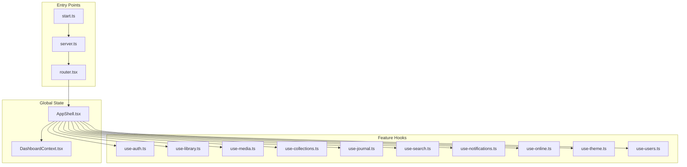

**Diagram sources**
- [start.ts](file://src/start.ts)
- [server.ts](file://src/server.ts)
- [router.tsx](file://src/router.tsx)
- [AppShell.tsx](file://src/components/layout/AppShell.tsx)
- [DashboardContext.tsx](file://src/components/dashboard/DashboardContext.tsx)
- [use-auth.ts](file://src/hooks/use-auth.ts)
- [use-library.ts](file://src/hooks/use-library.ts)
- [use-media.ts](file://src/hooks/use-media.ts)
- [use-collections.ts](file://src/hooks/use-collections.ts)
- [use-journal.ts](file://src/hooks/use-journal.ts)
- [use-search.ts](file://src/hooks/use-search.ts)
- [use-notifications.ts](file://src/hooks/use-notifications.ts)
- [use-online.ts](file://src/hooks/use-online.ts)
- [use-theme.ts](file://src/hooks/use-theme.ts)
- [use-users.ts](file://src/hooks/use-users.ts)

**Section sources**
- [start.ts](file://src/start.ts)
- [server.ts](file://src/server.ts)
- [router.tsx](file://src/router.tsx)
- [AppShell.tsx](file://src/components/layout/AppShell.tsx)
- [DashboardContext.tsx](file://src/components/dashboard/DashboardContext.tsx)

## Core Components
- Custom hooks per feature encapsulate:
  - Local UI state (loading, errors, pagination, filters)
  - Server state synchronization (fetching, mutations, optimistic updates)
  - Utilities for data transformation and validation
- Context providers coordinate cross-cutting concerns such as dashboard-wide settings, theme, online status, and notifications.

Key responsibilities:
- use-auth: Authentication lifecycle, session state, and protected routes integration
- use-library: Library queries, filtering, sorting, and pagination
- use-media: Media detail fetching, progress tracking, and related data
- use-collections: Collection CRUD, smart collections, and relationships
- use-journal: Journal entries, prompts, and timeline events
- use-search: Search query state, suggestions, and result caching
- use-notifications: Notification queue, read/unread state, and digest scheduling
- use-online: Network connectivity monitoring and offline fallbacks
- use-theme: Theme selection and persistence
- use-users: User profile and preferences

**Section sources**
- [use-auth.ts](file://src/hooks/use-auth.ts)
- [use-library.ts](file://src/hooks/use-library.ts)
- [use-media.ts](file://src/hooks/use-media.ts)
- [use-collections.ts](file://src/hooks/use-collections.ts)
- [use-journal.ts](file://src/hooks/use-journal.ts)
- [use-search.ts](file://src/hooks/use-search.ts)
- [use-notifications.ts](file://src/hooks/use-notifications.ts)
- [use-online.ts](file://src/hooks/use-online.ts)
- [use-theme.ts](file://src/hooks/use-theme.ts)
- [use-users.ts](file://src/hooks/use-users.ts)

## Architecture Overview
The application follows a layered approach:
- UI layer: Components consume hooks and context
- State layer: Custom hooks manage local and server state with consistent patterns
- Global layer: Context providers share app-wide state and behaviors
- Data layer: HTTP clients and services (encapsulated within hooks or libraries) interact with the backend

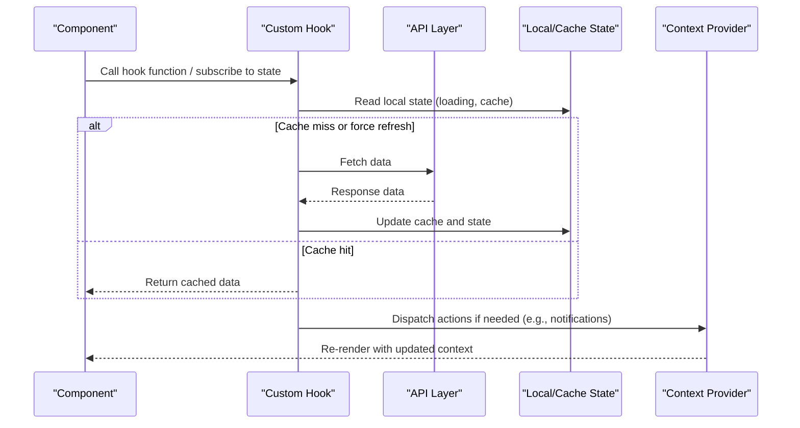

[No sources needed since this diagram shows conceptual workflow, not actual code structure]

## Detailed Component Analysis

### Authentication State (use-auth)
Responsibilities:
- Manage login/logout flow
- Maintain session token and user profile
- Provide protected route guards and redirects
- Handle error states and retry logic

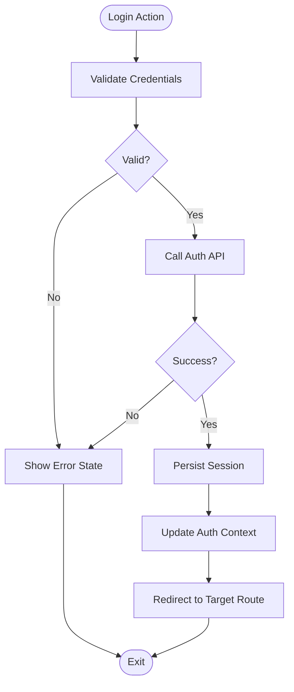

**Section sources**
- [use-auth.ts](file://src/hooks/use-auth.ts)

### Library State (use-library)
Responsibilities:
- Query library items with filters, sorting, and pagination
- Cache results locally to reduce network requests
- Provide optimistic updates for user actions (e.g., favorites)
- Expose helpers for derived views (recently added, stats)

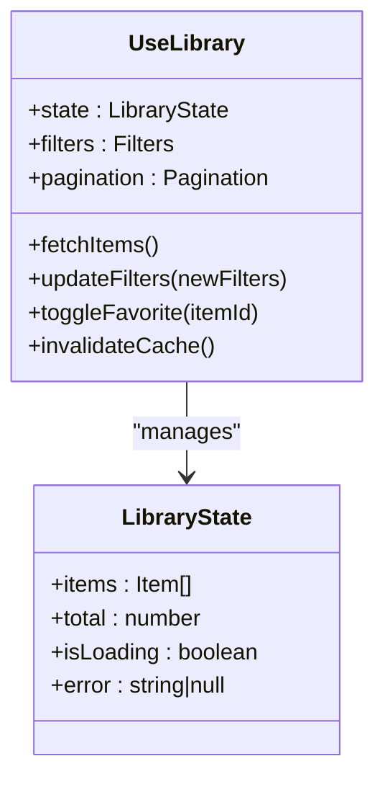

**Section sources**
- [use-library.ts](file://src/hooks/use-library.ts)

### Media Detail State (use-media)
Responsibilities:
- Fetch media metadata and related content
- Track viewing progress and sync with server
- Manage related recommendations and insights
- Handle loading skeletons and error boundaries

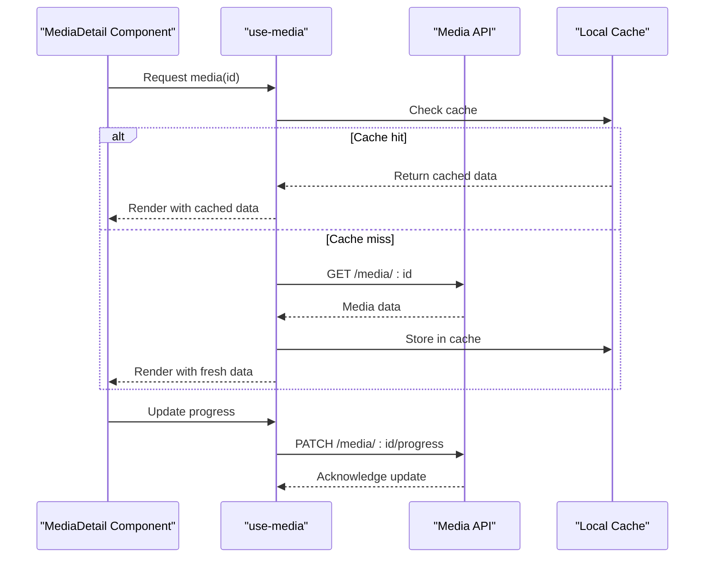

**Section sources**
- [use-media.ts](file://src/hooks/use-media.ts)

### Collections State (use-collections)
Responsibilities:
- CRUD operations for collections
- Smart collection rules and dynamic updates
- Relationship management between collections and media
- Optimistic UI updates for better UX

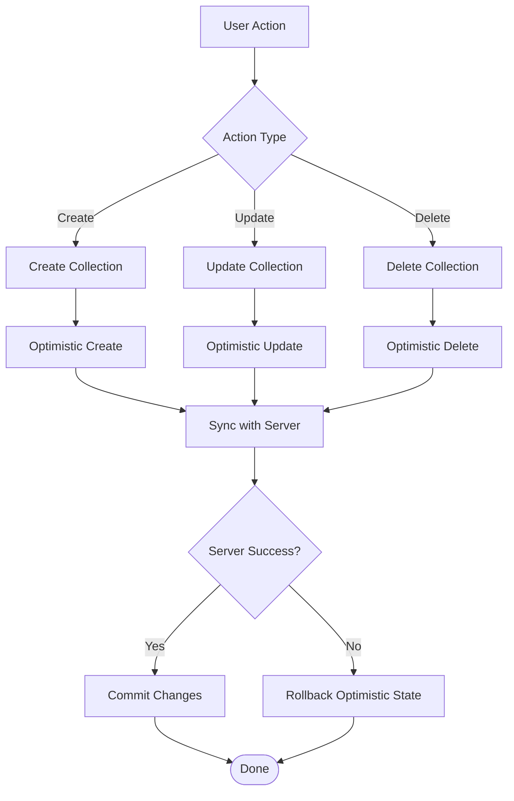

**Section sources**
- [use-collections.ts](file://src/hooks/use-collections.ts)

### Journal State (use-journal)
Responsibilities:
- Manage journal entries and prompts
- Timeline event generation and aggregation
- Auto-save functionality with debouncing
- Conflict resolution for concurrent edits

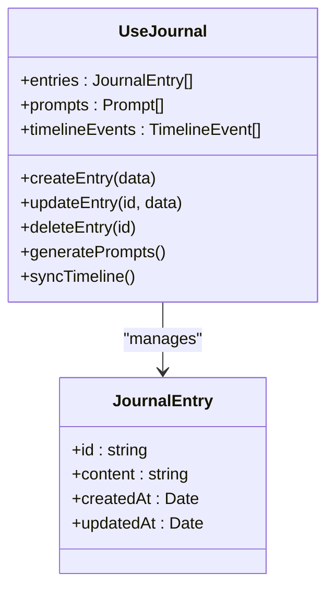

**Section sources**
- [use-journal.ts](file://src/hooks/use-journal.ts)

### Search State (use-search)
Responsibilities:
- Debounced search input handling
- Suggestion caching and prefetching
- Result pagination and filtering
- Keyboard navigation and accessibility

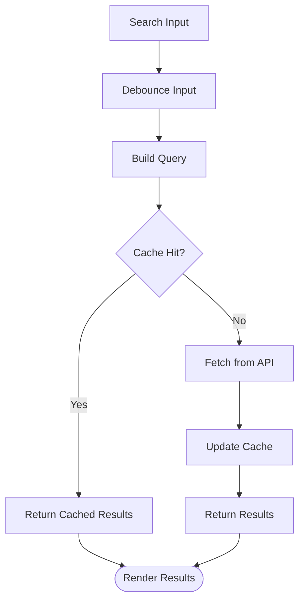

**Section sources**
- [use-search.ts](file://src/hooks/use-search.ts)

### Notifications State (use-notifications)
Responsibilities:
- Centralized notification queue management
- Read/unread state synchronization
- Digest scheduling and batch processing
- User preference handling for notification types

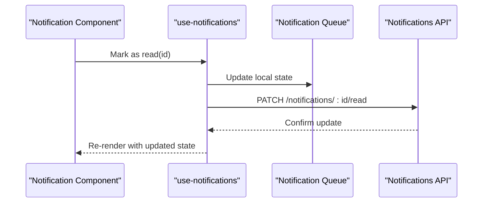

**Section sources**
- [use-notifications.ts](file://src/hooks/use-notifications.ts)

### Online Status (use-online)
Responsibilities:
- Monitor network connectivity changes
- Provide offline indicators and fallback UI
- Queue offline actions and sync when online
- Handle reconnection logic and backoff strategies

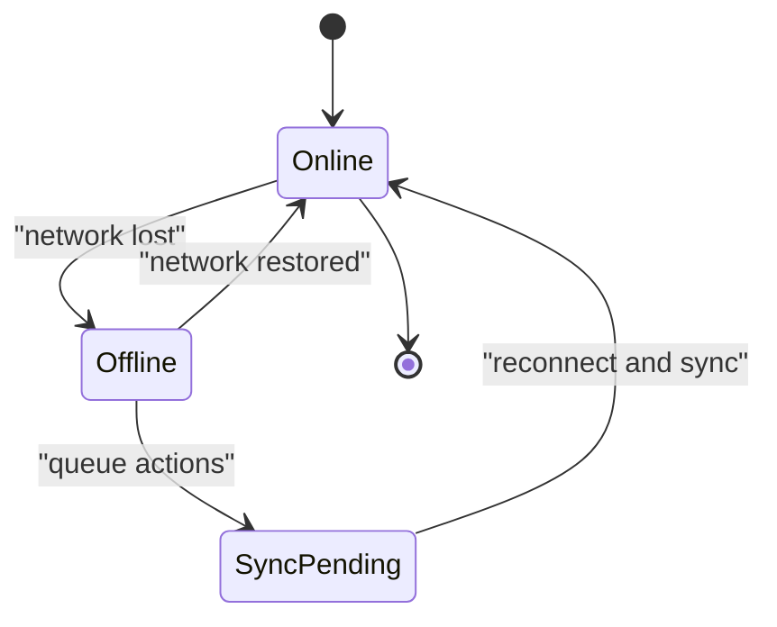

**Section sources**
- [use-online.ts](file://src/hooks/use-online.ts)

### Theme State (use-theme)
Responsibilities:
- Theme selection and switching
- Persistence across sessions
- System preference detection and override
- Dynamic style updates without full page reload

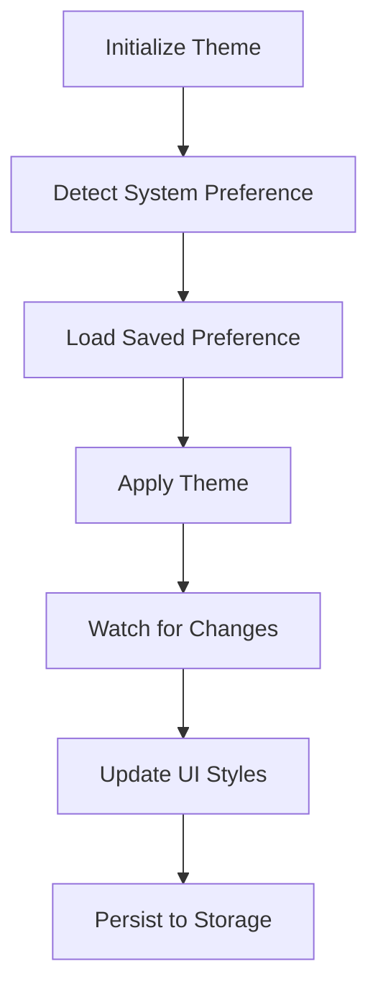

**Section sources**
- [use-theme.ts](file://src/hooks/use-theme.ts)

### Users State (use-users)
Responsibilities:
- User profile management and updates
- Preferences and settings synchronization
- Avatar and media handling
- Permission-based feature access

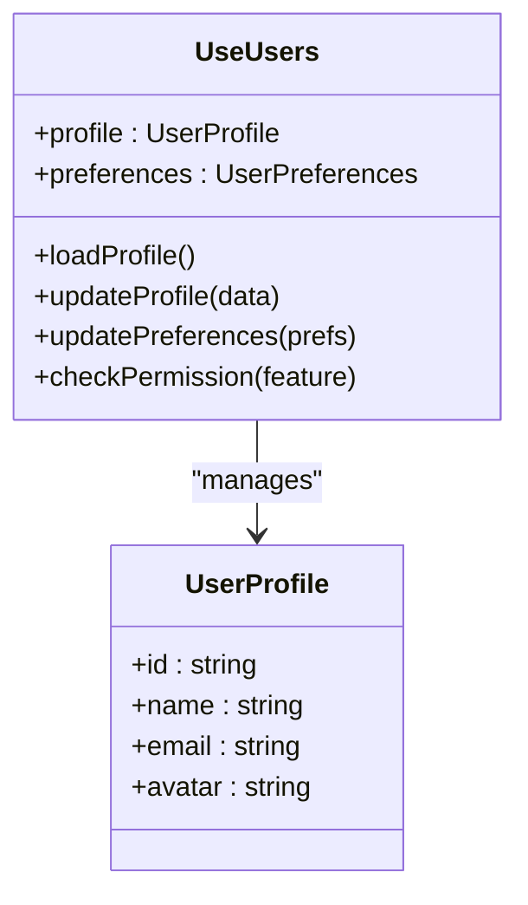

**Section sources**
- [use-users.ts](file://src/hooks/use-users.ts)

### Dashboard Context (DashboardContext)
Responsibilities:
- Shared dashboard state across components
- Global settings and preferences
- Cross-feature communication
- Performance optimization through memoization

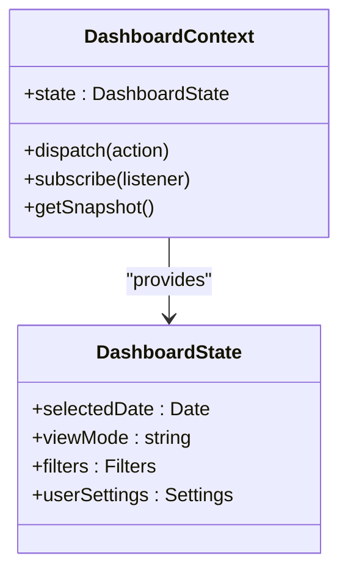

**Section sources**
- [DashboardContext.tsx](file://src/components/dashboard/DashboardContext.tsx)

## Dependency Analysis
The state management architecture maintains clear separation of concerns:
- Hooks depend on APIs and local storage but not on each other directly
- Context providers coordinate global state without tight coupling to features
- Components consume hooks and context without knowing implementation details

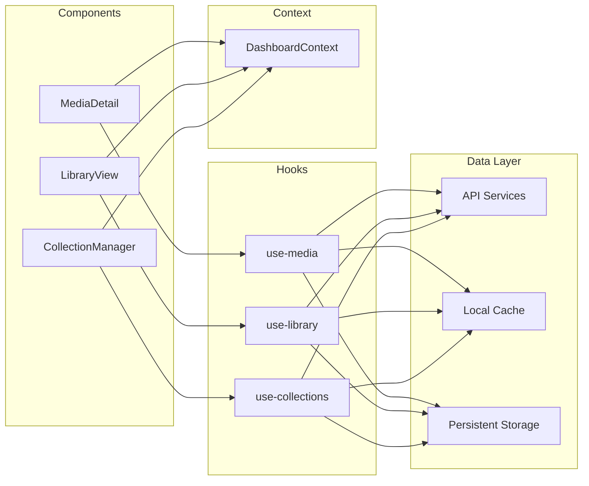

**Diagram sources**
- [use-media.ts](file://src/hooks/use-media.ts)
- [use-library.ts](file://src/hooks/use-library.ts)
- [use-collections.ts](file://src/hooks/use-collections.ts)
- [DashboardContext.tsx](file://src/components/dashboard/DashboardContext.tsx)

**Section sources**
- [use-media.ts](file://src/hooks/use-media.ts)
- [use-library.ts](file://src/hooks/use-library.ts)
- [use-collections.ts](file://src/hooks/use-collections.ts)
- [DashboardContext.tsx](file://src/components/dashboard/DashboardContext.tsx)

## Performance Considerations
- Memoization: Use React.memo and useMemo for expensive computations
- Selective Updates: Structure state to minimize re-renders
- Lazy Loading: Implement code splitting and lazy imports
- Caching Strategies: 
  - Stale-while-revalidate pattern for API responses
  - Optimistic updates with rollback capability
  - IndexedDB for large datasets
- Debouncing and Throttling: For search inputs and frequent updates
- Virtualization: For long lists and large datasets
- Background Sync: Queue operations during offline periods

## Troubleshooting Guide
Common issues and solutions:
- Stale Data: Implement proper cache invalidation strategies
- Memory Leaks: Clean up subscriptions and timers in useEffect cleanup
- Race Conditions: Use AbortController for cancelable requests
- Performance Bottlenecks: Profile with React DevTools and browser performance tools
- State Inconsistency: Implement proper error boundaries and recovery mechanisms

Best practices:
- Always handle loading and error states
- Implement proper cleanup in custom hooks
- Use proper TypeScript types for state structures
- Test edge cases and error scenarios
- Monitor memory usage and bundle size

## Conclusion
The state management strategy combines custom hooks for feature-specific state with context providers for global concerns. This approach provides:
- Clear separation of concerns between UI, server, and application state
- Reusable patterns for common state management tasks
- Performance optimizations through proper state organization
- Scalability for growing feature complexity

The modular design allows teams to work independently on different features while maintaining consistency in state management patterns.

## Appendices

### Best Practices Checklist
- [ ] Separate UI state from server state
- [ ] Implement proper error handling
- [ ] Add loading states for async operations
- [ ] Use appropriate caching strategies
- [ ] Implement optimistic updates where possible
- [ ] Clean up subscriptions and timers
- [ ] Test edge cases and error scenarios
- [ ] Monitor performance implications
- [ ] Document state contracts and interfaces
- [ ] Implement proper logging and debugging

### Common Patterns
- Form State Management with validation
- API call state with loading/error handling
- Real-time updates with WebSocket connections
- File upload state with progress tracking
- Modal/dialog state management
- Navigation state and routing
- Theme and localization state
- Analytics and tracking state