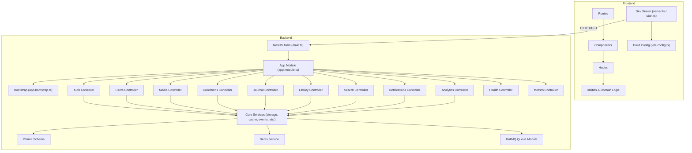
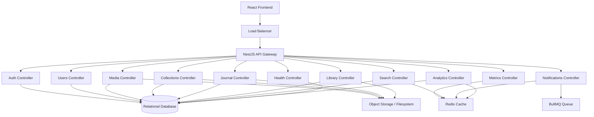
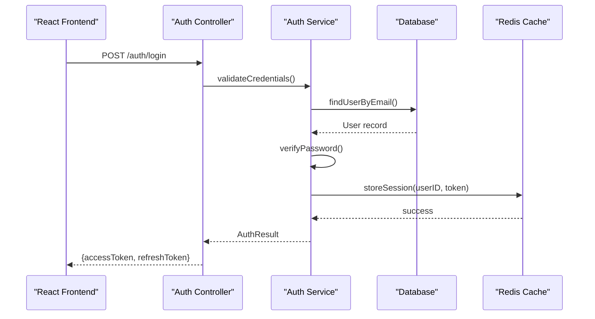
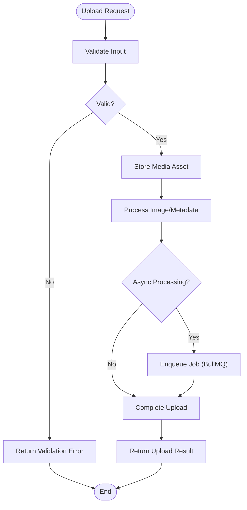
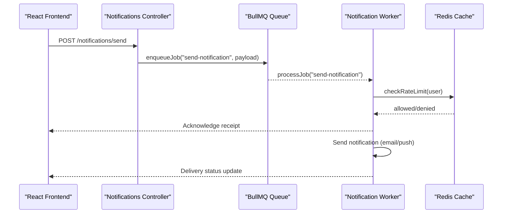
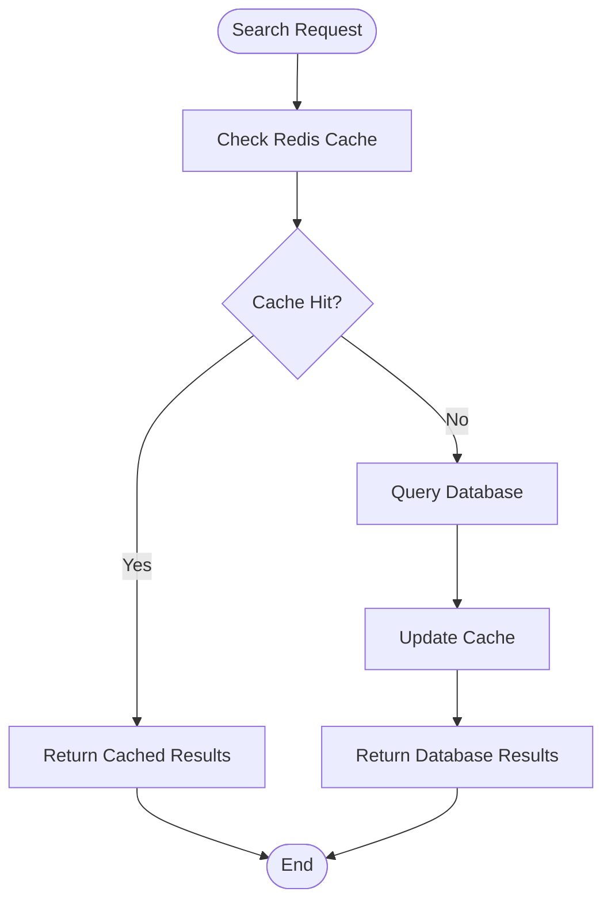
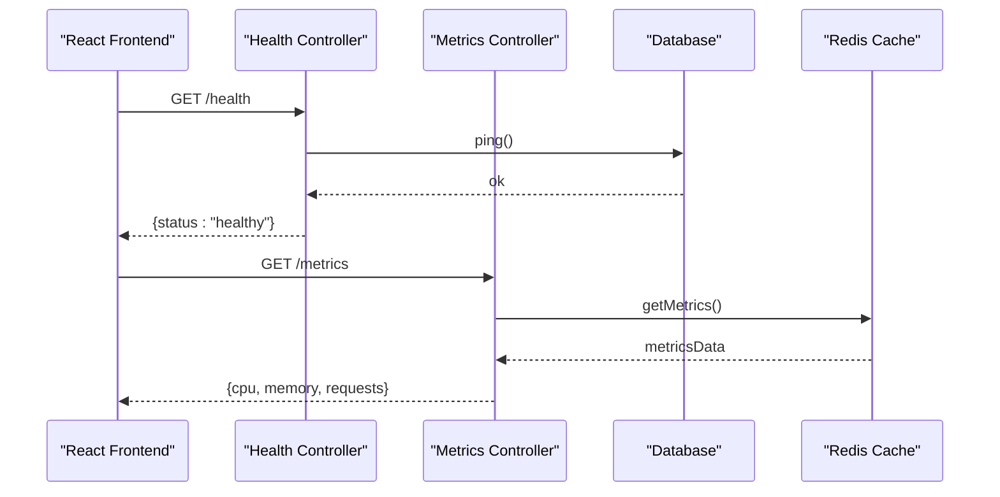
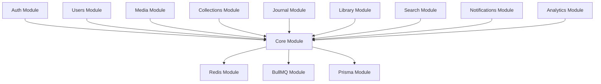

# System Architecture

<cite>
**Referenced Files in This Document**
- [package.json](file://package.json)
- [bunfig.toml](file://bunfig.toml)
- [vite.config.ts](file://vite.config.ts)
- [src/server.ts](file://src/server.ts)
- [src/start.ts](file://src/start.ts)
- [apps/backend/package.json](file://apps/backend/package.json)
- [apps/backend/nest-cli.json](file://apps/backend/nest-cli.json)
- [apps/backend/src/main.ts](file://apps/backend/src/main.ts)
- [apps/backend/src/app.module.ts](file://apps/backend/src/app.module.ts)
- [apps/backend/src/app.bootstrap.ts](file://apps/backend/src/app.bootstrap.ts)
- [apps/backend/prisma/schema.prisma](file://apps/backend/prisma/schema.prisma)
- [apps/backend/src/redis/redis.service.ts](file://apps/backend/src/redis/redis.service.ts)
- [apps/backend/src/bullmq/bullmq.module.ts](file://apps/backend/src/bullmq/bullmq.module.ts)
- [apps/backend/src/core/storage/storage.service.ts](file://apps/backend/src/core/storage/storage.service.ts)
- [apps/backend/src/auth/auth.controller.ts](file://apps/backend/src/auth/auth.controller.ts)
- [apps/backend/src/users/users.controller.ts](file://apps/backend/src/users/users.controller.ts)
- [apps/backend/src/media/media.controller.ts](file://apps/backend/src/media/media.controller.ts)
- [apps/backend/src/collections/collections.controller.ts](file://apps/backend/src/collections/collections.controller.ts)
- [apps/backend/src/journal/journal.controller.ts](file://apps/backend/src/journal/journal.controller.ts)
- [apps/backend/src/library/library.controller.ts](file://apps/backend/src/library/library.controller.ts)
- [apps/backend/src/search/search.controller.ts](file://apps/backend/src/search/search.controller.ts)
- [apps/backend/src/notifications/notifications.controller.ts](file://apps/backend/src/notifications/notifications.controller.ts)
- [apps/backend/src/analytics/analytics.controller.ts](file://apps/backend/src/analytics/analytics.controller.ts)
- [apps/backend/src/health/health.controller.ts](file://apps/backend/src/health/health.controller.ts)
- [apps/backend/src/observability/metrics.controller.ts](file://apps/backend/src/observability/metrics.controller.ts)
</cite>

## Table of Contents
1. [Introduction](#introduction)
2. [Project Structure](#project-structure)
3. [Core Components](#core-components)
4. [Architecture Overview](#architecture-overview)
5. [Detailed Component Analysis](#detailed-component-analysis)
6. [Dependency Analysis](#dependency-analysis)
7. [Performance Considerations](#performance-considerations)
8. [Troubleshooting Guide](#troubleshooting-guide)
9. [Conclusion](#conclusion)

## Introduction
This document describes the system architecture for Chronicle Your Media Story, a monorepo containing separate frontend and backend applications. The frontend is a React application built with Vite and Bun, while the backend is a NestJS service exposing RESTful APIs. The system follows a client-server pattern where the React app communicates with the NestJS backend via HTTP endpoints. The backend is organized into microservices-style modules (auth, users, media, collections, journal, library, search, notifications, analytics), each encapsulating its own controllers, services, repositories, and DTOs. Data persistence uses Prisma with a relational database, caching is provided by Redis, and background processing is handled through BullMQ queues. Storage operations are abstracted behind a storage service that can target cloud object stores or local filesystems.

## Project Structure
The repository is organized as a monorepo:
- Frontend application under src/:
  - Routes define pages and navigation using a file-based routing approach.
  - Components are feature-organized (e.g., auth, dashboard, media, collections).
  - Hooks encapsulate data fetching and state management.
  - lib contains utilities and domain logic.
  - server.ts and start.ts bootstrap the development server.
  - vite.config.ts configures the build pipeline.
- Backend application under apps/backend/:
  - NestJS module structure with controllers, services, repositories, DTOs, guards, strategies, and decorators.
  - Core cross-cutting concerns (cache, storage, transactions, events, idempotency) live under core/.
  - Configuration and environment validation under config/.
  - Health checks and observability endpoints under health/ and observability/.
  - Database schema defined with Prisma under prisma/schema.prisma.
  - Redis integration and BullMQ queue module for background jobs.

**Diagram sources**
- [src/server.ts](file://src/server.ts)
- [src/start.ts](file://src/start.ts)
- [vite.config.ts](file://vite.config.ts)
- [apps/backend/src/main.ts](file://apps/backend/src/main.ts)
- [apps/backend/src/app.module.ts](file://apps/backend/src/app.module.ts)
- [apps/backend/src/app.bootstrap.ts](file://apps/backend/src/app.bootstrap.ts)
- [apps/backend/src/redis/redis.service.ts](file://apps/backend/src/redis/redis.service.ts)
- [apps/backend/src/bullmq/bullmq.module.ts](file://apps/backend/src/bullmq/bullmq.module.ts)
- [apps/backend/prisma/schema.prisma](file://apps/backend/prisma/schema.prisma)

**Section sources**
- [package.json](file://package.json)
- [bunfig.toml](file://bunfig.toml)
- [vite.config.ts](file://vite.config.ts)
- [src/server.ts](file://src/server.ts)
- [src/start.ts](file://src/start.ts)
- [apps/backend/package.json](file://apps/backend/package.json)
- [apps/backend/nest-cli.json](file://apps/backend/nest-cli.json)

## Core Components
- Frontend Application:
  - Entry points: server.ts and start.ts initialize the development server and routes.
  - Build configuration: vite.config.ts defines bundling, plugins, and optimization settings.
  - Routing: File-based routes under src/routes map to UI components and hooks.
  - State and API interactions: Hooks encapsulate fetch calls to backend REST endpoints.
- Backend Application:
  - NestJS main entrypoint: main.ts bootstraps the application and registers global interceptors, filters, and pipes.
  - App module: app.module.ts aggregates feature modules and core services.
  - Bootstrap: app.bootstrap.ts initializes configuration, logging, and integrations.
  - Feature modules: Controllers expose REST endpoints; services implement business logic; repositories handle data access.
  - Cross-cutting services: Cache (Redis), storage abstraction, events, transactions, idempotency, and hashing utilities.
  - Background jobs: BullMQ module manages asynchronous tasks like notifications and media processing.
  - Observability: Health and metrics endpoints provide operational visibility.

**Section sources**
- [src/server.ts](file://src/server.ts)
- [src/start.ts](file://src/start.ts)
- [vite.config.ts](file://vite.config.ts)
- [apps/backend/src/main.ts](file://apps/backend/src/main.ts)
- [apps/backend/src/app.module.ts](file://apps/backend/src/app.module.ts)
- [apps/backend/src/app.bootstrap.ts](file://apps/backend/src/app.bootstrap.ts)
- [apps/backend/src/redis/redis.service.ts](file://apps/backend/src/redis/redis.service.ts)
- [apps/backend/src/bullmq/bullmq.module.ts](file://apps/backend/src/bullmq/bullmq.module.ts)
- [apps/backend/src/core/storage/storage.service.ts](file://apps/backend/src/core/storage/storage.service.ts)

## Architecture Overview
The system follows a client-server architecture:
- React frontend serves static assets and handles user interactions. It communicates with the NestJS backend over HTTP using RESTful APIs.
- NestJS backend exposes modularized controllers for authentication, users, media, collections, journal, library, search, notifications, and analytics.
- Data layer uses Prisma ORM against a relational database.
- Caching layer uses Redis for high-performance read paths and rate limiting.
- Background job processing uses BullMQ for asynchronous tasks such as digest generation, reminders, and media processing.
- Storage abstraction supports cloud object storage or local filesystem for media assets.

**Diagram sources**
- [apps/backend/src/auth/auth.controller.ts](file://apps/backend/src/auth/auth.controller.ts)
- [apps/backend/src/users/users.controller.ts](file://apps/backend/src/users/users.controller.ts)
- [apps/backend/src/media/media.controller.ts](file://apps/backend/src/media/media.controller.ts)
- [apps/backend/src/collections/collections.controller.ts](file://apps/backend/src/collections/collections.controller.ts)
- [apps/backend/src/journal/journal.controller.ts](file://apps/backend/src/journal/journal.controller.ts)
- [apps/backend/src/library/library.controller.ts](file://apps/backend/src/library/library.controller.ts)
- [apps/backend/src/search/search.controller.ts](file://apps/backend/src/search/search.controller.ts)
- [apps/backend/src/notifications/notifications.controller.ts](file://apps/backend/src/notifications/notifications.controller.ts)
- [apps/backend/src/analytics/analytics.controller.ts](file://apps/backend/src/analytics/analytics.controller.ts)
- [apps/backend/src/health/health.controller.ts](file://apps/backend/src/health/health.controller.ts)
- [apps/backend/src/observability/metrics.controller.ts](file://apps/backend/src/observability/metrics.controller.ts)
- [apps/backend/src/redis/redis.service.ts](file://apps/backend/src/redis/redis.service.ts)
- [apps/backend/src/bullmq/bullmq.module.ts](file://apps/backend/src/bullmq/bullmq.module.ts)
- [apps/backend/src/core/storage/storage.service.ts](file://apps/backend/src/core/storage/storage.service.ts)
- [apps/backend/prisma/schema.prisma](file://apps/backend/prisma/schema.prisma)

## Detailed Component Analysis

### Authentication Flow
The authentication flow secures API access using JWT-based tokens. The React frontend sends credentials to the NestJS auth controller, which validates them and returns tokens. Subsequent requests include authorization headers validated by guards.

**Diagram sources**
- [apps/backend/src/auth/auth.controller.ts](file://apps/backend/src/auth/auth.controller.ts)
- [apps/backend/src/redis/redis.service.ts](file://apps/backend/src/redis/redis.service.ts)

**Section sources**
- [apps/backend/src/auth/auth.controller.ts](file://apps/backend/src/auth/auth.controller.ts)

### Media Upload and Processing
Media uploads are handled by the media controller, which delegates to storage and image processing services. Large files may be processed asynchronously via BullMQ queues.

**Diagram sources**
- [apps/backend/src/media/media.controller.ts](file://apps/backend/src/media/media.controller.ts)
- [apps/backend/src/core/storage/storage.service.ts](file://apps/backend/src/core/storage/storage.service.ts)
- [apps/backend/src/bullmq/bullmq.module.ts](file://apps/backend/src/bullmq/bullmq.module.ts)

**Section sources**
- [apps/backend/src/media/media.controller.ts](file://apps/backend/src/media/media.controller.ts)
- [apps/backend/src/core/storage/storage.service.ts](file://apps/backend/src/core/storage/storage.service.ts)
- [apps/backend/src/bullmq/bullmq.module.ts](file://apps/backend/src/bullmq/bullmq.module.ts)

### Notifications and Background Jobs
Notifications are queued and processed asynchronously. The notifications controller enqueues jobs, and workers consume them to send emails, push notifications, or generate digests.

**Diagram sources**
- [apps/backend/src/notifications/notifications.controller.ts](file://apps/backend/src/notifications/notifications.controller.ts)
- [apps/backend/src/bullmq/bullmq.module.ts](file://apps/backend/src/bullmq/bullmq.module.ts)
- [apps/backend/src/redis/redis.service.ts](file://apps/backend/src/redis/redis.service.ts)

**Section sources**
- [apps/backend/src/notifications/notifications.controller.ts](file://apps/backend/src/notifications/notifications.controller.ts)
- [apps/backend/src/bullmq/bullmq.module.ts](file://apps/backend/src/bullmq/bullmq.module.ts)
- [apps/backend/src/redis/redis.service.ts](file://apps/backend/src/redis/redis.service.ts)

### Search and Caching
Search functionality leverages Redis for fast lookups and suggestions. The search controller queries cached indexes when available, falling back to database queries otherwise.

**Diagram sources**
- [apps/backend/src/search/search.controller.ts](file://apps/backend/src/search/search.controller.ts)
- [apps/backend/src/redis/redis.service.ts](file://apps/backend/src/redis/redis.service.ts)

**Section sources**
- [apps/backend/src/search/search.controller.ts](file://apps/backend/src/search/search.controller.ts)
- [apps/backend/src/redis/redis.service.ts](file://apps/backend/src/redis/redis.service.ts)

### Health and Observability
Health and metrics endpoints provide operational insights. The health controller checks database connectivity and service readiness, while metrics controller exposes performance indicators.

**Diagram sources**
- [apps/backend/src/health/health.controller.ts](file://apps/backend/src/health/health.controller.ts)
- [apps/backend/src/observability/metrics.controller.ts](file://apps/backend/src/observability/metrics.controller.ts)
- [apps/backend/src/redis/redis.service.ts](file://apps/backend/src/redis/redis.service.ts)

**Section sources**
- [apps/backend/src/health/health.controller.ts](file://apps/backend/src/health/health.controller.ts)
- [apps/backend/src/observability/metrics.controller.ts](file://apps/backend/src/observability/metrics.controller.ts)

## Dependency Analysis
The backend modules exhibit clear separation of concerns:
- Controllers depend on services for business logic.
- Services depend on repositories for data access.
- Core services (cache, storage, events) are shared across modules.
- External dependencies include Prisma for database access, Redis for caching, and BullMQ for job processing.

**Diagram sources**
- [apps/backend/src/app.module.ts](file://apps/backend/src/app.module.ts)
- [apps/backend/src/redis/redis.service.ts](file://apps/backend/src/redis/redis.service.ts)
- [apps/backend/src/bullmq/bullmq.module.ts](file://apps/backend/src/bullmq/bullmq.module.ts)
- [apps/backend/prisma/schema.prisma](file://apps/backend/prisma/schema.prisma)

**Section sources**
- [apps/backend/src/app.module.ts](file://apps/backend/src/app.module.ts)

## Performance Considerations
- Caching Strategy: Use Redis for frequently accessed data like search results, user sessions, and rate limiting. Implement cache invalidation policies to maintain consistency.
- Database Optimization: Leverage Prisma query optimization, indexing, and connection pooling. Monitor slow queries and optimize schemas.
- Background Processing: Offload long-running tasks to BullMQ workers to keep API responses fast.
- Load Balancing: Deploy multiple instances of the NestJS backend behind a load balancer for horizontal scaling.
- Horizontal Scaling: Scale stateless backend instances horizontally while sharing state via Redis and database.
- Storage Optimization: Use CDN for static assets and media files. Implement lazy loading and compression.

[No sources needed since this section provides general guidance]

## Troubleshooting Guide
- Health Checks: Use the health endpoint to verify service readiness and database connectivity.
- Metrics Monitoring: Access metrics endpoint to monitor CPU, memory, and request rates.
- Error Handling: Implement global exception filters in NestJS to standardize error responses.
- Logging: Configure structured logging for debugging and audit trails.
- Rate Limiting: Use Redis-based rate limiting to prevent abuse and ensure fair usage.

**Section sources**
- [apps/backend/src/health/health.controller.ts](file://apps/backend/src/health/health.controller.ts)
- [apps/backend/src/observability/metrics.controller.ts](file://apps/backend/src/observability/metrics.controller.ts)

## Conclusion
Chronicle Your Media Story implements a robust client-server architecture with a React frontend and NestJS backend. The system is designed for scalability through microservices-style modularity, caching with Redis, background processing with BullMQ, and flexible storage abstraction. Operational visibility is provided through health and metrics endpoints. The architecture supports horizontal scaling and load balancing for high availability and performance.

[No sources needed since this section summarizes without analyzing specific files]