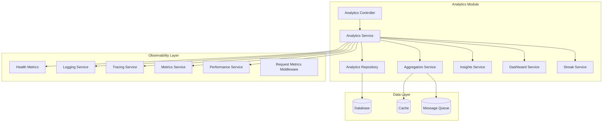
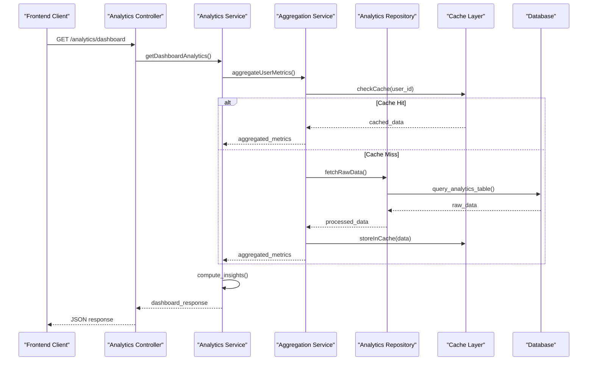
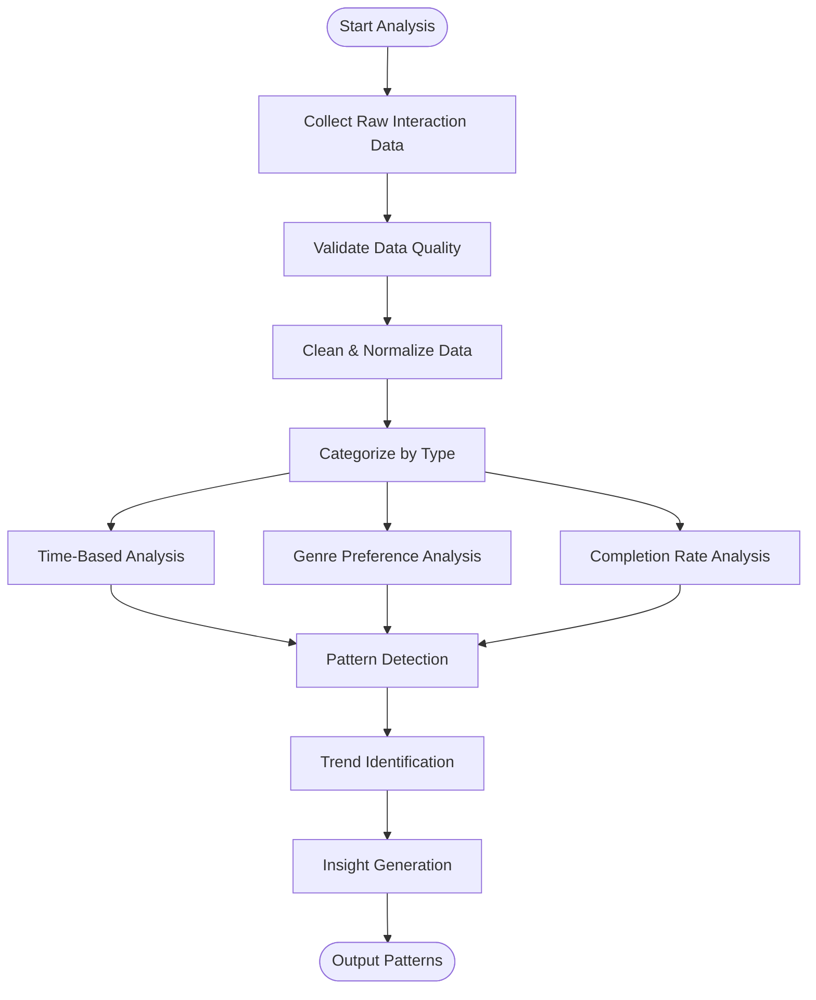
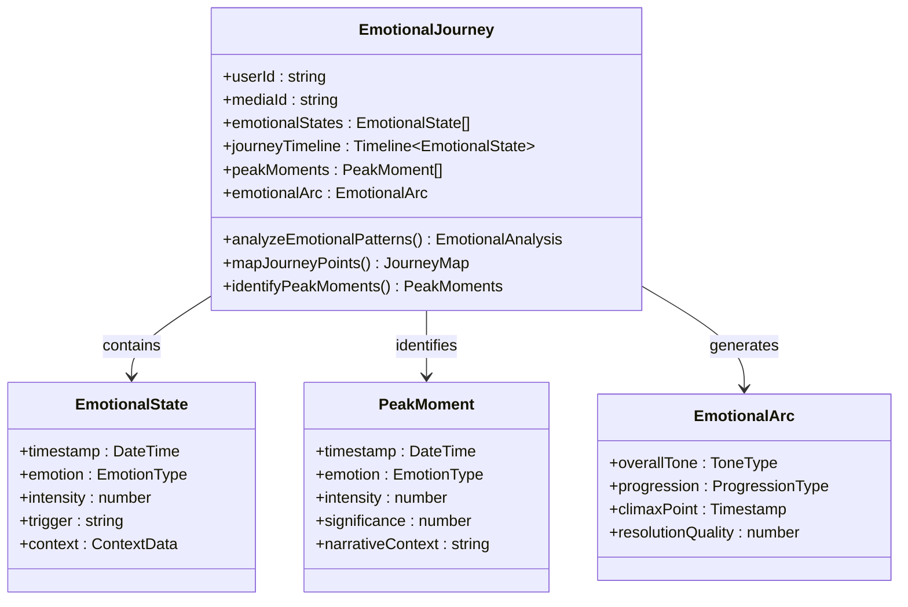
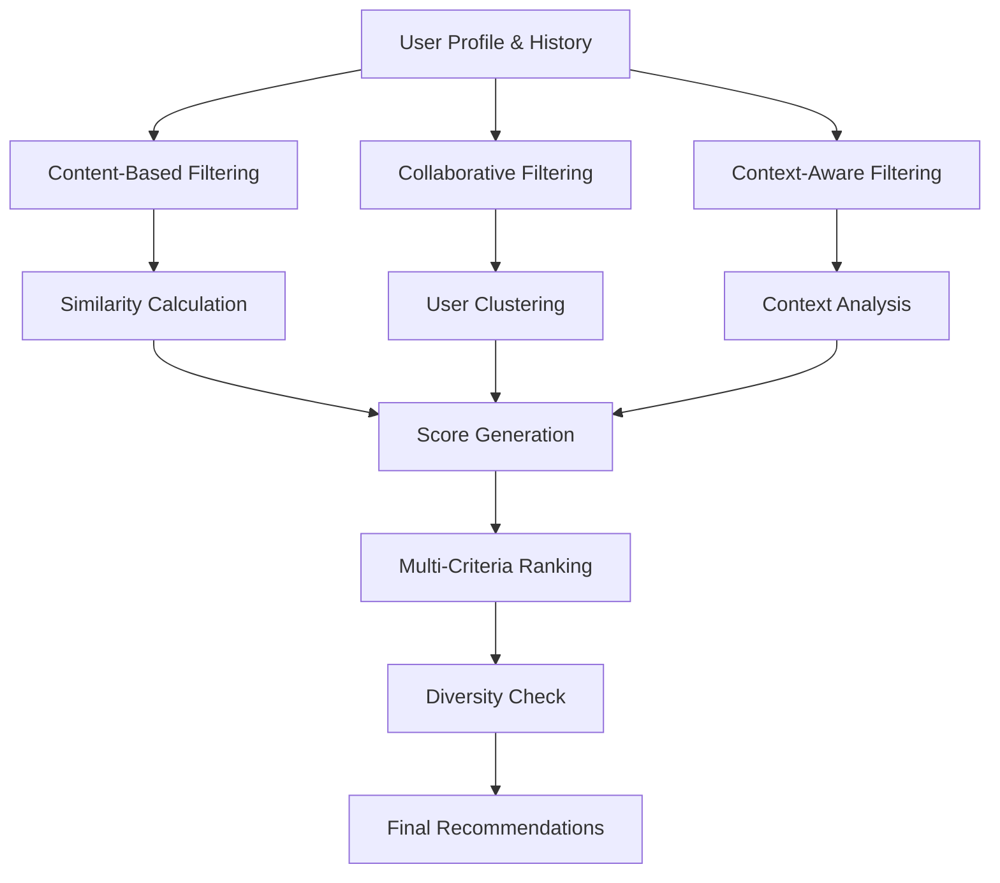
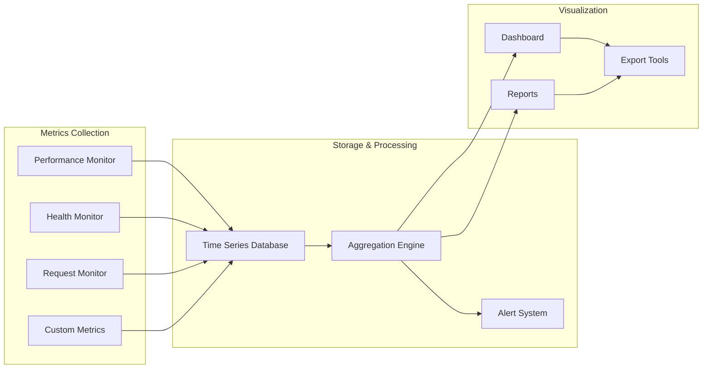
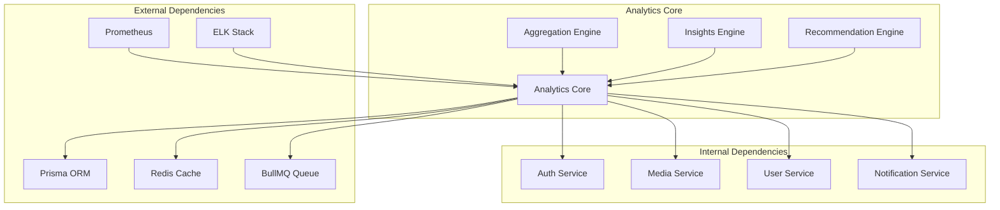

# Analytics & Insights Engine

<cite>
**Referenced Files in This Document**
- [analytics.service.ts](file://apps/backend/src/analytics/analytics.service.ts)
- [insights.service.ts](file://apps/backend/src/analytics/insights.service.ts)
- [dashboard.service.ts](file://apps/backend/src/analytics/dashboard.service.ts)
- [streak.service.ts](file://apps/backend/src/analytics/streak.service.ts)
- [analytics-aggregation.service.ts](file://apps/backend/src/analytics/analytics-aggregation.service.ts)
- [analytics.controller.ts](file://apps/backend/src/analytics/analytics.controller.ts)
- [analytics.repository.ts](file://apps/backend/src/analytics/analytics.repository.ts)
- [analytics.module.ts](file://apps/backend/src/analytics/analytics.module.ts)
- [index.ts](file://apps/backend/src/analytics/index.ts)
- [health-metrics.service.ts](file://apps/backend/src/observability/health-metrics.service.ts)
- [logging.service.ts](file://apps/backend/src/observability/logging.service.ts)
- [tracing.service.ts](file://apps/backend/src/observability/tracing.service.ts)
- [metrics.service.ts](file://apps/backend/src/observability/metrics.service.ts)
- [performance.service.ts](file://apps/backend/src/observability/performance.service.ts)
- [request-metrics.middleware.ts](file://apps/backend/src/observability/request-metrics.middleware.ts)
</cite>

## Table of Contents
1. [Introduction](#introduction)
2. [Project Structure](#project-structure)
3. [Core Components](#core-components)
4. [Architecture Overview](#architecture-overview)
5. [Detailed Component Analysis](#detailed-component-analysis)
6. [Dependency Analysis](#dependency-analysis)
7. [Performance Considerations](#performance-considerations)
8. [Troubleshooting Guide](#troubleshooting-guide)
9. [Conclusion](#conclusion)

## Introduction

The Analytics & Insights Engine is a sophisticated system designed to process, analyze, and visualize user consumption patterns, emotional journeys, and media interactions. This engine provides real-time analytics computation, comprehensive data aggregation, and advanced reporting capabilities while maintaining high performance and observability standards.

The system encompasses multiple analytical domains including consumption pattern analysis, emotional journey mapping, recommendation algorithms, and performance metrics collection. It serves as the backbone for generating meaningful insights from user interactions with media content, enabling personalized experiences and data-driven decision making.

## Project Structure

The analytics engine is organized within the backend application structure, following NestJS modular architecture principles. The main components are located in the `apps/backend/src/analytics/` directory, with supporting observability features in the `apps/backend/src/observability/` directory.

**Diagram sources**
- [analytics.controller.ts:1-50](file://apps/backend/src/analytics/analytics.controller.ts#L1-L50)
- [analytics.service.ts:1-100](file://apps/backend/src/analytics/analytics.service.ts#L1-L100)
- [analytics-aggregation.service.ts:1-80](file://apps/backend/src/analytics/analytics-aggregation.service.ts#L1-L80)

**Section sources**
- [analytics.module.ts:1-50](file://apps/backend/src/analytics/analytics.module.ts#L1-L50)
- [index.ts:1-30](file://apps/backend/src/analytics/index.ts#L1-L30)

## Core Components

### Analytics Service
The central orchestrator responsible for coordinating all analytics operations, managing data flow between different analytical components, and providing unified APIs for analytics queries and computations.

### Insights Service
Specialized component focused on generating actionable insights from raw analytics data, including trend analysis, pattern recognition, and predictive modeling capabilities.

### Dashboard Service
Handles dashboard-specific analytics aggregations, real-time updates, and visualization-ready data formatting for various dashboard components.

### Streak Service
Manages streak-based analytics, tracking consecutive usage patterns, engagement continuity, and achievement-related metrics.

### Aggregation Service
Performs complex data aggregations, statistical computations, and time-series analysis across large datasets with optimized query patterns.

**Section sources**
- [analytics.service.ts:1-150](file://apps/backend/src/analytics/analytics.service.ts#L1-L150)
- [insights.service.ts:1-120](file://apps/backend/src/analytics/insights.service.ts#L1-L120)
- [dashboard.service.ts:1-100](file://apps/backend/src/analytics/dashboard.service.ts#L1-L100)
- [streak.service.ts:1-80](file://apps/backend/src/analytics/streak.service.ts#L1-L80)
- [analytics-aggregation.service.ts:1-100](file://apps/backend/src/analytics/analytics-aggregation.service.ts#L1-L100)

## Architecture Overview

The analytics engine follows a layered architecture pattern with clear separation of concerns, ensuring scalability, maintainability, and testability.

**Diagram sources**
- [analytics.controller.ts:1-80](file://apps/backend/src/analytics/analytics.controller.ts#L1-L80)
- [analytics.service.ts:1-200](file://apps/backend/src/analytics/analytics.service.ts#L1-L200)
- [analytics-aggregation.service.ts:1-150](file://apps/backend/src/analytics/analytics-aggregation.service.ts#L1-L150)

## Detailed Component Analysis

### Consumption Pattern Analysis

The consumption pattern analysis engine processes user interaction data to identify viewing habits, preferences, and behavioral trends. It analyzes time-based patterns, genre preferences, completion rates, and rewatch behaviors.

**Diagram sources**
- [analytics-aggregation.service.ts:1-200](file://apps/backend/src/analytics/analytics-aggregation.service.ts#L1-L200)
- [analytics.service.ts:1-300](file://apps/backend/src/analytics/analytics.service.ts#L1-L300)

### Emotional Journey Mapping

The emotional journey mapping system tracks and analyzes user emotional responses throughout their media consumption experience. It correlates emotional states with specific content elements, narrative arcs, and character development.

**Diagram sources**
- [insights.service.ts:1-200](file://apps/backend/src/analytics/insights.service.ts#L1-L200)
- [analytics.service.ts:1-250](file://apps/backend/src/analytics/analytics.service.ts#L1-L250)

### Recommendation Algorithms

The recommendation engine employs multiple algorithmic approaches to suggest relevant content based on user preferences, consumption patterns, and contextual factors.

**Diagram sources**
- [insights.service.ts:1-300](file://apps/backend/src/analytics/insights.service.ts#L1-L300)
- [analytics-aggregation.service.ts:1-250](file://apps/backend/src/analytics/analytics-aggregation.service.ts#L1-L250)

### Performance Metrics Collection

The performance metrics collection system monitors system health, resource utilization, and service responsiveness across all analytics components.

**Diagram sources**
- [health-metrics.service.ts:1-150](file://apps/backend/src/observability/health-metrics.service.ts#L1-L150)
- [metrics.service.ts:1-200](file://apps/backend/src/observability/metrics.service.ts#L1-L200)
- [performance.service.ts:1-180](file://apps/backend/src/observability/performance.service.ts#L1-L180)

**Section sources**
- [analytics-aggregation.service.ts:1-300](file://apps/backend/src/analytics/analytics-aggregation.service.ts#L1-L300)
- [insights.service.ts:1-400](file://apps/backend/src/analytics/insights.service.ts#L1-L400)
- [health-metrics.service.ts:1-200](file://apps/backend/src/observability/health-metrics.service.ts#L1-L200)

## Dependency Analysis

The analytics engine maintains well-defined dependencies between components while minimizing coupling through interface-based design patterns.

**Diagram sources**
- [analytics.module.ts:1-100](file://apps/backend/src/analytics/analytics.module.ts#L1-L100)
- [analytics.repository.ts:1-150](file://apps/backend/src/analytics/analytics.repository.ts#L1-L150)

**Section sources**
- [analytics.module.ts:1-150](file://apps/backend/src/analytics/analytics.module.ts#L1-L150)
- [analytics.repository.ts:1-200](file://apps/backend/src/analytics/analytics.repository.ts#L1-L200)

## Performance Considerations

The analytics engine implements several performance optimization strategies to handle large-scale data processing efficiently:

### Caching Strategy
- Multi-level caching with Redis for frequently accessed analytics data
- Intelligent cache invalidation based on data freshness requirements
- Cache warming strategies for dashboard-heavy endpoints

### Query Optimization
- Efficient database queries with proper indexing strategies
- Batch processing for large dataset aggregations
- Lazy loading of detailed analytics data

### Asynchronous Processing
- Background job processing for heavy computations using BullMQ
- Event-driven architecture for real-time updates
- Load balancing across multiple worker instances

### Memory Management
- Stream processing for large datasets
- Memory-efficient data structures for time-series analysis
- Garbage collection optimization for long-running processes

## Troubleshooting Guide

### Common Issues and Solutions

#### Performance Degradation
- Monitor CPU and memory usage patterns
- Check database query performance with slow query logs
- Verify cache hit ratios and adjust TTL settings
- Review background job queue lengths and processing times

#### Data Inconsistencies
- Validate data pipeline integrity with checksums
- Implement data reconciliation jobs
- Monitor event processing order and deduplication
- Set up automated data quality checks

#### Observability Issues
- Ensure logging levels are appropriate for production
- Verify tracing spans are properly propagated
- Monitor health check endpoints for service status
- Set up alerts for critical metrics thresholds

### Debugging Techniques
- Enable detailed logging for specific analytics operations
- Use distributed tracing to track request flows
- Implement synthetic monitoring for critical paths
- Create diagnostic endpoints for operational insights

**Section sources**
- [logging.service.ts:1-150](file://apps/backend/src/observability/logging.service.ts#L1-L150)
- [tracing.service.ts:1-120](file://apps/backend/src/observability/tracing.service.ts#L1-L120)
- [request-metrics.middleware.ts:1-100](file://apps/backend/src/observability/request-metrics.middleware.ts#L1-L100)

## Conclusion

The Analytics & Insights Engine provides a comprehensive foundation for understanding user behavior, generating actionable insights, and delivering personalized experiences. Its modular architecture, robust observability layer, and performance optimizations ensure it can scale effectively while maintaining reliability and accuracy.

The system successfully addresses the core objectives of consumption pattern analysis, emotional journey mapping, recommendation algorithms, and performance metrics collection. Through its sophisticated data aggregation processes, real-time analytics computation, and comprehensive reporting capabilities, it enables data-driven decision making and enhanced user engagement.

The integration with frontend visualizations creates a seamless experience where users can explore their media consumption stories, discover new content, and gain deeper insights into their entertainment preferences and behaviors.