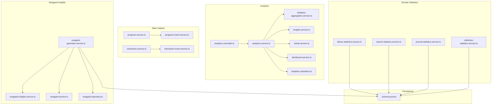
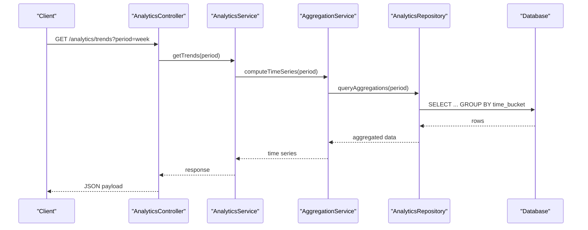
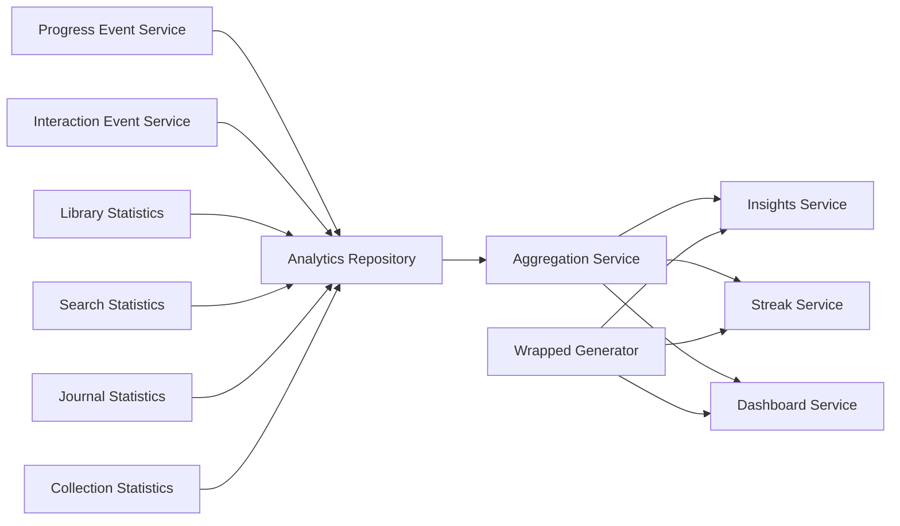
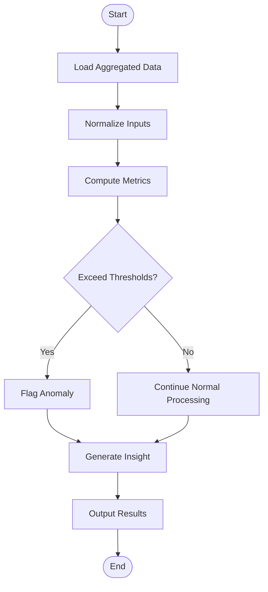

# Consumption Pattern Analysis

<cite>
**Referenced Files in This Document**
- [analytics.controller.ts](file://apps/backend/src/analytics/analytics.controller.ts)
- [analytics.service.ts](file://apps/backend/src/analytics/analytics.service.ts)
- [analytics-aggregation.service.ts](file://apps/backend/src/analytics/analytics-aggregation.service.ts)
- [insights.service.ts](file://apps/backend/src/analytics/insights.service.ts)
- [streak.service.ts](file://apps/backend/src/analytics/streak.service.ts)
- [dashboard.service.ts](file://apps/backend/src/analytics/dashboard.service.ts)
- [analytics.repository.ts](file://apps/backend/src/analytics/analytics.repository.ts)
- [analytics.module.ts](file://apps/backend/src/analytics/analytics.module.ts)
- [index.ts](file://apps/backend/src/analytics/index.ts)
- [progress.service.ts](file://apps/backend/src/progress/progress.service.ts)
- [progress-event.service.ts](file://apps/backend/src/progress/progress-event.service.ts)
- [progress.repository.ts](file://apps/backend/src/progress/progress.repository.ts)
- [interaction.service.ts](file://apps/backend/src/interaction/interaction.service.ts)
- [interaction-event.service.ts](file://apps/backend/src/interaction/interaction-event.service.ts)
- [library-statistics.service.ts](file://apps/backend/src/library/library-statistics.service.ts)
- [search-statistics.service.ts](file://apps/backend/src/search/search-statistics.service.ts)
- [journal-statistics.service.ts](file://apps/backend/src/journal/journal-statistics.service.ts)
- [collection-statistics.service.ts](file://apps/backend/src/collections/collection-statistics.service.ts)
- [wrapped-generator.service.ts](file://apps/backend/src/wrapped/wrapped-generator.service.ts)
- [wrapped-insights.service.ts](file://apps/backend/src/wrapped/wrapped-insights.service.ts)
- [wrapped.service.ts](file://apps/backend/src/wrapped/wrapped.service.ts)
- [wrapped.repository.ts](file://apps/backend/src/wrapped/wrapped.repository.ts)
- [schema.prisma](file://apps/backend/prisma/schema.prisma)
</cite>

## Table of Contents
1. [Introduction](#introduction)
2. [Project Structure](#project-structure)
3. [Core Components](#core-components)
4. [Architecture Overview](#architecture-overview)
5. [Detailed Component Analysis](#detailed-component-analysis)
6. [Dependency Analysis](#dependency-analysis)
7. [Performance Considerations](#performance-considerations)
8. [Troubleshooting Guide](#troubleshooting-guide)
9. [Conclusion](#conclusion)
10. [Appendices](#appendices)

## Introduction
This document explains how the system tracks, analyzes, and aggregates user media consumption patterns. It covers analytics data collection, pattern recognition algorithms, statistical analysis methods, time-based trends, genre preferences, viewing session analysis, and examples of metrics calculation and detection logic. The goal is to provide both technical depth and accessible explanations for users with varying backgrounds.

## Project Structure
The consumption pattern analysis spans multiple modules:
- Analytics module provides controllers, services, aggregation, insights, streaks, and repository access.
- Progress and Interaction modules capture granular events (playback progress and interactions).
- Library, Search, Journal, and Collections statistics aggregate domain-specific metrics.
- Wrapped module generates periodic summaries and insights based on aggregated data.
- Prisma schema defines persistent entities used by analytics and related services.

**Diagram sources**
- [analytics.controller.ts](file://apps/backend/src/analytics/analytics.controller.ts)
- [analytics.service.ts](file://apps/backend/src/analytics/analytics.service.ts)
- [analytics-aggregation.service.ts](file://apps/backend/src/analytics/analytics-aggregation.service.ts)
- [insights.service.ts](file://apps/backend/src/analytics/insights.service.ts)
- [streak.service.ts](file://apps/backend/src/analytics/streak.service.ts)
- [dashboard.service.ts](file://apps/backend/src/analytics/dashboard.service.ts)
- [analytics.repository.ts](file://apps/backend/src/analytics/analytics.repository.ts)
- [progress.service.ts](file://apps/backend/src/progress/progress.service.ts)
- [progress-event.service.ts](file://apps/backend/src/progress/progress-event.service.ts)
- [interaction.service.ts](file://apps/backend/src/interaction/interaction.service.ts)
- [interaction-event.service.ts](file://apps/backend/src/interaction/interaction-event.service.ts)
- [library-statistics.service.ts](file://apps/backend/src/library/library-statistics.service.ts)
- [search-statistics.service.ts](file://apps/backend/src/search/search-statistics.service.ts)
- [journal-statistics.service.ts](file://apps/backend/src/journal/journal-statistics.service.ts)
- [collection-statistics.service.ts](file://apps/backend/src/collections/collection-statistics.service.ts)
- [wrapped-generator.service.ts](file://apps/backend/src/wrapped/wrapped-generator.service.ts)
- [wrapped-insights.service.ts](file://apps/backend/src/wrapped/wrapped-insights.service.ts)
- [wrapped.service.ts](file://apps/backend/src/wrapped/wrapped.service.ts)
- [wrapped.repository.ts](file://apps/backend/src/wrapped/wrapped.repository.ts)
- [schema.prisma](file://apps/backend/prisma/schema.prisma)

**Section sources**
- [analytics.module.ts](file://apps/backend/src/analytics/analytics.module.ts)
- [index.ts](file://apps/backend/src/analytics/index.ts)

## Core Components
- Analytics Controller: Exposes endpoints for retrieving consumption analytics, aggregations, insights, streaks, and dashboard summaries.
- Analytics Service: Orchestrates analytics queries, coordinates aggregation and insights generation, and composes responses.
- Aggregation Service: Computes time-series and categorical aggregations (e.g., daily/weekly totals, genre distribution).
- Insights Service: Applies pattern recognition heuristics to identify trends, anomalies, and notable behaviors.
- Streak Service: Calculates consecutive activity streaks across days or sessions.
- Dashboard Service: Provides a consolidated snapshot for UI dashboards combining multiple metrics.
- Analytics Repository: Encapsulates database queries for raw and aggregated analytics data.
- Progress and Interaction Services: Emit and persist granular events that feed analytics pipelines.
- Domain Statistics Services: Compute library-wide, search, journal, and collection-level metrics.
- Wrapped Services: Generate periodic summaries and highlight key patterns over defined periods.

**Section sources**
- [analytics.controller.ts](file://apps/backend/src/analytics/analytics.controller.ts)
- [analytics.service.ts](file://apps/backend/src/analytics/analytics.service.ts)
- [analytics-aggregation.service.ts](file://apps/backend/src/analytics/analytics-aggregation.service.ts)
- [insights.service.ts](file://apps/backend/src/analytics/insights.service.ts)
- [streak.service.ts](file://apps/backend/src/analytics/streak.service.ts)
- [dashboard.service.ts](file://apps/backend/src/analytics/dashboard.service.ts)
- [analytics.repository.ts](file://apps/backend/src/analytics/analytics.repository.ts)
- [progress.service.ts](file://apps/backend/src/progress/progress.service.ts)
- [progress-event.service.ts](file://apps/backend/src/progress/progress-event.service.ts)
- [interaction.service.ts](file://apps/backend/src/interaction/interaction.service.ts)
- [interaction-event.service.ts](file://apps/backend/src/interaction/interaction-event.service.ts)
- [library-statistics.service.ts](file://apps/backend/src/library/library-statistics.service.ts)
- [search-statistics.service.ts](file://apps/backend/src/search/search-statistics.service.ts)
- [journal-statistics.service.ts](file://apps/backend/src/journal/journal-statistics.service.ts)
- [collection-statistics.service.ts](file://apps/backend/src/collections/collection-statistics.service.ts)
- [wrapped-generator.service.ts](file://apps/backend/src/wrapped/wrapped-generator.service.ts)
- [wrapped-insights.service.ts](file://apps/backend/src/wrapped/wrapped-insights.service.ts)
- [wrapped.service.ts](file://apps/backend/src/wrapped/wrapped.service.ts)
- [wrapped.repository.ts](file://apps/backend/src/wrapped/wrapped.repository.ts)

## Architecture Overview
The system follows a layered architecture:
- Controllers accept requests and delegate to services.
- Services orchestrate business logic, coordinate repositories, and compose results.
- Repositories encapsulate persistence operations against the database.
- Event-driven services capture fine-grained user actions that feed analytics pipelines.
- Periodic or on-demand generators produce wrapped summaries and insights.

**Diagram sources**
- [analytics.controller.ts](file://apps/backend/src/analytics/analytics.controller.ts)
- [analytics.service.ts](file://apps/backend/src/analytics/analytics.service.ts)
- [analytics-aggregation.service.ts](file://apps/backend/src/analytics/analytics-aggregation.service.ts)
- [analytics.repository.ts](file://apps/backend/src/analytics/analytics.repository.ts)
- [schema.prisma](file://apps/backend/prisma/schema.prisma)

## Detailed Component Analysis

### Analytics Controller
Responsibilities:
- Define REST endpoints for analytics queries (trends, genre preferences, session stats, streaks, dashboard snapshots).
- Validate request parameters and map them to service calls.
- Return standardized responses.

Key flows:
- Time-based trend retrieval delegates to analytics service which uses aggregation and repository layers.
- Genre preference queries compute distributions from aggregated counts.
- Session analysis aggregates durations and counts per session windows.

**Section sources**
- [analytics.controller.ts](file://apps/backend/src/analytics/analytics.controller.ts)

### Analytics Service
Responsibilities:
- Orchestrate analytics computations across aggregation, insights, and streak services.
- Compose multi-metric responses for dashboard endpoints.
- Apply filters (time ranges, media types, genres) before delegating to lower layers.

Processing logic:
- Input normalization and validation.
- Delegation to aggregation service for time-series and categorical breakdowns.
- Integration with insights service for pattern detection outputs.
- Combining results into cohesive responses.

**Section sources**
- [analytics.service.ts](file://apps/backend/src/analytics/analytics.service.ts)

### Aggregation Service
Responsibilities:
- Compute time-series aggregations (daily/weekly/monthly totals).
- Aggregate genre preferences and category distributions.
- Summarize session metrics (count, average duration, total watch/read time).

Algorithm highlights:
- Group-by operations over time buckets.
- Rolling averages and moving sums for smoothing trends.
- Percentile calculations for session duration distributions.

**Section sources**
- [analytics-aggregation.service.ts](file://apps/backend/src/analytics/analytics-aggregation.service.ts)

### Insights Service
Responsibilities:
- Detect notable patterns such as spikes in consumption, genre shifts, and rewatch tendencies.
- Identify anomalies using threshold checks and deviation measures.
- Provide actionable insights for dashboards and wrapped reports.

Pattern recognition approach:
- Threshold-based anomaly detection on rate-of-change and volume.
- Trend identification via slope estimation over rolling windows.
- Preference drift detection comparing current vs historical distributions.

**Section sources**
- [insights.service.ts](file://apps/backend/src/analytics/insights.service.ts)

### Streak Service
Responsibilities:
- Calculate consecutive activity streaks across days or sessions.
- Support different granularity (daily, weekly) and reset policies.

Logic overview:
- Sort events chronologically.
- Iterate through dates marking active/inactive days.
- Track longest and current streaks with boundary conditions.

**Section sources**
- [streak.service.ts](file://apps/backend/src/analytics/streak.service.ts)

### Dashboard Service
Responsibilities:
- Provide a unified snapshot combining trends, top genres, streaks, and recent activity.
- Optimize queries to minimize round-trips and reduce latency.

Composition strategy:
- Parallel fetching of independent metrics where possible.
- Caching-friendly structures for frequent dashboard loads.

**Section sources**
- [dashboard.service.ts](file://apps/backend/src/analytics/dashboard.service.ts)

### Analytics Repository
Responsibilities:
- Encapsulate database queries for raw and aggregated analytics data.
- Implement efficient groupings and filters for time-series and categorical analyses.

Optimization notes:
- Use indexed columns for time and entity identifiers.
- Batch queries where feasible to reduce overhead.

**Section sources**
- [analytics.repository.ts](file://apps/backend/src/analytics/analytics.repository.ts)

### Progress and Interaction Data Capture
Responsibilities:
- Capture playback progress events and user interactions (play, pause, skip, bookmark).
- Persist events with timestamps and contextual metadata.

Event flow:
- Client emits events; backend persists via event services.
- Events are consumed by analytics pipelines for session reconstruction and behavior analysis.

**Section sources**
- [progress.service.ts](file://apps/backend/src/progress/progress.service.ts)
- [progress-event.service.ts](file://apps/backend/src/progress/progress-event.service.ts)
- [interaction.service.ts](file://apps/backend/src/interaction/interaction.service.ts)
- [interaction-event.service.ts](file://apps/backend/src/interaction/interaction-event.service.ts)

### Domain Statistics Services
Responsibilities:
- Library statistics: counts, completion rates, status transitions.
- Search statistics: query volumes, popular terms, conversion to consumption.
- Journal statistics: entry frequency, sentiment proxies if available.
- Collection statistics: membership growth, engagement per collection.

These services contribute to holistic consumption understanding beyond core analytics.

**Section sources**
- [library-statistics.service.ts](file://apps/backend/src/library/library-statistics.service.ts)
- [search-statistics.service.ts](file://apps/backend/src/search/search-statistics.service.ts)
- [journal-statistics.service.ts](file://apps/backend/src/journal/journal-statistics.service.ts)
- [collection-statistics.service.ts](file://apps/backend/src/collections/collection-statistics.service.ts)

### Wrapped Generation and Insights
Responsibilities:
- Generate periodic summaries highlighting top genres, most consumed items, streaks, and notable trends.
- Combine insights and aggregated metrics into shareable formats.

Workflow:
- Triggered on demand or scheduled.
- Pulls aggregated data and insights, then formats into structured output.

**Section sources**
- [wrapped-generator.service.ts](file://apps/backend/src/wrapped/wrapped-generator.service.ts)
- [wrapped-insights.service.ts](file://apps/backend/src/wrapped/wrapped-insights.service.ts)
- [wrapped.service.ts](file://apps/backend/src/wrapped/wrapped.service.ts)
- [wrapped.repository.ts](file://apps/backend/src/wrapped/wrapped.repository.ts)

## Dependency Analysis
The analytics subsystem depends on:
- Progress and interaction event services for raw data ingestion.
- Repository layer for efficient querying.
- Domain statistics services for cross-domain context.
- Wrapped services for periodic summarization.

**Diagram sources**
- [progress-event.service.ts](file://apps/backend/src/progress/progress-event.service.ts)
- [interaction-event.service.ts](file://apps/backend/src/interaction/interaction-event.service.ts)
- [analytics.repository.ts](file://apps/backend/src/analytics/analytics.repository.ts)
- [analytics-aggregation.service.ts](file://apps/backend/src/analytics/analytics-aggregation.service.ts)
- [insights.service.ts](file://apps/backend/src/analytics/insights.service.ts)
- [streak.service.ts](file://apps/backend/src/analytics/streak.service.ts)
- [dashboard.service.ts](file://apps/backend/src/analytics/dashboard.service.ts)
- [library-statistics.service.ts](file://apps/backend/src/library/library-statistics.service.ts)
- [search-statistics.service.ts](file://apps/backend/src/search/search-statistics.service.ts)
- [journal-statistics.service.ts](file://apps/backend/src/journal/journal-statistics.service.ts)
- [collection-statistics.service.ts](file://apps/backend/src/collections/collection-statistics.service.ts)
- [wrapped-generator.service.ts](file://apps/backend/src/wrapped/wrapped-generator.service.ts)

**Section sources**
- [analytics.module.ts](file://apps/backend/src/analytics/analytics.module.ts)

## Performance Considerations
- Prefer batched queries and indexed lookups in the repository layer to reduce latency.
- Cache frequently accessed aggregations for dashboard endpoints when appropriate.
- Use streaming or pagination for large datasets to avoid memory pressure.
- Normalize input parameters to prevent expensive recomputation.
- Separate heavy computations (insights, wrapped generation) into background tasks if needed.

[No sources needed since this section provides general guidance]

## Troubleshooting Guide
Common issues and resolutions:
- Missing or inconsistent timestamps: Ensure all events include accurate timestamps and timezone handling.
- Incomplete session reconstruction: Verify that play/pause/skip events are consistently emitted and persisted.
- Slow analytics queries: Review indexes on time and entity columns; consider materialized views for heavy aggregations.
- Incorrect streak calculations: Confirm reset policies and boundary conditions are correctly implemented.
- Insight anomalies: Validate thresholds and window sizes; adjust sensitivity based on baseline activity levels.

**Section sources**
- [analytics.repository.ts](file://apps/backend/src/analytics/analytics.repository.ts)
- [analytics-aggregation.service.ts](file://apps/backend/src/analytics/analytics-aggregation.service.ts)
- [insights.service.ts](file://apps/backend/src/analytics/insights.service.ts)
- [streak.service.ts](file://apps/backend/src/analytics/streak.service.ts)

## Conclusion
The consumption pattern analysis system integrates event-driven data capture with robust aggregation and insight generation. By leveraging time-series analysis, genre distribution computation, and pattern recognition heuristics, it delivers actionable metrics for dashboards, wrapped summaries, and personalized experiences. Proper indexing, caching, and modular design ensure scalability and maintainability.

[No sources needed since this section summarizes without analyzing specific files]

## Appendices

### Example Metrics Calculation
- Daily consumption count: Count events grouped by date within the requested period.
- Average session duration: Sum durations divided by number of sessions in the window.
- Genre preference index: Ratio of genre-specific consumption to total consumption over the period.
- Rewatch tendency: Frequency of repeated media IDs within the timeframe relative to unique items.

[No sources needed since this section provides general guidance]

### Pattern Detection Logic Flow

[No sources needed since this diagram shows conceptual workflow, not actual code structure]