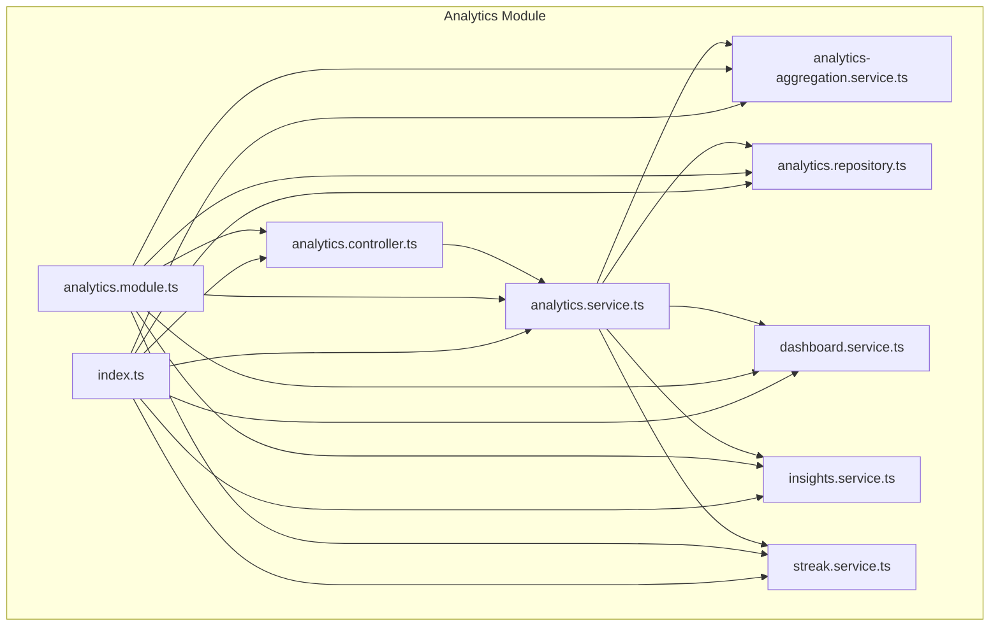
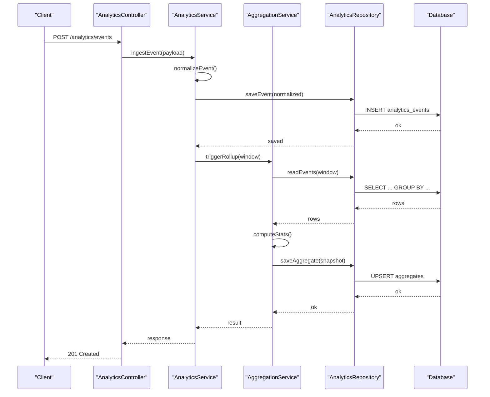
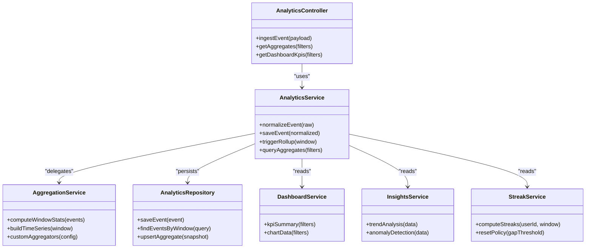
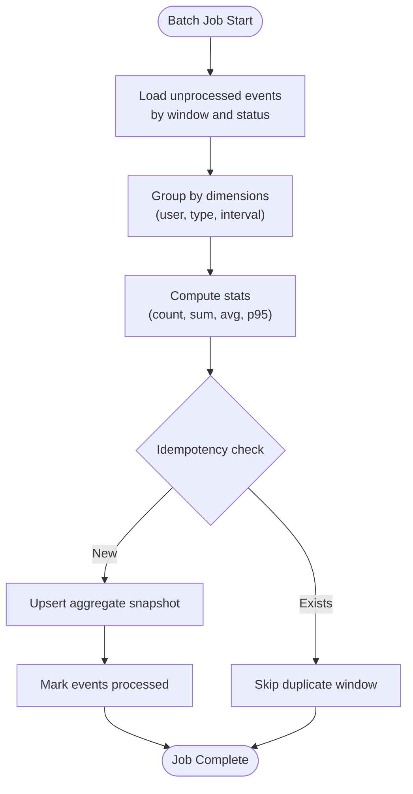
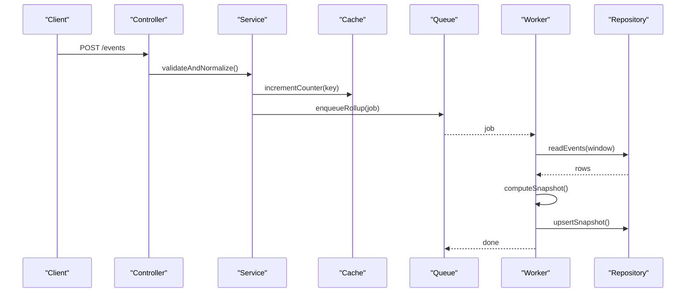

# Data Aggregation Engine

<cite>
**Referenced Files in This Document**
- [analytics.controller.ts](file://apps/backend/src/analytics/analytics.controller.ts)
- [analytics.service.ts](file://apps/backend/src/analytics/analytics.service.ts)
- [analytics-aggregation.service.ts](file://apps/backend/src/analytics/analytics-aggregation.service.ts)
- [analytics.repository.ts](file://apps/backend/src/analytics/analytics.repository.ts)
- [dashboard.service.ts](file://apps/backend/src/analytics/dashboard.service.ts)
- [insights.service.ts](file://apps/backend/src/analytics/insights.service.ts)
- [streak.service.ts](file://apps/backend/src/analytics/streak.service.ts)
- [analytics.module.ts](file://apps/backend/src/analytics/analytics.module.ts)
- [index.ts](file://apps/backend/src/analytics/index.ts)
- [dto](file://apps/backend/src/analytics/dto)
- [schema.prisma](file://apps/backend/prisma/schema.prisma)
- [app.module.ts](file://apps/backend/src/app.module.ts)
- [main.ts](file://apps/backend/src/main.ts)
</cite>

## Table of Contents
1. [Introduction](#introduction)
2. [Project Structure](#project-structure)
3. [Core Components](#core-components)
4. [Architecture Overview](#architecture-overview)
5. [Detailed Component Analysis](#detailed-component-analysis)
6. [Dependency Analysis](#dependency-analysis)
7. [Performance Considerations](#performance-considerations)
8. [Troubleshooting Guide](#troubleshooting-guide)
9. [Conclusion](#conclusion)
10. [Appendices](#appendices)

## Introduction
This document explains the data aggregation engine that transforms raw analytics events into meaningful insights. It covers how raw data is collected, normalized, aggregated (both batch and real-time), and exported as reports or dashboard metrics. It also documents statistical computations, custom aggregation functions, and integration patterns with the data warehouse layer via Prisma repositories.

## Project Structure
The analytics subsystem lives under apps/backend/src/analytics and exposes HTTP endpoints through a NestJS controller, business logic via services, and data access through a repository. The module wires dependencies and exports public APIs.

**Diagram sources**
- [analytics.controller.ts](file://apps/backend/src/analytics/analytics.controller.ts)
- [analytics.service.ts](file://apps/backend/src/analytics/analytics.service.ts)
- [analytics-aggregation.service.ts](file://apps/backend/src/analytics/analytics-aggregation.service.ts)
- [analytics.repository.ts](file://apps/backend/src/analytics/analytics.repository.ts)
- [dashboard.service.ts](file://apps/backend/src/analytics/dashboard.service.ts)
- [insights.service.ts](file://apps/backend/src/analytics/insights.service.ts)
- [streak.service.ts](file://apps/backend/src/analytics/streak.service.ts)
- [analytics.module.ts](file://apps/backend/src/analytics/analytics.module.ts)
- [index.ts](file://apps/backend/src/analytics/index.ts)

**Section sources**
- [analytics.controller.ts](file://apps/backend/src/analytics/analytics.controller.ts)
- [analytics.service.ts](file://apps/backend/src/analytics/analytics.service.ts)
- [analytics-aggregation.service.ts](file://apps/backend/src/analytics/analytics-aggregation.service.ts)
- [analytics.repository.ts](file://apps/backend/src/analytics/analytics.repository.ts)
- [dashboard.service.ts](file://apps/backend/src/analytics/dashboard.service.ts)
- [insights.service.ts](file://apps/backend/src/analytics/insights.service.ts)
- [streak.service.ts](file://apps/backend/src/analytics/streak.service.ts)
- [analytics.module.ts](file://apps/backend/src/analytics/analytics.module.ts)
- [index.ts](file://apps/backend/src/analytics/index.ts)

## Core Components
- Controller: Exposes REST endpoints for ingesting analytics events and querying aggregated results.
- Service: Orchestrates ingestion, normalization, and aggregation workflows; coordinates between repository and specialized services.
- Aggregation Service: Implements core aggregation algorithms (time-series rollups, counts, rates, percentiles).
- Repository: Encapsulates Prisma queries for reading/writing analytics events and precomputed aggregates.
- Dashboard Service: Builds dashboard-ready summaries and KPIs from aggregated data.
- Insights Service: Computes higher-level insights (trends, anomalies, correlations).
- Streak Service: Tracks consecutive activity streaks based on normalized event timelines.

Key responsibilities:
- Normalize incoming events to a canonical schema.
- Compute rolling windows and periodic snapshots.
- Provide query surfaces for dashboards and reports.
- Support export of aggregated datasets.

**Section sources**
- [analytics.controller.ts](file://apps/backend/src/analytics/analytics.controller.ts)
- [analytics.service.ts](file://apps/backend/src/analytics/analytics.service.ts)
- [analytics-aggregation.service.ts](file://apps/backend/src/analytics/analytics-aggregation.service.ts)
- [analytics.repository.ts](file://apps/backend/src/analytics/analytics.repository.ts)
- [dashboard.service.ts](file://apps/backend/src/analytics/dashboard.service.ts)
- [insights.service.ts](file://apps/backend/src/analytics/insights.service.ts)
- [streak.service.ts](file://apps/backend/src/analytics/streak.service.ts)

## Architecture Overview
The system follows a layered architecture:
- API Layer: Controller receives requests and validates DTOs.
- Application Layer: Services implement use cases and orchestrate flows.
- Domain Layer: Aggregation and insight computation live here.
- Infrastructure Layer: Repository abstracts database operations using Prisma.

**Diagram sources**
- [analytics.controller.ts](file://apps/backend/src/analytics/analytics.controller.ts)
- [analytics.service.ts](file://apps/backend/src/analytics/analytics.service.ts)
- [analytics-aggregation.service.ts](file://apps/backend/src/analytics/analytics-aggregation.service.ts)
- [analytics.repository.ts](file://apps/backend/src/analytics/analytics.repository.ts)
- [schema.prisma](file://apps/backend/prisma/schema.prisma)

## Detailed Component Analysis

### Analytics Controller
- Responsibilities:
  - Define routes for event ingestion and aggregated queries.
  - Validate request payloads against DTOs.
  - Return standardized responses.
- Typical endpoints:
  - Ingest analytics events.
  - Query time-series aggregates by window and filters.
  - Retrieve dashboard KPIs and insights.

**Section sources**
- [analytics.controller.ts](file://apps/backend/src/analytics/analytics.controller.ts)
- [dto](file://apps/backend/src/analytics/dto)

### Analytics Service
- Responsibilities:
  - Orchestrate event ingestion pipeline.
  - Normalize raw events to canonical shape.
  - Trigger aggregation jobs (real-time or scheduled).
  - Compose responses for dashboards and reports.
- Key flows:
  - Event normalization and validation.
  - Batch snapshot creation.
  - Real-time incremental updates.

**Section sources**
- [analytics.service.ts](file://apps/backend/src/analytics/analytics.service.ts)

### Aggregation Service
- Responsibilities:
  - Implement statistical computations (counts, sums, averages, percentiles, rates).
  - Build time-series windows (minute/hour/day/month).
  - Maintain idempotent rollups and deduplicate overlapping windows.
- Custom aggregation functions:
  - Weighted averages across event types.
  - Session-based aggregations (e.g., per-session duration).
  - Trend detection helpers (moving averages, growth rates).

**Section sources**
- [analytics-aggregation.service.ts](file://apps/backend/src/analytics/analytics-aggregation.service.ts)

### Analytics Repository
- Responsibilities:
  - Abstract Prisma queries for analytics events and aggregates.
  - Provide efficient bulk reads for rollups.
  - Upsert precomputed aggregates to minimize query latency.
- Patterns:
  - Group-by queries with indexed timestamps.
  - Partitioning strategies by tenant/user/time ranges.
  - Read replicas for heavy analytical queries.

**Section sources**
- [analytics.repository.ts](file://apps/backend/src/analytics/analytics.repository.ts)
- [schema.prisma](file://apps/backend/prisma/schema.prisma)

### Dashboard Service
- Responsibilities:
  - Aggregate KPIs for dashboard widgets.
  - Cache hot metrics and serve low-latency responses.
  - Format outputs for charting libraries.

**Section sources**
- [dashboard.service.ts](file://apps/backend/src/analytics/dashboard.service.ts)

### Insights Service
- Responsibilities:
  - Compute derived insights such as trends, anomalies, and correlations.
  - Surface actionable recommendations based on thresholds.

**Section sources**
- [insights.service.ts](file://apps/backend/src/analytics/insights.service.ts)

### Streak Service
- Responsibilities:
  - Track consecutive days/hours of activity.
  - Reset streaks on gaps beyond configured thresholds.
  - Provide streak metadata for gamification features.

**Section sources**
- [streak.service.ts](file://apps/backend/src/analytics/streak.service.ts)

### Module and Index
- Module wires controllers, services, and repositories.
- Index exports public APIs for other modules.

**Section sources**
- [analytics.module.ts](file://apps/backend/src/analytics/analytics.module.ts)
- [index.ts](file://apps/backend/src/analytics/index.ts)

## Dependency Analysis
High-level dependency relationships within the analytics module:

**Diagram sources**
- [analytics.controller.ts](file://apps/backend/src/analytics/analytics.controller.ts)
- [analytics.service.ts](file://apps/backend/src/analytics/analytics.service.ts)
- [analytics-aggregation.service.ts](file://apps/backend/src/analytics/analytics-aggregation.service.ts)
- [analytics.repository.ts](file://apps/backend/src/analytics/analytics.repository.ts)
- [dashboard.service.ts](file://apps/backend/src/analytics/dashboard.service.ts)
- [insights.service.ts](file://apps/backend/src/analytics/insights.service.ts)
- [streak.service.ts](file://apps/backend/src/analytics/streak.service.ts)

**Section sources**
- [analytics.controller.ts](file://apps/backend/src/analytics/analytics.controller.ts)
- [analytics.service.ts](file://apps/backend/src/analytics/analytics.service.ts)
- [analytics-aggregation.service.ts](file://apps/backend/src/analytics/analytics-aggregation.service.ts)
- [analytics.repository.ts](file://apps/backend/src/analytics/analytics.repository.ts)
- [dashboard.service.ts](file://apps/backend/src/analytics/dashboard.service.ts)
- [insights.service.ts](file://apps/backend/src/analytics/insights.service.ts)
- [streak.service.ts](file://apps/backend/src/analytics/streak.service.ts)

## Performance Considerations
- Time-window indexing: Ensure timestamp indexes on analytics events to speed up group-by queries.
- Precomputation: Upsert aggregate snapshots to reduce repeated heavy queries.
- Batch processing: Use bulk inserts and upserts for high-throughput ingestion.
- Caching: Cache dashboard KPIs and frequently accessed aggregates with short TTLs.
- Backpressure: Apply rate limiting and queueing for ingestion spikes.
- Partitioning: Partition large tables by date or user to improve query performance.
- Read replicas: Offload analytical queries to read replicas.

[No sources needed since this section provides general guidance]

## Troubleshooting Guide
Common issues and resolutions:
- Missing or malformed events: Validate DTOs at the controller layer and log rejected payloads.
- Duplicate rollups: Ensure idempotency keys and upsert semantics in the repository.
- Slow queries: Add composite indexes on (tenant_id, user_id, timestamp) and review EXPLAIN plans.
- Streak resets unexpectedly: Verify gap thresholds and timezone handling in the streak service.
- Dashboard inconsistencies: Re-run backfills and reconcile snapshots with source events.

**Section sources**
- [analytics.controller.ts](file://apps/backend/src/analytics/analytics.controller.ts)
- [analytics.service.ts](file://apps/backend/src/analytics/analytics.service.ts)
- [analytics-aggregation.service.ts](file://apps/backend/src/analytics/analytics-aggregation.service.ts)
- [analytics.repository.ts](file://apps/backend/src/analytics/analytics.repository.ts)
- [dashboard.service.ts](file://apps/backend/src/analytics/dashboard.service.ts)
- [insights.service.ts](file://apps/backend/src/analytics/insights.service.ts)
- [streak.service.ts](file://apps/backend/src/analytics/streak.service.ts)

## Conclusion
The analytics aggregation engine provides a robust foundation for collecting, normalizing, and transforming raw events into actionable insights. Its modular design supports both real-time and batch pipelines, integrates cleanly with the data warehouse via Prisma, and offers extensible aggregation functions for custom reporting needs.

[No sources needed since this section summarizes without analyzing specific files]

## Appendices

### Batch Processing Workflows
- Ingestion: Events are persisted immediately for durability.
- Rollup: Periodic jobs compute windowed aggregates and upsert snapshots.
- Backfill: Historical reprocessing ensures consistency after schema changes.

**Diagram sources**
- [analytics-aggregation.service.ts](file://apps/backend/src/analytics/analytics-aggregation.service.ts)
- [analytics.repository.ts](file://apps/backend/src/analytics/analytics.repository.ts)

### Real-Time Aggregation Pipelines
- Event arrives at controller and is validated.
- Normalization produces canonical event shape.
- Immediate lightweight counters update in-memory or cache.
- Asynchronous rollup job persists durable snapshots.

**Diagram sources**
- [analytics.controller.ts](file://apps/backend/src/analytics/analytics.controller.ts)
- [analytics.service.ts](file://apps/backend/src/analytics/analytics.service.ts)
- [analytics-aggregation.service.ts](file://apps/backend/src/analytics/analytics-aggregation.service.ts)
- [analytics.repository.ts](file://apps/backend/src/analytics/analytics.repository.ts)

### Data Warehouse Integration Patterns
- Source of truth: Raw analytics events table.
- Aggregated layer: Snapshot tables for fast dashboard queries.
- ETL strategy: Scheduled rollups and backfills maintain consistency.
- Schema evolution: Versioned migrations ensure backward compatibility.

**Section sources**
- [schema.prisma](file://apps/backend/prisma/schema.prisma)
- [analytics.repository.ts](file://apps/backend/src/analytics/analytics.repository.ts)

### Statistical Computations and Report Generation
- Metrics: Counts, sums, averages, percentiles, growth rates.
- Time series: Minute/hour/day/month windows with alignment.
- Reports: Exportable JSON/CSV with filters and pagination.

**Section sources**
- [analytics-aggregation.service.ts](file://apps/backend/src/analytics/analytics-aggregation.service.ts)
- [dashboard.service.ts](file://apps/backend/src/analytics/dashboard.service.ts)

### Custom Aggregation Functions and Data Export
- Custom functions: Weighted averages, session-based metrics, trend helpers.
- Export capabilities: Filtered datasets, time-range selection, format options.

**Section sources**
- [analytics-aggregation.service.ts](file://apps/backend/src/analytics/analytics-aggregation.service.ts)
- [analytics.service.ts](file://apps/backend/src/analytics/analytics.service.ts)

### Entry Points and Bootstrapping
- Application bootstrap initializes modules and middleware.
- Analytics module registers controllers and services.

**Section sources**
- [main.ts](file://apps/backend/src/main.ts)
- [app.module.ts](file://apps/backend/src/app.module.ts)
- [analytics.module.ts](file://apps/backend/src/analytics/analytics.module.ts)