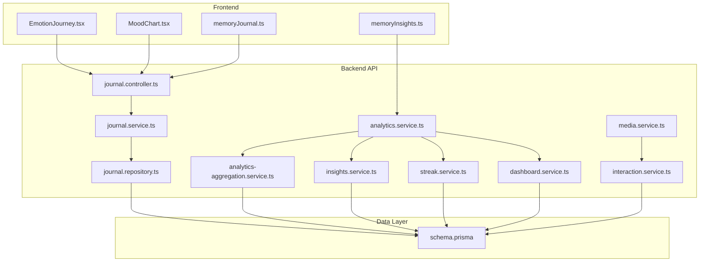
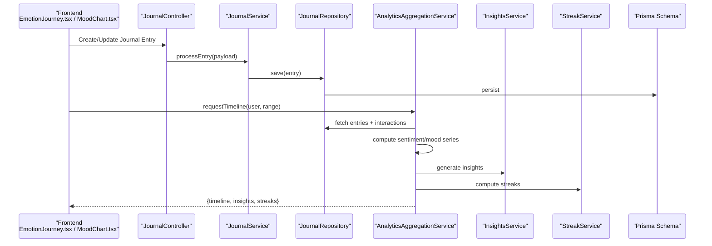
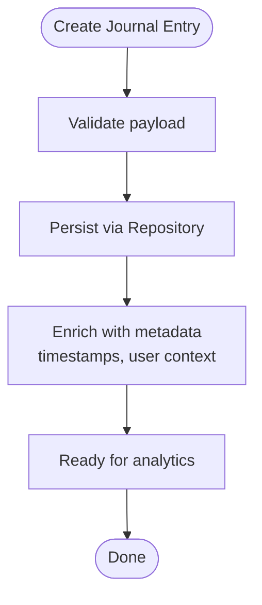
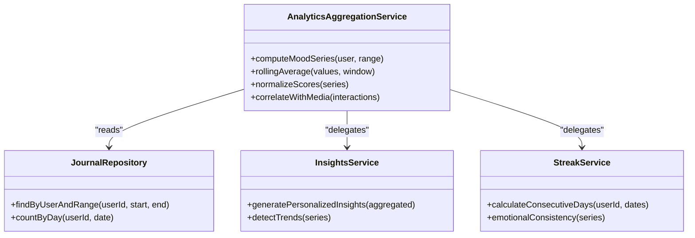
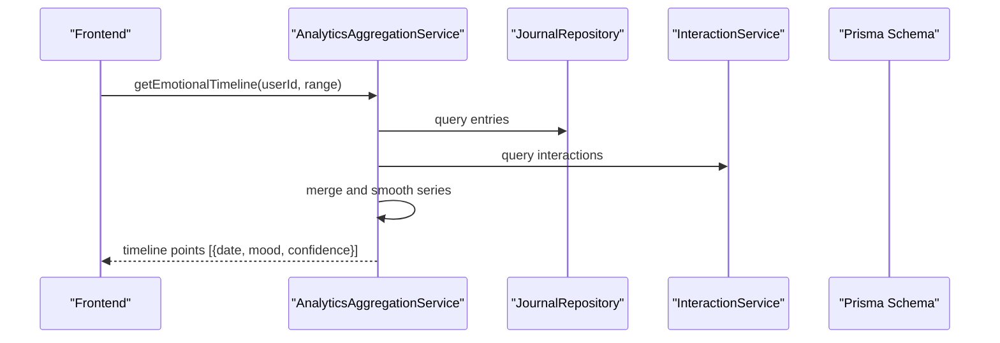
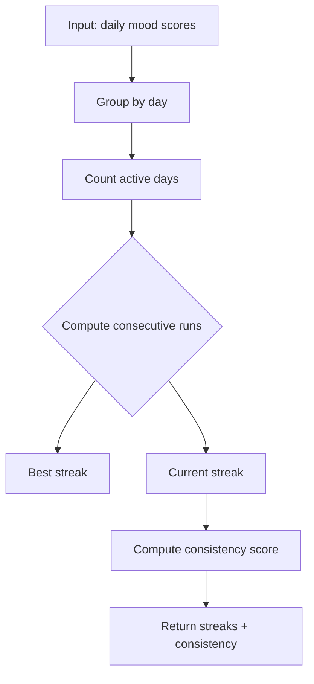
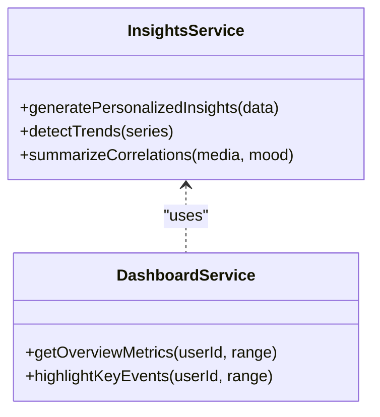
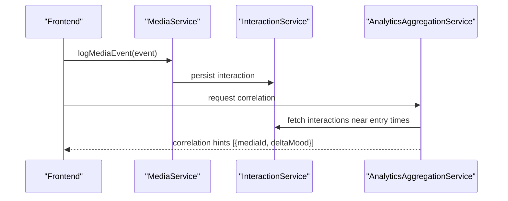
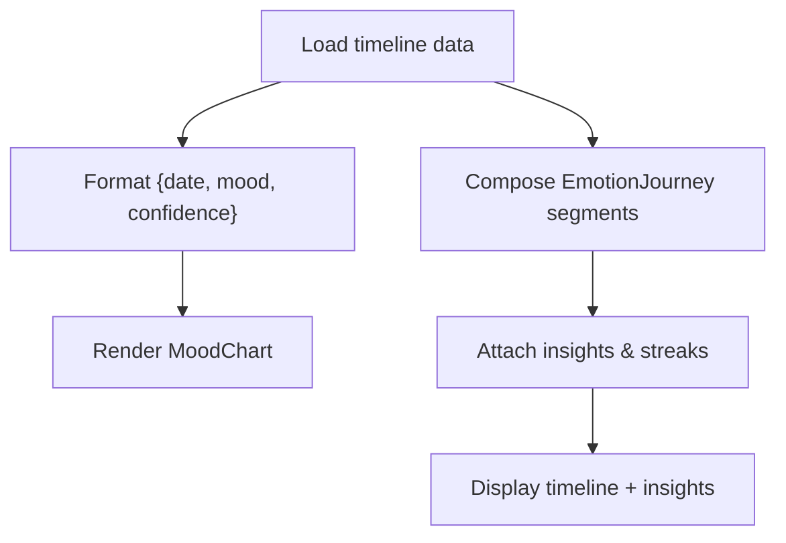
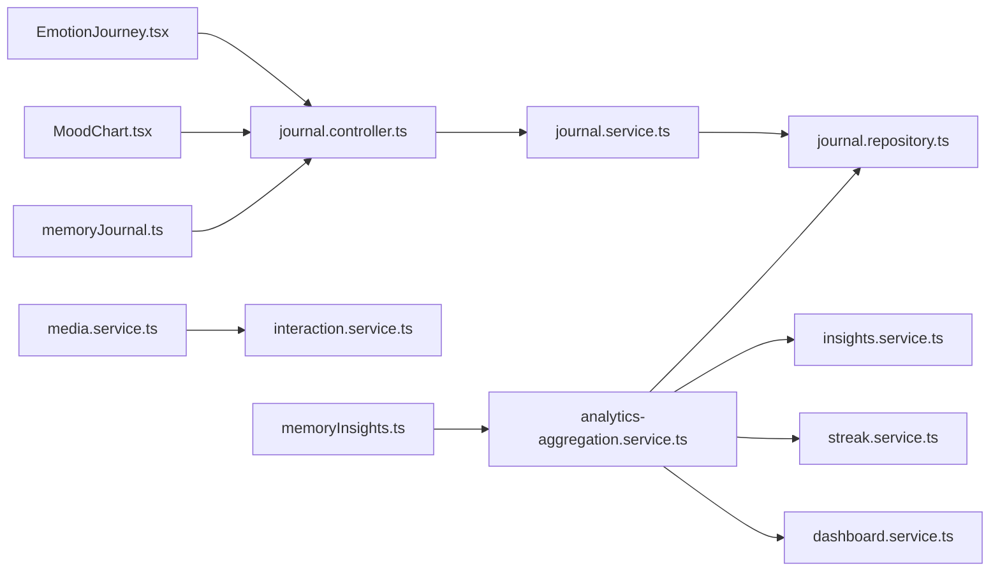

# Emotional Journey Mapping

<cite>
**Referenced Files in This Document**
- [journal.service.ts](file://apps/backend/src/journal/journal.service.ts)
- [journal-statistics.service.ts](file://apps/backend/src/journal/journal-statistics.service.ts)
- [journal.controller.ts](file://apps/backend/src/journal/journal.controller.ts)
- [journal.module.ts](file://apps/backend/src/journal/journal.module.ts)
- [journal.repository.ts](file://apps/backend/src/journal/journal.repository.ts)
- [timeline-event-factory.ts](file://apps/backend/src/journal/timeline-event-factory.ts)
- [prompt.service.ts](file://apps/backend/src/journal/prompt.service.ts)
- [analytics-aggregation.service.ts](file://apps/backend/src/analytics/analytics-aggregation.service.ts)
- [analytics.service.ts](file://apps/backend/src/analytics/analytics.service.ts)
- [insights.service.ts](file://apps/backend/src/analytics/insights.service.ts)
- [streak.service.ts](file://apps/backend/src/analytics/streak.service.ts)
- [dashboard.service.ts](file://apps/backend/src/analytics/dashboard.service.ts)
- [emotion-journey.component.tsx](file://src/components/media/EmotionJourney.tsx)
- [mood-chart.component.tsx](file://src/components/journal/MoodChart.tsx)
- [memory-insights.ts](file://src/lib/memoryInsights.ts)
- [memory-journal.ts](file://src/lib/memoryJournal.ts)
- [media.service.ts](file://apps/backend/src/media/media.service.ts)
- [interaction.service.ts](file://apps/backend/src/interaction/interaction.service.ts)
- [schema.prisma](file://apps/backend/prisma/schema.prisma)
</cite>

## Table of Contents
1. Introduction
2. Project Structure
3. Core Components
4. Architecture Overview
5. Detailed Component Analysis
6. Dependency Analysis
7. Performance Considerations
8. Troubleshooting Guide
9. Conclusion

## Introduction
This document explains the emotional journey mapping system that tracks users’ emotional states through journal entries and media interactions. It covers sentiment analysis approaches, mood progression tracking, emotional timeline generation, streak calculations, emotional consistency metrics, and personalized insights. It also provides examples of how emotional data is processed and prepared for visualization.

## Project Structure
The emotional journey spans backend services (journaling, analytics, media, interaction), a Prisma schema for persistence, and frontend components for visualization and user interaction. Key areas:
- Journaling: capture, store, and analyze journal content to infer sentiment and mood.
- Analytics: aggregate signals over time, compute streaks, consistency, and insights.
- Media and Interaction: correlate media consumption with emotional shifts.
- Frontend: render timelines, mood charts, and insight cards.

**Diagram sources**
- [journal.controller.ts](file://apps/backend/src/journal/journal.controller.ts)
- [journal.service.ts](file://apps/backend/src/journal/journal.service.ts)
- [journal.repository.ts](file://apps/backend/src/journal/journal.repository.ts)
- [analytics.service.ts](file://apps/backend/src/analytics/analytics.service.ts)
- [analytics-aggregation.service.ts](file://apps/backend/src/analytics/analytics-aggregation.service.ts)
- [insights.service.ts](file://apps/backend/src/analytics/insights.service.ts)
- [streak.service.ts](file://apps/backend/src/analytics/streak.service.ts)
- [dashboard.service.ts](file://apps/backend/src/analytics/dashboard.service.ts)
- [media.service.ts](file://apps/backend/src/media/media.service.ts)
- [interaction.service.ts](file://apps/backend/src/interaction/interaction.service.ts)
- [schema.prisma](file://apps/backend/prisma/schema.prisma)
- [emotion-journey.component.tsx](file://src/components/media/EmotionJourney.tsx)
- [mood-chart.component.tsx](file://src/components/journal/MoodChart.tsx)
- [memory-insights.ts](file://src/lib/memoryInsights.ts)
- [memory-journal.ts](file://src/lib/memoryJournal.ts)

**Section sources**
- [journal.controller.ts](file://apps/backend/src/journal/journal.controller.ts)
- [journal.service.ts](file://apps/backend/src/journal/journal.service.ts)
- [journal.repository.ts](file://apps/backend/src/journal/journal.repository.ts)
- [analytics.service.ts](file://apps/backend/src/analytics/analytics.service.ts)
- [analytics-aggregation.service.ts](file://apps/backend/src/analytics/analytics-aggregation.service.ts)
- [insights.service.ts](file://apps/backend/src/analytics/insights.service.ts)
- [streak.service.ts](file://apps/backend/src/analytics/streak.service.ts)
- [dashboard.service.ts](file://apps/backend/src/analytics/dashboard.service.ts)
- [media.service.ts](file://apps/backend/src/media/media.service.ts)
- [interaction.service.ts](file://apps/backend/src/interaction/interaction.service.ts)
- [schema.prisma](file://apps/backend/prisma/schema.prisma)
- [emotion-journey.component.tsx](file://src/components/media/EmotionJourney.tsx)
- [mood-chart.component.tsx](file://src/components/journal/MoodChart.tsx)
- [memory-insights.ts](file://src/lib/memoryInsights.ts)
- [memory-journal.ts](file://src/lib/memoryJournal.ts)

## Core Components
- Journaling pipeline: captures entries, enriches them with prompts, persists via repository, and exposes endpoints for clients.
- Analytics aggregation: computes rolling metrics, trends, and derived signals from journal and interaction data.
- Insights engine: synthesizes personalized insights based on aggregated metrics and patterns.
- Streak service: calculates consecutive activity days and related emotional continuity.
- Dashboard service: aggregates key indicators for quick overview.
- Media and interaction services: correlate media events with emotional changes.
- Frontend visualizations: MoodChart and EmotionJourney render timelines and summaries.

**Section sources**
- [journal.service.ts](file://apps/backend/src/journal/journal.service.ts)
- [journal-statistics.service.ts](file://apps/backend/src/journal/journal-statistics.service.ts)
- [analytics-aggregation.service.ts](file://apps/backend/src/analytics/analytics-aggregation.service.ts)
- [insights.service.ts](file://apps/backend/src/analytics/insights.service.ts)
- [streak.service.ts](file://apps/backend/src/analytics/streak.service.ts)
- [dashboard.service.ts](file://apps/backend/src/analytics/dashboard.service.ts)
- [emotion-journey.component.tsx](file://src/components/media/EmotionJourney.tsx)
- [mood-chart.component.tsx](file://src/components/journal/MoodChart.tsx)

## Architecture Overview
The emotional journey flows from user actions (journaling, media interactions) into backend services that persist and analyze data, then return structured results to the frontend for visualization.

**Diagram sources**
- [journal.controller.ts](file://apps/backend/src/journal/journal.controller.ts)
- [journal.service.ts](file://apps/backend/src/journal/journal.service.ts)
- [journal.repository.ts](file://apps/backend/src/journal/journal.repository.ts)
- [analytics-aggregation.service.ts](file://apps/backend/src/analytics/analytics-aggregation.service.ts)
- [insights.service.ts](file://apps/backend/src/analytics/insights.service.ts)
- [streak.service.ts](file://apps/backend/src/analytics/streak.service.ts)
- [schema.prisma](file://apps/backend/prisma/schema.prisma)

## Detailed Component Analysis

### Journaling Pipeline and Sentiment Inference
- Captures journal entries and optional prompts to guide reflection.
- Persists entries and associates them with timestamps and user context.
- Prepares data for downstream sentiment and mood computation by normalizing text fields and linking to media interactions when available.

**Diagram sources**
- [journal.controller.ts](file://apps/backend/src/journal/journal.controller.ts)
- [journal.service.ts](file://apps/backend/src/journal/journal.service.ts)
- [journal.repository.ts](file://apps/backend/src/journal/journal.repository.ts)

**Section sources**
- [journal.service.ts](file://apps/backend/src/journal/journal.service.ts)
- [journal.repository.ts](file://apps/backend/src/journal/journal.repository.ts)
- [prompt.service.ts](file://apps/backend/src/journal/prompt.service.ts)

### Analytics Aggregation and Mood Progression
- Aggregates journal and interaction signals over configurable windows.
- Computes mood series using rolling averages and trend smoothing.
- Produces normalized scores suitable for visualization and comparison across periods.

**Diagram sources**
- [analytics-aggregation.service.ts](file://apps/backend/src/analytics/analytics-aggregation.service.ts)
- [journal.repository.ts](file://apps/backend/src/journal/journal.repository.ts)
- [insights.service.ts](file://apps/backend/src/analytics/insights.service.ts)
- [streak.service.ts](file://apps/backend/src/analytics/streak.service.ts)

**Section sources**
- [analytics-aggregation.service.ts](file://apps/backend/src/analytics/analytics-aggregation.service.ts)
- [analytics.service.ts](file://apps/backend/src/analytics/analytics.service.ts)

### Emotional Timeline Generation
- Builds a chronological sequence of emotional states aligned with journal entries and media interactions.
- Applies smoothing and gap-filling strategies to ensure coherent timelines.
- Exposes endpoints or methods for frontend rendering.

**Diagram sources**
- [analytics-aggregation.service.ts](file://apps/backend/src/analytics/analytics-aggregation.service.ts)
- [journal.repository.ts](file://apps/backend/src/journal/journal.repository.ts)
- [interaction.service.ts](file://apps/backend/src/interaction/interaction.service.ts)
- [schema.prisma](file://apps/backend/prisma/schema.prisma)

**Section sources**
- [analytics-aggregation.service.ts](file://apps/backend/src/analytics/analytics-aggregation.service.ts)
- [journal.repository.ts](file://apps/backend/src/journal/journal.repository.ts)
- [interaction.service.ts](file://apps/backend/src/interaction/interaction.service.ts)

### Streak Calculations and Emotional Consistency
- Calculates consecutive days of journaling or meaningful emotional activity.
- Derives consistency metrics by measuring variance and stability of mood scores over time.
- Supports personalized insights about habit strength and emotional resilience.

**Diagram sources**
- [streak.service.ts](file://apps/backend/src/analytics/streak.service.ts)

**Section sources**
- [streak.service.ts](file://apps/backend/src/analytics/streak.service.ts)

### Personalized Insights Generation
- Synthesizes aggregated metrics into actionable insights.
- Detects trends, notable shifts, and correlations between media interactions and mood changes.
- Provides narrative summaries and recommendations for reflection.

**Diagram sources**
- [insights.service.ts](file://apps/backend/src/analytics/insights.service.ts)
- [dashboard.service.ts](file://apps/backend/src/analytics/dashboard.service.ts)

**Section sources**
- [insights.service.ts](file://apps/backend/src/analytics/insights.service.ts)
- [dashboard.service.ts](file://apps/backend/src/analytics/dashboard.service.ts)

### Media Interactions and Emotional Correlation
- Tracks media consumption events and correlates them with subsequent mood changes.
- Uses temporal windows to associate media touchpoints with journal reflections.
- Enhances timeline accuracy by weighting significant media moments.

**Diagram sources**
- [media.service.ts](file://apps/backend/src/media/media.service.ts)
- [interaction.service.ts](file://apps/backend/src/interaction/interaction.service.ts)
- [analytics-aggregation.service.ts](file://apps/backend/src/analytics/analytics-aggregation.service.ts)

**Section sources**
- [media.service.ts](file://apps/backend/src/media/media.service.ts)
- [interaction.service.ts](file://apps/backend/src/interaction/interaction.service.ts)
- [analytics-aggregation.service.ts](file://apps/backend/src/analytics/analytics-aggregation.service.ts)

### Frontend Visualization Preparation
- MoodChart prepares arrays of dates and mood values for chart rendering.
- EmotionJourney composes timeline segments, highlights key moments, and integrates insights.
- memoryInsights and memoryJournal utilities format data for consistent UI consumption.

**Diagram sources**
- [mood-chart.component.tsx](file://src/components/journal/MoodChart.tsx)
- [emotion-journey.component.tsx](file://src/components/media/EmotionJourney.tsx)
- [memory-insights.ts](file://src/lib/memoryInsights.ts)
- [memory-journal.ts](file://src/lib/memoryJournal.ts)

**Section sources**
- [mood-chart.component.tsx](file://src/components/journal/MoodChart.tsx)
- [emotion-journey.component.tsx](file://src/components/media/EmotionJourney.tsx)
- [memory-insights.ts](file://src/lib/memoryInsights.ts)
- [memory-journal.ts](file://src/lib/memoryJournal.ts)

## Dependency Analysis
The emotional journey system relies on clear separation between controllers, services, repositories, and shared analytics modules. Dependencies are primarily unidirectional: controllers delegate to services; services use repositories and analytics utilities; frontend consumes APIs and local utilities.

**Diagram sources**
- [journal.controller.ts](file://apps/backend/src/journal/journal.controller.ts)
- [journal.service.ts](file://apps/backend/src/journal/journal.service.ts)
- [journal.repository.ts](file://apps/backend/src/journal/journal.repository.ts)
- [analytics-aggregation.service.ts](file://apps/backend/src/analytics/analytics-aggregation.service.ts)
- [insights.service.ts](file://apps/backend/src/analytics/insights.service.ts)
- [streak.service.ts](file://apps/backend/src/analytics/streak.service.ts)
- [dashboard.service.ts](file://apps/backend/src/analytics/dashboard.service.ts)
- [media.service.ts](file://apps/backend/src/media/media.service.ts)
- [interaction.service.ts](file://apps/backend/src/interaction/interaction.service.ts)
- [emotion-journey.component.tsx](file://src/components/media/EmotionJourney.tsx)
- [mood-chart.component.tsx](file://src/components/journal/MoodChart.tsx)
- [memory-insights.ts](file://src/lib/memoryInsights.ts)
- [memory-journal.ts](file://src/lib/memoryJournal.ts)

**Section sources**
- [journal.controller.ts](file://apps/backend/src/journal/journal.controller.ts)
- [journal.service.ts](file://apps/backend/src/journal/journal.service.ts)
- [journal.repository.ts](file://apps/backend/src/journal/journal.repository.ts)
- [analytics-aggregation.service.ts](file://apps/backend/src/analytics/analytics-aggregation.service.ts)
- [insights.service.ts](file://apps/backend/src/analytics/insights.service.ts)
- [streak.service.ts](file://apps/backend/src/analytics/streak.service.ts)
- [dashboard.service.ts](file://apps/backend/src/analytics/dashboard.service.ts)
- [media.service.ts](file://apps/backend/src/media/media.service.ts)
- [interaction.service.ts](file://apps/backend/src/interaction/interaction.service.ts)
- [emotion-journey.component.tsx](file://src/components/media/EmotionJourney.tsx)
- [mood-chart.component.tsx](file://src/components/journal/MoodChart.tsx)
- [memory-insights.ts](file://src/lib/memoryInsights.ts)
- [memory-journal.ts](file://src/lib/memoryJournal.ts)

## Performance Considerations
- Batch queries: Aggregate journal and interaction data in single requests to reduce round-trips.
- Caching: Cache computed mood series and insights for common ranges to avoid recomputation.
- Windowed processing: Use sliding windows for rolling averages to keep computations linear in data size.
- Lazy loading: Load timeline segments progressively for large datasets.
- Indexing: Ensure database indexes on user IDs and timestamps for efficient filtering.

[No sources needed since this section provides general guidance]

## Troubleshooting Guide
- Missing data gaps: Verify journal entries and interactions are persisted with correct timestamps.
- Inconsistent mood scores: Check normalization and smoothing parameters in aggregation logic.
- Streak breaks: Confirm consecutive day detection accounts for timezone and missing days.
- Insight quality: Review correlation windows and thresholds used to link media events to mood shifts.
- Frontend rendering issues: Validate data shape expected by MoodChart and EmotionJourney.

**Section sources**
- [journal.repository.ts](file://apps/backend/src/journal/journal.repository.ts)
- [analytics-aggregation.service.ts](file://apps/backend/src/analytics/analytics-aggregation.service.ts)
- [streak.service.ts](file://apps/backend/src/analytics/streak.service.ts)
- [mood-chart.component.tsx](file://src/components/journal/MoodChart.tsx)
- [emotion-journey.component.tsx](file://src/components/media/EmotionJourney.tsx)

## Conclusion
The emotional journey mapping system integrates journaling, media interactions, and analytics to produce robust mood timelines, streaks, and personalized insights. By separating concerns across controllers, services, repositories, and frontend components, it supports scalable computation and flexible visualization. Proper indexing, caching, and windowed processing ensure performance while maintaining accuracy in emotional tracking and insight generation.