# Performance Metrics & Monitoring

<cite>
**Referenced Files in This Document**
- [metrics.service.ts](file://apps/backend/src/observability/metrics.service.ts)
- [metrics.controller.ts](file://apps/backend/src/observability/metrics.controller.ts)
- [request-metrics.middleware.ts](file://apps/backend/src/observability/request-metrics.middleware.ts)
- [performance.service.ts](file://apps/backend/src/observability/performance.service.ts)
- [health-metrics.service.ts](file://apps/backend/src/observability/health-metrics.service.ts)
- [tracing.service.ts](file://apps/backend/src/observability/tracing.service.ts)
- [logging.service.ts](file://apps/backend/src/observability/logging.service.ts)
- [health.controller.ts](file://apps/backend/src/health/health.controller.ts)
- [prisma-health.indicator.ts](file://apps/backend/src/health/prisma-health.indicator.ts)
- [load.yml](file://apps/backend/loadtests/artillery/load.yml)
- [smoke.yml](file://apps/backend/loadtests/artillery/smoke.yml)
- [load.js](file://apps/backend/loadtests/k6/load.js)
- [smoke.js](file://apps/backend/loadtests/k6/smoke.js)
- [soak.js](file://apps/backend/loadtests/k6/soak.js)
- [spike.js](file://apps/backend/loadtests/k6/spike.js)
- [stress.js](file://apps/backend/loadtests/k6/stress.js)
- [database-optimization.service.ts](file://apps/backend/src/hardening/database-optimization.service.ts)
- [query-analysis.service.ts](file://apps/backend/src/hardening/query-analysis.service.ts)
- [performance-audit.service.ts](file://apps/backend/src/hardening/performance-audit.service.ts)
- [rate-limit-audit.service.ts](file://apps/backend/src/hardening/rate-limit-audit.service.ts)
- [app.bootstrap.ts](file://apps/backend/src/app.bootstrap.ts)
- [main.ts](file://apps/backend/src/main.ts)
</cite>

## Table of Contents
1. [Introduction](#introduction)
2. [Project Structure](#project-structure)
3. [Core Components](#core-components)
4. [Architecture Overview](#architecture-overview)
5. [Detailed Component Analysis](#detailed-component-analysis)
6. [Dependency Analysis](#dependency-analysis)
7. [Performance Considerations](#performance-considerations)
8. [Troubleshooting Guide](#troubleshooting-guide)
9. [Conclusion](#conclusion)
10. [Appendices](#appendices)

## Introduction
This document explains the performance metrics and monitoring systems implemented in the backend application. It covers how application performance is tracked, how resource utilization is monitored, and which system health indicators are exposed. It also documents metrics collection strategies, benchmarking workflows, optimization recommendations, and examples for custom metric definitions and alerting configurations.

## Project Structure
The observability and performance capabilities are primarily located under the backend’s observability module, with supporting hardening utilities and load tests. Health endpoints are provided by a dedicated health module. Load testing scripts exist for both Artillery and k6 to validate performance characteristics.

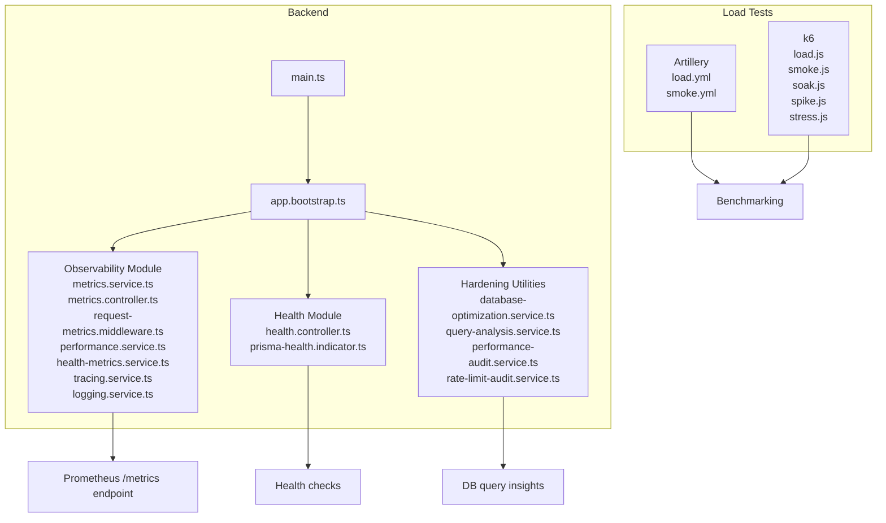

**Diagram sources**
- [main.ts](file://apps/backend/src/main.ts)
- [app.bootstrap.ts](file://apps/backend/src/app.bootstrap.ts)
- [metrics.service.ts](file://apps/backend/src/observability/metrics.service.ts)
- [metrics.controller.ts](file://apps/backend/src/observability/metrics.controller.ts)
- [request-metrics.middleware.ts](file://apps/backend/src/observability/request-metrics.middleware.ts)
- [performance.service.ts](file://apps/backend/src/observability/performance.service.ts)
- [health-metrics.service.ts](file://apps/backend/src/observability/health-metrics.service.ts)
- [tracing.service.ts](file://apps/backend/src/observability/tracing.service.ts)
- [logging.service.ts](file://apps/backend/src/observability/logging.service.ts)
- [health.controller.ts](file://apps/backend/src/health/health.controller.ts)
- [prisma-health.indicator.ts](file://apps/backend/src/health/prisma-health.indicator.ts)
- [database-optimization.service.ts](file://apps/backend/src/hardening/database-optimization.service.ts)
- [query-analysis.service.ts](file://apps/backend/src/hardening/query-analysis.service.ts)
- [performance-audit.service.ts](file://apps/backend/src/hardening/performance-audit.service.ts)
- [rate-limit-audit.service.ts](file://apps/backend/src/hardening/rate-limit-audit.service.ts)
- [load.yml](file://apps/backend/loadtests/artillery/load.yml)
- [smoke.yml](file://apps/backend/loadtests/artillery/smoke.yml)
- [load.js](file://apps/backend/loadtests/k6/load.js)
- [smoke.js](file://apps/backend/loadtests/k6/smoke.js)
- [soak.js](file://apps/backend/loadtests/k6/soak.js)
- [spike.js](file://apps/backend/loadtests/k6/spike.js)
- [stress.js](file://apps/backend/loadtests/k6/stress.js)

**Section sources**
- [main.ts](file://apps/backend/src/main.ts)
- [app.bootstrap.ts](file://apps/backend/src/app.bootstrap.ts)

## Core Components
- Metrics service: centralizes counters, gauges, histograms, and timers for application-level metrics.
- Request metrics middleware: measures HTTP request latency, status codes, and throughput.
- Performance service: provides helpers for timing operations and computing performance deltas.
- Health metrics service: aggregates runtime and dependency health signals into metrics.
- Tracing service: instruments spans and correlates traces across components.
- Logging service: structured logging integration for observability pipelines.
- Metrics controller: exposes a Prometheus-compatible /metrics endpoint.
- Health controller and Prisma indicator: expose readiness/liveness and database connectivity health.

Key responsibilities:
- Application performance tracking via request-level and business-level metrics.
- Resource utilization monitoring through process and dependency health signals.
- System health indicators via health endpoints and aggregated metrics.

**Section sources**
- [metrics.service.ts](file://apps/backend/src/observability/metrics.service.ts)
- [metrics.controller.ts](file://apps/backend/src/observability/metrics.controller.ts)
- [request-metrics.middleware.ts](file://apps/backend/src/observability/request-metrics.middleware.ts)
- [performance.service.ts](file://apps/backend/src/observability/performance.service.ts)
- [health-metrics.service.ts](file://apps/backend/src/observability/health-metrics.service.ts)
- [tracing.service.ts](file://apps/backend/src/observability/tracing.service.ts)
- [logging.service.ts](file://apps/backend/src/observability/logging.service.ts)
- [health.controller.ts](file://apps/backend/src/health/health.controller.ts)
- [prisma-health.indicator.ts](file://apps/backend/src/health/prisma-health.indicator.ts)

## Architecture Overview
The observability layer integrates at application bootstrap, registers middleware, and exposes endpoints for metrics and health. Hardening utilities provide DB query analysis and performance audits. Load tests exercise endpoints to generate realistic traffic for benchmarking.

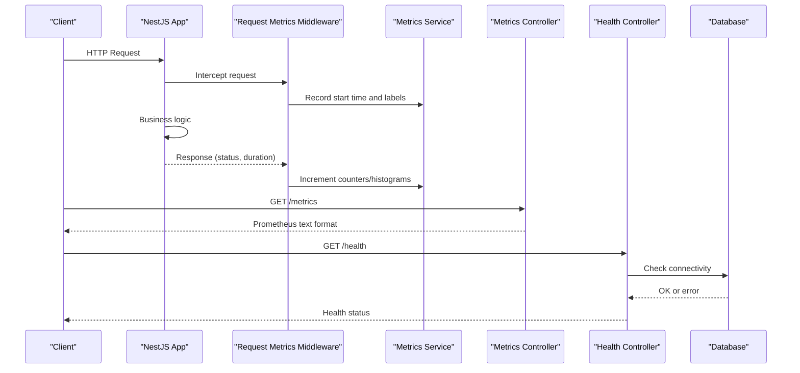

**Diagram sources**
- [request-metrics.middleware.ts](file://apps/backend/src/observability/request-metrics.middleware.ts)
- [metrics.service.ts](file://apps/backend/src/observability/metrics.service.ts)
- [metrics.controller.ts](file://apps/backend/src/observability/metrics.controller.ts)
- [health.controller.ts](file://apps/backend/src/health/health.controller.ts)
- [prisma-health.indicator.ts](file://apps/backend/src/health/prisma-health.indicator.ts)

## Detailed Component Analysis

### Metrics Service
Centralizes metric primitives and lifecycle management. Provides methods to record counts, gauges, histograms, and timers. Used by middleware and services to emit standardized metrics.

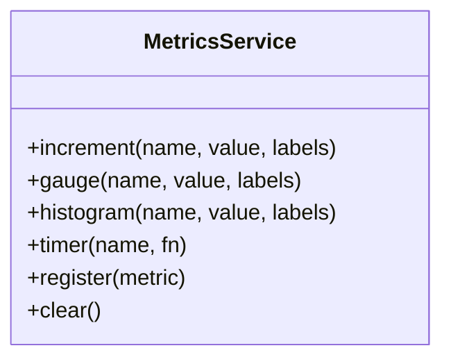

**Diagram sources**
- [metrics.service.ts](file://apps/backend/src/observability/metrics.service.ts)

**Section sources**
- [metrics.service.ts](file://apps/backend/src/observability/metrics.service.ts)

### Request Metrics Middleware
Measures per-request latency, status code distribution, and throughput. Adds correlation IDs where applicable and ensures consistent labeling for downstream aggregation.

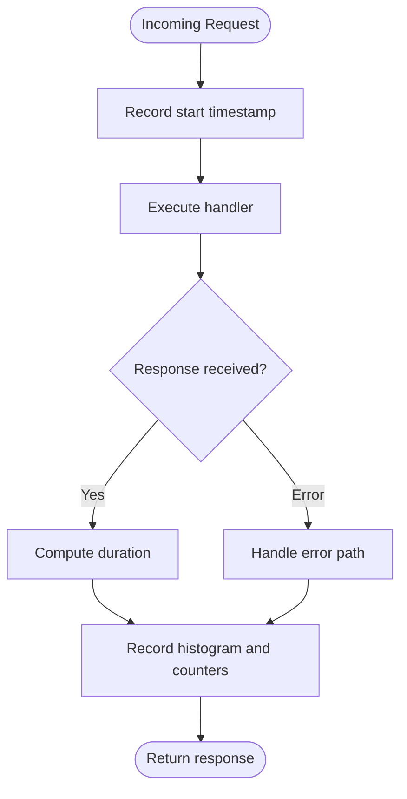

**Diagram sources**
- [request-metrics.middleware.ts](file://apps/backend/src/observability/request-metrics.middleware.ts)

**Section sources**
- [request-metrics.middleware.ts](file://apps/backend/src/observability/request-metrics.middleware.ts)

### Performance Service
Provides utility functions to measure execution time and compute performance deltas. Useful for wrapping critical sections and reporting slow paths.

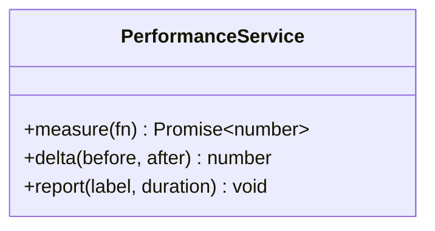

**Diagram sources**
- [performance.service.ts](file://apps/backend/src/observability/performance.service.ts)

**Section sources**
- [performance.service.ts](file://apps/backend/src/observability/performance.service.ts)

### Health Metrics Service
Aggregates health signals from dependencies (e.g., database, cache) and exposes them as metrics. Supports readiness and liveness checks.

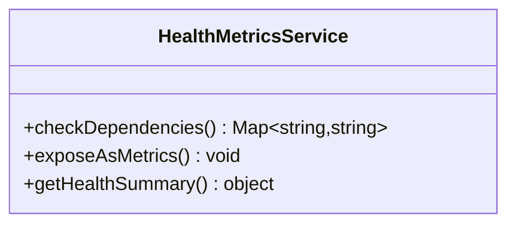

**Diagram sources**
- [health-metrics.service.ts](file://apps/backend/src/observability/health-metrics.service.ts)

**Section sources**
- [health-metrics.service.ts](file://apps/backend/src/observability/health-metrics.service.ts)

### Tracing Service
Instruments spans and correlates traces across modules. Integrates with logging for contextual trace IDs.

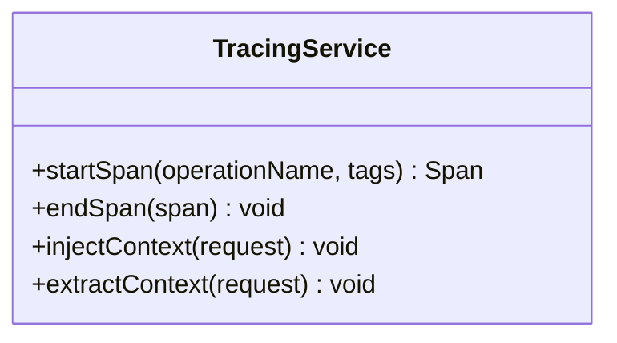

**Diagram sources**
- [tracing.service.ts](file://apps/backend/src/observability/tracing.service.ts)

**Section sources**
- [tracing.service.ts](file://apps/backend/src/observability/tracing.service.ts)

### Logging Service
Structured logging with correlation IDs and severity levels. Ensures logs are machine-parseable and compatible with log aggregators.

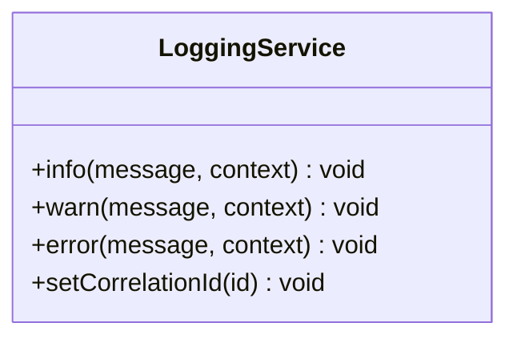

**Diagram sources**
- [logging.service.ts](file://apps/backend/src/observability/logging.service.ts)

**Section sources**
- [logging.service.ts](file://apps/backend/src/observability/logging.service.ts)

### Metrics Controller
Exposes a Prometheus-compatible endpoint that serializes all registered metrics. Enables scraping by external monitoring systems.

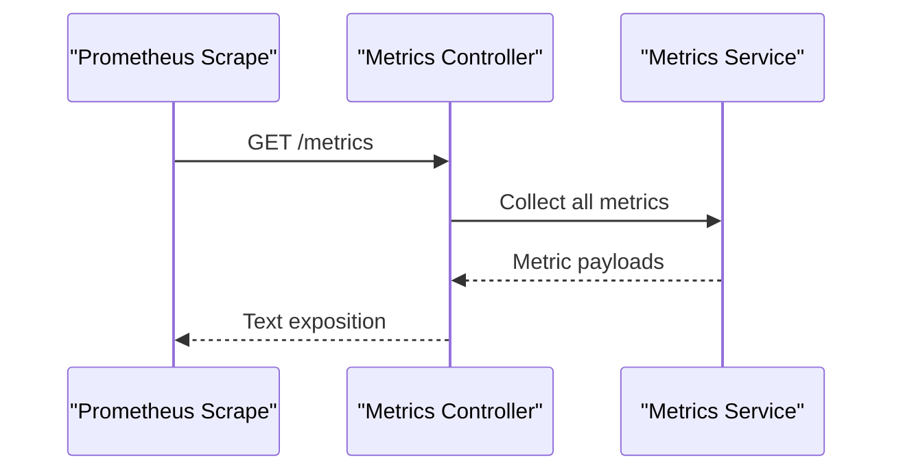

**Diagram sources**
- [metrics.controller.ts](file://apps/backend/src/observability/metrics.controller.ts)
- [metrics.service.ts](file://apps/backend/src/observability/metrics.service.ts)

**Section sources**
- [metrics.controller.ts](file://apps/backend/src/observability/metrics.controller.ts)

### Health Controller and Prisma Indicator
Provide health endpoints and database connectivity checks. The Prisma indicator validates database availability and responsiveness.

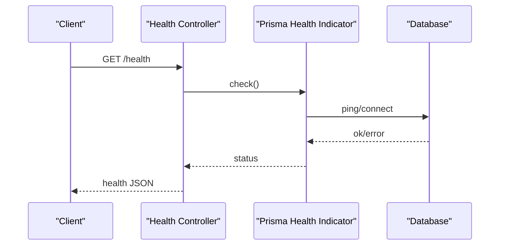

**Diagram sources**
- [health.controller.ts](file://apps/backend/src/health/health.controller.ts)
- [prisma-health.indicator.ts](file://apps/backend/src/health/prisma-health.indicator.ts)

**Section sources**
- [health.controller.ts](file://apps/backend/src/health/health.controller.ts)
- [prisma-health.indicator.ts](file://apps/backend/src/health/prisma-health.indicator.ts)

### Hardening Utilities
- Database Optimization Service: identifies slow queries and suggests indexes or query improvements.
- Query Analysis Service: inspects query plans and patterns for inefficiencies.
- Performance Audit Service: runs periodic audits to detect regressions and bottlenecks.
- Rate Limit Audit Service: monitors rate limiting effectiveness and abuse patterns.

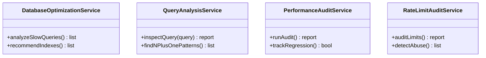

**Diagram sources**
- [database-optimization.service.ts](file://apps/backend/src/hardening/database-optimization.service.ts)
- [query-analysis.service.ts](file://apps/backend/src/hardening/query-analysis.service.ts)
- [performance-audit.service.ts](file://apps/backend/src/hardening/performance-audit.service.ts)
- [rate-limit-audit.service.ts](file://apps/backend/src/hardening/rate-limit-audit.service.ts)

**Section sources**
- [database-optimization.service.ts](file://apps/backend/src/hardening/database-optimization.service.ts)
- [query-analysis.service.ts](file://apps/backend/src/hardening/query-analysis.service.ts)
- [performance-audit.service.ts](file://apps/backend/src/hardening/performance-audit.service.ts)
- [rate-limit-audit.service.ts](file://apps/backend/src/hardening/rate-limit-audit.service.ts)

## Dependency Analysis
The observability layer depends on NestJS core, Prisma for database interactions, and optional tracing/logging integrations. Metrics are exported via an HTTP endpoint consumed by Prometheus. Health checks depend on database connectivity.

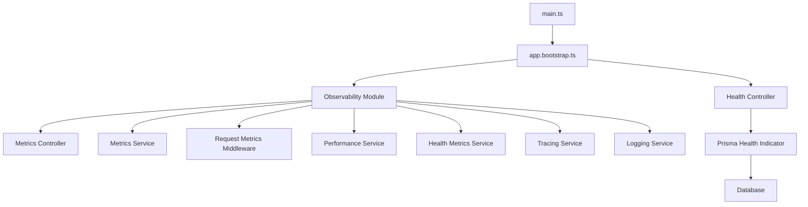

**Diagram sources**
- [main.ts](file://apps/backend/src/main.ts)
- [app.bootstrap.ts](file://apps/backend/src/app.bootstrap.ts)
- [metrics.controller.ts](file://apps/backend/src/observability/metrics.controller.ts)
- [metrics.service.ts](file://apps/backend/src/observability/metrics.service.ts)
- [request-metrics.middleware.ts](file://apps/backend/src/observability/request-metrics.middleware.ts)
- [performance.service.ts](file://apps/backend/src/observability/performance.service.ts)
- [health-metrics.service.ts](file://apps/backend/src/observability/health-metrics.service.ts)
- [tracing.service.ts](file://apps/backend/src/observability/tracing.service.ts)
- [logging.service.ts](file://apps/backend/src/observability/logging.service.ts)
- [health.controller.ts](file://apps/backend/src/health/health.controller.ts)
- [prisma-health.indicator.ts](file://apps/backend/src/health/prisma-health.indicator.ts)

**Section sources**
- [main.ts](file://apps/backend/src/main.ts)
- [app.bootstrap.ts](file://apps/backend/src/app.bootstrap.ts)

## Performance Considerations
- Use histograms for API latency distributions to capture p50/p95/p99 values.
- Apply consistent labels (endpoint, method, status code) to enable precise slicing.
- Avoid excessive synchronous work inside middleware; offload heavy tasks to background jobs.
- Cache expensive computations and frequently accessed data to reduce DB pressure.
- Monitor memory usage trends and set alerts for leaks or spikes.
- Tune database connection pools based on observed concurrency and latency.
- Implement backpressure and graceful degradation under load.

[No sources needed since this section provides general guidance]

## Troubleshooting Guide
Common issues and resolutions:
- Missing metrics: ensure middleware is registered and metrics controller is mounted.
- High latency: use tracing to identify slow spans; review DB query analysis reports.
- Memory growth: correlate heap snapshots with request rates; look for unbounded caches.
- Health failures: verify database connectivity and credentials; check Prisma indicator logs.
- Alert noise: refine thresholds using historical percentile data from histograms.

**Section sources**
- [metrics.controller.ts](file://apps/backend/src/observability/metrics.controller.ts)
- [request-metrics.middleware.ts](file://apps/backend/src/observability/request-metrics.middleware.ts)
- [tracing.service.ts](file://apps/backend/src/observability/tracing.service.ts)
- [query-analysis.service.ts](file://apps/backend/src/hardening/query-analysis.service.ts)
- [health.controller.ts](file://apps/backend/src/health/health.controller.ts)
- [prisma-health.indicator.ts](file://apps/backend/src/health/prisma-health.indicator.ts)

## Conclusion
The observability stack provides comprehensive metrics, tracing, and health checks to monitor application performance and system health. Combined with hardening utilities and load tests, it enables proactive optimization and reliable production operations.

[No sources needed since this section summarizes without analyzing specific files]

## Appendices

### Metrics Collection Strategies
- Request-level metrics: latency histograms, status code counters, throughput gauges.
- Business-level metrics: domain events, feature flags, user actions.
- Resource metrics: CPU, memory, GC pauses, file descriptors.
- Dependency metrics: DB connection pool stats, cache hit ratios, queue lengths.

[No sources needed since this section provides general guidance]

### Performance Benchmarking
- Artillery scenarios: smoke and load tests to validate baseline performance.
- k6 scenarios: load, soak, spike, and stress tests for sustained and bursty workloads.
- Baseline establishment: run tests in staging with representative data volumes.
- Regression detection: compare p95/p99 latencies and error rates against baselines.

**Section sources**
- [load.yml](file://apps/backend/loadtests/artillery/load.yml)
- [smoke.yml](file://apps/backend/loadtests/artillery/smoke.yml)
- [load.js](file://apps/backend/loadtests/k6/load.js)
- [smoke.js](file://apps/backend/loadtests/k6/smoke.js)
- [soak.js](file://apps/backend/loadtests/k6/soak.js)
- [spike.js](file://apps/backend/loadtests/k6/spike.js)
- [stress.js](file://apps/backend/loadtests/k6/stress.js)

### Custom Metric Definitions
- Define counters for business events (e.g., signups, purchases).
- Use histograms for operation durations (e.g., API calls, DB queries).
- Expose gauges for real-time state (e.g., active sessions, queue size).
- Tag metrics with relevant dimensions (service, endpoint, region).

[No sources needed since this section provides general guidance]

### Performance Alerting Configurations
- Latency alerts: trigger when p95 exceeds threshold for sustained periods.
- Error rate alerts: alert on sudden increases in 5xx responses.
- Saturation alerts: warn on high CPU, memory, or DB connection pool usage.
- Dependency alerts: notify on health check failures or degraded responses.

[No sources needed since this section provides general guidance]

### Database Query Performance
- Identify slow queries using query analysis service.
- Add indexes for frequent filters and joins.
- Optimize N+1 patterns and batch operations.
- Monitor query plan changes after schema updates.

**Section sources**
- [query-analysis.service.ts](file://apps/backend/src/hardening/query-analysis.service.ts)
- [database-optimization.service.ts](file://apps/backend/src/hardening/database-optimization.service.ts)

### API Response Times
- Track per-endpoint latency histograms.
- Correlate latency with status codes and payload sizes.
- Segment by client type and geographic region if applicable.

**Section sources**
- [request-metrics.middleware.ts](file://apps/backend/src/observability/request-metrics.middleware.ts)
- [metrics.service.ts](file://apps/backend/src/observability/metrics.service.ts)

### Memory Usage Analysis
- Monitor heap size and GC pause times.
- Detect memory leaks via trend analysis over time.
- Profile hot paths during peak loads.

[No sources needed since this section provides general guidance]