# Recommendation Algorithms

<cite>
**Referenced Files in This Document**
- [app.module.ts](file://apps/backend/src/app.module.ts)
- [recommendation.service.ts](file://apps/backend/src/recommendation/recommendation.service.ts)
- [collaborative-filtering.service.ts](file://apps/backend/src/recommendation/collaborative-filtering.service.ts)
- [content-based-filtering.service.ts](file://apps/backend/src/recommendation/content-based-filtering.service.ts)
- [hybrid-recommender.service.ts](file://apps/backend/src/recommendation/hybrid-recommender.service.ts)
- [similarity-engine.service.ts](file://apps/backend/src/recommendation/similarity-engine.service.ts)
- [preference-model.service.ts](file://apps/backend/src/recommendation/preference-model.service.ts)
- [personalization.service.ts](file://apps/backend/src/recommendation/personalization.service.ts)
- [realtime-recommender.service.ts](file://apps/backend/src/recommendation/realtime-recommender.service.ts)
- [cold-start-handler.service.ts](file://apps/backend/src/recommendation/cold-start-handler.service.ts)
- [quality-metrics.service.ts](file://apps/backend/src/recommendation/quality-metrics.service.ts)
- [recommendation.controller.ts](file://apps/backend/src/recommendation/recommendation.controller.ts)
- [recommendation.module.ts](file://apps/backend/src/recommendation/recommendation.module.ts)
- [media.repository.ts](file://apps/backend/src/media/media.repository.ts)
- [interaction.repository.ts](file://apps/backend/src/interaction/interaction.repository.ts)
- [redis.service.ts](file://apps/backend/src/redis/redis.service.ts)
- [analytics.service.ts](file://apps/backend/src/analytics/analytics.service.ts)
</cite>

## Table of Contents
1. [Introduction](#introduction)
2. [Project Structure](#project-structure)
3. [Core Components](#core-components)
4. [Architecture Overview](#architecture-overview)
5. [Detailed Component Analysis](#detailed-component-analysis)
6. [Dependency Analysis](#dependency-analysis)
7. [Performance Considerations](#performance-considerations)
8. [Troubleshooting Guide](#troubleshooting-guide)
9. [Conclusion](#conclusion)
10. [Appendices](#appendices)

## Introduction
This document explains the recommendation algorithms engine that powers personalized media suggestions. It covers collaborative filtering, content-based filtering, and hybrid approaches; similarity scoring; preference modeling; personalization techniques; real-time generation; cold start handling; and quality metrics. It also provides examples of pipeline implementation and algorithm configuration to help developers integrate and tune recommendations effectively.

## Project Structure
The recommendation engine is implemented as a modular NestJS feature within the backend application. The module encapsulates services for different recommendation strategies, similarity computation, preference modeling, personalization, real-time processing, cold start handling, and quality measurement. Controllers expose endpoints for generating recommendations, while repositories provide data access to media and interactions. Caching and analytics are integrated via shared services.

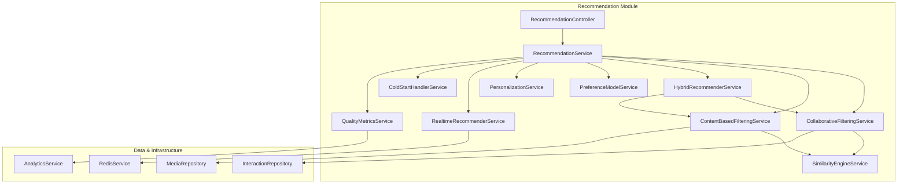

**Diagram sources**
- [recommendation.controller.ts](file://apps/backend/src/recommendation/recommendation.controller.ts)
- [recommendation.service.ts](file://apps/backend/src/recommendation/recommendation.service.ts)
- [collaborative-filtering.service.ts](file://apps/backend/src/recommendation/collaborative-filtering.service.ts)
- [content-based-filtering.service.ts](file://apps/backend/src/recommendation/content-based-filtering.service.ts)
- [hybrid-recommender.service.ts](file://apps/backend/src/recommendation/hybrid-recommender.service.ts)
- [similarity-engine.service.ts](file://apps/backend/src/recommendation/similarity-engine.service.ts)
- [preference-model.service.ts](file://apps/backend/src/recommendation/preference-model.service.ts)
- [personalization.service.ts](file://apps/backend/src/recommendation/personalization.service.ts)
- [realtime-recommender.service.ts](file://apps/backend/src/recommendation/realtime-recommender.service.ts)
- [cold-start-handler.service.ts](file://apps/backend/src/recommendation/cold-start-handler.service.ts)
- [quality-metrics.service.ts](file://apps/backend/src/recommendation/quality-metrics.service.ts)
- [media.repository.ts](file://apps/backend/src/media/media.repository.ts)
- [interaction.repository.ts](file://apps/backend/src/interaction/interaction.repository.ts)
- [redis.service.ts](file://apps/backend/src/redis/redis.service.ts)
- [analytics.service.ts](file://apps/backend/src/analytics/analytics.service.ts)

**Section sources**
- [recommendation.module.ts](file://apps/backend/src/recommendation/recommendation.module.ts)
- [app.module.ts](file://apps/backend/src/app.module.ts)

## Core Components
- Collaborative Filtering Service: Builds user-item interaction matrices and computes neighbor similarities to generate item recommendations based on collective behavior patterns.
- Content-Based Filtering Service: Encodes media attributes (e.g., genres, tags, metadata) into feature vectors and matches them against user profiles derived from past interactions.
- Hybrid Recommender Service: Combines collaborative and content-based scores using configurable weights and fallback logic to improve coverage and robustness.
- Similarity Engine Service: Provides reusable similarity functions (cosine, Jaccard, Pearson) and vector operations used by both collaborative and content-based modules.
- Preference Model Service: Maintains and updates per-user preference vectors, including recency weighting, genre affinity, and implicit/explicit feedback integration.
- Personalization Service: Applies context-aware adjustments such as time-of-day, device type, session signals, and explicit user preferences to refine ranking.
- Realtime Recommender Service: Processes streaming interaction events to update caches and produce low-latency recommendations.
- Cold Start Handler Service: Supplies default or trending items for new users or items until sufficient signals are available.
- Quality Metrics Service: Computes offline and online metrics (precision, recall, NDCG, diversity, novelty) and integrates with analytics for continuous evaluation.

**Section sources**
- [collaborative-filtering.service.ts](file://apps/backend/src/recommendation/collaborative-filtering.service.ts)
- [content-based-filtering.service.ts](file://apps/backend/src/recommendation/content-based-filtering.service.ts)
- [hybrid-recommender.service.ts](file://apps/backend/src/recommendation/hybrid-recommender.service.ts)
- [similarity-engine.service.ts](file://apps/backend/src/recommendation/similarity-engine.service.ts)
- [preference-model.service.ts](file://apps/backend/src/recommendation/preference-model.service.ts)
- [personalization.service.ts](file://apps/backend/src/recommendation/personalization.service.ts)
- [realtime-recommender.service.ts](file://apps/backend/src/recommendation/realtime-recommender.service.ts)
- [cold-start-handler.service.ts](file://apps/backend/src/recommendation/cold-start-handler.service.ts)
- [quality-metrics.service.ts](file://apps/backend/src/recommendation/quality-metrics.service.ts)

## Architecture Overview
The recommendation pipeline is request-driven and event-augmented. Controllers accept requests for recommendations, which are routed through the main service orchestrator. Depending on strategy and context, the system selects collaborative, content-based, or hybrid methods. Similarity computations and preference models are reused across strategies. Real-time updates keep caches fresh, while quality metrics feed back into tuning.

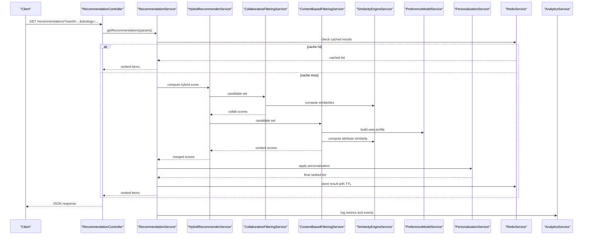

**Diagram sources**
- [recommendation.controller.ts](file://apps/backend/src/recommendation/recommendation.controller.ts)
- [recommendation.service.ts](file://apps/backend/src/recommendation/recommendation.service.ts)
- [hybrid-recommender.service.ts](file://apps/backend/src/recommendation/hybrid-recommender.service.ts)
- [collaborative-filtering.service.ts](file://apps/backend/src/recommendation/collaborative-filtering.service.ts)
- [content-based-filtering.service.ts](file://apps/backend/src/recommendation/content-based-filtering.service.ts)
- [similarity-engine.service.ts](file://apps/backend/src/recommendation/similarity-engine.service.ts)
- [preference-model.service.ts](file://apps/backend/src/recommendation/preference-model.service.ts)
- [personalization.service.ts](file://apps/backend/src/recommendation/personalization.service.ts)
- [redis.service.ts](file://apps/backend/src/redis/redis.service.ts)
- [analytics.service.ts](file://apps/backend/src/analytics/analytics.service.ts)

## Detailed Component Analysis

### Collaborative Filtering
Collaborative filtering builds a user-item interaction matrix from historical events and identifies similar users or items to recommend those liked by peers. It supports multiple similarity measures and can operate in user-based or item-based modes.

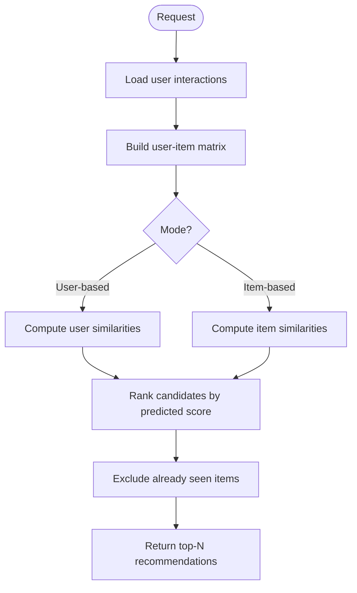

**Diagram sources**
- [collaborative-filtering.service.ts](file://apps/backend/src/recommendation/collaborative-filtering.service.ts)
- [interaction.repository.ts](file://apps/backend/src/interaction/interaction.repository.ts)
- [similarity-engine.service.ts](file://apps/backend/src/recommendation/similarity-engine.service.ts)

**Section sources**
- [collaborative-filtering.service.ts](file://apps/backend/src/recommendation/collaborative-filtering.service.ts)
- [interaction.repository.ts](file://apps/backend/src/interaction/interaction.repository.ts)

### Content-Based Filtering
Content-based filtering represents media items as feature vectors and matches them against a user’s preference profile. It leverages metadata such as genres, tags, creators, and other attributes to compute relevance scores.

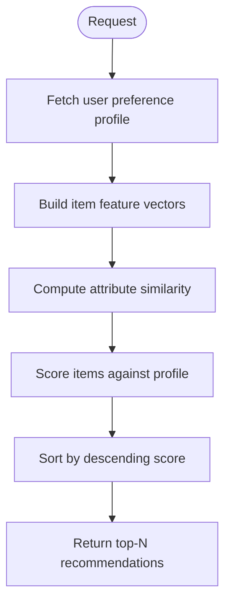

**Diagram sources**
- [content-based-filtering.service.ts](file://apps/backend/src/recommendation/content-based-filtering.service.ts)
- [preference-model.service.ts](file://apps/backend/src/recommendation/preference-model.service.ts)
- [media.repository.ts](file://apps/backend/src/media/media.repository.ts)
- [similarity-engine.service.ts](file://apps/backend/src/recommendation/similarity-engine.service.ts)

**Section sources**
- [content-based-filtering.service.ts](file://apps/backend/src/recommendation/content-based-filtering.service.ts)
- [preference-model.service.ts](file://apps/backend/src/recommendation/preference-model.service.ts)
- [media.repository.ts](file://apps/backend/src/media/media.repository.ts)

### Hybrid Recommender
The hybrid recommender merges collaborative and content-based scores using configurable weights and fallback logic. It ensures diversity and handles cases where one signal is sparse by leaning on the other.

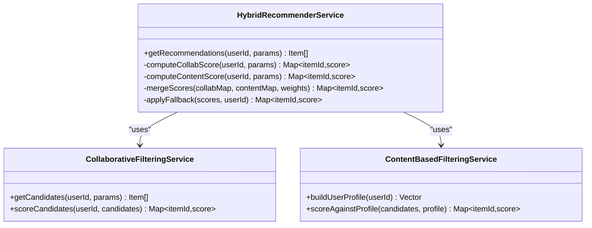

**Diagram sources**
- [hybrid-recommender.service.ts](file://apps/backend/src/recommendation/hybrid-recommender.service.ts)
- [collaborative-filtering.service.ts](file://apps/backend/src/recommendation/collaborative-filtering.service.ts)
- [content-based-filtering.service.ts](file://apps/backend/src/recommendation/content-based-filtering.service.ts)

**Section sources**
- [hybrid-recommender.service.ts](file://apps/backend/src/recommendation/hybrid-recommender.service.ts)

### Similarity Scoring Algorithms
The similarity engine exposes reusable functions for cosine similarity, Jaccard index, and Pearson correlation. These are applied to both user-item matrices and attribute vectors.

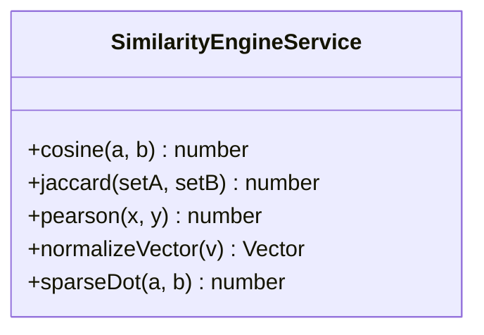

**Diagram sources**
- [similarity-engine.service.ts](file://apps/backend/src/recommendation/similarity-engine.service.ts)

**Section sources**
- [similarity-engine.service.ts](file://apps/backend/src/recommendation/similarity-engine.service.ts)

### Preference Modeling
Preference modeling maintains a dynamic per-user vector reflecting affinities for genres, tags, creators, and other features. It incorporates recency decay, implicit/explicit feedback, and smoothing to avoid overfitting.

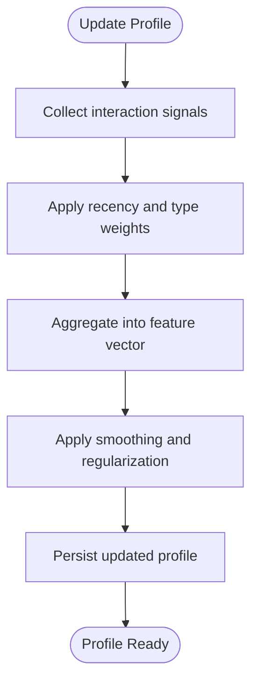

**Diagram sources**
- [preference-model.service.ts](file://apps/backend/src/recommendation/preference-model.service.ts)
- [interaction.repository.ts](file://apps/backend/src/interaction/interaction.repository.ts)

**Section sources**
- [preference-model.service.ts](file://apps/backend/src/recommendation/preference-model.service.ts)

### Personalization Techniques
Personalization adjusts rankings based on contextual signals such as time-of-day, device, session length, and explicit user settings. It can boost or demote categories and enforce diversity constraints.

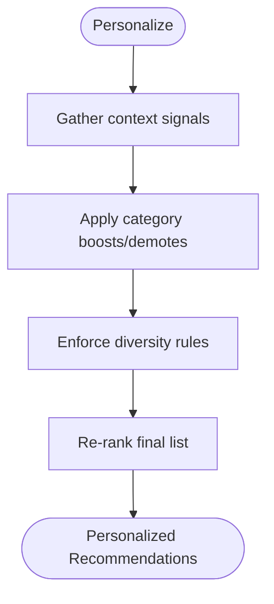

**Diagram sources**
- [personalization.service.ts](file://apps/backend/src/recommendation/personalization.service.ts)

**Section sources**
- [personalization.service.ts](file://apps/backend/src/recommendation/personalization.service.ts)

### Real-Time Recommendation Generation
Real-time processing consumes interaction events to update caches and refresh short-term preferences, enabling immediate recommendation updates with low latency.

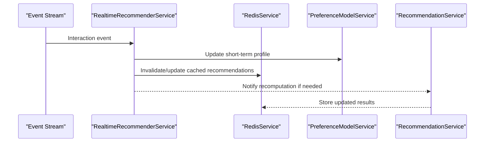

**Diagram sources**
- [realtime-recommender.service.ts](file://apps/backend/src/recommendation/realtime-recommender.service.ts)
- [redis.service.ts](file://apps/backend/src/redis/redis.service.ts)
- [preference-model.service.ts](file://apps/backend/src/recommendation/preference-model.service.ts)
- [recommendation.service.ts](file://apps/backend/src/recommendation/recommendation.service.ts)

**Section sources**
- [realtime-recommender.service.ts](file://apps/backend/src/recommendation/realtime-recommender.service.ts)
- [redis.service.ts](file://apps/backend/src/redis/redis.service.ts)

### Cold Start Problem Handling
For new users or items without sufficient history, the system falls back to trending, popular, or editorially curated content, gradually transitioning to personalized recommendations as signals accumulate.

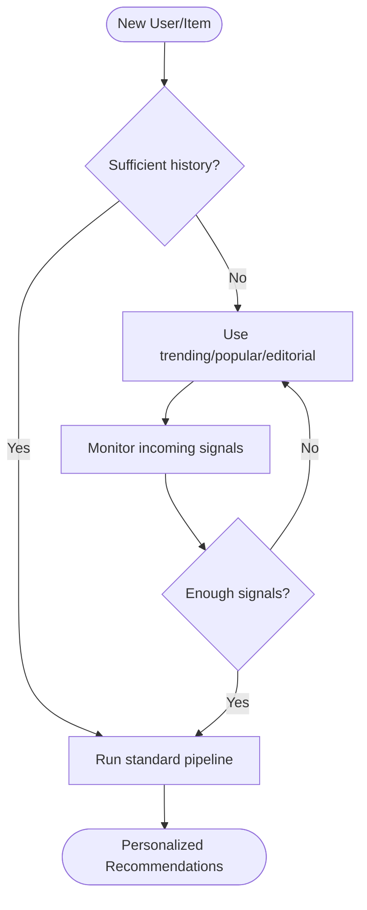

**Diagram sources**
- [cold-start-handler.service.ts](file://apps/backend/src/recommendation/cold-start-handler.service.ts)
- [media.repository.ts](file://apps/backend/src/media/media.repository.ts)

**Section sources**
- [cold-start-handler.service.ts](file://apps/backend/src/recommendation/cold-start-handler.service.ts)

### Recommendation Quality Metrics
Quality metrics track precision, recall, NDCG, diversity, novelty, and click-through rates. They support A/B testing and continuous model improvement.

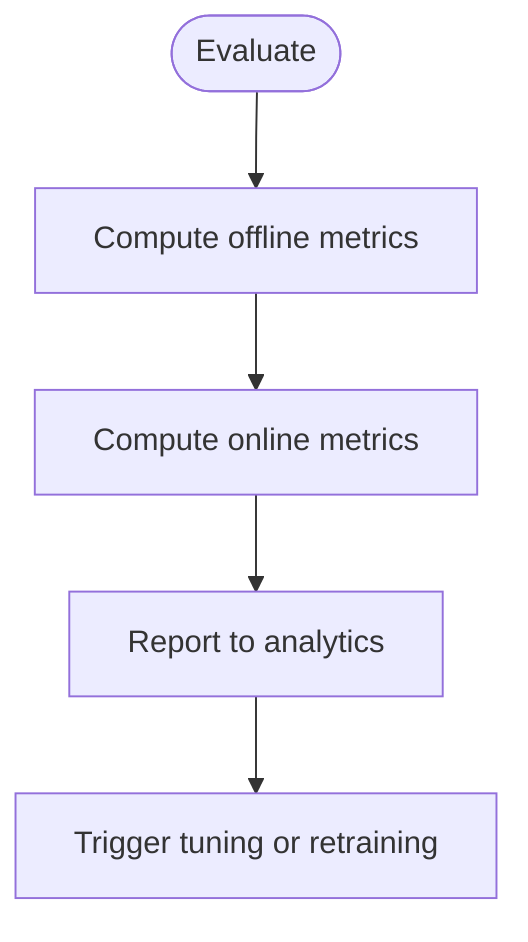

**Diagram sources**
- [quality-metrics.service.ts](file://apps/backend/src/recommendation/quality-metrics.service.ts)
- [analytics.service.ts](file://apps/backend/src/analytics/analytics.service.ts)

**Section sources**
- [quality-metrics.service.ts](file://apps/backend/src/recommendation/quality-metrics.service.ts)
- [analytics.service.ts](file://apps/backend/src/analytics/analytics.service.ts)

## Dependency Analysis
The recommendation module depends on media and interaction repositories for data, Redis for caching, and analytics for observability. Services are loosely coupled via clear interfaces, enabling swapping strategies and scaling components independently.

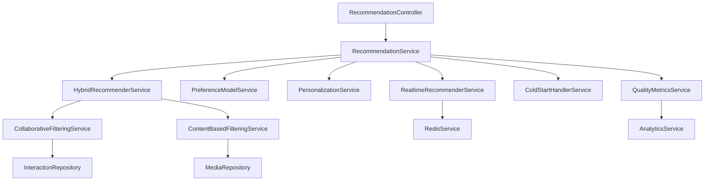

**Diagram sources**
- [recommendation.controller.ts](file://apps/backend/src/recommendation/recommendation.controller.ts)
- [recommendation.service.ts](file://apps/backend/src/recommendation/recommendation.service.ts)
- [hybrid-recommender.service.ts](file://apps/backend/src/recommendation/hybrid-recommender.service.ts)
- [collaborative-filtering.service.ts](file://apps/backend/src/recommendation/collaborative-filtering.service.ts)
- [content-based-filtering.service.ts](file://apps/backend/src/recommendation/content-based-filtering.service.ts)
- [preference-model.service.ts](file://apps/backend/src/recommendation/preference-model.service.ts)
- [personalization.service.ts](file://apps/backend/src/recommendation/personalization.service.ts)
- [realtime-recommender.service.ts](file://apps/backend/src/recommendation/realtime-recommender.service.ts)
- [cold-start-handler.service.ts](file://apps/backend/src/recommendation/cold-start-handler.service.ts)
- [quality-metrics.service.ts](file://apps/backend/src/recommendation/quality-metrics.service.ts)
- [interaction.repository.ts](file://apps/backend/src/interaction/interaction.repository.ts)
- [media.repository.ts](file://apps/backend/src/media/media.repository.ts)
- [redis.service.ts](file://apps/backend/src/redis/redis.service.ts)
- [analytics.service.ts](file://apps/backend/src/analytics/analytics.service.ts)

**Section sources**
- [recommendation.module.ts](file://apps/backend/src/recommendation/recommendation.module.ts)

## Performance Considerations
- Caching: Use Redis to cache per-user recommendation lists with appropriate TTLs to reduce database load and latency.
- Batch Processing: Precompute similarity matrices and candidate sets during off-peak hours to speed up real-time requests.
- Sparse Data: Employ regularization and smoothing in preference models to mitigate noise and sparsity.
- Scaling: Partition user-item matrices and distribute similarity computations horizontally.
- Monitoring: Track latency percentiles and throughput; instrument key steps with metrics and traces.

[No sources needed since this section provides general guidance]

## Troubleshooting Guide
- Stale Recommendations: Ensure cache invalidation on significant user interactions and periodic refreshes.
- Poor Coverage: Validate cold start fallbacks and trending content availability; verify repository queries return expected datasets.
- Slow Responses: Profile similarity computations; consider approximate nearest neighbors or dimensionality reduction for large vectors.
- Degraded Quality: Review metric dashboards; adjust weights in hybrid scoring and personalization rules; run A/B tests.

**Section sources**
- [realtime-recommender.service.ts](file://apps/backend/src/recommendation/realtime-recommender.service.ts)
- [cold-start-handler.service.ts](file://apps/backend/src/recommendation/cold-start-handler.service.ts)
- [quality-metrics.service.ts](file://apps/backend/src/recommendation/quality-metrics.service.ts)

## Conclusion
The recommendation engine combines collaborative and content-based strategies through a flexible hybrid approach, supported by robust similarity computation, dynamic preference modeling, and context-aware personalization. Real-time updates and comprehensive quality metrics ensure responsiveness and continuous improvement. Proper configuration and monitoring enable scalable, high-quality recommendations tailored to each user.

[No sources needed since this section summarizes without analyzing specific files]

## Appendices

### Example: Recommendation Pipeline Implementation
- Define controller endpoint to accept userId, strategy, and parameters.
- Implement service orchestration to select strategy, compute scores, and apply personalization.
- Integrate caching for fast responses and analytics for observability.
- Configure hybrid weights and fallback thresholds based on data availability.

**Section sources**
- [recommendation.controller.ts](file://apps/backend/src/recommendation/recommendation.controller.ts)
- [recommendation.service.ts](file://apps/backend/src/recommendation/recommendation.service.ts)
- [hybrid-recommender.service.ts](file://apps/backend/src/recommendation/hybrid-recommender.service.ts)

### Example: Algorithm Configuration
- Set collaborative mode (user-based vs item-based), similarity measure, and neighbor count.
- Configure content-based feature weights and profile smoothing parameters.
- Adjust hybrid blending weights and diversity constraints.
- Tune personalization boosts and cold start thresholds.

**Section sources**
- [collaborative-filtering.service.ts](file://apps/backend/src/recommendation/collaborative-filtering.service.ts)
- [content-based-filtering.service.ts](file://apps/backend/src/recommendation/content-based-filtering.service.ts)
- [hybrid-recommender.service.ts](file://apps/backend/src/recommendation/hybrid-recommender.service.ts)
- [personalization.service.ts](file://apps/backend/src/recommendation/personalization.service.ts)
- [cold-start-handler.service.ts](file://apps/backend/src/recommendation/cold-start-handler.service.ts)