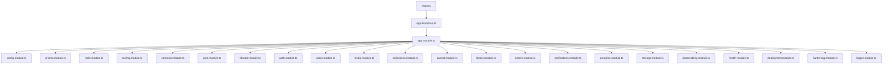
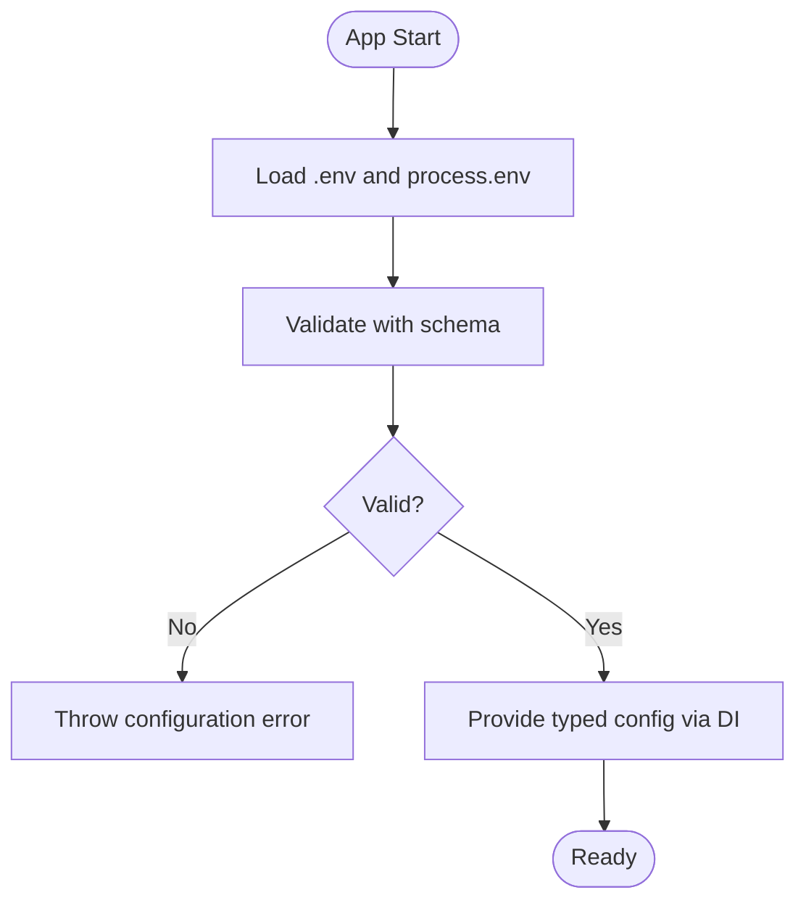
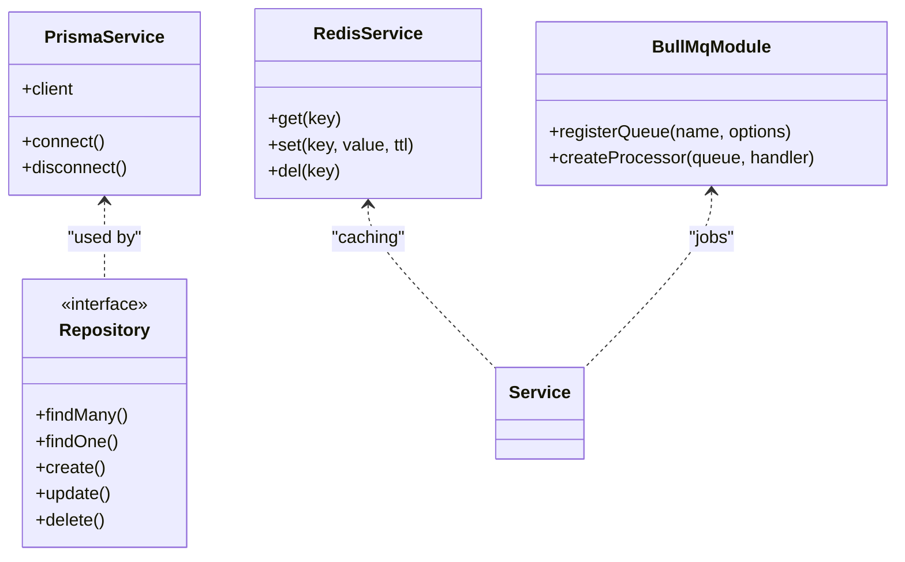
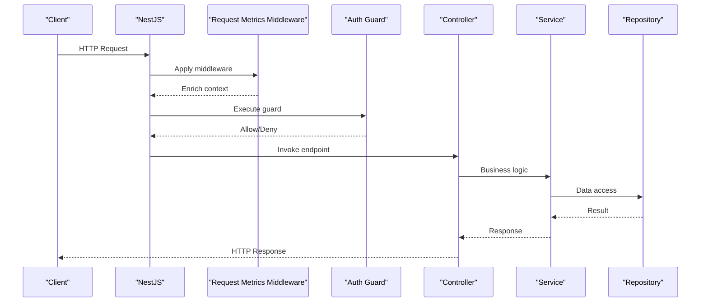
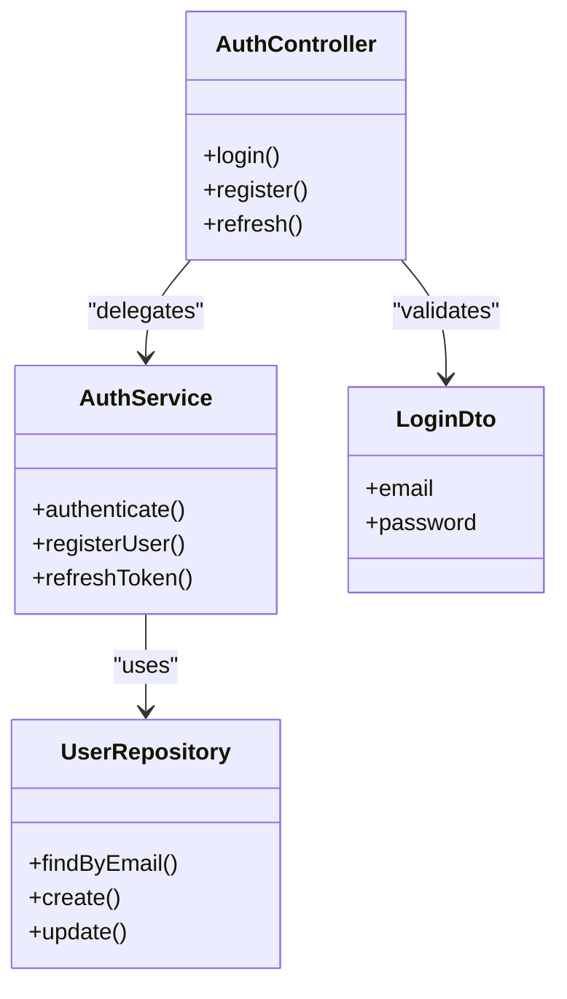
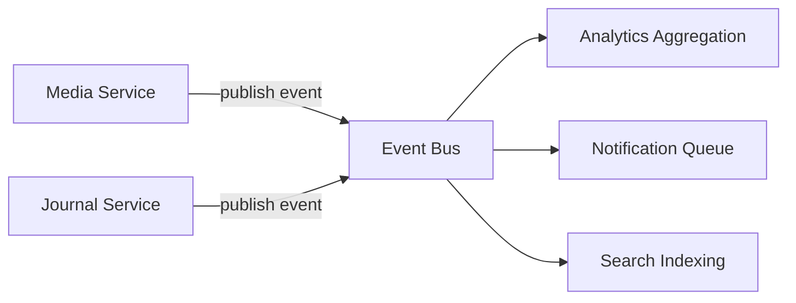

# Architecture Overview

<cite>
**Referenced Files in This Document**
- [main.ts](file://apps/backend/src/main.ts)
- [app.module.ts](file://apps/backend/src/app.module.ts)
- [app.bootstrap.ts](file://apps/backend/src/app.bootstrap.ts)
- [config.module.ts](file://apps/backend/src/config/config.module.ts)
- [configuration.ts](file://apps/backend/src/config/configuration.ts)
- [env.validation.ts](file://apps/backend/src/config/env.validation.ts)
- [prisma.module.ts](file://apps/backend/src/prisma/prisma.module.ts)
- [prisma.service.ts](file://apps/backend/src/prisma/prisma.service.ts)
- [redis.module.ts](file://apps/backend/src/redis/redis.module.ts)
- [redis.service.ts](file://apps/backend/src/redis/redis.service.ts)
- [bullmq.module.ts](file://apps/backend/src/bullmq/bullmq.module.ts)
- [common.module.ts](file://apps/backend/src/common/common.module.ts)
- [core.module.ts](file://apps/backend/src/core/core.module.ts)
- [shared.module.ts](file://apps/backend/src/shared/shared.module.ts)
- [auth.module.ts](file://apps/backend/src/auth/auth.module.ts)
- [users.module.ts](file://apps/backend/src/users/users.module.ts)
- [media.module.ts](file://apps/backend/src/media/media.module.ts)
- [collections.module.ts](file://apps/backend/src/collections/collections.module.ts)
- [journal.module.ts](file://apps/backend/src/journal/journal.module.ts)
- [library.module.ts](file://apps/backend/src/library/library.module.ts)
- [search.module.ts](file://apps/backend/src/search/search.module.ts)
- [notifications.module.ts](file://apps/backend/src/notifications/notifications.module.ts)
- [analytics.module.ts](file://apps/backend/src/analytics/analytics.module.ts)
- [storage.module.ts](file://apps/backend/src/storage/storage.module.ts)
- [observability.module.ts](file://apps/backend/src/observability/observability.module.ts)
- [health.module.ts](file://apps/backend/src/health/health.module.ts)
- [deployment.module.ts](file://apps/backend/src/deployment/deployment.module.ts)
- [hardening.module.ts](file://apps/backend/src/hardening/hardening.module.ts)
- [logger.module.ts](file://apps/backend/src/logger/logger.module.ts)
- [request-metrics.middleware.ts](file://apps/backend/src/observability/request-metrics.middleware.ts)
</cite>

## Table of Contents
1. [Introduction](#introduction)
2. [Project Structure](#project-structure)
3. [Core Components](#core-components)
4. [Architecture Overview](#architecture-overview)
5. [Detailed Component Analysis](#detailed-component-analysis)
6. [Dependency Analysis](#dependency-analysis)
7. [Performance Considerations](#performance-considerations)
8. [Troubleshooting Guide](#troubleshooting-guide)
9. [Conclusion](#conclusion)

## Introduction
This document provides an architectural overview of the NestJS backend application. It explains the modular architecture pattern, dependency injection system, and service layer organization. It also documents separation of concerns between controllers, services, repositories, and DTOs; the middleware stack; interceptors, guards, and decorators; configuration management with environment variables and validation; module registration patterns; cross-cutting concerns; and how modules interact through events and shared services.

## Project Structure
The backend is organized into feature modules under apps/backend/src, each encapsulating its own controllers, services, repositories, DTOs, and tests. Cross-cutting capabilities are provided by shared modules such as common, core, observability, hardening, deployment, logger, prisma, redis, and bullmq. The application bootstrap wires up global configuration, middleware, and module registration.



**Diagram sources**
- [main.ts](file://apps/backend/src/main.ts)
- [app.bootstrap.ts](file://apps/backend/src/app.bootstrap.ts)
- [app.module.ts](file://apps/backend/src/app.module.ts)
- [config.module.ts](file://apps/backend/src/config/config.module.ts)
- [prisma.module.ts](file://apps/backend/src/prisma/prisma.module.ts)
- [redis.module.ts](file://apps/backend/src/redis/redis.module.ts)
- [bullmq.module.ts](file://apps/backend/src/bullmq/bullmq.module.ts)
- [common.module.ts](file://apps/backend/src/common/common.module.ts)
- [core.module.ts](file://apps/backend/src/core/core.module.ts)
- [shared.module.ts](file://apps/backend/src/shared/shared.module.ts)
- [auth.module.ts](file://apps/backend/src/auth/auth.module.ts)
- [users.module.ts](file://apps/backend/src/users/users.module.ts)
- [media.module.ts](file://apps/backend/src/media/media.module.ts)
- [collections.module.ts](file://apps/backend/src/collections/collections.module.ts)
- [journal.module.ts](file://apps/backend/src/journal/journal.module.ts)
- [library.module.ts](file://apps/backend/src/library/library.module.ts)
- [search.module.ts](file://apps/backend/src/search/search.module.ts)
- [notifications.module.ts](file://apps/backend/src/notifications/notifications.module.ts)
- [analytics.module.ts](file://apps/backend/src/analytics/analytics.module.ts)
- [storage.module.ts](file://apps/backend/src/storage/storage.module.ts)
- [observability.module.ts](file://apps/backend/src/observability/observability.module.ts)
- [health.module.ts](file://apps/backend/src/health/health.module.ts)
- [deployment.module.ts](file://apps/backend/src/deployment/deployment.module.ts)
- [hardening.module.ts](file://apps/backend/src/hardening/hardening.module.ts)
- [logger.module.ts](file://apps/backend/src/logger/logger.module.ts)

**Section sources**
- [main.ts](file://apps/backend/src/main.ts)
- [app.bootstrap.ts](file://apps/backend/src/app.bootstrap.ts)
- [app.module.ts](file://apps/backend/src/app.module.ts)

## Core Components
- Application bootstrap: Initializes Express/Nest, applies global middleware, configures CORS, parsing, and mounts modules.
- Configuration module: Loads environment variables, validates them, and exposes typed configuration via a provider.
- Data access: Prisma module provides a singleton client; Redis module provides caching/session store; BullMQ module configures queues and workers.
- Shared infrastructure: Common utilities, core domain abstractions, observability (metrics, tracing), health checks, logging, and hardening features.

Key responsibilities:
- Controllers expose HTTP endpoints and delegate to services.
- Services implement business logic and orchestrate repositories and external systems.
- Repositories encapsulate data access using Prisma or custom implementations.
- DTOs define request/response shapes and validation rules.

**Section sources**
- [config.module.ts](file://apps/backend/src/config/config.module.ts)
- [configuration.ts](file://apps/backend/src/config/configuration.ts)
- [env.validation.ts](file://apps/backend/src/config/env.validation.ts)
- [prisma.module.ts](file://apps/backend/src/prisma/prisma.module.ts)
- [prisma.service.ts](file://apps/backend/src/prisma/prisma.service.ts)
- [redis.module.ts](file://apps/backend/src/redis/redis.module.ts)
- [redis.service.ts](file://apps/backend/src/redis/redis.service.ts)
- [bullmq.module.ts](file://apps/backend/src/bullmq/bullmq.module.ts)

## Architecture Overview
The application follows NestJS’s modular architecture with clear boundaries:
- Entry point bootstraps the app and registers global middleware and interceptors.
- Root module imports feature modules and shared modules.
- Feature modules encapsulate controllers, services, repositories, and DTOs.
- Cross-cutting concerns are centralized in shared modules and applied globally or per-route.

```mermaid
graph TB
subgraph "Bootstrap"
Main["main.ts"]
Bootstrap["app.bootstrap.ts"]
end
subgraph "Root Module"
AppMod["app.module.ts"]
end
subgraph "Shared Modules"
ConfigMod["config.module.ts"]
PrismaMod["prisma.module.ts"]
RedisMod["redis.module.ts"]
BullMod["bullmq.module.ts"]
CommonMod["common.module.ts"]
CoreMod["core.module.ts"]
SharedMod["shared.module.ts"]
ObsMod["observability.module.ts"]
HealthMod["health.module.ts"]
DeployMod["deployment.module.ts"]
HardMod["hardening.module.ts"]
LoggerMod["logger.module.ts"]
end
subgraph "Feature Modules"
AuthMod["auth.module.ts"]
UsersMod["users.module.ts"]
MediaMod["media.module.ts"]
CollectionsMod["collections.module.ts"]
JournalMod["journal.module.ts"]
LibraryMod["library.module.ts"]
SearchMod["search.module.ts"]
NotifMod["notifications.module.ts"]
AnalyticsMod["analytics.module.ts"]
StorageMod["storage.module.ts"]
end
Main --> Bootstrap --> AppMod
AppMod --> ConfigMod
AppMod --> PrismaMod
AppMod --> RedisMod
AppMod --> BullMod
AppMod --> CommonMod
AppMod --> CoreMod
AppMod --> SharedMod
AppMod --> ObsMod
AppMod --> HealthMod
AppMod --> DeployMod
AppMod --> HardMod
AppMod --> LoggerMod
AppMod --> AuthMod
AppMod --> UsersMod
AppMod --> MediaMod
AppMod --> CollectionsMod
AppMod --> JournalMod
AppMod --> LibraryMod
AppMod --> SearchMod
AppMod --> NotifMod
AppMod --> AnalyticsMod
AppMod --> StorageMod
```

**Diagram sources**
- [main.ts](file://apps/backend/src/main.ts)
- [app.bootstrap.ts](file://apps/backend/src/app.bootstrap.ts)
- [app.module.ts](file://apps/backend/src/app.module.ts)
- [config.module.ts](file://apps/backend/src/config/config.module.ts)
- [prisma.module.ts](file://apps/backend/src/prisma/prisma.module.ts)
- [redis.module.ts](file://apps/backend/src/redis/redis.module.ts)
- [bullmq.module.ts](file://apps/backend/src/bullmq/bullmq.module.ts)
- [common.module.ts](file://apps/backend/src/common/common.module.ts)
- [core.module.ts](file://apps/backend/src/core/core.module.ts)
- [shared.module.ts](file://apps/backend/src/shared/shared.module.ts)
- [observability.module.ts](file://apps/backend/src/observability/observability.module.ts)
- [health.module.ts](file://apps/backend/src/health/health.module.ts)
- [deployment.module.ts](file://apps/backend/src/deployment/deployment.module.ts)
- [hardening.module.ts](file://apps/backend/src/hardening/hardening.module.ts)
- [logger.module.ts](file://apps/backend/src/logger/logger.module.ts)
- [auth.module.ts](file://apps/backend/src/auth/auth.module.ts)
- [users.module.ts](file://apps/backend/src/users/users.module.ts)
- [media.module.ts](file://apps/backend/src/media/media.module.ts)
- [collections.module.ts](file://apps/backend/src/collections/collections.module.ts)
- [journal.module.ts](file://apps/backend/src/journal/journal.module.ts)
- [library.module.ts](file://apps/backend/src/library/library.module.ts)
- [search.module.ts](file://apps/backend/src/search/search.module.ts)
- [notifications.module.ts](file://apps/backend/src/notifications/notifications.module.ts)
- [analytics.module.ts](file://apps/backend/src/analytics/analytics.module.ts)
- [storage.module.ts](file://apps/backend/src/storage/storage.module.ts)

## Detailed Component Analysis

### Configuration Management
- Environment variables are loaded and validated at startup.
- Typed configuration is exposed via a provider for DI across modules.
- Validation ensures required keys exist and conform to expected types.



**Diagram sources**
- [configuration.ts](file://apps/backend/src/config/configuration.ts)
- [env.validation.ts](file://apps/backend/src/config/env.validation.ts)
- [config.module.ts](file://apps/backend/src/config/config.module.ts)

**Section sources**
- [configuration.ts](file://apps/backend/src/config/configuration.ts)
- [env.validation.ts](file://apps/backend/src/config/env.validation.ts)
- [config.module.ts](file://apps/backend/src/config/config.module.ts)

### Data Access Layer (Prisma, Redis, BullMQ)
- Prisma module exports a singleton client used by repositories.
- Redis module provides caching and session storage.
- BullMQ module configures queues and worker processes for background jobs.



**Diagram sources**
- [prisma.service.ts](file://apps/backend/src/prisma/prisma.service.ts)
- [prisma.module.ts](file://apps/backend/src/prisma/prisma.module.ts)
- [redis.service.ts](file://apps/backend/src/redis/redis.service.ts)
- [redis.module.ts](file://apps/backend/src/redis/redis.module.ts)
- [bullmq.module.ts](file://apps/backend/src/bullmq/bullmq.module.ts)

**Section sources**
- [prisma.service.ts](file://apps/backend/src/prisma/prisma.service.ts)
- [prisma.module.ts](file://apps/backend/src/prisma/prisma.module.ts)
- [redis.service.ts](file://apps/backend/src/redis/redis.service.ts)
- [redis.module.ts](file://apps/backend/src/redis/redis.module.ts)
- [bullmq.module.ts](file://apps/backend/src/bullmq/bullmq.module.ts)

### Middleware Stack and Observability
- Global middleware includes request metrics collection and logging.
- Interceptors handle cross-cutting concerns like response transformation and timing.
- Guards enforce authentication and authorization policies.
- Decorators annotate routes, parameters, and dependencies.



**Diagram sources**
- [request-metrics.middleware.ts](file://apps/backend/src/observability/request-metrics.middleware.ts)
- [auth.module.ts](file://apps/backend/src/auth/auth.module.ts)
- [common.module.ts](file://apps/backend/src/common/common.module.ts)
- [observability.module.ts](file://apps/backend/src/observability/observability.module.ts)

**Section sources**
- [request-metrics.middleware.ts](file://apps/backend/src/observability/request-metrics.middleware.ts)
- [common.module.ts](file://apps/backend/src/common/common.module.ts)
- [observability.module.ts](file://apps/backend/src/observability/observability.module.ts)

### Separation of Concerns: Controllers, Services, Repositories, DTOs
- Controllers: Thin HTTP handlers that parse requests and call services.
- Services: Orchestrate business logic, coordinate repositories, and manage side effects.
- Repositories: Encapsulate data persistence using Prisma or other adapters.
- DTOs: Define input/output contracts with validation and serialization.



**Diagram sources**
- [auth.module.ts](file://apps/backend/src/auth/auth.module.ts)
- [users.module.ts](file://apps/backend/src/users/users.module.ts)

**Section sources**
- [auth.module.ts](file://apps/backend/src/auth/auth.module.ts)
- [users.module.ts](file://apps/backend/src/users/users.module.ts)

### Events and Shared Services
- Event-driven communication enables decoupled interactions between modules (e.g., analytics, notifications).
- Shared services provide reusable functionality such as hashing, UUID generation, caching, and transaction management.



[No sources needed since this diagram shows conceptual workflow, not actual code structure]

## Dependency Analysis
Modules depend on shared infrastructure and each other through well-defined interfaces:
- Feature modules depend on core, common, prisma, redis, bullmq, and observability.
- Cross-module communication occurs via events and shared services.
- Global guards and interceptors apply consistently across routes.

```mermaid
graph TB
Auth["auth.module.ts"] --> Core["core.module.ts"]
Auth --> Common["common.module.ts"]
Auth --> Prisma["prisma.module.ts"]
Auth --> Redis["redis.module.ts"]
Auth --> Bull["bullmq.module.ts"]
Auth --> Obs["observability.module.ts"]
Users["users.module.ts"] --> Core
Users --> Common
Users --> Prisma
Users --> Redis
Users --> Obs
Media["media.module.ts"] --> Core
Media --> Common
Media --> Prisma
Media --> Redis
Media --> Bull
Media --> Obs
Collections["collections.module.ts"] --> Core
Collections --> Common
Collections --> Prisma
Collections --> Redis
Collections --> Obs
Journal["journal.module.ts"] --> Core
Journal --> Common
Journal --> Prisma
Journal --> Redis
Journal --> Obs
Library["library.module.ts"] --> Core
Library --> Common
Library --> Prisma
Library --> Redis
Library --> Obs
Search["search.module.ts"] --> Core
Search --> Common
Search --> Prisma
Search --> Redis
Search --> Obs
Notifications["notifications.module.ts"] --> Core
Notifications --> Common
Notifications --> Prisma
Notifications --> Redis
Notifications --> Bull
Notifications --> Obs
Analytics["analytics.module.ts"] --> Core
Analytics --> Common
Analytics --> Prisma
Analytics --> Redis
Analytics --> Obs
Storage["storage.module.ts"] --> Core
Storage --> Common
Storage --> Prisma
Storage --> Redis
Storage --> Obs
```



**Diagram sources**
- [auth.module.ts](file://apps/backend/src/auth/auth.module.ts)
- [users.module.ts](file://apps/backend/src/users/users.module.ts)
- [media.module.ts](file://apps/backend/src/media/media.module.ts)
- [collections.module.ts](file://apps/backend/src/collections/collections.module.ts)
- [journal.module.ts](file://apps/backend/src/journal/journal.module.ts)
- [library.module.ts](file://apps/backend/src/library/library.module.ts)
- [search.module.ts](file://apps/backend/src/search/search.module.ts)
- [notifications.module.ts](file://apps/backend/src/notifications/notifications.module.ts)
- [analytics.module.ts](file://apps/backend/src/analytics/analytics.module.ts)
- [storage.module.ts](file://apps/backend/src/storage/storage.module.ts)
- [core.module.ts](file://apps/backend/src/core/core.module.ts)
- [common.module.ts](file://apps/backend/src/common/common.module.ts)
- [prisma.module.ts](file://apps/backend/src/prisma/prisma.module.ts)
- [redis.module.ts](file://apps/backend/src/redis/redis.module.ts)
- [bullmq.module.ts](file://apps/backend/src/bullmq/bullmq.module.ts)
- [observability.module.ts](file://apps/backend/src/observability/observability.module.ts)

**Section sources**
- [app.module.ts](file://apps/backend/src/app.module.ts)

## Performance Considerations
- Use Redis for caching frequently accessed data and sessions to reduce database load.
- Offload heavy tasks to BullMQ workers to keep request paths fast.
- Enable query optimization and indexing via Prisma migrations.
- Monitor performance with observability metrics and tracing.

[No sources needed since this section provides general guidance]

## Troubleshooting Guide
- Configuration errors: Validate environment variables early and surface clear messages.
- Database connectivity: Ensure Prisma client is initialized and connection strings are correct.
- Cache issues: Verify Redis availability and TTL settings.
- Queue backlogs: Inspect BullMQ job status and worker logs.
- Observability: Check request metrics and traces to identify bottlenecks.

**Section sources**
- [configuration.ts](file://apps/backend/src/config/configuration.ts)
- [env.validation.ts](file://apps/backend/src/config/env.validation.ts)
- [prisma.service.ts](file://apps/backend/src/prisma/prisma.service.ts)
- [redis.service.ts](file://apps/backend/src/redis/redis.service.ts)
- [bullmq.module.ts](file://apps/backend/src/bullmq/bullmq.module.ts)
- [request-metrics.middleware.ts](file://apps/backend/src/observability/request-metrics.middleware.ts)

## Conclusion
The NestJS backend employs a robust modular architecture with clear separation of concerns, strong dependency injection, and comprehensive cross-cutting concerns. Configuration is validated and typed, data access is abstracted via repositories, and background processing is handled through queues. Shared modules centralize infrastructure, while feature modules encapsulate domain logic. Events enable loose coupling, and observability tools provide visibility into system behavior.