# Authentication & Authorization

<cite>
**Referenced Files in This Document**
- [auth.module.ts](file://apps/backend/src/auth/auth.module.ts)
- [auth.controller.ts](file://apps/backend/src/auth/auth.controller.ts)
- [auth.service.ts](file://apps/backend/src/auth/auth.service.ts)
- [jwt.strategy.ts](file://apps/backend/src/auth/strategies/jwt.strategy.ts)
- [local.strategy.ts](file://apps/backend/src/auth/strategies/local.strategy.ts)
- [google.strategy.ts](file://apps/backend/src/auth/strategies/google.strategy.ts)
- [jwt.guard.ts](file://apps/backend/src/auth/guards/jwt.guard.ts)
- [roles.guard.ts](file://apps/backend/src/auth/guards/roles.guard.ts)
- [is-authenticated.decorator.ts](file://apps/backend/src/auth/decorators/is-authenticated.decorator.ts)
- [roles.decorator.ts](file://apps/backend/src/auth/decorators/roles.decorator.ts)
- [user.repository.ts](file://apps/backend/src/auth/repositories/user.repository.ts)
- [session.repository.ts](file://apps/backend/src/auth/repositories/session.repository.ts)
- [refresh-token.repository.ts](file://apps/backend/src/auth/repositories/refresh-token.repository.ts)
- [email-verification.service.ts](file://apps/backend/src/auth/services/email-verification.service.ts)
- [password-hashing.service.ts](file://apps/backend/src/auth/services/password-hashing.service.ts)
- [redis.service.ts](file://apps/backend/src/redis/redis.service.ts)
- [users.service.ts](file://apps/backend/src/users/users.service.ts)
- [configuration.ts](file://apps/backend/src/config/configuration.ts)
</cite>

## Table of Contents
1. [Introduction](#introduction)
2. [Project Structure](#project-structure)
3. [Core Components](#core-components)
4. [Architecture Overview](#architecture-overview)
5. [Detailed Component Analysis](#detailed-component-analysis)
6. [Dependency Analysis](#dependency-analysis)
7. [Performance Considerations](#performance-considerations)
8. [Troubleshooting Guide](#troubleshooting-guide)
9. [Conclusion](#conclusion)

## Introduction
This document explains the authentication and authorization system implemented in the backend application. It covers JWT token issuance and validation, session management with Redis, role-based access control (RBAC), OAuth integration with Google, guard implementations, strategy configurations, decorator usage for protecting routes, password hashing strategies, email verification flow, refresh token mechanisms, and how these components interact with user management services and security best practices.

## Project Structure
The authentication subsystem is organized under the auth module with clear separation of concerns:
- Controllers expose endpoints for login, registration, password reset, and OAuth callbacks.
- Services encapsulate business logic such as token generation, email verification, and password hashing.
- Strategies implement Passport strategies for local, JWT, and Google OAuth flows.
- Guards enforce authentication and authorization at route level.
- Decorators provide declarative protection and metadata injection.
- Repositories abstract persistence for users, sessions, and refresh tokens.
- Redis service provides a centralized interface to Redis for sessions and short-lived caches.

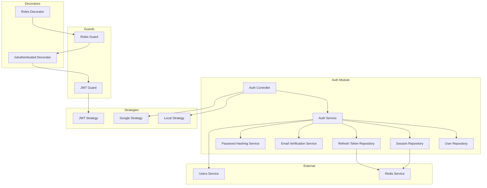

**Diagram sources**
- [auth.controller.ts](file://apps/backend/src/auth/auth.controller.ts)
- [auth.service.ts](file://apps/backend/src/auth/auth.service.ts)
- [local.strategy.ts](file://apps/backend/src/auth/strategies/local.strategy.ts)
- [jwt.strategy.ts](file://apps/backend/src/auth/strategies/jwt.strategy.ts)
- [google.strategy.ts](file://apps/backend/src/auth/strategies/google.strategy.ts)
- [jwt.guard.ts](file://apps/backend/src/auth/guards/jwt.guard.ts)
- [roles.guard.ts](file://apps/backend/src/auth/guards/roles.guard.ts)
- [is-authenticated.decorator.ts](file://apps/backend/src/auth/decorators/is-authenticated.decorator.ts)
- [roles.decorator.ts](file://apps/backend/src/auth/decorators/roles.decorator.ts)
- [user.repository.ts](file://apps/backend/src/auth/repositories/user.repository.ts)
- [session.repository.ts](file://apps/backend/src/auth/repositories/session.repository.ts)
- [refresh-token.repository.ts](file://apps/backend/src/auth/repositories/refresh-token.repository.ts)
- [email-verification.service.ts](file://apps/backend/src/auth/services/email-verification.service.ts)
- [password-hashing.service.ts](file://apps/backend/src/auth/services/password-hashing.service.ts)
- [redis.service.ts](file://apps/backend/src/redis/redis.service.ts)
- [users.service.ts](file://apps/backend/src/users/users.service.ts)

**Section sources**
- [auth.module.ts](file://apps/backend/src/auth/auth.module.ts)
- [auth.controller.ts](file://apps/backend/src/auth/auth.controller.ts)
- [auth.service.ts](file://apps/backend/src/auth/auth.service.ts)

## Core Components
- Auth Controller: Defines HTTP endpoints for authentication operations including login, register, logout, password reset, and OAuth callback handling.
- Auth Service: Orchestrates authentication workflows, token lifecycle, email verification, and integrates with repositories and external services.
- Strategies:
  - Local Strategy: Validates credentials against stored hashes and issues JWTs upon success.
  - JWT Strategy: Extracts and validates access tokens from requests, attaching user context.
  - Google Strategy: Handles OAuth2 callback, creates or retrieves users, and issues tokens.
- Guards:
  - JWT Guard: Enforces presence and validity of JWT on protected routes.
  - Roles Guard: Enforces RBAC by checking roles attached to the current user.
- Decorators:
  - IsAuthenticated: Marks routes requiring a valid JWT.
  - Roles: Declares required roles for fine-grained authorization.
- Repositories:
  - User Repository: CRUD and queries for user entities.
  - Session Repository: Manages Redis-backed sessions.
  - Refresh Token Repository: Stores and rotates refresh tokens.
- Services:
  - Email Verification Service: Generates and verifies email verification codes, sends emails, and updates user status.
  - Password Hashing Service: Provides secure hashing utilities and validation helpers.
- Redis Service: Centralized client for Redis used by session and refresh token storage.

**Section sources**
- [auth.controller.ts](file://apps/backend/src/auth/auth.controller.ts)
- [auth.service.ts](file://apps/backend/src/auth/auth.service.ts)
- [local.strategy.ts](file://apps/backend/src/auth/strategies/local.strategy.ts)
- [jwt.strategy.ts](file://apps/backend/src/auth/strategies/jwt.strategy.ts)
- [google.strategy.ts](file://apps/backend/src/auth/strategies/google.strategy.ts)
- [jwt.guard.ts](file://apps/backend/src/auth/guards/jwt.guard.ts)
- [roles.guard.ts](file://apps/backend/src/auth/guards/roles.guard.ts)
- [is-authenticated.decorator.ts](file://apps/backend/src/auth/decorators/is-authenticated.decorator.ts)
- [roles.decorator.ts](file://apps/backend/src/auth/decorators/roles.decorator.ts)
- [user.repository.ts](file://apps/backend/src/auth/repositories/user.repository.ts)
- [session.repository.ts](file://apps/backend/src/auth/repositories/session.repository.ts)
- [refresh-token.repository.ts](file://apps/backend/src/auth/repositories/refresh-token.repository.ts)
- [email-verification.service.ts](file://apps/backend/src/auth/services/email-verification.service.ts)
- [password-hashing.service.ts](file://apps/backend/src/auth/services/password-hashing.service.ts)
- [redis.service.ts](file://apps/backend/src/redis/redis.service.ts)

## Architecture Overview
The authentication pipeline combines stateless JWT validation with stateful session and refresh token management via Redis. Access tokens are validated per request using the JWT strategy and guard. Refresh tokens enable seamless re-authentication without exposing passwords. Role-based authorization is enforced through decorators and guards. OAuth with Google allows third-party identity provisioning.

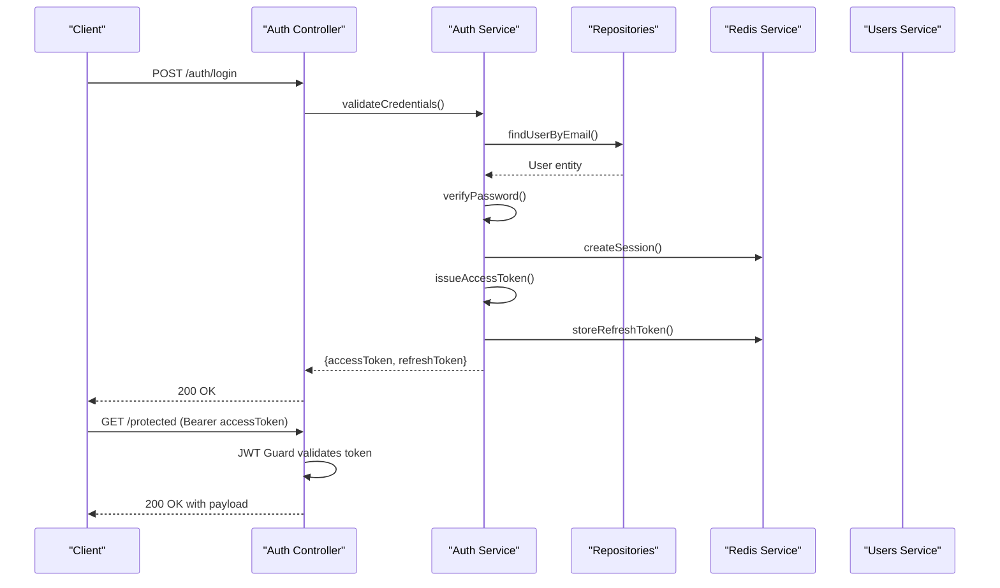

**Diagram sources**
- [auth.controller.ts](file://apps/backend/src/auth/auth.controller.ts)
- [auth.service.ts](file://apps/backend/src/auth/auth.service.ts)
- [jwt.strategy.ts](file://apps/backend/src/auth/strategies/jwt.strategy.ts)
- [jwt.guard.ts](file://apps/backend/src/auth/guards/jwt.guard.ts)
- [session.repository.ts](file://apps/backend/src/auth/repositories/session.repository.ts)
- [refresh-token.repository.ts](file://apps/backend/src/auth/repositories/refresh-token.repository.ts)
- [redis.service.ts](file://apps/backend/src/redis/redis.service.ts)
- [users.service.ts](file://apps/backend/src/users/users.service.ts)

## Detailed Component Analysis

### JWT Token Implementation
- Access Tokens: Short-lived tokens issued after successful authentication; validated by the JWT strategy and guard on each request.
- Refresh Tokens: Long-lived tokens stored in Redis; used to obtain new access tokens without re-authentication.
- Token Payload: Contains minimal user identifiers and roles to support RBAC checks.
- Rotation: On refresh, old refresh tokens are invalidated and new ones issued to mitigate replay attacks.

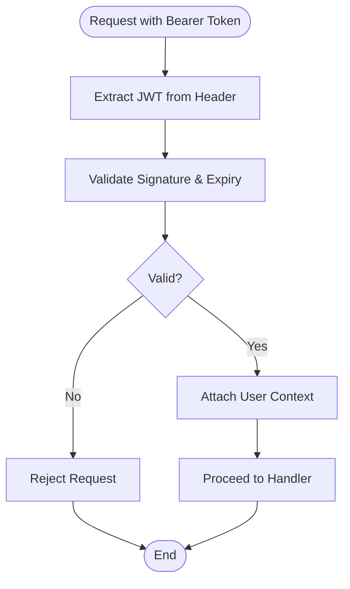

**Diagram sources**
- [jwt.strategy.ts](file://apps/backend/src/auth/strategies/jwt.strategy.ts)
- [jwt.guard.ts](file://apps/backend/src/auth/guards/jwt.guard.ts)

**Section sources**
- [jwt.strategy.ts](file://apps/backend/src/auth/strategies/jwt.strategy.ts)
- [jwt.guard.ts](file://apps/backend/src/auth/guards/jwt.guard.ts)

### Session Management with Redis
- Sessions: Created upon login and stored in Redis with TTL; used to track active sessions and support logout invalidation.
- Lookup: Session repository uses Redis keys scoped by user and device fingerprint.
- Cleanup: Expired sessions are automatically removed by Redis TTL.

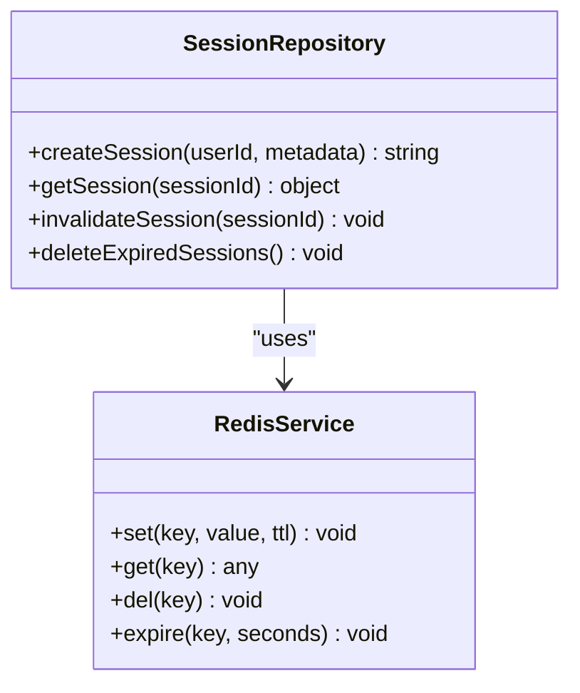

**Diagram sources**
- [session.repository.ts](file://apps/backend/src/auth/repositories/session.repository.ts)
- [redis.service.ts](file://apps/backend/src/redis/redis.service.ts)

**Section sources**
- [session.repository.ts](file://apps/backend/src/auth/repositories/session.repository.ts)
- [redis.service.ts](file://apps/backend/src/redis/redis.service.ts)

### Role-Based Access Control (RBAC)
- Roles: Attached to user profiles and included in JWT payload.
- Roles Guard: Checks required roles declared via decorator against the current user’s roles.
- Decorator Usage: Routes declare minimum roles needed; unauthorized requests are rejected.

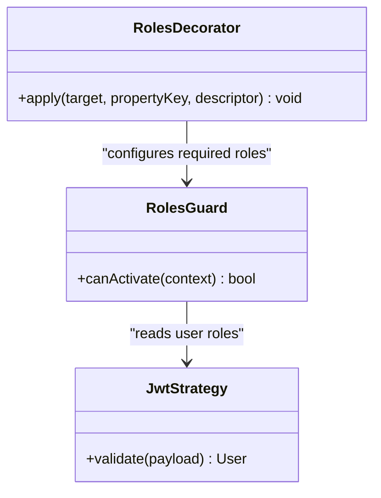

**Diagram sources**
- [roles.guard.ts](file://apps/backend/src/auth/guards/roles.guard.ts)
- [roles.decorator.ts](file://apps/backend/src/auth/decorators/roles.decorator.ts)
- [jwt.strategy.ts](file://apps/backend/src/auth/strategies/jwt.strategy.ts)

**Section sources**
- [roles.guard.ts](file://apps/backend/src/auth/guards/roles.guard.ts)
- [roles.decorator.ts](file://apps/backend/src/auth/decorators/roles.decorator.ts)

### OAuth Integration with Google
- Flow: Redirect to Google, receive callback, exchange code for ID token, create or retrieve user, issue JWTs.
- User Provisioning: If user does not exist, create a minimal profile; link existing accounts if applicable.
- Security: Verify ID token signature and issuer; map scopes to internal roles.

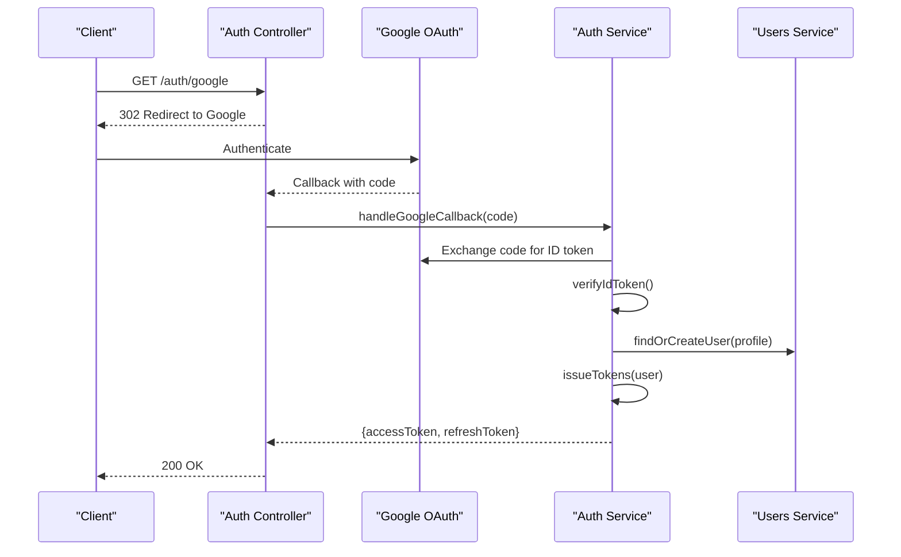

**Diagram sources**
- [google.strategy.ts](file://apps/backend/src/auth/strategies/google.strategy.ts)
- [auth.controller.ts](file://apps/backend/src/auth/auth.controller.ts)
- [auth.service.ts](file://apps/backend/src/auth/auth.service.ts)
- [users.service.ts](file://apps/backend/src/users/users.service.ts)

**Section sources**
- [google.strategy.ts](file://apps/backend/src/auth/strategies/google.strategy.ts)
- [auth.controller.ts](file://apps/backend/src/auth/auth.controller.ts)
- [auth.service.ts](file://apps/backend/src/auth/auth.service.ts)
- [users.service.ts](file://apps/backend/src/users/users.service.ts)

### Guard Implementations and Strategy Configurations
- Local Strategy: Validates username/email and password; returns user object on success.
- JWT Strategy: Parses Authorization header, validates token, attaches user to request context.
- Guards:
  - JWT Guard: Ensures request has a valid token before reaching handlers.
  - Roles Guard: Enforces role requirements declared via decorator.

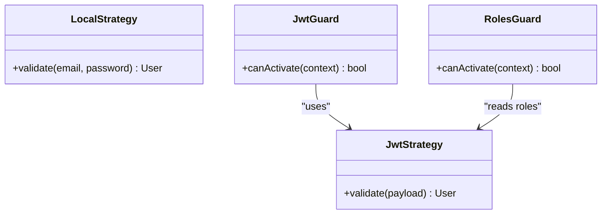

**Diagram sources**
- [local.strategy.ts](file://apps/backend/src/auth/strategies/local.strategy.ts)
- [jwt.strategy.ts](file://apps/backend/src/auth/strategies/jwt.strategy.ts)
- [jwt.guard.ts](file://apps/backend/src/auth/guards/jwt.guard.ts)
- [roles.guard.ts](file://apps/backend/src/auth/guards/roles.guard.ts)

**Section sources**
- [local.strategy.ts](file://apps/backend/src/auth/strategies/local.strategy.ts)
- [jwt.strategy.ts](file://apps/backend/src/auth/strategies/jwt.strategy.ts)
- [jwt.guard.ts](file://apps/backend/src/auth/guards/jwt.guard.ts)
- [roles.guard.ts](file://apps/backend/src/auth/guards/roles.guard.ts)

### Decorator Usage for Protecting Routes
- IsAuthenticated Decorator: Marks endpoints that require a valid JWT; integrates with JWT guard.
- Roles Decorator: Declares required roles; integrated with roles guard for authorization checks.

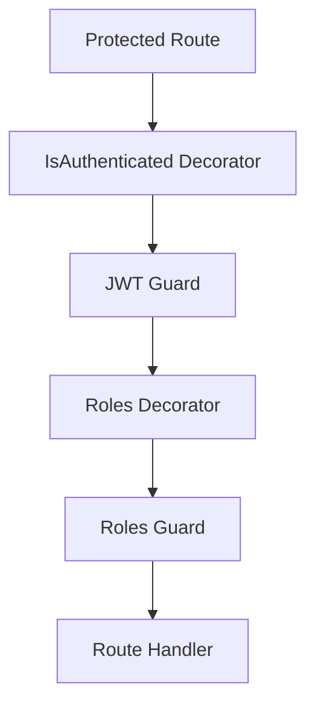

**Diagram sources**
- [is-authenticated.decorator.ts](file://apps/backend/src/auth/decorators/is-authenticated.decorator.ts)
- [roles.decorator.ts](file://apps/backend/src/auth/decorators/roles.decorator.ts)
- [jwt.guard.ts](file://apps/backend/src/auth/guards/jwt.guard.ts)
- [roles.guard.ts](file://apps/backend/src/auth/guards/roles.guard.ts)

**Section sources**
- [is-authenticated.decorator.ts](file://apps/backend/src/auth/decorators/is-authenticated.decorator.ts)
- [roles.decorator.ts](file://apps/backend/src/auth/decorators/roles.decorator.ts)

### Password Hashing Strategies
- Algorithm: Uses a modern, memory-hard algorithm suitable for passwords.
- Storage: Only hashed values are persisted; salts are managed internally.
- Validation: Compare plaintext input with stored hash securely.

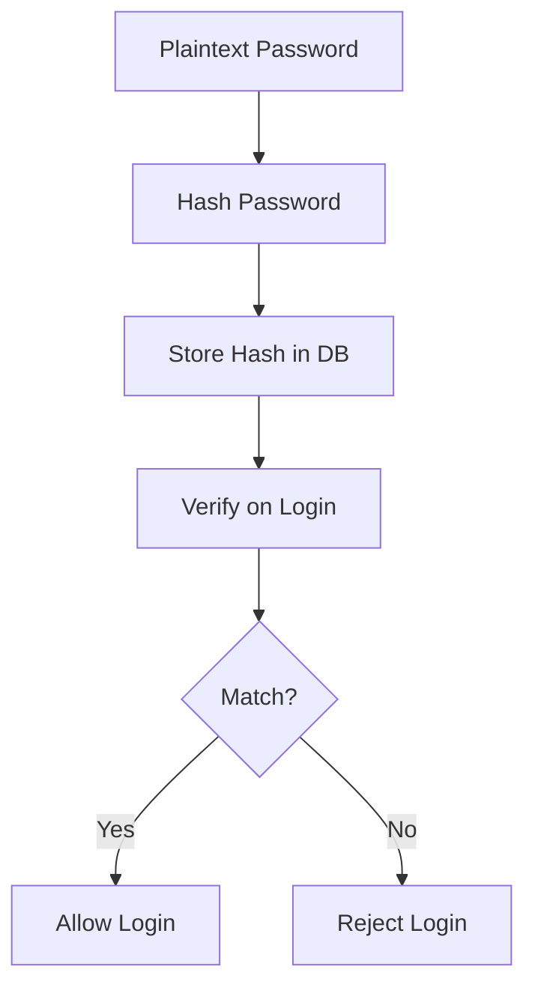

**Diagram sources**
- [password-hashing.service.ts](file://apps/backend/src/auth/services/password-hashing.service.ts)

**Section sources**
- [password-hashing.service.ts](file://apps/backend/src/auth/services/password-hashing.service.ts)

### Email Verification Flow
- Generation: Create a time-bound verification code and store it in Redis.
- Delivery: Send verification email with a link containing the code.
- Verification: Validate code, mark user as verified, and remove temporary data.

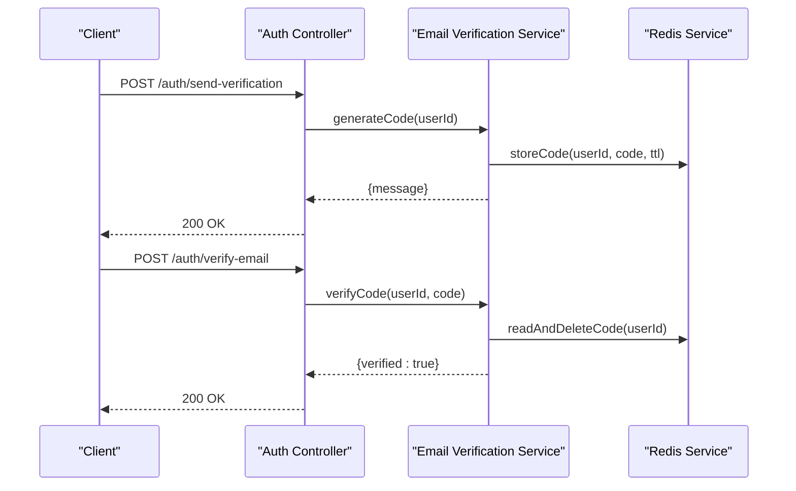

**Diagram sources**
- [email-verification.service.ts](file://apps/backend/src/auth/services/email-verification.service.ts)
- [redis.service.ts](file://apps/backend/src/redis/redis.service.ts)

**Section sources**
- [email-verification.service.ts](file://apps/backend/src/auth/services/email-verification.service.ts)
- [redis.service.ts](file://apps/backend/src/redis/redis.service.ts)

### Refresh Token Mechanisms
- Issuance: On login, a refresh token is generated and stored in Redis with an extended TTL.
- Rotation: On refresh, the old token is invalidated and a new one issued.
- Revocation: Logout invalidates all associated refresh tokens for the user.

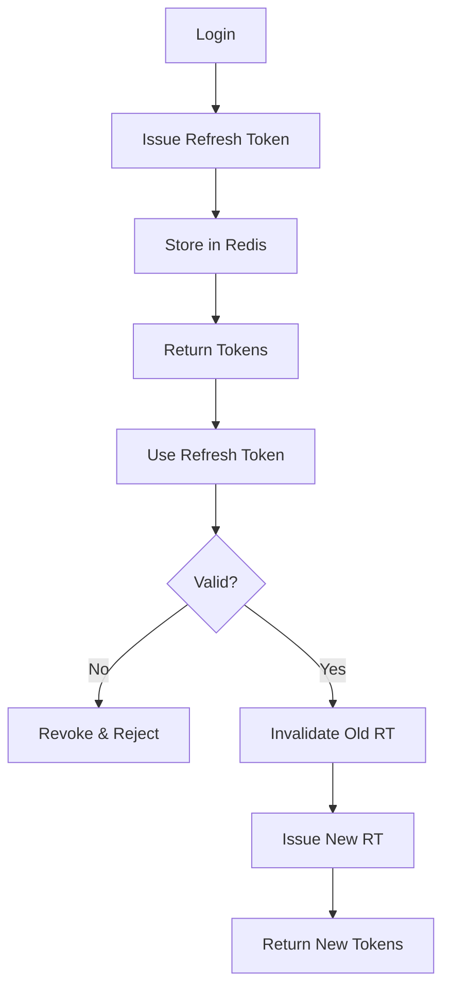

**Diagram sources**
- [refresh-token.repository.ts](file://apps/backend/src/auth/repositories/refresh-token.repository.ts)
- [redis.service.ts](file://apps/backend/src/redis/redis.service.ts)

**Section sources**
- [refresh-token.repository.ts](file://apps/backend/src/auth/repositories/refresh-token.repository.ts)
- [redis.service.ts](file://apps/backend/src/redis/redis.service.ts)

### Relationship with User Management Services
- User Creation: Auth service collaborates with users service to create or update user profiles during registration and OAuth sign-up.
- Profile Updates: Auth workflows may trigger user profile changes (e.g., marking email verified).
- Data Consistency: Repositories ensure consistent state across user, session, and token stores.

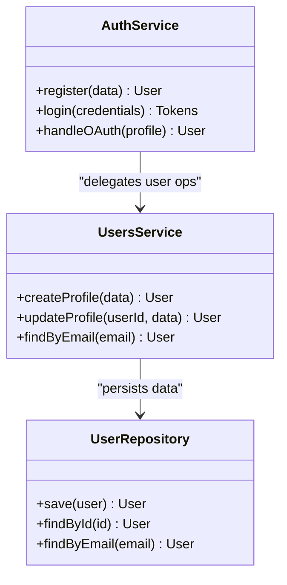

**Diagram sources**
- [auth.service.ts](file://apps/backend/src/auth/auth.service.ts)
- [users.service.ts](file://apps/backend/src/users/users.service.ts)
- [user.repository.ts](file://apps/backend/src/auth/repositories/user.repository.ts)

**Section sources**
- [auth.service.ts](file://apps/backend/src/auth/auth.service.ts)
- [users.service.ts](file://apps/backend/src/users/users.service.ts)
- [user.repository.ts](file://apps/backend/src/auth/repositories/user.repository.ts)

## Dependency Analysis
The auth module depends on several core modules and external services:
- Internal dependencies: users service, redis service, configuration module.
- External integrations: Google OAuth provider.
- Persistence: Prisma-managed database via repositories.

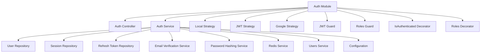

**Diagram sources**
- [auth.module.ts](file://apps/backend/src/auth/auth.module.ts)
- [auth.controller.ts](file://apps/backend/src/auth/auth.controller.ts)
- [auth.service.ts](file://apps/backend/src/auth/auth.service.ts)
- [local.strategy.ts](file://apps/backend/src/auth/strategies/local.strategy.ts)
- [jwt.strategy.ts](file://apps/backend/src/auth/strategies/jwt.strategy.ts)
- [google.strategy.ts](file://apps/backend/src/auth/strategies/google.strategy.ts)
- [jwt.guard.ts](file://apps/backend/src/auth/guards/jwt.guard.ts)
- [roles.guard.ts](file://apps/backend/src/auth/guards/roles.guard.ts)
- [is-authenticated.decorator.ts](file://apps/backend/src/auth/decorators/is-authenticated.decorator.ts)
- [roles.decorator.ts](file://apps/backend/src/auth/decorators/roles.decorator.ts)
- [user.repository.ts](file://apps/backend/src/auth/repositories/user.repository.ts)
- [session.repository.ts](file://apps/backend/src/auth/repositories/session.repository.ts)
- [refresh-token.repository.ts](file://apps/backend/src/auth/repositories/refresh-token.repository.ts)
- [email-verification.service.ts](file://apps/backend/src/auth/services/email-verification.service.ts)
- [password-hashing.service.ts](file://apps/backend/src/auth/services/password-hashing.service.ts)
- [redis.service.ts](file://apps/backend/src/redis/redis.service.ts)
- [users.service.ts](file://apps/backend/src/users/users.service.ts)
- [configuration.ts](file://apps/backend/src/config/configuration.ts)

**Section sources**
- [auth.module.ts](file://apps/backend/src/auth/auth.module.ts)
- [configuration.ts](file://apps/backend/src/config/configuration.ts)

## Performance Considerations
- Stateless JWT Validation: Minimizes server-side lookups per request; rely on cryptographic validation.
- Redis Caching: Fast session and token storage with appropriate TTLs to reduce DB load.
- Token Size: Keep JWT payloads minimal to reduce bandwidth and parsing overhead.
- Rate Limiting: Apply rate limits on sensitive endpoints (login, password reset) to prevent abuse.
- Connection Pooling: Ensure Redis and database connections are pooled and configured for high concurrency.

[No sources needed since this section provides general guidance]

## Troubleshooting Guide
Common issues and resolutions:
- Invalid JWT: Check token expiration, secret configuration, and header format.
- Missing Session: Verify Redis connectivity and session key existence.
- OAuth Errors: Inspect client IDs, secrets, redirect URIs, and scope mappings.
- RBAC Denials: Confirm user roles and decorator declarations match required permissions.
- Email Verification Failures: Ensure Redis TTLs are set and email delivery logs are checked.

**Section sources**
- [jwt.strategy.ts](file://apps/backend/src/auth/strategies/jwt.strategy.ts)
- [session.repository.ts](file://apps/backend/src/auth/repositories/session.repository.ts)
- [google.strategy.ts](file://apps/backend/src/auth/strategies/google.strategy.ts)
- [roles.guard.ts](file://apps/backend/src/auth/guards/roles.guard.ts)
- [email-verification.service.ts](file://apps/backend/src/auth/services/email-verification.service.ts)

## Conclusion
The authentication and authorization system combines robust JWT-based stateless validation with Redis-backed sessions and refresh tokens. RBAC ensures fine-grained access control, while Google OAuth enables seamless third-party logins. The modular design separates concerns across controllers, services, strategies, guards, and repositories, promoting maintainability and scalability. Adhering to security best practices—secure hashing, token rotation, and strict role enforcement—ensures a resilient authentication pipeline.