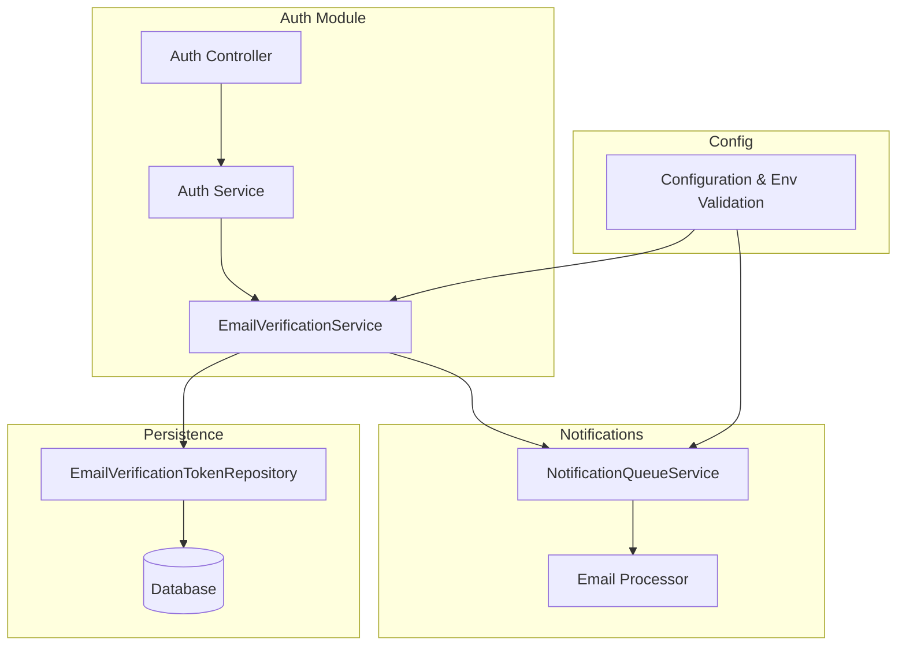
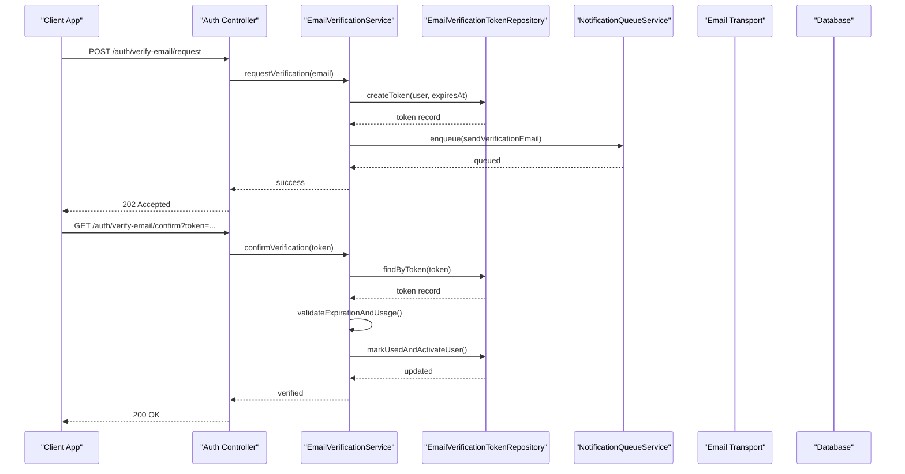
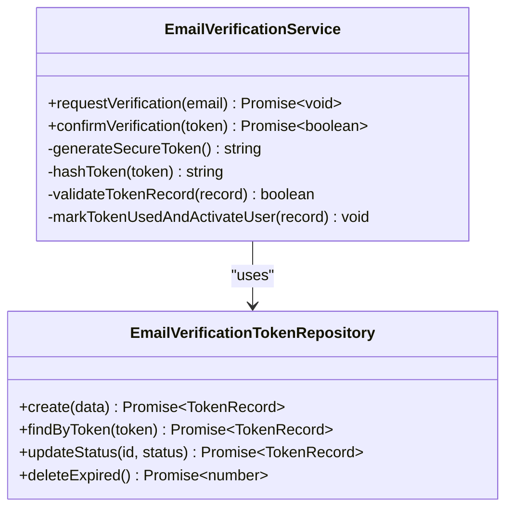
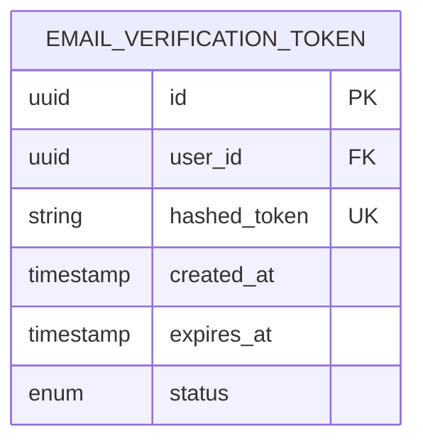
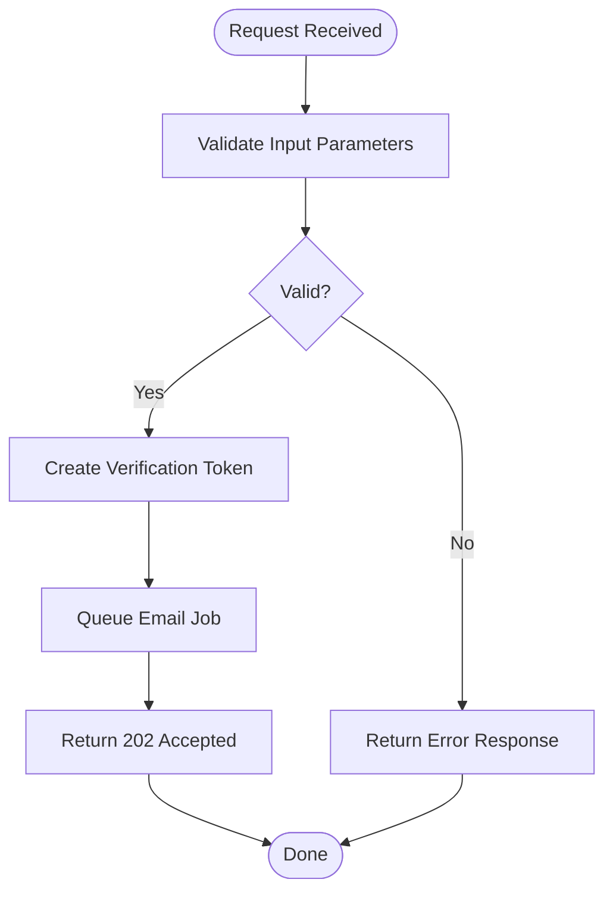
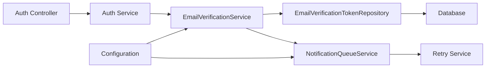

# Email Verification System

<cite>
**Referenced Files in This Document**
- [auth.module.ts](file://apps/backend/src/auth/auth.module.ts)
- [auth.controller.ts](file://apps/backend/src/auth/auth.controller.ts)
- [auth.service.ts](file://apps/backend/src/auth/auth.service.ts)
- [email-verification.service.ts](file://apps/backend/src/auth/services/email-verification.service.ts)
- [email-verification-token.repository.ts](file://apps/backend/src/auth/repositories/email-verification-token.repository.ts)
- [configuration.ts](file://apps/backend/src/config/configuration.ts)
- [env.validation.ts](file://apps/backend/src/config/env.validation.ts)
- [schema.prisma](file://apps/backend/prisma/schema.prisma)
- [notifications.module.ts](file://apps/backend/src/notifications/notifications.module.ts)
- [notification-queue.service.ts](file://apps/backend/src/notifications/notification-queue.service.ts)
- [retry.service.ts](file://apps/backend/src/common/retry/retry.service.ts)
</cite>

## Table of Contents
1. [Introduction](#introduction)
2. [Project Structure](#project-structure)
3. [Core Components](#core-components)
4. [Architecture Overview](#architecture-overview)
5. [Detailed Component Analysis](#detailed-component-analysis)
6. [Dependency Analysis](#dependency-analysis)
7. [Performance Considerations](#performance-considerations)
8. [Troubleshooting Guide](#troubleshooting-guide)
9. [Conclusion](#conclusion)
10. [Appendices](#appendices)

## Introduction
This document explains the email verification system used to verify user email addresses. It covers token generation, email template rendering, and the end-to-end verification workflow. It also documents the EmailVerificationService for token lifecycle management, the EmailVerificationTokenRepository for database operations, controller endpoints for initiating and completing verification, email transport configuration, retry mechanisms, and security considerations for verification tokens.

## Project Structure
The email verification feature is implemented within the backend NestJS application under the auth module, with supporting components in notifications and common utilities:
- Auth module exposes controllers and services related to authentication and email verification.
- The EmailVerificationService encapsulates token creation, validation, expiration handling, and coordination with email sending.
- The EmailVerificationTokenRepository persists verification tokens and manages their state.
- Notifications module integrates with queues and processors to send emails reliably.
- Configuration files define environment variables for email transport and token policies.
- Prisma schema defines the verification token entity and its fields.

**Diagram sources**
- [auth.controller.ts](file://apps/backend/src/auth/auth.controller.ts)
- [auth.service.ts](file://apps/backend/src/auth/auth.service.ts)
- [email-verification.service.ts](file://apps/backend/src/auth/services/email-verification.service.ts)
- [email-verification-token.repository.ts](file://apps/backend/src/auth/repositories/email-verification-token.repository.ts)
- [notification-queue.service.ts](file://apps/backend/src/notifications/notification-queue.service.ts)
- [configuration.ts](file://apps/backend/src/config/configuration.ts)
- [env.validation.ts](file://apps/backend/src/config/env.validation.ts)
- [schema.prisma](file://apps/backend/prisma/schema.prisma)

**Section sources**
- [auth.module.ts](file://apps/backend/src/auth/auth.module.ts)
- [auth.controller.ts](file://apps/backend/src/auth/auth.controller.ts)
- [auth.service.ts](file://apps/backend/src/auth/auth.service.ts)
- [email-verification.service.ts](file://apps/backend/src/auth/services/email-verification.service.ts)
- [email-verification-token.repository.ts](file://apps/backend/src/auth/repositories/email-verification-token.repository.ts)
- [configuration.ts](file://apps/backend/src/config/configuration.ts)
- [env.validation.ts](file://apps/backend/src/config/env.validation.ts)
- [schema.prisma](file://apps/backend/prisma/schema.prisma)
- [notifications.module.ts](file://apps/backend/src/notifications/notifications.module.ts)
- [notification-queue.service.ts](file://apps/backend/src/notifications/notification-queue.service.ts)

## Core Components
- EmailVerificationService: Orchestrates token creation, validation, expiration checks, and triggers email delivery. It enforces token policies such as lifetime and single-use behavior.
- EmailVerificationTokenRepository: Provides persistence operations for verification tokens (create, find by token/user, update status, delete expired).
- Auth Controller: Exposes endpoints to initiate verification (send link) and complete verification (validate token and mark email verified).
- Notification Queue: Queues email jobs for reliable asynchronous delivery with retries.
- Configuration: Centralizes environment-based settings for email transport and token policy parameters.

Key responsibilities and interactions:
- Token generation uses a secure random source and stores hashed values to prevent token leakage.
- Email templates are rendered using configured template engines and sent via the notification queue.
- Verification endpoint validates the token, checks expiration, marks it used, and updates the user’s email status.

**Section sources**
- [email-verification.service.ts](file://apps/backend/src/auth/services/email-verification.service.ts)
- [email-verification-token.repository.ts](file://apps/backend/src/auth/repositories/email-verification-token.repository.ts)
- [auth.controller.ts](file://apps/backend/src/auth/auth.controller.ts)
- [notification-queue.service.ts](file://apps/backend/src/notifications/notification-queue.service.ts)
- [configuration.ts](file://apps/backend/src/config/configuration.ts)

## Architecture Overview
The email verification flow spans HTTP endpoints, service orchestration, repository persistence, and asynchronous email delivery.

**Diagram sources**
- [auth.controller.ts](file://apps/backend/src/auth/auth.controller.ts)
- [email-verification.service.ts](file://apps/backend/src/auth/services/email-verification.service.ts)
- [email-verification-token.repository.ts](file://apps/backend/src/auth/repositories/email-verification-token.repository.ts)
- [notification-queue.service.ts](file://apps/backend/src/notifications/notification-queue.service.ts)

## Detailed Component Analysis

### EmailVerificationService
Responsibilities:
- Generate secure tokens and persist them with expiration metadata.
- Validate tokens for usage, expiration, and association with the correct user.
- Trigger email delivery through the notification queue.
- Update user email verification status upon successful confirmation.

Implementation highlights:
- Uses cryptographic randomness for token generation.
- Stores only hashed tokens to mitigate exposure risks.
- Enforces single-use semantics and expiration windows.
- Coordinates with the repository for atomic state transitions.

**Diagram sources**
- [email-verification.service.ts](file://apps/backend/src/auth/services/email-verification.service.ts)
- [email-verification-token.repository.ts](file://apps/backend/src/auth/repositories/email-verification-token.repository.ts)

**Section sources**
- [email-verification.service.ts](file://apps/backend/src/auth/services/email-verification.service.ts)
- [email-verification-token.repository.ts](file://apps/backend/src/auth/repositories/email-verification-token.repository.ts)

### EmailVerificationTokenRepository
Responsibilities:
- Create new verification token records with hashed token values and expiration timestamps.
- Retrieve tokens by value or associated user identifiers.
- Update token status (pending, used, expired) and clean up expired entries.

Data model:
- Fields include hashed token, user identifier, created timestamp, expiration timestamp, and status flags.

**Diagram sources**
- [schema.prisma](file://apps/backend/prisma/schema.prisma)
- [email-verification-token.repository.ts](file://apps/backend/src/auth/repositories/email-verification-token.repository.ts)

**Section sources**
- [email-verification-token.repository.ts](file://apps/backend/src/auth/repositories/email-verification-token.repository.ts)
- [schema.prisma](file://apps/backend/prisma/schema.prisma)

### Controller Endpoints
Endpoints:
- Initiate verification: Accepts an email address, creates a token, and sends a verification email asynchronously.
- Complete verification: Validates the provided token, ensures it is valid and not expired, marks it used, and activates the user’s email.

Behavior:
- Initiation returns an accepted response indicating queuing of the email job.
- Completion returns a success response when the token is valid and processed; otherwise returns appropriate error codes.

**Diagram sources**
- [auth.controller.ts](file://apps/backend/src/auth/auth.controller.ts)
- [email-verification.service.ts](file://apps/backend/src/auth/services/email-verification.service.ts)

**Section sources**
- [auth.controller.ts](file://apps/backend/src/auth/auth.controller.ts)

### Email Template Rendering and Transport
Template rendering:
- Templates are resolved using a configured template engine and injected with dynamic data such as verification link and expiration details.

Transport configuration:
- Email transport is configured via environment variables managed by the configuration module.
- The notification queue handles asynchronous delivery and integrates with the chosen transport provider.

Retry mechanisms:
- The notification queue leverages retry strategies to handle transient failures during email delivery.
- Retry policies can be tuned based on environment and operational requirements.

Security considerations:
- Tokens are stored as hashes to prevent exposure even if the database is compromised.
- Links contain short-lived tokens with strict expiration windows.
- Rate limiting should be applied at the controller level to prevent abuse.

**Section sources**
- [configuration.ts](file://apps/backend/src/config/configuration.ts)
- [env.validation.ts](file://apps/backend/src/config/env.validation.ts)
- [notification-queue.service.ts](file://apps/backend/src/notifications/notification-queue.service.ts)
- [retry.service.ts](file://apps/backend/src/common/retry/retry.service.ts)

## Dependency Analysis
The email verification system depends on several modules and services:
- Auth module wires together controllers, services, and repositories.
- EmailVerificationService depends on the repository for persistence and the notification queue for email delivery.
- Configuration provides environment-driven settings for both token policies and email transport.
- Prisma schema defines the token entity and relationships.

**Diagram sources**
- [auth.controller.ts](file://apps/backend/src/auth/auth.controller.ts)
- [auth.service.ts](file://apps/backend/src/auth/auth.service.ts)
- [email-verification.service.ts](file://apps/backend/src/auth/services/email-verification.service.ts)
- [email-verification-token.repository.ts](file://apps/backend/src/auth/repositories/email-verification-token.repository.ts)
- [notification-queue.service.ts](file://apps/backend/src/notifications/notification-queue.service.ts)
- [retry.service.ts](file://apps/backend/src/common/retry/retry.service.ts)
- [configuration.ts](file://apps/backend/src/config/configuration.ts)

**Section sources**
- [auth.module.ts](file://apps/backend/src/auth/auth.module.ts)
- [auth.controller.ts](file://apps/backend/src/auth/auth.controller.ts)
- [auth.service.ts](file://apps/backend/src/auth/auth.service.ts)
- [email-verification.service.ts](file://apps/backend/src/auth/services/email-verification.service.ts)
- [email-verification-token.repository.ts](file://apps/backend/src/auth/repositories/email-verification-token.repository.ts)
- [notification-queue.service.ts](file://apps/backend/src/notifications/notification-queue.service.ts)
- [retry.service.ts](file://apps/backend/src/common/retry/retry.service.ts)
- [configuration.ts](file://apps/backend/src/config/configuration.ts)

## Performance Considerations
- Asynchronous email delivery via queues reduces request latency and improves throughput.
- Token lookup operations should be indexed by hashed token and user ID for fast retrieval.
- Batch cleanup of expired tokens minimizes database load over time.
- Caching frequently accessed configuration values avoids repeated environment reads.

[No sources needed since this section provides general guidance]

## Troubleshooting Guide
Common issues and resolutions:
- Email not received: Check queue worker logs, transport configuration, and retry attempts.
- Token invalid or expired: Ensure the link was clicked promptly and that expiration settings align with user expectations.
- Duplicate verification attempts: Verify single-use enforcement and idempotency in the confirmation endpoint.
- Database errors: Inspect repository operations and ensure proper transaction boundaries and constraints.

Operational tips:
- Monitor queue depth and processing latency.
- Log token lifecycle events without exposing sensitive values.
- Use health checks to verify transport connectivity and queue availability.

**Section sources**
- [notification-queue.service.ts](file://apps/backend/src/notifications/notification-queue.service.ts)
- [email-verification.service.ts](file://apps/backend/src/auth/services/email-verification.service.ts)
- [email-verification-token.repository.ts](file://apps/backend/src/auth/repositories/email-verification-token.repository.ts)

## Conclusion
The email verification system combines secure token generation, robust persistence, asynchronous email delivery, and configurable policies to provide a reliable verification experience. By leveraging queues and retry mechanisms, it maintains performance and resilience while enforcing strong security practices around token handling and expiration.

[No sources needed since this section summarizes without analyzing specific files]

## Appendices
- Security best practices:
  - Always hash tokens before storage.
  - Enforce short lifetimes and single-use semantics.
  - Apply rate limiting and input validation at endpoints.
  - Avoid logging sensitive token values.
- Configuration checklist:
  - Set email transport credentials securely.
  - Define token expiration and retry policies per environment.
  - Validate all environment variables at startup.

[No sources needed since this section provides general guidance]