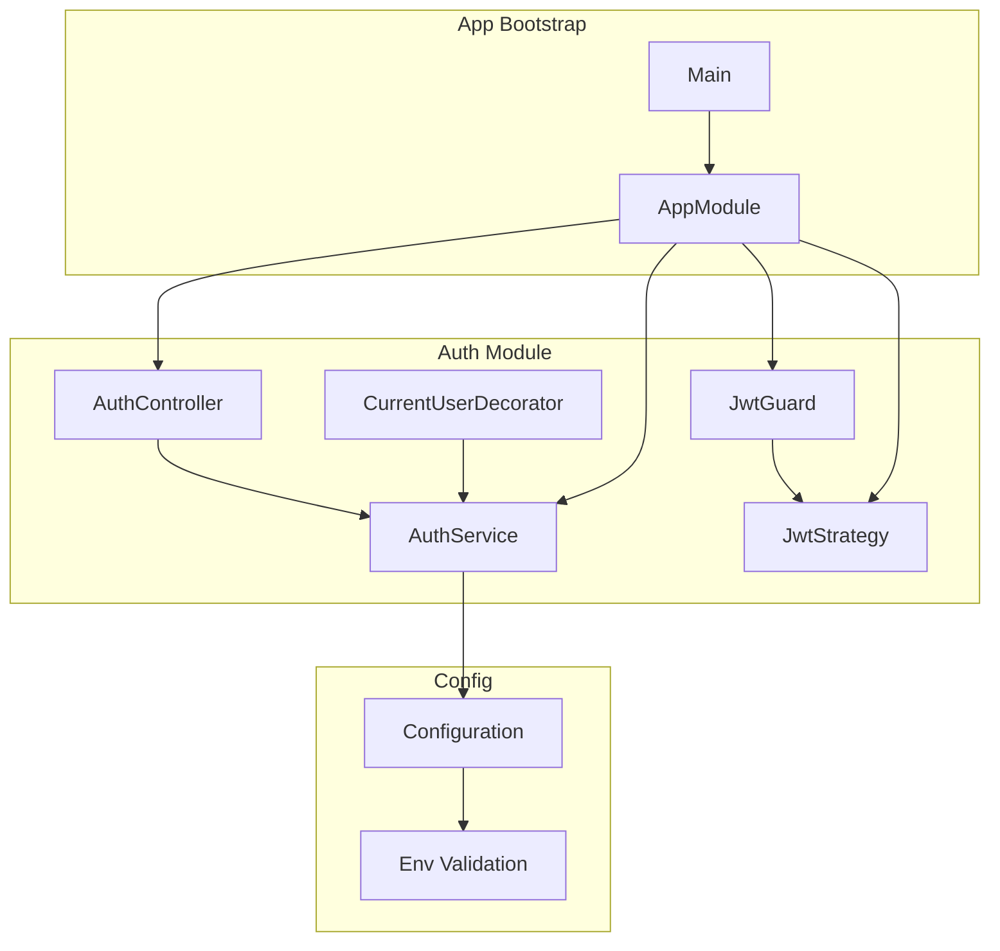
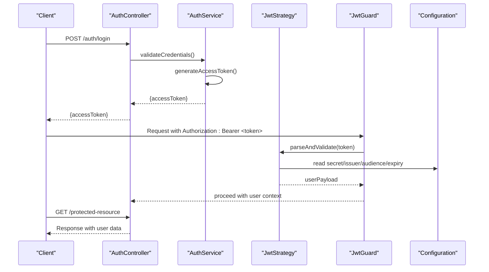
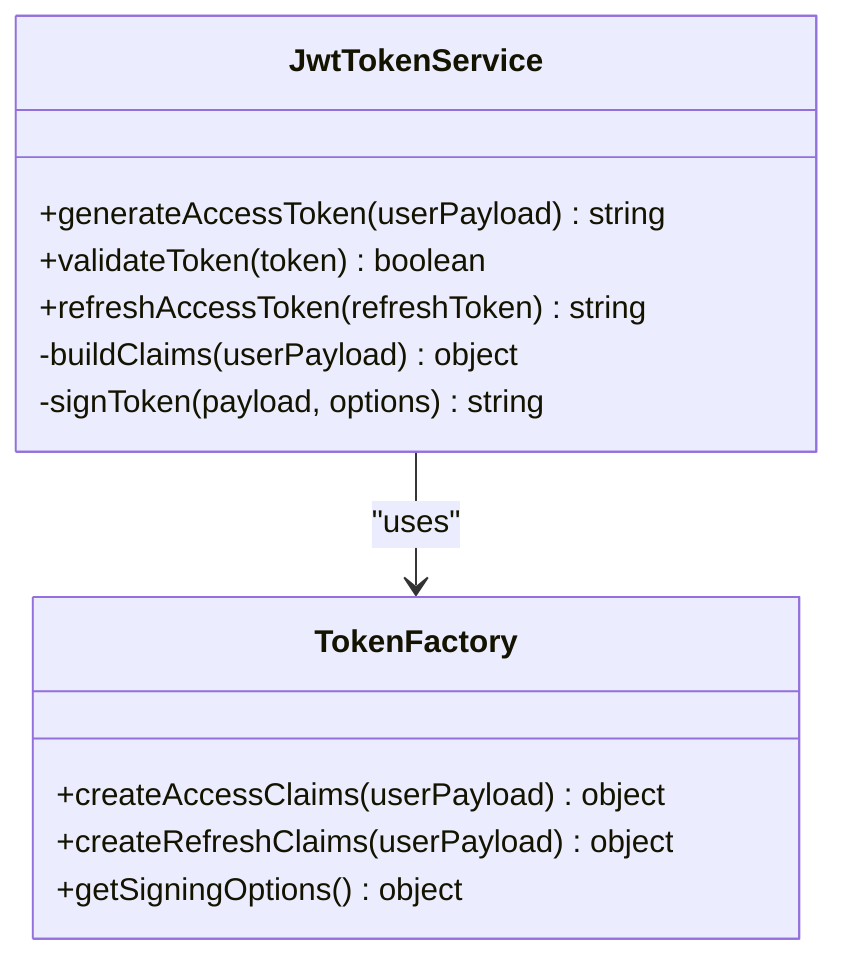
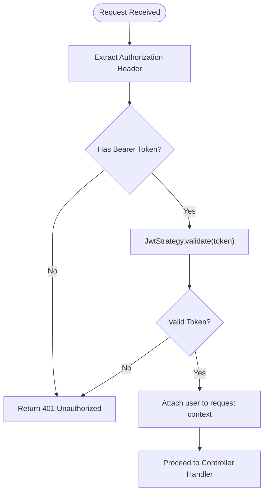
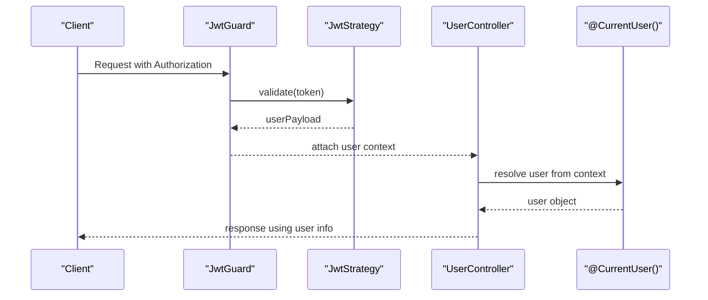
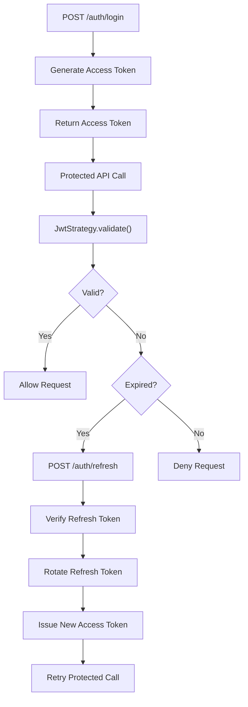
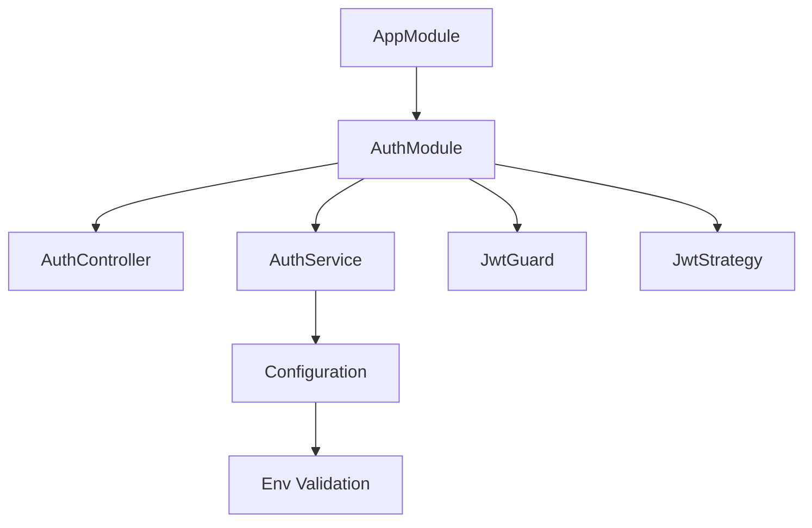

# JWT Authentication & Token Management

<cite>
**Referenced Files in This Document**
- [auth.module.ts](file://apps/backend/src/auth/auth.module.ts)
- [auth.service.ts](file://apps/backend/src/auth/auth.service.ts)
- [auth.controller.ts](file://apps/backend/src/auth/auth.controller.ts)
- [jwt.strategy.ts](file://apps/backend/src/auth/strategies/jwt.strategy.ts)
- [jwt.guard.ts](file://apps/backend/src/auth/guards/jwt.guard.ts)
- [current-user.decorator.ts](file://apps/backend/src/auth/decorators/current-user.decorator.ts)
- [configuration.ts](file://apps/backend/src/config/configuration.ts)
- [env.validation.ts](file://apps/backend/src/config/env.validation.ts)
- [app.module.ts](file://apps/backend/src/app.module.ts)
- [main.ts](file://apps/backend/src/main.ts)
</cite>

## Table of Contents
1. [Introduction](#introduction)
2. [Project Structure](#project-structure)
3. [Core Components](#core-components)
4. [Architecture Overview](#architecture-overview)
5. [Detailed Component Analysis](#detailed-component-analysis)
6. [Dependency Analysis](#dependency-analysis)
7. [Performance Considerations](#performance-considerations)
8. [Troubleshooting Guide](#troubleshooting-guide)
9. [Conclusion](#conclusion)
10. [Appendices](#appendices)

## Introduction
This document explains the JWT authentication system implemented in the backend application. It covers the token lifecycle (generation, validation, refresh), the JwtTokenService and related factory patterns, guard configurations for protecting routes, and the current user decorator used to extract authenticated user context from requests. Security considerations such as token expiration, rotation strategies, and secure storage practices are also included. Examples demonstrate how to protect routes with JWT guards and access user information in controllers.

## Project Structure
The JWT authentication implementation is organized under the auth module and integrates with configuration and core modules. Key areas include:
- Controllers handling login and token endpoints
- Services implementing token generation and validation logic
- Guards enforcing authentication on protected routes
- Strategies parsing and validating JWTs
- Decorators injecting the current user into controller methods
- Configuration files defining environment variables and validation schemas

**Diagram sources**
- [auth.controller.ts](file://apps/backend/src/auth/auth.controller.ts)
- [auth.service.ts](file://apps/backend/src/auth/auth.service.ts)
- [jwt.guard.ts](file://apps/backend/src/auth/guards/jwt.guard.ts)
- [jwt.strategy.ts](file://apps/backend/src/auth/strategies/jwt.strategy.ts)
- [current-user.decorator.ts](file://apps/backend/src/auth/decorators/current-user.decorator.ts)
- [configuration.ts](file://apps/backend/src/config/configuration.ts)
- [env.validation.ts](file://apps/backend/src/config/env.validation.ts)
- [app.module.ts](file://apps/backend/src/app.module.ts)
- [main.ts](file://apps/backend/src/main.ts)

**Section sources**
- [auth.module.ts](file://apps/backend/src/auth/auth.module.ts)
- [app.module.ts](file://apps/backend/src/app.module.ts)
- [main.ts](file://apps/backend/src/main.ts)

## Core Components
- AuthController: Exposes endpoints for login and token operations. It orchestrates AuthService calls and returns standardized responses.
- AuthService: Implements business logic for issuing tokens, validating them, and managing refresh flows. It interacts with configuration for secrets and expiration settings.
- JwtGuard: Enforces authentication by validating the JWT present in request headers before allowing route handlers to execute.
- JwtStrategy: Parses and validates JWTs using configured algorithms and keys, attaching user payload to the request context.
- CurrentUserDecorator: Injects the authenticated user object into controller method parameters based on the validated token payload.
- Configuration and Env Validation: Provide strongly-typed access to JWT secrets, issuer, audience, and expiration durations, ensuring safe runtime behavior.

**Section sources**
- [auth.controller.ts](file://apps/backend/src/auth/auth.controller.ts)
- [auth.service.ts](file://apps/backend/src/auth/auth.service.ts)
- [jwt.guard.ts](file://apps/backend/src/auth/guards/jwt.guard.ts)
- [jwt.strategy.ts](file://apps/backend/src/auth/strategies/jwt.strategy.ts)
- [current-user.decorator.ts](file://apps/backend/src/auth/decorators/current-user.decorator.ts)
- [configuration.ts](file://apps/backend/src/config/configuration.ts)
- [env.validation.ts](file://apps/backend/src/config/env.validation.ts)

## Architecture Overview
The JWT flow follows a standard pattern: clients authenticate via an endpoint, receive short-lived access tokens, and optionally use refresh tokens to obtain new access tokens without re-authentication. Protected routes require a valid JWT in the Authorization header. The strategy extracts claims, validates signatures and expiration, and attaches the user context. Guards enforce presence and validity of the token before controller execution.

**Diagram sources**
- [auth.controller.ts](file://apps/backend/src/auth/auth.controller.ts)
- [auth.service.ts](file://apps/backend/src/auth/auth.service.ts)
- [jwt.strategy.ts](file://apps/backend/src/auth/strategies/jwt.strategy.ts)
- [jwt.guard.ts](file://apps/backend/src/auth/guards/jwt.guard.ts)
- [configuration.ts](file://apps/backend/src/config/configuration.ts)

## Detailed Component Analysis

### JwtTokenService and Token Factory Patterns
- Responsibilities:
  - Generate access tokens with appropriate claims (user ID, roles, scopes).
  - Validate tokens against signature, issuer, audience, and expiration.
  - Support refresh token issuance and rotation when applicable.
- Factory Pattern:
  - Centralizes token creation with consistent payloads and signing options.
  - Allows swapping implementations or adding custom claims through factory methods.
- Refresh Mechanism:
  - Issues refresh tokens with longer lifetimes.
  - On refresh, rotates refresh tokens to mitigate replay attacks.
  - Validates client identity and ensures no concurrent session abuse.

**Diagram sources**
- [auth.service.ts](file://apps/backend/src/auth/auth.service.ts)
- [configuration.ts](file://apps/backend/src/config/configuration.ts)

**Section sources**
- [auth.service.ts](file://apps/backend/src/auth/auth.service.ts)
- [configuration.ts](file://apps/backend/src/config/configuration.ts)

### Guard Configurations
- JwtGuard enforces authentication by:
  - Extracting the Authorization header.
  - Delegating to JwtStrategy for parsing and validation.
  - Attaching the authenticated user to the request context.
- Route Protection:
  - Apply @UseGuards(JwtAuthGuard) at controller or method level to restrict access.
  - Combine with role-based guards if needed for authorization.

**Diagram sources**
- [jwt.guard.ts](file://apps/backend/src/auth/guards/jwt.guard.ts)
- [jwt.strategy.ts](file://apps/backend/src/auth/strategies/jwt.strategy.ts)

**Section sources**
- [jwt.guard.ts](file://apps/backend/src/auth/guards/jwt.guard.ts)
- [jwt.strategy.ts](file://apps/backend/src/auth/strategies/jwt.strategy.ts)

### Current User Decorator Usage
- Purpose:
  - Inject the authenticated user object directly into controller method parameters.
  - Avoid manual extraction and validation boilerplate in handlers.
- Behavior:
  - Reads the user context attached by JwtStrategy during request processing.
  - Throws an error if no authenticated user is present.
- Example usage:
  - Define a controller method parameter decorated with @CurrentUser().
  - Access properties like user.id, user.roles within the handler.

**Diagram sources**
- [current-user.decorator.ts](file://apps/backend/src/auth/decorators/current-user.decorator.ts)
- [jwt.guard.ts](file://apps/backend/src/auth/guards/jwt.guard.ts)
- [jwt.strategy.ts](file://apps/backend/src/auth/strategies/jwt.strategy.ts)

**Section sources**
- [current-user.decorator.ts](file://apps/backend/src/auth/decorators/current-user.decorator.ts)

### Token Lifecycle: Generation, Validation, Refresh
- Generation:
  - Upon successful login, AuthService generates an access token with short expiration.
  - Optionally issues a refresh token with longer lifetime.
- Validation:
  - JwtStrategy validates signature, issuer, audience, and expiration on each request.
  - Invalid or expired tokens result in unauthorized responses.
- Refresh:
  - Client sends refresh token to a dedicated endpoint.
  - AuthService verifies refresh token integrity and rotates it.
  - New access token issued; old refresh token invalidated.

**Diagram sources**
- [auth.controller.ts](file://apps/backend/src/auth/auth.controller.ts)
- [auth.service.ts](file://apps/backend/src/auth/auth.service.ts)
- [jwt.strategy.ts](file://apps/backend/src/auth/strategies/jwt.strategy.ts)

**Section sources**
- [auth.controller.ts](file://apps/backend/src/auth/auth.controller.ts)
- [auth.service.ts](file://apps/backend/src/auth/auth.service.ts)
- [jwt.strategy.ts](file://apps/backend/src/auth/strategies/jwt.strategy.ts)

## Dependency Analysis
- Modules:
  - AppModule registers AuthModule and global guards/interceptors.
  - Main bootstraps the NestJS application and applies global configuration.
- AuthModule:
  - Provides AuthService, JwtStrategy, JwtGuard, and decorators.
  - Integrates with configuration for JWT secrets and expiration.
- External Dependencies:
  - JWT libraries for signing and verification.
  - Environment validation for secure configuration.

**Diagram sources**
- [app.module.ts](file://apps/backend/src/app.module.ts)
- [auth.module.ts](file://apps/backend/src/auth/auth.module.ts)
- [configuration.ts](file://apps/backend/src/config/configuration.ts)
- [env.validation.ts](file://apps/backend/src/config/env.validation.ts)

**Section sources**
- [app.module.ts](file://apps/backend/src/app.module.ts)
- [auth.module.ts](file://apps/backend/src/auth/auth.module.ts)
- [configuration.ts](file://apps/backend/src/config/configuration.ts)
- [env.validation.ts](file://apps/backend/src/config/env.validation.ts)

## Performance Considerations
- Token Size: Keep payloads minimal to reduce bandwidth and parsing overhead.
- Signing Algorithm: Use efficient algorithms suitable for your threat model (e.g., RS256 for asymmetric signing).
- Caching: Consider caching public keys for asymmetric verification to avoid repeated fetches.
- Rotation: Implement refresh token rotation to limit exposure while maintaining performance.
- Expiration: Short-lived access tokens reduce risk and server-side state requirements.

[No sources needed since this section provides general guidance]

## Troubleshooting Guide
Common issues and resolutions:
- 401 Unauthorized:
  - Missing or malformed Authorization header.
  - Invalid or expired token.
  - Mismatched issuer or audience.
- 403 Forbidden:
  - Insufficient permissions after successful authentication.
- Refresh Failures:
  - Expired or revoked refresh token.
  - Client mismatch or invalid grant type.
- Debugging Steps:
  - Log token payload (without secrets) to verify claims.
  - Validate environment variables for JWT secrets and issuers.
  - Ensure guards are applied to protected routes.

**Section sources**
- [jwt.guard.ts](file://apps/backend/src/auth/guards/jwt.guard.ts)
- [jwt.strategy.ts](file://apps/backend/src/auth/strategies/jwt.strategy.ts)
- [configuration.ts](file://apps/backend/src/config/configuration.ts)

## Conclusion
The JWT authentication system provides a robust foundation for securing API endpoints. By combining short-lived access tokens, refresh token rotation, and strict validation via strategies and guards, the application maintains security and usability. The current user decorator simplifies accessing authenticated context in controllers. Proper configuration and secure storage practices ensure resilience against common threats.

[No sources needed since this section summarizes without analyzing specific files]

## Appendices

### Security Considerations
- Token Expiration:
  - Set short access token lifetimes to minimize risk.
  - Use refresh tokens with controlled rotation policies.
- Rotation Strategies:
  - Invalidate previous refresh tokens upon use to prevent replay.
  - Track active sessions if necessary for revocation.
- Secure Storage Practices:
  - Store secrets in environment variables or secret managers.
  - Avoid logging sensitive data such as tokens or secrets.
  - Use HTTPS exclusively for all authentication flows.

[No sources needed since this section provides general guidance]

### Examples: Protecting Routes and Accessing User Info
- Protecting Routes:
  - Apply the JWT guard to controller methods or classes to enforce authentication.
- Accessing User Information:
  - Use the current user decorator to inject the authenticated user into controller methods.
  - Reference user properties such as id, roles, and scopes for authorization decisions.

[No sources needed since this section provides general guidance]