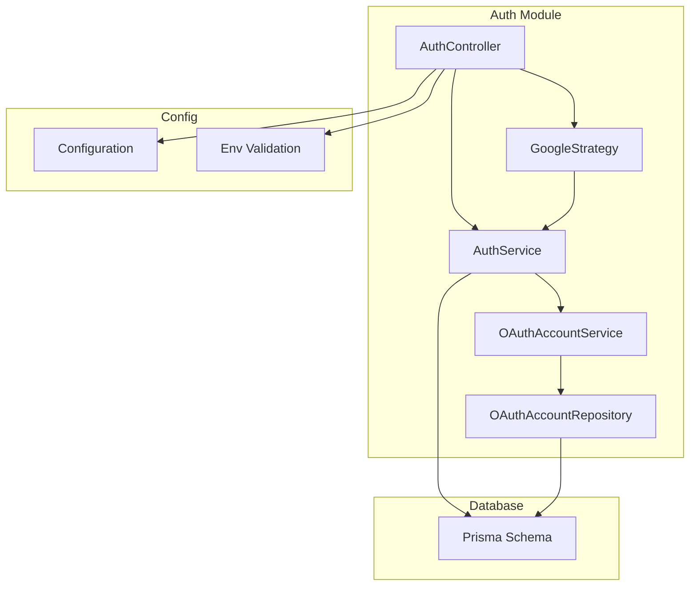
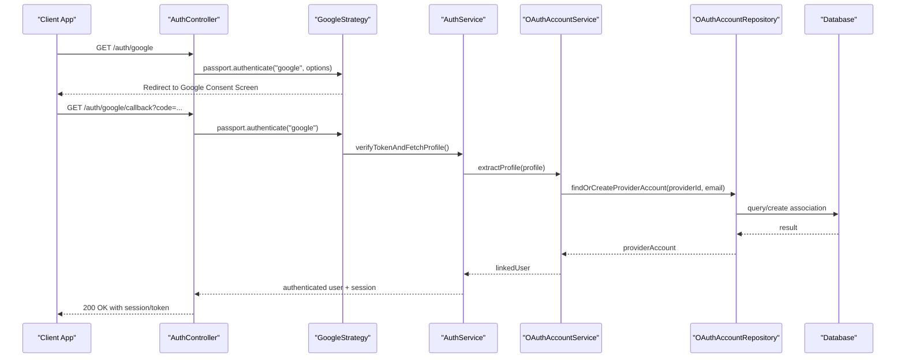
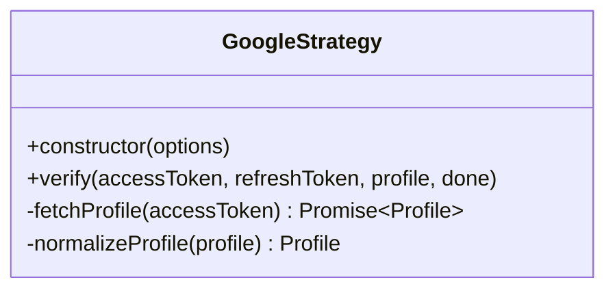
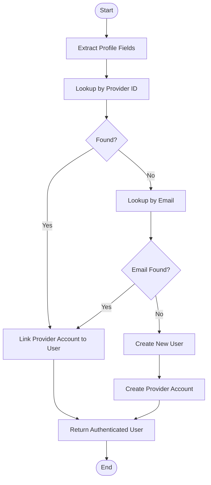
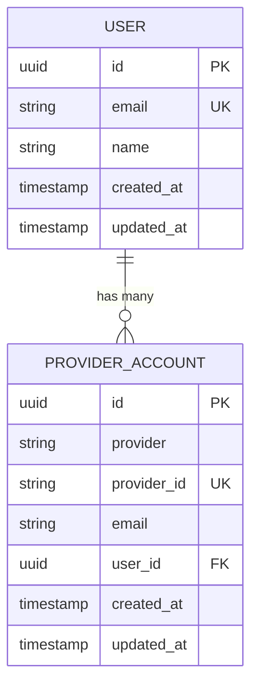
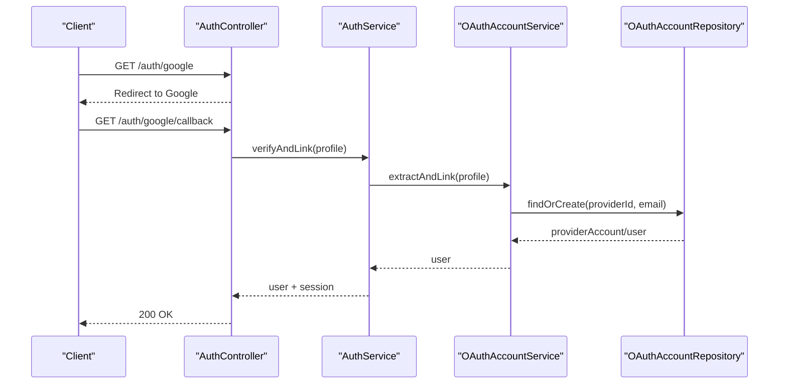
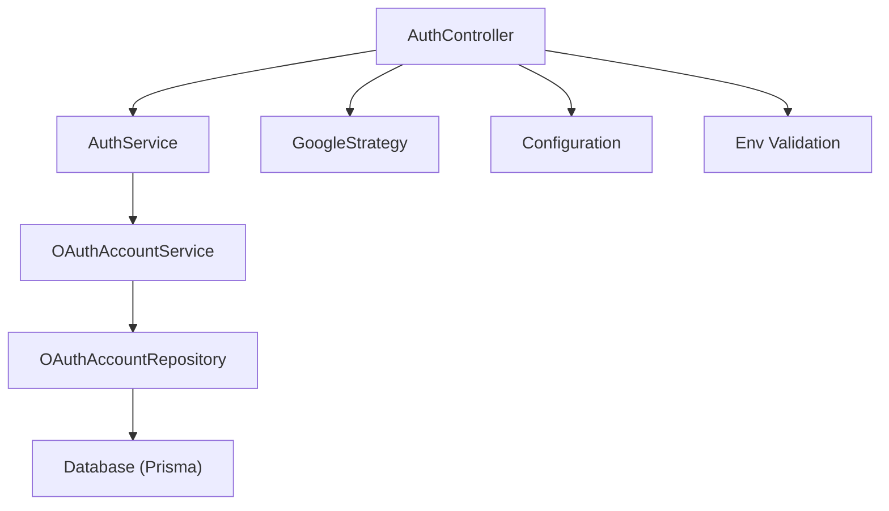

# OAuth Integration (Google)

<cite>
**Referenced Files in This Document**
- [auth.module.ts](file://apps/backend/src/auth/auth.module.ts)
- [auth.controller.ts](file://apps/backend/src/auth/auth.controller.ts)
- [auth.service.ts](file://apps/backend/src/auth/auth.service.ts)
- [configuration.ts](file://apps/backend/src/config/configuration.ts)
- [env.validation.ts](file://apps/backend/src/config/env.validation.ts)
- [strategies/google.strategy.ts](file://apps/backend/src/auth/strategies/google.strategy.ts)
- [services/oauth-account.service.ts](file://apps/backend/src/auth/services/oauth-account.service.ts)
- [repositories/oauth-account.repository.ts](file://apps/backend/src/auth/repositories/oauth-account.repository.ts)
- [schema.prisma](file://apps/backend/prisma/schema.prisma)
</cite>

## Table of Contents
1. [Introduction](#introduction)
2. [Project Structure](#project-structure)
3. [Core Components](#core-components)
4. [Architecture Overview](#architecture-overview)
5. [Detailed Component Analysis](#detailed-component-analysis)
6. [Dependency Analysis](#dependency-analysis)
7. [Performance Considerations](#performance-considerations)
8. [Troubleshooting Guide](#troubleshooting-guide)
9. [Conclusion](#conclusion)
10. [Appendices](#appendices)

## Introduction
This document explains the Google OAuth integration implemented with Passport.js and NestJS. It covers strategy configuration, the OAuth flow, user account linking, and how third-party accounts are associated with local users. It also documents the GoogleOauthService responsibilities for handling callbacks, extracting profiles, and creating or updating accounts, as well as the OAuthAccountRepository used to manage associations between providers and users. Finally, it provides configuration requirements for Google API credentials, redirect URIs, and scopes, along with guidance for adding additional OAuth providers following the same pattern.

## Project Structure
The OAuth implementation is organized under the auth module with clear separation of concerns:
- Controllers expose endpoints for initiating OAuth flows and handling provider callbacks.
- Services encapsulate business logic such as profile extraction, account linking, and token management.
- Repositories abstract persistence operations for user and third-party account records.
- Strategies implement Passport.js strategies for each provider.
- Configuration centralizes environment variables and validation.

**Diagram sources**
- [auth.controller.ts](file://apps/backend/src/auth/auth.controller.ts)
- [auth.service.ts](file://apps/backend/src/auth/auth.service.ts)
- [services/oauth-account.service.ts](file://apps/backend/src/auth/services/oauth-account.service.ts)
- [repositories/oauth-account.repository.ts](file://apps/backend/src/auth/repositories/oauth-account.repository.ts)
- [strategies/google.strategy.ts](file://apps/backend/src/auth/strategies/google.strategy.ts)
- [configuration.ts](file://apps/backend/src/config/configuration.ts)
- [env.validation.ts](file://apps/backend/src/config/env.validation.ts)
- [schema.prisma](file://apps/backend/prisma/schema.prisma)

**Section sources**
- [auth.module.ts](file://apps/backend/src/auth/auth.module.ts)
- [auth.controller.ts](file://apps/backend/src/auth/auth.controller.ts)
- [auth.service.ts](file://apps/backend/src/auth/auth.service.ts)
- [configuration.ts](file://apps/backend/src/config/configuration.ts)
- [env.validation.ts](file://apps/backend/src/config/env.validation.ts)
- [schema.prisma](file://apps/backend/prisma/schema.prisma)

## Core Components
- AuthController: Exposes routes to initiate Google login and handle the callback endpoint.
- AuthService: Orchestrates authentication workflows, including session creation and user lookup.
- GoogleStrategy: Implements Passport.js Google strategy, mapping provider claims to a normalized profile.
- OAuthAccountService: Handles profile extraction, account linking, and creation/update logic for third-party accounts.
- OAuthAccountRepository: Persists and queries associations between users and third-party accounts.
- Configuration and Env Validation: Provide typed access to Google client ID, secret, redirect URI, and scopes; validates required values at startup.

Key responsibilities:
- Strategy configuration: Provider-specific options (client ID, secret, scope, callback URL).
- OAuth flow: Redirect to Google, receive authorization code, exchange for tokens, fetch profile.
- Account linking: Associate a provider account with an existing user or create a new user if none exists.
- Persistence: Store provider account metadata and link to the user record.

**Section sources**
- [auth.controller.ts](file://apps/backend/src/auth/auth.controller.ts)
- [auth.service.ts](file://apps/backend/src/auth/auth.service.ts)
- [strategies/google.strategy.ts](file://apps/backend/src/auth/strategies/google.strategy.ts)
- [services/oauth-account.service.ts](file://apps/backend/src/auth/services/oauth-account.service.ts)
- [repositories/oauth-account.repository.ts](file://apps/backend/src/auth/repositories/oauth-account.repository.ts)
- [configuration.ts](file://apps/backend/src/config/configuration.ts)
- [env.validation.ts](file://apps/backend/src/config/env.validation.ts)

## Architecture Overview
The Google OAuth flow integrates Passport.js with NestJS controllers and services. The controller initiates the flow via the strategy, which redirects to Google. Upon callback, the strategy verifies the token, extracts the profile, and delegates to the service layer for account linking and persistence.

**Diagram sources**
- [auth.controller.ts](file://apps/backend/src/auth/auth.controller.ts)
- [strategies/google.strategy.ts](file://apps/backend/src/auth/strategies/google.strategy.ts)
- [auth.service.ts](file://apps/backend/src/auth/auth.service.ts)
- [services/oauth-account.service.ts](file://apps/backend/src/auth/services/oauth-account.service.ts)
- [repositories/oauth-account.repository.ts](file://apps/backend/src/auth/repositories/oauth-account.repository.ts)
- [schema.prisma](file://apps/backend/prisma/schema.prisma)

## Detailed Component Analysis

### GoogleStrategy (Passport.js)
Responsibilities:
- Configure Google OAuth options (client ID, secret, scope, callback URL).
- Exchange authorization code for access token.
- Fetch user profile from Google APIs using the access token.
- Normalize profile fields and pass them to the application’s verification callback.

Implementation notes:
- Use standard Passport.js GoogleStrategy constructor with NestJS-compatible configuration.
- Ensure redirect URI matches Google Console settings exactly.
- Request minimal necessary scopes (e.g., profile, email).

**Diagram sources**
- [strategies/google.strategy.ts](file://apps/backend/src/auth/strategies/google.strategy.ts)

**Section sources**
- [strategies/google.strategy.ts](file://apps/backend/src/auth/strategies/google.strategy.ts)

### OAuthAccountService
Responsibilities:
- Extract normalized profile data from the provider response.
- Determine whether to create a new user or link to an existing one based on email or provider ID.
- Create or update third-party account associations.
- Return the authenticated user object for session creation.

Flow overview:
- Input: provider profile and tokens.
- Lookup: search by provider ID first, then by email.
- Decision: if existing user found, link provider account; otherwise, create user and provider account.
- Output: authenticated user and provider account reference.

**Diagram sources**
- [services/oauth-account.service.ts](file://apps/backend/src/auth/services/oauth-account.service.ts)

**Section sources**
- [services/oauth-account.service.ts](file://apps/backend/src/auth/services/oauth-account.service.ts)

### OAuthAccountRepository
Responsibilities:
- Persist provider account records with unique provider IDs.
- Associate provider accounts with user records.
- Provide methods to find by provider ID and email, and to create/update associations.

Data model considerations:
- Provider account table includes provider name, provider ID, email, and foreign key to user.
- Enforce uniqueness on provider ID per provider to prevent duplicates.
- Maintain referential integrity with user table.

**Diagram sources**
- [schema.prisma](file://apps/backend/prisma/schema.prisma)
- [repositories/oauth-account.repository.ts](file://apps/backend/src/auth/repositories/oauth-account.repository.ts)

**Section sources**
- [repositories/oauth-account.repository.ts](file://apps/backend/src/auth/repositories/oauth-account.repository.ts)
- [schema.prisma](file://apps/backend/prisma/schema.prisma)

### AuthController and AuthService
AuthController:
- Exposes endpoints to start Google OAuth and handle callback.
- Uses Passport’s authenticate method with the Google strategy.
- Returns appropriate responses upon success or failure.

AuthService:
- Coordinates token verification and profile retrieval.
- Delegates account linking to OAuthAccountService.
- Creates sessions or issues tokens after successful authentication.

**Diagram sources**
- [auth.controller.ts](file://apps/backend/src/auth/auth.controller.ts)
- [auth.service.ts](file://apps/backend/src/auth/auth.service.ts)
- [services/oauth-account.service.ts](file://apps/backend/src/auth/services/oauth-account.service.ts)
- [repositories/oauth-account.repository.ts](file://apps/backend/src/auth/repositories/oauth-account.repository.ts)

**Section sources**
- [auth.controller.ts](file://apps/backend/src/auth/auth.controller.ts)
- [auth.service.ts](file://apps/backend/src/auth/auth.service.ts)

### Configuration and Environment Validation
Configuration:
- Centralized access to Google client ID, secret, redirect URI, and scopes.
- Provides typed getters for use across modules.

Environment Validation:
- Ensures required environment variables are present at startup.
- Fails fast if critical OAuth settings are missing.

Required variables:
- GOOGLE_CLIENT_ID
- GOOGLE_CLIENT_SECRET
- GOOGLE_REDIRECT_URI
- GOOGLE_SCOPES (e.g., profile,email)

Best practices:
- Validate redirect URI matches Google Console exactly.
- Use HTTPS in production.
- Keep secrets out of version control.

**Section sources**
- [configuration.ts](file://apps/backend/src/config/configuration.ts)
- [env.validation.ts](file://apps/backend/src/config/env.validation.ts)

## Dependency Analysis
The auth module depends on configuration, strategy, services, repositories, and database schema. The dependency graph shows clear boundaries and single-responsibility components.

**Diagram sources**
- [auth.controller.ts](file://apps/backend/src/auth/auth.controller.ts)
- [auth.service.ts](file://apps/backend/src/auth/auth.service.ts)
- [strategies/google.strategy.ts](file://apps/backend/src/auth/strategies/google.strategy.ts)
- [services/oauth-account.service.ts](file://apps/backend/src/auth/services/oauth-account.service.ts)
- [repositories/oauth-account.repository.ts](file://apps/backend/src/auth/repositories/oauth-account.repository.ts)
- [configuration.ts](file://apps/backend/src/config/configuration.ts)
- [env.validation.ts](file://apps/backend/src/config/env.validation.ts)
- [schema.prisma](file://apps/backend/prisma/schema.prisma)

**Section sources**
- [auth.module.ts](file://apps/backend/src/auth/auth.module.ts)

## Performance Considerations
- Minimize scopes to reduce network overhead and privacy impact.
- Cache profile lookups when appropriate to avoid repeated API calls.
- Use transactions for account linking to ensure consistency.
- Avoid N+1 queries by batching repository operations where possible.
- Monitor token refresh rates and rate limits imposed by Google.

[No sources needed since this section provides general guidance]

## Troubleshooting Guide
Common issues and resolutions:
- Mismatched redirect URI: Ensure the callback URL in Google Console matches the configured redirect URI exactly, including protocol and trailing slash.
- Missing scopes: Verify that requested scopes include profile and email; insufficient scopes can cause missing profile fields.
- Invalid client credentials: Check GOOGLE_CLIENT_ID and GOOGLE_CLIENT_SECRET; incorrect values will cause authentication failures.
- HTTPS requirement: In production, Google requires HTTPS for redirect URIs; configure reverse proxy or load balancer accordingly.
- Duplicate provider accounts: Ensure provider_id uniqueness per provider; investigate conflicts during linking.

Operational checks:
- Validate environment variables at startup using env validation.
- Log strategy initialization and callback events for debugging.
- Inspect database constraints and indexes for provider accounts.

**Section sources**
- [env.validation.ts](file://apps/backend/src/config/env.validation.ts)
- [schema.prisma](file://apps/backend/prisma/schema.prisma)

## Conclusion
The Google OAuth integration follows a clean architecture with clear separation between routing, strategy, service, and repository layers. The Passport.js strategy handles provider specifics, while services manage account linking and persistence through repositories. Proper configuration and validation ensure robust operation. Extending to additional providers involves implementing a new strategy and reusing the existing service/repository patterns.

[No sources needed since this section summarizes without analyzing specific files]

## Appendices

### Adding Additional OAuth Providers
Steps:
- Implement a new Passport.js strategy similar to GoogleStrategy.
- Register the strategy in the auth module.
- Add controller endpoints if needed for initiation and callback.
- Reuse OAuthAccountService and OAuthAccountRepository for linking and persistence.
- Update configuration and environment validation with new provider settings.

Example pattern:
- Strategy: constructor(options), verify(accessToken, refreshToken, profile, done).
- Service: extractProfile(profile), linkOrCreateUser(profile).
- Repository: findOrCreateProviderAccount(provider, providerId, email).

[No sources needed since this section provides general guidance]