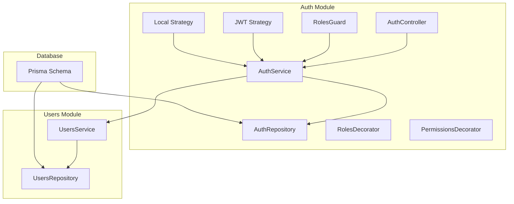
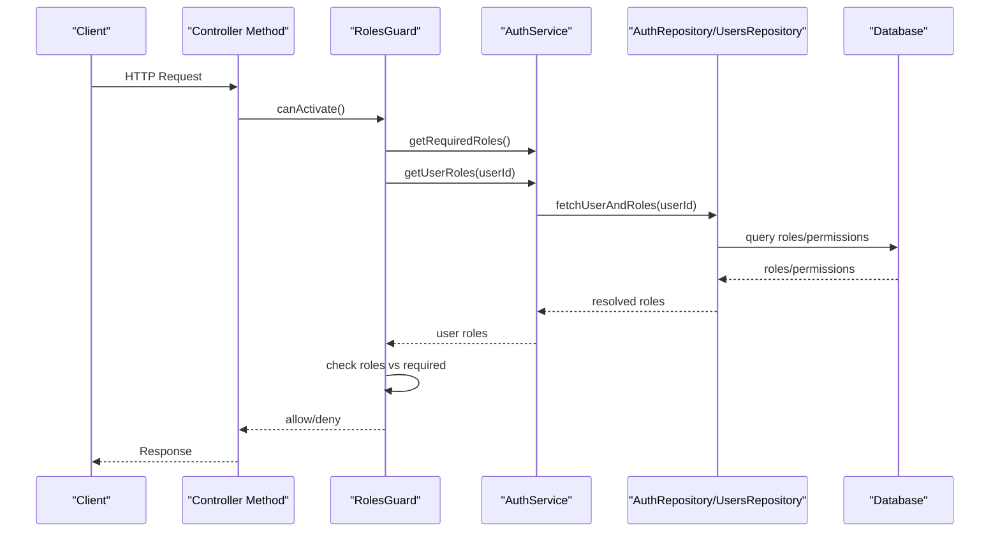
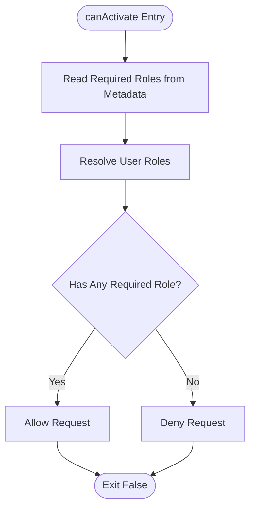
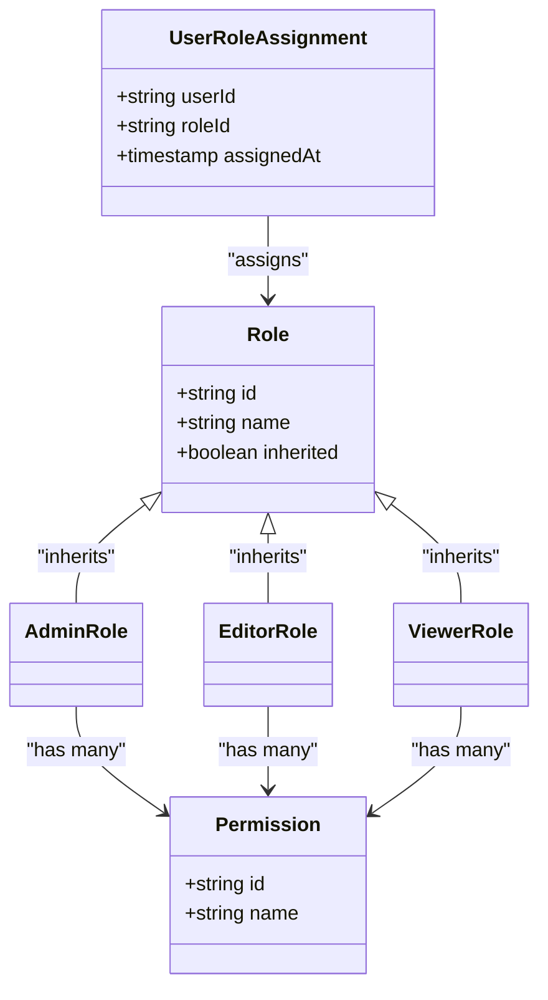
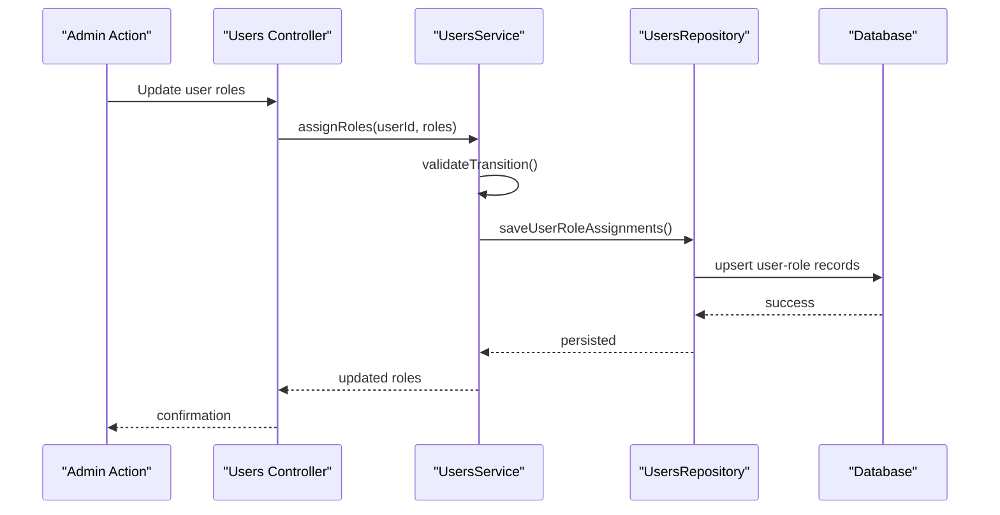
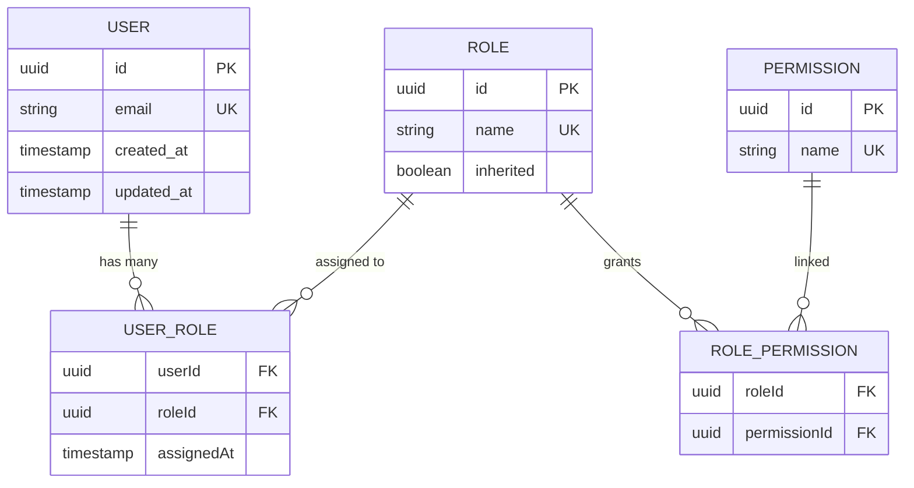
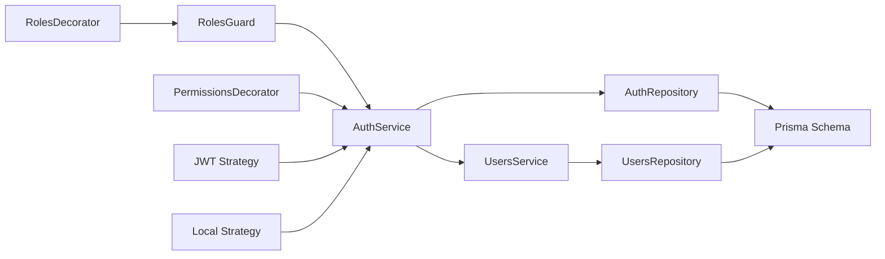

# Role-Based Access Control (RBAC)

<cite>
**Referenced Files in This Document**
- [auth.module.ts](file://apps/backend/src/auth/auth.module.ts)
- [auth.controller.ts](file://apps/backend/src/auth/auth.controller.ts)
- [auth.service.ts](file://apps/backend/src/auth/auth.service.ts)
- [auth.repository.ts](file://apps/backend/src/auth/auth.repository.ts)
- [jwt.strategy.ts](file://apps/backend/src/auth/strategies/jwt.strategy.ts)
- [local.strategy.ts](file://apps/backend/src/auth/strategies/local.strategy.ts)
- [roles.guard.ts](file://apps/backend/src/auth/guards/roles.guard.ts)
- [permissions.decorator.ts](file://apps/backend/src/auth/decorators/permissions.decorator.ts)
- [roles.decorator.ts](file://apps/backend/src/auth/decorators/roles.decorator.ts)
- [user.roles.service.ts](file://apps/backend/src/auth/services/user.roles.service.ts)
- [users.service.ts](file://apps/backend/src/users/users.service.ts)
- [users.repository.ts](file://apps/backend/src/users/users.repository.ts)
- [schema.prisma](file://apps/backend/prisma/schema.prisma)
- [0_init](file://apps/backend/prisma/migrations/0_init)
</cite>

## Table of Contents
1. [Introduction](#introduction)
2. [Project Structure](#project-structure)
3. [Core Components](#core-components)
4. [Architecture Overview](#architecture-overview)
5. [Detailed Component Analysis](#detailed-component-analysis)
6. [Dependency Analysis](#dependency-analysis)
7. [Performance Considerations](#performance-considerations)
8. [Troubleshooting Guide](#troubleshooting-guide)
9. [Conclusion](#conclusion)
10. [Appendices](#appendices)

## Introduction
This document explains the role-based access control (RBAC) system implemented in the backend. It covers how roles and permissions are modeled, stored, validated, and enforced at request time. It also documents the roles guard for route protection, the roles decorator for declaring required roles, permission inheritance, dynamic role assignment, and migration strategies to maintain backward compatibility.

## Project Structure
The RBAC implementation is primarily located under the auth module with supporting services and repositories in users and core modules. The database schema defines user entities and their relationships to roles and permissions.

**Diagram sources**
- [auth.controller.ts](file://apps/backend/src/auth/auth.controller.ts)
- [auth.service.ts](file://apps/backend/src/auth/auth.service.ts)
- [auth.repository.ts](file://apps/backend/src/auth/auth.repository.ts)
- [users.service.ts](file://apps/backend/src/users/users.service.ts)
- [users.repository.ts](file://apps/backend/src/users/users.repository.ts)
- [schema.prisma](file://apps/backend/prisma/schema.prisma)

**Section sources**
- [auth.module.ts](file://apps/backend/src/auth/auth.module.ts)
- [schema.prisma](file://apps/backend/prisma/schema.prisma)

## Core Components
- Roles Guard: Enforces role requirements on routes by checking the authenticated user’s roles against declared requirements.
- Roles Decorator: Declares which roles are required to access a controller method or route.
- Permissions Decorator: Declares specific permissions required for an endpoint.
- Auth Service: Orchestrates authentication flows and provides role/permission checks.
- Users Service: Manages user data including role assignments and updates.
- Strategies: JWT and Local strategies integrate with NestJS guards to validate tokens and credentials.
- Repositories: Data access layer for users and authentication-related operations.

Key responsibilities:
- Validate incoming requests using strategies.
- Resolve user roles and permissions from storage.
- Enforce authorization via guards and decorators.
- Provide utilities for dynamic role assignment and permission checks.

**Section sources**
- [roles.guard.ts](file://apps/backend/src/auth/guards/roles.guard.ts)
- [roles.decorator.ts](file://apps/backend/src/auth/decorators/roles.decorator.ts)
- [permissions.decorator.ts](file://apps/backend/src/auth/decorators/permissions.decorator.ts)
- [auth.service.ts](file://apps/backend/src/auth/auth.service.ts)
- [users.service.ts](file://apps/backend/src/users/users.service.ts)
- [jwt.strategy.ts](file://apps/backend/src/auth/strategies/jwt.strategy.ts)
- [local.strategy.ts](file://apps/backend/src/auth/strategies/local.strategy.ts)

## Architecture Overview
The RBAC architecture integrates authentication strategies with authorization guards and decorators. Requests flow through controllers that may be protected by the roles guard. The guard consults the auth service to resolve roles and permissions from the repository layer and enforce access based on declared requirements.

**Diagram sources**
- [roles.guard.ts](file://apps/backend/src/auth/guards/roles.guard.ts)
- [auth.service.ts](file://apps/backend/src/auth/auth.service.ts)
- [auth.repository.ts](file://apps/backend/src/auth/auth.repository.ts)
- [users.repository.ts](file://apps/backend/src/users/users.repository.ts)

## Detailed Component Analysis

### Roles Guard Implementation
The roles guard enforces route-level authorization by comparing the authenticated user’s roles against the roles declared via the roles decorator. It integrates with NestJS execution context to read metadata and validates access before invoking the controller method.

Key behaviors:
- Reads required roles from decorator metadata.
- Resolves current user’s roles from session/token payload.
- Allows access if user has any of the required roles; denies otherwise.
- Supports optional role checks and custom error responses.

**Diagram sources**
- [roles.guard.ts](file://apps/backend/src/auth/guards/roles.guard.ts)

**Section sources**
- [roles.guard.ts](file://apps/backend/src/auth/guards/roles.guard.ts)

### Roles Decorator
The roles decorator declares the minimum set of roles required to access a controller method. It attaches metadata that the roles guard consumes during request processing.

Usage patterns:
- Protect endpoints with a single role.
- Protect endpoints with multiple roles (OR logic).
- Combine with other decorators for layered authorization.

**Section sources**
- [roles.decorator.ts](file://apps/backend/src/auth/decorators/roles.decorator.ts)

### Permissions Decorator
The permissions decorator specifies granular permissions required for an endpoint. It complements role-based checks by enabling fine-grained authorization beyond roles.

Behavior:
- Attaches permission metadata to methods/routes.
- Can be used alongside roles for defense-in-depth.
- Evaluated by guards or middleware when implementing permission checks.

**Section sources**
- [permissions.decorator.ts](file://apps/backend/src/auth/decorators/permissions.decorator.ts)

### User Role Hierarchy and Permission Inheritance
Role hierarchy models relationships between roles where higher-level roles inherit permissions from lower-level roles. Permission inheritance ensures consistent access across nested roles without duplicating permission definitions.

Conceptual model:
- Base roles define foundational permissions.
- Composite roles aggregate base roles and additional permissions.
- Resolution computes effective permissions by traversing the hierarchy.

[No sources needed since this diagram shows conceptual workflow, not actual code structure]

### Dynamic Role Assignment
Dynamic role assignment allows runtime modification of user roles based on business rules, administrative actions, or events. The users service typically exposes methods to add, remove, or update roles for a user.

Typical flow:
- Admin action triggers role change.
- Validation ensures allowed transitions.
- Persistence updates user-role associations.
- Cache invalidation refreshes role resolution.

**Diagram sources**
- [users.service.ts](file://apps/backend/src/users/users.service.ts)
- [users.repository.ts](file://apps/backend/src/users/users.repository.ts)

**Section sources**
- [users.service.ts](file://apps/backend/src/users/users.service.ts)
- [users.repository.ts](file://apps/backend/src/users/users.repository.ts)

### Storage, Validation, and Enforcement
- Storage: User roles and permissions are persisted via Prisma schema and accessed through repositories.
- Validation: Input validation ensures role names exist and transitions are permitted.
- Enforcement: Guards and decorators enforce access at request boundaries; strategies validate identity and token integrity.

**Diagram sources**
- [schema.prisma](file://apps/backend/prisma/schema.prisma)

**Section sources**
- [auth.repository.ts](file://apps/backend/src/auth/auth.repository.ts)
- [users.repository.ts](file://apps/backend/src/users/users.repository.ts)
- [schema.prisma](file://apps/backend/prisma/schema.prisma)

### Example: Protecting Endpoints with Different Role Requirements
- Public endpoints: No roles required.
- User endpoints: Require authenticated user role.
- Editor endpoints: Require editor role or higher.
- Admin endpoints: Require admin role.

Implementation pattern:
- Apply roles decorator to controller methods specifying required roles.
- Use global roles guard for default enforcement.
- Optionally combine with permissions decorator for fine-grained control.

[No sources needed since this section provides general guidance]

### Implementing Custom Authorization Logic
Custom authorization can be implemented by extending the roles guard or creating a new guard that evaluates additional conditions such as ownership, resource-specific permissions, or policy rules.

Steps:
- Create a guard class implementing NestJS CanActivate interface.
- Inject dependencies (e.g., users service, cache).
- Override canActivate to evaluate custom logic.
- Register guard globally or per-route.

[No sources needed since this section provides general guidance]

## Dependency Analysis
The RBAC components depend on each other and external services as follows:

**Diagram sources**
- [roles.guard.ts](file://apps/backend/src/auth/guards/roles.guard.ts)
- [roles.decorator.ts](file://apps/backend/src/auth/decorators/roles.decorator.ts)
- [permissions.decorator.ts](file://apps/backend/src/auth/decorators/permissions.decorator.ts)
- [auth.service.ts](file://apps/backend/src/auth/auth.service.ts)
- [auth.repository.ts](file://apps/backend/src/auth/auth.repository.ts)
- [users.service.ts](file://apps/backend/src/users/users.service.ts)
- [users.repository.ts](file://apps/backend/src/users/users.repository.ts)
- [jwt.strategy.ts](file://apps/backend/src/auth/strategies/jwt.strategy.ts)
- [local.strategy.ts](file://apps/backend/src/auth/strategies/local.strategy.ts)
- [schema.prisma](file://apps/backend/prisma/schema.prisma)

**Section sources**
- [auth.module.ts](file://apps/backend/src/auth/auth.module.ts)

## Performance Considerations
- Cache user roles and permissions to reduce database queries on each request.
- Use efficient Prisma queries with selective field retrieval.
- Avoid deep role hierarchy traversal on hot paths; precompute effective permissions where possible.
- Employ short-lived tokens and refresh mechanisms to minimize stateful checks.

[No sources needed since this section provides general guidance]

## Troubleshooting Guide
Common issues and resolutions:
- Missing roles decorator: Ensure required roles are declared on protected endpoints.
- Incorrect role names: Validate role names against the database schema.
- Token validation failures: Check JWT configuration and secret rotation.
- Permission denied errors: Verify user role assignments and inheritance rules.
- Migration conflicts: Review migration history and ensure schema consistency.

**Section sources**
- [auth.controller.ts](file://apps/backend/src/auth/auth.controller.ts)
- [auth.service.ts](file://apps/backend/src/auth/auth.service.ts)

## Conclusion
The RBAC system provides robust role and permission management through guards, decorators, and services integrated with authentication strategies. By modeling role hierarchies, enforcing permissions at request boundaries, and supporting dynamic role assignment, the system enables secure and flexible access control. Proper migration strategies and caching ensure backward compatibility and performance.

[No sources needed since this section summarizes without analyzing specific files]

## Appendices

### Migration Strategies and Backward Compatibility
- Add new roles incrementally with default assignments.
- Use feature flags to enable new authorization logic gradually.
- Maintain dual-write support during migrations to avoid downtime.
- Validate schema changes with tests and rollback plans.

**Section sources**
- [0_init](file://apps/backend/prisma/migrations/0_init)
- [schema.prisma](file://apps/backend/prisma/schema.prisma)