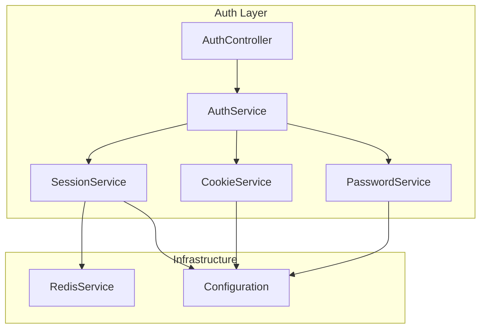
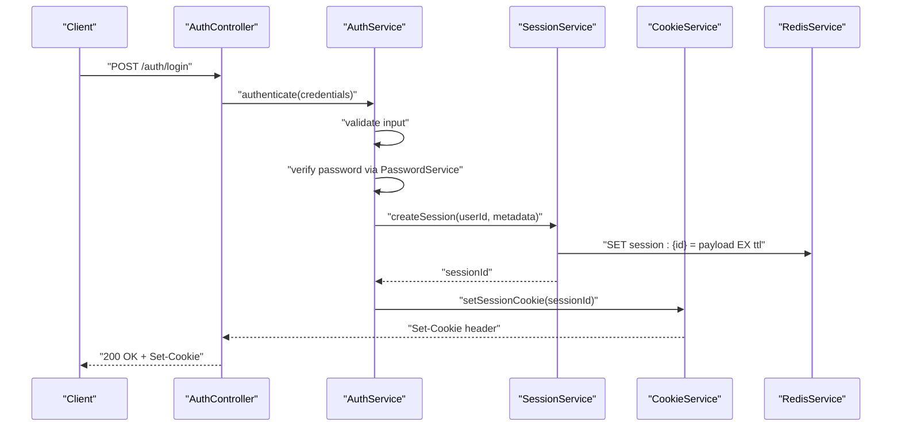
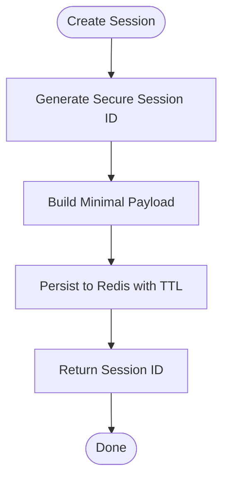
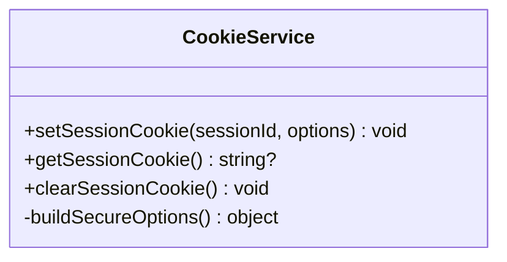
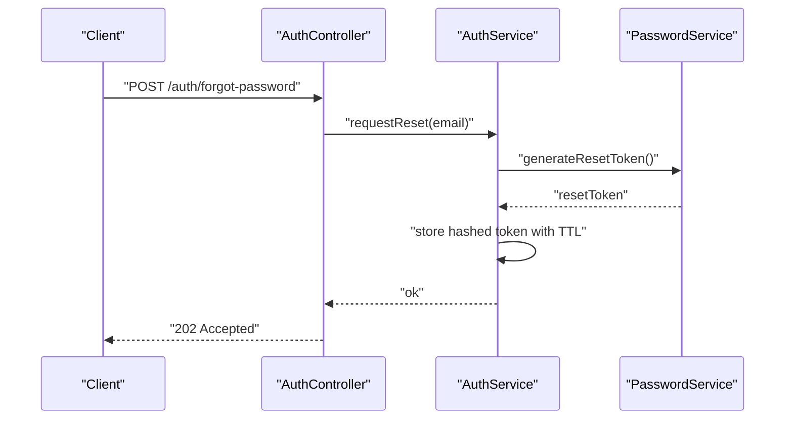
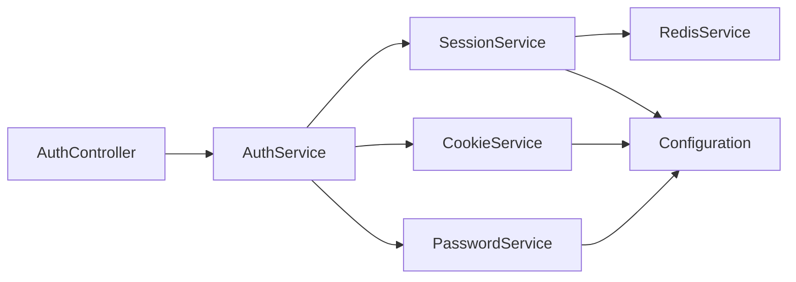

# Session Management & Security

<cite>
**Referenced Files in This Document**
- [auth.service.ts](file://apps/backend/src/auth/services/auth.service.ts)
- [session.service.ts](file://apps/backend/src/auth/services/session.service.ts)
- [cookie.service.ts](file://apps/backend/src/auth/services/cookie.service.ts)
- [password.service.ts](file://apps/backend/src/auth/services/password.service.ts)
- [redis.service.ts](file://apps/backend/src/redis/redis.service.ts)
- [configuration.ts](file://apps/backend/src/config/configuration.ts)
- [env.validation.ts](file://apps/backend/src/config/env.validation.ts)
- [auth.module.ts](file://apps/backend/src/auth/auth.module.ts)
- [auth.controller.ts](file://apps/backend/src/auth/auth.controller.ts)
- [security.md](file://docs/SECURITY.md)
</cite>

## Table of Contents
1. [Introduction](#introduction)
2. [Project Structure](#project-structure)
3. [Core Components](#core-components)
4. [Architecture Overview](#architecture-overview)
5. [Detailed Component Analysis](#detailed-component-analysis)
6. [Dependency Analysis](#dependency-analysis)
7. [Performance Considerations](#performance-considerations)
8. [Troubleshooting Guide](#troubleshooting-guide)
9. [Conclusion](#conclusion)
10. [Appendices](#appendices)

## Introduction
This document explains the session management and security implementations used to authenticate users, manage sessions, handle cookies securely, and protect passwords. It focuses on:
- SessionService for creating, validating, and persisting user sessions using Redis caching.
- CookieService for secure cookie operations including httpOnly flags, secure attributes, and CSRF protection considerations.
- PasswordService for password hashing with bcrypt, validation rules, and password reset flows.
- Security best practices for session storage, cookie configuration, and password policies.

## Project Structure
The backend organizes authentication-related logic under apps/backend/src/auth with supporting services for Redis and configuration. The key files relevant to this documentation are located in:
- apps/backend/src/auth/services: Session, Cookie, Password, and Auth services.
- apps/backend/src/redis: Redis client service.
- apps/backend/src/config: Configuration and environment validation.
- apps/backend/src/auth: Controllers and module wiring.

**Diagram sources**
- [auth.controller.ts](file://apps/backend/src/auth/auth.controller.ts)
- [auth.service.ts](file://apps/backend/src/auth/services/auth.service.ts)
- [session.service.ts](file://apps/backend/src/auth/services/session.service.ts)
- [cookie.service.ts](file://apps/backend/src/auth/services/cookie.service.ts)
- [password.service.ts](file://apps/backend/src/auth/services/password.service.ts)
- [redis.service.ts](file://apps/backend/src/redis/redis.service.ts)
- [configuration.ts](file://apps/backend/src/config/configuration.ts)

**Section sources**
- [auth.module.ts](file://apps/backend/src/auth/auth.module.ts)
- [configuration.ts](file://apps/backend/src/config/configuration.ts)
- [env.validation.ts](file://apps/backend/src/config/env.validation.ts)

## Core Components
- SessionService: Manages session lifecycle (create, read, update, delete), stores session data in Redis, and enforces expiration and rotation.
- CookieService: Creates and validates cookies with secure flags (httpOnly, secure, sameSite), handles token storage strategies, and supports CSRF mitigation patterns.
- PasswordService: Hashes and verifies passwords using bcrypt, enforces validation rules, and supports password reset workflows.
- RedisService: Provides a typed interface to Redis for fast session persistence and cache operations.
- Configuration: Centralizes environment variables for session timeouts, cookie settings, and security parameters.

**Section sources**
- [session.service.ts](file://apps/backend/src/auth/services/session.service.ts)
- [cookie.service.ts](file://apps/backend/src/auth/services/cookie.service.ts)
- [password.service.ts](file://apps/backend/src/auth/services/password.service.ts)
- [redis.service.ts](file://apps/backend/src/redis/redis.service.ts)
- [configuration.ts](file://apps/backend/src/config/configuration.ts)

## Architecture Overview
The authentication flow integrates controllers, services, and infrastructure components to ensure secure session handling and password protection.

**Diagram sources**
- [auth.controller.ts](file://apps/backend/src/auth/auth.controller.ts)
- [auth.service.ts](file://apps/backend/src/auth/services/auth.service.ts)
- [session.service.ts](file://apps/backend/src/auth/services/session.service.ts)
- [cookie.service.ts](file://apps/backend/src/auth/services/cookie.service.ts)
- [redis.service.ts](file://apps/backend/src/redis/redis.service.ts)

## Detailed Component Analysis

### SessionService
Responsibilities:
- Create sessions with unique identifiers and attach minimal user context.
- Persist sessions in Redis with configurable TTL and optional sliding expiration.
- Validate sessions by checking existence and expiry.
- Rotate or invalidate sessions on sensitive actions (e.g., login, logout).
- Support concurrent access safely through atomic Redis operations.

Key behaviors:
- Session IDs are generated securely and stored as keys in Redis.
- Session payloads include only necessary claims to minimize exposure.
- Expiration is enforced at read time; background cleanup can be configured separately.

Security considerations:
- Use short-lived sessions and rotate tokens on privilege changes.
- Avoid storing sensitive data in session payloads.
- Ensure Redis is secured (TLS, auth, network isolation).

**Diagram sources**
- [session.service.ts](file://apps/backend/src/auth/services/session.service.ts)
- [redis.service.ts](file://apps/backend/src/redis/redis.service.ts)

**Section sources**
- [session.service.ts](file://apps/backend/src/auth/services/session.service.ts)
- [redis.service.ts](file://apps/backend/src/redis/redis.service.ts)

### CookieService
Responsibilities:
- Set and get cookies with strict security attributes.
- Enforce httpOnly to prevent JavaScript access.
- Enforce secure flag for HTTPS-only transmission.
- Configure sameSite to mitigate CSRF risks.
- Provide helpers for rotating or clearing session cookies.

Best practices:
- Always set httpOnly and secure for session cookies.
- Use sameSite=Strict or Lax depending on cross-site needs.
- Keep cookie size small; avoid embedding secrets.
- Implement CSRF protection on state-changing endpoints.

**Diagram sources**
- [cookie.service.ts](file://apps/backend/src/auth/services/cookie.service.ts)

**Section sources**
- [cookie.service.ts](file://apps/backend/src/auth/services/cookie.service.ts)

### PasswordService
Responsibilities:
- Hash passwords using bcrypt with appropriate cost factor.
- Verify plaintext against stored hashes securely.
- Enforce password validation rules (length, complexity).
- Support password reset workflow (generate token, store securely, expire).

Validation and policy:
- Reject weak passwords based on length and character diversity.
- Prevent common passwords and dictionary words where feasible.
- Enforce periodic rotation policies if required.

Reset flow:
- Generate a secure, single-use reset token.
- Store hashed token with expiry in Redis or database.
- Invalidate token after use or expiration.

**Diagram sources**
- [password.service.ts](file://apps/backend/src/auth/services/password.service.ts)
- [auth.controller.ts](file://apps/backend/src/auth/auth.controller.ts)

**Section sources**
- [password.service.ts](file://apps/backend/src/auth/services/password.service.ts)

### RedisService
Responsibilities:
- Provide a typed interface for Redis commands used by SessionService.
- Manage connection pooling and error handling.
- Support atomic operations for session updates and checks.

Operational notes:
- Ensure TLS and authentication are enabled in production.
- Monitor memory usage and eviction policies.
- Use separate Redis instances or namespaces per environment.

**Section sources**
- [redis.service.ts](file://apps/backend/src/redis/redis.service.ts)

### Configuration and Environment Validation
Responsibilities:
- Centralize session TTL, cookie flags, and security settings.
- Validate environment variables at startup to fail fast on misconfiguration.
- Provide defaults suitable for development while enforcing strictness in production.

Key settings:
- Session TTL and sliding window behavior.
- Cookie domain, path, sameSite, secure, httpOnly.
- Bcrypt cost factor and password policy thresholds.
- Redis connection details and TLS flags.

**Section sources**
- [configuration.ts](file://apps/backend/src/config/configuration.ts)
- [env.validation.ts](file://apps/backend/src/config/env.validation.ts)

## Dependency Analysis
The following diagram shows how core components depend on each other and shared configuration.

**Diagram sources**
- [auth.controller.ts](file://apps/backend/src/auth/auth.controller.ts)
- [auth.service.ts](file://apps/backend/src/auth/services/auth.service.ts)
- [session.service.ts](file://apps/backend/src/auth/services/session.service.ts)
- [cookie.service.ts](file://apps/backend/src/auth/services/cookie.service.ts)
- [password.service.ts](file://apps/backend/src/auth/services/password.service.ts)
- [redis.service.ts](file://apps/backend/src/redis/redis.service.ts)
- [configuration.ts](file://apps/backend/src/config/configuration.ts)

**Section sources**
- [auth.module.ts](file://apps/backend/src/auth/auth.module.ts)

## Performance Considerations
- Prefer Redis over database for session storage due to low latency and high throughput.
- Keep session payloads minimal to reduce serialization overhead.
- Use sliding expiration judiciously; it increases Redis writes.
- Tune Redis memory limits and eviction policies to avoid accidental data loss.
- Cache frequently accessed user profiles separately from session data.

[No sources needed since this section provides general guidance]

## Troubleshooting Guide
Common issues and resolutions:
- Sessions not persisting: Check Redis connectivity, credentials, and namespace isolation.
- Cookies not sent: Verify secure and sameSite flags match the deployment scheme (HTTPS vs HTTP).
- Frequent logouts: Review session TTL and sliding expiration settings.
- Password reset tokens expiring too quickly: Adjust token TTL and ensure correct timezone handling.
- CSRF errors: Ensure sameSite is configured appropriately and implement anti-CSRF tokens for state-changing requests.

**Section sources**
- [session.service.ts](file://apps/backend/src/auth/services/session.service.ts)
- [cookie.service.ts](file://apps/backend/src/auth/services/cookie.service.ts)
- [password.service.ts](file://apps/backend/src/auth/services/password.service.ts)
- [redis.service.ts](file://apps/backend/src/redis/redis.service.ts)
- [configuration.ts](file://apps/backend/src/config/configuration.ts)

## Conclusion
The system implements robust session management and security through dedicated services for sessions, cookies, and passwords, backed by Redis for performance and reliability. By adhering to the outlined best practices—secure cookie configuration, strong password policies, and careful session storage—you can maintain a secure and scalable authentication experience.

[No sources needed since this section summarizes without analyzing specific files]

## Appendices

### Security Best Practices
- Session storage:
  - Use Redis with TLS and authentication.
  - Limit session payload to non-sensitive claims.
  - Rotate session IDs on login and privilege escalation.
- Cookie configuration:
  - Set httpOnly, secure, and sameSite appropriately.
  - Avoid storing secrets in cookies.
  - Implement CSRF protection for all state-changing endpoints.
- Password policies:
  - Enforce minimum length and complexity.
  - Use bcrypt with an adequate cost factor.
  - Support secure password reset with single-use, time-limited tokens.

**Section sources**
- [security.md](file://docs/SECURITY.md)
- [configuration.ts](file://apps/backend/src/config/configuration.ts)
- [env.validation.ts](file://apps/backend/src/config/env.validation.ts)